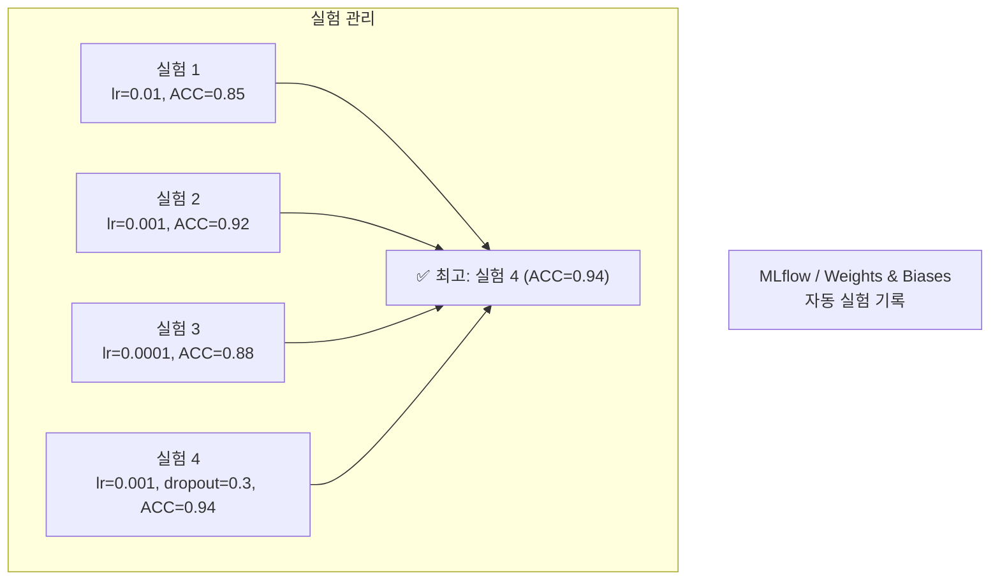
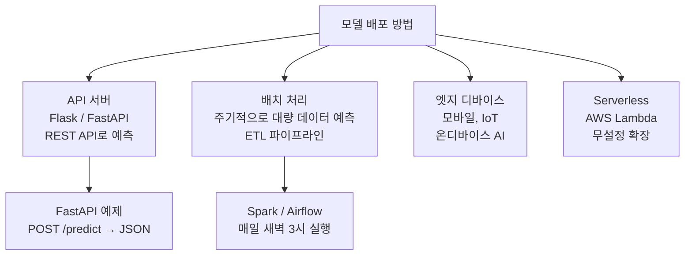
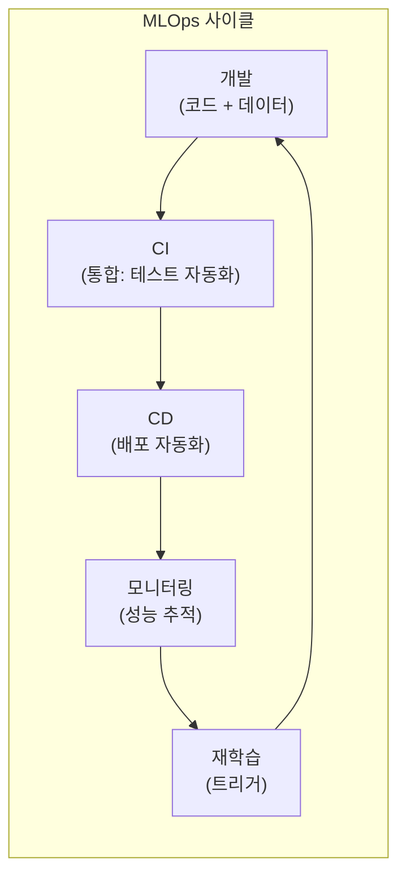
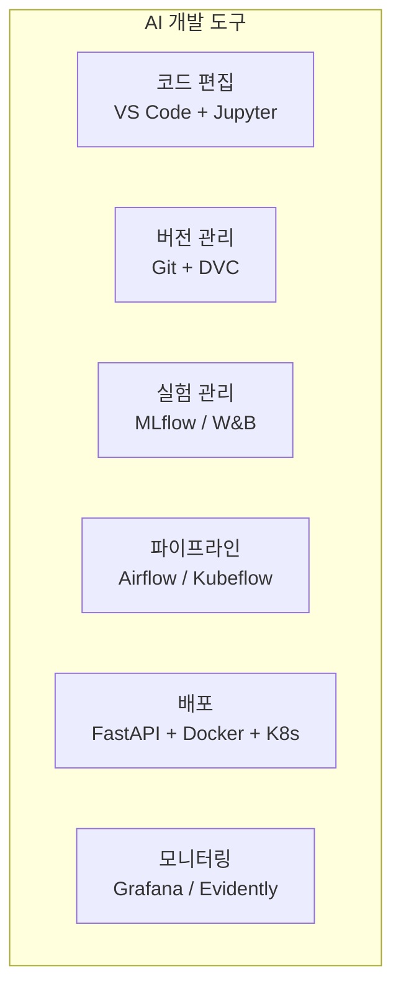

# 14장: AI 개발 워크플로우

> **🎯 학습 목표**
> - AI 프로젝트의 전체 생애주기를 이해합니다.
> - 프로젝트 구조와 실험 관리 도구를 사용할 수 있습니다.
> - 모델을 저장하고 배포하는 방법을 이해합니다.
> - MLOps의 기본 개념을 파악합니다.

---

## 14.1 AI 프로젝트 생애주기

AI 프로젝트는 단순히 모델을 학습하는 것 이상으로, **데이터부터 배포까지**의 전체 과정을 포함합니다.

```mermaid
flowchart TB
  Subgraph Lifecycle[AI 프로젝트 생애주기]
    Step1["1. 문제 정의<br/>비즈니스 목표 → ML 문제"] --> Step2["2. 데이터 수집<br/>내부 DB, 외부 API, 크롤링"]
    Step2 --> Step3["3. 데이터 전처리<br/>(가장 많은 시간 소요)"]
    Step3 --> Step4["4. 모델 개발<br/>실험, 튜닝, 평가"]
    Step4 --> Step5["5. 모델 배포<br/>API 서버, 앱, 웹"]
    Step5 --> Step6["6. 모니터링<br/>성능 저하 감지"]
    Step6 --> Step7["7. 재학습<br/>새 데이터로 업데이트"]

    Step7 -.-> Step3
    Step6 -.-> Step7
  end

  Ref_Note["참고: 데이터 전처리가<br/>프로젝트 시간의 60-80%"]
```

---

## 14.2 프로젝트 구조

일관된 프로젝트 구조는 **재현성과 협업**에 필수적입니다.

```
my_ml_project/
├── data/                  # 데이터 (git에 포함 X)
│   ├── raw/               # 원본 데이터
│   ├── processed/         # 전처리된 데이터
│   └── external/          # 외부 데이터
│
├── notebooks/             # Jupyter Notebook (실험)
│   ├── 01_eda.ipynb
│   ├── 02_preprocessing.ipynb
│   └── 03_modeling.ipynb
│
├── src/                   # 재사용 가능한 코드
│   ├── __init__.py
│   ├── data/
│   │   ├── make_dataset.py
│   │   └── preprocessing.py
│   ├── models/
│   │   ├── train.py
│   │   └── predict.py
│   └── utils/
│       └── metrics.py
│
├── models/                # 저장된 모델 파일
│   └── best_model.pkl
│
├── reports/               # 결과, 시각화, 리포트
│   └── figures/
│
├── configs/               # 설정 파일
│   └── config.yaml
│
├── requirements.txt       # 의존성
├── Dockerfile             # 컨테이너
├── Makefile               # 자동화
└── README.md              # 프로젝트 설명
```

```python
# 프로젝트 설정 관리
import os
from pathlib import Path

class ProjectConfig:
    """프로젝트 경로와 설정을 관리하는 클래스"""
    ROOT = Path(__file__).parent.parent

    # 데이터 경로
    DATA_DIR = ROOT / 'data'
    RAW_DIR = DATA_DIR / 'raw'
    PROCESSED_DIR = DATA_DIR / 'processed'

    # 모델 경로
    MODELS_DIR = ROOT / 'models'

    # 하이퍼파라미터
    RANDOM_SEED = 42
    TEST_SIZE = 0.2
    VAL_SIZE = 0.1

    def create_dirs(self):
        """필요한 디렉토리 생성"""
        for dir_path in [self.RAW_DIR, self.PROCESSED_DIR, self.MODELS_DIR]:
            dir_path.mkdir(parents=True, exist_ok=True)

config = ProjectConfig()
config.create_dirs()
print(f"데이터 디렉토리: {config.RAW_DIR}")
print(f"모델 디렉토리: {config.MODELS_DIR}")
```

---

## 14.3 실험 관리 (Experiment Tracking)

AI 개발에서 **무수한 실험을 체계적으로 관리**하는 것이 중요합니다.



```python
# MLflow를 사용한 실험 관리 (개념)
"""
import mlflow

mlflow.set_experiment("iris-classification")

with mlflow.start_run():
    # 파라미터 기록
    mlflow.log_param("model", "RandomForest")
    mlflow.log_param("n_estimators", 100)
    mlflow.log_param("max_depth", 10)

    # 코드 실행
    model = RandomForestClassifier(n_estimators=100, max_depth=10)
    model.fit(X_train, y_train)
    accuracy = model.score(X_test, y_test)

    # 결과 기록
    mlflow.log_metric("accuracy", accuracy)

    # 모델 저장
    mlflow.sklearn.log_model(model, "model")
"""

# 간단한 직접 구현
import json
from datetime import datetime

class ExperimentTracker:
    def __init__(self):
        self.history = []

    def log_experiment(self, model_name, params, metrics):
        experiment = {
            "timestamp": datetime.now().isoformat(),
            "model": model_name,
            "params": params,
            "metrics": metrics
        }
        self.history.append(experiment)
        print(f"실험 기록 완료: {model_name} - {metrics}")

    def get_best(self, metric_name="accuracy"):
        sorted_exps = sorted(
            self.history,
            key=lambda x: x["metrics"].get(metric_name, 0),
            reverse=True
        )
        return sorted_exps[0] if sorted_exps else None

    def save(self, path="experiments.json"):
        with open(path, 'w') as f:
            json.dump(self.history, f, indent=2)

tracker = ExperimentTracker()
tracker.log_experiment("RandomForest", {"n_estimators": 100}, {"accuracy": 0.91})
tracker.log_experiment("XGBoost", {"n_estimators": 100}, {"accuracy": 0.94})
tracker.log_experiment("SVM", {"C": 1.0}, {"accuracy": 0.88})

best = tracker.get_best()
print(f"\n최고 실험: {best['model']} - {best['metrics']}")
```

---

## 14.4 모델 저장 및 로드

학습한 모델을 저장하고 나중에 다시 사용할 수 있어야 합니다.

```python
import joblib
import pickle
from sklearn.ensemble import RandomForestClassifier
from sklearn.datasets import load_iris

# 모델 학습
iris = load_iris()
model = RandomForestClassifier(n_estimators=100)
model.fit(iris.data, iris.target)

# 방법 1: joblib (추천, 대용량에 효율적)
joblib.dump(model, 'iris_model.joblib')
loaded_model = joblib.load('iris_model.joblib')
print(f"joblib으로 로드: {loaded_model.predict(iris.data[:1])}")

# 방법 2: pickle (기본)
with open('iris_model.pkl', 'wb') as f:
    pickle.dump(model, f)

with open('iris_model.pkl', 'rb') as f:
    loaded_model2 = pickle.load(f)
print(f"pickle로 로드: {loaded_model2.predict(iris.data[:1])}")

# PyTorch 모델 저장
import torch
import torch.nn as nn

class SimpleModel(nn.Module):
    def __init__(self):
        super().__init__()
        self.fc = nn.Linear(4, 3)

    def forward(self, x):
        return self.fc(x)

pt_model = SimpleModel()
torch.save(pt_model.state_dict(), 'simple_model.pt')
pt_model.load_state_dict(torch.load('simple_model.pt'))
print("PyTorch 모델 저장/로드 완료")
```

---

## 14.5 모델 배포 (Model Deployment)

모델을 실제 서비스에 배포하는 방법에는 여러 가지가 있습니다.



### 14.5.1 FastAPI 배포

```python
# model_api.py - FastAPI 서버
"""
from fastapi import FastAPI
from pydantic import BaseModel
import joblib
import numpy as np

app = FastAPI()
model = joblib.load('iris_model.joblib')

class InputData(BaseModel):
    features: list[float]

class Prediction(BaseModel):
    prediction: int
    probability: list[float]

@app.get("/")
def root():
    return {"message": "Iris Classifier API"}

@app.post("/predict", response_model=Prediction)
def predict(data: InputData):
    X = np.array(data.features).reshape(1, -1)
    pred = model.predict(X)[0]
    prob = model.predict_proba(X)[0].tolist()
    return Prediction(prediction=int(pred), probability=prob)
"""

# Dockerfile
"""
FROM python:3.10-slim
WORKDIR /app
COPY requirements.txt .
RUN pip install -r requirements.txt
COPY . .
CMD ["uvicorn", "model_api:app", "--host", "0.0.0.0", "--port", "8000"]
"""

# 실행 (터미널)
# uvicorn model_api:app --reload

# 요청
# curl -X POST "http://localhost:8000/predict" \
#   -H "Content-Type: application/json" \
#   -d '{"features": [5.1, 3.5, 1.4, 0.2]}'
```

### 14.5.2 ONNX로 모델 변환

ONNX(Open Neural Network Exchange)는 **다른 프레임워크 간 모델 교환**을 위한 표준 형식입니다.

```python
# PyTorch → ONNX 변환
"""
import torch.onnx

dummy_input = torch.randn(1, 4)
torch.onnx.export(
    pt_model,
    dummy_input,
    "model.onnx",
    input_names=['input'],
    output_names=['output']
)
"""
```

---

## 14.6 MLOps 기본 개념

**MLOps**는 ML 모델의 개발과 운영을 결합한 **데브옵스(DevOps)의 ML 버전**입니다.



### MLOps 핵심 구성 요소

| 구성 요소 | 도구 예시 | 설명 |
|-----------|---------|------|
| **버전 관리** | Git, DVC | 코드 + 데이터 + 모델 버전 관리 |
| **실험 관리** | MLflow, W&B | 실험 추적, 비교 |
| **파이프라인** | Airflow, Kubeflow | 자동화된 ML 워크플로우 |
| **배포** | FastAPI, Docker, K8s | 모델 서빙 |
| **모니터링** | Prometheus, Grafana | 성능, 데이터 드리프트 감지 |

```python
# MLOps 체크리스트
mlops_checklist = """
✅ 프로젝트 구조: 표준화된 디렉토리
✅ 데이터 버전 관리: DVC 또는 유사 도구
✅ 코드 버전 관리: Git (feature branch)
✅ 재현성: requirements.txt + Docker
✅ 실험 기록: MLflow
✅ 자동화된 테스트: pytest
✅ CI/CD: GitHub Actions
✅ 배포: Docker 컨테이너
✅ 모니터링: 성능 대시보드
"""

print(mlops_checklist)
```

---

## 14.7 AI 개발자 도구 요약



---

## 📋 한눈에 정리

| 단계 | 설명 | 주요 도구 |
|------|------|----------|
| **문제 정의** | ML로 해결할 문제 명확히 | - |
| **데이터 준비** | 수집, 전처리, 분할 | Pandas, NumPy |
| **모델 개발** | 실험, 튜닝, 평가 | MLflow, W&B |
| **배포** | API 서버, 앱 | FastAPI, Docker |
| **모니터링** | 성능, 드리프트 감지 | Grafana, Evidently |
| **재학습** | 새 데이터로 업데이트 | Airflow, Kubeflow |

---

## ✏️ 연습 문제

1. AI 프로젝트에서 **데이터 전처리가 60-80%를 차지하는 이유**는 무엇인가요?

2. **MLflow 또는 유사 도구를 사용하는 이유**를 설명하세요. 실험을 기록하지 않으면 어떤 문제가 발생하나요?

3. 다음 중 **모델 배포 방식**으로 적절하지 않은 것은?
   - a) FastAPI REST API
   - b) Docker 컨테이너
   - c) 모델을 PDF로 변환
   - d) Serverless (AWS Lambda)

4. **MLOps**가 필요한 이유를 DevOps와 비교하여 설명하세요.

5. 자신의 프로젝트에 사용할 **프로젝트 구조**를 만들어보세요. (최소 5개 디렉토리)

---

## 📝 연습 문제 정답

<details>
<summary>정답 보기</summary>

**1. 데이터 전처리가 60-80%를 차지하는 이유**
- 실제 데이터는 항상 결측치, 이상치, 중복, 노이즈를 포함
- 여러 데이터 소스의 형식과 스키마를 통일해야 함
- 도메인 지식을 활용한 특성 공학에 많은 시간 투자
- 데이터 품질이 모델 성능을 결정하므로 가장 중요한 단계
- EDA(탐색적 데이터 분석)로 데이터 특성을 이해하는 데 시간 필요

**2. MLflow 사용 이유와 실험 미기록 시 문제**
- 실험 기록의 중요성: 모든 하이퍼파라미터, 메트릭, 모델을 체계적으로 저장
- 기록하지 않으면: (1) 어떤 설정이 가장 좋았는지 기억 못 함 (2) 동일한 실험 반복 (3) 재현 불가능 (4) 팀 협업 불가능
- MLflow는 자동 로깅, 실험 비교, 모델 레지스트리 등을 제공

**3. 모델 배포 방식 중 부적절한 것**
- a) FastAPI REST API ✅ (적절)
- b) Docker 컨테이너 ✅ (적절)
- c) **모델을 PDF로 변환 ❌** (PDF는 문서 형식, 모델 실행 불가)
- d) Serverless (AWS Lambda) ✅ (적절)
→ 정답: **c**

**4. MLOps가 필요한 이유**
DevOps는 코드의 지속적 통합/배포를 자동화합니다. ML은 여기에 **데이터와 모델**이라는 추가 요소가 필요합니다:
- 데이터 버전 관리
- 모델 버전 관리
- 실험 관리
- 모델 모니터링 (데이터 드리프트, 개념 드리프트)
- 자동 재학습 파이프라인
→ MLOps는 DevOps + ML 특화 요소를 결합한 것입니다.

**5. 프로젝트 구조 예시**
```
my_project/
├── data/          # 데이터
├── notebooks/     # 실험 노트북
├── src/           # 소스 코드
├── models/        # 저장된 모델
├── configs/       # 설정 파일
├── tests/         # 테스트
├── docker/        # Dockerfile
└── docs/          # 문서
```

</details>

---

> **🔄 다음 장에서는** 지금까지 배운 모든 것을 종합하여 4개의 실전 프로젝트를 진행합니다.
