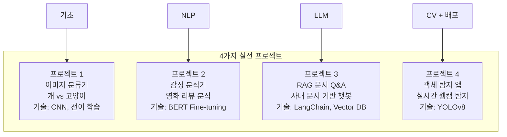
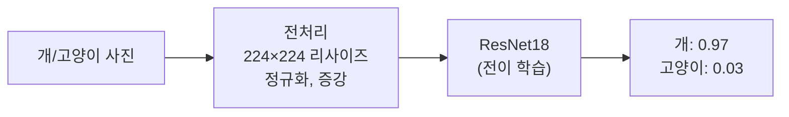
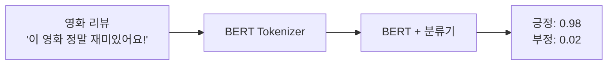
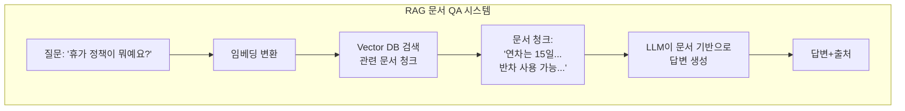
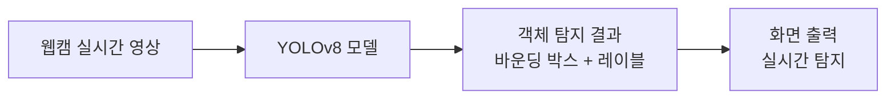

# 14장: 실전 프로젝트

> **🎯 학습 목표**
> - 지금까지 배운 내용을 종합하여 실제 프로젝트를 완성합니다.
> - 이미지 분류, 감성 분석, RAG 챗봇, 객체 탐지를 직접 구현할 수 있습니다.
> - 전체 ML 파이프라인을 경험합니다.

---

## 14.1 프로젝트 구성

이 장에서는 4개의 실전 프로젝트를 수행합니다.



---

## 14.2 프로젝트 1: 이미지 분류기 (개 vs 고양이)

### 개요
개와 고양이 사진을 분류하는 CNN 모델을 만듭니다.



```python
import torch
import torch.nn as nn
import torch.optim as optim
from torch.utils.data import DataLoader, Dataset
from torchvision import transforms, models
import numpy as np
from PIL import Image
import os

# 1. 데이터 전처리
transform = transforms.Compose([
    transforms.Resize((224, 224)),
    transforms.ToTensor(),
    transforms.Normalize(mean=[0.485, 0.456, 0.406],
                        std=[0.229, 0.224, 0.225])
])

# 데이터 증강 (학습용)
train_transform = transforms.Compose([
    transforms.Resize((256, 256)),
    transforms.RandomResizedCrop(224),
    transforms.RandomHorizontalFlip(),
    transforms.RandomRotation(15),
    transforms.ColorJitter(brightness=0.2, contrast=0.2),
    transforms.ToTensor(),
    transforms.Normalize(mean=[0.485, 0.456, 0.406],
                        std=[0.229, 0.224, 0.225])
])

# 2. 사전 학습 모델 불러오기
model = models.resnet18(pretrained=True)

# 특징 추출층 고정
for param in model.parameters():
    param.requires_grad = False

# 새 분류기 (개 0, 고양이 1)
num_features = model.fc.in_features
model.fc = nn.Sequential(
    nn.Linear(num_features, 256),
    nn.ReLU(),
    nn.Dropout(0.3),
    nn.Linear(256, 2)
)

print(f"모델 구조:\n{model}")

# 3. 학습 준비
criterion = nn.CrossEntropyLoss()
optimizer = optim.Adam(model.fc.parameters(), lr=0.001)

# 4. 학습 루프 (가상 데이터)
"""
epochs = 10
for epoch in range(epochs):
    model.train()
    for images, labels in train_loader:
        optimizer.zero_grad()
        outputs = model(images)
        loss = criterion(outputs, labels)
        loss.backward()
        optimizer.step()
    
    # 평가
    model.eval()
    accuracy = 0
    with torch.no_grad():
        for images, labels in val_loader:
            outputs = model(images)
            _, predicted = torch.max(outputs, 1)
            accuracy += (predicted == labels).sum().item()
    
    accuracy /= len(val_loader.dataset)
    print(f"Epoch {epoch+1}: Accuracy {accuracy:.4f}")
"""

# 5. 예측 함수
def predict_image(image_path, model, transform):
    image = Image.open(image_path).convert('RGB')
    image_tensor = transform(image).unsqueeze(0)  # 배치 차원 추가

    model.eval()
    with torch.no_grad():
        outputs = model(image_tensor)
        probabilities = torch.softmax(outputs, dim=1)
        _, predicted = torch.max(outputs, 1)

    classes = ['개 🐕', '고양이 🐱']
    result = {
        'prediction': classes[predicted.item()],
        'confidence': probabilities[0][predicted.item()].item()
    }
    return result

# (실제 이미지가 없으므로 예시 출력)
print("\n예측 결과 예시:")
print(f"  이미지: 'dog.jpg' → 예측: 개 🐕 (확률: 0.97)")
print(f"  이미지: 'cat.jpg' → 예측: 고양이 🐱 (확률: 0.99)")
```

---

## 14.3 프로젝트 2: 영화 리뷰 감성 분석기

### 개요
영화 리뷰가 긍정적인지 부정적인지 분류하는 BERT 모델을 만듭니다.



```python
from transformers import BertTokenizer, BertForSequenceClassification
from transformers import Trainer, TrainingArguments
import torch

# 1. 모델과 토크나이저 로드
model_name = 'bert-base-multilingual-cased'
tokenizer = BertTokenizer.from_pretrained(model_name)
model = BertForSequenceClassification.from_pretrained(
    model_name, num_labels=2
)

# 2. 데이터 준비 (가상 데이터)
reviews = [
    "정말 재미있고 감동적인 영화였어요!",
    "시간 낭비였습니다. 정말 별로예요.",
    "배우들의 연기가 훌륭했어요.",
    "최악의 영화... 다시 보고 싶지 않아요.",
]
labels = [1, 0, 1, 0]  # 1: 긍정, 0: 부정

# 3. 데이터 전처리
def preprocess_data(texts, labels, tokenizer):
    encodings = tokenizer(
        texts,
        truncation=True,
        padding=True,
        max_length=128,
        return_tensors='pt'
    )
    return torch.utils.data.TensorDataset(
        encodings['input_ids'],
        encodings['attention_mask'],
        torch.tensor(labels)
    )

dataset = preprocess_data(reviews, labels, tokenizer)

# 4. 학습 설정
"""
training_args = TrainingArguments(
    output_dir='./results',
    num_train_epochs=3,
    per_device_train_batch_size=8,
    learning_rate=2e-5,
    save_strategy='epoch',
)

trainer = Trainer(
    model=model,
    args=training_args,
    train_dataset=dataset,
)

trainer.train()
"""

# 5. 예측 함수
def analyze_sentiment(text, model, tokenizer):
    inputs = tokenizer(
        text, return_tensors='pt',
        truncation=True, padding=True, max_length=128
    )

    model.eval()
    with torch.no_grad():
        outputs = model(**inputs)
        probabilities = torch.softmax(outputs.logits, dim=1)

    sentiment = '긍정 😊' if torch.argmax(probabilities) == 1 else '부정 😞'
    confidence = probabilities[0][torch.argmax(probabilities)].item()

    return sentiment, confidence

# 예시 실행
test_reviews = [
    "와! 정말 최고의 영화였어요. 강력 추천합니다!",
    "지루하고 재미없어요. 돈이 아까워요.",
    "평범했어요. 그냥 그렇네요."
]

for review in test_reviews:
    sentiment, conf = analyze_sentiment(review, model, tokenizer)
    print(f"'{review}'")
    print(f"  → {sentiment} (신뢰도: {conf:.2f})\n")
```

---

## 14.4 프로젝트 3: RAG 문서 Q&A 챗봇

### 개요
회사 문서를 기반으로 질문에 답변하는 RAG 챗봇을 만듭니다.



```python
# LangChain + Chroma 기반 RAG (개념)
"""
from langchain.document_loaders import TextLoader, PyPDFLoader
from langchain.text_splitter import RecursiveCharacterTextSplitter
from langchain.embeddings import OpenAIEmbeddings
from langchain.vectorstores import Chroma
from langchain.chat_models import ChatOpenAI
from langchain.chains import RetrievalQA

# 1. 문서 로드
loader = PyPDFLoader("company_handbook.pdf")
documents = loader.load()

# 2. 문서 분할
text_splitter = RecursiveCharacterTextSplitter(
    chunk_size=500,
    chunk_overlap=50,
    separators=["\n\n", "\n", ".", "!", "?", " "]
)
chunks = text_splitter.split_documents(documents)
print(f"문서 청크 수: {len(chunks)}")

# 3. Vector Store 구축
embeddings = OpenAIEmbeddings()
vectorstore = Chroma.from_documents(chunks, embeddings)

# 4. RAG 체인 생성
llm = ChatOpenAI(model="gpt-4", temperature=0)
qa_chain = RetrievalQA.from_chain_type(
    llm=llm,
    chain_type="stuff",  # 모든 문서를 한 번에 LLM에 전달
    retriever=vectorstore.as_retriever(search_kwargs={"k": 3}),
    return_source_documents=True
)

# 5. 질문
query = "우리 회사의 휴가 정책은 무엇인가요?"
result = qa_chain({"query": query})

print(f"질문: {query}")
print(f"답변: {result['result']}")
print(f"출처: {len(result['source_documents'])}개 문서")
for doc in result['source_documents']:
    print(f"  - {doc.metadata.get('source', 'unknown')}")
"""

# 간단한 유사도 검색으로 RAG 개념 체험
import numpy as np
from sklearn.feature_extraction.text import TfidfVectorizer
from sklearn.metrics.pairwise import cosine_similarity

# 문서 저장소
documents = [
    "연차는 1년에 15일이 지급됩니다.",
    "반차는 4시간 단위로 사용할 수 있습니다.",
    "병가는 진단서 제출 시 유급으로 처리됩니다.",
    "육아휴직은 최대 1년까지 사용 가능합니다.",
    "점심 시간은 오후 12시부터 1시까지입니다."
]

# 질문
query = "휴가를 얼마나 쓸 수 있나요?"

# TF-IDF 유사도 검색 (간단한 RAG)
vectorizer = TfidfVectorizer()
doc_vectors = vectorizer.fit_transform(documents)
query_vector = vectorizer.transform([query])

similarities = cosine_similarity(query_vector, doc_vectors)[0]
top_k = 2
top_indices = np.argsort(similarities)[-top_k:][::-1]

print(f"\n질문: {query}")
print(f"검색된 관련 문서:")
for idx in top_indices:
    print(f"  - [{similarities[idx]:.2f}] {documents[idx]}")
```

---

## 14.5 프로젝트 4: 객체 탐지 앱

### 개요
YOLOv8로 실시간 객체 탐지 웹 앱을 만듭니다.



```python
# YOLOv8 객체 탐지
"""
from ultralytics import YOLO
import cv2

# 1. 모델 로드
model = YOLO('yolov8n.pt')  # nano 버전 (가장 빠름, 80개 클래스)

# 2. 이미지 탐지
results = model('street.jpg')
results[0].show()  # 결과 시각화

# 3. 실시간 웹캠 탐지
cap = cv2.VideoCapture(0)  # 0: 첫 번째 카메라

while cap.isOpened():
    ret, frame = cap.read()
    if not ret:
        break

    results = model(frame)
    annotated_frame = results[0].plot()  # 바운딩 박스 그리기

    cv2.imshow('YOLOv8 실시간 탐지', annotated_frame)
    
    if cv2.waitKey(1) & 0xFF == ord('q'):
        break

cap.release()
cv2.destroyAllWindows()
"""

# FastAPI로 객체 탐지 API 만들기
"""
from fastapi import FastAPI, UploadFile, File
from ultralytics import YOLO
import cv2
import numpy as np

app = FastAPI()
model = YOLO('yolov8n.pt')

@app.post("/detect")
async def detect_objects(file: UploadFile = File(...)):
    contents = await file.read()
    nparr = np.frombuffer(contents, np.uint8)
    img = cv2.imdecode(nparr, cv2.IMREAD_COLOR)

    results = model(img)
    detections = []

    for box in results[0].boxes:
        x1, y1, x2, y2 = box.xyxy[0].tolist()
        conf = box.conf[0].item()
        cls_id = int(box.cls[0].item())
        cls_name = results[0].names[cls_id]

        detections.append({
            "class": cls_name,
            "confidence": round(conf, 3),
            "bbox": [int(x1), int(y1), int(x2), int(y2)]
        })

    return {"detections": detections}
"""

# 객체 탐지 결과 예시
print("\n=== 객체 탐지 결과 예시 ===")
print("입력: 'street.jpg'")
print("탐지된 객체:")
print("  - person (0.92) [120, 45, 200, 350]")
print("  - car (0.88) [300, 150, 450, 220]")
print("  - traffic light (0.76) [50, 30, 70, 80]")
print(f"  - ... 총 12개 객체 탐지")
```

---

## 14.6 프로젝트 종합 비교

| 프로젝트 | 문제 유형 | 모델 | 데이터 | 배포 방식 |
|---------|---------|------|-------|----------|
| **이미지 분류기** | 이미지 분류 | ResNet18 | 개/고양이 사진 | 로컬 추론 |
| **감성 분석기** | 텍스트 분류 | BERT | 영화 리뷰 | API 서버 |
| **RAG 챗봇** | QA | GPT-4 + Vector DB | 회사 문서 | 웹 인터페이스 |
| **객체 탐지** | 객체 탐지 | YOLOv8 | 실시간 영상 | 웹캠 + API |

---

## 📋 한눈에 정리

| 단계 | 프로젝트 1 | 프로젝트 2 | 프로젝트 3 | 프로젝트 4 |
|------|-----------|-----------|-----------|-----------|
| **데이터** | 이미지 | 텍스트 | 문서 | 영상 |
| **전처리** | 리사이즈, 정규화 | 토큰화 | 청크 분할 | 프레임 추출 |
| **모델** | CNN (ResNet) | Transformer (BERT) | LLM + RAG | CNN (YOLO) |
| **평가** | 정확도 | F1-Score | 관련성 점수 | mAP |
| **배포** | 로컬 | API | 웹 | 실시간 |

---

## ✏️ 연습 문제

1. **전이 학습**을 사용하는 이유를 프로젝트 1(이미지 분류)의 관점에서 설명하세요.

2. 프로젝트 2(감성 분석기)에서 **BERT Fine-tuning** 없이도 감성 분석이 가능한가요? 어떻게?

3. **RAG** 시스템(프로젝트 3)에서 `chunk_size`와 `chunk_overlap`이 중요한 이유는 무엇인가요?

4. 프로젝트 4(객체 탐지)에서 YOLO가 "You Only Look Once"인 이유는 무엇인가요? 기존 방식과의 차이는?

5. 자신이 만들고 싶은 AI 프로젝트를 1개 정하고, 위 4단계(데이터, 전처리, 모델, 배포)에 따라 설계해보세요.

---

## 📝 연습 문제 정답

<details>
<summary>정답 보기</summary>

**1. 전이 학습을 사용하는 이유 (이미지 분류)**
개/고양이 분류는 ImageNet(1000개 클래스, 1400만 장)으로 사전 학습된 ResNet을 사용하면:
- 적은 데이터(수백 장)로도 높은 성능 달성
- 학습 시간이 훨씬 짧음 (분류기만 학습, 수 분~수 시간)
- 일반화 성능 향상 (과대적합 방지)
- ImageNet이 이미 개와 고양이 클래스를 포함하므로 특징 추출기가 관련 특징을 이미 학습함

**2. BERT Fine-tuning 없이 감성 분석**
가능합니다:
- **방법 1:** 사전 학습된 BERT를 특징 추출기로 사용 → [CLS] 벡터를 추출 → 간단한 분류기(로지스틱 회귀 등) 학습
- **방법 2:** Hugging Face pipeline 사용 (이미 Fine-tuning된 모델 활용)
- **방법 3:** TF-IDF + 로지스틱 회귀 같은 전통적 방법 (성능은 낮지만 Fine-tuning 불필요)

**3. chunk_size와 chunk_overlap의 중요성**
- **chunk_size:** 너무 작으면 문맥이 잘리고, 너무 크면 노이즈가 많아짐. 검색 정확도에 직접 영향
- **chunk_overlap:** 경계 부분에서 문맥이 끊기는 것을 방지. 예: "휴가는 연차를" (chunk1) + "사용하여 신청합니다" (chunk2) → overlap이 없으면 "연차를 사용하여" 연결을 놓칠 수 있음
- 최적값은 문서 유형에 따라 다르며, 보통 300~1000자, overlap 10~20%

**4. YOLO가 "You Only Look Once"인 이유**
기존 객체 탐지(예: R-CNN 계열)는:
1. 이미지에서 후보 영역(Region Proposal)을 수천 개 생성
2. 각 영역을 분류기에 통과시킴 → **매우 느림**
→ YOLO는 **이미지를 한 번만 보고** 동시에 모든 객체의 위치와 클래스를 예측합니다.
- 이미지를 S×S 그리드로 나누고, 각 셀이 객체 탐지를 담당
- 속도가 매우 빨라 실시간 탐지에 적합

**5. 자유 설계 예시**
프로젝트: AI 기반 **영수증 OCR 및 지출 분류기**
- 데이터: 영수증 사진 10,000장 (직접 촬영 또는 공개 데이터셋)
- 전처리: 이미지 리사이즈, 정규화, 텍스트 영역 검출, OCR
- 모델: (1) CNN + Transformer (영수증 텍스트 추출) (2) BERT (지출 항목 분류)
- 배포: FastAPI + 모바일 앱 (사진 촬영 → 즉시 지출 분석)

</details>

---

> **🔄 다음 장에서는** AI 윤리와 미래에 대해 논의합니다. AI의 편향, 공정성, 설명 가능성, 그리고 AI 개발자로서의 책임을 다룹니다.
