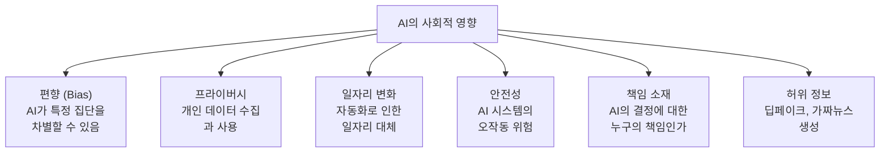
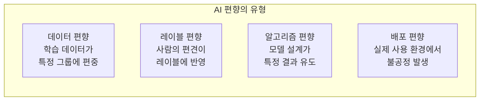
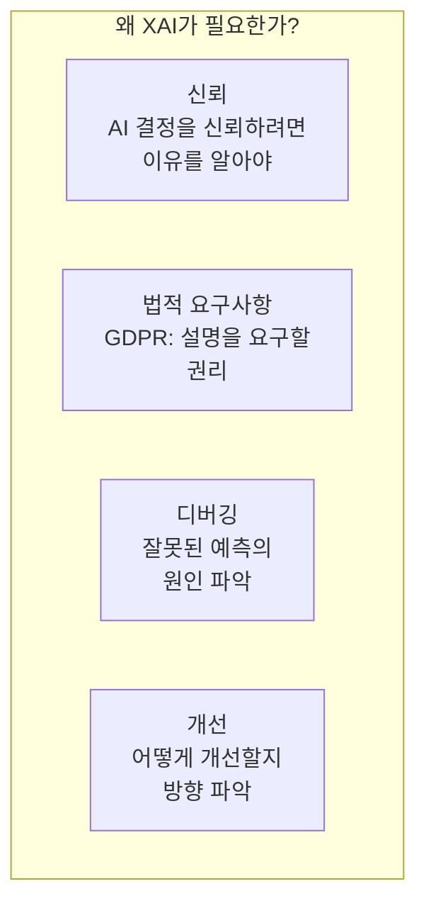
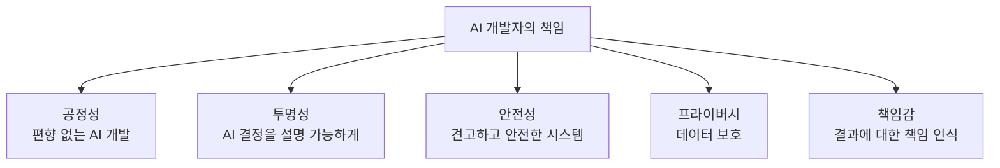
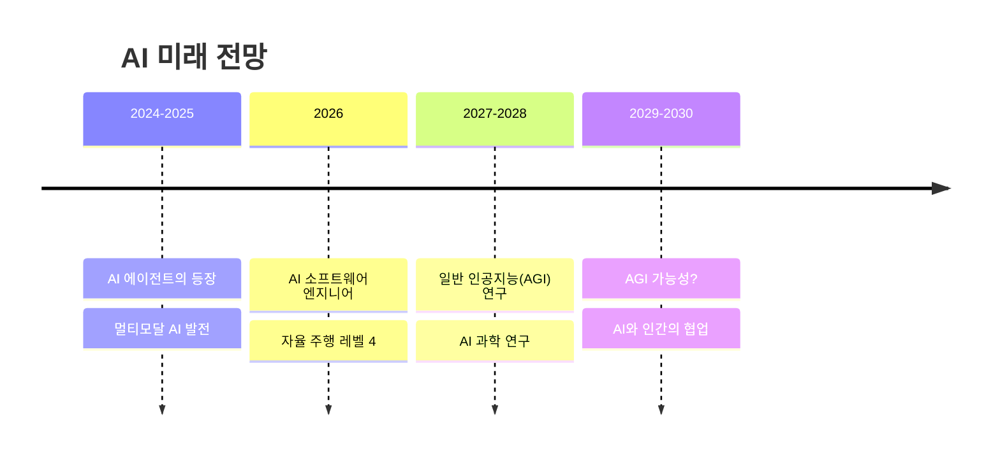
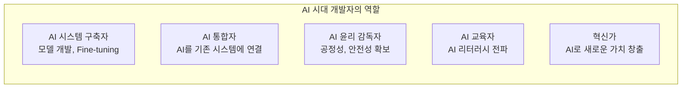

# 16장: AI 윤리와 미래

> **🎯 학습 목표**
> - AI 윤리의 중요성과 주요 이슈를 이해합니다.
> - AI 편향과 공정성 문제를 식별할 수 있습니다.
> - 설명 가능한 AI(XAI)의 필요성을 이해합니다.
> - AI 개발자로서의 책임과 미래 전망을 파악합니다.

---

## 16.1 AI 윤리가 중요한 이유

AI 시스템이 사회 전반에 깊숙이渗透하면서 **윤리적 문제**가 더욱 중요해지고 있습니다.



---

## 16.2 AI 편향 (Bias)

AI 편향은 **데이터나 알고리즘의 불균형**으로 인해 특정 그룹에 불공정한 결과를 초래하는 문제입니다.

### 16.2.1 편향의 유형



### 16.2.2 편향 사례

```python
# 채용 AI의 편향 예시 (가상)
print("=== 편향된 채용 AI 예시 ===")

# 문제 상황: 과거 데이터가 특정 성별에 편중
hiring_data = {
    "과거 합격자 성비": "남성 80%, 여성 20%",
    "AI 학습 결과": "남성 지원자에게 더 높은 점수 부여",
    "문제 원인": "과거 데이터 자체가 편향 → AI가 이를 학습",
    "결과": "여성 지원자의 차별 지속 악순환"
}

for key, value in hiring_data.items():
    print(f"  {key}: {value}")

print("\n=== 해결 방안 ===")
solutions = [
    "데이터 균형 맞추기 (리샘플링)",
    "보호 속성(성별, 인종) 제외",
    "공정성 제약 조건 추가",
    "정기적인 편향 감사",
    "다양한 인력 구성"
]
for i, s in enumerate(solutions, 1):
    print(f"  {i}. {s}")
```

### 16.2.3 공정성 지표

```python
import numpy as np
from sklearn.metrics import confusion_matrix

# 두 그룹(A, B)에 대한 모델 성능
# 예: 남성(A)과 여성(B)의 대출 심사 결과
y_true = np.array([1, 1, 0, 0, 1, 0, 1, 0, 1, 0])
y_pred_A = np.array([1, 1, 0, 0, 1, 0, 1, 0, 1, 0])  # 그룹 A (공정)
y_pred_B = np.array([0, 0, 0, 0, 1, 0, 0, 0, 0, 0])  # 그룹 B (불공정)

def demographic_parity(y_pred_group_a, y_pred_group_b):
    """인구통계학적 패리티: 두 그룹의 긍정 예측 비율이 같은가?"""
    rate_a = np.mean(y_pred_group_a)
    rate_b = np.mean(y_pred_group_b)
    return abs(rate_a - rate_b)

dp = demographic_parity(y_pred_A, y_pred_B)
print(f"인구통계학적 패리티 차이: {dp:.2f}")
print(f"(0에 가까울수록 공정, 현재 차이 {dp:.2f})")

def equal_opportunity(y_true, y_pred_a, y_pred_b):
    """동등한 기회: 두 그룹의 TP 비율(재현율)이 같은가?"""
    # 그룹 A의 재현율
    mask_a = y_true == 1  # 실제 긍정
    tpr_a = np.mean(y_pred_a[mask_a])

    # 그룹 B의 재현율 (임의로 가정)
    mask_b = y_true == 1
    tpr_b = np.mean(y_pred_b[mask_b])

    return abs(tpr_a - tpr_b)

eo = equal_opportunity(y_true, y_pred_A, y_pred_B)
print(f"동등한 기회 차이: {eo:.2f}")
```

---

## 16.3 설명 가능한 AI (XAI)

설명 가능한 AI(XAI, eXplainable AI)는 **AI의 결정을 인간이 이해할 수 있게 설명하는** 기술입니다.



### 16.3.1 특성 중요도 (Feature Importance)

```python
from sklearn.ensemble import RandomForestClassifier
from sklearn.datasets import load_iris
import pandas as pd
import matplotlib.pyplot as plt

iris = load_iris()
model = RandomForestClassifier(n_estimators=100, random_state=42)
model.fit(iris.data, iris.target)

# 특성 중요도 출력
importance = pd.DataFrame({
    'feature': iris.feature_names,
    'importance': model.feature_importances_
}).sort_values('importance', ascending=False)

print("=== 특성 중요도 ===")
print(importance)
print(f"\n⇒ 가장 중요한 특성: {importance.iloc[0]['feature']}")

# 특성 중요도 시각화
plt.barh(importance['feature'], importance['importance'])
plt.xlabel('Importance')
plt.title('Feature Importance (Random Forest)')
plt.show()
```

### 16.3.2 SHAP (SHapley Additive exPlanations)

```python
# SHAP을 사용한 예측 설명 (개념)
"""
import shap

# SHAP 설명자 생성
explainer = shap.TreeExplainer(model)
shap_values = explainer.shap_values(X)

# 특정 예측에 대한 설명
shap.initjs()
shap.force_plot(explainer.expected_value[0],
                shap_values[0][0], X[0])

# 전체 특성 중요도 요약
shap.summary_plot(shap_values, X, feature_names=iris.feature_names)
"""

print("SHAP 설명 예시:")
print("  예측: Setosa (확률 0.95)")
print("  이유:")
print("    - 꽃잎 길이 (3.5)     → +0.40 (Setosa 쪽)")
print("    - 꽃잎 너비 (1.0)     → +0.25 (Setosa 쪽)")
print("    - 꽃받침 길이 (6.0)   → -0.10 (Versicolor 쪽)")
```

### 16.3.3 LIME (Local Interpretable Model-agnostic Explanations)

```python
# LIME으로 이미지 분류 설명 (개념)
"""
from lime import lime_image

explainer = lime_image.LimeImageExplainer()
explanation = explainer.explain_instance(
    image, model.predict,
    top_labels=5, num_samples=1000
)

# 설명 시각화
temp, mask = explanation.get_image_and_mask(
    label, positive_only=True, num_features=5
)
"""

print("LIME 설명 예시: '개'로 분류된 이유")
print("  ✅ 긍정 영향:")
print("    - 귀 부분 (강아지 귀 형태)")
print("    - 코 부분 (강아지 주둥이)")
print("  ❌ 부정 영향:")
print("    - 배경 (개와 무관한 배경 요소)")
```

---

## 16.4 프라이버시와 데이터 보호

### 16.4.1 개인정보 보호 원칙

```python
# 데이터 익명화 예시
import pandas as pd
import hashlib

# 원본 데이터
data = pd.DataFrame({
    'name': ['홍길동', '김철수', '이영희'],
    'ssn': ['900101-1234567', '850205-2345678', '950310-3456789'],
    'age': [34, 39, 29],
    'salary': [5000, 6000, 4500],
    'disease': ['당뇨', '고혈압', '천식']
})

print("=== 개인정보 보호 조치 ===")

# 1. 식별자 제거
data_anon = data.drop('name', axis=1)
print(f"1. 식별자 제거:\n{data_anon.head()}\n")

# 2. 주민등록번호 마스킹 (해시)
def mask_ssn(ssn):
    return ssn[:8] + '*******'

data['ssn_masked'] = data['ssn'].apply(mask_ssn)
print(f"2. SSN 마스킹:\n{data[['ssn', 'ssn_masked']].head()}\n")

# 3. 민감 정보 접근 제어
sensitive_cols = ['ssn', 'disease']
data_public = data.drop(sensitive_cols, axis=1)
print(f"3. 민감 정보 제거:\n{data_public.head()}\n")

# 4. K-익명성 (K-Anonymity) 개념
print("4. K-익명성: 특정 조건으로 식별할 수 있는 사람이 K명 이상")
print("   예: (나이, 성별) 조합으로 특정인이 유일하지 않도록")
```

### 16.4.2 차등 프라이버시 (Differential Privacy)

```python
import numpy as np

# 차등 프라이버시: 결과에 노이즈를 추가하여 개인 정보 보호
def differential_privacy_mean(data, epsilon=1.0):
    """차등 프라이버시가 적용된 평균 계산"""
    real_mean = np.mean(data)
    # Laplace 노이즈 추가 (epsilon이 작을수록 프라이버시 ↑, 정확도 ↓)
    noise = np.random.laplace(0, 1/epsilon)
    return real_mean + noise

# 예시: 평균 나이 계산
ages = np.array([25, 30, 28, 35, 22, 40, 33, 27])
real_mean = np.mean(ages)

print(f"실제 평균: {real_mean:.2f}")
print(f"DP 평균 (ε=1.0): {differential_privacy_mean(ages, 1.0):.2f}")
print(f"DP 평균 (ε=0.1): {differential_privacy_mean(ages, 0.1):.2f} (프라이버시 ↑, 정확도 ↓)")
```

---

## 16.5 AI 개발자의 책임



### AI 개발 체크리스트

```python
ai_ethics_checklist = """
✅ 프로젝트 시작 전:
  □ 이 AI가 해결하는 문제가 정말 필요한가?
  □ 어떤 부작용이 발생할 수 있는가?
  □ 데이터에 편향은 없는가?

✅ 데이터 수집:
  □ 데이터 수집에 동의를 받았는가?
  □ 개인정보는 적절히 보호되는가?
  □ 데이터가 대상을 공정하게 대표하는가?

✅ 모델 개발:
  □ 다양한 그룹에 대한 성능을 확인했는가?
  □ 모델 결정을 설명할 수 있는가?
  □ 공정성 지표를 모니터링하는가?

✅ 배포 전:
  □ 인간의 감독 체계가 있는가?
  □ 오작동 시 대응 계획이 있는가?
  □ 사용자에게 AI 사용을 고지하는가?

✅ 배포 후:
  □ 지속적인 모니터링 체계가 있는가?
  □ 피드백을 수집하고 개선하는가?
  □ 정기적인 윤리 감사를 수행하는가?
"""

print(ai_ethics_checklist)
```

---

## 16.6 AI의 미래 전망



### AI 시대의 개발자 역할



### AI 개발자로서 갖춰야 할 역량

| 역량 | 설명 | 중요도 |
|------|------|--------|
| **Python/코딩** | AI 개발의 기본 도구 | ⭐⭐⭐⭐⭐ |
| **수학** | 통계, 선형대수 기본 | ⭐⭐⭐⭐ |
| **ML/DL 이해** | 알고리즘의 작동 원리 | ⭐⭐⭐⭐⭐ |
| **데이터 리터러시** | 데이터 이해와 처리 | ⭐⭐⭐⭐⭐ |
| **소프트웨어 공학** | 시스템 설계, 배포 | ⭐⭐⭐⭐ |
| **윤리 의식** | 책임 있는 AI 개발 | ⭐⭐⭐⭐⭐ |
| **지속적 학습** | 빠르게 변화하는 분야 | ⭐⭐⭐⭐⭐ |

---

## 📋 한눈에 정리

| 주제 | 핵심 내용 | 실천 방법 |
|------|----------|----------|
| **편향** | 데이터/알고리즘의 불공정 | 다양성 확보, 정기 감사 |
| **설명 가능성** | AI 결정의 이유 제공 | SHAP, LIME, 특성 중요도 |
| **프라이버시** | 개인정보 보호 | 익명화, 차등 프라이버시 |
| **안전성** | 견고하고 안전한 AI | 테스트, 모니터링 |
| **책임** | AI 결과에 대한 책임 | 인간 감독, 투명성 |

---

## ✏️ 연습 문제

1. **AI 편향의 사례**를 하나 찾아 설명하고, 이를 해결할 수 있는 방법을 제시하세요.

2. **설명 가능한 AI(XAI)** 가 왜 중요한지 3가지 이유를 쓰세요.

3. 다음 상황에서 어떤 윤리적 문제가 발생할 수 있을까요?
   - 은행이 AI로 대출 심사 (과거 데이터: 남성 대출자 80%)
   - 학교에서 AI로 학생 성적 예측 (저소득층 데이터 부족)
   - 병원에서 AI로 진단 보조 (특정 인종 데이터만 학습)

4. **차등 프라이버시(Differential Privacy)** 의 원리를 간단히 설명하고, epsilon 값의 의미를 쓰세요.

5. AI 개발자로서 자신이 가장 중요하게 생각하는 **윤리 원칙** 3가지를 정하고, 그 이유를 설명하세요.

---

## 📝 연습 문제 정답

<details>
<summary>정답 보기</summary>

**1. AI 편향 사례와 해결 방법**
실제 사례: Amazon의 채용 AI (2014-2018)
- 문제: 과거 10년간 남성 지원자 위주의 합격 데이터로 학습된 AI가 여성 지원자에게 낮은 점수 부여
- 원인: 학습 데이터 자체가 성별 편향 (기술 업계 특성상 남성 합격자 압도적)
- 해결: (1) 데이터 리샘플링으로 성별 균형 맞춤 (2) 성별 관련 특성 제거 (3) 공정성 제약 조건 추가 (4) 정기적인 편향 감사

**2. XAI가 중요한 3가지 이유**
- **신뢰:** AI 결정을 신뢰하려면 이유를 알아야 함 (예: 의료 진단 AI가 왜 암이라고 판단했는가?)
- **법적 책임:** GDPR은 자동화된 결정에 대한 설명을 요구할 권리를 보장 (규정 준수)
- **디버깅:** 잘못된 예측의 원인을 찾아 모델 개선 (과대적합, 특성 오용 등 발견)

**3. 상황별 윤리적 문제**
- **은행 대출 심사 (남성 80%):** 여성 지원자에 대한 차별 발생 가능, 데이터 편향 → 대출 거부 악순환
- **학교 성적 예측 (저소득층 데이터 부족):** 저소득층 학생의 성적을 정확히 예측하지 못해 지원 부족
- **병원 진단 보조 (특정 인종만 학습):** 다른 인종 환자에 대한 오진 가능성 증가

**4. 차등 프라이버시 (Differential Privacy)**
개인의 데이터가 포함되었는지 여부를 알 수 없도록 결과에 **통계적 노이즈**를 추가하는 기법입니다.
- **epsilon (ε) 값:** 프라이버시 손실 예산. ε이 작을수록 더 많은 노이즈 추가 → 프라이버시 보호 ↑, 정확도 ↓
  - ε=0.1: 강력한 프라이버시, 낮은 정확도
  - ε=1.0: 적당한 프라이버시, 적당한 정확도
  - ε=10.0: 약한 프라이버시, 높은 정확도

**5. (자유 답변 예시)**
- **공정성:** AI가 특정 집단을 차별하지 않도록 데이터와 모델을 지속적으로 검사
- **투명성:** AI의 결정을 항상 설명할 수 있어야 함 (블랙박스 방지)
- **책임성:** AI의 결과에 대한 책임을 인식하고, 인간의 감독 체계 유지
- 이유: AI가 사회에 미치는 영향이 점점 커지고 있으므로, 개발자로서 윤리적 책임을 다하는 것이 중요합니다.

</details>

---

> **🎉 축하합니다!** 15장의 모든 여정이 끝났습니다. 이제 여러분은 AI 프로그래밍의 기초부터 실제 프로젝트까지 전반적인 내용을 학습했습니다. 계속해서 실제 프로젝트를 경험하고, 공식 문서를 읽으며, 지속적으로 학습하는 것이 중요합니다. **Happy AI Coding! 🚀**
