# AI 프로그래밍 완전 정복

**실전 AI 프로그래밍 가이드 — A to Z Guide for Beginner & Intermediate Software Engineers**

> **📝 안내:** 이 문서는 AI에 의해 작성되었습니다.
> **⚠️ 경고:** AI가 생성한 문서이므로 내용에 부정확하거나 잘못된 정보가 포함될 수 있습니다. 학습 시 공식 문서 및 학술 자료를 함께 참고하는 것을 권장합니다.
> **© License:** 교육 목적 자유 사용, 상업적 사용 및 무단 수정/배포 금지.

---

## 이 책이 필요한 사람

- AI 프로그래밍을 **처음 배우는** 소프트웨어 엔지니어
- **Python** 기본 문법을 알고 있지만 AI 프로그래밍 라이브러리(NumPy, PyTorch 등)는 처음인 개발자
- 머신러닝/딥러닝 **프로그래밍의 이론과 실무**를 함께 익히고 싶은 주니어 개발자
- "AI 시대에 개발자가 무엇을 공부해야 할지" 막막한 엔지니어

## 독자가 알고 있어야 할 것

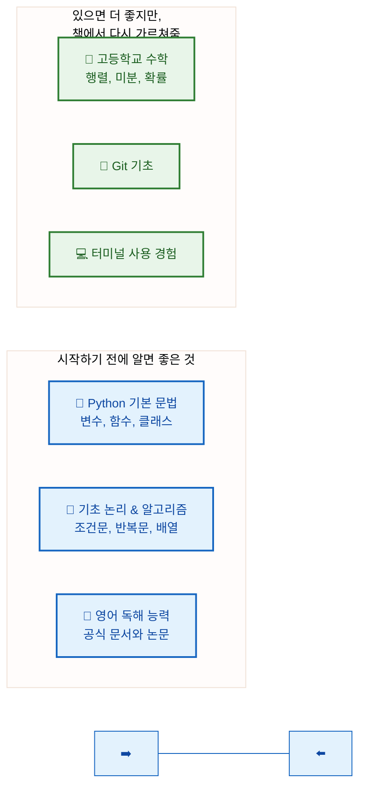

> **걱정 마세요.** 선형대수, 미적분, 통계는 **필요한 만큼만** 책에서 다시 설명합니다. "수포자"도 따라올 수 있습니다.

---

## 학습 로드맵

전체 과정은 **4개 파트, 16개 장**으로 구성됩니다.

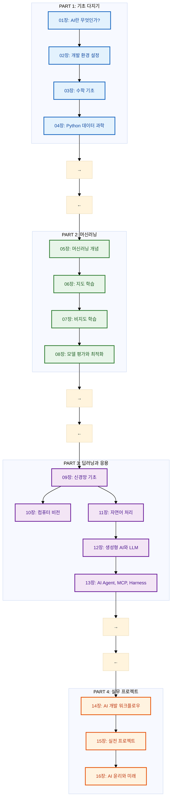

---

## 전체 목차

### PART 1: 기초 다지기

#### 01장: AI 프로그래밍 개요
- AI 프로그래밍이란? (전통적 프로그래밍 vs AI 프로그래밍)
- AI 프로그래밍의 전체 생명주기: 데이터 → 모델 → 배포
- AI 프로그래밍 접근법: 규칙 기반, 머신러닝 기반, LLM 기반
- AI 프로그래밍 도구와 기술 스택
- 이 책에서 배울 전체 로드맵

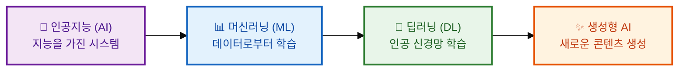

#### 02장: AI 프로그래밍을 위한 개발 환경 설정
- Python과 Anaconda 설치 (AI 개발 환경 구축)
- 가상 환경 (venv, conda)을 활용한 프로젝트 격리
- Jupyter Notebook: AI 실험/분석 환경 vs Python 스크립트: 프로덕션 코드
- 주요 AI 라이브러리 설치 (NumPy, Pandas, Scikit-learn, PyTorch, TensorFlow)
- AI 개발을 위한 GPU 설정 (CUDA, cuDNN)
- AI 프로그래밍에 최적화된 코드 에디터 추천 (VS Code, PyCharm)
- Google Colab을 활용한 클라우드 AI 개발 환경

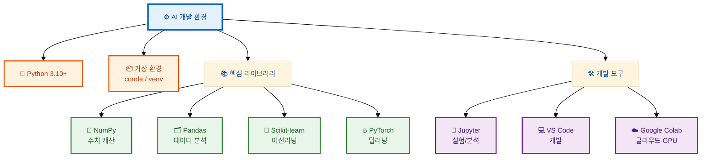

#### 03장: AI 프로그래밍에 필요한 수학 기초
- **선형대수:** AI에서 벡터/행렬이 데이터를 표현하고 변환하는 방식
- **미적분:** AI 모델 학습의 핵심 — 미분, 체인 룰, 그래디언트
- **확률과 통계:** AI 모델의 불확실성 처리와 데이터 특성 분석
- **최적화:** 경사하강법을 통한 AI 모델 파라미터 학습

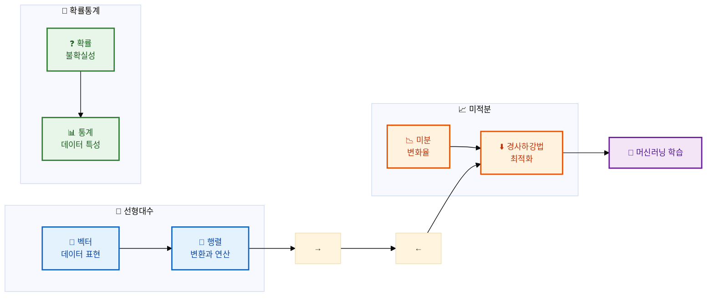

#### 04장: AI 프로그래밍을 위한 Python 데이터 과학
- NumPy: AI 데이터의 배열 연산과 선형대수 프로그래밍
- Pandas: AI 학습용 데이터 불러오기, 정제, 변환 프로그래밍
- Matplotlib & Seaborn: AI 데이터 분석 결과 시각화 프로그래밍
- Scikit-learn: AI 모델 학습 파이프라인 프로그래밍

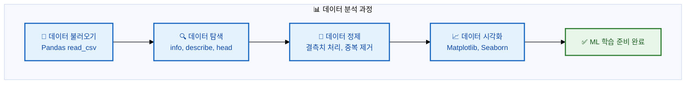

### PART 2: 머신러닝

#### 05장: AI 모델 프로그래밍의 시작 — 머신러닝 개념
- 지도학습 vs 비지도학습 vs 강화학습: 프로그래밍 패러다임 비교
- AI 모델 프로그래밍의 구성 요소: 특징(Feature), 레이블(Label), 모델(Model)
- 학습/검증/테스트 데이터 분할 프로그래밍
- 과대적합(Overfitting)과 과소적합(Underfitting) 디버깅
- 편향-분산 트레이드오프(Bias-Variance Tradeoff) 이해

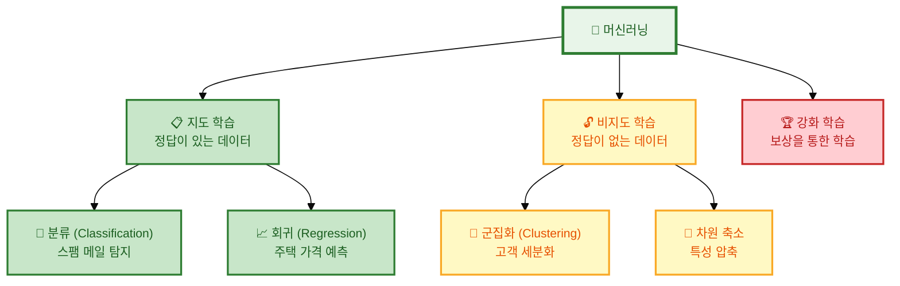

#### 06장: 지도 학습 알고리즘 프로그래밍
- 선형 회귀 (Linear Regression) 구현과 해석
- 로지스틱 회귀 (Logistic Regression) 구현과 활용
- 결정 트리 & 랜덤 포레스트 프로그래밍
- 서포트 벡터 머신 (SVM) 실전 구현
- K-최근접 이웃 (K-NN) 프로그래밍
- 각 알고리즘의 장단점과 실전 선택 기준

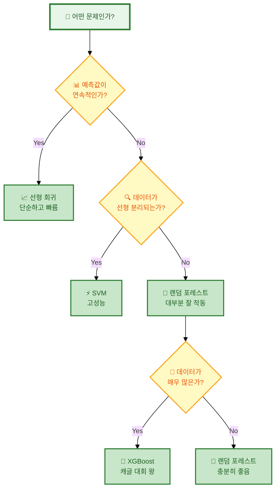

#### 07장: 비지도 학습 프로그래밍
- K-Means 군집화 알고리즘 구현
- 계층적 군집화 프로그래밍
- DBSCAN을 활용한 이상 탐지 프로그래밍
- 주성분 분석 (PCA)을 통한 차원 축소 구현
- t-SNE를 활용한 고차원 데이터 시각화 프로그래밍

#### 08장: 모델 평가와 최적화 프로그래밍
- 분류 모델 평가 프로그래밍: 정확도, 정밀도, 재현율, F1-score, ROC-AUC
- 회귀 모델 평가 프로그래밍: MSE, MAE, R²
- 교차 검증 (Cross Validation) 구현
- 하이퍼파라미터 튜닝 프로그래밍: Grid Search, Random Search
- 특성 공학 (Feature Engineering) 실전 기법
- 앙상블 기법 프로그래밍

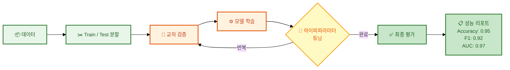

### PART 3: 딥러닝과 응용

#### 09장: 신경망 프로그래밍 기초
- 퍼셉트론 (Perceptron) 구현부터 시작하는 신경망 프로그래밍
- 활성화 함수 프로그래밍: Sigmoid, Tanh, ReLU, Softmax
- 다층 퍼셉트론 (MLP) 구현
- 순전파 (Forward Propagation) 프로그래밍
- 역전파 (Backpropagation) 구현 원리
- 손실 함수 프로그래밍: MSE, Cross-Entropy
- 옵티마이저 프로그래밍: SGD, Adam
- PyTorch/TensorFlow를 활용한 딥러닝 프로그래밍

```mermaid
%%{init: {'theme': 'base', 'themeVariables': {'fontSize': '13px'}}}%%
flowchart LR
  subgraph NN[🧠 신경망 구조]
    direction LR
    I["📥 Input Layer<br/>데이터 입력"]
    H1["⚡ Hidden Layer 1<br/>64 nodes, ReLU"]
    H2["⚡ Hidden Layer 2<br/>32 nodes, ReLU"]
    O["📤 Output Layer<br/>10 nodes, Softmax"]
  end

  I --> H1 --> H2 --> O
  
  subgraph Process[🔄 학습 과정]
    direction LR
    FP["➡️ 순전파<br/>예측값 계산"]
    Loss["📉 손실 계산<br/>예측 vs 정답"]
    BP["⬅️ 역전파<br/>그래디언트 계산"]
    Update["🔄 가중치 갱신<br/>Adam 옵티마이저"]
  end

  FP --> Loss --> BP --> Update
  Update -.->|반복 (Epoch)| FP

  classDef layer fill:#f3e5f5,stroke:#6a1b9a,stroke-width:2px,color:#4a148c
  classDef process fill:#e8f5e9,stroke:#2e7d32,stroke-width:2px,color:#1b5e20
  class I,H1,H2,O layer
  class FP,Loss,BP,Update process
```

#### 10장: 컴퓨터 비전 프로그래밍 (CNN)
- 합성곱 신경망 (CNN) 프로그래밍 개념
- 합성곱(Convolution)과 풀링(Pooling) 계층 구현
- 주요 CNN 아키텍처 구현: VGG, ResNet
- 이미지 분류 모델 프로그래밍 실습 (CIFAR-10)
- 데이터 증강 (Data Augmentation) 프로그래밍
- 전이 학습 (Transfer Learning) 구현
- 객체 탐지 (YOLO) 프로그래밍 개요

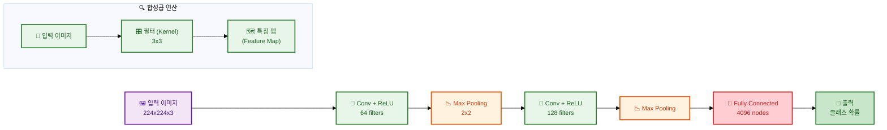

#### 11장: 자연어 처리 프로그래밍 (NLP)
- 텍스트 전처리 프로그래밍: 토큰화, 정제, 형태소 분석
- 단어 임베딩 구현: Word2Vec, GloVe
- 순환 신경망 (RNN)과 LSTM 프로그래밍
- 트랜스포머 (Transformer) 아키텍처 구현
- BERT를 활용한 문맥 이해 프로그래밍
- 감성 분석, 텍스트 분류 모델 구현 실습

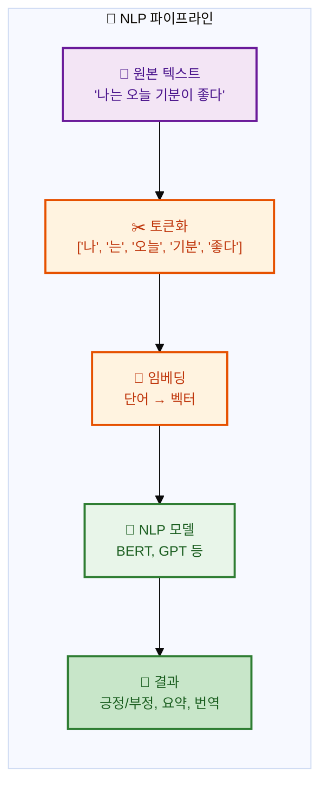

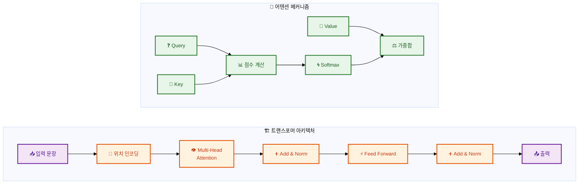

#### 12장: 생성형 AI와 LLM 프로그래밍
- 생성형 AI 프로그래밍 개념
- GPT 아키텍처 이해와 활용 프로그래밍
- 프롬프트 엔지니어링 (Prompt Engineering) 프로그래밍
- RAG (Retrieval Augmented Generation) 시스템 구현
- LangChain 프레임워크를 활용한 AI 애플리케이션 개발
- LLM Fine-tuning 프로그래밍 기초
- Vector Database와 임베딩 검색 프로그래밍

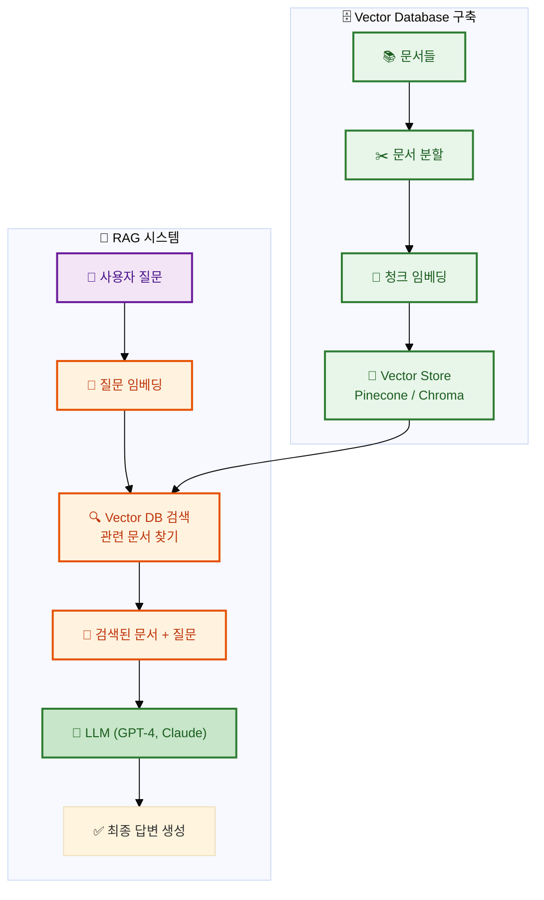

#### 13장: AI Agent, MCP, Harness 프로그래밍
- AI Agent 개념과 ReAct 패턴 구현
- Function Calling / Tool Use 프로그래밍
- Multi-Agent 시스템과 Skills 개발
- MCP (Model Context Protocol) 서버/클라이언트 프로그래밍
- AI Harness를 활용한 LLM/Agent 평가 프로그래밍
- API 제공자 연동과 토큰 관리 프로그래밍

---

### PART 4: 실무 프로젝트

#### 14장: AI 개발 워크플로우 프로그래밍
- AI 프로젝트 구조와 파일 관리
- 데이터 수집 및 라벨링 파이프라인 구축
- 실험 관리 프로그래밍 (MLflow, Weights & Biases)
- 모델 저장 및 버전 관리 프로그래밍
- 모델 배포: Flask/FastAPI API 서버 구현
- Docker를 이용한 AI 애플리케이션 컨테이너화
- 클라우드 배포 프로그래밍 (AWS, GCP, Hugging Face)

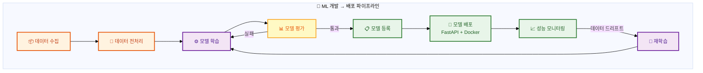

#### 15장: 실전 AI 프로그래밍 프로젝트
- **프로젝트 1:** 이미지 분류기 프로그래밍 (개 vs 고양이)
- **프로젝트 2:** 영화 리뷰 감성 분석기 프로그래밍
- **프로젝트 3:** RAG 기반 문서 Q&A 챗봇 프로그래밍
- **프로젝트 4:** 실시간 객체 탐지 앱 프로그래밍

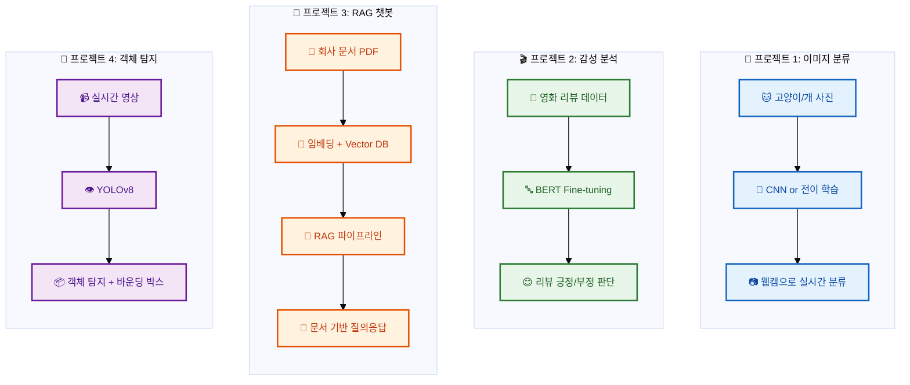

#### 16장: AI 프로그래밍 윤리와 미래
- AI 프로그래밍에서의 편향 (Bias) 사례와 대처
- 공정성 (Fairness) 평가 프로그래밍
- 설명 가능한 AI (XAI) 구현 기법
- 프라이버시와 데이터 보호 프로그래밍 원칙
- AI 개발자의 미래와 역할

---

## 각 장의 구성

각 장은 다음과 같은 형식으로 구성됩니다:

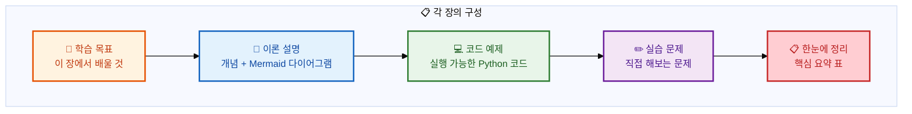

---

## 전체 학습 로드맵 요약

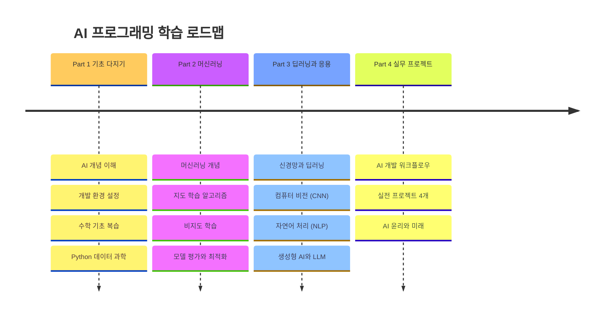

---

> **시작하려면:** `01_서론/01_AI란.md`에서부터 순서대로 읽으세요. 각 장은 이전 장의 내용을 기반으로 합니다.

---

## 수학이 두려우신가요?

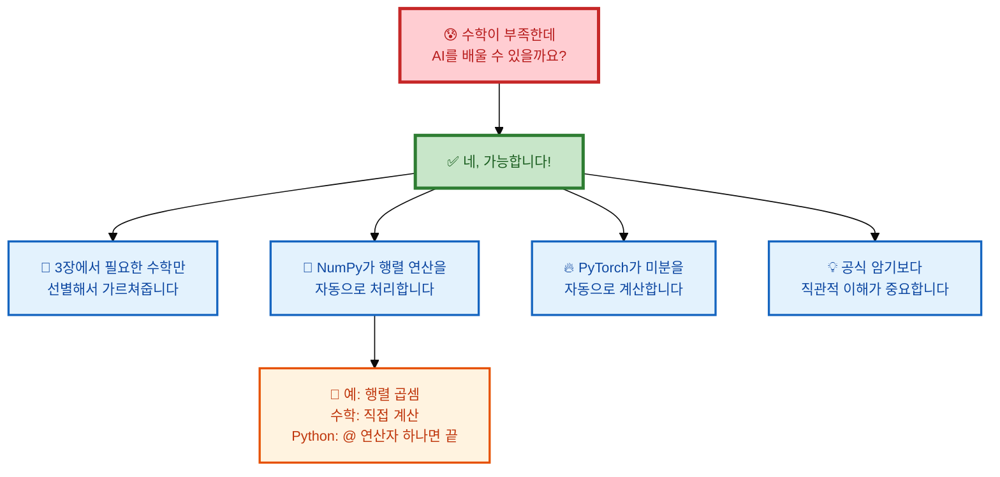

---

## 디렉토리 구조

```
ai-programming/
├── README.md                    # 이 파일 (전체 개요)
├── LICENSE.md                   # 라이선스
│
├── 01_서론/                     # Part 1: 기초
│   ├── 01_AI란.md
│   ├── 02_개발_환경.md
│   ├── 03_수학_기초.md
│   └── 04_Python_데이터과학.md
│
├── 02_머신러닝/                 # Part 2: 머신러닝
│   ├── 01_ML_개념.md
│   ├── 02_지도_학습.md
│   ├── 03_비지도_학습.md
│   └── 04_모델_평가.md
│
├── 03_딥러닝/                   # Part 3: 딥러닝
│   ├── 01_신경망_기초.md
│   ├── 02_컴퓨터_비전.md
│   ├── 03_자연어_처리.md
│   └── 04_생성형_AI.md
│
├── 04_실무/                     # Part 4: 실무
│   ├── 01_AI_워크플로우.md
│   ├── 02_실전_프로젝트.md
│   └── 03_AI_윤리.md
│
└── projects/                    # 실습 프로젝트 코드
    ├── image_classifier/
    ├── sentiment_analysis/
    ├── rag_chatbot/
    └── object_detection/
```

---

승인하시면 각 장을 하나씩 작성해 나가겠습니다. 먼저 어느 장부터 시작할까요?
