# AI 프로그래밍 완전 정복

**A to Z Guide for Beginner & Intermediate Software Engineers**

> **📝 안내:** 이 문서는 AI에 의해 작성되었습니다.
> **⚠️ 경고:** AI가 생성한 문서이므로 내용에 부정확하거나 잘못된 정보가 포함될 수 있습니다. 학습 시 공식 문서 및 학술 자료를 함께 참고하는 것을 권장합니다.
> **© License:** 교육 목적 자유 사용, 상업적 사용 및 무단 수정/배포 금지.

---

## 이 책이 필요한 사람

- AI/ML을 **처음 배우는** 소프트웨어 엔지니어
- **Python** 기본 문법을 알고 있지만 AI 라이브러리(NumPy, PyTorch 등)는 처음인 개발자
- 머신러닝/딥러닝의 **이론과 실무**를 함께 익히고 싶은 주니어 개발자
- "AI 시대에 개발자가 무엇을 공부해야 할지" 막막한 엔지니어

## 독자가 알고 있어야 할 것

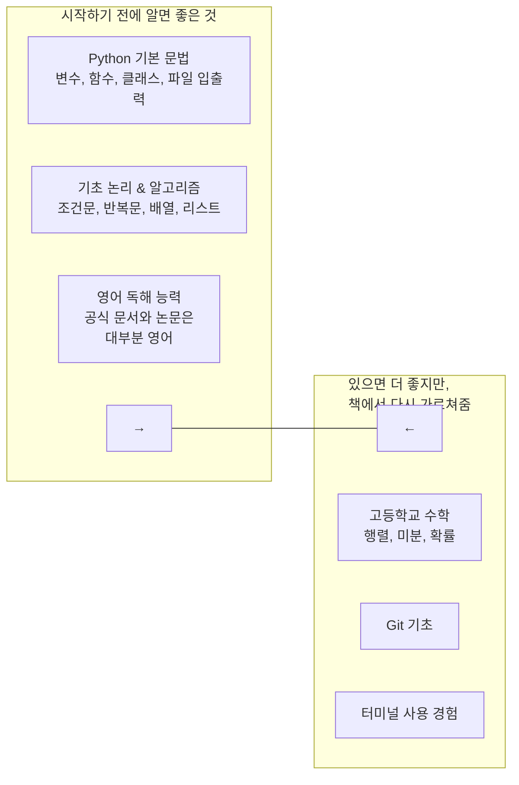

> **걱정 마세요.** 선형대수, 미적분, 통계는 **필요한 만큼만** 책에서 다시 설명합니다. "수포자"도 따라올 수 있습니다.

---

## 학습 로드맵

전체 과정은 **4개 파트, 15개 장**으로 구성됩니다.

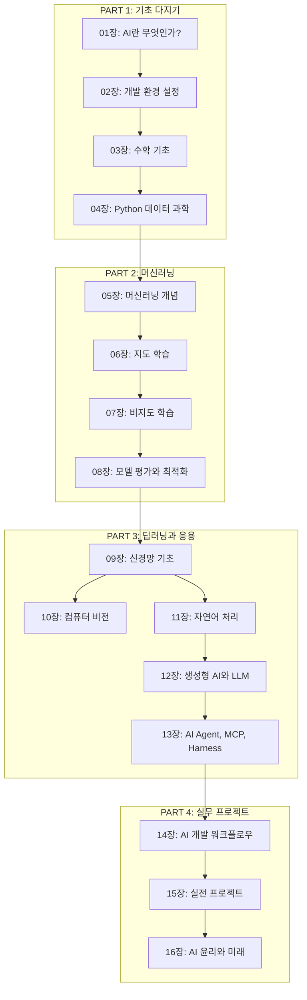

---

## 전체 목차

### PART 1: 기초 다지기

#### 01장: AI란 무엇인가?
- AI, 머신러닝, 딥러닝의 개념과 차이
- AI의 역사: 튜링 테스트부터 ChatGPT까지
- AI의 종류: 약인공지능 vs 강인공지능
- AI가 해결하는 문제 유형
- 이 책에서 배울 내용 개요

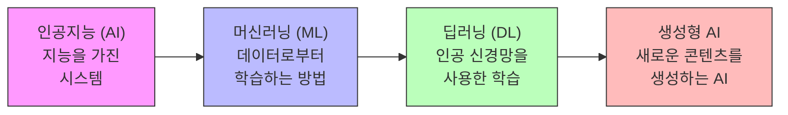

#### 02장: 개발 환경 설정
- Python과 Anaconda 설치
- 가상 환경 (venv, conda)
- Jupyter Notebook vs Python 스크립트
- 주요 라이브러리 설치 (NumPy, Pandas, Scikit-learn, PyTorch, TensorFlow)
- GPU 설정 (CUDA, cuDNN)
- 코드 에디터 추천 (VS Code, PyCharm)
- Google Colab 사용법

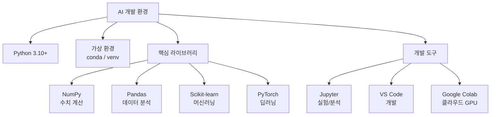

#### 03장: 수학 기초
- **선형대수:** 벡터, 행렬, 행렬 곱셈, 전치행렬, 고유값
- **미적분:** 미분, 편미분, 체인 룰, 그래디언트
- **확률과 통계:** 확률변수, 분포, 평균, 분산, 조건부확률
- **최적화:** 경사하강법, 손실함수

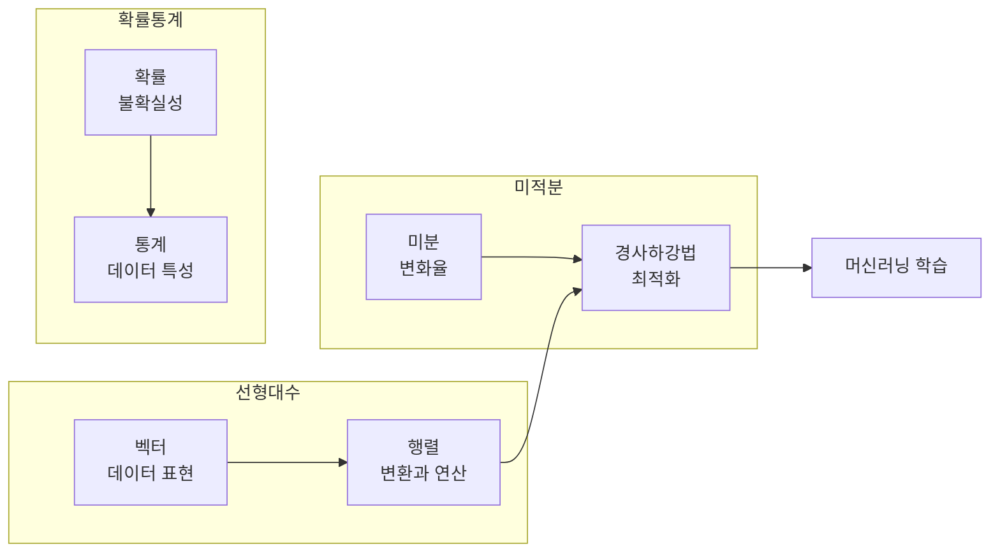

#### 04장: Python 데이터 과학
- NumPy: 배열 생성, 인덱싱, 브로드캐스팅, 선형대수 연산
- Pandas: Series, DataFrame, 데이터 불러오기/저장, 결측치 처리, 그룹화
- Matplotlib & Seaborn: 선 그래프, 산점도, 히스토그램, heatmap
- Scikit-learn: 데이터셋 로드, 전처리, 모델 학습 기본 흐름

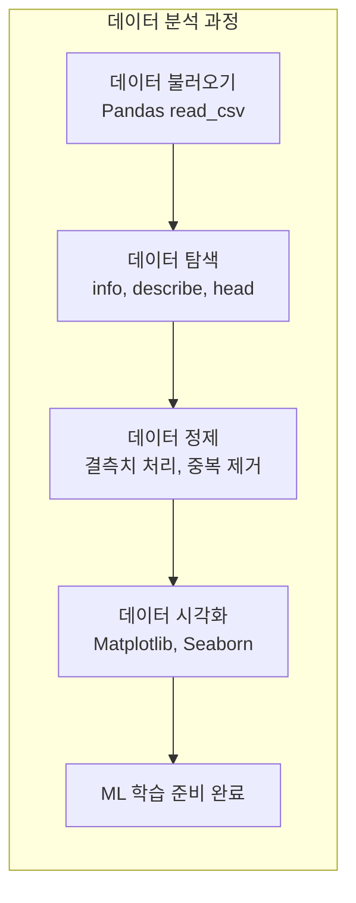

### PART 2: 머신러닝

#### 05장: 머신러닝 개념
- 지도학습 vs 비지도학습 vs 강화학습
- 특징(Feature), 레이블(Label), 모델(Model)
- 훈련/검증/테스트 데이터 분할
- 과대적합(Overfitting)과 과소적합(Underfitting)
- 편향-분산 트레이드오프(Bias-Variance Tradeoff)

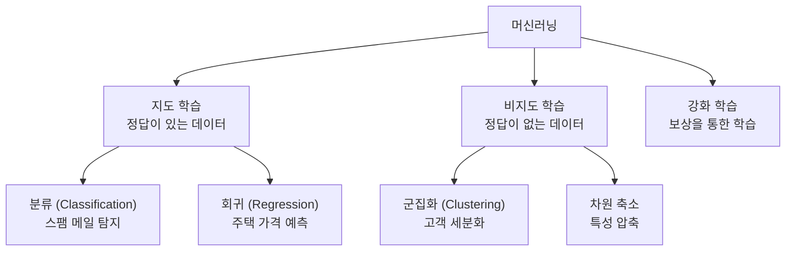

#### 06장: 지도 학습 알고리즘
- 선형 회귀 (Linear Regression)
- 로지스틱 회귀 (Logistic Regression)
- 결정 트리 (Decision Tree) & 랜덤 포레스트 (Random Forest)
- 서포트 벡터 머신 (SVM)
- K-최근접 이웃 (K-NN)
- 각 알고리즘의 장단점과 실무 선택 기준

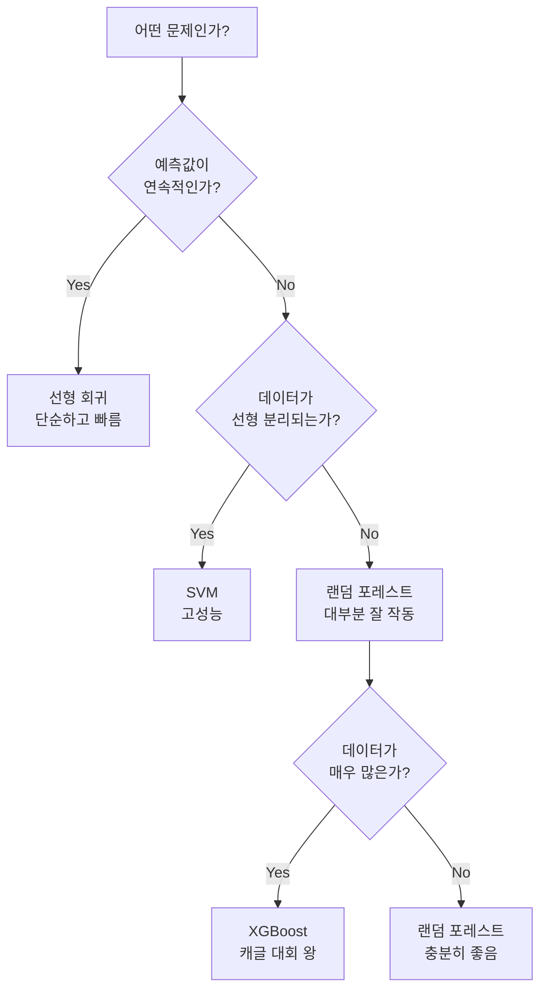

#### 07장: 비지도 학습
- K-Means 군집화
- 계층적 군집화
- DBSCAN
- 주성분 분석 (PCA)
- t-SNE 시각화

#### 08장: 모델 평가와 최적화
- 분류 모델 평가: 정확도, 정밀도, 재현율, F1-score, ROC-AUC
- 회귀 모델 평가: MSE, MAE, R²
- 교차 검증 (Cross Validation)
- 하이퍼파라미터 튜닝: Grid Search, Random Search
- 특성 공학 (Feature Engineering)
- 앙상블 기법

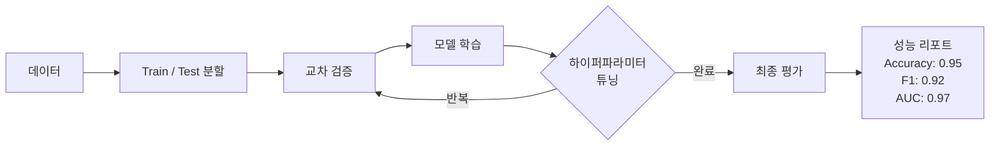

### PART 3: 딥러닝과 응용

#### 09장: 신경망 기초
- 퍼셉트론 (Perceptron)
- 활성화 함수: Sigmoid, Tanh, ReLU, Softmax
- 다층 퍼셉트론 (MLP)
- 순전파 (Forward Propagation)
- 역전파 (Backpropagation)
- 손실 함수: MSE, Cross-Entropy
- 옵티마이저: SGD, Adam
- PyTorch/TensorFlow 기본 사용법

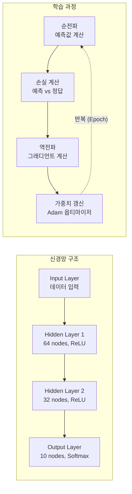

#### 10장: 컴퓨터 비전 (CNN)
- 합성곱 신경망 (CNN) 개념
- 합성곱(Convolution)과 풀링(Pooling)
- 주요 CNN 아키텍처: VGG, ResNet
- 이미지 분류 실습 (CIFAR-10)
- 데이터 증강 (Data Augmentation)
- 전이 학습 (Transfer Learning)
- 객체 탐지 (YOLO) 개요

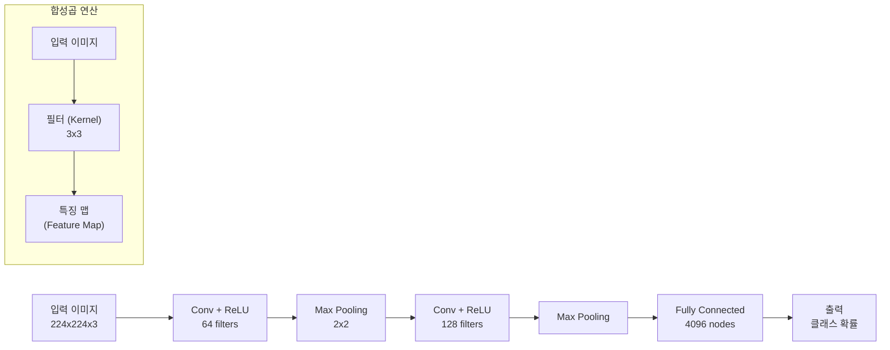

#### 11장: 자연어 처리 (NLP)
- 텍스트 전처리: 토큰화, 정제, 형태소 분석
- 단어 임베딩: Word2Vec, GloVe
- 순환 신경망 (RNN)과 LSTM
- 트랜스포머 (Transformer) 아키텍처
- BERT: 양방향 문맥 이해
- 감성 분석, 텍스트 분류 실습

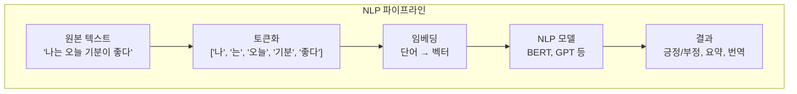

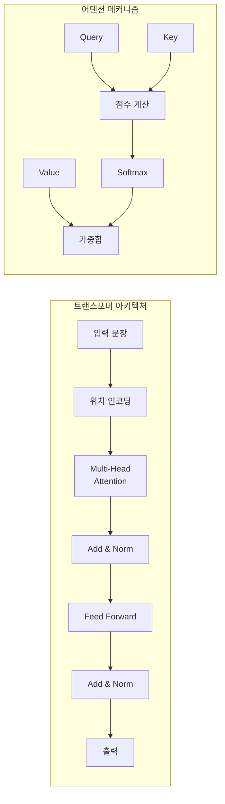

#### 12장: 생성형 AI와 LLM
- 생성형 AI 개념
- GPT 아키텍처
- 프롬프트 엔지니어링 (Prompt Engineering)
- RAG (Retrieval Augmented Generation)
- LangChain 프레임워크
- LLM Fine-tuning 기초
- vector database와 임베딩 검색

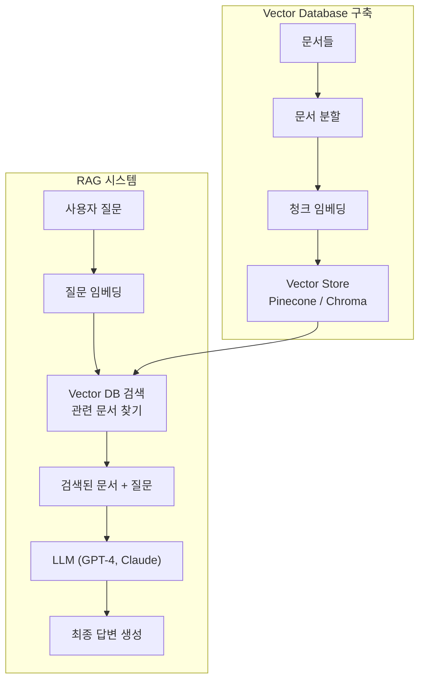

#### 13장: AI Agent, MCP, Harness
- AI Agent 개념과 ReAct 패턴
- Function Calling / Tool Use
- Multi-Agent 시스템과 Skills
- MCP (Model Context Protocol) 구조
- AI Harness (LLM/Agent 평가)
- API 제공자와 토큰 관리

---

### PART 4: 실무 프로젝트

#### 14장: AI 개발 워크플로우
- 프로젝트 구조와 파일 관리
- 데이터 수집 및 라벨링
- 실험 관리 (MLflow, Weights & Biases)
- 모델 저장 및 버전 관리
- 모델 배포: Flask/FastAPI API 서버
- Docker를 이용한 컨테이너화
- 클라우드 배포 (AWS, GCP, Hugging Face)

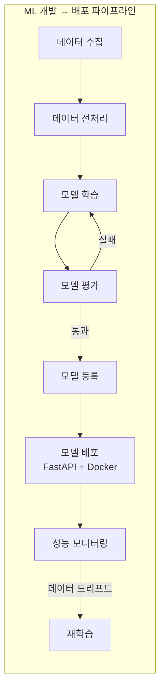

#### 15장: 실전 프로젝트
- **프로젝트 1:** 이미지 분류기 (개 vs 고양이)
- **프로젝트 2:** 영화 리뷰 감성 분석기
- **프로젝트 3:** RAG 기반 문서 Q&A 챗봇
- **프로젝트 4:** 실시간 객체 탐지 앱

```mermaid
flowchart TB
  subgraph Proj1[프로젝트 1: 이미지 분류]
    P1Data["고양이/개 사진"] --> P1Train["CNN or 전이 학습"]
    P1Train --> P1Result["웹캠으로 실시간 분류"]
  end

  subgraph Proj2[프로젝트 2: 감성 분석]
    P2Data["영화 리뷰 데이터"] --> P2Train["BERT Fine-tuning"]
    P2Train --> P2Result["리뷰 긍정/부정 판단"]
  end

  subgraph Proj3[프로젝트 3: RAG 챗봇]
    P3Data["회사 문서 PDF"] --> P3Embed["임베딩 + Vector DB"]
    P3Embed --> P3RAG["RAG 파이프라인"]
    P3RAG --> P3Result["문서 기반 질의응답"]
  end

  subgraph Proj4[프로젝트 4: 객체 탐지]
    P4Data["실시간 영상"] --> P4Model["YOLOv8"]
    P4Model --> P4Result["객체 탐지 + 바운딩 박스"]
  end
```

#### 16장: AI 윤리와 미래
- AI 편향 (Bias) 사례
- 공정성 (Fairness) 평가
- 설명 가능한 AI (XAI)
- 프라이버시와 데이터 보호
- AI의 미래와 개발자의 역할

---

## 각 장의 구성

각 장은 다음과 같은 형식으로 구성됩니다:

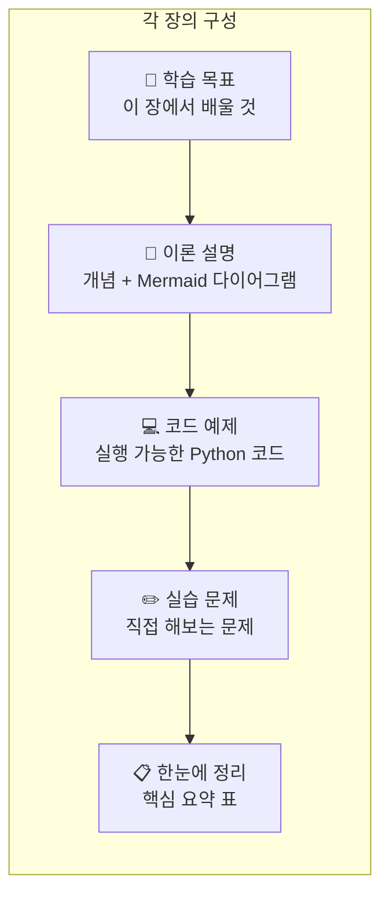

---

## 전체 학습 로드맵 요약

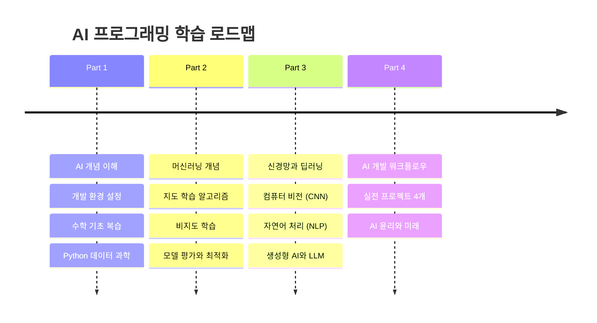

---

> **시작하려면:** `01_서론/01_AI란.md`에서부터 순서대로 읽으세요. 각 장은 이전 장의 내용을 기반으로 합니다.

---

## 수학이 두려우신가요?

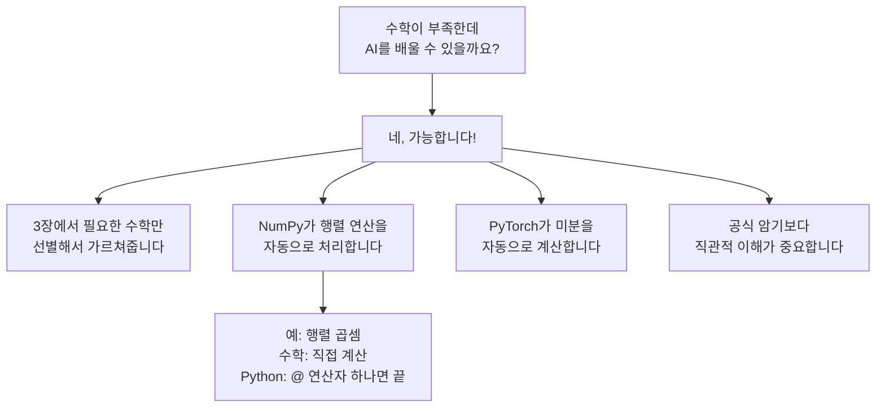

---

## 디렉토리 구조

```
ai-programming/
├── README.md                    # 이 파일 (전체 개요)
├── LICENSE.md                   # 라이선스
│
├── 01_서론/                     # Part 1: 기초
│   ├── 01_AI란.md
│   ├── 02_개발_환경.md
│   ├── 03_수학_기초.md
│   └── 04_Python_데이터과학.md
│
├── 02_머신러닝/                 # Part 2: 머신러닝
│   ├── 01_ML_개념.md
│   ├── 02_지도_학습.md
│   ├── 03_비지도_학습.md
│   └── 04_모델_평가.md
│
├── 03_딥러닝/                   # Part 3: 딥러닝
│   ├── 01_신경망_기초.md
│   ├── 02_컴퓨터_비전.md
│   ├── 03_자연어_처리.md
│   └── 04_생성형_AI.md
│
├── 04_실무/                     # Part 4: 실무
│   ├── 01_AI_워크플로우.md
│   ├── 02_실전_프로젝트.md
│   └── 03_AI_윤리.md
│
└── projects/                    # 실습 프로젝트 코드
    ├── image_classifier/
    ├── sentiment_analysis/
    ├── rag_chatbot/
    └── object_detection/
```

---

승인하시면 각 장을 하나씩 작성해 나가겠습니다. 먼저 어느 장부터 시작할까요?
