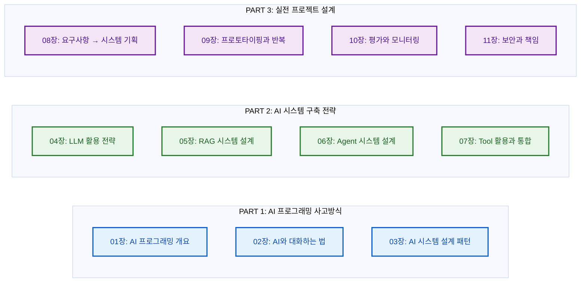
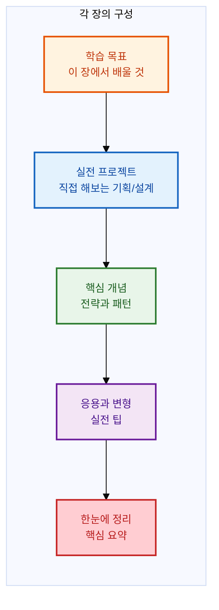

# AI 프로그래밍 — 생각하고 설계하고 대화하라

> **AI 소프트웨어 개발자의 진짜 업무는 코딩이 아니라 전략 수립과 AI와의 협업입니다.**

이 책은 AI 소프트웨어 개발에 필요한 **사고방식, 설계 전략, 커뮤니케이션 기술**을 가르칩니다. Python 문법이나 머신러닝 알고리즘 구현보다, 문제를 AI로 풀 수 있는지 판단하는 안목과 AI와 효과적으로 대화하는 능력을 기르는 데 집중합니다.

---

## 이 책의 철학

| 전통적인 접근 | 이 책의 접근 |
|---|---|
| Python/ML 라이브러리 사용법에 집중 | AI와의 커뮤니케이션에 집중 |
| 모델을 직접 학습/구현 | 이미 만들어진 AI를 활용하는 전략 |
| 알고리즘의 수학적 원리 이해 | 문제를 AI에 맞게 구조화하는 능력 |
| 코드 작성이 핵심 | 프롬프트와 컨텍스트 설계가 핵심 |

현대 AI 개발자에게 가장 중요한 역량은 **"AI에게 무엇을, 어떻게 시킬 것인가"** 를 설계하는 것입니다. 이 책은 그 역량을 기르기 위해 만들어졌습니다.

---

## 대상 독자

- AI를 활용한 소프트웨어를 만들고 싶은 개발자
- 프롬프트 엔지니어링을 체계적으로 배우고 싶은 분
- RAG, Agent, Tool Calling 등 최신 AI 패턴을 이해하고 싶은 분
- "AI 시대에 개발자가 무엇을 해야 하는가" 고민하는 분

---

## 학습 로드맵

---

## 목차

### PART 1: AI 프로그래밍 사고방식

**01장: AI 프로그래밍 개요** — AI 프로그래밍이 전통적인 소프트웨어 개발과 어떻게 다른지 이해합니다. 문제를 AI로 풀어야 하는지 판단하는 프레임워크를 배웁니다.

**02장: AI와 대화하는 법** — 프롬프트 설계의 원칙과 패턴을 익힙니다. System/User/Assistant 역할 설계, Few-shot, Chain-of-Thought 등 실전 패턴을 다룹니다.

**03장: AI 시스템 설계 패턴** — RAG, Agent, Tool Calling 등 현대 AI 시스템의 핵심 아키텍처 패턴을 이해하고 상황에 맞게 선택하는 방법을 배웁니다.

### PART 2: AI 시스템 구축 전략

**04장: LLM 활용 전략** — 모델 선택 기준, API 설계 원칙, 비용과 성능의 트레이드오프를 다룹니다. 여러 LLM을 조합하는 전략도 학습합니다.

**05장: RAG 시스템 설계** — 검색 증강 생성의 전체 아키텍처를 설계합니다. Chunking 전략, 임베딩 선택, Vector DB 구축, 검색 품질 최적화를 다룹니다.

**06장: Agent 시스템 설계** — AI Agent의 구조와 설계 원칙을 배웁니다. Agent Loop, Tool 사용, Memory 관리, 다중 Agent 협업까지 다룹니다.

**07장: Tool 활용과 통합** — Function Calling과 MCP 프로토콜을 활용하여 AI 시스템을 외부 도구 및 API와 통합하는 방법을 설계합니다.

### PART 3: 실전 프로젝트 설계

**08장: 요구사항 → 시스템 기획** — 고객의 요구사항을 분석하여 AI 시스템으로 구현 가능한 형태로 기획하는 과정을 배웁니다.

**09장: 프로토타이핑과 반복 개선** — 빠른 프로토타이핑 방법과 사용자 피드백을 기반으로 시스템을 반복 개선하는 전략을 다룹니다.

**10장: 평가와 모니터링** — LLM 기반 시스템의 평가 방법론을 배웁니다. RAGAS, 사용자 피드백 루프, 운영 모니터링을 설계합니다.

**11장: 보안과 책임** — 프롬프트 인젝션 방어, 데이터 프라이버시, AI 시스템의 윤리적 책임과 거버넌스를 다룹니다.

---

## 각 장의 구성

각 장은 실전 프로젝트로 시작합니다. 이론보다 먼저 "실제로 해보는" 경험을 통해 동기부여를 얻은 후, 필요한 개념을 깊이 이해하는 방식으로 구성되어 있습니다.

---

## 기여

이 책은 오픈소스로 운영됩니다. 오타, 오류, 개선 제안은 언제나 환영합니다.
