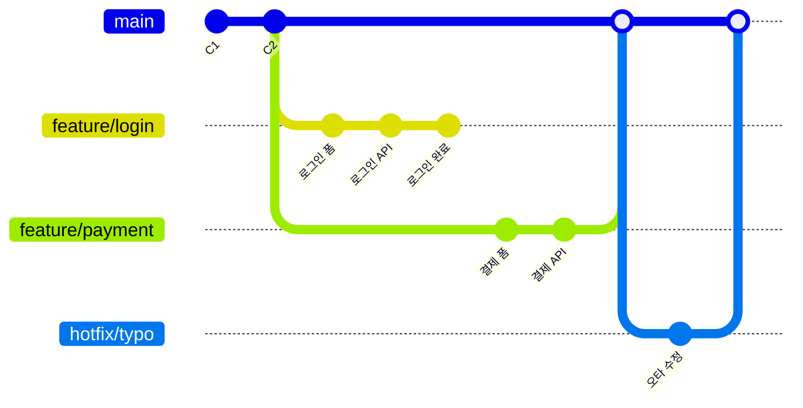

# 왜 Git을 사용해야 하나요?

앞 장에서 우리는 Git이 무엇이며 어떤 특징을 가지고 있는지에 대해 배웠습니다. 하지만 Git이 왜 이렇게 널리 사용되는지, 그리고 우리의 개발 생활에 어떤 실질적인 변화를 가져오는지에 대해서는 아직 충분히 살펴보지 못했습니다. 마치 카메라가 있음에도 사진을 찍지 않는 것과 같습니다. 이 장에서는 Git을 사용함으로써 얻을 수 있는 구체적인 이점들을 하나씩 알아보겠습니다.

## 학습 목표

- Git을 사용하여 변경 이력을 효율적으로 관리하고 복구하는 방법을 설명할 수 있다.
- 브랜치(branch)를 활용한 협업 방식의 장점을 이해한다.
- Git이 코드 안정성과 무결성을 보장하는 원리를 파악한다.
- 오픈소스 프로젝트에서 Git이 어떻게 활용되는지 이해한다.

Git은 단순히 파일을 저장하는 것을 넘어, 소프트웨어 개발 과정에서 발생할 수 있는 수많은 문제들을 해결해 주는 강력한 도구입니다. 왜 Git을 사용해야 하는지 주요 이점들을 살펴보겠습니다.

## 1. 효율적인 변경 이력 관리

가장 먼저 알아볼 Git의 장점은 **변경 이력 관리**입니다. 개발을 하다 보면 과거의 특정 시점으로 돌아가야 하는 상황이 자주 발생합니다. Git을 사용하면 이러한 작업을 매우 간단하게 처리할 수 있습니다.

Git은 프로젝트 파일의 모든 변경 사항을 체계적으로 기록합니다. 누가, 언제, 무엇을 변경했는지 상세하게 추적할 수 있으며, 필요할 경우 언제든지 특정 시점의 코드로 돌아갈 수 있습니다. 이는 실수를 쉽게 복구하고, 과거의 결정 과정을 이해하는 데 큰 도움이 됩니다.

**실제 예시: 3일 전에 잘못 수정한 코드 찾기**

```bash
$ git log --oneline --since="3 days ago"
d4e5f6f 결제 모듈 API 연동 수정
a1b2c3d 할인 쿠폰 계산 로직 변경   <-- 이 커밋에서 버그 발생
g7h8i9j 사용자 프로필 페이지 추가

# 해당 커밋의 변경 사항 확인
$ git show a1b2c3d
diff --git a/src/discount.js b/src/discount.js
-    return price * 0.9;   // 10% 할인 (정상 코드)
+    return price * 0.5;   // 50% 할인 (버그!)

# 💡 문제 발견! 실수로 할인율을 잘못 입력했습니다.
# 커밋을 되돌려서 정상 코드로 복구
$ git revert a1b2c3d --no-edit
[main 9i8h7g6] Revert "할인 쿠폰 계산 로직 변경"
```

## 2. 효과적인 협업

지금까지 우리는 Git을 활용한 변경 이력 관리에 대해 배웠습니다. 이번에는 Git의 가장 강력한 기능 중 하나인 **협업**에 대해 알아보겠습니다. 현대 소프트웨어 개발은 혼자가 아닌 팀 단위로 이루어지는 경우가 대부분이며, Git은 이러한 팀 작업을 매끄럽게 만들어 줍니다.

여러 개발자가 하나의 프로젝트에서 작업할 때 Git은 각자의 작업을 독립적으로 진행하고 나중에 합칠 수 있도록 돕습니다. 브랜치(branch) 기능을 통해 메인 코드에 영향을 주지 않고 새로운 기능 개발이나 버그 수정을 할 수 있습니다.

**브랜치 협업 개념도:**



**실제 협업 예시: 3명의 개발자가 동시에 작업**

```bash
# 개발자 A: 로그인 기능 개발
$ git switch -c feature/login
$ echo "email: password" > login.html
$ git add . && git commit -m "로그인 폼 HTML 추가"

# 개발자 B: 결제 기능 개발 (동시에!)
$ git switch -c feature/payment
$ echo "<script>pay()</script>" > payment.js
$ git add . && git commit -m "결제 API 호출 스크립트 추가"

# 개발자 C: 버그 수정 (동시에!)
$ git switch -c hotfix/typo
$ echo "오타 수정" >> index.html
$ git add . && git commit -m "메인 페이지 오타 수정"

# 30분 후... 모두 작업 완료!
# 각자 main 브랜치에 병합
$ git switch main
$ git merge feature/login
$ git merge feature/payment
$ git merge hotfix/typo
```

## 3. 코드 안정성 및 무결성 보장

협업의 장점에 이어서, Git이 제공하는 또 하나의 중요한 이점은 바로 **코드 안정성과 무결성**입니다. 아무리 협업을 잘하더라도 코드가 손상된다면 모든 작업이 무의미해질 수 있습니다.

Git은 모든 변경 이력을 해시(hash) 값으로 관리하여 데이터의 무결성을 강력하게 보장합니다. 이는 파일 내용이 의도치 않게 변경되거나 손상되는 것을 방지합니다. 또한, 분산형 시스템이므로 중앙 서버에 문제가 발생하더라도 각 개발자의 로컬 저장소에 전체 이력이 백업되어 있어 데이터 손실 위험이 적습니다.

## 4. 다양한 워크플로우 지원

Git은 유연하게 다양한 개발 워크플로우를 지원합니다. 소규모 개인 프로젝트부터 대규모 팀 프로젝트까지, 프로젝트의 특성과 팀의 필요에 맞춰 Git Flow, GitHub Flow 등 다양한 워크플로우를 적용할 수 있습니다. 이는 개발 팀의 생산성을 극대화하는 데 기여합니다.

## 5. 오픈소스 프로젝트 참여 용이

마지막으로, Git을 익히면 전 세계 개발자들과 함께하는 **오픈소스 생태계**에 참여할 수 있는 문이 열립니다.

수많은 오픈소스 프로젝트들이 Git과 GitHub(또는 GitLab, Bitbucket 등)를 통해 관리됩니다. Git을 사용하면 전 세계의 개발자들이 참여하는 오픈소스 프로젝트에 기여하거나, 다른 사람들의 코드를 가져와 자신의 프로젝트에 적용하기가 매우 쉬워집니다.

**오픈소스 기여 예시:**

```bash
# 1. React 라이브러리 코드를 내 컴퓨터로 복사
$ git clone https://github.com/facebook/react.git

# 2. 버그 수정을 위한 브랜치 생성
$ git switch -c fix-typo

# 3. 수정 후 커밋
$ git add README.md
$ git commit -m "README.md 오타 수정"

# 4. 내 fork에 푸시
$ git push origin fix-typo

# 5. GitHub에서 Pull Request 생성 → React 팀의 검토 후 병합!
```

이러한 이유들로 인해 Git은 현대 소프트웨어 개발에서 없어서는 안 될 필수 도구가 되었습니다. Git을 익히는 것은 개발자로서의 역량을 크게 향상시키는 중요한 단계입니다.

## 한눈에 정리

| 장점 | 설명 |
|------|------|
| **변경 이력 관리** | 모든 변경 사항을 체계적으로 기록하고, 언제든지 특정 시점으로 복구 가능 |
| **효과적인 협업** | 브랜치를 통해 여러 개발자가 독립적으로 작업하고 병합 가능 |
| **코드 안정성 및 무결성** | 해시 기반 데이터 관리로 변조 및 손상 방지, 분산 저장으로 백업 보장 |
| **다양한 워크플로우** | 프로젝트 규모와 팀 특성에 맞춰 Git Flow, GitHub Flow 등 유연하게 적용 가능 |
| **오픈소스 참여** | 전 세계 오픈소스 프로젝트에 기여하고 타인의 코드를 활용하기 용이 |

## 연습 문제

1. Git의 변경 이력 관리 기능이 전통적인 파일명 관리 방식보다 나은 점을 두 가지 이상 서술해보세요.
2. 브랜치(branch)를 사용하는 이유는 무엇인지 설명해보세요. 브랜치가 없다면 어떤 문제가 발생할 수 있을까요?
3. Git이 코드의 무결성을 보장하는 방식(해시 값 사용 등)에 대해 간략히 설명해보세요.
