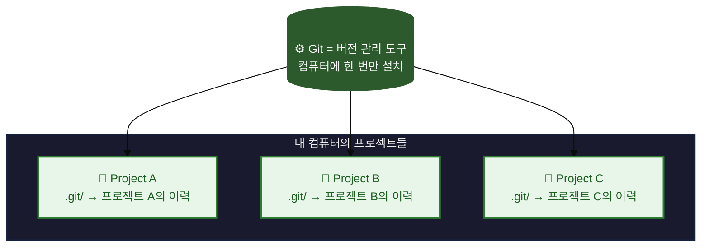
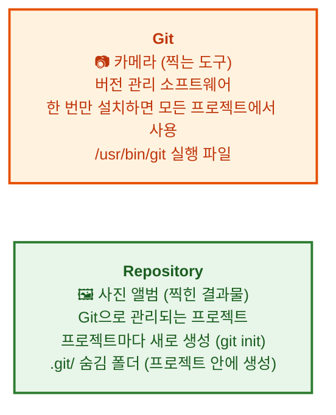
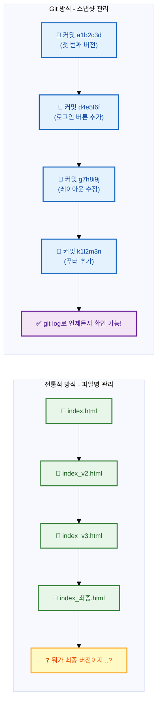
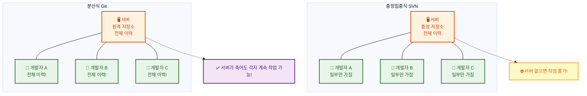
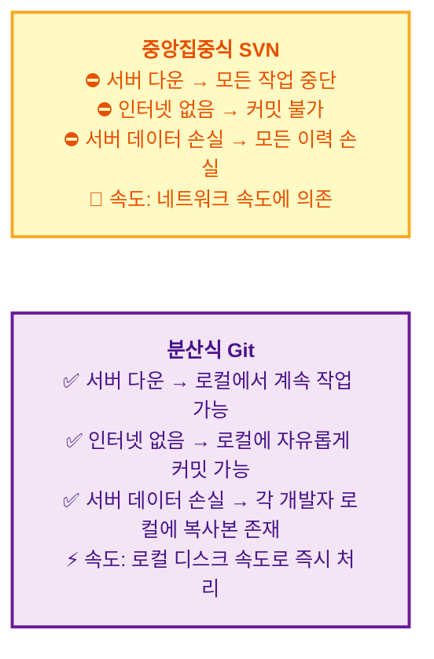

# Git이란 무엇인가요?

소프트웨어 개발을 처음 시작할 때 우리는 종종 "파일이 덮어씌워졌다", "어제까지 잘 작동했는데 왜 안 되지?"와 같은 문제에 직면합니다. 이러한 문제의 근본 원인은 바로 **변경 이력**을 체계적으로 관리하지 못하는 데 있습니다. Git은 이러한 문제를 해결하기 위해 탄생한 **버전 관리 시스템(Version Control System, VCS)**으로, 오늘날 소프트웨어 개발에서 가장 널리 사용되는 도구입니다. 이 장에서는 Git이 무엇인지, 그리고 왜 모든 개발자가 Git을 익혀야 하는지에 대해 알아보겠습니다.


## 학습 목표

- Git과 저장소(Repository)의 개념적 차이를 이해하고 설명할 수 있다.
- 버전 관리 시스템(VCS)이 필요한 이유와 Git이 제공하는 핵심 기능을 파악한다.
- Git의 분산형 구조와 중앙집중식 구조의 차이점을 비교하여 설명할 수 있다.
- Git의 주요 특징(성능, 데이터 무결성, 비선형적 개발)을 이해한다.

Git은 소프트웨어 개발 프로젝트의 **버전 관리 시스템 (Version Control System, VCS)**입니다. 개발자가 코드 변경 이력을 효율적으로 추적하고 관리하며, 여러 사람이 동시에 하나의 프로젝트에서 협업할 수 있도록 돕는 도구입니다.

## Git과 저장소(Repository)의 차이

지금까지 우리는 Git이 무엇인지 간략히 살펴보았습니다. 그런데 Git을 처음 접하는 사람들이 자주 혼동하는 개념이 하나 있습니다. 바로 **"Git"**과 **"저장소(Repository)"**의 차이입니다. 이 두 개념을 명확히 구분하는 것이 매우 중요하므로, 지금부터 자세히 알아보겠습니다.

초보자가 가장 혼동하는 개념 중 하나가 **"Git"**과 **"저장소(Repository)"**의 차이입니다.





```bash
# Git 설치 (한 번만)
$ git --version
git version 2.40.0

# Repository 생성 (프로젝트마다)
$ mkdir my-project
$ cd my-project
$ git init          # ← 이 순간부터 my-project가 Repository가 됨!
Initialized empty Git repository in /Users/me/my-project/.git/

# Git을 사용해서 Repository에 변경 사항 기록
$ echo "hello" > README.md
$ git add README.md          # ← Git이라는 도구를 사용
$ git commit -m "첫 커밋"    # ← Repository에 저장
```

쉽게 말해: **Git은 카메라, Repository는 사진 앨범**입니다. 카메라(Git)는 한 대만 있으면 되지만, 사진 앨범(Repository)은 여러 개 만들 수 있습니다.

## 버전 관리 시스템 (VCS)이란?

우리는 앞서 Git과 저장소의 관계에 대해 배웠습니다. 그렇다면 Git이 해결하고자 하는 근본적인 문제, 즉 **버전 관리**라는 개념은 무엇일까요? 다음으로 버전 관리 시스템이 무엇이며, 왜 필요한지에 대해 알아보겠습니다.

버전 관리 시스템은 파일의 변경 사항을 시간에 따라 기록하고, 언제든지 이전 버전으로 되돌리거나 특정 시점의 상태를 확인할 수 있게 해줍니다. 과거에는 파일 이름을 `문서_최종.docx`, `문서_진짜최종.docx`, `문서_진짜진짜최종.docx`와 같이 저장하는 방식이 흔했지만, 이는 혼란을 야기하고 변경 이력을 체계적으로 관리하기 어렵게 만들었습니다. VCS는 이러한 문제점을 해결하기 위해 등장했습니다.

**버전 관리 개념 이해하기:**

프로젝트를 시간에 따라 사진을 찍듯이 스냅샷으로 저장한다고 상상해보세요.



### VCS 사용 예시: 전통적인 방식 vs Git

**전통적인 방식 (Git 없음):**
```
# 파일 이름으로 버전을 관리하는 경우
project/
├── index_final.html
├── index_final_v2.html
├── index_final_v2_reviewed.html
├── index_final_v2_reviewed_final.html
├── index_최종.html        # 누가, 언제, 왜 수정했는지 알 수 없음
└── index_진짜최종_이거쓰세요.html
```

**Git 사용 방식:**
```
$ git log --oneline
a1b2c3d (HEAD) 메인 페이지 레이아웃 수정
d4e5f6f 로그인 버튼 스타일 변경
g7h8i9j 푸터에 저작권 정보 추가
k1l2m3n 첫 번째 커밋: 프로젝트 초기화

$ git show a1b2c3d
commit a1b2c3d... (HEAD)
Author: 홍길동 <hong@example.com>
Date:   Mon Jul 10 14:30:00 2026 +0900

    메인 페이지 레이아웃 수정

    - 헤더 높이를 60px에서 80px로 변경
    - 네비게이션 바 색상을 #333으로 통일
    - 반응형 그리드 시스템 적용
```

## Git의 특징

지금까지 버전 관리 시스템의 개념과 필요성에 대해 살펴보았습니다. 이제 Git이 다른 버전 관리 시스템과 어떻게 다른지, 즉 Git만의 핵심적인 특징들에 대해 알아보겠습니다.

Git은 여러 버전 관리 시스템 중에서도 특히 **분산형 버전 관리 시스템 (Distributed Version Control System, DVCS)**으로 분류됩니다. 이는 Git의 가장 중요한 특징 중 하나입니다.

*   **분산형 (Distributed):** 중앙 서버에만 의존하는 것이 아니라, 모든 개발자가 프로젝트의 전체 이력(모든 파일과 모든 변경 사항)을 자신의 로컬 컴퓨터에 복사본으로 가지고 있습니다. 덕분에 인터넷 연결이 없어도 작업할 수 있으며, 중앙 서버에 문제가 발생해도 데이터 손실의 위험이 적습니다.

    **중앙집중식 vs 분산식 구조 비교:**



    **분산형 vs 중앙집중식 비교 예시:**



*   **성능 (Performance):** Git은 매우 빠르게 동작합니다. 대부분의 작업이 로컬에서 이루어지기 때문에 네트워크 지연 없이 즉각적으로 반응합니다.

    **속도 비교 예시:**
    ```
    # Git: 브랜치 생성 (로컬, 즉시)
    $ time git branch feature/login
    real    0m0.008s   <-- 8밀리초

    # Git: 로그 확인 (로컬, 즉시)
    $ time git log --oneline -10
    real    0m0.012s   <-- 12밀리초
    ```

*   **데이터 무결성 (Data Integrity):** Git은 모든 파일 및 변경 사항을 해시(hash) 값으로 저장하여 데이터의 무결성을 보장합니다. 이는 파일 내용이 변조되거나 손상되었는지 쉽게 확인할 수 있게 합니다.

*   **비선형적 개발 (Non-linear Development):** Git은 브랜치(Branch) 개념을 매우 유연하게 지원합니다. 덕분에 여러 개발자가 서로 다른 기능을 독립적으로 개발하고, 나중에 이들을 쉽게 병합할 수 있습니다. 이는 복잡한 프로젝트나 동시 다발적인 기능 개발에 매우 유리합니다.

Git은 Linus Torvalds(리누스 토르발스), 즉 Linux 커널을 만든 사람이 개발했으며, 현재 전 세계 수많은 개발자와 기업에서 사용되고 있습니다. 이 가이드를 통해 Git의 기본 원리를 이해하고 실제 프로젝트에서 활용하는 방법을 배워봅시다.

## 한눈에 정리

| 개념 | 설명 |
|------|------|
| **Git** | 버전 관리 소프트웨어로, 컴퓨터에 한 번만 설치하면 모든 프로젝트에서 사용 가능 |
| **Repository (저장소)** | Git으로 관리되는 프로젝트로, 프로젝트마다 새로 생성하며 `.git/` 폴더에 이력 저장 |
| **VCS (버전 관리 시스템)** | 파일 변경 사항을 시간에 따라 기록하고 이전 버전으로 되돌릴 수 있게 해주는 시스템 |
| **DVCS (분산형 VCS)** | 모든 개발자가 전체 프로젝트 이력을 로컬에 복사본으로 가지는 구조로, 중앙 서버 장애에도 안전 |
| **Snapshots (스냅샷)** | Git이 특정 시점의 프로젝트 상태를 저장하는 방식 |

## 연습 문제

1. Git과 저장소(Repository)의 차이점을 자신의 언어로 설명해보세요. 비유를 사용하여 표현해도 좋습니다.
2. 중앙집중식 버전 관리 시스템과 분산식 버전 관리 시스템의 차이점을 두 가지 이상 서술해보세요.
3. Git이 데이터 무결성을 보장하는 방법은 무엇인지 간략히 설명해보세요.
