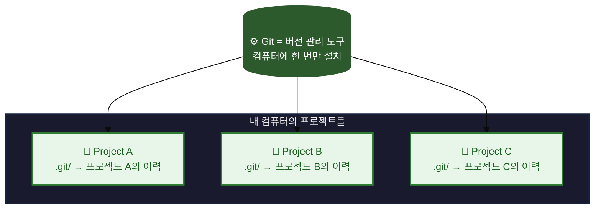
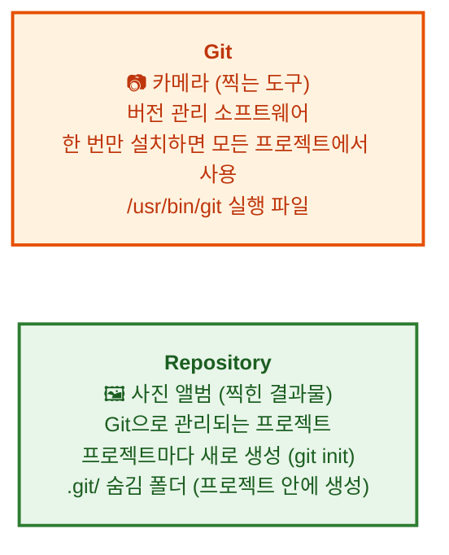
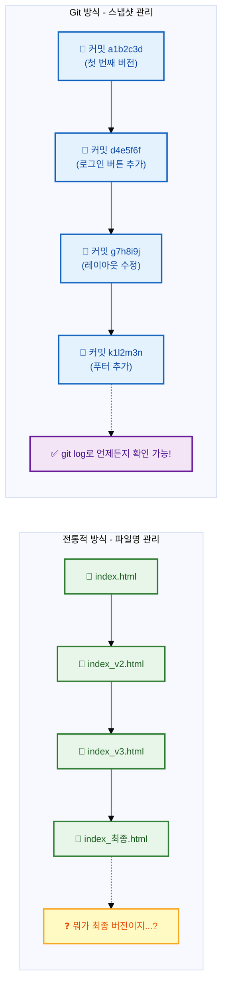
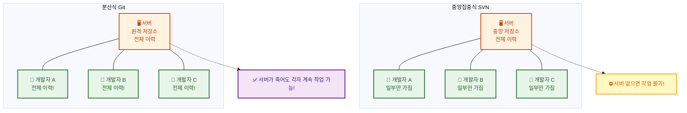
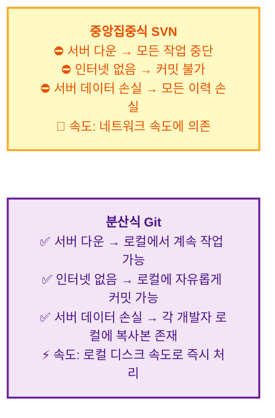

# Git이란 무엇인가요?

소프트웨어 개발을 처음 시작할 때 우리는 종종 "파일이 덮어씌워졌다", "어제까지 잘 작동했는데 왜 안 되지?"와 같은 문제에 직면합니다. 이러한 문제의 근본 원인은 바로 **변경 이력**을 체계적으로 관리하지 못하는 데 있습니다. Git은 이러한 문제를 해결하기 위해 탄생한 **버전 관리 시스템(Version Control System, VCS)**으로, 오늘날 소프트웨어 개발에서 가장 널리 사용되는 도구입니다. 이 장에서는 Git이 무엇인지, 그리고 왜 모든 개발자가 Git을 익혀야 하는지에 대해 알아보겠습니다.

👨‍💻 **실전 프로젝트: 첫 Git 저장소 만들기**

이론을 배우기에 앞서, 먼저 직접 Git을 경험해 보는 것이 가장 효과적인 학습 방법입니다. 지금부터 여러분은 터미널을 열고 실제로 Git 저장소를 생성하고 첫 번째 커밋을 만들어 보게 됩니다. 이 과정은 단 1분도 채 걸리지 않지만, Git이 어떻게 동작하는지 직관적으로 이해하는 데 큰 도움이 될 것입니다. 코드를 따라 입력하면서 Git의 기본적인 워크플로우를 몸으로 익혀 보시기 바랍니다.

```bash
# 1. 프로젝트 디렉토리 생성 및 이동
$ mkdir my-first-repo
$ cd my-first-repo

# 2. Git 저장소 초기화 (이 순간부터 이 폴더는 Git의 관리를 받습니다)
$ git init
Initialized empty Git repository in /Users/me/my-first-repo/.git/

# 3. 첫 번째 파일 생성
$ echo "# 내 첫 Git 프로젝트" > README.md

# 4. 파일의 현재 상태 확인 (Git이 파일을 인식하는지 살펴봅니다)
$ git status
On branch main
No commits yet
Untracked files:
  (use "git add <file>..." to include in what will be committed)
        README.md

# 5. Staging Area에 파일 추가 (커밋할 준비를 합니다)
$ git add README.md

# 6. 첫 번째 커밋 생성 (드디어 첫 스냅샷을 저장합니다)
$ git commit -m "첫 커밋: README 파일 추가"
[main (root-commit) a1b2c3d] 첫 커밋: README 파일 추가
 1 file changed, 1 insertion(+)
 create mode 100644 README.md

# 7. 커밋 히스토리 확인 (지금부터 Git이 모든 변경을 추적합니다)
$ git log --oneline
a1b2c3d (HEAD -> main) 첫 커밋: README 파일 추가
```

이렇게 첫 번째 커밋이 완료되었습니다. 이제 여러분은 Git이라는 강력한 도구를 사용하여 프로젝트의 모든 변경 사항을 체계적으로 관리할 수 있게 되었습니다. 앞으로 배우게 될 모든 개념은 이 기본적인 워크플로우 위에 쌓여 가게 됩니다.

## 학습 목표

- Git과 저장소(Repository)의 개념적 차이를 이해하고 설명할 수 있다.
- 버전 관리 시스템(VCS)이 필요한 이유와 Git이 제공하는 핵심 기능을 파악한다.
- Git의 분산형 구조와 중앙집중식 구조의 차이점을 비교하여 설명할 수 있다.
- Git의 주요 특징(성능, 데이터 무결성, 비선형적 개발)을 이해한다.

Git은 소프트웨어 개발 프로젝트의 **버전 관리 시스템 (Version Control System, VCS)**입니다. 개발자가 코드 변경 이력을 효율적으로 추적하고 관리하며, 여러 사람이 동시에 하나의 프로젝트에서 협업할 수 있도록 돕는 도구입니다.

여기서 한 걸음 더 나아가 생각해 보겠습니다. Git은 단순히 "파일을 저장하는 프로그램"이 아닙니다. Git은 시간 여행을 가능하게 하는 도구와도 같습니다. 과거의 특정 시점으로 돌아갈 수도 있고, 현재 작업 중인 내용이 언제, 누구에 의해, 왜 추가되었는지를 정확히 추적할 수 있습니다. 예를 들어, "어제까지 잘 작동하던 로그인 기능이 오늘 갑자기 고장 났다"라는 상황에서 Git이 없다면 개발자는 모든 코드를 하나하나 뒤져 보며 원인을 찾아야 합니다. 그러나 Git이 있다면 `git log` 명령어 한 줄로 문제가 발생한 커밋을 찾아내고, `git revert` 명령어로 즉시 문제가 없던 시점으로 되돌아갈 수 있습니다. 실제로 수많은 스타트업과 대기업의 개발팀이 Git을 표준 도구로 채택하고 있으며, Git을 모르는 개발자는 현업에서 마치 운전면허증 없는 운전자와 같은 취급을 받을 정도입니다. 따라서 Git 학습은 선택이 아닌 필수입니다.

## Git과 저장소(Repository)의 차이

지금까지 우리는 Git이 무엇인지 간략히 살펴보았습니다. 그런데 Git을 처음 접하는 사람들이 자주 혼동하는 개념이 하나 있습니다. 바로 **"Git"**과 **"저장소(Repository)"**의 차이입니다. 이 두 개념을 명확히 구분하는 것이 매우 중요하므로, 지금부터 자세히 알아보겠습니다.

초보자가 가장 혼동하는 개념 중 하나가 **"Git"**과 **"저장소(Repository)"**의 차이입니다.

이 혼동이 발생하는 이유는 일상적인 대화에서 "Git에 코드를 올린다"거나 "Git에 푸시한다"와 같은 표현을 자주 사용하기 때문입니다. 엄밀히 말하면 "Git 저장소에 코드를 올린다"가 정확한 표현입니다. Git은 도구이고, 저장소는 그 도구로 관리되는 대상입니다. 비유를 통해 이해하면 훨씬 쉽습니다. Git은 마치 카메라와 같습니다. 카메라(Git)는 한 대만 있으면 수많은 사진을 찍을 수 있습니다. 그리고 각 사진 앨범(Repository)은 찍은 사진들을 보관하는 장소입니다. 프로젝트를 하나 새로 시작할 때마다 새로운 사진 앨범을 준비하는 것처럼 `git init` 명령어로 새로운 저장소를 생성하는 것입니다. 만약 이 차이를 이해하지 못한다면, "Git을 어떻게 설치하나요?"와 "저장소를 어떻게 생성하나요?"라는 전혀 다른 질문을 혼동하게 될 수 있습니다.





```bash
# Git 설치 (한 번만)
$ git --version
git version 2.40.0

# Repository 생성 (프로젝트마다)
$ mkdir my-project
$ cd my-project
$ git init          # ← 이 순간부터 my-project가 Repository가 됨!
Initialized empty Git repository in /Users/me/my-project/.git/

# Git을 사용해서 Repository에 변경 사항 기록
$ echo "hello" > README.md
$ git add README.md          # ← Git이라는 도구를 사용
$ git commit -m "첫 커밋"    # ← Repository에 저장
```

쉽게 말해: **Git은 카메라, Repository는 사진 앨범**입니다. 카메라(Git)는 한 대만 있으면 되지만, 사진 앨범(Repository)은 여러 개 만들 수 있습니다.

이 비유를 조금 더 확장해 보겠습니다. 카메라(Git)가 아무리 좋아도 사진 앨범(Repository)이 없다면 찍은 사진을 보관할 곳이 없습니다. 반대로 사진 앨범만 있고 카메라가 없다면 사진을 찍을 수 없습니다. 이처럼 Git과 저장소는 서로 떼려야 뗄 수 없는 관계이지만, 개념적으로는 명확히 구분해야 합니다. 여러분이 새로운 프로젝트를 시작할 때마다 `git init`이나 `git clone`을 실행하는 이유가 바로 새로운 사진 앨범을 준비하는 것이라고 생각하면 됩니다. 그리고 그 앨범에 사진을 찍어 저장하는 행위가 바로 `git commit`입니다. 이러한 개념적 이해는 앞으로 Git을 사용하면서 마주칠 수많은 명령어와 상황을 올바르게 해석하는 기초가 됩니다.

## 버전 관리 시스템 (VCS)이란?

우리는 앞서 Git과 저장소의 관계에 대해 배웠습니다. 그렇다면 Git이 해결하고자 하는 근본적인 문제, 즉 **버전 관리**라는 개념은 무엇일까요? 다음으로 버전 관리 시스템이 무엇이며, 왜 필요한지에 대해 알아보겠습니다.

버전 관리 시스템은 파일의 변경 사항을 시간에 따라 기록하고, 언제든지 이전 버전으로 되돌리거나 특정 시점의 상태를 확인할 수 있게 해줍니다. 과거에는 파일 이름을 `문서_최종.docx`, `문서_진짜최종.docx`, `문서_진짜진짜최종.docx`와 같이 저장하는 방식이 흔했지만, 이는 혼란을 야기하고 변경 이력을 체계적으로 관리하기 어렵게 만들었습니다. VCS는 이러한 문제점을 해결하기 위해 등장했습니다.

생각해 보면, 파일 이름에 "최종"이라는 단어를 붙이는 순간 이미 버전 관리가 실패하고 있다는 신호입니다. "이 파일이 정말 최종본이 맞는가?", "어제 수정한 내용이 이 파일에 반영되어 있는가?"라는 의문이 끊임없이 따라다니기 때문입니다. 더 큰 문제는 팀 협업 상황에서 발생합니다. A 개발자가 `index_최종.html`을 수정하는 동안 B 개발자는 `index_진짜최종.html`을 수정하고 있었다면, 두 사람의 작업을 합치는 것은 거의 불가능에 가깝습니다. VCS는 이러한 모든 문제를 해결합니다. 각각의 변경 사항에 고유한 ID(커밋 해시)를 부여하고, 누가, 언제, 왜 변경했는지를 함께 기록함으로써 완벽한 추적성을 제공합니다. 실무에서는 이를 "감사 추적성(Audit Trail)"이라고 부르며, 특히 금융이나 의료 분야의 소프트웨어 개발에서는 법적 요구 사항으로까지 연결됩니다.

**버전 관리 개념 이해하기:**

프로젝트를 시간에 따라 사진을 찍듯이 스냅샷으로 저장한다고 상상해보세요.



이 다이어그램이 보여주듯, 전통적인 방식은 파일명 자체에 버전 정보를 담으려고 하지만 이는 곧 한계에 부딪힙니다. 반면 Git의 스냅샷 방식은 각 버전이 독립적이면서도 서로 연결된 하나의 체인을 형성합니다. 각 커밋은 이전 커밋이 무엇인지를 가리키는 부모 참조(Parent Reference)를 가지고 있어, 시간의 흐름이 끊기지 않고 연결됩니다. 이 구조 덕분에 우리는 "3일 전의 커밋"이나 "지난주 화요일에 작업한 내용"을 단 한 줄의 명령어로 정확히 찾아낼 수 있습니다.

### VCS 사용 예시: 전통적인 방식 vs Git

**전통적인 방식 (Git 없음):**
```
# 파일 이름으로 버전을 관리하는 경우
project/
├── index_final.html
├── index_final_v2.html
├── index_final_v2_reviewed.html
├── index_final_v2_reviewed_final.html
├── index_최종.html        # 누가, 언제, 왜 수정했는지 알 수 없음
└── index_진짜최종_이거쓰세요.html
```

**Git 사용 방식:**
```
$ git log --oneline
a1b2c3d (HEAD) 메인 페이지 레이아웃 수정
d4e5f6f 로그인 버튼 스타일 변경
g7h8i9j 푸터에 저작권 정보 추가
k1l2m3n 첫 번째 커밋: 프로젝트 초기화

$ git show a1b2c3d
commit a1b2c3d... (HEAD)
Author: 홍길동 <hong@example.com>
Date:   Mon Jul 10 14:30:00 2026 +0900

    메인 페이지 레이아웃 수정

    - 헤더 높이를 60px에서 80px로 변경
    - 네비게이션 바 색상을 #333으로 통일
    - 반응형 그리드 시스템 적용
```

위 예시에서 볼 수 있듯, 전통적인 방식은 단 6개의 파일만으로도 이미 혼란스러운 상태입니다. 실제 프로젝트에서는 파일 수가 수백, 수천 개에 달하므로 이러한 방식은 전혀 현실적이지 않습니다. Git을 사용하면 각 커밋에 작성자, 날짜, 그리고 변경 사항에 대한 설명이 함께 기록됩니다. `git show` 명령어 하나로 해당 커밋에서 정확히 어떤 파일이 어떻게 변경되었는지를 한눈에 확인할 수 있습니다. 이는 코드 리뷰(Code Review) 과정에서도 매우 중요하게 활용됩니다.

## Git의 특징

지금까지 버전 관리 시스템의 개념과 필요성에 대해 살펴보았습니다. 이제 Git이 다른 버전 관리 시스템과 어떻게 다른지, 즉 Git만의 핵심적인 특징들에 대해 알아보겠습니다.

Git은 여러 버전 관리 시스템 중에서도 특히 **분산형 버전 관리 시스템 (Distributed Version Control System, DVCS)**으로 분류됩니다. 이는 Git의 가장 중요한 특징 중 하나입니다.

이 특징을 이해하기 위해 먼저 Git의 탄생 배경을 간략히 살펴볼 필요가 있습니다. 2005년, 리누스 토르발스(Linus Torvalds)는 Linux 커널 개발을 위해 기존에 사용하던 BitKeeper라는 VCS의 무료 사용이 중단되자, 직접 새로운 버전 관리 시스템을 만들기로 결심합니다. 그가 가장 중요하게 생각한 것은 속도와 분산성이었습니다. 수천 명의 개발자가 동시에 기여하는 Linux 커널 같은 대규모 프로젝트에서는 중앙 서버에 의존하는 방식이 치명적인 병목이 될 수밖에 없었습니다. 그 결과 탄생한 Git은 모든 개발자가 프로젝트의 전체 복사본을 로컬에 가지는 분산형 구조를 채택하게 됩니다.

*   **분산형 (Distributed):** 중앙 서버에만 의존하는 것이 아니라, 모든 개발자가 프로젝트의 전체 이력(모든 파일과 모든 변경 사항)을 자신의 로컬 컴퓨터에 복사본으로 가지고 있습니다. 덕분에 인터넷 연결이 없어도 작업할 수 있으며, 중앙 서버에 문제가 발생해도 데이터 손실의 위험이 적습니다.

    이 구조가 주는 실질적인 이점을 구체적인 시나리오로 생각해 보겠습니다. 여러분이 기차 안에서 노트북으로 코딩을 하고 있다고 가정합시다. 터널을 지나면서 인터넷이 끊겼습니다. 중앙집중식 SVN을 사용한다면 커밋도 할 수 없고, 로그도 볼 수 없으며, 이전 버전과의 비교도 불가능합니다. 모든 작업이 중단됩니다. 하지만 Git을 사용한다면 아무런 문제가 없습니다. 로컬에서 자유롭게 커밋하고, 브랜치를 만들고, 이전 버전과 비교할 수 있습니다. 인터넷이 연결된 후에 `git push` 명령어 한 번으로 그동안 쌓아둔 커밋들을 원격 저장소에 한꺼번에 전송하면 됩니다. 이것이 바로 분산형 구조가 주는 가장 큰 자유도입니다.

    **중앙집중식 vs 분산식 구조 비교:**



    **분산형 vs 중앙집중식 비교 예시:**



이렇게 분산형 구조는 개발자 개인의 작업 자유도를 크게 높여 줍니다. 하지만 이것이 Git의 유일한 장점은 아닙니다. 분산성 외에도 Git이 다른 VCS와 차별화되는 또 다른 중요한 요소들이 있습니다. 바로 압도적인 성능, 철저한 데이터 무결성, 그리고 유연한 비선형적 개발 지원입니다. 하나씩 자세히 살펴보겠습니다.

*   **성능 (Performance):** Git은 매우 빠르게 동작합니다. 대부분의 작업이 로컬에서 이루어지기 때문에 네트워크 지연 없이 즉각적으로 반응합니다.

    이 성능 차이는 실제 개발 환경에서 체감하기 어려울 정도로 큽니다. SVN에서 브랜치를 생성하면 서버의 전체 파일을 복사해야 하므로 프로젝트 크기에 따라 수 초에서 수 분이 걸릴 수 있습니다. 반면 Git에서 브랜치를 생성하는 것은 단순히 41바이트 크기의 포인터 파일을 하나 만드는 것에 불과합니다. 따라서 Git의 브랜치 생성은 항상 수 밀리초 안에 완료됩니다. 이 성능 차이는 개발자의 작업 흐름에도 영향을 줍니다. SVN 사용자는 브랜치 생성이 부담스러워 "브랜치는 신중하게, 꼭 필요할 때만" 사용하는 반면, Git 사용자는 "기능 하나당 하나의 브랜치"라는 전략을 부담 없이 사용할 수 있습니다.

    **속도 비교 예시:**
    ```
    # Git: 브랜치 생성 (로컬, 즉시)
    $ time git branch feature/login
    real    0m0.008s   <-- 8밀리초

    # Git: 로그 확인 (로컬, 즉시)
    $ time git log --oneline -10
    real    0m0.012s   <-- 12밀리초
    ```

*   **데이터 무결성 (Data Integrity):** Git은 모든 파일 및 변경 사항을 해시(hash) 값으로 저장하여 데이터의 무결성을 보장합니다. 이는 파일 내용이 변조되거나 손상되었는지 쉽게 확인할 수 있게 합니다.

    Git은 SHA-1 해시 함수를 사용하여 모든 데이터를 식별합니다. 각 커밋과 파일은 40자리의 16진수 해시 값(예: `a1b2c3d4e5f6...`)으로 고유하게 식별됩니다. 이 해시 값은 데이터의 내용을 기반으로 계산되므로, 파일 내용이 단 1비트라도 변경되면 완전히 다른 해시 값이 생성됩니다. Git 내부에서는 데이터를 저장하거나 검색할 때마다 이 해시 값을 사용하므로, 데이터가 손상되었는지 여부를 항상 즉시 확인할 수 있습니다. 이러한 설계는 저장소의 데이터 무결성을 수학적으로 보장합니다. 실제로 Git은 "체크섬(Checksum) 저장소"라고 불리기도 하는데, 이는 Git이 데이터를 저장하기 전에 항상 체크섬을 계산하고, 그 체크섬으로 데이터를 참조하기 때문입니다.

*   **비선형적 개발 (Non-linear Development):** Git은 브랜치(Branch) 개념을 매우 유연하게 지원합니다. 덕분에 여러 개발자가 서로 다른 기능을 독립적으로 개발하고, 나중에 이들을 쉽게 병합할 수 있습니다. 이는 복잡한 프로젝트나 동시 다발적인 기능 개발에 매우 유리합니다.

    브랜치는 Git의 작업 공간을 분리하는 가상의 포인터입니다. `main` 브랜치에서 `feature/login` 브랜치를 생성하면, 로그인 기능 개발 중에는 `main` 브랜치의 코드가 완전히 보호됩니다. 개발 도중에 긴급 버그가 발생하면 `main` 브랜치로 돌아가서 `hotfix` 브랜치를 만들고 버그를 수정한 후, 다시 `feature/login` 브랜치로 돌아와 작업을 계속할 수 있습니다. 이 모든 과정이 서로 간섭 없이 이루어집니다. Git의 브랜치 병합(Merge) 알고리즘은 자동으로 변경 사항을 통합하며, 동일한 파일의 동일한 부분이 동시에 수정된 경우에만 충돌(Conflict)이 발생합니다.

Git은 Linus Torvalds(리누스 토르발스), 즉 Linux 커널을 만든 사람이 개발했으며, 현재 전 세계 수많은 개발자와 기업에서 사용되고 있습니다. 이 가이드를 통해 Git의 기본 원리를 이해하고 실제 프로젝트에서 활용하는 방법을 배워봅시다.

지금까지 우리는 Git의 핵심 특징인 분산성, 성능, 데이터 무결성, 비선형적 개발에 대해 살펴보았습니다. 이러한 특징들은 각각 독립적으로도 의미가 있지만, 실제로는 서로 유기적으로 결합되어 Git만의 강력한 개발 경험을 만들어 냅니다. 아래의 한눈에 정리 표에서 지금까지 배운 주요 개념들을 최종적으로 정리해 보겠습니다.

## 한눈에 정리

| 개념 | 설명 |
|------|------|
| **Git** | 버전 관리 소프트웨어로, 컴퓨터에 한 번만 설치하면 모든 프로젝트에서 사용 가능 |
| **Repository (저장소)** | Git으로 관리되는 프로젝트로, 프로젝트마다 새로 생성하며 `.git/` 폴더에 이력 저장 |
| **VCS (버전 관리 시스템)** | 파일 변경 사항을 시간에 따라 기록하고 이전 버전으로 되돌릴 수 있게 해주는 시스템 |
| **DVCS (분산형 VCS)** | 모든 개발자가 전체 프로젝트 이력을 로컬에 복사본으로 가지는 구조로, 중앙 서버 장애에도 안전 |
| **Snapshots (스냅샷)** | Git이 특정 시점의 프로젝트 상태를 저장하는 방식 |

## 연습 문제

이제 배운 내용을 스스로 확인해 보겠습니다. 다음 문제를 풀어 보면서 각 개념을 자신의 언어로 표현하는 연습을 해보시기 바랍니다. 단순히 암기하는 것이 아니라, 실제로 다른 사람에게 설명할 수 있을 정도로 이해하는 것이 중요합니다.

1. Git과 저장소(Repository)의 차이점을 자신의 언어로 설명해보세요. 비유를 사용하여 표현해도 좋습니다.
2. 중앙집중식 버전 관리 시스템과 분산식 버전 관리 시스템의 차이점을 두 가지 이상 서술해보세요.
3. Git이 데이터 무결성을 보장하는 방법은 무엇인지 간략히 설명해보세요.
