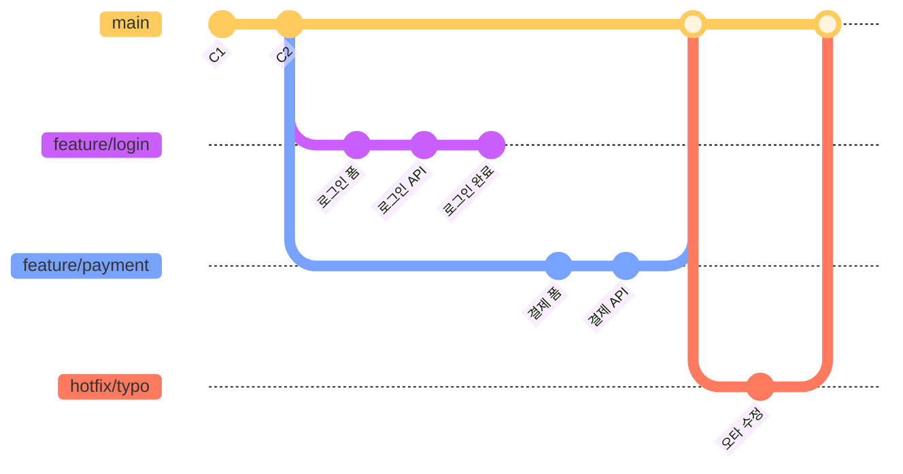

# 왜 Git을 사용해야 하나요?

앞 장에서 우리는 Git이 무엇이며 어떤 특징을 가지고 있는지에 대해 배웠습니다. 하지만 Git이 왜 이렇게 널리 사용되는지, 그리고 우리의 개발 생활에 어떤 실질적인 변화를 가져오는지에 대해서는 아직 충분히 살펴보지 못했습니다. 마치 카메라가 있음에도 사진을 찍지 않는 것과 같습니다. 이 장에서는 Git을 사용함으로써 얻을 수 있는 구체적인 이점들을 하나씩 알아보겠습니다.

👨‍💻 **실전 프로젝트: 버전 관리의 필요성 체험하기**

이론적인 설명만으로는 Git의 필요성이 와닿지 않을 수 있습니다. 가장 확실한 방법은 직접 경험해 보는 것입니다. 지금부터 우리는 Git이 없는 상황과 Git이 있는 상황을 각각 체험하면서 버전 관리 시스템이 왜 필요한지를 몸으로 익혀 보겠습니다.

```bash
# === [Git 없이 하는 방법] ===

# 1. 프로젝트 폴더를 만들고 파일을 생성합니다
$ mkdir project-without-git
$ cd project-without-git
$ echo "제목: 내 웹사이트" > index.html

# 2. 수정이 필요해졌습니다. 백업을 위해 폴더를 통째로 복사합니다
$ cd ..
$ cp -r project-without-git project-without-git_20240710
$ cd project-without-git
$ echo "<h1>환영합니다</h1>" >> index.html

# 3. 또 수정이 필요합니다. 다시 복사합니다
$ cd ..
$ cp -r project-without-git project-without-git_20240711_v2

# 4. 점점 폴더가 늘어납니다... 어떤 파일이 최신인지 알 수 없습니다
$ ls -la
drwxr-xr-x  project-without-git
drwxr-xr-x  project-without-git_20240710
drwxr-xr-x  project-without-git_20240711_v2

# === [Git으로 하는 방법] ===

# 1. Git 저장소를 초기화합니다
$ mkdir project-with-git
$ cd project-with-git
$ git init
$ echo "제목: 내 웹사이트" > index.html
$ git add index.html
$ git commit -m "첫 번째 버전: 기본 구조"

# 2. 수정 후 커밋으로 기록합니다
$ echo "<h1>환영합니다</h1>" >> index.html
$ git add . && git commit -m "두 번째 버전: 헤더 추가"

# 3. 다시 수정 후 커밋합니다
$ echo "<footer>ⓒ 2026</footer>" >> index.html
$ git add . && git commit -m "세 번째 버전: 푸터 추가"

# 4. 언제든지 git log로 모든 이력을 확인할 수 있습니다!
$ git log --oneline
c3d4e5f (HEAD) 세 번째 버전: 푸터 추가
b2c3d4e 두 번째 버전: 헤더 추가
a1b2c3d 첫 번째 버전: 기본 구조

# 5. 문제가 생기면 언제든 특정 시점으로 되돌아갈 수 있습니다
$ git revert b2c3d4e --no-edit
```

이 실습을 통해 우리는 Git의 핵심 가치를 직접 체험하였습니다. Git 없이 작업할 때는 파일이 점점 늘어나고 혼란스러워지기만 하지만, Git과 함께 작업할 때는 모든 변경 사항이 깔끔하게 정리되고 필요할 때마다 과거로 돌아갈 수 있습니다. 이제 본격적으로 Git의 각 장점을 하나씩 자세히 살펴보겠습니다.

## 학습 목표

- Git을 사용하여 변경 이력을 효율적으로 관리하고 복구하는 방법을 설명할 수 있다.
- 브랜치(branch)를 활용한 협업 방식의 장점을 이해한다.
- Git이 코드 안정성과 무결성을 보장하는 원리를 파악한다.
- 오픈소스 프로젝트에서 Git이 어떻게 활용되는지 이해한다.

Git은 단순히 파일을 저장하는 것을 넘어, 소프트웨어 개발 과정에서 발생할 수 있는 수많은 문제들을 해결해 주는 강력한 도구입니다. 왜 Git을 사용해야 하는지 주요 이점들을 살펴보겠습니다.

이러한 이점들은 크게 다섯 가지 범주로 나눌 수 있습니다. 개인 개발자로서의 효율성 향상, 팀 협업의 원활함, 코드 품질 보장, 워크플로우의 유연성, 그리고 오픈소스 생태계로의 참여입니다. 이 중 어떤 하나라도 현대 소프트웨어 개발에서 빼놓을 수 없는 요소입니다.

## 1. 효율적인 변경 이력 관리

가장 먼저 알아볼 Git의 장점은 **변경 이력 관리**입니다. 개발을 하다 보면 과거의 특정 시점으로 돌아가야 하는 상황이 자주 발생합니다. Git을 사용하면 이러한 작업을 매우 간단하게 처리할 수 있습니다.

Git은 프로젝트 파일의 모든 변경 사항을 체계적으로 기록합니다. 누가, 언제, 무엇을 변경했는지 상세하게 추적할 수 있으며, 필요할 경우 언제든지 특정 시점의 코드로 돌아갈 수 있습니다. 이는 실수를 쉽게 복구하고, 과거의 결정 과정을 이해하는 데 큰 도움이 됩니다.

변경 이력 관리는 단순히 "과거로 돌아가는 기능" 이상의 의미를 가집니다. 이는 개발 과정에서 발생하는 모든 의사 결정의 기록이기도 합니다. 예를 들어, "왜 이 코드가 이렇게 작성되었을까?"라는 궁금증이 생겼을 때, `git blame` 명령어를 사용하면 해당 코드를 마지막으로 수정한 사람과 그 커밋 메시지를 즉시 확인할 수 있습니다. 또한 Git의 이력 관리는 감사(Audit) 목적으로도 사용됩니다. 기업에서는 "누가, 언제, 어떤 코드를 배포했는지"를 추적해야 하는 규정을 가지고 있는 경우가 많으며, Git은 이러한 요구 사항을 완벽히 충족시켜 줍니다. 개인 프로젝트에서도 Git의 이력 관리는 유용합니다. "어제까지 잘 작동하던 기능이 왜 깨졌을까?"라는 질문에 답하기 위해 `git bisect` 명령어를 사용하면 이진 탐색 방식으로 문제가 발생한 커밋을 자동으로 찾아낼 수 있습니다.

**실제 예시: 3일 전에 잘못 수정한 코드 찾기**

```bash
$ git log --oneline --since="3 days ago"
d4e5f6f 결제 모듈 API 연동 수정
a1b2c3d 할인 쿠폰 계산 로직 변경   <-- 이 커밋에서 버그 발생
g7h8i9j 사용자 프로필 페이지 추가

# 해당 커밋의 변경 사항 확인
$ git show a1b2c3d
diff --git a/src/discount.js b/src/discount.js
-    return price * 0.9;   // 10% 할인 (정상 코드)
+    return price * 0.5;   // 50% 할인 (버그!)

# 💡 문제 발견! 실수로 할인율을 잘못 입력했습니다.
# 커밋을 되돌려서 정상 코드로 복구
$ git revert a1b2c3d --no-edit
[main 9i8h7g6] Revert "할인 쿠폰 계산 로직 변경"
```

이처럼 Git은 단 3줄의 명령어로 버그를 찾고 복구하는 전 과정을 끝낼 수 있게 해 줍니다. Git이 없다면 개발자는 모든 파일을 수동으로 비교하면서 어디서 문제가 발생했는지 찾아야 하고, 복구 과정에서 또 다른 실수를 저지를 위험도 있습니다. Git을 사용하면 변경 이력이 완벽하게 보존되어 있으므로, `git revert` 명령어 한 번으로 문제가 발생한 커밋의 변경 사항만 정확히 취소할 수 있습니다.

## 2. 효과적인 협업

지금까지 우리는 Git을 활용한 변경 이력 관리에 대해 배웠습니다. 이번에는 Git의 가장 강력한 기능 중 하나인 **협업**에 대해 알아보겠습니다. 현대 소프트웨어 개발은 혼자가 아닌 팀 단위로 이루어지는 경우가 대부분이며, Git은 이러한 팀 작업을 매끄럽게 만들어 줍니다.

여러 개발자가 하나의 프로젝트에서 작업할 때 Git은 각자의 작업을 독립적으로 진행하고 나중에 합칠 수 있도록 돕습니다. 브랜치(branch) 기능을 통해 메인 코드에 영향을 주지 않고 새로운 기능 개발이나 버그 수정을 할 수 있습니다.

협업 환경에서 Git이 없다면 어떤 일이 벌어질까요? 두 명의 개발자가 동시에 같은 파일을 수정해야 한다고 가정해 보겠습니다. Git이 없다면 한 명이 작업하는 동안 다른 한 명은 기다려야 하거나, 먼저 저장한 사람의 작업이 나중에 저장한 사람의 작업에 의해 덮어씌워지는 끔찍한 상황이 발생합니다. Git의 브랜치는 이러한 문제를 근본적으로 해결합니다. 각 개발자는 자신만의 브랜치에서 자유롭게 작업하고, 작업이 완료되면 메인 브랜치에 병합(Merge)을 요청합니다. 병합 과정에서 Git은 자동으로 변경 사항을 분석하여 충돌이 없는 부분은 자동으로 합쳐 주고, 충돌이 발생한 부분만 개발자에게 알려 줍니다.

**브랜치 협업 개념도:**



위 다이어그램은 세 명의 개발자가 동시에 다른 작업을 수행하는 모습을 보여 줍니다. `feature/login` 브랜치에서 로그인 기능을 개발하는 동안, `feature/payment` 브랜치에서는 결제 기능이, `hotfix/typo` 브랜치에서는 긴급 버그 수정이 동시에 진행됩니다. 각 브랜치는 `main` 브랜치로부터 분기되어 독립적으로 개발된 후, 다시 `main` 브랜치로 병합됩니다. 이 과정에서 각 개발자의 작업은 서로 전혀 간섭하지 않습니다.

**실제 협업 예시: 3명의 개발자가 동시에 작업**

```bash
# 개발자 A: 로그인 기능 개발
$ git switch -c feature/login
$ echo "email: password" > login.html
$ git add . && git commit -m "로그인 폼 HTML 추가"

# 개발자 B: 결제 기능 개발 (동시에!)
$ git switch -c feature/payment
$ echo "<script>pay()</script>" > payment.js
$ git add . && git commit -m "결제 API 호출 스크립트 추가"

# 개발자 C: 버그 수정 (동시에!)
$ git switch -c hotfix/typo
$ echo "오타 수정" >> index.html
$ git add . && git commit -m "메인 페이지 오타 수정"

# 30분 후... 모두 작업 완료!
# 각자 main 브랜치에 병합
$ git switch main
$ git merge feature/login
$ git merge feature/payment
$ git merge hotfix/typo
```

이 예시에서 주목할 점은 개발자 A, B, C가 서로의 작업 내용을 전혀 알 필요 없이 독립적으로 작업을 진행했다는 것입니다. 각자의 브랜치에서 개발을 완료한 후 `main` 브랜치에 병합하기만 하면 됩니다. 만약 동시에 같은 파일의 같은 부분을 수정하는 충돌(Conflict)이 발생하더라도, Git은 충돌이 발생한 위치를 정확히 알려 주고 개발자가 직접 수동으로 해결할 수 있도록 안내합니다. 이러한 협업 방식은 특히 원격 근무나 분산된 팀 환경에서 더욱 빛을 발합니다.

## 3. 코드 안정성 및 무결성 보장

협업의 장점에 이어서, Git이 제공하는 또 하나의 중요한 이점은 바로 **코드 안정성과 무결성**입니다. 아무리 협업을 잘하더라도 코드가 손상된다면 모든 작업이 무의미해질 수 있습니다.

Git은 모든 변경 이력을 해시(hash) 값으로 관리하여 데이터의 무결성을 강력하게 보장합니다. 이는 파일 내용이 의도치 않게 변경되거나 손상되는 것을 방지합니다. 또한, 분산형 시스템이므로 중앙 서버에 문제가 발생하더라도 각 개발자의 로컬 저장소에 전체 이력이 백업되어 있어 데이터 손실 위험이 적습니다.

이 무결성 보장 메커니즘은 Git의 내부 설계에 깊이 뿌리박혀 있습니다. Git에서 모든 파일과 커밋은 SHA-1 해시 값으로 식별되며, 이 해시 값은 데이터의 내용을 기반으로 계산됩니다. 따라서 저장된 데이터가 조금이라도 변경되면 해시 값이 달라지므로 Git은 즉시 데이터 손상을 감지할 수 있습니다. 해커가 Git 저장소의 코드를 몰래 변경하는 것도 사실상 불가능합니다. 또한 Git은 모든 객체(Object)를 저장할 때 압축(Zlib 압축)과 함께 체크섬을 추가하므로, 디스크 오류나 데이터 전송 중 발생할 수 있는 손상도 자동으로 감지합니다. Git을 "부패 방지 저장소(Anti-Corruption Storage)"라고 부르는 이유가 여기에 있습니다.

## 4. 다양한 워크플로우 지원

코드의 안정성이 확보되면, 이제 팀의 작업 방식을 어떻게 조직할지 고민하게 됩니다. Git은 유연하게 다양한 개발 워크플로우를 지원합니다. 소규모 개인 프로젝트부터 대규모 팀 프로젝트까지, 프로젝트의 특성과 팀의 필요에 맞춰 Git Flow, GitHub Flow 등 다양한 워크플로우를 적용할 수 있습니다. 이는 개발 팀의 생산성을 극대화하는 데 기여합니다.

Git Flow는 Vincent Driessen이 제안한 워크플로우로, `main`, `develop`, `feature`, `release`, `hotfix`라는 다섯 가지 브랜치를 체계적으로 운영합니다. 이는 대규모 프로젝트나 정기적인 배포 주기를 가진 팀에 적합합니다. 반면 GitHub Flow는 더 단순한 워크플로우로, `main` 브랜치 하나만을 안정적인 브랜치로 유지하고 모든 작업을 `feature` 브랜치에서 수행한 후 Pull Request를 통해 `main`에 병합합니다. 이는 지속적 배포(Continuous Deployment)를 실천하는 팀에 적합합니다. Git은 이러한 다양한 워크플로우를 강제하지 않으며, 각 팀이 자신의 상황에 가장 적합한 방식을 선택할 수 있는 자유도를 제공합니다.

## 5. 오픈소스 프로젝트 참여 용이

마지막으로, Git을 익히면 전 세계 개발자들과 함께하는 **오픈소스 생태계**에 참여할 수 있는 문이 열립니다.

수많은 오픈소스 프로젝트들이 Git과 GitHub(또는 GitLab, Bitbucket 등)를 통해 관리됩니다. Git을 사용하면 전 세계의 개발자들이 참여하는 오픈소스 프로젝트에 기여하거나, 다른 사람들의 코드를 가져와 자신의 프로젝트에 적용하기가 매우 쉬워집니다.

오픈소스 생태계는 Git이라는 공통된 도구 위에서 돌아갑니다. 여러분이 React, Vue, Django, Linux Kernel과 같은 유명 오픈소스 프로젝트에 기여하고 싶다면, Git 사용법을 알아야 합니다. 기여 절차는 대부분 다음과 같습니다: 프로젝트를 포크(Fork)하고, 로컬에 클론(Clone)한 후, 브랜치를 만들어 수정하고, 커밋한 후 푸시(Push)하고, Pull Request를 보냅니다. 이 모든 과정이 Git 명령어를 기반으로 합니다. 오픈소스에 기여하는 것은 단순히 코드를 제공하는 것 이상으로, 여러분의 포트폴리오를 강화하고, 글로벌 개발자 커뮤니티와 교류하며, 더 나은 코드를 작성하는 방법을 배우는 귀중한 경험입니다.

**오픈소스 기여 예시:**

```bash
# 1. React 라이브러리 코드를 내 컴퓨터로 복사
$ git clone https://github.com/facebook/react.git

# 2. 버그 수정을 위한 브랜치 생성
$ git switch -c fix-typo

# 3. 수정 후 커밋
$ git add README.md
$ git commit -m "README.md 오타 수정"

# 4. 내 fork에 푸시
$ git push origin fix-typo

# 5. GitHub에서 Pull Request 생성 → React 팀의 검토 후 병합!
```

이러한 이유들로 인해 Git은 현대 소프트웨어 개발에서 없어서는 안 될 필수 도구가 되었습니다. Git을 익히는 것은 개발자로서의 역량을 크게 향상시키는 중요한 단계입니다.

이 다섯 가지 장점은 각각 독립적으로도 중요하지만, 실제로는 서로 맞물려 더 큰 가치를 창출합니다. 변경 이력을 체계적으로 관리할 수 있기 때문에 협업이 가능해지고, 협업을 하기 위해 코드 안정성이 보장되어야 하며, 안정적인 기반 위에서 다양한 워크플로우를 적용할 수 있고, 이러한 모든 경험이 오픈소스 생태계 참여로 이어집니다. Git은 단순한 도구를 넘어, 현대 소프트웨어 개발의 기반이 되는 플랫폼이라고 할 수 있습니다.

## 한눈에 정리

| 장점 | 설명 |
|------|------|
| **변경 이력 관리** | 모든 변경 사항을 체계적으로 기록하고, 언제든지 특정 시점으로 복구 가능 |
| **효과적인 협업** | 브랜치를 통해 여러 개발자가 독립적으로 작업하고 병합 가능 |
| **코드 안정성 및 무결성** | 해시 기반 데이터 관리로 변조 및 손상 방지, 분산 저장으로 백업 보장 |
| **다양한 워크플로우** | 프로젝트 규모와 팀 특성에 맞춰 Git Flow, GitHub Flow 등 유연하게 적용 가능 |
| **오픈소스 참여** | 전 세계 오픈소스 프로젝트에 기여하고 타인의 코드를 활용하기 용이 |

## 연습 문제

이제 배운 내용을 스스로 확인해 보겠습니다. 각 질문에 대해 단순히 답을 찾는 것을 넘어, 실제 개발 상황에서 어떻게 적용될 수 있을지 함께 고민해 보시기 바랍니다.

1. Git의 변경 이력 관리 기능이 전통적인 파일명 관리 방식보다 나은 점을 두 가지 이상 서술해보세요.
2. 브랜치(branch)를 사용하는 이유는 무엇인지 설명해보세요. 브랜치가 없다면 어떤 문제가 발생할 수 있을까요?
3. Git이 코드의 무결성을 보장하는 방식(해시 값 사용 등)에 대해 간략히 설명해보세요.

---

📌 정답 및 해설

**문제 1 정답 및 해설:**

Git의 변경 이력 관리가 전통적인 파일명 관리 방식보다 나은 점은 크게 두 가지입니다. 첫째, Git은 각 변경 사항에 대해 누가, 언제, 왜 변경했는지(커밋 메시지)를 함께 기록하므로 변경의 맥락을 완벽히 추적할 수 있습니다. 반면 파일명 관리 방식은 "index_최종_v2_reviewed.html"과 같은 이름만으로는 어떤 변경이 있었는지 전혀 알 수 없습니다. 둘째, Git은 변경 사항의 충돌을 자동으로 감지하고 병합을 지원하여 여러 개발자가 동시에 작업할 수 있게 해줍니다. 파일명 관리 방식에서는 A 개발자와 B 개발자가 동시에 같은 파일을 수정하면 한 사람의 작업이 덮어써지는 문제가 발생합니다.

**문제 2 정답 및 해설:**

브랜치는 메인 코드 라인에서 분리하여 독립적으로 작업할 수 있는 가상의 작업 공간입니다. 브랜치를 사용하면 새로운 기능 개발이나 버그 수정을 메인 코드에 영향을 주지 않고 안전하게 진행할 수 있습니다. 브랜치가 없다면 모든 개발자가 동일한 코드 베이스에서 동시에 작업해야 하므로, 서로의 변경 사항이 충돌할 위험이 매우 높아집니다. 예를 들어 A 개발자가 로그인 기능을 개발하는 중에 B 개발자가 긴급 버그를 수정해야 한다면, 브랜치가 없으면 A의 작업 중인 코드 때문에 B가 버그 수정을 할 수 없게 됩니다. 브랜치를 사용하면 A는 feature 브랜치에서 계속 작업하고, B는 main 브랜치에서 버그를 수정한 후 병합하면 되므로 서로 간섭 없이 효율적으로 협업할 수 있습니다.

**문제 3 정답 및 해설:**

Git은 SHA-1 해시 함수를 사용하여 코드의 무결성을 보장합니다. Git은 모든 파일과 커밋을 저장할 때 그 내용을 기반으로 40자리의 16진수 해시 값을 계산하고, 이 값을 고유 식별자로 사용합니다. 만약 파일 내용이나 커밋 정보가 조금이라도 변경되면 해시 값이 완전히 달라지므로, 데이터의 위변조를 즉시 탐지할 수 있습니다. Git 내부에서는 데이터를 검색할 때도 이 해시 값을 사용하므로, 데이터가 손상되었는지 여부를 항상 확인할 수 있습니다. 이러한 구조는 저장소의 데이터 무결성을 수학적으로 보장하며, 악의적인 공격이나 우발적인 데이터 손상으로부터 코드를 안전하게 보호합니다.
