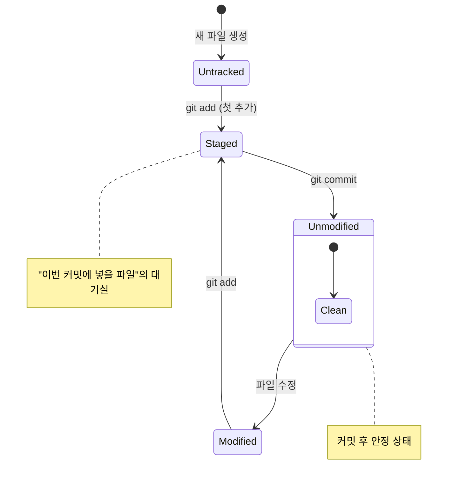
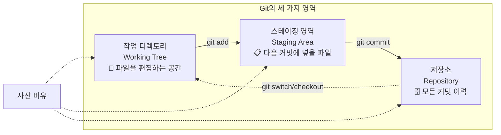

# Git 워크플로우 이해

Git을 효과적으로 사용하기 위해서는 파일이 어떤 상태를 거치며 변화하는지 이해하는 것이 매우 중요합니다. 우리가 프로젝트에서 파일을 수정하고 저장할 때마다 Git은 그 파일의 상태를 추적하며 변화를 감지합니다. 이 장에서는 Git을 사용할 때 파일가 거치는 네 가지 상태와 이를 관리하는 세 가지 영역에 대해 자세히 알아보겠습니다.

> **⚠️ 경고:** AI가 생성한 문서입니다. 내용에 부정확한 정보가 포함될 수 있으므로, 학습 시 공식 문서를 함께 참고하세요.

## 학습 목표

- Git에서 파일의 네 가지 상태(Untracked, Unmodified, Modified, Staged)를 설명할 수 있습니다
- Git의 세 가지 영역(작업 디렉토리, 스테이징 영역, 저장소)의 역할을 이해합니다
- 기본적인 Git 작업 흐름(add → commit)을 수행할 수 있습니다
- `git status` 명령어로 파일의 상태 변화를 확인할 수 있습니다

## 1. 파일의 네 가지 상태

Git은 파일의 상태를 다음과 같이 구분합니다. 각 상태를 정확히 이해하는 것이 Git 워크플로우를 익히는 첫걸음입니다.




1.  **Untracked (추적되지 않음):** Git이 아직 관리하지 않는 새로운 파일입니다. 한 번도 스테이징(stage)되지 않은 파일로서, Git은 이 파일의 변경 사항을 추적하지 않습니다.
2.  **Unmodified (수정되지 않음):** 현재 Git이 관리하고 있는 파일 중에서 아직 수정되지 않은 상태입니다. 가장 최근 커밋 이후로 변경 사항이 없는 파일을 의미합니다.
3.  **Modified (수정됨):** 한 번 이상 Git이 관리(추적)하고 있는 파일을 수정한 상태입니다. 아직 스테이징 영역(staging area)에 추가되지 않은 변경 사항입니다.
4.  **Staged (스테이징됨):** 수정된 파일을 다음 커밋에 포함시킬 준비가 된 상태입니다. 스테이징 영역에 파일이 추가된 상태로서, "이번 커밋에 넣을 파일"들이 대기하고 있는 상태입니다.

## 2. Git의 세 가지 영역

파일의 상태를 이해하였다면, 이번에는 Git이 이러한 상태를 관리하기 위해 사용하는 세 가지 주요 영역에 대해 알아보겠습니다.



사진 찍는 것에 비유하면 이해하기 쉽습니다:
- **작업 디렉토리:** 사진을 찍기 전, 피사체와 구도를 준비하는 단계입니다.
- **스테이징 영역:** 셔터를 누르기 직전, 프레임을 확정하는 단계입니다.
- **저장소:** 실제로 사진을 찍어서 앨범에 보관하는 단계입니다.

## 3. 기본 작업 흐름 (Workflow)

지금까지 Git의 파일 상태와 세 가지 영역에 대해 배웠습니다. 이제 이 개념들이 실제 작업에서 어떻게 연결되는지 기본적인 Git 작업 흐름을 통해 알아보겠습니다.


1.  **작업 디렉토리에서 파일 수정:** 새로운 기능을 추가하거나 버그를 수정합니다.
2.  **스테이징 영역에 추가 (`git add`):** 커밋하고 싶은 변경 사항만 골라서 스테이징 영역에 추가합니다.
3.  **커밋 (`git commit`):** 스테이징 영역에 있는 변경 사항들을 하나의 스냅샷으로 만들어 저장소에 기록합니다.

이 흐름을 반복하면서 프로젝트의 버전을 체계적으로 관리할 수 있습니다.

## 4. 실습: 전체 워크플로우 체험하기

이제 배운 내용을 바탕으로 터미널에서 직접 실습해보겠습니다. 어떤 상태 변화가 일어나는지 주목하면서 따라 해 보시기 바랍니다.

```bash
# 1. 새로운 Git 저장소 생성
$ mkdir workflow-demo && cd workflow-demo && git init

# 2. 새 파일 생성 (Untracked 상태)
$ echo "<h1>Hello World</h1>" > index.html
$ git status
On branch main
Untracked files:
    index.html   # <-- 빨간색: 추적되지 않음

# 3. 파일 스테이징 (Staged 상태로 변경)
$ git add index.html
$ git status
On branch main
Changes to be committed:
    new file:   index.html   # <-- 초록색: 스테이징됨

# 4. 파일 수정 (Modified + Staged 상태 동시 발생)
$ echo "<p>Welcome</p>" >> index.html
$ git status
On branch main
Changes to be committed:
    new file:   index.html       # 스테이징된 버전 (첫 번째 내용)
Changes not staged for commit:
    modified:   index.html       # 수정된 버전 (추가된 내용)

# 5. 다시 스테이징 (최신 상태로 업데이트)
$ git add index.html
$ git status
On branch main
Changes to be committed:
    new file:   index.html       # 최신 내용으로 스테이징됨

# 6. 커밋 (Repository에 저장)
$ git commit -m "첫 번째 페이지 추가"
[main (root-commit) a1b2c3d] 첫 번째 페이지 추가
 1 file changed, 2 insertions(+)

# 7. 커밋 후 상태 (Unmodified)
$ git status
On branch main
nothing to commit, working tree clean   # 모든 파일이 Unmodified

# 8. 다시 수정 → 스테이징 → 커밋 반복
$ echo "<footer>Copyright 2026</footer>" >> index.html
$ git add . && git commit -m "푸터 추가"
[main d4e5f6f] 푸터 추가
 1 file changed, 1 insertion(+)
```

## 한눈에 정리

| 상태 | 설명 | 다음 명령어 |
|------|------|-----------|
| Untracked | Git이 추적하지 않는 새로운 파일 | `git add` → Staged |
| Unmodified | 최근 커밋 이후 변경 없는 파일 | 파일 수정 → Modified |
| Modified | 수정되었으나 아직 스테이징되지 않은 파일 | `git add` → Staged |
| Staged | 다음 커밋에 포함될 준비가 된 파일 | `git commit` → Unmodified |

## 연습 문제

1. Git의 파일 상태 중 "Modified"와 "Staged"의 차이점을 설명하시오.
2. 작업 디렉토리, 스테이징 영역, 저장소의 세 가지 영역을 사진 촬영에 비유할 때 각각 어떤 단계에 해당하는지 서술하시오.
3. `git add` 명령어를 실행한 후 파일을 다시 수정하면 어떤 상태가 발생하는지 설명하시오.
