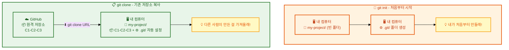
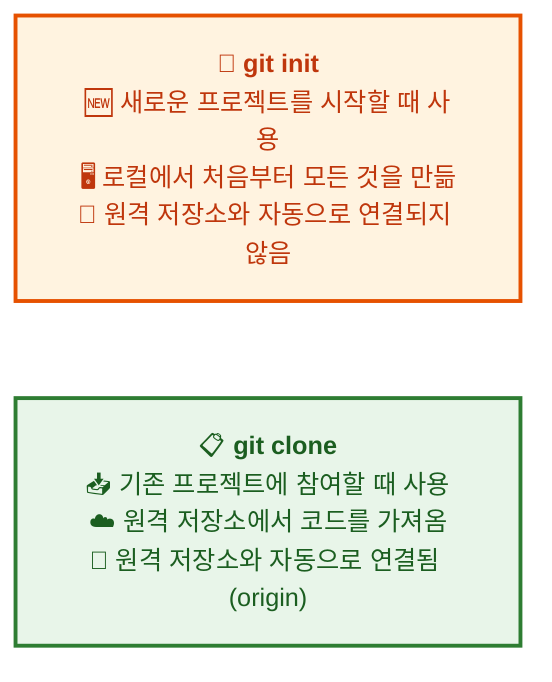

# Git 시작하기: 초기화 및 클론

## 👨‍💻 실전 프로젝트: 첫 프로젝트 Git으로 관리하기

이번 실전 프로젝트에서는 지금부터 배울 `git init`과 `git add`, `git commit`을 미리 체험해보겠습니다. 여러분은 자신의 컴퓨터에 새로운 프로젝트 디렉토리를 만들고, 그곳을 Git 저장소로 초기화한 후 첫 번째 파일을 추가하고 커밋까지 진행하게 됩니다. 이 과정은 실제 개발 현장에서 새로운 프로젝트를 시작할 때 가장 먼저 수행하는 작업이므로 반드시 숙지해야 합니다. 터미널을 열고 다음 명령어를 한 줄씩 따라 입력하면서 각 단계에서 어떤 일이 발생하는지 주의 깊게 관찰하시기 바랍니다.

```bash
# 1단계: 프로젝트 폴더를 생성하고 Git 저장소로 초기화합니다.
$ mkdir my-first-project
$ cd my-first-project
$ git init
Initialized empty Git repository in /Users/me/my-first-project/.git/

# 2단계: 첫 번째 파일을 만들고 Git의 추적 대상으로 등록합니다.
$ echo "# My First Project" > README.md
$ git add README.md

# 3단계: 첫 번째 커밋을 생성하여 프로젝트의 첫 스냅샷을 기록합니다.
$ git commit -m "프로젝트 초기화: README 파일 추가"
[main (root-commit) a1b2c3d] 프로젝트 초기화: README 파일 추가
 1 file changed, 1 insertion(+)

# 4단계: 커밋이 정상적으로 생성되었는지 확인합니다.
$ git log --oneline
a1b2c3d (HEAD -> main) 프로젝트 초기화: README 파일 추가
```

축하합니다. 여러분은 방금 첫 번째 Git 저장소를 생성하고 첫 번째 커밋을 성공적으로 만들었습니다. 이제 본격적으로 Git 저장소를 시작하는 두 가지 방법에 대해 자세히 알아보겠습니다.

---

버전 관리를 시작하려면 먼저 Git 저장소를 만들어야 합니다. Git 저장소는 프로젝트의 모든 파일과 변경 이력을 담는 컨테이너 역할을 수행하며, Git을 사용하는 모든 작업의 출발점이 됩니다. 저장소가 없으면 버전 관리 자체가 불가능하기 때문에, 이 과정은 Git을 처음 배우는 모든 개발자가 반드시 이해해야 하는 핵심 내용입니다. 이 장에서는 Git 저장소를 시작하는 두 가지 방법, 즉 처음부터 새로 시작하는 **초기화(init)** 와 기존 저장소를 복사해 오는 **클론(clone)** 에 대해 배웁니다. 두 방법은 각각 다른 상황에서 사용되며, 각각의 장단점과 적절한 활용 시점이 다릅니다.

## 학습 목표

- Git 저장소를 새로 생성하는 `git init` 명령어의 사용법을 이해합니다
- 원격 저장소를 로컬로 복사하는 `git clone` 명령어의 사용법을 이해합니다
- `git init`과 `git clone`의 차이점과 각각의 적절한 사용 상황을 구분할 수 있습니다
- `.git` 디렉토리의 구조와 역할을 설명할 수 있습니다

위 목표를 달성하면 Git 저장소를 자유자재로 생성하고 관리할 수 있는 기초 체력을 갖추게 됩니다. 이는 이후에 배울 모든 Git 명령어를 이해하는 토대가 되므로, 각 개념을 충분히 숙지한 후 다음 장으로 넘어가시기 바랍니다.

**Init vs Clone 개념도:**



위 다이어그램에서 볼 수 있듯이, `git init`은 빈 폴더에서 출발하여 `.git` 디렉토리를 생성하는 반면, `git clone`은 원격 저장소의 모든 데이터를 로컬로 가져와서 자동으로 `.git` 디렉토리까지 설정해줍니다. 이제 각 방법을 하나씩 자세히 살펴보겠습니다.

## 1. `git init` — 새로운 Git 저장소 만들기

로컬 컴퓨터에서 새로운 프로젝트를 시작할 때는 `git init` 명령어를 사용합니다. 이 명령어는 프로젝트 디렉토리를 Git 저장소로 초기화하여 버전 관리가 가능한 상태로 만들어줍니다. 예를 들어, 새로운 웹 애플리케이션을 처음부터 개발하거나, 기존에 버전 관리 없이 작업하던 폴더를 Git으로 관리하기 시작할 때 유용하게 사용됩니다. `git init`은 한 번만 실행하면 되며, 이후 해당 디렉토리에서 작업하는 모든 파일은 Git의 관리 대상이 될 수 있습니다.

**사용 방법:**

```bash
# 새 프로젝트 디렉토리를 만들고 이동합니다.
mkdir my-first-project
cd my-first-project

# 현재 디렉토리를 Git 저장소로 초기화합니다.
git init
```

`git init` 명령어를 실행하면 해당 디렉토리에 `.git`이라는 숨김 폴더가 생성됩니다. 이 폴더에는 버전 관리에 필요한 모든 메타데이터와 데이터가 저장되며, Git이 저장소의 상태를 추적하고 관리하는 데 사용하는 핵심 정보들이 담겨 있습니다. `.git` 디렉토리가 존재하기 때문에 우리는 이후 모든 Git 명령어(예: `git add`, `git commit`, `git log` 등)를 사용할 수 있게 됩니다. 만약 `.git` 폴더가 손상되거나 삭제되면, 해당 프로젝트의 모든 버전 이력이 사라지므로 주의해야 합니다.

**출력 예시:**
```
Initialized empty Git repository in /Users/username/my-first-project/.git/
```

**`.git` 디렉토리 구조:**
```bash
$ ls -la my-first-project/.git/
drwxr-xr-x    HEAD                    # 현재 HEAD가 가리키는 브랜치
drwxr-xr-x    config                  # 저장소 설정 파일
drwxr-xr-x    description             # 저장소 설명
drwxr-xr-x    hooks/                  # Git 훅 스크립트
drwxr-xr-x    info/                   # 추가 정보
drwxr-xr-x    objects/                # 모든 데이터 (커밋, 파일 등)
drwxr-xr-x    refs/                   # 브랜치, 태그 참조

$ cat my-first-project/.git/HEAD
ref: refs/heads/main
```

`.git` 디렉토리의 각 구성 요소는 저마다 중요한 역할을 담당합니다. `HEAD` 파일은 현재 작업 중인 브랜치가 무엇인지를 가리키며, `config` 파일은 저장소별 설정(사용자 이름, 원격 저장소 주소 등)을 저장합니다. `objects` 디렉토리는 모든 커밋, 트리, 블롭 객체를 저장하는 가장 중요한 영역이며, `refs` 디렉토리는 브랜치와 태그의 참조 정보를 보관합니다.

**`git init`의 다양한 옵션:**

```bash
# 기본 브랜치 이름을 main으로 초기화 (기본값과 동일)
git init --initial-branch=main

# 빈 디렉토리만 생성 (작업 트리 없음, 서버용)
git init --bare

# 기존 디렉토리를 Git 저장소로 만들기
$ cd /home/user/existing-project
$ git init
$ git add .
$ git commit -m "기존 프로젝트 Git 초기화"
```

`--bare` 옵션은 작업 트리(working tree) 없이 순수한 Git 데이터만을 저장하는 저장소를 생성합니다. 이는 주로 중앙 서버 저장소를 구축할 때 사용되며, 원격 저장소의 역할만 수행합니다. `--initial-branch` 옵션은 기본 브랜치의 이름을 지정할 때 사용하며, 팀의 브랜치 명명 규칙에 따라 `main` 대신 `master`나 `develop` 등을 지정할 수 있습니다. 기존 프로젝트에 Git을 도입할 때는 `git init` 후 `git add .`와 `git commit`을 연속해서 실행하여 현재 상태를 첫 커밋으로 기록합니다.

지금까지 `git init`을 사용하여 로컬에서 새로운 저장소를 만드는 방법에 대해 배웠습니다. `git init`은 로컬에서 새로운 프로젝트를 시작하거나 기존 프로젝트에 Git을 도입할 때 사용하는 명령어임을 기억해야 합니다. 다음으로는 원격에 존재하는 저장소를 내 컴퓨터로 가져오는 `git clone`에 대해 알아보겠습니다.

## 2. `git clone` — 기존 저장소 복사하기

GitHub, GitLab, Bitbucket 등 원격 저장소에 있는 프로젝트를 내 컴퓨터로 복사할 때는 `git clone` 명령어를 사용합니다. 이 명령어는 원격 저장소의 전체 이력(모든 커밋, 브랜치, 태그)과 모든 파일을 로컬로 가져오기 때문에, 우리는 즉시 그 프로젝트의 모든 버전을 열람하고 작업할 수 있습니다. 예를 들어, 오픈 소스 프로젝트에 기여하거나 팀 동료가 이미 작업 중인 저장소를 내려받을 때 유용하게 사용됩니다. `git clone`은 단순한 파일 다운로드가 아니라, 원격 저장소와 연결된 완전한 Git 저장소를 로컬에 생성하는 작업입니다.

**사용 방법:**

```bash
git clone <저장소_주소>
```

**출력 예시:**
```bash
$ git clone https://github.com/username/example-repo.git
```

```
Cloning into 'example-repo'...
remote: Enumerating objects: 45, done.
remote: Counting objects: 100% (45/45), done.
remote: Total 45 (delta 0), reused 0 (delta 0), pack-reused 0
Receiving objects: 100% (45/45), 12.34 KiB | 2.47 MiB/s, done.
Resolving deltas: 100% (5/5), done.
```

클론 과정에서 출력되는 메시지는 Git이 원격 저장소의 데이터를 압축하여 전송하고 있음을 보여줍니다. `Enumerating objects`는 저장소에 포함된 객체의 개수를 파악하는 단계이며, `Receiving objects`는 실제 데이터를 다운로드하는 단계입니다. `Resolving deltas`는 다운로드한 데이터를 기반으로 파일 간의 차이점을 재구성하는 과정입니다. 이 모든 과정이 완료되면 로컬에 원격 저장소와 동일한 내용의 Git 저장소가 생성됩니다.

**`git clone`의 다양한 활용:**

```bash
# 1. 디렉토리 이름을 지정해서 클론
$ git clone https://github.com/username/example-repo.git my-folder
Cloning into 'my-folder'...

# 2. 특정 브랜치만 클론 (깊이 제한, 빠른 다운로드)
$ git clone --branch develop https://github.com/username/example-repo.git

# 3. 최근 1개의 커밋만 가져오기 (shallow clone, 대규모 프로젝트에 유용)
$ git clone --depth 1 https://github.com/username/large-project.git

# 4. SSH로 클론 (비밀번호 없이 push 가능)
$ git clone git@github.com:username/example-repo.git

# 5. 특정 태그 버전 클론
$ git clone --branch v2.0.0 https://github.com/username/example-repo.git
```

`git clone`은 다양한 옵션을 제공하여 상황에 맞게 유연하게 사용할 수 있습니다. 디렉토리 이름을 지정하면 저장소의 내용이 해당 이름의 폴더에 저장되며, 생략하면 원격 저장소 이름 그대로 폴더가 생성됩니다. `--depth 1` 옵션은 얕은 클론(shallow clone)이라고 불리며, 최근 1개의 커밋만 가져오기 때문에 대규모 프로젝트를 빠르게 내려받을 때 유용합니다. SSH 방식으로 클론하면 매번 비밀번호를 입력하지 않고도 안전하게 푸시(push)할 수 있어, 팀 프로젝트에서 널리 사용됩니다.

**클론 후 확인:**
```bash
$ cd example-repo
$ git remote -v
origin  https://github.com/username/example-repo.git (fetch)
origin  https://github.com/username/example-repo.git (push)

$ git branch -a
* main
  remotes/origin/main
  remotes/origin/develop

$ git log --oneline -3
a1b2c3d README 업데이트
d4e5f6f 첫 번째 릴리스 준비
g7h8i9j 프로젝트 초기화
```

클론이 완료된 후에는 `git remote -v` 명령어로 원격 저장소가 `origin`이라는 이름으로 자동 등록되었는지 확인할 수 있습니다. 이를 통해 우리는 `git push origin main`이나 `git pull origin main`과 같은 명령어로 원격 저장소와 자유롭게 동기화할 수 있습니다. 또한 `git branch -a`로 모든 브랜치(로컬 및 원격)의 목록을 확인할 수 있으며, `git log`로 프로젝트의 전체 커밋 이력을 즉시 열람할 수 있습니다.

## 3. 두 방법의 차이점

지금까지 `git init`과 `git clone`이라는 두 가지 저장소 생성 방법을 배웠습니다. 이 두 방법은 모두 Git 저장소를 생성한다는 공통점이 있지만, 사용하는 상황과 결과물의 차이가 분명합니다. `git init`은 아무 것도 없는 상태에서 처음부터 저장소를 만드는 반면, `git clone`은 이미 존재하는 원격 저장소의 복사본을 로컬에 만듭니다. 아래 다이어그램에서 이 차이를 한눈에 비교해보겠습니다.



`git init`으로 생성한 저장소에는 원격 저장소가 자동으로 연결되지 않습니다. 따라서 나중에 원격 저장소와 연동하려면 `git remote add <이름> <주소>` 명령어를 별도로 실행해야 합니다. 예를 들어, `git remote add origin https://github.com/me/my-project.git`과 같이 입력하여 원격 저장소를 등록할 수 있습니다. 반면 `git clone`으로 생성한 저장소는 이미 원격 저장소가 `origin`이라는 이름으로 자동 등록되어 있어, 추가 설정 없이 바로 원격 저장소와의 동기화가 가능합니다.

## 4. 실습: 처음부터 끝까지 따라하기

이제 배운 내용을 실제로 실습해보겠습니다. 다음 명령어를 터미널에서 직접 따라 입력하면서 각 단계에서 어떤 일이 일어나는지 확인하시기 바랍니다. 단순히 명령어를 입력하는 것에 그치지 않고, 각 명령어의 출력 메시지를 주의 깊게 읽으면서 진행하는 것이 중요합니다. 실습을 통해 `git init`과 `git clone`의 차이를 몸으로 체험할 수 있을 것입니다.

```bash
# 1. 프로젝트 폴더 생성 및 초기화
$ mkdir my-awesome-app
$ cd my-awesome-app
$ git init
Initialized empty Git repository in /Users/me/my-awesome-app/.git/

# 2. 첫 파일 만들기
$ echo "# My Awesome App" > README.md
$ git status
On branch main
Untracked files:
    README.md

# 3. 첫 커밋
$ git add README.md
$ git commit -m "프로젝트 초기화: README 추가"
[main (root-commit) a1b2c3d] 프로젝트 초기화: README 추가
 1 file changed, 1 insertion(+)

# 4. GitHub에서 새 저장소를 만들고 연결
$ git remote add origin https://github.com/me/my-awesome-app.git

# 5. 원격에 푸시
$ git push -u origin main
```

위 실습에서 4번 단계는 `git init`으로 생성한 저장소에 원격 저장소를 연결하는 과정을 보여줍니다. `git remote add origin <URL>` 명령어를 통해 로컬 저장소와 GitHub 저장소를 연결하고, `git push -u origin main`으로 로컬 커밋을 원격에 업로드합니다. `-u` 옵션은 이후 `git push`만 입력해도 자동으로 `origin main`으로 푸시되도록 설정하는 단축 옵션입니다. 이렇게 하면 `git init`으로 시작한 저장소도 `git clone`처럼 원격 저장소와 완전히 연동된 상태가 됩니다.

## 한눈에 정리

| 명령어 | 사용 상황 | 원격 저장소 연결 | 저장소 이력 |
|--------|----------|-----------------|------------|
| `git init` | 새로운 프로젝트를 로컬에서 시작할 때 | 자동 연결되지 않음 (`git remote add` 필요) | 없음 (빈 저장소) |
| `git clone` | 기존 원격 저장소를 복사할 때 | 자동으로 `origin`으로 연결됨 | 원격 저장소의 전체 이력을 그대로 가져옴 |

위 표는 `git init`과 `git clone`의 가장 핵심적인 차이점을 요약합니다. 이 표를 참고하여 자신의 상황에 맞는 올바른 명령어를 선택할 수 있어야 합니다. 새로운 프로젝트를 시작한다면 `git init`을, 기존 프로젝트에 참여한다면 `git clone`을 사용하면 됩니다.

## 연습 문제

1. `git init`과 `git clone`의 가장 큰 차이점은 무엇인지 서술하시오.
2. `git init` 명령어를 실행한 후 생성되는 `.git` 디렉토리의 역할은 무엇인지 설명하시오.
3. `git clone --depth 1` 옵션은 어떤 상황에서 유용하게 사용할 수 있는지 그 이유와 함께 서술하시오.

---

📌 정답 및 해설

**문제 1 정답 및 해설:**

`git init`과 `git clone`의 가장 큰 차이점은 새로운 저장소를 생성하느냐, 기존 저장소를 복사하느냐에 있습니다. `git init`은 로컬에서 완전히 새로운 Git 저장소를 생성할 때 사용하는 명령어로, 빈 프로젝트를 시작할 때 적합합니다. 반면 `git clone`은 이미 존재하는 원격 저장소를 로컬로 복사할 때 사용하며, 원격 저장소의 모든 커밋 이력과 파일을 함께 가져옵니다. 즉, `git init`은 "처음부터 시작"하는 것이고, `git clone`은 "기존 프로젝트에 참여"하는 것입니다. 새로운 프로젝트를 시작할 때는 `git init`을, GitHub의 기존 프로젝트에 기여할 때는 `git clone`을 사용합니다.

**문제 2 정답 및 해설:**

`.git` 디렉토리는 Git 저장소의 모든 메타데이터와 객체 데이터가 저장되는 핵심 폴더입니다. 이 디렉토리에는 커밋 히스토리, 브랜치 정보, 태그, 설정 파일, 그리고 모든 파일의 스냅샷이 압축된 형태로 보관됩니다. `git init` 명령어를 실행하면 프로젝트 루트에 이 숨김 폴더가 생성되며, 이 폴더가 있어야 Git이 해당 프로젝트를 관리할 수 있습니다. `.git` 디렉토리가 손상되거나 삭제되면 모든 커밋 이력이 사라지므로, 이 폴더는 절대로 수동으로 수정하거나 삭제해서는 안 됩니다. 특이한 점은 `.git` 디렉토리 자체는 버전 관리 대상이 아니라는 것으로, Git은 자신의 메타데이터를 스스로 관리합니다.

**문제 3 정답 및 해설:**

`git clone --depth 1`은 얕은 복제(Shallow Clone)라고 불리며, 최신 커밋 하나만 가져오는 옵션입니다. 이 옵션은 저장소의 전체 히스토리가 필요하지 않고 최신 버전의 코드만 필요한 상황에서 매우 유용합니다. 예를 들어 CI/CD 파이프라인에서 빌드나 테스트를 위해 코드를 내려받을 때는 전체 히스토리가 필요 없으므로, 이 옵션을 사용하면 다운로드 시간과 디스크 공간을 획기적으로 절약할 수 있습니다. 또한 대규모 오픈소스 프로젝트(예: Linux 커널)의 경우 수만 개의 커밋이 있으므로, `--depth 1` 없이 클론하면 시간이 오래 걸리고 디스크 공간도 많이 차지합니다. 단, 얕은 복제에서는 전체 히스토리가 없으므로 `git log`로 과거 커밋을 볼 수 없고, `git blame` 같은 명령어도 제한적으로 동작합니다.
