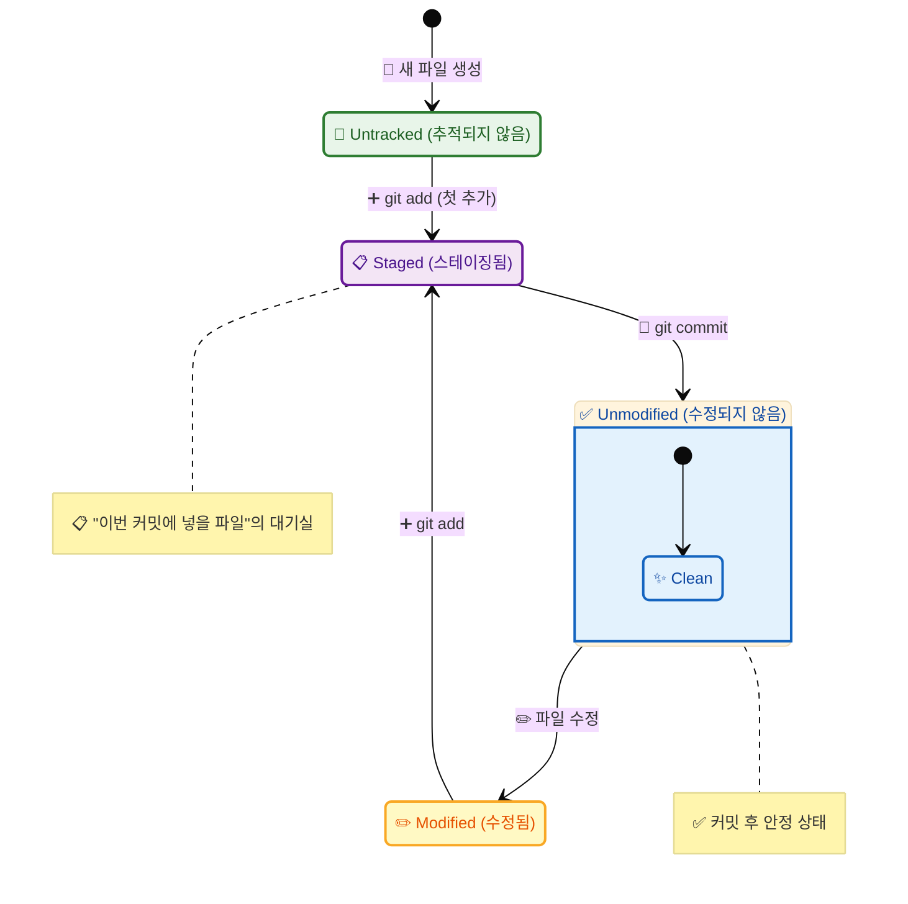
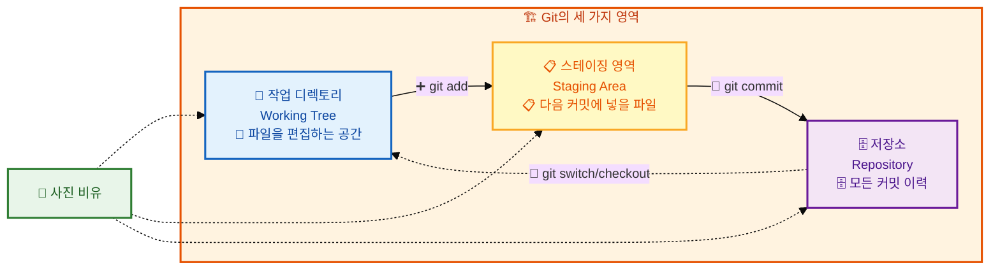
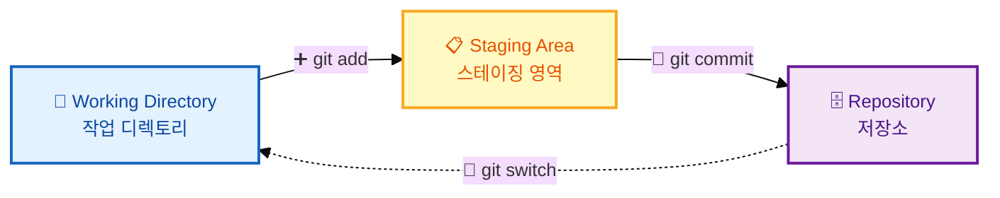

# Git 워크플로우 이해

## 👨‍💻 실전 프로젝트: Git 워크플로우 직접 체험하기

이번 실전 프로젝트에서는 Git의 핵심 워크플로우인 "수정 → 스테이징 → 커밋" 사이클을 직접 경험해보겠습니다. 여러분은 간단한 HTML 파일을 생성하고, 내용을 수정한 후, 그 변경 사항을 스테이징 영역에 추가하고 최종적으로 커밋하는 과정을 반복하게 됩니다. 이 작업은 실제 개발 현장에서 하루에도 수십 번씩 수행되는 가장 기본적인 Git 작업 흐름입니다. 터미널을 열고 아래 명령어를 순서대로 따라 입력하면서 파일의 상태가 어떻게 변화하는지 주의 깊게 관찰하시기 바랍니다.

```bash
# 1단계: 실습용 저장소를 생성하고 초기화합니다.
$ mkdir workflow-practice && cd workflow-practice && git init
Initialized empty Git repository in /Users/me/workflow-practice/.git/

# 2단계: 첫 번째 파일을 생성합니다. 이 파일은 아직 Git이 추적하지 않는 Untracked 상태입니다.
$ echo "<h1>Hello, Git!</h1>" > index.html
$ git status
On branch main
Untracked files:
    index.html

# 3단계: 파일을 스테이징 영역에 추가합니다. 이제 파일이 Staged 상태가 됩니다.
$ git add index.html
$ git status
On branch main
Changes to be committed:
    new file:   index.html

# 4단계: 스테이징된 변경 사항을 커밋하여 저장소에 기록합니다.
$ git commit -m "초기 HTML 파일 추가"
[main (root-commit) a1b2c3d] 초기 HTML 파일 추가
 1 file changed, 1 insertion(+)

# 5단계: 파일을 수정하고 다시 스테이징 및 커밋하는 두 번째 사이클을 실행합니다.
$ echo "<p>Welcome to Git workflow</p>" >> index.html
$ git add index.html
$ git commit -m "환영 문구 추가"
[main d4e5f6f] 환영 문구 추가
 1 file changed, 1 insertion(+)

# 6단계: 최종 상태를 확인합니다. 모든 파일이 깨끗한 상태(Unmodified)임을 확인할 수 있습니다.
$ git status
On branch main
nothing to commit, working tree clean
```

여러분은 방금 Git의 기본 워크플로우를 성공적으로 체험했습니다. 파일을 수정하고(Modified), 스테이징 영역에 추가하고(Staged), 커밋하여 저장소에 기록(Unmodified)하는 이 사이클이 Git 버전 관리의 전부라고 해도 과언이 아닙니다. 이제 본격적으로 각 상태와 영역의 개념을 자세히 학습해보겠습니다.

---

Git을 효과적으로 사용하기 위해서는 파일이 어떤 상태를 거치며 변화하는지 이해하는 것이 매우 중요합니다. Git은 파일의 변경 사항을 단순히 저장하는 것을 넘어, 파일의 생애주기를 네 가지 상태로 구분하여 체계적으로 관리합니다. 우리가 프로젝트에서 파일을 수정하고 저장할 때마다 Git은 그 파일의 상태를 실시간으로 추적하며 변화를 감지합니다. 파일의 상태를 정확히 이해하면 "지금 이 파일은 어떤 단계에 있는지", "다음에 어떤 명령어를 실행해야 하는지"를 명확히 알 수 있습니다. 이 장에서는 Git을 사용할 때 파일이 거치는 네 가지 상태와 이를 관리하는 세 가지 영역에 대해 자세히 알아보겠습니다.

## 학습 목표

- Git에서 파일의 네 가지 상태(Untracked, Unmodified, Modified, Staged)를 설명할 수 있습니다
- Git의 세 가지 영역(작업 디렉토리, 스테이징 영역, 저장소)의 역할을 이해합니다
- 기본적인 Git 작업 흐름(add → commit)을 수행할 수 있습니다
- `git status` 명령어로 파일의 상태 변화를 확인할 수 있습니다

이 목표들을 달성하면 Git이 파일을 어떻게 추적하고 관리하는지에 대한 깊이 있는 이해를 얻게 됩니다. 이는 이후에 배울 브랜치, 병합, 리베이스 등 고급 주제를 학습하기 위한 필수 선행 지식입니다.

## 1. 파일의 네 가지 상태

Git은 파일의 상태를 다음과 같이 네 가지로 구분합니다. 각 상태를 정확히 이해하는 것이 Git 워크플로우를 익히는 첫걸음이며, 이를 통해 "지금 내 파일이 어떤 단계에 있는지"를 항상 파악할 수 있습니다. Git을 처음 사용할 때 가장 혼란스러운 부분 중 하나가 바로 이 상태 개념이므로, 각 상태의 의미와 전환 조건을 반드시 숙지해야 합니다.




1. **Untracked (추적되지 않음):** Git이 아직 관리하지 않는 새로운 파일입니다. 한 번도 스테이징(stage)되지 않은 파일로서, Git은 이 파일의 변경 사항을 전혀 추적하지 않습니다. 예를 들어, 프로젝트에 새로운 `README.md` 파일을 생성하면 처음에는 Untracked 상태가 되며, `git status` 명령어를 실행했을 때 빨간색으로 표시됩니다. 이 상태의 파일을 Git이 추적하도록 하려면 `git add` 명령어를 실행하여 스테이징 영역에 추가해야 합니다.

2. **Unmodified (수정되지 않음):** 현재 Git이 관리하고 있는 파일 중에서 아직 수정되지 않은 상태입니다. 가장 최근 커밋 이후로 변경 사항이 없는 파일을 의미하며, `git status` 실행 시 아무런 메시지도 출력되지 않습니다. 이 상태는 "작업 트리가 깨끗하다(clean)"라고 표현하며, 모든 파일이 최신 커밋과 동일한 내용을 가지고 있음을 나타냅니다. 파일을 수정하면 이 상태에서 Modified 상태로 전환됩니다.

3. **Modified (수정됨):** 한 번 이상 Git이 관리(추적)하고 있는 파일을 수정한 상태입니다. 아직 스테이징 영역(staging area)에 추가되지 않은 변경 사항으로, `git status`에서 빨간색으로 표시됩니다. 이 상태에서는 파일의 내용이 변경되었지만, 아직 커밋할 준비가 되지 않은 상태입니다. `git diff` 명령어를 사용하면 구체적으로 어떤 내용이 변경되었는지 확인할 수 있습니다.

4. **Staged (스테이징됨):** 수정된 파일을 다음 커밋에 포함시킬 준비가 된 상태입니다. 스테이징 영역에 파일이 추가된 상태로서, "이번 커밋에 넣을 파일"들이 대기하고 있는 상태입니다. `git status`에서 초록색으로 표시되며, 이 상태의 파일들만이 `git commit` 명령어로 저장소에 기록됩니다. 만약 Staged 상태인 파일을 다시 수정하면, 파일은 동시에 Staged와 Modified 두 상태를 가지게 됩니다.

## 2. Git의 세 가지 영역

파일의 상태를 이해하였다면, 이번에는 Git이 이러한 상태를 관리하기 위해 사용하는 세 가지 주요 영역에 대해 알아보겠습니다. 이 세 영역은 앞서 배운 네 가지 상태를 물리적으로 관리하는 공간이라고 생각하면 됩니다. 각 영역은 서로 다른 목적과 기능을 가지고 있으며, 파일은 이 영역 사이를 이동하면서 상태가 변화합니다.



사진 찍는 것에 비유하면 각 영역의 역할을 더욱 직관적으로 이해할 수 있습니다:

- **작업 디렉토리:** 사진을 찍기 전, 피사체와 구도를 준비하는 단계입니다. 이 단계에서는 자유롭게 파일을 생성하고 수정하며 실험할 수 있습니다. 아직 Git에 기록된 것은 아니므로, 원하는 대로 변경하고 언제든지 되돌릴 수 있습니다.
- **스테이징 영역:** 셔터를 누르기 직전, 프레임을 확정하는 단계입니다. "이번 사진(커밋)에 무엇을 담을지"를 선택하는 과정으로, 전체 변경 사항 중에서 일부만 골라서 커밋할 수 있습니다. 이를 통해 논리적으로 관련된 변경 사항만 모아서 커밋할 수 있습니다.
- **저장소:** 실제로 사진을 찍어서 앨범에 보관하는 단계입니다. 한 번 커밋된 내용은 언제든지 다시 열람할 수 있으며, 과거의 특정 시점으로 되돌아갈 수도 있습니다.

이 비유를 기억하면 Git의 세 가지 영역 개념이 훨씬 친숙하게 느껴질 것입니다.

## 3. 기본 작업 흐름 (Workflow)

지금까지 Git의 파일 상태와 세 가지 영역에 대해 배웠습니다. 이제 이 개념들이 실제 작업에서 어떻게 연결되는지 기본적인 Git 작업 흐름을 통해 알아보겠습니다. Git을 사용하는 기본 작업 흐름은 세 단계로 구성되며, 이 세 단계는 개발자가 코드를 작성하고 버전을 기록하는 동안 끊임없이 반복됩니다.



1. **작업 디렉토리에서 파일 수정:** 새로운 기능을 추가하거나 기존의 버그를 수정하는 등 실제 코딩 작업을 수행합니다. 이 단계에서는 자유롭게 파일을 생성, 수정, 삭제할 수 있으며, Git은 아직 이러한 변경 사항을 기록하지 않습니다.
2. **스테이징 영역에 추가 (`git add`):** 커밋하고 싶은 변경 사항만 골라서 스테이징 영역에 추가합니다. 예를 들어, 세 개의 파일을 수정했지만 그중 두 개의 변경 사항만 커밋하고 싶다면, 해당 두 파일만 `git add` 명령어로 스테이징하면 됩니다.
3. **커밋 (`git commit`):** 스테이징 영역에 있는 변경 사항들을 하나의 스냅샷으로 만들어 저장소에 기록합니다. 각 커밋에는 변경된 파일의 내용, 커밋 메시지, 작성자 정보, 타임스탬프 등이 함께 저장되어, 나중에 언제든지 이 시점으로 되돌아갈 수 있습니다.

이 흐름을 반복하면서 프로젝트의 버전을 체계적으로 관리할 수 있습니다. 하루에 수십 번의 커밋을 수행하는 개발자도 이 세 단계를 반복할 뿐이며, 이것이 Git 버전 관리의 전부라고 할 수 있습니다.

## 4. 실습: 전체 워크플로우 체험하기

이제 배운 내용을 바탕으로 터미널에서 직접 실습해보겠습니다. 어떤 상태 변화가 일어나는지 주목하면서 따라 해 보시기 바랍니다. 특히 `git status` 명령어의 출력 메시지가 각 단계마다 어떻게 달라지는지에 집중하면, 파일 상태의 변화를 실시간으로 확인할 수 있습니다.

```bash
# 1. 새로운 Git 저장소 생성
$ mkdir workflow-demo && cd workflow-demo && git init

# 2. 새 파일 생성 (Untracked 상태)
$ echo "<h1>Hello World</h1>" > index.html
$ git status
On branch main
Untracked files:
    index.html   # <-- 빨간색: 추적되지 않음

# 3. 파일 스테이징 (Staged 상태로 변경)
$ git add index.html
$ git status
On branch main
Changes to be committed:
    new file:   index.html   # <-- 초록색: 스테이징됨

# 4. 파일 수정 (Modified + Staged 상태 동시 발생)
$ echo "<p>Welcome</p>" >> index.html
$ git status
On branch main
Changes to be committed:
    new file:   index.html       # 스테이징된 버전 (첫 번째 내용)
Changes not staged for commit:
    modified:   index.html       # 수정된 버전 (추가된 내용)

# 5. 다시 스테이징 (최신 상태로 업데이트)
$ git add index.html
$ git status
On branch main
Changes to be committed:
    new file:   index.html       # 최신 내용으로 스테이징됨

# 6. 커밋 (Repository에 저장)
$ git commit -m "첫 번째 페이지 추가"
[main (root-commit) a1b2c3d] 첫 번째 페이지 추가
 1 file changed, 2 insertions(+)

# 7. 커밋 후 상태 (Unmodified)
$ git status
On branch main
nothing to commit, working tree clean   # 모든 파일이 Unmodified

# 8. 다시 수정 → 스테이징 → 커밋 반복
$ echo "<footer>Copyright 2026</footer>" >> index.html
$ git add . && git commit -m "푸터 추가"
[main d4e5f6f] 푸터 추가
 1 file changed, 1 insertion(+)
```

4번 단계에서 주목할 점은 파일이 동시에 두 가지 상태(Staged와 Modified)를 가질 수 있다는 것입니다. 이는 Git이 스테이징 영역에 추가된 후에 파일이 다시 수정되면 발생하는 현상으로, 스테이징된 버전은 예전 내용을, 작업 디렉토리의 버전은 최신 내용을 각각 가리키고 있기 때문입니다. 이 경우 `git add`를 다시 실행하여 최신 상태로 스테이징 영역을 갱신해야 합니다.

## 한눈에 정리

| 상태 | 설명 | 다음 명령어 |
|------|------|-----------|
| Untracked | Git이 추적하지 않는 새로운 파일 | `git add` → Staged |
| Unmodified | 최근 커밋 이후 변경 없는 파일 | 파일 수정 → Modified |
| Modified | 수정되었으나 아직 스테이징되지 않은 파일 | `git add` → Staged |
| Staged | 다음 커밋에 포함될 준비가 된 파일 | `git commit` → Unmodified |

위 표는 파일의 네 가지 상태와 각 상태에서 실행할 수 있는 다음 명령어를 한눈에 정리합니다. 이 표를 참고하면 현재 파일의 상태를 확인했을 때 "다음에 무엇을 해야 할지"를 명확히 알 수 있습니다. 예를 들어, 파일이 Modified 상태라면 `git add`를 실행하여 Staged 상태로 만들고, Staged 상태라면 `git commit`을 실행하여 저장소에 기록하면 됩니다.

## 연습 문제

1. Git의 파일 상태 중 "Modified"와 "Staged"의 차이점을 설명하시오.
2. 작업 디렉토리, 스테이징 영역, 저장소의 세 가지 영역을 사진 촬영에 비유할 때 각각 어떤 단계에 해당하는지 서술하시오.
3. `git add` 명령어를 실행한 후 파일을 다시 수정하면 어떤 상태가 발생하는지 설명하시오.

---

📌 정답 및 해설

**문제 1 정답 및 해설:**

"Modified"는 파일이 수정되었지만 아직 스테이징 영역에 추가되지 않은 상태이고, "Staged"는 수정된 파일을 다음 커밋에 포함시키기 위해 스테이징 영역에 추가한 상태입니다. Modified 상태의 파일은 `git status`에서 빨간색으로 표시되며, `git diff` 명령어로 변경 내용을 확인할 수 있습니다. Staged 상태의 파일은 초록색으로 표시되며, `git diff --staged` 명령어로 스테이징된 변경 내용을 확인할 수 있습니다. Modified 상태에서 `git add`를 실행하면 Staged 상태로 변경되며, Staged 상태에서 `git commit`을 실행하면 변경 사항이 영구적으로 저장소에 기록됩니다.

**문제 2 정답 및 해설:**

사진 촬영 비유에서 작업 디렉토리는 "사진을 찍을 대상을 준비하는 무대"에 해당합니다. 여기서 파일을 자유롭게 수정하고 새로운 파일을 만들며 촬영할 대상을 구성합니다. 스테이징 영역은 "사진 앨범에 넣을 사진을 선별하는 작업대"로, 여러 장의 사진(변경 사항) 중에서 앨범에 넣을 사진만 골라서 올려두는 공간입니다. 저장소는 "완성된 사진 앨범"으로, 선별된 사진들이 최종적으로 보관되는 영구 저장소입니다. 이 비유를 통해 작업 디렉토리(무대) → 스테이징 영역(선별 작업대) → 저장소(앨범)의 세 단계 흐름을 이해하면 Git 워크플로우를 직관적으로 파악할 수 있습니다.

**문제 3 정답 및 해설:**

`git add` 명령어를 실행한 후 파일을 다시 수정하면, 해당 파일은 Staged와 Modified 두 가지 상태를 동시에 가지게 됩니다. `git add`를 실행한 시점의 파일 내용이 스테이징 영역에 등록되어 Staged 상태를 유지하는 반면, 그 이후에 수정된 내용은 아직 스테이징되지 않아 Modified 상태로 남습니다. 이때 `git status`를 실행하면 해당 파일이 초록색(Staged)과 빨간색(Modified)으로 동시에 표시되는 것을 확인할 수 있습니다. 만약 두 번째 수정 내용까지 커밋에 포함하려면 `git add`를 다시 실행하여 스테이징 영역을 갱신해야 합니다. 이는 Git이 "정확히 어떤 버전을 커밋할 것인가"를 개발자가 세밀하게 제어할 수 있게 해주는 중요한 설계입니다.
