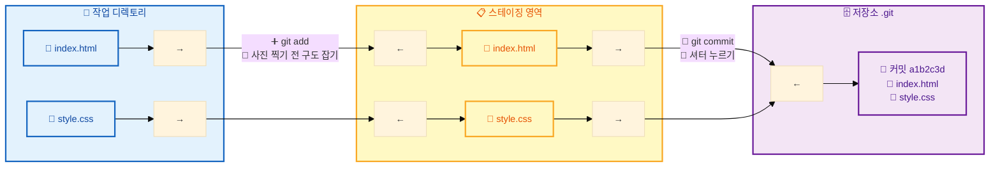

# 변경 사항 추가 및 커밋

## 👨‍💻 실전 프로젝트: 변경 사항 Staging하고 커밋하기

이번 실전 프로젝트에서는 Git의 핵심 작업인 `git add`와 `git commit`을 직접 수행하면서 변경 사항을 체계적으로 기록하는 방법을 익혀보겠습니다. 여러분은 간단한 웹 프로젝트 파일을 생성하고, 각 파일의 변경 사항을 스테이징 영역에 추가한 후 커밋하는 과정을 단계별로 진행하게 됩니다. 특히 `git status` 명령어를 수시로 실행하여 파일의 상태 변화를 실시간으로 확인하는 습관을 기르는 것이 중요합니다. 터미널을 열고 아래 명령어를 따라 입력하면서 자신의 프로젝트에 첫 번째 커밋 이력을 만들어보시기 바랍니다.

```bash
# 1단계: 프로젝트 디렉토리를 생성하고 Git 저장소로 초기화합니다.
$ mkdir my-app && cd my-app && git init
Initialized empty Git repository in /Users/me/my-app/.git/

# 2단계: 두 개의 파일을 생성합니다. 이 파일들은 모두 Untracked 상태입니다.
$ echo "<h1>My App</h1>" > index.html
$ echo "body { font-family: sans-serif; }" > style.css
$ git status
On branch main
Untracked files:
    index.html
    style.css

# 3단계: index.html만 스테이징 영역에 추가합니다.
$ git add index.html
$ git status
On branch main
Changes to be committed:
    new file:   index.html
Untracked files:
    style.css

# 4단계: 스테이징된 index.html을 커밋합니다.
$ git commit -m "기본 HTML 구조 추가"
[main (root-commit) a1b2c3d] 기본 HTML 구조 추가
 1 file changed, 1 insertion(+)

# 5단계: style.css도 스테이징하고 커밋합니다.
$ git add style.css && git commit -m "기본 CSS 스타일 추가"
[main d4e5f6f] 기본 CSS 스타일 추가
 1 file changed, 1 insertion(+)

# 6단계: 전체 커밋 이력을 확인합니다.
$ git log --oneline
d4e5f6f (HEAD -> main) 기본 CSS 스타일 추가
a1b2c3d 기본 HTML 구조 추가
```

여러분은 방금 변경 사항을 스테이징하고 커밋하는 전체 과정을 성공적으로 수행했습니다. 이처럼 `git add`로 원하는 파일만 골라서 스테이징하고, `git commit`으로 의미 있는 단위로 기록하는 것이 Git 워크플로우의 핵심입니다. 이제 본격적으로 각 명령어의 상세 사용법을 알아보겠습니다.

---

Git에서 버전 관리를 시작하는 가장 기본이자 핵심적인 작업은 변경 사항을 기록하는 것입니다. 우리가 파일을 수정하고 그 내용을 저장하는 행위는 Git을 통해 체계적으로 관리될 수 있으며, 이를 통해 언제든지 과거의 특정 시점으로 되돌아가거나 변경 이력을 추적할 수 있습니다. Git의 버전 관리는 단순히 파일을 백업하는 것과는 달리, **무엇을**, **언제**, **누가**, **왜** 변경했는지까지 모두 기록합니다. 이 장에서는 Git에서 변경 사항을 기록하는 가장 기본적인 단계인 `add`와 `commit`에 대해 알아보겠습니다. 이 두 명령어는 Git 워크플로우의 핵심이며, 모든 Git 사용자가 반드시 숙지해야 할 필수 명령어입니다.

## 학습 목표

- `git status` 명령어로 작업 디렉토리의 상태를 확인할 수 있습니다
- `git add` 명령어로 변경 사항을 스테이징 영역에 추가할 수 있습니다
- `git commit` 명령어로 스테이징된 변경 사항을 저장소에 기록할 수 있습니다
- 좋은 커밋 메시지를 작성하는 규칙을 이해하고 적용할 수 있습니다

이 네 가지 목표는 Git을 실무에서 사용하기 위한 최소한의 요구 사항입니다. 이 목표들을 달성하면 자신의 프로젝트를 Git으로 관리하고, 팀과 협업할 수 있는 기본적인 역량을 갖추게 됩니다.

**add와 commit의 관계:**



위 다이어그램은 `git add`와 `git commit`의 관계를 시각적으로 보여줍니다. `git add`는 작업 디렉토리의 파일을 스테이징 영역으로 옮기는 과정이고, `git commit`은 스테이징 영역의 파일들을 하나의 스냅샷으로 묶어 저장소에 영구히 기록하는 과정입니다. 사진 촬영에 비유하면 `git add`는 구도를 잡고 피사체를 배치하는 단계이며, `git commit`은 실제로 셔터를 눌러 사진을 찍는 순간입니다.

## 1. 작업 상태 확인하기: `git status`

무엇을 커밋할지 결정하기 전에 현재 작업 디렉토리의 상태를 먼저 확인하는 것이 중요합니다. `git status` 명령어는 현재 어떤 파일이 수정되었고, 어떤 파일이 스테이징되었는지를 상세히 알려줍니다. 숙련된 Git 사용자일수록 `git status`를 자주 사용하며, 커밋하기 전에는 반드시 한 번 이상 실행하는 것이 일반적입니다. 이 명령어는 Git 저장소의 현재 상태를 종합적으로 보여주는 가장 중요한 명령어 중 하나입니다.

```bash
git status
```

**출력 예시:**
```
On branch main
Changes not staged for commit:
  (use "git add <file>..." to update what will be committed)
  (use "git restore <file>..." to discard changes in working directory)
        modified:   index.html

Untracked files:
  (use "git add <file>..." to include in what will be committed)
        new-style.css
```

여기서 `index.html`은 추적 중인 파일이 수정된 상태(Modified)이고, `new-style.css`는 새로 추가된 Untracked 파일입니다. Git은 각 파일에 대해 어떤 작업을 수행해야 하는지 친절한 힌트 메시지도 함께 제공하므로, 이 메시지를 잘 읽어보면 다음에 실행할 명령어를 쉽게 결정할 수 있습니다.

**`git status`의 다양한 출력 형태:**
```bash
# 간결한 상태 확인
$ git status -s
 M index.html        # 수정됨 (스테이징 안 됨)
?? new-style.css     # Untracked
A  about.html        # 새로 추가되어 스테이징됨
MM app.js            # 스테이징 후 추가 수정 있음

# -s 옵션 설명:
# 첫 번째 칸: 스테이징 영역 상태
# 두 번째 칸: 작업 디렉토리 상태
# ?? : Untracked 파일
# M  : 수정됨
# A  : 새로 추가됨
```

`-s`(short) 옵션은 각 파일의 상태를 두 글자로 간결하게 표시해줍니다. 첫 번째 문자는 스테이징 영역의 상태를, 두 번째 문자는 작업 디렉토리의 상태를 나타냅니다. 예를 들어, `MM`은 파일이 스테이징된 후에 다시 수정되어 Staged와 Modified 두 상태를 동시에 가짐을 의미합니다. 이 짧은 형식은 파일이 많을 때 특히 유용하며, 많은 개발자가日常工作에서 기본 옵션으로 사용합니다.

**파일 내용 변경 예시와 상태 변화:**
```bash
$ echo "body { color: red; }" > style.css
$ echo "var x = 1;" > app.js

# 선택적으로 스테이징
$ git add style.css
$ git status -s
A  style.css         # 스테이징됨
?? app.js            # 스테이징 안 됨

# app.js도 수정한 후 스테이징
$ echo "var y = 2;" >> app.js
$ git add app.js
$ git status -s
A  style.css
A  app.js

# 커밋
$ git commit -m "초기 CSS 및 JS 파일 추가"
```

**특정 파일만 골라서 커밋하기:**
```bash
$ git status -s
 M login.html        # 수정됨
 M style.css         # 수정됨
 M app.js            # 수정됨

# login.html 변경 사항만 커밋
$ git add login.html
$ git commit -m "로그인 페이지 버튼 스타일 변경"
```

위 예제는 여러 파일이 수정된 상황에서 특정 파일만 골라서 커밋하는 방법을 보여줍니다. 이처럼 Git을 사용하면 관련 있는 변경 사항끼리 묶어서 논리적인 단위로 커밋할 수 있어, 나중에 이력을 확인할 때 각 커밋의 목적을 명확히 파악할 수 있습니다.

## 2. 스테이징 영역에 추가하기: `git add`

작업 디렉토리에서 수정한 파일 중에서 커밋에 포함시키고 싶은 변경 사항만을 스테이징 영역에 추가할 때 `git add` 명령어를 사용합니다. 스테이징 영역은 "이번 커밋에 포함시킬 파일들의 대기실"이라고 생각하면 이해하기 쉽습니다. `git add`는 단순히 파일을 추가하는 것뿐만 아니라, 해당 시점의 파일 내용을 스테이징 영역에 저장하는 역할을 합니다.

**파일 하나 추가하기:**
```bash
git add index.html
```

**여러 파일 추가하기:**
```bash
git add index.html new-style.css
```

**현재 디렉토리의 모든 변경 사항 추가하기:**
```bash
git add .
```

`.`(현재 디렉토리)를 사용하면 하위 디렉토리를 포함한 모든 변경 사항이 한 번에 스테이징되므로 편리하지만, 의도하지 않은 파일까지 포함될 수 있으므로 주의해야 합니다. 실무에서는 `git add -p`(대화형 모드)를 사용하여 변경 사항을 하나씩 확인하면서 추가하는 것이 권장됩니다.

## 3. 변경 사항 기록하기: `git commit`

스테이징 영역에 추가된 변경 사항들을 하나의 스냅샷으로 저장(커밋)합니다. 커밋할 때는 반드시 메시지를 함께 작성해야 하며, 이 메시지는 나중에 변경 이력을 확인할 때 중요한 단서가 됩니다. 커밋이 생성되면 Git은 고유한 40자리 해시 값을 부여하여 해당 커밋을 식별하고, 이 해시를 통해 언제든지 그 시점의 상태로 되돌아갈 수 있습니다.

```bash
git commit -m "커밋 메시지를 여기에 작성합니다"
```

**출력 예시:**
```
[main 7a3fb42] index.html 스타일 업데이트 및 new-style.css 추가
 2 files changed, 15 insertions(+), 3 deletions(-)
 create mode 100644 new-style.css
```

출력 메시지에서 `7a3fb42`는 커밋 해시의 앞 7자리이며, `2 files changed`는 이번 커밋에서 변경된 파일의 개수, `15 insertions`는 추가된 줄 수, `3 deletions`는 삭제된 줄 수를 각각 나타냅니다. `create mode 100644`는 새로운 파일이 생성되었음을 의미하며, 일반 파일의 권한(644)을 나타냅니다.

## 4. 좋은 커밋 메시지 작성 팁

커밋 메시지는 간결하고 명확하게 작성하는 것이 매우 중요합니다. 나중에 이력을 확인할 때 어떤 변경이 있었는지 쉽게 알 수 있도록 도와주기 때문입니다. 특히 협업 프로젝트에서는 동료 개발자가 여러분의 커밋 메시지를 읽고 변경 사항을 이해해야 하므로, 더욱 신중하게 작성해야 합니다. 좋은 커밋 메시지는 단순한 기록을 넘어 프로젝트의 의사소통 도구로서의 역할을 합니다.

- **명령문 형태로 작성하세요:** "수정함"보다는 "로그인 버그 수정"과 같이 명령형으로 작성합니다. Git 자체의 커밋 메시지가 명령형을 사용하기 때문에, 이 스타일에 맞추면 일관성이 유지됩니다.
- **짧게, 하지만 설명적으로:** 제목은 50자 이내로 간결하게 쓰고, 필요하면 본문에 자세한 설명을 추가합니다. 제목만으로도 변경 사항을 대략적으로 파악할 수 있어야 합니다.
- **무엇을, 왜 변경했는지:** "무엇을" 변경했는지와 "왜" 변경했는지를 위주로 작성합니다. "어떻게" 변경했는지는 diff를 보면 알 수 있으므로, 생략해도 무방합니다.

**좋은 예 vs 나쁜 예:**

```bash
# ❌ 나쁜 예
$ git commit -m "수정"
$ git commit -m "버그 수정함"
$ git commit -m "asdf"

# ✅ 좋은 예
$ git commit -m "로그인 버튼 클릭 시 크래시 발생 버그 수정"
$ git commit -m "README에 설치 방법 추가"
$ git commit -m "결제 모듈 API 응답 처리 방식 개선"

# ✅ 긴 설명이 필요할 때 (본문 추가)
$ git commit -m "사용자 프로필 페이지 성능 최적화

- 프로필 이미지 지연 로딩(lazy loading) 적용
- API 호출 횟수 3회에서 1회로 감소
- 불필요한 리렌더링 제거로 DOM 조작 최소화

관련 이슈: #42"
```

좋은 커밋 메시지의 공통점은 "무엇을" 변경했는지가 제목에 드러나 있다는 것입니다. "수정"이라는 모호한 표현 대신 "로그인 버튼 클릭 시 크래시 발생 버그 수정"과 같이 구체적으로 작성하면, 한 달 후에 봐도 즉시 이해할 수 있습니다. 본문에는 변경한 이유와 추가적인 맥락을 제공하면 팀 협업에 큰 도움이 됩니다.

## 5. 대화형 스테이징 (Interactive Staging)

파일의 일부 변경 사항만 골라서 스테이징하고 싶을 때 `git add -p` 명령어를 사용할 수 있습니다. 이 기능은 하나의 파일 안에서도 원하는 부분만 선택적으로 커밋할 수 있게 해주어, 더 세밀한 버전 관리를 가능하게 합니다. 예를 들어, 디버깅용 로그와 실제 기능 코드가 같은 파일에 섞여 있을 때, 디버깅 로그는 제외하고 기능 코드만 커밋할 수 있습니다.

```bash
$ git add -p

# Git이 변경 사항을 덩어리(hunk) 단위로 보여주고 선택을 물어봄
diff --git a/app.js b/app.js
+ console.log("디버깅용 로그");    # ← 이건 빼고
+ function calculateTotal() {      # ← 이건 넣고
+   return price * quantity;
+ }
Stage this hunk? [y,n,q,a,d,j,J,g,/,e,?]
# y: 이 덩어리 스테이징
# n: 이 덩어리 건너뛰기
# e: 수동으로 편집
# ?: 도움말
```

`git add -p`는 Git의 가장 강력한 기능 중 하나로, 숙련된 개발자일수록 자주 사용합니다. `y`를 입력하면 해당 덩어리를 스테이징하고, `n`을 입력하면 건너뜁니다. `?`를 입력하면 사용 가능한 모든 명령어의 도움말을 볼 수 있습니다. 이 기능을 활용하면 하나의 파일에서 여러 논리적 변경 사항을 별도의 커밋으로 분리할 수 있습니다.

## 6. `git add`와 `git commit` 한 번에 하기

이미 추적(track) 중인 파일(한 번이라도 커밋된 파일)의 변경 사항에 한해, `git add`와 `git commit`을 한 번에 수행할 수 있습니다. 이 기능은 변경 사항이 많지 않거나, 모든 추적 파일의 변경을 한 번에 커밋하고 싶을 때 유용합니다.

```bash
git commit -a -m "변경 사항을 한 번에 커밋"
```

`-a` 옵션은 추적 중인 모든 파일의 변경 사항을 자동으로 스테이징합니다. 단, 새로 생성된 Untracked 파일은 자동으로 추가되지 않는다는 점을 주의해야 합니다. 즉, `-a` 옵션은 이미 Git이 알고 있는 파일(Modified 상태)만 자동으로 스테이징하며, 새로운 파일(Untracked 상태)은 별도로 `git add`를 실행해야 합니다.

## 7. 커밋 되돌리기 (실수로 커밋했을 때)

실수로 커밋했을 경우에는 `git commit --amend` 명령어를 사용하여 직전 커밋을 수정할 수 있습니다. 예를 들어, 커밋 메시지를 잘못 작성했거나, 특정 파일을 커밋에 포함하는 것을 잊었을 때 유용하게 사용할 수 있습니다.

```bash
# 직전 커밋 수정 (메시지 수정 또는 파일 추가)
$ git add forgotten-file.js
$ git commit --amend -m "수정된 커밋 메시지"
```

> **주의:** `--amend`는 이력을 변경합니다. 이미 원격 저장소에 푸시된 커밋은 `--amend`하지 않는 것이 좋습니다. 왜냐하면 원격 저장소의 이력과 로컬 이력이 일치하지 않게 되어, 다른 팀원들에게 혼란을 줄 수 있기 때문입니다. `--amend`는 아직 원격에 푸시되지 않은 로컬 커밋에만 사용하는 것이 안전합니다.

## 8. 실습: 직접 해보기

지금까지 배운 내용을 바탕으로 직접 실습해보겠습니다. 다음 명령어를 따라 입력하면서 각 단계에서 `git status`로 상태 변화를 확인해보시기 바랍니다. 단순히 명령어를 입력하는 것을 넘어, 각 단계에서 Git이 어떤 메시지를 출력하는지 주의 깊게 읽는 습관을 기르는 것이 중요합니다.

```bash
# 1. 프로젝트 생성
$ mkdir commit-practice && cd commit-practice && git init

# 2. 파일 만들고 커밋
$ echo "첫 번째 내용" > file1.txt
$ git add file1.txt && git commit -m "file1 추가"

# 3. 내용 수정 후 상태 확인
$ echo "두 번째 내용" > file2.txt
$ echo "수정된 내용" >> file1.txt
$ git status

# 4. file2만 스테이징
$ git add file2.txt
$ git status          # file1은 'modified'로 남음

# 5. file1도 스테이징
$ git add file1.txt

# 6. 함께 커밋
$ git commit -m "file2 추가 및 file1 업데이트"

# 7. 로그 확인
$ git log --oneline
a1b2c3d file2 추가 및 file1 업데이트
d4e5f6f file1 추가
```

4번 단계와 5번 단계에서 볼 수 있듯이, Git을 사용하면 여러 파일의 변경 사항을 한 번에 커밋할 수도 있고, 파일별로 나누어 커밋할 수도 있습니다. 이는 변경 사항의 논리적 단위에 따라 커밋을 구성할 수 있는 유연성을 제공합니다.

## 한눈에 정리

| 명령어 | 역할 | 주요 옵션 |
|--------|------|----------|
| `git status` | 작업 디렉토리와 스테이징 영역의 현재 상태 확인 | `-s` (간결한 출력) |
| `git add` | 변경 사항을 스테이징 영역에 추가 | `.` (전체 추가), `-p` (대화형) |
| `git commit` | 스테이징된 변경 사항을 저장소에 기록 | `-m` (메시지), `-a` (추적 중인 파일 자동 추가), `--amend` (직전 커밋 수정) |

위 표는 이 장에서 배운 세 가지 명령어를 한눈에 정리합니다. `git status`는 현재 상태를 진단하는 명령어, `git add`는 커밋할 재료를 준비하는 명령어, `git commit`은 준비된 재료를 저장소에 기록하는 명령어로 기억하면 이해하기 쉽습니다.

## 연습 문제

1. `git add` 명령어를 실행하지 않고 `git commit`을 실행하면 어떤 일이 발생하는지 설명하시오.
2. 좋은 커밋 메시지를 작성하기 위한 세 가지 규칙을 서술하시오.
3. `git commit -a -m "메시지"` 명령어는 어떤 상황에서 사용할 수 있으며, 어떤 제약사항이 있는지 설명하시오.
