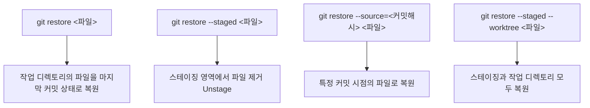

# Checkout 사용하기

## 학습 목표

- `git checkout` 명령어의 다양한 용도와 최신 Git에서의 역할 분리를 이해합니다.
- 브랜치 전환, 파일 복원, 특정 커밋 확인 등 주요 기능을 상황에 맞게 활용할 수 있습니다.
- Detached HEAD 상태의 개념을 이해하고, 이 상태에서 안전하게 작업하는 방법을 습득합니다.
- `git switch`와 `git restore`를 사용하여 더 직관적으로 브랜치와 파일을 관리할 수 있습니다.

`git checkout`은 Git에서 가장 다재다능한 명령어 중 하나입니다. 하나의 명령어로 브랜치 전환, 파일 복원, 특정 커밋 상태 확인 등 다양한 작업을 수행할 수 있기 때문입니다. 그러나 이러한 다양한 기능이 오히려 초보자에게는 혼란을 줄 수 있습니다. 최신 Git(2.23+ 버전)에서는 이러한 복잡성을 해결하기 위해 `git checkout`의 역할을 `git switch`와 `git restore`로 분리하였습니다. 이번 장에서는 전통적인 `git checkout` 방식과 새로운 명령어 방식을 함께 학습하며, 각 상황에 가장 적합한 도구를 선택하는 방법을 알아보겠습니다.

> **참고:** Git 2.23부터 `git checkout`의 기능은 `git switch` (브랜치 전환)와 `git restore` (파일 복원)로 분리되었습니다. 하지만 여전히 `git checkout`도 널리 사용됩니다. 이 문서에서는 전통적인 `git checkout` 방식과 새로운 명령어 방식을 함께 소개합니다.

## 1. 브랜치 전환하기

**전통적인 방식:**
```bash
git checkout main
```

**새로운 방식 (권장):**
```bash
git switch main
```

지금까지 브랜치를 전환하는 방법을 알아보았습니다. 이제 새 브랜치를 생성하면서 동시에 전환하는 방법을 학습해보겠습니다.

## 2. 새 브랜치 생성 및 전환

**전통적인 방식:**
```bash
git checkout -b feature/new-feature
```

**새로운 방식 (권장):**
```bash
git switch -c feature/new-feature
```

지금까지 브랜치 생성과 전환을 함께 수행하는 방법을 배웠습니다. 다음으로 특정 커밋으로 이동하는 Detached HEAD 상태에 대해 알아보겠습니다.

## 3. 특정 커밋으로 이동하기 (Detached HEAD 상태)

Detached HEAD는 특정 브랜치가 아닌, 과거의 특정 커밋을 직접 보고 있는 상태를 말합니다. 이 상태에서는 현재 위치가 어떤 브랜치에도 속해 있지 않습니다.

```bash
$ git log --oneline
c3d4e5f (HEAD -> main) C3: 최신 버전
b2c3d4e C2: 중간 버전
a1b2c3d C1: 첫 버전

# C2 시점의 코드를 살펴보고 싶다면?
$ git checkout b2c3d4e
Note: switching to 'b2c3d4e'.
You are in 'detached HEAD' state...

# 이 상태에서 파일을 보면 C2 시점의 코드가 보임
$ cat README.md
# C2 시점의 README 내용...
```

**Detached HEAD 상태에서 벗어나기:**
```bash
# 1. 그냥 원래 브랜치로 돌아가기 (Detached HEAD에서 만든 커밋은 사라짐)
$ git switch main

# 2. Detached HEAD에서 만든 커밋을 살리고 싶다면?
$ git switch -c new-branch-name   # 새 브랜치 생성
# 또는
$ git branch new-branch-name      # 현재 위치에 브랜치 생성
$ git switch main                 # 그런 다음 돌아가기
```

**Detached HEAD 활용: 과거 버전에서 실험하고 버리기**
```bash
# C1 시절의 코드를 보고 싶음
$ git checkout a1b2c3d

# C1 기반으로 실험
$ echo "실험 코드" > experiment.txt
$ git add . && git commit -m "과거에서 실험"

# 실험 끝! 그냥 main으로 돌아가기 (실험 커밋은 사라짐)
$ git switch main
Warning: 1 commit left behind...   # Git이 알려줌
```

지금까지 Detached HEAD 상태에서 특정 커밋을 확인하고 실험하는 방법을 학습하였습니다. 이제 작업 중인 파일을 복원하는 방법에 대해 알아보겠습니다.

## 4. 파일 복원하기

작업 디렉토리의 특정 파일을 마지막 커밋 상태로 되돌립니다.

```bash
# README.md를 수정했지만 실수였다면?
$ echo "실수로 추가한 내용" >> README.md
$ cat README.md
원래 내용
실수로 추가한 내용

# 원래대로 복원!
$ git restore README.md
$ cat README.md
원래 내용
```

**파일 복원에 관한 다양한 시나리오:**
```bash
# 1. 여러 파일 한 번에 복원
$ git restore file1.js file2.js

# 2. 모든 파일 복원 (추적 중인 파일만)
$ git restore .

# 3. 3일 전 버전으로 파일 복원
$ git restore --source=HEAD~3 app.js

# 4. 특정 커밋의 파일 내용을 가져오기
$ git restore --source=a1b2c3d style.css

# 5. 복원 미리보기 (실제로 복원하지는 않음)
$ git restore --source=HEAD~1 --staged README.md
```

파일 복원 방법에 대해 알아보았습니다. 이제 특정 커밋 시점의 파일로 복원하는 방법을 더 자세히 살펴보겠습니다.

## 5. 특정 커밋 시점의 파일로 복원하기

**전통적인 방식:**
```bash
git checkout a1b2c3d -- index.html
```

**새로운 방식 (권장):**
```bash
git restore --source=a1b2c3d index.html
```

지금까지 파일 복원에 대해 학습하였습니다. 다음으로 스테이징 영역에서 파일을 제거하는 Unstage 작업에 대해 알아보겠습니다.

## 6. 스테이징 취소하기 (Unstaging)

스테이징 영역에 추가된 파일을 Unstage 상태로 되돌립니다.

```bash
$ git add app.js   # 실수로 스테이징함!
$ git status
Changes to be committed:
    modified:   app.js

# 스테이징 취소 (Unstage)
$ git restore --staged app.js
$ git status
Changes not staged for commit:
    modified:   app.js   # Modified 상태로 돌아감
```

**스테이징과 작업 디렉토리를 모두 한 번에 초기화:**
```bash
$ git add app.js
$ echo "추가 수정" >> app.js

# 스테이징 취소 + 파일 복원을 동시에
$ git restore --staged --worktree app.js
# = git checkout HEAD -- app.js (전통적 방식)
```

## 요약: `git restore` 사용법



## `git checkout` 팁

*   과거의 코드를 살펴볼 때 `git checkout <커밋해시>`를 사용하세요.
*   복구하고 싶은 파일이 있을 때 `git checkout -- <파일명>`을 사용하세요.
*   브랜치 전환은 `git switch`를 사용하는 것이 더 직관적입니다.

## 실습 예제

```bash
# 1. README.md 파일을 수정해 보기
echo "실수로 추가한 내용" >> README.md

# 2. 실수를 발견하고 파일 복원
git restore README.md
# 또는: git checkout -- README.md

# 3. 파일 내용 확인 (복원됨)
cat README.md
```

### 복합적인 실수 시나리오

```bash
# 1. 파일 3개를 수정하고 실수로 2개를 스테이징
$ echo "수정1" >> file1.txt && echo "수정2" >> file2.txt && echo "수정3" >> file3.txt
$ git add file1.txt file2.txt   # file3은 스테이징하지 않음

# 2. file2의 스테이징을 취소하고 싶음
$ git restore --staged file2.txt

# 3. file1의 변경 사항도 마음에 안 듦 → 복원
$ git restore --staged file1.txt
$ git restore file1.txt

# 4. file2와 file3의 변경도 모두 취소
$ git restore file2.txt file3.txt

# 5. 모든 것이 깨끗해짐
$ git status
nothing to commit, working tree clean
```

## 한눈에 정리

| 개념 | 설명 | 주요 명령어 |
|------|------|-----------|
| 브랜치 전환 | 현재 작업 중인 브랜치를 다른 브랜치로 변경합니다. | `git switch <브랜치명>`, `git checkout <브랜치명>` |
| 브랜치 생성 및 전환 | 새 브랜치를 생성하면서 동시에 해당 브랜치로 전환합니다. | `git switch -c <브랜치명>`, `git checkout -b <브랜치명>` |
| Detached HEAD | 특정 브랜치가 아닌 과거 커밋을 직접 확인하는 상태입니다. 이 상태에서 만든 커밋은 브랜치를 떠나면 사라집니다. | `git checkout <커밋해시>` |
| 파일 복원 | 작업 디렉토리의 파일을 마지막 커밋 상태 또는 특정 커밋 시점으로 되돌립니다. | `git restore <파일>`, `git restore --source=<커밋해시> <파일>` |
| Unstage | Staging Area에 추가된 파일을 제거하여 Modified 상태로 되돌립니다. | `git restore --staged <파일>` |
| 스테이징 및 작업 디렉토리 초기화 | Staging Area와 Working Directory를 모두 마지막 커밋 상태로 되돌립니다. | `git restore --staged --worktree <파일>` |

## 연습 문제

1. `git checkout`의 역할이 Git 2.23 이후 어떤 두 명령어로 분리되었는지 설명하고, 각 명령어가 담당하는 기능을 서술해보세요.

2. Detached HEAD 상태란 무엇인지 설명하고, 이 상태에서 새로 만든 커밋이 브랜치를 떠날 때 어떻게 되는지 서술해보세요.

3. 작업 디렉토리의 파일을 마지막 커밋 상태로 되돌리려면 어떤 명령어를 사용해야 하는지 작성해보세요.
