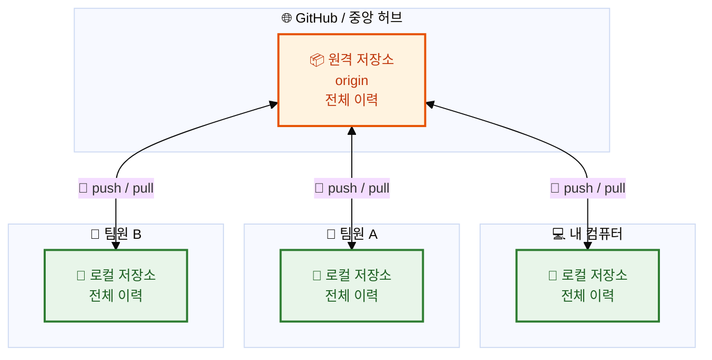
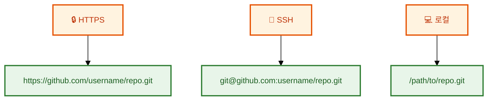

# 원격 저장소 이해

## 👨‍💻 실전 프로젝트: GitHub에 원격 저장소 만들고 연결하기

이번 실전 프로젝트에서는 GitHub에서 원격 저장소를 생성하고 로컬 저장소와 연결하는 전 과정을 직접 수행해보겠습니다. GitHub는 가장 널리 사용되는 Git 원격 저장소 호스팅 서비스로서, 전 세계 수백만 개발자가 협업하는 플랫폼입니다. 우리는 GitHub 계정을 활용하여 실제 프로젝트를 클라우드에 올리는 경험을 통해 원격 저장소의 개념을 체득할 것입니다.

```bash
# Step 1: GitHub에 새 저장소 생성
# GitHub 웹사이트(github.com)에 로그인한 후, 우측 상단 "+" 버튼을 클릭하고
# "New repository"를 선택합니다. 저장소 이름을 "my-first-repo"로 입력하고
# "Public" 또는 "Private"을 선택한 후 "Create repository" 버튼을 클릭합니다.

# Step 2: 로컬에 Git 저장소 초기화
$ mkdir my-first-repo
$ cd my-first-repo
$ git init
$ echo "# My First Repo" > README.md
$ git add README.md
$ git commit -m "첫 번째 커밋: README 파일 추가"

# Step 3: 원격 저장소 추가
$ git remote add origin https://github.com/your-username/my-first-repo.git
$ git remote -v
origin  https://github.com/your-username/my-first-repo.git (fetch)
origin  https://github.com/your-username/my-first-repo.git (push)

# Step 4: 로컬 커밋을 원격 저장소에 푸시
$ git push -u origin main
Enumerating objects: 3, done.
Counting objects: 100% (3/3), done.
Writing objects: 100% (3/3), 234 bytes | 234.00 KiB/s, done.
Total 3 (delta 0), reused 0 (delta 0), pack-reused 0
To https://github.com/your-username/my-first-repo.git
 * [new branch]      main -> main
Branch 'main' set up to track remote branch 'main' from 'origin'.

# Step 5: GitHub 웹사이트에서 푸시된 파일 확인
# 브라우저에서 GitHub 저장소 페이지를 새로고침하면 README.md 파일이
# 정상적으로 업로드된 것을 확인할 수 있습니다. 이제 전 세계 어디서든
# 이 저장소에 접근할 수 있습니다.
```

이 과정에서 우리는 GitHub 웹 인터페이스를 통해 원격 저장소를 생성하고, `git remote add` 명령어로 로컬 저장소와 연결한 후, `git push`로 최초 푸시를 완료하였습니다. `-u` 옵션은 로컬 main 브랜치와 원격 origin/main 브랜치를 추적 관계로 설정하여 이후 푸시와 풀을 간편하게 만들어줍니다. 이제 여러분은 공식적으로 Git 협업의 첫걸음을 뗐습니다.

---

## 학습 목표

- 원격 저장소(Remote Repository)의 개념과 로컬 저장소와의 관계를 이해할 수 있습니다.
- `git remote` 명령어로 원격 저장소를 확인하고 추가 및 삭제할 수 있습니다.
- HTTPS와 SSH 등 원격 저장소 접근 프로토콜의 차이점을 이해하고 설정할 수 있습니다.
- 여러 개의 원격 저장소를 관리하고 활용하는 방법을 익힐 수 있습니다.

---

지금까지의 작업은 모두 여러분의 로컬 컴퓨터에서 이루어졌습니다. 하지만 Git의 진정한 가치는 협업에서 드러납니다. **원격 저장소(Remote Repository)**를 사용하면 전 세계 어디서든 다른 개발자들과 함께 프로젝트를 개발할 수 있습니다. 로컬 저장소만으로는 개인적인 버전 관리에는 충분하지만, 팀 단위 협업이나 코드 백업, 배포 자동화 등의 작업을 수행하기에는 한계가 있습니다. 이제 우리는 로컬 환경을 넘어 다른 개발자들과 협업할 수 있는 원격 저장소의 세계로 발을 내딛어보겠습니다. 원격 저장소를 이해하는 것은 Git을 이용한 협업의 첫걸음이며, 모든 Git 기반 워크플로우의 근간을 이루는 핵심 개념입니다.

## 원격 저장소란?

원격 저장소는 인터넷이나 네트워크 어딘가에 있는 Git 저장소입니다. 여러분의 로컬 저장소와 연결되어 데이터를 주고받을 수 있으며, 중앙 집중식 협업의 허브 역할을 수행합니다. 대표적인 원격 저장소 호스팅 서비스로는 **GitHub**, **GitLab**, **Bitbucket** 등이 있으며, 각 서비스마다 고유한 협업 기능과 특징을 제공합니다. 예를 들어 GitHub는 Pull Request와 Actions를 통한 CI/CD를 지원하고, GitLab은 자체 호스팅이 가능하며 무제한 비공개 저장소를 제공합니다. 이러한 서비스들은 모두 Git 프로토콜을 기반으로 동작하므로, 어떤 서비스를 선택하든 기본적인 push, pull, fetch 명령어는 동일하게 사용할 수 있습니다.

**로컬 저장소와 원격 저장소의 관계:**



위 다이어그램에서 볼 수 있듯이, 원격 저장소는 여러 로컬 저장소 사이의 중개자 역할을 합니다. 각 개발자는 자신의 로컬 저장소에서 독립적으로 작업하다가, 원격 저장소를 통해 변경 사항을 공유하고 동기화합니다. 이러한 구조는 중앙 서버가 다운되더라도 각 로컬 저장소에 전체 프로젝트 이력이 보존되므로 분산 환경에서도 안정적인 협업이 가능합니다. 또한 원격 저장소는 단순한 파일 공유를 넘어, 이슈 트래킹, 코드 리뷰, CI/CD 파이프라인 등 현대 개발 방법론의 핵심 인프라로 자리잡고 있습니다.

```
[내 로컬 저장소] <───> [원격 저장소 (GitHub 등)] <───> [팀원 A의 로컬 저장소]
                                                     <───> [팀원 B의 로컬 저장소]
```

## 원격 저장소의 필요성

원격 저장소의 필요성을 다양한 측면에서 살펴보면, 먼저 **백업** 측면에서 로컬 저장소의 데이터를 안전하게 백업할 수 있습니다. 노트북 분실이나 하드디스크 고장 같은 예상치 못한 상황에서도 원격 저장소에 push해둔 코드는 안전하게 보존됩니다. **협업** 측면에서는 팀원들과 코드를 공유하고 동시에 작업할 수 있어, 여러 개발자가 동일한 프로젝트에서 병렬로 작업을 진행할 수 있습니다. **배포** 측면에서는 완성된 코드를 원격 저장소를 통해 배포 서버에 쉽게 반영할 수 있어 DevOps 파이프라인 구축의 기반이 됩니다. 마지막으로 **오픈소스 기여** 측면에서는 전 세계의 프로젝트에 기여하고 코드를 공유할 수 있어, 개발자로서의 성장과 네트워킹에 큰 도움이 됩니다. 이러한 이유로 현대 소프트웨어 개발에서 원격 저장소는 선택이 아닌 필수 요소로 자리잡았습니다.

## 원격 저장소 확인하기

원격 저장소를 설정하기에 앞서, 현재 저장소에 연결된 원격 저장소가 있는지 확인하는 방법부터 알아보겠습니다. 다음 명령어를 사용하여 현재 프로젝트에 등록된 원격 저장소의 목록을 확인할 수 있습니다.

```bash
git remote
```

**출력 예시:**
```
origin
```

`-v` 옵션을 사용하면 원격 저장소의 URL도 함께 확인할 수 있어, 어떤 주소로 연결되어 있는지 구체적으로 파악할 수 있습니다. 이 옵션은 특히 여러 개의 원격 저장소를 관리할 때 각 저장소의 URL을 한눈에 비교할 수 있어 유용합니다.

```bash
git remote -v
```

**출력 예시:**
```
origin  https://github.com/username/my-project.git (fetch)
origin  https://github.com/username/my-project.git (push)
```

관례적으로 원격 저장소의 기본 이름은 `origin`을 사용합니다. 이 이름은 원래 "출발지"라는 의미로, 로컬 저장소를 clone할 때 원본 저장소를 가리키는 이름에서 유래했습니다. 물론 `origin` 외에도 `upstream`, `backup`, `github` 등 프로젝트의 목적에 따라 다양한 이름을 사용할 수 있습니다. 예를 들어 오픈소스 프로젝트에서는 원본 저장소를 `upstream`, 자신의 fork를 `origin`으로 설정하는 것이 일반적인 관행입니다.

**여러 개의 원격 저장소 설정 예시:**
```bash
$ git remote -v
origin   https://github.com/me/my-project.git (fetch)
origin   https://github.com/me/my-project.git (push)
upstream https://github.com/other/my-project.git (fetch)  # 다른 사람의 fork
backup   https://gitlab.com/me/my-project.git (fetch)     # 백업용

# 원격 저장소별로 push/pull 가능
$ git push origin main          # GitHub에 푸시
$ git push backup main          # GitLab에도 푸시
$ git pull upstream develop     # 원본 저장소에서 최신 코드 가져오기
```

## 원격 저장소 추가하기

대부분의 경우 GitHub 등에서 저장소를 먼저 생성하고 clone하여 사용하지만, 로컬에서 먼저 작업을 시작한 경우 나중에 원격 저장소를 연결할 수도 있습니다. 이 방식은 기존 프로젝트를 GitHub에 업로드하거나, 로컬 프로토타입을 팀과 공유할 때 자주 사용됩니다.

```bash
git remote add origin https://github.com/username/my-project.git
```

위 명령어는 `origin`이라는 이름으로 원격 저장소를 추가합니다. 이제 로컬 저장소는 지정된 URL의 원격 저장소와 연결되었으며, 이후 `git push origin main` 명령어로 변경 사항을 업로드할 수 있습니다. `git remote add` 명령어는 단순히 로컬 저장소에 원격 저장소의 별칭과 URL 정보를 저장할 뿐, 실제로 네트워크 통신이 이루어지는 것은 push나 pull 등을 실행할 때입니다.

## 원격 저장소의 URL 형식

Git은 다양한 프로토콜을 통해 원격 저장소에 접근할 수 있습니다. 각 프로토콜은 장단점이 있으므로 상황에 맞게 선택하는 것이 중요합니다. 프로토콜에 따라 인증 방식, 속도, 보안 수준이 달라지므로, 자신의 개발 환경과 보안 요구 사항에 적합한 방식을 선택해야 합니다.



초보자에게는 **HTTPS** 방식이 가장 설정하기 쉽고 간편합니다. 별도의 키 생성 과정 없이 GitHub 사용자 이름과 Personal Access Token만으로 인증을 완료할 수 있기 때문입니다. SSH 방식은 한 번 설정하면 비밀번호 없이 사용할 수 있다는 장점이 있지만, 초기 SSH 키 설정이 필요하며 공개키를 GitHub에 등록하는 과정이 필요합니다. 로컬 프로토콜은 같은 컴퓨터나 네트워크 내에서 디렉토리 경로로 직접 접근하는 방식으로, 학습 목적이나 내부 테스트 환경에서 주로 사용됩니다.

**SSH 키 설정 및 사용 예시:**

```bash
# SSH 키 생성
$ ssh-keygen -t ed25519 -C "your.email@example.com"

# 생성된 공개키 확인
$ cat ~/.ssh/id_ed25519.pub
ssh-ed25519 AAAAC3... your.email@example.com

# GitHub/Settings/SSH and GPG keys에 공개키 등록 후
$ git clone git@github.com:username/private-repo.git
# 비밀번호 없이 clone/push 가능!
```

**HTTPS 사용 시 토큰 인증 예시:**
```bash
# GitHub에서 Personal Access Token 발급 후
$ git clone https://github.com/username/private-repo.git
Username: your_username
Password: your_personal_access_token   # ← GitHub 비밀번호가 아닌 토큰!

# 혹은 URL에 토큰 포함 (보안상 비추천)
$ git clone https://token@github.com/username/private-repo.git

# GitHub CLI로 간편 인증
$ gh auth login
# 브라우저에서 로그인 후 자동 인증 완료!
```

2021년 8월부터 GitHub는 HTTPS 인증 시 비밀번호 대신 Personal Access Token을 요구하도록 정책을 변경하였습니다. 따라서 반드시 GitHub Settings > Developer settings > Personal access tokens에서 토큰을 발급받아 사용해야 합니다. GitHub CLI(`gh auth login`)를 사용하면 브라우저 기반 OAuth 인증을 통해 더욱 간편하게 로그인할 수 있으며, 이 방식이 가장 최신의 권장 방법입니다.

## 원격 저장소 삭제하기

프로젝트가 종료되었거나 원격 저장소 주소가 변경되어 더 이상 필요하지 않은 경우, `git remote remove` 명령어로 연결을 해제할 수 있습니다. 이 명령어는 로컬 저장소에 저장된 원격 저장소 참조만 제거할 뿐, 원격 저장소 자체의 데이터는 삭제되지 않습니다.

```bash
git remote remove origin
```

## 원격 저장소 정보 자세히 보기

```bash
git remote show origin
```

이 명령어는 원격 저장소의 URL, 추적 브랜치 목록, 최신 동기화 상태 등 상세 정보를 보여줍니다. 단순히 URL만 확인하는 `git remote -v`보다 훨씬 풍부한 정보를 제공하므로, 원격 저장소의 현재 상태를 진단할 때 유용하게 사용할 수 있습니다. 특히 로컬 브랜치와 원격 브랜치 간의 동기화 상태를 확인할 수 있어, push가 필요한지 pull이 필요한지 판단하는 데 도움을 줍니다.

**`git remote show origin` 출력 예시:**
```bash
$ git remote show origin
* remote origin
  Fetch URL: https://github.com/username/my-project.git
  Push  URL: https://github.com/username/my-project.git
  HEAD branch: main
  Remote branches:
    main            tracked
    develop         tracked
    feature/login   tracked
  Local branches configured for 'git pull':
    main    merges with remote main
    develop merges with remote develop
  Local refs configured for 'git push':
    main    pushes to main    (up to date)
    develop pushes to develop (local out of date)
```

출력 결과에서 주목할 점은 `main` 브랜치는 `(up to date)`로 표시되어 로컬과 원격이 동기화 상태임을 알 수 있는 반면, `develop` 브랜치는 `(local out of date)`로 표시되어 로컬이 원격보다 뒤처져 있음을 확인할 수 있습니다. 이와 같이 `git remote show`는 현재 저장소의 동기화 상태를 한눈에 파악할 수 있게 해주므로, 협업 중 발생할 수 있는 다양한 문제를 사전에 진단하는 데 매우 유용합니다.

**원격 저장소 이름 변경 및 URL 수정:**
```bash
# 원격 저장소 이름 변경
$ git remote rename origin github

# 원격 저장소 URL 변경 (저장소 주소가 바뀌었을 때)
$ git remote set-url origin https://github.com/new-username/new-repo.git

# HTTPS를 SSH로 변경
$ git remote set-url origin git@github.com:username/repo.git
```

저장소를 다른 호스팅 서비스로 이전하거나, 계정 이름이 변경되어 URL이 바뀌는 상황이 발생할 수 있습니다. 이때 원격 저장소를 삭제하고 다시 추가하는 대신 `git remote set-url`을 사용하면 기존 추적 관계를 유지하면서 URL만 변경할 수 있어 편리합니다. 마찬가지로 `git remote rename`을 사용하면 원격 저장소의 별칭을 쉽게 변경할 수 있으며, 이는 여러 개의 원격 저장소를 관리할 때 특히 유용합니다.

## 한눈에 정리

| 개념 | 설명 |
|------|------|
| 원격 저장소 (Remote) | 인터넷이나 네트워크에 있는 Git 저장소로, 로컬 저장소와 데이터를 주고받음 |
| origin | 원격 저장소의 관례적인 기본 이름 |
| `git remote -v` | 연결된 원격 저장소의 이름과 URL을 확인 |
| `git remote add <이름> <URL>` | 새로운 원격 저장소를 추가 |
| `git remote remove <이름>` | 원격 저장소 연결을 제거 |
| `git remote show <이름>` | 원격 저장소의 상세 정보 확인 |
| `git remote rename <이전> <이후>` | 원격 저장소 이름 변경 |
| `git remote set-url <이름> <URL>` | 원격 저장소 URL 변경 |
| HTTPS 프로토콜 | 초보자에게 적합, 설정이 간편하나 매번 인증 필요 |
| SSH 프로토콜 | 초기 키 설정 필요, 이후 비밀번호 없이 사용 가능 |

위 표는 이 장에서 다룬 모든 명령어와 개념을 한눈에 비교할 수 있도록 정리한 것입니다. 각 명령어의 역할을 이해하고, 필요할 때 적절한 명령어를 선택하여 사용할 수 있어야 합니다. 특히 `git remote show`와 `git remote -v`의 차이를 분명히 이해하고, HTTPS와 SSH 프로토콜의 장단점을 숙지하여 프로젝트 상황에 맞는 설정을 선택할 수 있어야 합니다. 이 기본기를 바탕으로 다음 장에서는 실제로 데이터를 주고받는 push, pull, fetch 명령어에 대해 학습해보겠습니다.

## 연습 문제

1. 다음 중 원격 저장소의 필요성으로 가장 거리가 먼 것은 무엇입니까?
   ① 로컬 저장소의 데이터를 백업할 수 있다.
   ② 팀원들과 코드를 공유하고 협업할 수 있다.
   ③ 로컬 저장소의 속도를 향상시킬 수 있다.
   ④ 오픈소스 프로젝트에 기여할 수 있다.

2. `git remote -v` 명령어의 출력에서 `(fetch)`와 `(push)`는 각각 무엇을 의미하는지 설명해보세요.

3. 원격 저장소를 추가할 때 사용하는 명령어의 형식을 작성해보세요. (원격 저장소 이름은 `backup`, URL은 예시를 직접 작성하시오)

---

📌 정답 및 해설

**문제 1 정답 및 해설:**

정답은 **③ 로컬 저장소의 속도를 향상시킬 수 있다**입니다. 원격 저장소는 로컬 저장소의 작업 속도와 직접적인 관련이 없습니다. Git의 대부분의 작업(add, commit, log, diff, branch 등)은 로컬에서 이루어지며, 원격 저장소와의 통신이 필요한 push, pull, fetch 작업만 네트워크 속도의 영향을 받습니다. 로컬 저장소의 속도는 하드웨어 성능과 저장소 크기에 의해 결정되며, 원격 저장소의 존재 유무와는 무관합니다. 나머지 세 가지(백업, 협업, 오픈소스 기여)는 모두 원격 저장소의 핵심 기능입니다.

**문제 2 정답 및 해설:**

`git remote -v` 명령어의 출력에서 `(fetch)`는 원격 저장소에서 데이터를 가져올 때 사용하는 URL을 의미하고, `(push)`는 원격 저장소에 데이터를 보낼 때 사용하는 URL을 의미합니다. 일반적으로 두 URL은 동일하지만, 설정에 따라 서로 다른 URL을 사용할 수도 있습니다. 예를 들어 회사 방화벽 정책으로 인해 fetch는 읽기 전용 HTTPS URL을 사용하고 push는 SSH URL을 사용하는 식으로 분리할 수 있습니다. 이렇게 fetch와 push URL을 분리하면 보안 정책을 유연하게 적용할 수 있으며, `git remote set-url --push origin <new-url>` 명령어로 push URL만 별도로 변경할 수 있습니다.

**문제 3 정답 및 해설:**

원격 저장소를 추가하는 명령어의 형식은 `git remote add <이름> <URL>`입니다. 예를 들어 이름을 `backup`, URL을 GitHub 저장소 주소로 사용한다면 `git remote add backup https://github.com/username/my-project.git`과 같이 작성합니다. 이 명령어를 실행하면 로컬 저장소에 `backup`이라는 이름의 원격 저장소 참조가 추가되며, 이후 `git push backup main`이나 `git pull backup main`과 같이 해당 이름으로 원격 저장소에 접근할 수 있습니다. 원격 저장소의 이름은 관례적으로 `origin`을 사용하지만, 목적에 따라 `backup`, `upstream`, `fork` 등 자유롭게 지정할 수 있으며, `git remote -v`로 등록된 모든 원격 저장소를 확인할 수 있습니다.
