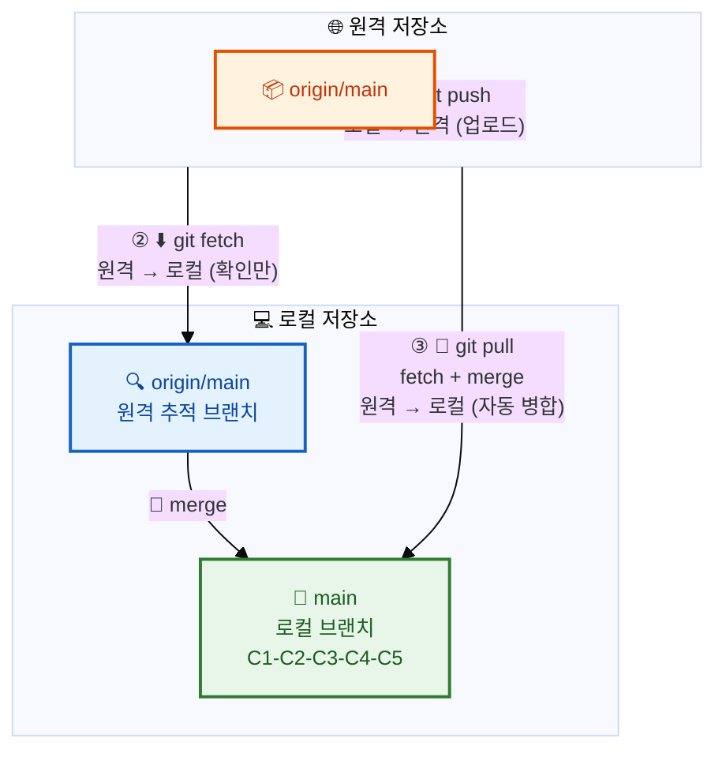
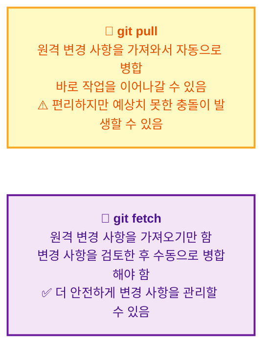

# 푸시, 풀, 페치

## 👨‍💻 실전 프로젝트: 팀 협업 시뮬레이션하기

이번 실전 프로젝트에서는 두 명의 개발자가 하나의 원격 저장소를 통해 협업하는 과정을 시뮬레이션해보겠습니다. 팀원 A와 팀원 B가 각자의 로컬 저장소에서 작업하고, push와 pull, fetch를 통해 변경 사항을 주고받으며 실제 팀 개발 환경을 체험할 것입니다. 이를 통해 각 명령어가 실제 협업 현장에서 어떻게 활용되는지 이해할 수 있습니다.

```bash
# === 시나리오 설정 ===
# 팀원 A가 GitHub에 저장소를 생성하고 초기 코드를 push한 상태입니다.

# === 팀원 B: 프로젝트 클론 ===
$ git clone https://github.com/team/project.git
$ cd project
$ git remote -v
origin  https://github.com/team/project.git (fetch)
origin  https://github.com/team/project.git (push)

# === 팀원 A: 새로운 기능 작업 후 push ===
$ echo "feature A" > feature-a.txt
$ git add feature-a.txt && git commit -m "기능 A 추가"
$ git push origin main

# === 팀원 B: push하기 전에 먼저 pull로 최신 상태 유지 ===
# (팀원 B도 자신의 작업이 있습니다)
$ echo "feature B" > feature-b.txt
$ git add feature-b.txt && git commit -m "기능 B 추가"

# push 시도 → 충돌 상황 발생!
$ git push origin main
! [rejected]        main -> main (fetch first)
error: failed to push some refs to 'https://github.com/team/project.git'
hint: Updates were rejected because the remote contains work that you do not
hint: have locally.

# pull로 원격 변경 사항을 먼저 가져와 병합
$ git pull origin main
Merge made by the 'ort' strategy.

# 병합 완료 후 push 성공
$ git push origin main

# === 팀원 A: fetch로 변경 사항 확인 후 병합 ===
$ git fetch origin
$ git log --oneline main..origin/main
b2c3d4e 기능 B 추가
f5g6h7e Merge branch 'main' of https://github.com/team/project

$ git merge origin/main
Updating a1b2c3d..f5g6h7e
Fast-forward

# === 양쪽 모두 동기화 완료! ===
$ git log --oneline --all
f5g6h7e (HEAD -> main, origin/main) Merge branch ...
b2c3d4e 기능 B 추가
c3d4e5f 기능 A 추가
a1b2c3d 초기 설정
```

이 시뮬레이션을 통해 우리는 push 실패 시 pull로 해결하고, fetch로 안전하게 변경 사항을 검토한 후 병합하는 전형적인 협업 패턴을 익힐 수 있습니다. 실제 팀에서는 충돌이 더 자주 발생하므로, 이러한 기본 워크플로우에 익숙해지는 것이 중요합니다. 특히 push가 거부되었을 때 당황하지 않고 `git pull`로 해결하는 방법을 숙지해야 합니다.

---

## 학습 목표

- `git push`, `git pull`, `git fetch` 세 명령어의 역할과 차이점을 이해할 수 있습니다.
- 로컬 저장소와 원격 저장소 간의 데이터 흐름을 설명할 수 있습니다.
- Push 충돌 상황에서 올바르게 대처하는 방법을 익힐 수 있습니다.
- 새로운 로컬 브랜치를 원격에 푸시하고 원격 브랜치를 삭제하는 방법을 학습합니다.

---

원격 저장소의 개념을 이해했다면, 이제 실제로 데이터를 주고받는 방법을 배울 차례입니다. 로컬 저장소와 원격 저장소 간에 데이터를 주고받는 세 가지 핵심 명령어를 배웁니다. 이 세 명령어는 Git 협업의 핵심 동작이므로, 각각의 역할과 차이점을 정확히 이해하는 것이 매우 중요합니다. push는 로컬에서 원격으로 데이터를 보내고, pull과 fetch는 원격에서 로컬로 데이터를 가져오지만 병합 여부에서 차이가 있습니다. 우리는 이를 통해 팀원들과 원활하게 코드를 공유하는 방법을 익혀보겠습니다.

**세 가지 명령어의 데이터 흐름:**



위 다이어그램은 세 명령어의 데이터 흐름을 시각적으로 보여줍니다. push는 로컬에서 원격으로 화살표가 향하고, fetch와 pull은 원격에서 로컬로 화살표가 향하는 것을 확인할 수 있습니다. 특히 pull은 fetch와 merge를 순차적으로 수행한다는 점에서 fetch와 차별화됩니다. 이 다이어그램을 기억하면 세 명령어의 관계를 직관적으로 이해하는 데 큰 도움이 됩니다.

## 1. Push (푸시) — 로컬 → 원격

로컬 저장소의 커밋을 원격 저장소에 업로드합니다. 팀원들이 여러분의 작업을 볼 수 있게 되며, 원격 저장소의 브랜치가 최신 상태로 갱신됩니다.

```bash
git push origin main
```

*   `origin`: 푸시할 원격 저장소 이름
*   `main`: 푸시할 로컬 브랜치 이름

`git push` 명령어는 로컬 저장소에 있는 커밋들을 원격 저장소로 전송하는 역할을 합니다. 이때 전송되는 것은 변경된 파일뿐만 아니라, 커밋 객체와 트리 객체 등 Git 내부 객체들까지 포함한 전체 변경 내역입니다. 원격 저장소는 전송받은 데이터를 기반으로 해당 브랜치의 포인터를 최신 커밋으로 이동시킵니다.

**처음 푸시할 때 (`-u` 옵션):** 처음으로 특정 브랜치를 원격에 푸시할 때는 `-u` (또는 `--set-upstream`) 옵션을 사용하여 로컬 브랜치와 원격 브랜치를 연결(tracking)합니다. 이후부터는 `git push`만 입력해도 Git이 자동으로 현재 브랜치가 추적하는 원격 브랜치를 찾아 푸시를 수행합니다. 이 옵션은 브랜치를 처음 생성하여 원격에 등록할 때 반드시 사용한다고 생각하면 됩니다.

```bash
git push -u origin main
```

**출력 예시:**
```
Enumerating objects: 5, done.
Counting objects: 100% (5/5), done.
Writing objects: 100% (3/3), 342 bytes | 342.00 KiB/s, done.
Total 3 (delta 0), reused 0 (delta 0), pack-reused 0
To https://github.com/username/my-project.git
   a1b2c3d..e4f5g6h  main -> main
```

출력 메시지 중 `a1b2c3d..e4f5g6h main -> main` 부분은 이전 커밋인 `a1b2c3d`에서 새로운 커밋 `e4f5g6h`로 main 브랜치가 업데이트되었음을 의미합니다. Enumerating objects와 Counting objects는 전송할 객체를 계산하는 과정이고, Writing objects는 실제 데이터를 업로드하는 단계입니다. delta 값은 차분(delta) 압축과 관련된 수치로, Git이 효율적으로 데이터를 전송하기 위해 사용하는 내부 메커니즘입니다.

## 2. Pull (풀) — 원격 → 로컬 (가져오기 + 병합)

원격 저장소의 최신 변경 사항을 로컬 저장소로 가져오고(fetch) 자동으로 병합(merge)까지 수행합니다. 이는 가장 간편하게 원격의 변경 사항을 로컬에 반영하는 방법입니다.

```bash
git pull origin main
```

`git pull`은 사실 `git fetch`와 `git merge`를 순차적으로 실행하는 것과 같습니다. 즉, 내부적으로는 먼저 원격 저장소에서 최신 데이터를 가져온 후, 현재 로컬 브랜치에 자동으로 병합을 수행하는 두 단계로 구성됩니다.

```
git pull origin main
=
git fetch origin + git merge origin/main
```

**출력 예시:**
```
remote: Enumerating objects: 5, done.
remote: Counting objects: 100% (5/5), done.
remote: Total 3 (delta 0), reused 0 (delta 0), pack-reused 0
Unpacking objects: 100% (3/3), 342 bytes | 114.00 KiB/s, done.
From https://github.com/username/my-project.git
   a1b2c3d..e4f5g6h  main     -> origin/main
Updating a1b2c3d..e4f5g6h
Fast-forward
 README.md | 2 ++
 1 file changed, 2 insertions(+)
```

pull의 출력 메시지는 fetch 부분과 merge 부분이 결합되어 나타납니다. `remote:`로 시작하는 줄들은 원격 저장소에서 데이터를 가져오는 fetch 과정이며, `Updating` 이후의 부분은 로컬 브랜치에 병합하는 merge 과정입니다. Fast-forward는 별도의 병합 커밋 없이 단순히 브랜치 포인터를 앞으로 이동시키는 방식으로 병합이 이루어졌음을 의미합니다.

## 3. Fetch (페치) — 원격 → 로컬 (가져오기만)

원격 저장소의 최신 변경 사항을 로컬로 **가져오기만** 합니다. 자동으로 병합하지는 않기 때문에, 변경 사항을 확인한 후에 직접 병합할지 결정할 수 있어 더 안전한 방식입니다.

```bash
git fetch origin
```

페치 후에는 `origin/main`과 같은 원격 브랜치가 업데이트됩니다. 하지만 로컬의 `main` 브랜치는 그대로 유지되므로, 원격과 로컬 간에 차이가 발생합니다. 이 차이를 확인하려면 `git diff`를 사용하여 구체적인 변경 내용을 비교해볼 수 있습니다.

```bash
git diff main origin/main
```

변경 사항을 확인한 후 병합하려면 다음 명령어로 수동 병합을 수행합니다. 이렇게 하면 pull을 사용할 때보다 변경 사항을 검토할 시간을 확보할 수 있어, 예상치 못한 충돌이나 문제를 사전에 방지할 수 있습니다.

```bash
git merge origin/main
```

## Pull vs Fetch 비교

`git pull`과 `git fetch`는 모두 원격 저장소에서 데이터를 가져오지만, 그 이후의 동작에서 큰 차이가 있습니다. 이 차이를 정확히 이해하는 것이 중요하며, 상황에 따라 적절한 명령어를 선택하는 능력이 필요합니다.



> **팁:** 초보자에게는 단순히 `git pull`을 사용하는 것이 편리합니다. 하지만 변경 사항을 먼저 검토하고 싶다면 `git fetch`를 사용하는 습관을 들이는 것이 좋습니다. 경험이 쌓일수록 fetch → 검토 → merge의 단계를 거치는 안전한 워크플로우가 더 효율적임을 깨닫게 될 것입니다.

## 4. Push 충돌 상황 해결하기

다른 사람이 먼저 push한 상태에서 내가 push하려고 하면 Git이 안전장치로 이를 거부합니다. 이는 원격 저장소에 내가 모르는 변경 사항이 존재하는데, 내 push로 인해 해당 변경 사항이 덮어쓰기되는 것을 방지하기 위함입니다.

```bash
$ git push origin main
! [rejected]        main -> main (fetch first)
error: failed to push some refs to 'https://github.com/...'
hint: Updates were rejected because the remote contains work that you do not
hint: have locally. This is usually caused by another repository pushing to
hint: the same ref. You may want to first integrate the remote changes
hint: (e.g., 'git pull ...') before pushing again.

# 해결 방법: pull로 원격 변경 사항을 먼저 가져와 병합
$ git pull origin main

# 병합 완료 후 다시 push
$ git push origin main
```

충돌 상황에서 가장 중요한 것은 당황하지 않고 Git이 제시하는 힌트 메시지를 읽는 것입니다. `fetch first`라는 메시지는 원격의 변경 사항을 먼저 가져오라는 의미이며, `git pull`로 해결할 수 있습니다. pull 이후 자동 병합이 실패하면 수동으로 충돌을 해결한 후 다시 push하면 됩니다. 이 과정은 협업에서 자연스러운 현상이므로, 두려워하지 말고 침착하게 대처하는 것이 중요합니다.

## 5. Pull vs Fetch 상세 비교 예시

이제 `git pull`과 `git fetch`의 차이를 실제 명령어 실행 예시를 통해 자세히 비교해보겠습니다. 같은 상황에서 두 명령어가 어떻게 다르게 동작하는지 확인함으로써, 각각의 장단점을 명확히 이해할 수 있을 것입니다.

```bash
# === git pull (빠르지만 덜 안전함) ===
$ git pull origin main

# 원격 변경 사항을 가져와서 자동으로 main에 병합
# 만약 충돌이 있다면 당황할 수 있음

# === git fetch (더 안전한 방법) ===
$ git fetch origin               # 원격 변경 사항만 가져오기
$ git log --oneline main..origin/main  # 어떤 변경이 있는지 먼저 확인
a1b2c3d 다른 개발자가 추가한 기능
d4e5f6f 버그 수정

# 변경 사항 검토 후 직접 병합 결정
$ git merge origin/main          # 괜찮다면 병합
# 또는
$ git diff main origin/main      # 변경 사항이 마음에 안 들면 차이만 확인
```

`git log --oneline main..origin/main` 명령어는 로컬 main에는 없고 원격 origin/main에만 있는 커밋들을 보여줍니다. 이를 통해 "팀원이 어떤 작업을 했는지"를 push를 받기 전에 미리 파악할 수 있습니다. 만약 변경 사항이 예상과 다르거나 문제가 있다면, 병합하지 않고 팀원과 상의한 후 결정을 내릴 수 있다는 점이 fetch 방식의 가장 큰 장점입니다.

## 6. 새로운 로컬 브랜치를 원격에 푸시하기

로컬에서 작업한 브랜치를 팀원들과 공유하려면 원격 저장소에도 같은 브랜치를 푸시해야 합니다. 이 과정을 통해 다른 팀원들도 해당 브랜치의 변경 사항을 확인하고, 필요한 경우 함께 작업할 수 있습니다.

```bash
# 로컬에서 새 브랜치 생성 및 작업
$ git switch -c feature/payment
$ echo "payment module" > payment.js
$ git add . && git commit -m "결제 모듈 초안"

# 원격에 브랜치 푸시 (원격에도 같은 이름의 브랜치가 생성됨)
$ git push -u origin feature/payment
Total 0 (delta 0), reused 0 (delta 0)
 * [new branch]      feature/payment -> feature/payment
Branch 'feature/payment' set up to track remote branch 'feature/payment' from 'origin'.

# 이후부터는 간단히 git push 만으로 가능
$ git push
```

`-u` 옵션으로 추적 관계를 설정하면, 이후에는 `git push`만 입력해도 자동으로 원격의 feature/payment 브랜치로 푸시가 수행됩니다. 이는 매번 긴 명령어를 입력해야 하는 번거로움을 덜어주는 편리한 기능입니다. 원격 브랜치가 성공적으로 생성되면, GitHub 웹사이트에서도 해당 브랜치를 확인할 수 있으며, 팀원들도 `git fetch`로 이 브랜치를 로컬에 가져올 수 있습니다.

## 7. 원격 브랜치 삭제하기

기능 개발이 완료되고 main 브랜치에 병합까지 끝났다면, 더 이상 필요 없는 원격 브랜치는 정리해주는 것이 좋습니다. 불필요한 브랜치가 쌓이면 저장소 관리가 어려워지고, 협업 시 혼란을 야기할 수 있습니다.

```bash
# 원격 브랜치 삭제 (feature/payment 개발 완료 후)
$ git push origin --delete feature/payment
 - [deleted]         feature/payment

# 또는
$ git push origin :feature/payment   # (주의: 위험해 보이는 문법)
```

`git push origin --delete feature/payment`가 가장 명시적인 방법이며, 초보자에게는 이 방법을 권장합니다. 두 번째 방법인 `git push origin :feature/payment`는 비어 있는 로컬 브랜치를 원격에 push하여 원격 브랜치를 삭제하는 방식으로, 문법이 직관적이지 않아 혼란을 줄 수 있습니다. 로컬 브랜치를 삭제하려면 `git branch -d feature/payment`를 별도로 실행해야 하며, 병합되지 않은 브랜치라면 `-D` 옵션을 사용하여 강제 삭제할 수 있습니다.

## 기본적인 협업 워크플로우

지금까지 배운 push, pull, fetch를 종합하여 실제 팀 협업 시 사용하는 기본 워크플로우를 살펴보겠습니다. 이 워크플로우는 Git을 사용하는 대부분의 팀에서 표준으로 채택하고 있는 패턴입니다.

```bash
# 1. 최신 코드 가져오기
git pull origin main

# 2. 새 브랜치에서 작업 시작
git switch -c feature/my-feature

# 3. 작업 후 커밋
git add .
git commit -m "새 기능 추가"

# 4. 원격에 푸시
git push -u origin feature/my-feature

# 5. GitHub/GitLab에서 Pull Request 생성
# (리뷰 및 병합은 서비스에서 진행)

# 6. (선택) 로컬에서 main 브랜치 업데이트
git switch main
git pull origin main
```

이 워크플로우의 핵심은 main 브랜치에서 직접 작업하지 않고, feature 브랜치를 만들어 작업한 후 PR(Pull Request)을 통해 코드 리뷰를 받는 것입니다. 실제 프로젝트에서는 2번 단계에서 `git pull`로 main 브랜치를 최신 상태로 유지한 후 feature 브랜치를 만들어야 불필요한 충돌을 방지할 수 있습니다. 또한 PR이 승인되고 병합된 후에는 로컬의 feature 브랜치와 원격의 feature 브랜치를 모두 정리하여 저장소를 깔끔하게 유지하는 것이 좋은 습관입니다.

## 한눈에 정리

| 명령어 | 방향 | 동작 | 특징 |
|--------|------|------|------|
| `git push` | 로컬 → 원격 | 로컬 커밋을 원격에 업로드 | `-u` 옵션으로 추적 브랜치 설정 가능 |
| `git pull` | 원격 → 로컬 | 가져오기(fetch) + 자동 병합(merge) | 편리하나 예상치 못한 충돌 가능 |
| `git fetch` | 원격 → 로컬 | 가져오기만 수행, 병합은 직접 | 변경 사항 검토 후 안전하게 병합 가능 |
| `git push -u` | 로컬 → 원격 (최초) | 새 브랜치를 원격에 등록하고 추적 설정 | 이후 `git push`만으로 가능 |
| `git push --delete` | 원격 브랜치 삭제 | 원격의 브랜치를 제거 | 병합 완료 후 정리 시 사용 |

이 표를 통해 각 명령어의 방향성과 특징을 한눈에 비교할 수 있습니다. push는 로컬에서 원격으로 향하고, pull과 fetch는 원격에서 로컬로 향한다는 기본 방향을 반드시 기억해야 합니다. 또한 pull과 fetch의 차이는 "자동 병합 여부"라는 점을 명심하고, 상황에 따라 적절한 명령어를 선택하는 능력을 길러야 합니다.

## 연습 문제

1. `git pull`과 `git fetch`의 가장 큰 차이점은 무엇입니까?
   ① `git pull`은 느리고 `git fetch`는 빠르다.
   ② `git pull`은 원격에서 가져와서 자동 병합까지 하지만, `git fetch`는 가져오기만 한다.
   ③ `git fetch`는 원격 저장소가 필요 없다.
   ④ `git pull`은 로컬에서 원격으로 보내는 명령어이다.

2. 다른 팀원이 먼저 push한 상태에서 자신이 `git push`를 실행했을 때 발생하는 상황과 해결 방법을 설명해보세요.

3. 새로운 로컬 브랜치를 처음으로 원격 저장소에 푸시할 때 `-u` 옵션을 사용하는 이유는 무엇인지 설명해보세요.

---

📌 정답 및 해설

**문제 1 정답 및 해설:**

정답은 **② `git pull`은 원격에서 가져와서 자동 병합까지 하지만, `git fetch`는 가져오기만 한다**입니다. `git fetch`는 원격 저장소의 최신 커밋 정보를 로컬로 가져오기만 하고, 현재 작업 중인 브랜치에 자동으로 병합하지 않습니다. 반면 `git pull`은 `git fetch`와 `git merge`를 순차적으로 실행하여, 원격의 변경 사항을 가져온 후 자동으로 현재 브랜치에 병합까지 수행합니다. `git fetch`를 먼저 실행하여 원격의 변경 사항을 확인한 후, 문제가 없다고 판단될 때 `git merge`를 수동으로 실행하는 것이 더 안전한 워크플로우입니다. 특히 팀 협업 환경에서는 예상치 못한 충돌을 방지하기 위해 `git fetch` 후 `git log`로 변경 사항을 검토하는 습관이 중요합니다.

**문제 2 정답 및 해설:**

다른 팀원이 먼저 push한 상태에서 자신이 `git push`를 실행하면, 로컬의 커밋 히스토리가 원격 저장소의 최신 상태와 일치하지 않아 Non-Fast-Forward 에러가 발생하며 push가 거부됩니다. 이는 Git이 원격 저장소의 커밋 히스토리를 덮어쓰는 것을 방지하는 안전 장치입니다. 해결 방법은 먼저 `git pull`을 실행하여 원격의 최신 변경 사항을 로컬로 가져온 후, 자동 병합되거나 충돌이 발생하면 해결한 다음에 `git push`를 다시 시도하는 것입니다. 만약 로컬의 변경 사항이 아직 커밋되지 않았다면 `git stash`로 임시 저장한 후 pull을 실행하고, 이후 `git stash pop`으로 변경 사항을 복원하여 작업을 계속할 수 있습니다.

**문제 3 정답 및 해설:**

`-u`(--set-upstream) 옵션은 로컬 브랜치와 원격 브랜치를 추적(Tracking) 관계로 설정합니다. 이 옵션을 사용하면 `git push -u origin feature/login`은 로컬의 `feature/login` 브랜치를 원격의 `feature/login` 브랜치와 연결하고, 이후부터는 `git push`나 `git pull`만 입력해도 자동으로 이 원격 브랜치를 대상으로 동작합니다. 즉, `-u` 옵션은 "이 로컬 브랜치는 앞으로 이 원격 브랜치를 추적하라"는 일종의 바로가기를 설정하는 것입니다. 한 번 설정하면 이후에는 `git push origin feature/login` 대신 `git push`만 입력해도 되므로 편리합니다. 이 설정은 `.git/config` 파일에 `[branch "feature/login"]` 섹션으로 저장되며, 첫 push 시에만 `-u`를 사용하면 됩니다.
