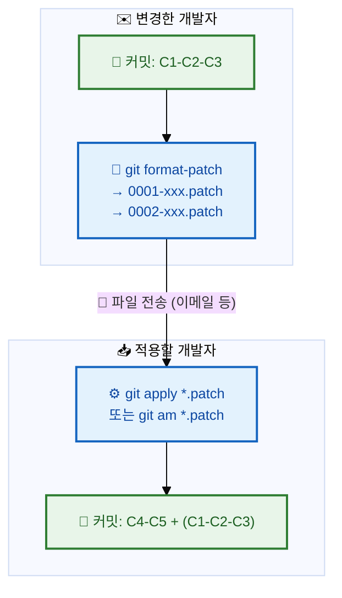
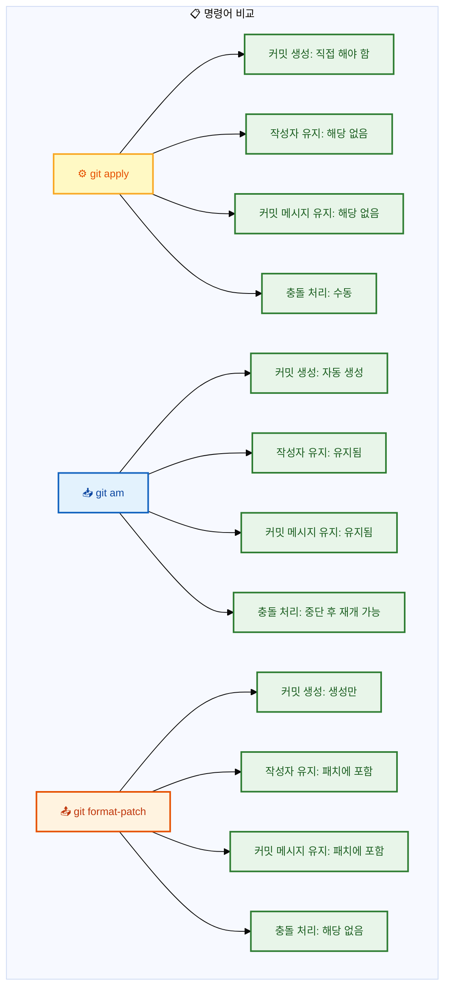

# Patch: 코드를 파일로 주고받기

## 👨‍💻 실전 프로젝트: 패치 파일로 코드 주고받기

이번 실전 프로젝트에서는 두 개발자가 원격 저장소 없이 패치 파일만을 이용하여 코드 변경 사항을 주고받는 과정을 체험해보겠습니다. 개발자 A가 새로운 기능을 구현하고 패치 파일로 내보낸 후, 이를 개발자 B가 검토하고 적용하는 전 과정을 단계별로 수행할 것입니다. 이 방식은 이메일 기반 협업이나 인터넷이 제한된 환경에서도 유용하게 사용할 수 있는 Git의 강력한 기능입니다.

```bash
# === 개발자 A: 기능 구현 및 패치 생성 ===
$ git init patch-demo
$ cd patch-demo
$ echo "# Patch Demo" > README.md
$ git add README.md && git commit -m "초기 설정"

# 새 기능 브랜치에서 작업
$ git switch -c feature/calculator
$ cat > calculator.py << 'EOF'
def add(a, b):
    return a + b

def subtract(a, b):
    return a - b
EOF
$ git add calculator.py && git commit -m "계산기 기본 연산 추가"

$ cat > main.py << 'EOF'
from calculator import add, subtract

print(add(10, 5))
print(subtract(10, 5))
EOF
$ git add main.py && git commit -m "메인 실행 파일 추가"

# main 브랜치 기준으로 패치 생성
$ git format-patch main..feature/calculator -o ~/patches/
~/patches/0001-계산기-기본-연산-추가.patch
~/patches/0002-메인-실행-파일-추가.patch

# === 개발자 B: 패치 검토 및 적용 ===
$ cd ~
$ git clone patch-demo my-local-copy
$ cd my-local-copy

# 패치 적용 전 검증 (dry-run)
$ git apply --check ~/patches/0001-*.patch
# (문제가 없으므로 아무 출력도 없음 — 패치가 안전하게 적용 가능함을 의미)

# 패치 내용 검토
$ git diff --stat ~/patches/0001-*.patch
 calculator.py | 10 ++++++++++
 1 file changed, 10 insertions(+)

# git am으로 패치 적용 + 자동 커밋
$ git am ~/patches/0001-*.patch
Applying: 계산기 기본 연산 추가
Applying: 메인 실행 파일 추가

# 적용 결과 확인
$ git log --oneline -3
a1b2c3d 메인 실행 파일 추가
b2c3d4e 계산기 기본 연산 추가
c3d4e5f 초기 설정

# === 선택: 패치 되돌리기 ===
# 잘못 적용했다면 --reverse 옵션으로 되돌리기 가능
# $ git apply --reverse ~/patches/0001-계산기-기본-연산-추가.patch
```

이 프로젝트를 통해 `git format-patch`로 패치를 생성하고, `git apply --check`로 사전 검증한 후, `git am`으로 자동 커밋까지 완료하는 전체 워크플로우를 경험하였습니다. 패치 파일은 단순한 diff 파일과 달리 커밋 메시지, 작성자 정보, 타임스탬프까지 포함하므로, 원격 저장소 없이도 온전한 Git 이력을 주고받을 수 있습니다. 이러한 방식은 Linux 커널 개발이나 대규모 오픈소스 프로젝트에서 여전히 사용되는 전통적인 협업 방법입니다.

---

## 학습 목표

- Patch 방식의 개념과 원격 저장소를 통한 협업 방식과의 차이점을 이해할 수 있습니다.
- `git format-patch` 명령어로 커밋을 Patch 파일로 생성할 수 있습니다.
- `git apply`와 `git am`의 차이점을 이해하고 상황에 맞게 사용할 수 있습니다.
- Patch 파일을 이용한 전체 워크플로우를 실제 시나리오를 통해 수행할 수 있습니다.

---

지금까지 우리는 원격 저장소(GitHub 등)를 통해 코드를 공유하는 방법을 배웠습니다. 하지만 원격 저장소 없이도 변경 사항을 공유할 수 있습니다. `git format-patch`로 변경 사항을 파일로 만들고, `git apply`나 `git am`으로 적용하는 방식입니다. 이메일로 패치 파일을 주고받던 시절의 전통적인 워크플로우이며, 일부 오픈소스 프로젝트(Linux 커널 등)에서 아직 사용합니다. 이러한 Patch 방식은 원격 저장소를 사용할 수 없는 환경에서도 협업이 가능하게 해주는 유용한 도구이므로, 우리는 이에 대해 자세히 알아보겠습니다. 비록 현대에는 GitHub와 같은 플랫폼이 주류를 이루지만, 패치 작업의 원리를 이해하면 Git의 내부 동작 방식과 버전 관리의 본질을 더 깊이 이해할 수 있습니다.

## Patch 작업 흐름

다음 Mermaid 다이어그램은 Patch를 생성하고 적용하는 전체 흐름을 시각적으로 보여줍니다. 개발자 A가 커밋을 패치 파일로 변환하고, 이 파일을 이메일이나 다른 전송 수단을 통해 개발자 B에게 전달하면, 개발자 B가 이를 자신의 저장소에 적용하는 구조입니다.



이 다이어그램에서 중요한 점은 패치 파일이 단순한 코드 변경 사항뿐만 아니라, 각 커밋의 메타데이터(작성자, 날짜, 커밋 메시지)까지 포함한다는 것입니다. 따라서 `git am`으로 패치를 적용하면 마치 원래 개발자가 직접 커밋한 것처럼 이력이 보존됩니다. 이는 단순히 파일을 복사해서 전달하는 것과 근본적으로 다른, Git의 분산 버전 관리 철학을 잘 보여주는 특징입니다.

## 1. `git format-patch` — 커밋을 Patch 파일로 만들기

특정 커밋들을 표준 이메일 형식의 패치 파일로 내보냅니다. 이 명령어는 각 커밋을 하나의 `.patch` 파일로 변환하며, 파일 이름에는 커밋 메시지가 포함되어 어떤 내용인지 쉽게 식별할 수 있습니다.

### 기본 사용법

```bash
git format-patch <기준커밋>..<마지막커밋>
```

이 명령어는 지정된 범위의 커밋들을 순서대로 패치 파일로 생성합니다. 기준 커밋 이후부터 마지막 커밋까지의 모든 커밋이 각각 하나의 패치 파일이 됩니다.

### 예시

```bash
# 최근 3개 커밋을 패치 파일로 생성
$ git format-patch HEAD~3
0001-로그인-폼-추가.patch
0002-유효성-검사-추가.patch
0003-스타일-적용.patch
```

### 다양한 옵션

`git format-patch`는 다양한 옵션을 지원하여 패치 생성 방식을 세밀하게 제어할 수 있습니다. 각 옵션은 특정 상황에 맞춰 패치를 생성할 필요가 있을 때 유용하게 사용됩니다.

```bash
# 특정 범위 지정
$ git format-patch main..feature/login
0001-로그인-폼-추가.patch
0002-유효성-검사-추가.patch

# 최근 n개 커밋
$ git format-patch -3

# 단일 커밋
$ git format-patch -1 a1b2c3d
0001-버그-수정.patch

# 출력 디렉토리 지정
$ git format-patch HEAD~3 -o ~/patches/

# 번호 없이 파일명만
$ git format-patch HEAD~3 --numbered-files
1.patch
2.patch
3.patch
```

`-o` 옵션은 패치 파일이 저장될 디렉토리를 지정할 때 사용하며, 파일이 여러 개일 때 특히 유용합니다. `--numbered-files` 옵션은 파일 이름을 숫자로만 생성하므로, 패치를 적용하는 스크립트에서 순서대로 처리하기 편리합니다. `-1` 옵션과 커밋 해시를 조합하면 특정 커밋 하나만 선택적으로 패치로 내보낼 수 있어, 선별적인 코드 공유가 가능합니다.

### 생성된 Patch 파일 예시

```patch
From a1b2c3d... Mon Jul 10 14:30:00 2026
From: 홍길동 <hong@example.com>
Date: Mon, 10 Jul 2026 14:30:00 +0900
Subject: [PATCH] 로그인 폼 추가

---
 login.html | 10 ++++++++++
 1 file changed, 10 insertions(+)

diff --git a/login.html b/login.html
new file mode 100644
index 0000000..e69de29
--- /dev/null
+++ b/login.html
@@ -0,0 +1,10 @@
+<h1>로그인</h1>
+<form>
+  <input type="email" placeholder="이메일">
+  <input type="password" placeholder="비밀번호">
+  <button>로그인</button>
+</form>
```

패치 파일의 헤더 부분에는 커밋 해시, 작성자, 날짜, 커밋 메시지가 포함되어 있습니다. `---`와 `+++`는 각각 원본 파일과 새로운 파일을 나타내며, `@@ -0,0 +1,10 @@`는 변경된 위치와 라인 수를 표현하는 청크 헤더입니다. `+`로 시작하는 줄은 새로 추가된 내용, `-`로 시작하는 줄은 삭제된 내용을 의미합니다. 이러한 구조는 표준 diff 형식을 따르므로, 대부분의 diff 도구에서 읽을 수 있습니다.

## 2. `git apply` — Patch 파일 적용하기 (직접 적용)

패치 파일의 변경 사항을 **현재 작업 디렉토리**에 적용합니다. 커밋은 생성되지 않으므로, 적용 후에 직접 `git add`와 `git commit`을 수행해야 합니다. 이 방식은 패치의 내용만 반영하고 싶고, 커밋 이력은 직접 관리하고 싶을 때 적합합니다.

### 기본 사용법

```bash
git apply <패치파일>
```

### 예시

```bash
# 단일 패치 적용
$ git apply 0001-로그인-폼-추가.patch

# 여러 패치 적용
$ git apply *.patch

# 적용 전 미리 확인 (dry-run)
$ git apply --check 0001-로그인-폼-추가.patch

# 적용 결과 확인
$ git status
Changes not staged for commit:
  modified:   login.html

# 변경 사항을 직접 커밋해야 함
$ git add .
$ git commit -m "패치 적용: 로그인 폼 추가"
```

`git apply`를 사용할 때 주의할 점은 패치가 깨끗하게 적용되지 않을 경우 작업 디렉토리가 불완전한 상태로 남을 수 있다는 것입니다. 따라서 적용 전에 `--check` 옵션으로 반드시 사전 검증을 수행하는 것이 좋습니다. 또한 `git apply`는 Git 저장소가 아닌 일반 디렉토리에서도 동작하므로, Git을 사용하지 않는 프로젝트에 변경 사항을 반영할 때도 활용할 수 있습니다.

### 주요 옵션

```bash
# 적용 전 검증만 (실제 적용 안 함)
$ git apply --check 0001.patch
# 문제 없으면 아무 출력 없음

# 적용할 파일만 지정
$ git apply --include='*.html' *.patch

# 제외할 파일 지정
$ git apply --exclude='*.js' *.patch

# 패치 반대로 적용 (되돌리기)
$ git apply --reverse 0001.patch
```

`--include`와 `--exclude` 옵션은 패치 파일에 여러 파일의 변경 사항이 포함되어 있을 때 특정 파일에만 선택적으로 적용할 수 있게 해줍니다. `--reverse` 옵션은 이미 적용된 패치를 취소(되돌리기)할 때 사용하며, `git revert`와 유사한 효과를 냅니다. 이러한 옵션들을 활용하면 패치 적용을 더욱 세밀하게 제어할 수 있습니다.

## 3. `git am` — Patch 파일 적용 + 커밋 (자동 커밋)

`git apply`와 달리 패치 파일의 **커밋 메시지와 작성자 정보를 유지**하면서 커밋까지 생성합니다. 이메일로 받은 패치를 그대로 적용할 때 사용하며, 패치를 보낸 원본 작성자의 정보가 고스란히 보존됩니다.

### 기본 사용법

```bash
git am <패치파일>
```

### 예시

```bash
# 단일 패치 적용 + 커밋
$ git am 0001-로그인-폼-추가.patch
Applying: 로그인 폼 추가

# 여러 패치 순서대로 적용
$ git am *.patch
Applying: 로그인 폼 추가
Applying: 유효성 검사 추가
Applying: 스타일 적용

# 적용 후 로그 확인
$ git log --oneline -3
a1b2c3d 스타일 적용
d4e5f6f 유효성 검사 추가
g7h8i9j 로그인 폼 추가
```

`git am`은 패치 파일을 적용하면서 패치 내부에 저장된 작성자 정보(이름, 이메일, 날짜)와 커밋 메시지를 그대로 사용하여 자동으로 커밋을 생성합니다. 따라서 패치를 받는 사람이 직접 커밋 메시지를 작성할 필요가 없으며, 원작자의 기여가 명확하게 기록됩니다. 여러 개의 패치 파일을 한 번에 지정하면 번호 순서대로 순차적으로 적용되므로, 의존성이 있는 패치들도 올바른 순서로 적용됩니다.

### Patch 적용 중 충돌 해결

패치를 적용하는 과정에서 현재 작업 중인 파일과 패치의 내용이 충돌하는 경우가 발생할 수 있습니다. 이때 `git am`은 자동으로 중단되고 사용자에게 충돌 해결을 요청합니다.

```bash
# 충돌 발생
$ git am 0002-유효성-검사-추가.patch
Applying: 유효성 검사 추가
error: patch failed: login.html:10
error: login.html: patch does not apply

# 충돌 해결 후
$ vi login.html   # 충돌 수동 해결
$ git add login.html
$ git am --continue   # 계속 진행

# 또는
$ git am --skip       # 이 패치 건너뛰기
$ git am --abort      # am 작업 전체 취소
```

충돌이 발생하면 Git은 충돌된 파일에 충돌 마커(`<<<<<<<`, `=======`, `>>>>>>>`)를 삽입하여 어떤 부분이 충돌했는지 표시해줍니다. 사용자는 이 마커를 보고 수동으로 충돌을 해결한 후 `git add`로 해결 사실을 기록하고 `git am --continue`로 패치 적용을 재개합니다. 만약 해당 패치가 중요하지 않다면 `--skip`으로 건너뛸 수 있고, 전체 am 작업 자체를 취소하려면 `--abort`를 사용하여 패치 적용 이전 상태로 되돌아갈 수 있습니다.

## 실전 시나리오: Patch로 변경 사항 공유하기

지금까지 배운 내용을 종합하여 두 개발자가 Patch를 주고받는 전체 과정을 실전 시나리오로 살펴보겠습니다. 이 시나리오는 원격 저장소를 사용할 수 없는 상황에서도 Git을 활용한 협업이 가능함을 보여줍니다.

```bash
# === 개발자 A: 패치 생성 ===
$ git switch -c feature/new-feature
$ echo "new feature" > feature.txt
$ git add . && git commit -m "새 기능 추가"
$ echo "bug fix" > fix.txt
$ git add . && git commit -m "버그 수정"

# 패치 파일 생성
$ git format-patch main..feature/new-feature -o ~/patches/
~/patches/0001-새-기능-추가.patch
~/patches/0002-버그-수정.patch

# ~/patches/ 디렉토리를 압축해서 이메일로 전송 📧


# === 개발자 B: 패치 적용 ===
$ git switch main
$ git pull origin main   # 최신 상태 유지

# 패치 적용 전 검증
$ git apply --check ~/patches/00*.patch
# (문제 없으면 출력 없음)

# 패치 적용 + 커밋 (git am 사용)
$ git am ~/patches/00*.patch
Applying: 새 기능 추가
Applying: 버그 수정

# 완료!
$ git log --oneline -3
a1b2c3d 버그 수정
d4e5f6f 새 기능 추가
e7f8g9h (HEAD -> main) 이전 커밋
```

이 시나리오에서 주목할 점은 개발자 B가 `git apply --check`로 사전 검증을 수행했다는 것입니다. 검증을 통해 패치에 문제가 없음을 확인한 후 `git am`을 실행하였고, 그 결과 원작자의 커밋 메시지와 작성자 정보가 고스란히 보존된 채로 커밋이 생성되었습니다. 만약 검증 단계에서 문제가 발견되었다면, 개발자 B는 패치를 적용하지 않고 개발자 A에게 수정을 요청할 수 있었을 것입니다.

## apply vs am vs format-patch 관계

이 세 명령어의 관계는 push와 pull의 관계와 유사하게 이해할 수 있습니다. format-patch로 패치를 생성하는 것은 push로 코드를 업로드하는 것에 대응되고, am으로 패치를 적용하는 것은 pull로 코드를 다운로드하여 병합하는 것에 대응됩니다.

```bash
# format-patch + am = push + pull 과 유사

# 원격 저장소 있는 경우:
$ git push origin feature   # 업로드
$ git pull origin feature   # 다운로드 + 병합

# Patch 사용하는 경우:
$ git format-patch main..feature  # 패치 생성 (업로드 대체)
$ git am *.patch                   # 패치 적용 (다운로드 + 커밋 대체)
```

물론 push/pull이 더 편리하고 현대적인 방식이지만, Patch 방식은 인터넷 연결이 불안정하거나 원격 저장소를 사용할 수 없는 폐쇄망 환경에서도 Git 기반 협업을 가능하게 합니다. 또한 패치 파일은 이메일 본문에 포함시킬 수 있어, 코드 리뷰를 이메일 스레드에서 진행하는 전통적인 워크플로우에도 적합합니다.

## format-patch + apply 활용: 백업 및 검토

패치 파일은 협업뿐만 아니라 개인적인 백업 용도로도 유용하게 사용할 수 있습니다. 로컬 커밋을 패치 파일로 백업해두면, 실수로 커밋을 삭제하더라도 안전하게 복구할 수 있습니다.

```bash
# 1. 로컬 커밋을 패치로 백업
$ git format-patch -5 -o ~/backup/

# 2. 실수로 커밋 삭제
$ git reset --hard HEAD~5

# 3. 백업한 패치로 복구
$ git am ~/backup/*.patch
```

이 백업 방법은 `git reflog`를 사용하는 것보다 더 영구적인 보관 방식입니다. `git reflog`는 일정 시간이 지나면 오래된 참조가 사라질 수 있지만, 패치 파일은 그렇지 않기 때문입니다. 중요한 커밋이나 실험적인 기능을 안전하게 보관해야 할 때 이 방식을 사용하면 좋습니다. 또한 패치 파일은 텍스트 파일이므로 버전 관리 시스템에 함께 커밋하여 변경 이력을 추적하는 용도로도 활용할 수 있습니다.

## 옵션 한눈에 비교

다음 Mermaid 다이어그램은 세 명령어의 주요 특징을 한눈에 비교할 수 있도록 정리한 것입니다. 커밋 생성 여부, 작성자 정보 유지 여부, 충돌 처리 방식 등 각 명령어의 핵심 차이점을 시각적으로 확인할 수 있습니다.



이 다이어그램에서 볼 수 있듯이, `git apply`는 단순히 변경 사항만 적용하는 저수준 명령어인 반면, `git am`은 패치 파일에 포함된 모든 메타데이터를 활용하여 완전한 Git 커밋을 생성하는 고수준 명령어입니다. `git format-patch`는 이 두 명령어의 입력 데이터를 생성하는 역할을 합니다. 이 세 명령어를 조합하면 원격 저장소 없이도 완전한 Git 기반 협업이 가능합니다.

## 한눈에 정리

| 명령어 | 역할 | 커밋 생성 | 작성자 정보 | 사용 상황 |
|--------|------|-----------|------------|----------|
| `git format-patch` | 커밋을 Patch 파일로 내보내기 | 생성만 함 | 패치에 포함 | 변경 사항을 파일로 공유할 때 |
| `git apply` | Patch 파일을 작업 디렉토리에 적용 | 직접 해야 함 | 해당 없음 | 변경 사항만 적용하고 직접 커밋할 때 |
| `git am` | Patch 파일을 적용하고 자동 커밋 | 자동 생성 | 유지됨 | 이메일로 받은 패치를 원본 그대로 적용할 때 |
| `git apply --check` | Patch 적용 전 검증 (dry-run) | 적용 안 함 | 해당 없음 | 충돌 여부를 미리 확인할 때 |
| `git apply --reverse` | Patch를 반대로 적용 (되돌리기) | 적용 안 함 | 해당 없음 | 적용한 패치를 취소할 때 |

이 표는 각 명령어의 역할과 특징을 빠르게 참고할 수 있도록 정리한 것입니다. 실제 개발 현장에서는 대부분의 협업이 GitHub와 같은 원격 저장소를 통해 이루어지지만, 패치 파일을 사용하는 방식은 여전히 특수한 상황에서 유용하게 사용됩니다. 특히 `git apply --check`는 패치를 적용하기 전에 반드시 실행하는 습관을 들이는 것이 좋으며, 패치 기반 워크플로우에서는 `git apply`보다 `git am`이 더 완전하고 신뢰할 수 있는 방법임을 기억해야 합니다.

## 연습 문제

1. `git apply`와 `git am`의 가장 큰 차이점은 무엇입니까?
   ① `git apply`는 파일에만 적용되고 `git am`은 디렉토리에 적용된다.
   ② `git apply`는 변경 사항만 적용하고 `git am`은 커밋 메시지와 작성자 정보를 유지하며 자동 커밋까지 수행한다.
   ③ `git am`은 원격 저장소가 필요하다.
   ④ `git apply`는 Patch 파일을 생성할 수 있다.

2. 개발자 A가 만든 Patch 파일을 개발자 B가 적용하려고 합니다. 적용 전에 충돌 여부를 미리 확인하려면 어떤 명령어를 사용해야 하는지 작성해보세요.

3. `git format-patch`와 `git am`의 조합이 `git push`와 `git pull`의 조합과 어떤 점에서 유사한지 설명해보세요.

---

📌 정답 및 해설

**문제 1 정답 및 해설:**

정답은 **② `git apply`는 변경 사항만 적용하고 `git am`은 커밋 메시지와 작성자 정보를 유지하며 자동 커밋까지 수행한다**입니다. `git apply`는 Patch 파일의 변경 사항을 작업 디렉토리에 적용하기만 할 뿐, 자동으로 커밋을 생성하지 않습니다. 따라서 적용 후 개발자가 직접 `git add`와 `git commit`을 수행해야 합니다. 반면 `git am`은 Patch 파일에 포함된 커밋 메시지, 작성자 정보, 타임스탬프를 유지한 채로 자동 커밋까지 한 번에 수행합니다. `git am`은 이메일로 전송된 Patch를 적용하는 워크플로우에서 유래했으며, 특히 오픈소스 메일링 리스트 기반의 개발 방식에서 널리 사용됩니다. `git apply`는 수동 검토가 필요할 때, `git am`은 자동화된 Patch 적용에 적합합니다.

**문제 2 정답 및 해설:**

Patch 파일을 적용하기 전에 충돌 여부를 미리 확인하려면 `git apply --check <patch-file>` 명령어를 사용합니다. 이 명령어는 Patch를 실제로 적용하지 않고 시뮬레이션만 수행하여, 적용 시 충돌이 발생할지 여부를 알려줍니다. 만약 충돌이 예상되면 아무 출력 없이 종료 코드 0으로 성공을 나타내고, 충돌이 예상되면 구체적인 충돌 위치와 함께 오류 메시지를 출력하고 종료 코드 1로 실패를 반환합니다. `git apply --check`는 Patch를 적용하기 전에 안전성을 사전 검증하는 데 매우 유용한 명령어로, `git apply` 실행 전에 항상 먼저 실행하는 것이 좋은 습관입니다.

**문제 3 정답 및 해설:**

`git format-patch`와 `git am`의 조합은 `git push`와 `git pull`의 조합과 유사하게, 한 저장소의 커밋을 다른 저장소로 전송하는 역할을 합니다. `git push`가 원격 저장소에 직접 커밋을 전송한다면, `git format-patch`는 커밋을 Patch 파일 형태로 추출하여 이메일이나 파일로 전달할 수 있게 합니다. `git pull`이 원격 저장소의 커밋을 직접 가져와 병합한다면, `git am`은 Patch 파일을 읽어서 동일한 커밋을 재현합니다. 차이점은 `git push`/`git pull`이 네트워크를 통해 직접 통신하는 반면, `git format-patch`/`git am`은 파일 또는 이메일을 매개체로 사용합니다. 따라서 네트워크 접근이 제한된 환경이나, 메일링 리스트 기반의 오픈소스 프로젝트에서 `git format-patch`/`git am`이 유용하게 사용됩니다.
