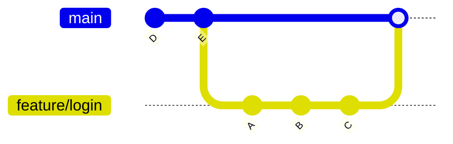
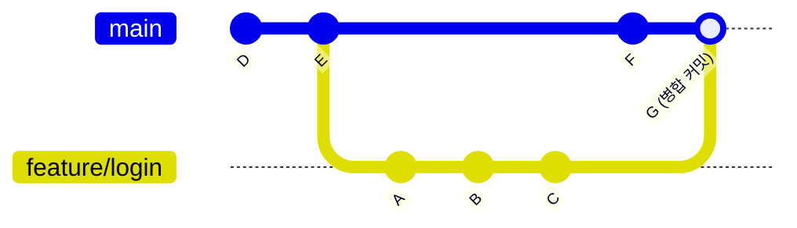
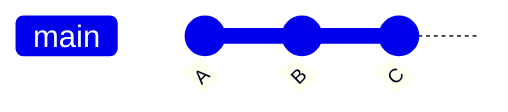
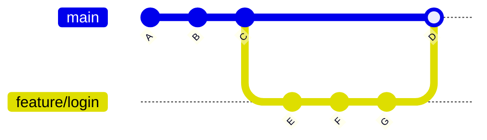

# 브랜치 병합

## 학습 목표

- `git merge` 명령어를 사용하여 두 브랜치를 병합하는 방법을 이해합니다.
- Fast-Forward 병합과 3-Way 병합의 차이점을 설명할 수 있습니다.
- 병합 충돌이 발생했을 때 `git merge --abort`로 취소하는 방법을 숙지합니다.
- `--no-ff`와 `--squash` 등 고급 병합 옵션의 용도를 이해합니다.

여러 브랜치에서 독립적으로 작업한 내용을 하나로 합치는 것을 병합(Merge)이라고 합니다. Git에서 가장 흔한 병합 시나리오는 `feature` 브랜치의 작업이 완료되었을 때 이를 `main` 브랜치에 통합하는 것입니다. 병합은 협업의 핵심 과정으로, 여러 개발자가 동시에 작업한 내용을 안전하게 통합할 수 있게 해줍니다. 이번 장에서는 다양한 병합 방식과 고급 옵션을 학습하여, 우리 실무에서 발생하는 다양한 상황에 대처할 수 있는 능력을 길러보겠습니다.

## 기본 병합: `git merge`

병합의 기본 명령어는 `git merge <합칠_브랜치명>`입니다. 항상 **병합되는 대상 브랜치(통합받을 브랜치)** 로 전환한 상태에서 명령어를 실행해야 합니다.

### 예시: feature/login 브랜치를 main 브랜치에 병합

```bash
# 1. main 브랜치로 전환
git switch main

# 2. feature/login 브랜치를 현재 브랜치(main)에 병합
git merge feature/login
```

**출력 예시 (Fast-forward 병합):**
```
Updating a1b2c3d..e4f5g6h
Fast-forward
 login.html | 15 +++++++++++++++
 1 file changed, 15 insertions(+)
```

**출력 예시 (3-way 병합):**
```
Merge made by the 'ort' strategy.
 login.html | 10 ++++++++++
 1 file changed, 10 insertions(+)
```

**전체 병합 과정 실제 예시:**
```bash
# 현재 상태 확인
$ git log --oneline --graph --all
* d4e5f6f (feature/login) 로그인 버튼 추가     ← feature/login이 앞서 있음
* a1b2c3d 로그인 폼 추가
* g7h8i9j (HEAD -> main) README 업데이트

# main에 feature/login 병합
$ git merge feature/login
Updating g7h8i9j..d4e5f6f
Fast-forward
 login.html | 30 ++++++++++++++++++++++++++++++
 1 file changed, 30 insertions(+)

# 병합 후 (main이 feature/login과 같은 위치로 이동)
$ git log --oneline --graph --all
* d4e5f6f (HEAD -> main, feature/login) 로그인 버튼 추가
* a1b2c3d 로그인 폼 추가
* g7h8i9j README 업데이트
```

지금까지 기본적인 병합 명령어의 사용법을 알아보았습니다. 이제 Git이 상황에 따라 어떤 방식으로 병합을 수행하는지 자세히 살펴보겠습니다.

## 병합의 종류

Git은 상황에 따라 두 가지 방식으로 병합을 수행합니다.

### 1. Fast-Forward 병합

현재 브랜치(main)가 병합할 브랜치(feature/login)의 직전 커밋에서 갈라져 나온 경우 발생합니다. 즉, main 브랜치가 feature/login 브랜치가 만들어진 이후에 한 번도 변경되지 않은 경우입니다.

이 경우 Git은 단순히 브랜치 포인터를 최신 커밋으로 앞으로 이동(fast-forward)시키기만 하면 되므로, 별도의 병합 커밋이 생성되지 않습니다.



### 2. 3-Way 병합 (Merge Commit)

두 브랜치가 각각 독립적으로 커밋된 경우 발생합니다. 즉, 갈라져 나온 이후에 main 브랜치에도 새로운 커밋이 있는 경우입니다.

Git은 두 브랜치의 공통 조상(Common Ancestor)을 기준으로 각 브랜치의 변경 사항을 비교하여 새로운 병합 커밋(Merge Commit)을 만듭니다.



**3-way 병합 실제 예시:**
```bash
# 상태 확인
$ git log --oneline --graph --all
* c3d4e5f (feature/login) 로그인 기능 완성     ← feature/login: C
* b2c3d4e 로그인 API 연동                      ← feature/login: B
| * f4e5d6c (HEAD -> main) 푸터 디자인 수정     ← main: F
|/
* a1b2c3d 첫 번째 커밋                         ← 공통 조상: E

# main에서 feature/login 병합 (3-way merge)
$ git merge feature/login
Merge made by the 'ort' strategy.
 login.html | 25 +++++++++++++++++++++++++
 1 file changed, 25 insertions(+)

# 병합 후
$ git log --oneline --graph --all
*   g5f4e3d (HEAD -> main) Merge branch 'feature/login'   ← 병합 커밋 G
|\
| * c3d4e5f (feature/login) 로그인 기능 완성
| * b2c3d4e 로그인 API 연동
* | f4e5d6c 푸터 디자인 수정
|/
* a1b2c3d 첫 번째 커밋
```

지금까지 Fast-Forward 병합과 3-Way 병합의 차이점을 학습하였습니다. 다음으로 병합 도중 문제가 발생했을 때 취소하는 방법에 대해 알아보겠습니다.

## 병합 취소하기

병합을 실행했지만 문제가 발생했다면, `git merge --abort` 명령어로 병합을 취소하고 병합 전 상태로 되돌아갈 수 있습니다.

```bash
git merge --abort
```

이는 병합 충돌이 발생했을 때 충돌 해결을 포기하고 원래 상태로 돌아가고 싶을 때 유용합니다.

지금까지 기본 병합과 취소 방법을 살펴보았습니다. 이제 실무에서 유용하게 활용할 수 있는 추가 병합 옵션들을 알아보겠습니다.

## 추가 병합 옵션

### --no-ff: 강제로 3-way 병합 커밋 만들기
```bash
$ git merge --no-ff feature/login
```
Fast-forward가 가능해도 항상 병합 커밋을 만듭니다. 기능 브랜치의 이력을 명확히 남기고 싶을 때 사용합니다.





### --squash: 여러 커밋을 하나로 압축해서 병합
```bash
$ git merge --squash feature/login
$ git commit -m "로그인 기능 추가"
```
feature 브랜치의 여러 커밋을 하나로 합쳐서 main에 추가합니다.

### --abort: 충돌시 병합 취소 (위에서 설명)

```bash
$ git merge --abort
```

## 한눈에 정리

| 개념 | 설명 | 주요 명령어 |
|------|------|-----------|
| 기본 병합 | 대상 브랜치로 전환한 후 병합할 브랜치를 통합합니다. | `git switch main` → `git merge <브랜치명>` |
| Fast-Forward 병합 | 현재 브랜치에 새로운 커밋이 없는 경우, 단순히 포인터를 앞으로 이동시킵니다. 별도의 병합 커밋이 생성되지 않습니다. | 자동 수행 |
| 3-Way 병합 | 두 브랜치에 각각 새로운 커밋이 있는 경우, 공통 조상을 기준으로 병합 커밋을 생성합니다. | 자동 수행 |
| 병합 취소 | 병합 도중 문제가 발생하면 병합을 취소하고 이전 상태로 되돌아갑니다. | `git merge --abort` |
| `--no-ff` | Fast-forward가 가능해도 강제로 병합 커밋을 생성하여 브랜치 이력을 명확히 남깁니다. | `git merge --no-ff <브랜치명>` |
| `--squash` | 기능 브랜치의 여러 커밋을 하나로 압축하여 병합합니다. | `git merge --squash <브랜치명>` |

## 연습 문제

1. Fast-Forward 병합과 3-Way 병합의 차이점을 설명하고, 각각 어떤 상황에서 발생하는지 서술해보세요.

2. 다음 중 Fast-Forward 병합이 가능한 경우는 언제인가요?
   - (a) 두 브랜치가 각각 독립적으로 커밋된 경우
   - (b) 현재 브랜치가 병합할 브랜치가 만들어진 이후에 한 번도 변경되지 않은 경우
   - (c) 병합 충돌이 발생한 경우

3. `git merge --no-ff feature/login` 명령어는 어떤 상황에서 사용하며, 일반 병합과 어떤 차이가 있는지 설명해보세요.
