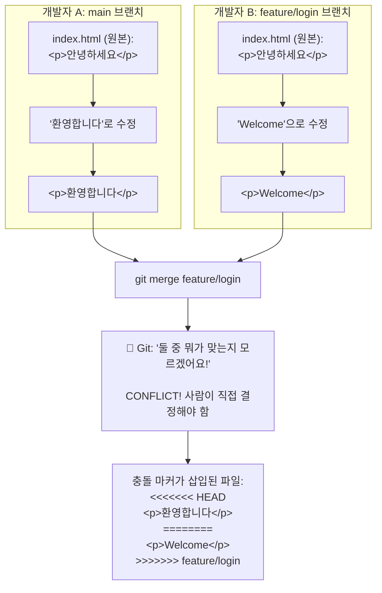

# 병합 충돌 해결

## 학습 목표

- 병합 충돌이 발생하는 원인을 이해하고, 이를 두려워하지 않고 대처할 수 있습니다.
- 충돌이 발생한 파일을 확인하고, 충돌 내용을 정확히 분석할 수 있습니다.
- 충돌 마커를 활용하여 다양한 상황에 맞게 충돌을 해결할 수 있습니다.
- 충돌 해결 완료 후 병합 커밋을 생성하는 전체 과정을 수행할 수 있습니다.

---

브랜치를 병합할 때 두 브랜치에서 동일한 파일의 같은 부분을 각각 다르게 수정한 경우, Git은 어느 쪽을 선택해야 할지 결정할 수 없어 **충돌(Conflict)**이 발생합니다. 이는 자연스러운 현상이며, Git은 충돌을 해결할 수 있는 도구를 제공합니다. 병합 충돌은 처음에는 당황스러울 수 있지만, 협업 과정에서 반드시 마주하게 되는 중요한 개념이므로 우리는 이를 올바르게 이해하고 효과적으로 해결하는 방법을 알아보겠습니다.

## 충돌이 발생했을 때

`git merge` 명령어 실행 후 충돌이 발생하면 다음과 같은 메시지를 보게 됩니다. 자주 접하게 될 메시지이므로 미리 익숙해지는 것이 중요합니다.

**충돌 상황 시각화:**



```
Auto-merging index.html
CONFLICT (content): Merge conflict in index.html
Automatic merge failed; fix conflicts and then commit the result.
```

## 충돌이 발생한 파일 확인

충돌 메시지를 확인한 후에는 어떤 파일에서 충돌이 발생했는지부터 파악해야 합니다. 다음 명령어를 사용합니다.

```bash
git status
```

**출력 예시:**
```
On branch main
You have unmerged paths.
  (fix conflicts and run "git commit")
  (use "git merge --abort" to abort the merge)

Unmerged paths:
  both modified:   index.html
```

## 충돌 내용 확인하기

충돌이 발생한 파일을 열어보면 Git이 충돌 부분을 다음과 같이 표시해 줍니다. 이 표시를 **충돌 마커(Conflict Marker)**라고 합니다.

```html
<<<<<<< HEAD
<p>현재 브랜치(main)의 내용입니다.</p>
=======
<p>병합하려는 브랜치(feature/login)의 내용입니다.</p>
>>>>>>> feature/login
```

*   `<<<<<<< HEAD`와 `=======` 사이: 현재 브랜치(main)의 내용
*   `=======`와 `>>>>>>> feature/login` 사이: 병합하려는 브랜치(feature/login)의 내용

이제 충돌 마커의 의미를 이해하였으므로, 구체적인 충돌 상황별 해결 방법을 살펴보겠습니다.

**다양한 충돌 상황 예시:**

**상황 1: 한 쪽만 선택하기**
```html
<!-- 충돌 발생 -->
<<<<<<< HEAD
<p>회원가입 페이지</p>
=======
<p>로그인 페이지</p>
>>>>>>> feature/login

<!-- 해결: 로그인 페이지로 결정 -->
<p>로그인 페이지</p>
```

**상황 2: 두 내용을 모두 합치기**
```javascript
// 충돌 발생
<<<<<<< HEAD
const color = 'blue';
=======
const color = 'red';
>>>>>>> feature/theme

// 해결: 변수명을 바꿔서 모두 유지
const primaryColor = 'blue';
const secondaryColor = 'red';
```

**상황 3: 완전히 새로운 내용으로 대체**
```python
# 충돌 발생
<<<<<<< HEAD
def calculate(x):
    return x * 2
=======
def calculate(value):
    return value * 3
>>>>>>> feature/new-math

# 해결: 완전히 새로운 구현
def calculate(price, tax_rate):
    return price * (1 + tax_rate)
```

## 충돌 해결 과정

충돌을 해결하는 방법은 간단합니다. 다음 단계를 차례대로 따라가면 됩니다.

1.  **충돌이 발생한 파일을 엽니다.**
2.  `<<<<<<<`, `=======`, `>>>>>>>` 마커를 포함한 충돌 부분을 찾습니다.
3.  **어느 내용을 유지할지 결정합니다.**
    *   현재 브랜치의 내용만 유지하려면 병합 브랜치 부분을 삭제하고 마커도 제거합니다.
    *   병합 브랜치의 내용만 유지하려면 현재 브랜치 부분을 삭제하고 마커도 제거합니다.
    *   **두 내용을 모두 유지하거나, 새로운 내용으로 대체할 수도 있습니다.**
4.  **마커를 포함한 불필요한 줄을 모두 제거합니다.**
5.  **파일을 저장합니다.**

### 충돌 해결 예시

위 충돌 상황에서 두 내용을 모두 유지하기로 결정했다면, 파일을 다음과 같이 수정합니다.

```html
<p>현재 브랜치(main)의 내용입니다.</p>
<p>병합하려는 브랜치(feature/login)의 내용입니다.</p>
```

## 충돌 해결 완료하기

모든 충돌을 해결한 후에는 Git에 해결이 완료되었음을 알려야 합니다.

```bash
# 충돌 해결된 파일을 스테이징
git add index.html

# 병합 커밋 생성
git commit
```

`git commit`을 실행하면 자동으로 병합 커밋 메시지가 준비되어 있습니다. 저장하고 종료하면 병합이 완료됩니다.

**병합 커밋 메시지 예시:**
```
Merge branch 'feature/login'

# Conflicts:
#	index.html
#
# It looks like you may be a commit message.  The lines starting
# with '#' will be ignored, and an empty message aborts the commit.
```
기본 메시지를 그대로 사용해도 되고, 추가 설명을 덧붙여도 됩니다.

## 충돌 해결 전체 과정 종합 예시

지금까지 배운 내용을 바탕으로, 충돌 해결의 전체 과정을 하나의 예시로 종합하여 살펴보겠습니다.

```bash
# 1. 병합 시도 (충돌 발생!)
$ git merge feature/payment
Auto-merging price.js
CONFLICT (content): Merge conflict in price.js
Automatic merge failed; fix conflicts and then commit the result.

# 2. 충돌 파일 확인
$ git status
both modified:   price.js

# 3. 충돌 내용 확인
$ cat price.js
<<<<<<< HEAD
const taxRate = 0.1;    // 현재 main 브랜치
=======
const taxRate = 0.15;   // feature/payment 브랜치
>>>>>>> feature/payment

# 4. price.js를 열어서 수동으로 해결
# const taxRate = 0.12; ← 12%로 타협

# 5. 해결 완료 표시
$ git add price.js

# 6. 병합 확정
$ git commit -m "세율 충돌 해결: 12%로 통일"
[main d4e5f6f] Merge branch 'feature/payment'

# 7. 병합 완료 확인
$ git log --oneline --graph -3
*   d4e5f6f Merge branch 'feature/payment'
|\
| * b2c3d4e 결제 API 연동
* | c3d4e5f 메인 페이지 수정
|/
* a1b2c3d 첫 번째 커밋
```

## 충돌 해결 팁

*   **병합 도구 사용:** `git mergetool` 명령어를 사용하면 VSCode, Beyond Compare 등 외부 병합 도구를 활용할 수 있습니다.
*   **작은 단위로 커밋하고 자주 병합하기:** 충돌의 범위를 최소화하고 해결을 쉽게 만듭니다.
*   **팀원과 소통하기:** 충돌이 발생한 부분에 대해 어떤 변경이 의도된 것인지 팀원과 논의하는 것이 가장 확실한 해결 방법입니다.
*   **두려워하지 않기:** 충돌은 자연스러운 현상입니다. `git merge --abort`로 언제든지 병합 전 상태로 돌아갈 수 있으니 부담 없이 연습해 보세요.

## 한눈에 정리

| 개념 | 설명 |
|------|------|
| 충돌(Conflict) | 두 브랜치에서 동일한 파일의 같은 부분을 다르게 수정하여 Git이 자동 병합하지 못하는 상황 |
| 충돌 마커 | `<<<<<<<`, `=======`, `>>>>>>>` 기호로 충돌 범위와 각 브랜치의 내용을 표시 |
| HEAD 쪽 | `<<<<<<< HEAD`와 `=======` 사이 — 현재 체크아웃된 브랜치의 내용 |
| 병합 브랜치 쪽 | `=======`와 `>>>>>>> 브랜치명` 사이 — 병합하려는 브랜치의 내용 |
| 충돌 해결 방법 | 한쪽 선택, 두 내용 병합, 완전히 새로운 내용으로 대체 중에서 결정 |
| 해결 완료 명령어 | `git add <파일>` → `git commit` 또는 `git merge --continue` |
| 복구 명령어 | `git merge --abort` — 병합 전 상태로 되돌리기 |

## 연습 문제

1. 다음 중 병합 충돌이 발생하는 원인으로 올바른 것은 무엇입니까?
   ① 두 브랜치에서 서로 다른 파일을 수정한 경우
   ② 두 브랜치에서 동일한 파일의 같은 부분을 각각 다르게 수정한 경우
   ③ 한 브랜치에서만 파일을 수정하고 다른 브랜치에서는 수정하지 않은 경우
   ④ 두 브랜치의 커밋 기록이 완전히 동일한 경우

2. 충돌이 발생한 파일에서 `<<<<<<< HEAD`와 `=======` 사이에 위치한 내용은 어느 브랜치의 내용입니까?

3. 충돌 해결을 완료한 후 `git add`와 `git commit`을 수행해야 하는 이유를 설명해보세요.
