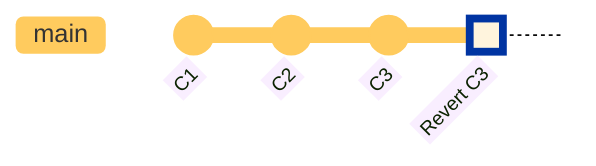
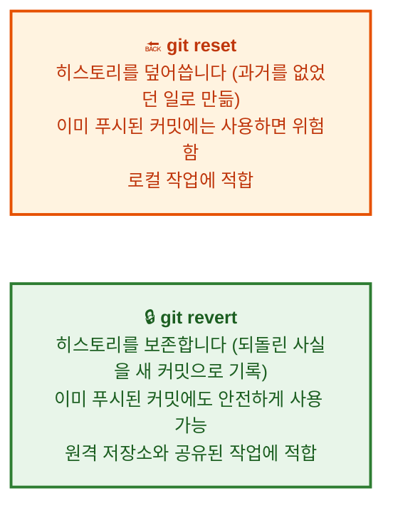
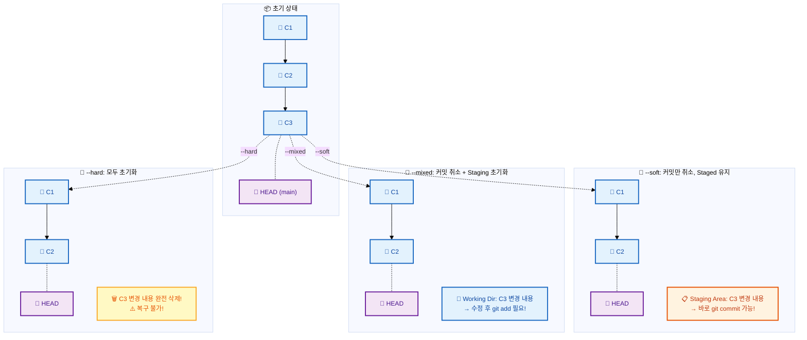
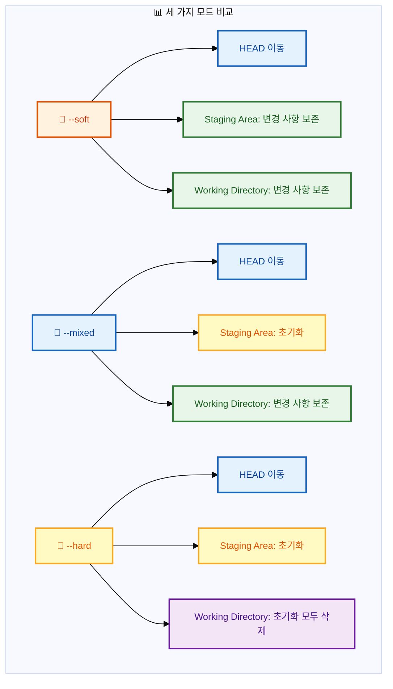
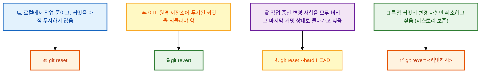

# Reset과 Revert

---

## 👨‍💻 실전 프로젝트: 실수 되돌리기 마스터하기

개발을 하다 보면 누구나 실수를 하게 됩니다. 방금 커밋한 코드에 버그가 섞여 들어갔거나, 잘못된 파일을 커밋에 포함시켜 버리는 경우가 대표적입니다. 이러한 상황에서 당황하지 않고 침착하게 대처하는 능력은 프로페셔널 개발자에게 필수적인 역량입니다. 이번 실전 프로젝트에서는 다양한 실수 시나리오를 직접 만들어 보고, `git reset`과 `git revert`를 활용하여 문제를 해결하는 전 과정을 체험해보겠습니다. 각 단계별로 발생하는 상황을 명확히 인지하고, 그에 맞는 최적의 명령어를 선택하는 판단력을 키우는 것이 이 프로젝트의 핵심 목표입니다.

### 시나리오 1: 방금 만든 커밋이 잘못되었다면? (`git reset --soft`)

```bash
# 1. 프로젝트 초기화
$ mkdir reset-practice && cd reset-practice
$ git init
$ echo "초기 코드" > app.js
$ git add . && git commit -m "초기 커밋"

# 2. 실수로 잘못된 코드를 커밋함
$ echo "console.log('버그가 있는 코드');" >> app.js
$ echo "잘못 추가된 파일" > debug.log
$ git add . && git commit -m "버그 추가 및 불필요한 파일 포함"

# 3. --soft reset으로 커밋만 취소 (Staged 상태 유지)
$ git reset --soft HEAD~1
$ git status
# → Staged 상태로 모든 변경 사항이 유지됨
# → debug.log는 제외하고 app.js만 다시 커밋 가능

# 4. 올바른 파일만 선택하여 다시 커밋
$ git restore --staged debug.log
$ git commit -m "app.js에 기능 추가 (debug.log 제외)"
```

`git reset --soft`는 HEAD만 이전 커밋으로 이동시키며, Staging Area와 Working Directory의 변경 사항은 그대로 보존합니다. 이로 인해 "커밋 메시지를 잘못 작성했거나 불필요한 파일이 포함된 경우"에 이상적인 도구가 됩니다. 위 시나리오에서는 `debug.log`처럼 커밋에 포함되지 말아야 할 파일이 섞여 들어간 상황에서 이를 제거하고, 올바른 내용만 다시 커밋할 수 있었습니다.

### 시나리오 2: 커밋을 취소하고 수정을 계속하고 싶다면? (`git reset --mixed`)

```bash
# 1. 기능 개발 중 실수로 커밋
$ echo "미완성된 기능 코드" >> app.js
$ git add . && git commit -m "아직 완성되지 않은 기능"

# 2. --mixed reset (기본값)으로 Staging 초기화
$ git reset HEAD~1
$ git status
# → 변경 사항은 Working Directory에 Unstaged 상태로 유지됨
# → 수정 후 다시 git add && git commit 가능

# 3. 코드를 더 수정하고 다시 커밋
$ echo "완성된 기능 코드" >> app.js
$ git add . && git commit -m "완성된 기능"
```

`git reset --mixed`는 기본 모드이며, HEAD를 이동시키는 것과 동시에 Staging Area를 초기화합니다. 그러나 Working Directory의 변경 사항은 그대로 유지되므로, 코드 자체는 보존하면서 커밈트만 취소하는 효과를 얻을 수 있습니다. 이는 "커밋을 했지만 아직 코드가 완성되지 않아서 다시 수정하고 싶은 경우"에 가장 적합한 선택입니다. 변경 사항이 사라지지 않으므로 안심하고 작업을 이어갈 수 있습니다.

### 시나리오 3: 커밋 자체가 완전히 잘못되었다면? (`git reset --hard`)

```bash
# 1. 실수로 잘못된 커밋 생성
$ echo "완전히 잘못된 접근 방식의 코드" > app.js
$ git add . && git commit -m "잘못된 구현"

# 2. --hard reset으로 모든 변경 사항 삭제
$ git reset --hard HEAD~1
$ git status
# → Working tree clean, app.js가 C1 시점의 깨끗한 상태로 복원됨
$ cat app.js
# → "초기 코드"만 남아 있음
```

`git reset --hard`는 HEAD 이동, Staging Area 초기화, Working Directory 초기화를 한 번에 수행합니다. 이 모드는 "커밋 자체가 완전히 잘못되어서 그 존재 자체를 없던 일로 만들고 싶은 경우"에 사용합니다. 하지만 한 번 삭제된 변경 사항은 기본적으로 복구가 불가능하므로, 신중하게 결정해야 합니다. 만약 실수로 `--hard`를 실행했다면, `ORIG_HEAD`를 통해 복구할 수 있다는 점을 기억해두시기 바랍니다.

### 시나리오 4: 이미 푸시된 커밋을 되돌려야 한다면? (`git revert`)

```bash
# 1. 실수로 버그를 포함한 코드를 커밋하고 원격에 푸시
$ echo "버그 있는 코드" > bug.js
$ git add . && git commit -m "버그 추가"
$ git push origin main

# 2. 동료가 이미 pull 받아서 작업 중 → reset은 위험!

# 3. 안전하게 revert 사용
$ git revert HEAD --no-edit
$ git push origin main
# → 동료가 pull해도 히스토리 충돌 없음
```

`git revert`는 기존 커밋을 취소하는 새로운 커밋을 생성하므로, 공유된 히스토리를 안전하게 관리할 수 있습니다. 반면 `git reset --hard` 후 `git push --force`를 사용하면 원격 저장소의 히스토리가 강제로 덮어씌워지면서 팀원들의 로컬 히스토리와 충돌이 발생합니다. 이러한 이유로, 이미 원격 저장소에 푸시된 커밋은 반드시 `git revert`로만 되돌려야 합니다. 팀 협업 환경에서는 혼자 작업할 때보다 훨씬 더 신중하게 히스토리를 관리해야 합니다.

---

## 학습 목표

- 작업 중 실수로 이전 상태로 되돌려야 할 때 `git reset`과 `git revert`의 차이점을 이해합니다.
- `git reset`의 세 가지 모드(`--soft`, `--mixed`, `--hard`)를 각 상황에 맞게 활용할 수 있습니다.
- 이미 원격 저장소에 푸시된 커밋은 `git revert`를 사용하여 안전하게 되돌리는 방법을 습득합니다.
- `git reset`으로 삭제된 커밋을 `ORIG_HEAD`를 통해 복구하는 방법을 학습합니다.

우리는 개발을 진행하면서 때때로 "아, 이전 상태로 되돌리고 싶다"는 생각을 하게 됩니다. 버그를 포함한 커밋을 만들어 버렸거나, 실수로 잘못된 파일을 커밋에 포함시켰을 때가 대표적인 예입니다. 이러한 상황에서 적절한 도구를 사용하여 코드를 안전하게 되돌리는 능력은 협업 환경에서 특히 중요합니다. Git은 이러한 상황을 위해 `git reset`과 `git revert`라는 두 가지 도구를 제공합니다. 이번 장에서는 두 명령어의 차이점을 명확히 이해하고, 각각을 언제如何使用해야 하는지 학습해보겠습니다. 또한 각 명령어가 내부적으로 어떻게 동작하는지 이해함으로써, 단순히 명령어를 암기하는 것이 아니라 원리를 바탕으로 한 응용력을 기를 수 있을 것입니다.

## Reset vs Revert: 핵심 차이

**Reset과 Revert의 동작 방식 비교:**






`git reset`과 `git revert`는 둘 다 코드를 이전 상태로 되돌린다는 동일한 목적을 가지고 있지만, 그 접근 방식과 결과가 근본적으로 다릅니다. `git reset`은 브랜치 포인터 자체를 과거로 이동시켜 이후의 커밋이 아예 존재하지 않았던 것처럼 히스토리를 수정합니다. 반면 `git revert`는 되돌리려는 커밋의 변경 사항을 정반대로 적용하는 새로운 커밋을 생성하여, 기존의 히스토리는 그대로 보존하면서 그 위에 "되돌렸음"을 기록합니다. 위의 Mermaid 다이어그램에서 볼 수 있듯이, `reset`은 C3 커밋을 히스토리에서 완전히 제거하는 반면, `revert`는 C3를 취소하는 Revert C3 커밋을 새로 추가합니다. 이러한 차이로 인해 **로컬에서만 작업 중일 때는 `reset`이, 원격 저장소와 공유된 작업에서는 `revert`가 적합**하다는 원칙이 성립합니다.

지금까지 Reset과 Revert의 핵심 차이에 대해 살펴보았습니다. 이제 각각의 명령어를 더욱 자세히 알아보겠습니다.

## 1. `git reset` — 커밋 되돌리기 (히스토리 수정)

`git reset`은 브랜치 포인터를 이전 커밋으로 이동시킵니다. 마치 그 이후의 커밋이 없었던 것처럼 만듭니다. 이 명령어는 마치 타임머신을 타고 과거로 돌아가 "지금까지 일어난 일을 없던 일로" 만드는 것과 비슷합니다. `git reset`의 동작을 이해하기 위해서는 Git의 세 가지 영역, 즉 HEAD(현재 브랜치 포인터), Staging Area(다음 커밋을 준비하는 임시 공간), Working Directory(실제 파일이 있는 작업 공간)의 관계를 파악하는 것이 중요합니다. `git reset`은 이 세 가지 영역을 얼마나 초기화할 것인지에 따라 세 가지 모드로 나뉩니다.

### reset의 세 가지 모드 상세 비교



```bash
$ git log --oneline
c3d4e5f (HEAD -> main) C3: 세 번째 커밋     ← HEAD~0 = 현재
b2c3d4e C2: 두 번째 커밋                    ← HEAD~1
a1b2c3d C1: 첫 번째 커밋                    ← HEAD~2
```

**`--soft` 모드:**
```bash
$ git reset --soft HEAD~1
# HEAD가 C2로 이동
# C3의 변경 사항: Staged 상태로 유지
$ git status
On branch main
Changes to be committed:
    (C3에서 변경했던 내용들)   # 바로 git commit 가능!

# 💡 "커밋을 잘못 만들어서 다시 커밋하고 싶을 때" 사용
$ git commit -m "C3 수정 버전"
```

`--soft` 모드는 HEAD만 이동시키고 Staging Area와 Working Directory는 전혀 건드리지 않습니다. 따라서 커밋만 취소되고 변경 사항은 그대로 Staged 상태로 유지되므로, 즉시 `git commit` 명령어로 새 커밋을 생성할 수 있습니다. 이 모드는 "커밋 메시지를 잘못 작성했거나, 커밋을 여러 개로 나누고 싶은 경우"에 특히 유용합니다. 예를 들어, 하나의 커밋에 두 가지 기능을 함께 넣어버렸다면, `--soft` reset으로 커밋을 취소한 후 각 기능을 별도로 Staging하여 다시 커밋할 수 있습니다.

**`--mixed` 모드 (기본값):**
```bash
$ git reset HEAD~1
# HEAD가 C2로 이동
# C3의 변경 사항: Modified 상태로 유지 (Unstaged)
$ git status
On branch main
Changes not staged for commit:
    (C3에서 변경했던 내용들)   # git add 후 git commit 필요

# 💡 "커밋을 취소하고 파일은 수정된 상태로 두고 싶을 때" 사용
$ git add .
$ git commit -m "C3 완전히 새로 작성"
```

`--mixed`는 `git reset`의 기본 모드로서, 별도의 옵션 없이 실행하면 이 모드로 동작합니다. 이 모드는 HEAD를 이동시키고 Staging Area를 초기화하지만, Working Directory의 변경 사항은 그대로 유지합니다. 따라서 이전 커밋의 변경 내용이 Unstaged 상태로 남아 있어, 파일을 추가로 수정한 후 다시 `git add`와 `git commit`을 수행해야 합니다. 이 모드는 "커밋을 취소하고 기존 변경 사항을 바탕으로 추가 작업을 더 하고 싶을 때" 가장 적합합니다.

**`--hard` 모드:**
```bash
$ git reset --hard HEAD~1
# HEAD가 C2로 이동
# C3의 변경 사항: 완전히 삭제!
$ git status
On branch main
nothing to commit, working tree clean

# 💡 "C3 자체가 필요 없어졌을 때" 사용
# ⚠️ 복구 불가! 신중하게 사용!
```

`--hard` 모드는 세 가지 모드 중 가장 강력하면서도 가장 위험한 옵션입니다. HEAD 이동, Staging Area 초기화, Working Directory 초기화를 모두 한 번에 수행하여, 지정한 커밋 이후의 모든 변경 사항을 완전히 삭제합니다. 이 모드를 실행하면 워킹 디렉토리의 모든 파일이 지정한 커밋의 상태로 완전히 되돌아가며, 되돌려진 변경 사항은 일반적인 방법으로는 복구할 수 없습니다. 따라서 `--hard` 모드는 "해당 커밋 자체가 완전히 잘못되어 다시 작업하는 것이 더 빠르다고 판단될 때"만 극히 제한적으로 사용해야 합니다.

### 세 가지 모드 한눈에 비교



### 예시: 마지막 커밋 취소하기

```bash
# 마지막 커밋을 취소하고 변경 사항은 작업 디렉토리에 유지
git reset --soft HEAD~1

# 또는 마지막 커밋을 완전히 삭제
git reset --hard HEAD~1
```

### 특정 커밋으로 되돌리기
```bash
git reset --hard a1b2c3d
```

지금까지 `git reset` 명령어의 세 가지 모드와 각각의 활용법에 대해 학습하였습니다. 세 가지 모드의 차이점을 요약하자면, `--soft`는 가장 보수적으로 HEAD만 이동시키고, `--mixed`는 여기에 Staging Area 초기화를 더하며, `--hard`는 Working Directory까지 모두 초기화한다고 정리할 수 있습니다. 다음으로 히스토리를 보존하면서 안전하게 커밋을 되돌리는 `git revert`에 대해 알아보겠습니다.

## 2. `git revert` — 커밋 되돌리기 (히스토리 보존)

`git revert`는 기존 커밋을 취소하는 **새로운 커밋**을 만듭니다. 즉, 이전 커밋은 히스토리에 그대로 남아 있고, 그 변경을 되돌리는 커밋이 추가됩니다. 이는 타임라인 자체를 수정하는 것이 아니라, "A라는 실수를 했고, 이를 B라는 수정으로 바로잡았다"는 사실을 그대로 기록하는 방식입니다. 이러한 특성 덕분에 `git revert`는 협업 환경에서 매우 안전하게 사용할 수 있는 도구가 됩니다. 만약 `git reset`이 과거를 바꾸는 타임머신이라면, `git revert`는 실수를 정식으로 정정하는 정정 신고서에 비유할 수 있습니다.

```bash
$ git log --oneline
c3d4e5f (HEAD) C3: 치명적인 버그 추가   ← 이 커밋을 되돌리고 싶음
b2c3d4e C2: 기능 추가
a1b2c3d C1: 초기화

$ git revert HEAD
# Git이 자동으로 편집기를 열어 revert 커밋 메시지를 준비함
Revert "C3: 치명적인 버그 추가"

This reverts commit c3d4e5f...

$ git log --oneline
d5e6f7a (HEAD) Revert "C3: 치명적인 버그 추가"   ← 새 커밋!
c3d4e5f C3: 치명적인 버그 추가                   ← 원본 커밋 유지!
b2c3d4e C2: 기능 추가
a1b2c3d C1: 초기화
```

**충돌이 발생한 revert 처리:**
```bash
$ git revert c3d4e5f
error: could not revert c3d4e5f... C3: 치명적인 버그 추가
hint: after resolving the conflicts, mark them with
hint: "git add <file>", and run "git revert --continue"

# 충돌 해결 후
$ git add .
$ git revert --continue    # revert 완료
# 또는
$ git revert --abort       # revert 취소
```

`git revert`를 실행할 때 충돌(conflict)이 발생할 수 있는데, 이는 되돌리려는 커밋 이후에 해당 파일에 대한 다른 변경 사항이 있을 때 주로 발생합니다. 이러한 충돌 상황에서는 Git이 자동으로 revert를 완료하지 못하고 사용자의 개입을 기다리게 됩니다. 이때 충돌이 발생한 파일을 직접 열어서 수정한 후 `git add`로 변경 사항을 Staging하고, `git revert --continue`를 실행하면 revert가 정상적으로 완료됩니다. 만약 충돌 해결이 복잡하거나 revert 자체를 취소하고 싶다면, `git revert --abort` 명령어를 사용하여 revert 이전의 상태로 되돌아갈 수 있습니다.

### 특정 커밋 되돌리기
```bash
git revert a1b2c3d
```

### 여러 커밋 되돌리기
```bash
git revert HEAD~3..HEAD
```

### --no-edit 옵션: 기본 커밋 메시지 사용
```bash
git revert HEAD --no-edit
```

### 연속된 여러 커밋 되돌리기
```bash
# 최근 3개의 커밋을 순서대로 revert (각각 revert 커밋 생성)
$ git revert HEAD~3..HEAD --no-edit
[main 1111] Revert "C3"
[main 2222] Revert "C2"
[main 3333] Revert "C1"

# 또는 한꺼번에 revert (단일 revert 커밋)
$ git revert -n HEAD~3..HEAD
$ git commit -m "C1, C2, C3를 한 번에 revert"
```

`git revert`는 여러 개의 연속된 커밋을 되돌릴 때 특히 유용합니다. 기본적으로 `git revert HEAD~3..HEAD`를 실행하면 각 커밋에 대해 개별적인 revert 커밋이 생성되어, 어떤 변경 사항을 언제 되돌렸는지 명확히 추적할 수 있습니다. 그러나 때로는 여러 개의 revert 커밋이 히스토리를 복잡하게 만들 수도 있습니다. 이때 `-n`(또는 `--no-commit`) 옵션을 사용하면 모든 revert 변경 사항이 Staging Area에만 적용되고, 사용자가 직접 하나의 커밋 메시지를 작성하여 단일 커밋으로 묶을 수 있습니다. 이렇게 하면 히스토리를 더 깔끔하게 유지할 수 있다는 장점이 있습니다.

지금까지 `git revert`의 사용법과 다양한 옵션에 대해 살펴보았습니다. 그렇다면 실제 상황에서는 `git reset`과 `git revert` 중 어떤 것을 선택해야 할까요? 다음에서 정리해보겠습니다.

## 언제 무엇을 사용할까?



> **중요:** 이미 원격 저장소에 푸시된 커밋을 `git reset`으로 되돌리고 강제로 푸시(`git push --force`)하는 것은 팀원들에게 혼란을 줄 수 있으므로 피해야 합니다. 공유된 히스토리는 `git revert`를 사용하여 안전하게 되돌리는 것이 좋습니다.

실제 개발 현장에서는 "이미 푸시되었는가?"라는 질문이 `reset`과 `revert` 중 무엇을 선택할지를 결정하는 가장 중요한 기준입니다. 아직 푸시되지 않은 로컬 커밋이라면 `git reset`을 자유롭게 사용하여 깔끔한 히스토리를 유지할 수 있습니다. 그러나 한 번이라도 원격 저장소에 푸시된 커밋은 `git revert`로만 되돌려야 합니다. 이 원칙을 지키지 않으면 팀원들의 로컬 저장소와 원격 저장소 간의 히스토리가 불일치하게 되어, 이후 `git pull`이나 `git push` 시 예기치 못한 충돌이 발생할 수 있습니다. 특히 협업 규모가 클수록 이러한 히스토리 관리 원칙의 중요성은 더욱 커집니다.

지금까지 이론적으로 두 명령어의 차이점을 학습하였습니다. 이제 실제 실습 시나리오를 통해 그 차이를 직접 체험해보겠습니다.

## 실습 시나리오: reset과 revert의 차이 체험

```bash
# 1. 실수로 버그를 포함한 코드를 작성
$ echo "버그 있는 코드" > bug.js
$ git add . && git commit -m "버그 추가"

# 2. 이미 원격에 푸시함
$ git push origin main

# 3. 동료가 pull 받아서 작업 중
# 이때는 ⚠️ reset을 사용하면 안 됨!

# ✅ 올바른 방법: revert 사용
$ git revert HEAD --no-edit
[main a1b2c3d] Revert "버그 추가"

$ git push origin main
# 동료가 pull해도 안전!

# ❌ 잘못된 방법: reset + force push
$ git reset --hard HEAD~1
$ git push --force origin main
# 동료의 로컬 히스토리와 충돌 발생! 🚨
```

`git revert`가 안전한 이유는 단순히 새로운 커밋을 추가하기 때문만이 아닙니다. `revert`로 생성된 커밋은 일반적인 커밋과 동일하게 취급되므로, `git pull`을 수행하는 모든 팀원이 자연스럽게 이 변경 사항을 받아가게 됩니다. 반면 `git reset --hard` 후 `git push --force`를 수행하면 원격 저장소의 히스토리가 강제로 덮어씌워집니다. 이때 팀원이 이미 기존 히스토리를 기준으로 작업하고 있었다면, `git pull` 시 "비관련 히스토리 거절(unrelated histories)" 오류가 발생하거나 병합 충돌이 발생할 수 있습니다. 이러한 상황은 팀 전체의 작업 흐름을 중단시키는 주요 원인이 되므로, 반드시 `git revert`를 사용해야 합니다.

만약 실수로 `git reset --hard`를 실행하여 커밋을 삭제하였다면, Git의 `ORIG_HEAD` 기능을 이용하여 복구할 수 있습니다. 이에 대해 알아보겠습니다.

## reset으로 삭제된 커밋 복구하기 (ORIG_HEAD)

혹시라도 `git reset --hard`로 커밋을 삭제했다면, `ORIG_HEAD`를 사용해 복구할 수 있습니다.

```bash
$ git reset --hard HEAD~1    # C3 삭제됨!
$ git log --oneline          # C3가 보이지 않음
b2c3d4e C2: 기능 추가
a1b2c3d C1: 초기화

# ORIG_HEAD: reset 직전의 HEAD 위치를 기억
$ git reset --hard ORIG_HEAD  # 다시 C3로 복구!
$ git log --oneline
c3d4e5f C3: 치명적인 버그 추가
b2c3d4e C2: 기능 추가
a1b2c3d C1: 초기화
```

Git은 위험할 수 있는 명령어를 실행할 때, 실행 직전의 중요한 상태를 임시 참조(reference)에 저장해둡니다. `ORIG_HEAD`는 그중 하나로, `git reset`이나 `git merge`와 같은 위험한 명령어가 실행되기 직전의 HEAD 위치를 자동으로 기록합니다. 따라서 실수로 `git reset --hard`를 실행하여 중요한 커밋을 삭제했더라도, 즉시 `git reset --hard ORIG_HEAD`를 실행하면 삭제 직전의 상태로 완전히 복구할 수 있습니다. 단, 이 복구 방법은 `reset` 직후에만 유효하므로, 실수를 발견하는 즉시 사용해야 합니다. 만약 그 사이에 다른 Git 명령어를 실행하여 `ORIG_HEAD`가 덮어쓰여졌다면, `git reflog`를 통해 더 오래된 참조를 찾아 복구해야 합니다.

## 한눈에 정리

| 개념 | 설명 | 주요 명령어 |
|------|------|-----------|
| `git reset` | 브랜치 포인터를 이전 커밋으로 이동시켜 히스토리를 수정합니다. 로컬 작업에 적합합니다. | `git reset --soft HEAD~1`, `git reset --hard <커밋해시>` |
| `git reset --soft` | HEAD만 이동하며, 변경 사항은 Staged 상태로 유지됩니다. | `git reset --soft HEAD~1` |
| `git reset --mixed` | HEAD 이동과 함께 Staging Area를 초기화합니다. 변경 사항은 Working Directory에 유지됩니다. (기본값) | `git reset HEAD~1` |
| `git reset --hard` | HEAD 이동, Staging Area, Working Directory를 모두 초기화합니다. 복구가 불가능하므로 주의가 필요합니다. | `git reset --hard HEAD~1` |
| `git revert` | 기존 커밋을 취소하는 새로운 커밋을 생성하여 히스토리를 보존합니다. 원격 저장소에 푸시된 커밋도 안전하게 되돌릴 수 있습니다. | `git revert HEAD`, `git revert <커밋해시>` |
| `ORIG_HEAD` | `git reset` 직전의 HEAD 위치를 기억하는 참조입니다. 실수로 reset한 경우 복구에 사용됩니다. | `git reset --hard ORIG_HEAD` |

## 연습 문제

1. `git reset`과 `git revert`의 가장 큰 차이점은 무엇인지 설명하고, 각각을 사용해야 하는 상황을 예를 들어 서술해보세요.

2. 다음 중 이미 원격 저장소에 푸시된 커밋을 되돌릴 때 안전한 방법은 무엇인가요?
   - (a) `git reset --hard HEAD~1` 후 `git push --force`
   - (b) `git revert HEAD` 후 `git push`
   - (c) `git reset --soft HEAD~1` 후 `git push --force`

3. `git reset`의 세 가지 모드(`--soft`, `--mixed`, `--hard`)의 차이점을 Staging Area와 Working Directory의 관점에서 설명해보세요.

4. `git reset --hard`로 실수로 커밋을 삭제했을 때, `ORIG_HEAD`를 사용하여 복구하는 과정을 설명해보세요. 또한 `ORIG_HEAD`가 이미 덮어쓰여진 경우 어떤 방법을 사용할 수 있을지도 함께 생각해보세요.
