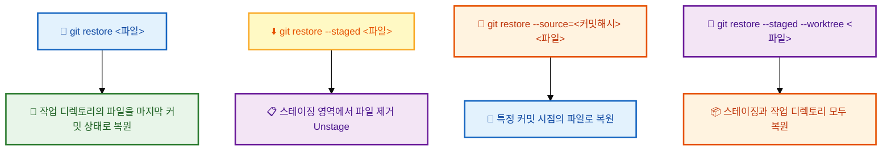

# Checkout 사용하기

---

## 👨‍💻 실전 프로젝트: Checkout으로 시간 여행하기

개발을 하다 보면 "이전 버전에서는 이 코드가 어떻게 동작했을까?"라는 궁금증이 생기거나, "어느 시점부터 버그가 발생하기 시작했을까?"를 추적해야 하는 상황이 자주 발생합니다. 또한 작업 중이던 파일을 실수로 망가뜨렸을 때, "아까 전 상태로 되돌리고 싶다"는 절박한 마음이 들기도 합니다. 이러한 모든 상황에서 우리를 구원해줄 도구가 바로 `git checkout`과 그 후계 명령어들입니다. 이번 실전 프로젝트에서는 `git checkout`을 타임머신처럼 활용하여 과거의 커밋을 탐험하고, 실수로 망가뜨린 파일을 복원하며, Detached HEAD 상태에서 안전하게 작업하는 방법까지 체계적으로 학습하겠습니다.

### 시나리오 1: 과거 커밋 탐험하기

```bash
# 1. 프로젝트 상태 확인
$ git log --oneline
c3d4e5f (HEAD -> main) C3: 로그인 기능 추가
b2c3d4e C2: 회원가입 기능 추가
a1b2c3d C1: 프로젝트 초기화

# 2. C2 시절의 코드를 확인하고 싶다면?
$ git checkout b2c3d4e
# → Detached HEAD 상태가 됨
# → C2 시점의 모든 파일을 볼 수 있음

# 3. C2 시점의 특정 파일만 보고 싶다면?
$ git show b2c3d4e:src/feature.js
# → 커밋을 이동하지 않고도 특정 파일 내용 확인 가능

# 4. 원래 브랜치로 안전하게 복귀
$ git switch main
```

`git checkout <커밋해시>`를 실행하면 마치 타임머신을 타고 과거로 이동한 것처럼, 해당 커밋이 생성된 시점의 프로젝트 상태를 그대로 확인할 수 있습니다. 이 기능은 "어느 시점부터 버그가 발생했는지"를 찾는 이분 탐색(bisect) 과정이나, "과거에 작성했던 코드를 참고하여 현재의 문제를 해결"해야 할 때 매우 유용합니다. 단, 이 상태는 Detached HEAD 상태이므로, 단순히 코드를 확인만 할 것이라면 문제가 없지만 새로운 커밋을 만들 때는 주의가 필요합니다. 만약 특정 커밋의 파일 일부만 보고 싶다면 `git show <커밋해시>:<파일경로>` 명령어를 사용하여 HEAD를 이동하지 않고도 파일 내용을 확인할 수 있습니다.

### 시나리오 2: 실수로 파일을 망가뜨렸을 때 복원하기

```bash
# 1. 중요 파일을 실수로 수정
$ echo "실수로 추가한 내용" >> index.html
$ cat index.html
<html>
  <head>...</head>
  <body>실수로 추가한 내용</body>
</html>

# 2. 마지막 커밋 상태로 복원
$ git restore index.html
$ cat index.html
<html>
  <head>...</head>
  <body></body>
</html>

# 3. 더 과거 버전의 파일로 복원
$ git restore --source=HEAD~2 index.html
# → 2개 전 커밋 시점의 index.html로 복원
```

파일을 수정하다가 "원래 상태가 더 좋았는데..."라는 생각이 들거나, 실수로 엉뚱한 내용을 저장했을 때는 `git restore` 명령어가 가장 빠른 해결책입니다. 이 명령어는 지정된 파일을 마지막 커밋 상태(기본값) 또는 `--source` 옵션으로 지정한 특정 커밋의 상태로 즉시 되돌려줍니다. 특히 `--source` 옵션을 활용하면 "3일 전의 이 파일 버전이 더 좋았어"와 같은 상황에서도 원하는 버전으로 정확하게 복원할 수 있습니다. 주의할 점은, `git restore`는 커밋되지 않은 변경 사항을 되돌리는 것이므로, 한 번 복원하면 해당 변경 사항은 영구히 사라진다는 점입니다.

### 시나리오 3: Detached HEAD에서 실험하고 버리기

```bash
# 1. 특정 과거 시점으로 이동
$ git checkout a1b2c3d
# Detached HEAD 상태

# 2. 과거 코드를 기반으로 실험
$ echo "실험적인 새 기능" > experiment.js
$ git add . && git commit -m "과거에서 실험 중"

# 3. 실험이 마음에 들지 않으면 폐기
$ git switch main
# → 실험 커밋은 참조되지 않은 채 히스토리에서 분리됨
# → 필요하다면 git branch <이름> <해시>로 복구 가능
```

Detached HEAD 상태의 진정한 매력은 "자유로운 실험"에 있습니다. 과거의 특정 시점에서 새로운 브랜치를 만들지 않고도 자유롭게 코드를 수정하고 커밋할 수 있으며, 실험이 마음에 들지 않으면 그냥 원래 브랜치로 돌아오기만 하면 모든 실험 기록이 자연스럽게 사라집니다. 이는 "이 과거 시점을 기준으로 어떤 새로운 접근 방식을 시도해볼까?"라는 가벼운 실험에 안성맞춤입니다. 만약 실험 결과가 마음에 든다면, `git switch -c <새브랜치명>` 명령어로 현재 Detached HEAD 위치에 새 브랜치를 생성하여 실험 결과를 영구히 보존할 수 있습니다.

---

## 학습 목표

- `git checkout` 명령어의 다양한 용도와 최신 Git에서의 역할 분리를 이해합니다.
- 브랜치 전환, 파일 복원, 특정 커밋 확인 등 주요 기능을 상황에 맞게 활용할 수 있습니다.
- Detached HEAD 상태의 개념을 이해하고, 이 상태에서 안전하게 작업하는 방법을 습득합니다.
- `git switch`와 `git restore`를 사용하여 더 직관적으로 브랜치와 파일을 관리할 수 있습니다.

`git checkout`은 Git에서 가장 다재다능한 명령어 중 하나입니다. 하나의 명령어로 브랜치 전환, 파일 복원, 특정 커밋 상태 확인 등 다양한 작업을 수행할 수 있기 때문입니다. 그러나 이러한 다양한 기능이 오히려 초보자에게는 혼란을 줄 수 있습니다. 최신 Git(2.23+ 버전)에서는 이러한 복잡성을 해결하기 위해 `git checkout`의 역할을 `git switch`와 `git restore`로 분리하였습니다. 이번 장에서는 전통적인 `git checkout` 방식과 새로운 명령어 방식을 함께 학습하며, 각 상황에 가장 적합한 도구를 선택하는 방법을 알아보겠습니다.

> **참고:** Git 2.23부터 `git checkout`의 기능은 `git switch` (브랜치 전환)와 `git restore` (파일 복원)로 분리되었습니다. 하지만 여전히 `git checkout`도 널리 사용됩니다. 이 문서에서는 전통적인 `git checkout` 방식과 새로운 명령어 방식을 함께 소개합니다.

`git checkout`이 하나의 명령어로 너무 많은 역할을 담당하게 된 것은 Git이 오랜 기간 진화해온 결과입니다. 과거에는 브랜치 전환과 파일 복원이 명확히 구분되지 않았고, 사용자는 문맥에 따라 `git checkout`을 다르게 해석하여 사용해야 했습니다. Git 2.23에서 도입된 `git switch`와 `git restore`는 이러한 혼란을 해결하기 위해 만들어졌습니다. `git switch`는 오로지 브랜치 전환만을 담당하고, `git restore`는 파일 복원만을 담당함으로써 각 명령어의 역할이 훨씬 명확해졌습니다. 그러나 기존 사용자들과의 호환성을 위해 `git checkout`은 여전히 모든 기능을 유지한 채로 사용할 수 있도록 남아 있습니다.

## 1. 브랜치 전환하기

**전통적인 방식:**
```bash
git checkout main
```

**새로운 방식 (권장):**
```bash
git switch main
```

브랜치 전환은 Git에서 가장 빈번하게 수행하는 작업 중 하나입니다. 기능 개발을 위해 `feature` 브랜치에서 작업하다가 버그 수정을 위해 `hotfix` 브랜치로 이동해야 하는 상황이 대표적입니다. `git checkout main`은 전통적인 방식으로, 이 명령어가 브랜치 전환을 의미하는지 파일 복원을 의미하는지 문맥에 따라 달라질 수 있어 초보자에게 혼란을 줄 수 있었습니다. 반면 `git switch main`은 명령어 이름 자체가 "전환(switch)"을 의미하므로, 이 명령어가 오로지 브랜치 전환만을 수행한다는 것이 직관적으로 이해됩니다. 따라서 새로운 프로젝트나 Git을 처음 배우는 팀이라면 `git switch`를 사용하는 것이 좋습니다.

지금까지 브랜치를 전환하는 방법을 알아보았습니다. 이제 새 브랜치를 생성하면서 동시에 전환하는 방법을 학습해보겠습니다.

## 2. 새 브랜치 생성 및 전환

**전통적인 방식:**
```bash
git checkout -b feature/new-feature
```

**새로운 방식 (권장):**
```bash
git switch -c feature/new-feature
```

새로운 기능을 개발할 때는 기본적으로 `main` 브랜치에서 분기한 새로운 `feature` 브랜치를 생성하는 것이 일반적인 워크플로우입니다. `git checkout -b feature/new-feature` 명령어는 브랜치 생성과 전환을 한 번에 수행하지만, `-b` 옵션이 브랜치를 생성한다는 의미라는 것을 별도로 기억해야 합니다. 반면 `git switch -c feature/new-feature`는 `-c` 옵션이 "create(생성)"의 약자임을 직관적으로 알 수 있어, 명령어의 의도를 더 쉽게 파악할 수 있습니다. 이러한 작은 차이가 모여 명령어 사용의 진입 장벽을 낮추고, 실수로 잘못된 명령어를 실행할 가능성을 줄여줍니다.

지금까지 브랜치 생성과 전환을 함께 수행하는 방법을 배웠습니다. 다음으로 특정 커밋으로 이동하는 Detached HEAD 상태에 대해 알아보겠습니다.

## 3. 특정 커밋으로 이동하기 (Detached HEAD 상태)

Detached HEAD는 특정 브랜치가 아닌, 과거의 특정 커밋을 직접 보고 있는 상태를 말합니다. 이 상태에서는 현재 위치가 어떤 브랜치에도 속해 있지 않습니다. 이를 비유하자면, 평소에는 정해진 철도 노선(브랜치)을 따라 기차가 운행되지만, Detached HEAD는 철로를 벗어나 특정 지점에 정차한 상태와 같습니다. 기차가 선로를 벗어났으므로 이후의 이동 경로가 불확실해지는 것처럼, Detached HEAD 상태에서 작업할 때는 몇 가지 주의사항을 반드시 알아두어야 합니다.

```bash
$ git log --oneline
c3d4e5f (HEAD -> main) C3: 최신 버전
b2c3d4e C2: 중간 버전
a1b2c3d C1: 첫 버전

# C2 시점의 코드를 살펴보고 싶다면?
$ git checkout b2c3d4e
Note: switching to 'b2c3d4e'.
You are in 'detached HEAD' state...

# 이 상태에서 파일을 보면 C2 시점의 코드가 보임
$ cat README.md
# C2 시점의 README 내용...
```

**Detached HEAD 상태에서 벗어나기:**
```bash
# 1. 그냥 원래 브랜치로 돌아가기 (Detached HEAD에서 만든 커밋은 사라짐)
$ git switch main

# 2. Detached HEAD에서 만든 커밋을 살리고 싶다면?
$ git switch -c new-branch-name   # 새 브랜치 생성
# 또는
$ git branch new-branch-name      # 현재 위치에 브랜치 생성
$ git switch main                 # 그런 다음 돌아가기
```

**Detached HEAD 활용: 과거 버전에서 실험하고 버리기**
```bash
# C1 시절의 코드를 보고 싶음
$ git checkout a1b2c3d

# C1 기반으로 실험
$ echo "실험 코드" > experiment.txt
$ git add . && git commit -m "과거에서 실험"

# 실험 끝! 그냥 main으로 돌아가기 (실험 커밋은 사라짐)
$ git switch main
Warning: 1 commit left behind...   # Git이 알려줌
```

Detached HEAD 상태는 Git을 처음 접하는 사용자에게는 다소 낯설고 불안정하게 느껴질 수 있지만, 실제로는 매우 유용한 기능입니다. 과거의 특정 시점을 기준으로 아이디어를 빠르게 프로토타이핑해보고, 결과가 마음에 들지 않으면 아무 흔적 없이 버릴 수 있기 때문입니다. Git이 경고 메시지를 통해 "이 커밋은 참조되지 않은 상태로 남겨질 수 있다"고 알려주므로, 중요한 작업이라면 잊지 말고 새 브랜치를 생성하여 보존해야 합니다. 만약 Detached HEAD 상태에서 만든 커밋을 잃어버렸더라도, `git reflog`를 통해 이전 HEAD 위치를 찾아 복구할 수 있는 방법이 있다는 점도 함께 기억해두시기 바랍니다.

지금까지 Detached HEAD 상태에서 특정 커밋을 확인하고 실험하는 방법을 학습하였습니다. 이제 작업 중인 파일을 복원하는 방법에 대해 알아보겠습니다.

## 4. 파일 복원하기

작업 디렉토리의 특정 파일을 마지막 커밋 상태로 되돌립니다.

```bash
# README.md를 수정했지만 실수였다면?
$ echo "실수로 추가한 내용" >> README.md
$ cat README.md
원래 내용
실수로 추가한 내용

# 원래대로 복원!
$ git restore README.md
$ cat README.md
원래 내용
```

**파일 복원에 관한 다양한 시나리오:**
```bash
# 1. 여러 파일 한 번에 복원
$ git restore file1.js file2.js

# 2. 모든 파일 복원 (추적 중인 파일만)
$ git restore .

# 3. 3일 전 버전으로 파일 복원
$ git restore --source=HEAD~3 app.js

# 4. 특정 커밋의 파일 내용을 가져오기
$ git restore --source=a1b2c3d style.css

# 5. 복원 미리보기 (실제로 복원하지는 않음)
$ git restore --source=HEAD~1 --staged README.md
```

파일 복원은 개발 과정에서 예상보다 훨씬 자주 사용하게 되는 기능입니다. 예를 들어, 리팩토링을 시도했지만 결과가 더 나빠져서 원래대로 되돌리고 싶거나, 실수로 중요한 설정 파일을 삭제했을 때 등 다양한 상황에서 활용할 수 있습니다. `git restore` 명령어는 이러한 상황에서 안전망 역할을 합니다. 특히 `--source` 옵션을 사용하면 단순히 마지막 커밋뿐만 아니라, 프로젝트 히스토리 내의 어떤 커밋 시점으로든 파일을 복원할 수 있습니다. 이는 마치 파일 단위의 타임머신과 같아서, "지난주 금요일에 이 파일은 어떤 모습이었지?"와 같은 질문에 즉시 답을 얻을 수 있게 해줍니다.

파일 복원 방법에 대해 알아보았습니다. 이제 특정 커밋 시점의 파일로 복원하는 방법을 더 자세히 살펴보겠습니다.

## 5. 특정 커밋 시점의 파일로 복원하기

**전통적인 방식:**
```bash
git checkout a1b2c3d -- index.html
```

**새로운 방식 (권장):**
```bash
git restore --source=a1b2c3d index.html
```

전통적인 `git checkout a1b2c3d -- index.html` 명령어는 동작 자체는 완벽하지만, 그 문법이 초보자에게는 매우 낯설게 느껴집니다. `--`(더블 대시)의 의미(이 이후의 인자는 파일 경로임을 명시)를 이해해야 하고, 명령어 이름인 `checkout`이 파일 복원의 의미를 직관적으로 전달하지 못합니다. 반면 `git restore --source=a1b2c3d index.html`은 `--source` 옵션을 통해 "어떤 출처에서" 파일을 가져올 것인지 명확히 지정하고, 그 뒤에 복원할 파일명을 나열하는 직관적인 구조를 가지고 있습니다. 새로운 명령어 방식이 권장되는 이유는 바로 이러한 가독성과 명확성 때문입니다.

지금까지 파일 복원에 대해 학습하였습니다. 다음으로 스테이징 영역에서 파일을 제거하는 Unstage 작업에 대해 알아보겠습니다.

## 6. 스테이징 취소하기 (Unstaging)

스테이징 영역에 추가된 파일을 Unstage 상태로 되돌립니다.

```bash
$ git add app.js   # 실수로 스테이징함!
$ git status
Changes to be committed:
    modified:   app.js

# 스테이징 취소 (Unstage)
$ git restore --staged app.js
$ git status
Changes not staged for commit:
    modified:   app.js   # Modified 상태로 돌아감
```

**스테이징과 작업 디렉토리를 모두 한 번에 초기화:**
```bash
$ git add app.js
$ echo "추가 수정" >> app.js

# 스테이징 취소 + 파일 복원을 동시에
$ git restore --staged --worktree app.js
# = git checkout HEAD -- app.js (전통적 방식)
```

스테이징 취소(Unstage)는 "커밋할 준비가 되었다고 표시했지만, 다시 생각해보니 이 파일은 포함시키지 말아야겠다"는 상황에서 사용합니다. `git restore --staged`는 파일의 실제 내용은 전혀 변경하지 않고, Git의 Staging Area에서만 해당 파일을 제거합니다. 따라서 파일의 수정 내용은 그대로 Working Directory에 남아 있어, 나중에 다시 `git add`하여 커밋할 수 있습니다. 만약 스테이징 취소와 함께 파일 내용도 원래대로 되돌리고 싶다면, `--staged`와 `--worktree` 옵션을 함께 사용하여 두 영역을 한 번에 초기화할 수 있습니다. 이는 `git checkout HEAD -- app.js`라는 전통적인 명령어와 동일한 동작을 수행하지만, 새로운 명령어 방식이 훨씬 더 이해하기 쉽고 명확합니다.

## 요약: `git restore` 사용법



`git restore` 명령어의 다양한 옵션을 위 다이어그램처럼 한눈에 정리해보면 각 옵션이 Git의 세 가지 영역(HEAD, Staging Area, Working Directory) 중 어떤 영역에 영향을 미치는지 명확해집니다. `git restore <파일>`은 Working Directory만 초기화하고, `--staged` 옵션을 추가하면 Staging Area를 초기화하며, `--worktree` 옵션을 추가하면 Working Directory도 함께 초기화합니다. 이러한 구조를 이해하면, 복잡해 보이는 다양한 옵션도 옵션 이름과 영역의 매칭만으로 쉽게 예측할 수 있습니다. 즉, `--staged`는 Stage(Staging Area)를, `--worktree`는 Working Directory를 대상으로 한다는 원칙만 기억하면 됩니다.

## `git checkout` 팁

*   과거의 코드를 살펴볼 때 `git checkout <커밋해시>`를 사용하세요.
*   복구하고 싶은 파일이 있을 때 `git checkout -- <파일명>`을 사용하세요.
*   브랜치 전환은 `git switch`를 사용하는 것이 더 직관적입니다.

이상으로 `git checkout` 명령어의 다양한 활용법과 최신 Git에서의 대체 명령어들을 살펴보았습니다. 핵심은 "무엇을 하고 싶은가"에 따라 적절한 명령어를 선택하는 것입니다. 브랜치를 전환하고 싶다면 `git switch`, 파일을 복원하고 싶다면 `git restore`, 과거 커밋을 탐험하고 싶다면 `git checkout <커밋해시>`를 사용하면 됩니다. 이러한 도구들을 적재적소에 활용하면, 복잡한 Git 작업도 훨씬 수월하게 처리할 수 있을 것입니다.

## 실습 예제

```bash
# 1. README.md 파일을 수정해 보기
echo "실수로 추가한 내용" >> README.md

# 2. 실수를 발견하고 파일 복원
git restore README.md
# 또는: git checkout -- README.md

# 3. 파일 내용 확인 (복원됨)
cat README.md
```

### 복합적인 실수 시나리오

```bash
# 1. 파일 3개를 수정하고 실수로 2개를 스테이징
$ echo "수정1" >> file1.txt && echo "수정2" >> file2.txt && echo "수정3" >> file3.txt
$ git add file1.txt file2.txt   # file3은 스테이징하지 않음

# 2. file2의 스테이징을 취소하고 싶음
$ git restore --staged file2.txt

# 3. file1의 변경 사항도 마음에 안 듦 → 복원
$ git restore --staged file1.txt
$ git restore file1.txt

# 4. file2와 file3의 변경도 모두 취소
$ git restore file2.txt file3.txt

# 5. 모든 것이 깨끗해짐
$ git status
nothing to commit, working tree clean
```

위의 복합 시나리오는 실제 개발 현장에서 자주 마주치는 상황을 재현한 것입니다. 여러 파일을 동시에 수정하다 보면 어떤 파일은 커밋하고, 어떤 파일은 아직 수정이 덜 되어 커밋하지 말아야 하는 상황이 발생합니다. 이러한 상황에서 `git restore --staged`와 `git restore`를 적절히 조합하여 사용하면, 원하는 파일만 골라서 커밋하고 나머지는 초기화할 수 있습니다. 특히 위 예제의 3번 단계에서 보듯, `git restore --staged`로 스테이징만 취소한 후 `git restore`로 Working Directory도 초기화하는 2단계 과정은 파일을 완전히 처음 상태로 되돌리는 표준 패턴입니다.

## 한눈에 정리

| 개념 | 설명 | 주요 명령어 |
|------|------|-----------|
| 브랜치 전환 | 현재 작업 중인 브랜치를 다른 브랜치로 변경합니다. | `git switch <브랜치명>`, `git checkout <브랜치명>` |
| 브랜치 생성 및 전환 | 새 브랜치를 생성하면서 동시에 해당 브랜치로 전환합니다. | `git switch -c <브랜치명>`, `git checkout -b <브랜치명>` |
| Detached HEAD | 특정 브랜치가 아닌 과거 커밋을 직접 확인하는 상태입니다. 이 상태에서 만든 커밋은 브랜치를 떠나면 사라집니다. | `git checkout <커밋해시>` |
| 파일 복원 | 작업 디렉토리의 파일을 마지막 커밋 상태 또는 특정 커밋 시점으로 되돌립니다. | `git restore <파일>`, `git restore --source=<커밋해시> <파일>` |
| Unstage | Staging Area에 추가된 파일을 제거하여 Modified 상태로 되돌립니다. | `git restore --staged <파일>` |
| 스테이징 및 작업 디렉토리 초기화 | Staging Area와 Working Directory를 모두 마지막 커밋 상태로 되돌립니다. | `git restore --staged --worktree <파일>` |

## 연습 문제

1. `git checkout`의 역할이 Git 2.23 이후 어떤 두 명령어로 분리되었는지 설명하고, 각 명령어가 담당하는 기능을 서술해보세요.

2. Detached HEAD 상태란 무엇인지 설명하고, 이 상태에서 새로 만든 커밋이 브랜치를 떠날 때 어떻게 되는지 서술해보세요.

3. 작업 디렉토리의 파일을 마지막 커밋 상태로 되돌리려면 어떤 명령어를 사용해야 하는지 작성해보세요.

4. `git restore` 명령어에서 `--staged` 옵션과 `--worktree` 옵션의 차이점을 설명하고, 두 옵션을 함께 사용하면 어떤 결과가 나타나는지 서술해보세요.

5. Detached HEAD 상태에서 실험적인 커밋을 만들었습니다. 이 실험 결과를 영구히 보존하려면 어떤 명령어를 사용해야 하는지 작성해보세요.
