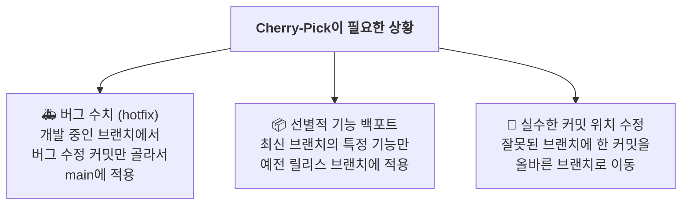
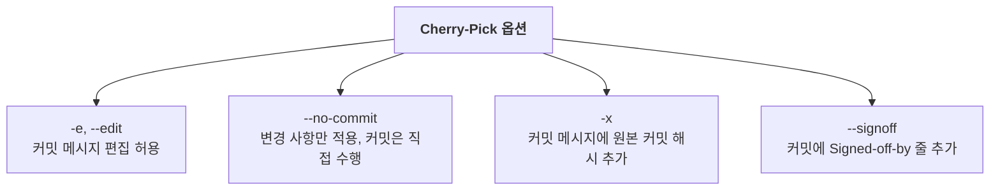

# Cherry-Pick: 특정 커밋만 골라서 가져오기


## 학습 목표

- Cherry-Pick의 개념과 병합 및 리베이스와의 차이점을 이해할 수 있습니다.
- Cherry-Pick이 필요한 다양한 상황을 파악하고 적절히 활용할 수 있습니다.
- `git cherry-pick` 명령어의 기본 사용법과 주요 옵션을 익힐 수 있습니다.
- Cherry-Pick 사용 시 발생할 수 있는 충돌과 주의사항을 이해하고 대처할 수 있습니다.

---

Cherry-Pick은 다른 브랜치의 **특정 커밋 하나만** 골라서 현재 브랜치에 적용하는 기능입니다. 병합(merge)이나 리베이스(rebase)처럼 브랜치 전체를 가져오는 것이 아니라, 원하는 커밋만 선별적으로 가져올 때 사용합니다. 우리는 이미 병합을 통해 브랜치 전체를 통합하는 방법을 배웠습니다. 하지만 실제 개발 현장에서는 때때로 특정 커밋만 골라서 적용해야 하는 상황이 발생합니다. 이러한 상황에서 Cherry-Pick은 매우 유용한 도구가 됩니다. 지금부터 Cherry-Pick의 개념과 활용법을 자세히 알아보겠습니다.

```mermaid
gitGraph
   commit id: "C1"
   commit id: "C2"
   branch feature/login
   checkout feature/login
   commit id: "C3 - 로그인 폼"
   commit id: "C4 - 유효성 검사"
   commit id: "C5 - 스타일 적용"
   checkout main
   commit id: "C6"
   cherry-pick id: "C4"
```

## Cherry-Pick이 필요한 상황



## 기본 사용법

```bash
git cherry-pick <커밋해시>
```

### 예시: 버그 수정 커밋만 main에 적용하기

Cherry-Pick의 가장 대표적인 사용 사례인 버그 수정 커밋만 골라서 적용하는 방법을 살펴보겠습니다.

```bash
# 현재 브랜치 확인 (main)
$ git branch
* main
  feature/payment

# feature/payment 브랜치에서 버그 수정 커밋 확인
$ git log --oneline feature/payment
d4e5f6f 결제 API 연동
a1b2c3d 버그 수정: 가격 계산 오류   ← 이 커밋만 필요!
g7h8i9j 결제 모듈 초안

# main에서 특정 커밋만 cherry-pick
$ git cherry-pick a1b2c3d
[main 9i8h7g6] 버그 수정: 가격 계산 오류
 Date: Mon Jul 10 14:30:00 2026 +0900
 1 file changed, 2 insertions(+), 1 deletion(-)

# 결과: main에 버그 수정만 적용됨 (결제 모듈 전체는 아직)
$ git log --oneline -3
9i8h7g6 (HEAD -> main) 버그 수정: 가격 계산 오류
f4e5d6c README 업데이트
k1l2m3n 첫 번째 커밋
```

### 여러 커밋 한 번에 Cherry-Pick

하나의 커밋뿐만 아니라 여러 개의 커밋을 한 번에 가져올 수도 있습니다.

```bash
# 연속된 커밋 범위 지정
$ git cherry-pick a1b2c3d..d4e5f6f

# 또는 하나씩 나열
$ git cherry-pick a1b2c3d d4e5f6f g7h8i9j
```

## Cherry-Pick 주의사항

Cherry-Pick은 매우 편리한 기능이지만, 사용할 때 몇 가지 주의해야 할 점이 있습니다. 이를 미리 알아두면 예상치 못한 문제를 방지할 수 있습니다.

### 1. 충돌이 발생할 수 있음

Cherry-Pick도 병합이므로 충돌이 발생할 수 있습니다. 해결 방법은 일반 병합 충돌과 동일합니다.

```bash
# 충돌 발생 시
$ git cherry-pick a1b2c3d
error: could not apply a1b2c3d... 버그 수정: 가격 계산 오류
hint: resolve the conflicts and run "git cherry-pick --continue"

# 충돌 해결 후 계속
$ git add .
$ git cherry-pick --continue

# 또는 cherry-pick 취소
$ git cherry-pick --abort
```

### 2. 커밋 해시가 달라짐

Cherry-Pick으로 가져온 커밋은 원본과 **다른 해시**를 갖습니다. 내용은 같지만 새로운 커밋으로 간주됩니다.

```bash
# 원본 커밋
a1b2c3d 버그 수정: 가격 계산 오류   (feature/payment)

# Cherry-Pick된 커밋 (내용은 같지만 해시가 다름)
9i8h7g6 버그 수정: 가격 계산 오류   (main)
```

### 3. 의존성이 있는 커밋은 함께 가져오기

커밋 A가 커밋 B에 의존한다면, A만 cherry-pick하면 문제가 생길 수 있습니다. 이런 경우 연관된 커밋들을 함께 가져오는 것이 좋습니다.

## Cherry-Pick 활용: 잘못된 브랜치에 한 커밋 수정

실수로 잘못된 브랜치에 커밋을 했다면 어떻게 해야 할까요? Cherry-Pick을 활용하면 이 문제를 간단히 해결할 수 있습니다.

```bash
# 실수: main에서 직접 수정해버림
$ git switch main
$ echo "hotfix" > urgent.txt
$ git add . && git commit -m "긴급 수정"

# 😱 알고 보니 feature 브랜치에서 작업해야 했음!

# 방법 1: Cherry-Pick + Reset (추천)
$ git switch feature/hotfix
$ git cherry-pick main       # main의 마지막 커밋을 feature에 적용
$ git switch main
$ git reset --hard HEAD~1    # main에서 잘못된 커밋 제거

# 방법 2: 단순 복사
$ git switch feature/hotfix
$ git cherry-pick main       # main의 최신 커밋을 가져옴
```

## Cherry-Pick 옵션

Cherry-Pick은 다양한 옵션을 제공하여 상황에 맞게 유연하게 사용할 수 있습니다.



```bash
# 원본 추적 정보 포함
$ git cherry-pick -x a1b2c3d

# 커밋 없이 변경 사항만 적용
$ git cherry-pick --no-commit a1b2c3d
$ git add .
$ git commit -m "직접 작성한 커밋 메시지"
```

## 실습 시나리오

지금까지 배운 내용을 종합하여 실제 개발 상황과 유사한 시나리오로 실습해보겠습니다.

```bash
# 1. feature 브랜치에서 작업 중
$ git switch -c feature/dashboard

# 2. 긴급 버그 수정 커밋 생성
$ echo "fix" > bugfix.js
$ git add . && git commit -m "대시보드 버그 수정"

# 3. 그 외 기능 개발 계속...
$ echo "feature" > chart.js
$ git add . && git commit -m "차트 기능 추가"

# 4. 갑자기! 운영 서버에 버그 수정이 필요함
$ git switch main

# 5. 버그 수정 커밋만 골라서 적용
$ git cherry-pick abc1234   # feature/dashboard의 버그 수정 커밋

# 6. 배포 준비 완료! feature 브랜치의 나머지 기능은 아직 개발 중
```

## 한눈에 정리

| 개념 | 설명 |
|------|------|
| Cherry-Pick | 다른 브랜치의 특정 커밋 하나만 골라서 현재 브랜치에 적용하는 기능 |
| 사용 상황 | 버그 수정(hotfix) 선별 적용, 기능 백포트, 잘못된 브랜치의 커밋 이동 |
| 기본 명령어 | `git cherry-pick <커밋해시>` |
| 충돌 처리 | `git cherry-pick --continue`(계속), `--abort`(취소), `--skip`(건너뛰기) |
| 해시 변경 | Cherry-Pick된 커밋은 원본과 다른 새로운 해시를 가짐 |
| 의존성 주의 | 의존 관계가 있는 커밋은 함께 Cherry-Pick해야 함 |
| 주요 옵션 | `-e`(메시지 편집), `--no-commit`(변경만), `-x`(원본 해시 추적) |

## 연습 문제

1. Cherry-Pick과 `git merge`의 가장 큰 차이점은 무엇입니까?
   ① Cherry-Pick은 충돌이 발생하지 않는다.
   ② Cherry-Pick은 특정 커밋만 선별적으로 가져올 수 있다.
   ③ Cherry-Pick은 원격 저장소가 필요하다.
   ④ Cherry-Pick은 커밋 해시가 변경되지 않는다.

2. Cherry-Pick으로 가져온 커밋이 원본 커밋과 다른 해시를 갖는 이유는 무엇인지 설명해보세요.

3. 실수로 main 브랜치에 커밋을 했는데, 이 커밋이 feature 브랜치에 있어야 하는 상황입니다. Cherry-Pick을 활용하여 이 문제를 어떻게 해결할 수 있을지 순서대로 서술해보세요.
