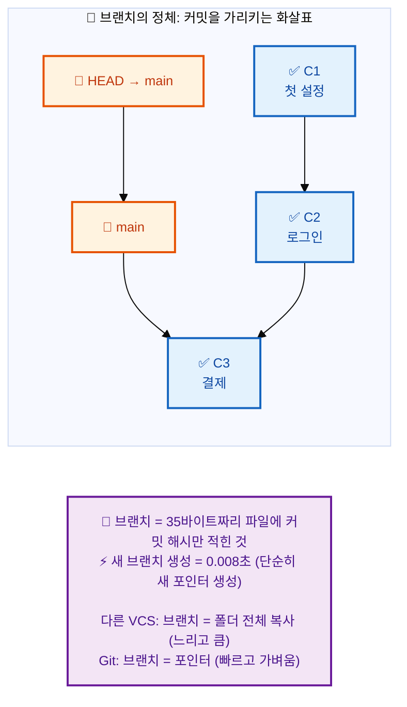
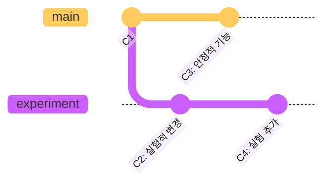

# 브랜치란 무엇인가요?

---

## 👨‍💻 실전 프로젝트: 브랜치의 세계로 첫걸음

브랜치의 개념을 가장 확실하게 이해하는 방법은 직접 브랜치를 만들고 전환하며 그래프 로그를 확인해보는 것입니다. 다음 실습을 통해 브랜치가 실제로 어떻게 동작하는지 체험해보시기 바랍니다. 이 실습은 단순히 명령어를 따라 하는 것을 넘어, 브랜치가 커밋을 가리키는 포인터라는 Git의 핵심 원리를 몸으로 익히는 과정입니다.

```bash
# 1. 실습용 디렉토리 생성 및 초기화
$ mkdir branch-practice && cd branch-practice
$ git init
$ echo "# Branch Practice" > README.md
$ git add . && git commit -m "초기 커밋"

# 2. experiment 브랜치를 생성하고 전환하기
$ git branch experiment
$ git switch experiment

# 3. experiment 브랜치에서 파일 작성 후 커밋
$ echo "실험적인 첫 번째 변경" > feature.txt
$ git add . && git commit -m "실험적 변경 1"
$ echo "실험적인 두 번째 변경" >> feature.txt
$ git add . && git commit -m "실험적 변경 2"

# 4. main 브랜치로 돌아와서 별도 작업 수행
$ git switch main
$ echo "메인에서 작업한 내용" > main-work.txt
$ git add . && git commit -m "메인 작업 1"

# 5. 브랜치 그래프 확인
$ git log --oneline --graph --all
* a1b2c3d (HEAD -> main) 메인 작업 1
| * b2c3d4e (experiment) 실험적 변경 2
| * c3d4e5f 실험적 변경 1
|/
* d4e5f6g 초기 커밋
```

위 그래프에서 `*` 기호는 각 커밋을 나타내며, `|/`는 브랜치가 갈라진 지점을 시각적으로 보여줍니다. 이처럼 브랜치를 생성하면 main과 experiment라는 두 개의 독립적인 작업 흐름이 생겨나고, 각 브랜치에서의 작업이 서로 영향을 주지 않음을 확인할 수 있습니다. 이러한 구조를 이해하는 것이 Git 브랜치 활용의 첫걸음입니다.

---

## 학습 목표

- 브랜치의 개념과 Git에서 브랜치가 동작하는 방식을 이해합니다.
- 브랜치가 필요한 다양한 상황(기능 개발, 버그 수정, 실험적 작업 등)을 설명할 수 있습니다.
- Git 브랜치가 다른 버전 관리 시스템의 브랜치와 비교하여 어떤 장점이 있는지 이해합니다.
- 브랜치 생성, 전환, 로그 확인을 통해 브랜치의 동작을 직접 실습할 수 있습니다.

브랜치(Branch)는 Git의 가장 강력하고 유용한 기능 중 하나입니다. 우리가 여러 작업을 동시에 진행하면서도 코드의 안정성을 유지할 수 있는 이유가 바로 이 브랜치 덕분입니다. 브랜치를 이해하면 독립적으로 작업을 진행하고, 이를 다시 하나로 합치는 Git의 진정한 힘을 활용할 수 있습니다. 이번 장에서는 브랜치의 개념과 필요성, 그리고 Git에서 브랜치가 어떻게 동작하는지 자세히 알아보겠습니다. Git을 처음 접하는 분들도 이 장을 마치면 브랜치를 자신 있게 사용할 수 있을 것입니다.

---

## 브랜치의 개념

브랜치는 말 그대로 **나뭇가지**를 의미합니다. 하나의 코드 베이스에서 또 다른 독립적인 작업 흐름을 만들 수 있습니다. 나무가 하나의 줄기에서 여러 갈래의 가지를 뻗어나가듯이, 소프트웨어 개발에서도 하나의 소스 코드에서 여러 갈래의 개발 흐름을 만들어낼 수 있습니다. 각 브랜치는 다른 브랜치의 영향을 전혀 받지 않으면서 독립적으로 진화할 수 있습니다.

예를 들어, 여러분이 책을 쓰고 있다고 상상해 보세요. 원고의 메인 버전(1장, 2장, 3장...)이 있습니다. 그런데 갑자기 떠오른 새로운 아이디어로 책의 결말 부분을 실험적으로 다시 써보고 싶습니다. 하지만 원래 원고를 망가뜨리고 싶지는 않습니다. 이러한 상황에서 브랜치는 완벽한 해결책을 제시합니다.

이럴 때 브랜치를 사용합니다. 메인 원고는 그대로 두고, "결말-실험"이라는 새로운 브랜치를 만들어 자유롭게 작업할 수 있습니다. 나중에 실험이 마음에 들면 메인 원고에 합칠(merge) 수도 있고, 마음에 들지 않으면 그냥 버릴 수도 있습니다. 이처럼 브랜치는 개발자에게 자유로운 실험과 안전한 코드 관리를 동시에 가능하게 해주는 강력한 도구입니다.

---

## 브랜치의 필요성

브랜치가 왜 필요한지 구체적인 상황을 통해 살펴보겠습니다. 각 상황은 실제 개발 현장에서 빈번하게 발생하는 시나리오로, 브랜치 없이는 해결이 까다롭거나 위험한 경우가 많습니다.

- **독립적인 기능 개발:** 새로운 기능을 개발할 때 메인 코드에 영향을 주지 않고 별도의 브랜치에서 안전하게 작업할 수 있습니다. 예를 들어, 로그인 기능을 개발하는 동안 메인 브랜치에서는 다른 개발자들이 평소처럼 작업을 계속할 수 있습니다. 이렇게 함으로써 기능 개발이 완료될 때까지 메인 코드의 안정성을 보장할 수 있습니다.
- **버그 수정:** 긴급한 버그를 수정해야 할 때, 현재 진행 중인 작업과 분리하여 빠르게 버그 수정 브랜치를 만들고 적용할 수 있습니다. 운영 서버에서 발견된 치명적인 버그를 수정해야 하는 상황에서, 현재 개발 중인 불완전한 기능과 섞이지 않고 신속하게 버그만 수정하여 배포할 수 있습니다.
- **실험적인 작업:** 확신이 없는 새로운 아이디어를 안전하게 실험해 볼 수 있습니다. 예를 들어, 데이터베이스 구조를 완전히 바꾸는 대규모 리팩토링을 시도해보고 싶다면 별도 브랜치에서 실험한 후, 성공했을 때만 메인 코드에 통합하면 됩니다.
- **병렬 개발:** 여러 개발자가 동시에 서로 다른 기능을 개발할 수 있습니다. 한 팀원은 결제 모듈을, 다른 팀원은 사용자 프로필을, 또 다른 팀원은 알림 시스템을 각자 브랜치에서 동시에 개발할 수 있습니다. 이 모든 작업이 서로 충돌 없이 진행될 수 있는 것은 브랜치 덕분입니다.

---

## Git 브랜치의 특징

Git의 브랜치는 다른 버전 관리 시스템에 비해 매우 가볍고 빠릅니다. 이는 Git의 설계 철학에서 비롯된 것으로, 브랜치를 부담 없이 자주 만들고 사용하도록 장려하는 특징입니다. 많은 개발자들이 Git을 선호하는 중요한 이유 중 하나가 바로 이 가벼운 브랜치 시스템입니다.

**Git 브랜치는 단순한 포인터입니다:**



다른 VCS는 브랜치 = 폴더 전체 복사 (느리고 큼)
Git은 브랜치 = 포인터 (빠르고 가벼움)

- **가벼움 (Lightweight):** Git에서 브랜치는 단순히 특정 커밋을 가리키는 포인터(pointer)에 불과합니다. 따라서 생성, 전환, 삭제가 매우 빠릅니다. 실제로 Git의 브랜치는 41바이트(40바이트 SHA-1 해시 + 개행 문자) 크기의 파일에 불과하므로, 수백 개의 브랜치를 만들어도 저장소 성능에 전혀 영향을 주지 않습니다.
- **손쉬운 병합 (Easy Merging):** Git은 브랜치 병합을 매우 효율적으로 처리하며, 충돌(conflict)이 발생했을 때도 상세한 정보를 제공하여 해결을 도와줍니다. Git의 병합 알고리즘은 공통 조상을 기준으로 양쪽 브랜치의 변경 사항을 분석하여 최대한 자동으로 병합을 수행합니다. 사람이 직접 해결해야 하는 충돌이 발생하더라도, Git은 충돌 마커를 통해 정확한 위치와 내용을 알려줍니다.
- **로컬 우선 (Local First):** 대부분의 브랜치 작업은 로컬 저장소에서 이루어지기 때문에 인터넷 연결 없이도 자유롭게 브랜치를 만들고 전환할 수 있습니다. 이는 비행기를 타고 이동 중이거나 인터넷 연결이 불안정한 환경에서도 개발을 계속할 수 있다는 것을 의미합니다. 원격 저장소와 동기화가 필요할 때만 네트워크 연결을 사용하면 됩니다.

Git을 사용할 때는 기본적으로 `main`(또는 `master`)이라는 메인 브랜치가 하나 생성됩니다. 이 메인 브랜치를 기준으로 다양한 토픽 브랜치를 만들고 작업하며, 완료된 작업은 다시 메인 브랜치로 병합하는 방식으로 진행됩니다. 이 워크플로우는 대부분의 Git 프로젝트에서 표준으로 사용되는 방식입니다.

**브랜치 생성과 이동 개념도:**



```bash
# 1. main 브랜치에서 시작 (C1 커밋)
$ git log --oneline
a1b2c3d (HEAD -> main) C1: 초기 설정
```

## 브랜치 작동 방식 예시

**실제 Git 명령어로 브랜치 개념 익히기:**

앞서 개념적으로 설명한 브랜치의 동작을 이제 실제 명령어를 통해 확인해보겠습니다. 아래 예시를 직접 따라 하면서 각 단계에서 브랜치와 HEAD가 어떻게 변화하는지 관찰하는 것이 중요합니다. 특히 브랜치를 전환할 때 작업 디렉토리의 파일이 어떻게 바뀌는지 주목하시기 바랍니다.

```bash
# 1. main 브랜치에서 시작 (C1 커밋)
$ git log --oneline
a1b2c3d (HEAD -> main) C1: 초기 설정

# 2. experiment 브랜치 생성 (같은 위치를 가리킴)
$ git branch experiment

# 현재 상태 (모든 브랜치가 C1을 가리킴):
#   main → C1
#   experiment → C1
#   HEAD → main

# 3. experiment로 전환 후 작업
$ git switch experiment
$ echo "실험 코드" > test.txt
$ git add . && git commit -m "C2: 실험적인 변경"
$ git log --oneline
a1b2c3d (main) C1: 초기 설정
b2c3d4e (HEAD -> experiment) C2: 실험적인 변경  # experiment만 앞서감

# 4. main으로 돌아가기
$ git switch main
$ ls test.txt
ls: test.txt: No such file or directory  # experiment의 파일은 보이지 않음!

# 5. main에서도 작업
$ echo "안정적인 코드" > stable.txt
$ git add . && git commit -m "C3: 안정적인 기능 추가"
$ git log --oneline
c3d4e5f (HEAD -> main) C3: 안정적인 기능 추가
a1b2c3d C1: 초기 설정
# experiment 브랜치의 C2는 보이지 않음!

# 6. 브랜치 그래프 확인
$ git log --oneline --graph --all
* c3d4e5f (HEAD -> main) C3: 안정적인 기능 추가
| * b2c3d4e (experiment) C2: 실험적인 변경
|/
* a1b2c3d C1: 초기 설정
# 브랜치가 갈라진 구조를 시각적으로 확인!
```

위 명령어들을 직접 실행해보면 브랜치가 단순한 포인터라는 사실을 실감할 수 있습니다. 3번 단계에서 experiment 브랜치에서 커밋한 후 main으로 전환했을 때 `test.txt` 파일이 보이지 않는 것은, 각 브랜치가 서로 다른 커밋을 가리키고 있기 때문입니다. 이처럼 브랜치는 완전히 격리된 작업 공간을 제공하여, 한 브랜치에서의 변경 사항이 다른 브랜치에 영향을 미치지 않음을 확인할 수 있습니다.

---

## 한눈에 정리

| 개념 | 설명 | 주요 명령어 |
|------|------|-----------|
| 브랜치 | 하나의 코드 베이스에서 독립적인 작업 흐름을 만드는 Git의 기능입니다. | `git branch`, `git switch` |
| 브랜치의 필요성 | 독립적인 기능 개발, 긴급 버그 수정, 실험적 작업, 병렬 개발이 가능합니다. | — |
| Git 브랜치의 특징 | 단순한 포인터로 동작하여 가볍고 빠릅니다. 생성, 전환, 삭제가 매우 빠릅니다. | `git branch <이름>`, `git switch <이름>` |
| HEAD | 현재 작업 중인 브랜치를 가리키는 특수 포인터입니다. | — |
| 브랜치 그래프 | `--graph` 옵션으로 브랜치의 갈라진 구조를 시각적으로 확인할 수 있습니다. | `git log --oneline --graph --all` |

---

## 연습 문제

1. Git의 브랜치가 다른 버전 관리 시스템의 브랜치와 비교하여 가지는 가장 큰 장점은 무엇인지 설명해보세요.

2. 브랜치를 사용하면 좋은 상황을 세 가지 이상 예를 들어 설명해보세요.

3. 다음 명령어를 실행한 후 `git log --oneline --graph --all`의 출력 결과를 설명해보세요.
   - `git branch experiment`
   - `git switch experiment`
   - `echo "test" > test.txt && git add . && git commit -m "test"`
   - `git switch main`

---

📌 정답 및 해설

**문제 1 정답 및 해설:**

Git의 브랜치가 다른 버전 관리 시스템과 비교하여 가지는 가장 큰 장점은 브랜치 생성과 전환이 거의 순간적으로 이루어진다는 점입니다. 다른 VCS(SVN 등)는 브랜치를 생성할 때 실제로 모든 파일을 복사해야 하므로 프로젝트 크기에 따라 수 초에서 수 분이 소요됩니다. 반면 Git은 브랜치를 41바이트 크기의 포인터 파일(해시 값을 담은 파일)로 관리하므로, 생성에는 단 몇 밀리초밖에 걸리지 않습니다. 이러한 속도 차이는 개발자의 작업 방식을 근본적으로 변화시킵니다. SVN 사용자는 브랜치 생성이 부담스러워 신중하게 사용하는 반면, Git 사용자는 "기능 하나당 하나의 브랜치"라는 가벼운 브랜치 전략을 부담 없이 사용할 수 있습니다.

**문제 2 정답 및 해설:**

브랜치를 사용하면 좋은 상황은 다음과 같이 다양합니다. 첫째, 새로운 기능을 개발할 때입니다. 로그인 기능을 개발한다면 `feature/login` 브랜치를 만들어 작업하고, 완료될 때까지 main 브랜치를 안전하게 보호할 수 있습니다. 둘째, 버그를 수정할 때입니다. 긴급 버그가 발견되면 main 브랜치에서 `hotfix/critical-bug` 브랜치를 만들어 빠르게 수정하고 병합할 수 있습니다. 셋째, 실험적인 기능을 시도할 때입니다. "이런 방식으로 구현해보면 어떨까?"라는 아이디어가 있을 때 실험용 브랜치를 만들어 안전하게 테스트하고, 결과가 마음에 들지 않으면 해당 브랜치만 삭제하면 됩니다. 넷째, 여러 개발자가 동시에 다른 작업을 할 때입니다. 각자 자신의 브랜치에서 독립적으로 작업한 후, 완료된 순서대로 main 브랜치에 병합함으로써 충돌을 최소화할 수 있습니다.

**문제 3 정답 및 해설:**

주어진 명령어를 실행한 후 `git log --oneline --graph --all`의 출력은 두 개의 브랜치(main과 experiment)를 보여주며, experiment 브랜치에 "test"라는 커밋이 하나 추가된 상태를 표시합니다. 구체적으로 보면, 처음에 main 브랜치에서 `git branch experiment`로 experiment 브랜치를 생성하면 experiment도 현재의 main과 같은 커밋을 가리킵니다. `git switch experiment`로 experiment 브랜치로 전환한 후, `echo "test" > test.txt && git add . && git commit -m "test"`로 새로운 커밋을 만들면 experiment 브랜치가 한 커밋 앞서게 됩니다. 마지막으로 `git switch main`으로 main 브랜치로 돌아오면, main은 여전히 원래 커밋에 머물러 있습니다. 따라서 그래프는 main 브랜치와 experiment 브랜치가 갈라져서 experiment에 한 개의 추가 커밋이 있는 형태로 표시됩니다.
