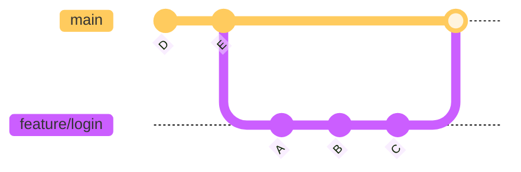
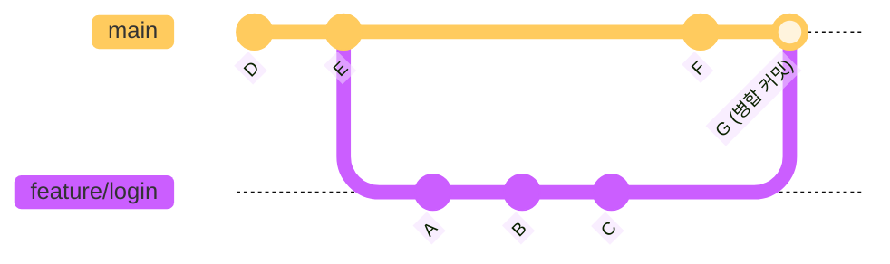
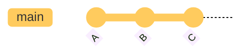
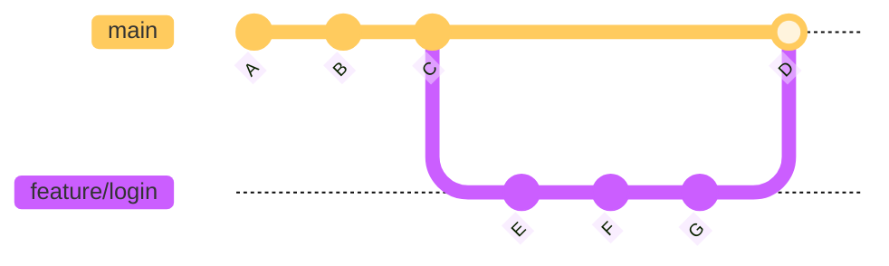

# 브랜치 병합

---

## 👨‍💻 실전 프로젝트: 브랜치 병합 실습

이번 실습에서는 두 가지 병합 방식인 Fast-Forward 병합과 3-Way 병합을 직접 경험해보겠습니다. 하나의 저장소에서 두 가지 상황을 모두 만들어보면서 각 병합 방식이 어떤 차이가 있는지 명확히 이해할 수 있습니다. 이 실습을 마치면 면접이나 실무에서 병합 방식을 설명할 때 자신감을 가질 수 있을 것입니다.

```bash
# 1. 실습 저장소 생성
$ mkdir merge-practice && cd merge-practice
$ git init
$ echo "# Merge Practice" > README.md
$ git add . && git commit -m "README 추가"

# === Fast-Forward 병합 실습 ===
# 2. feature 브랜치 생성 후 작업 (main은 그대로)
$ git switch -c feature/ff-test
$ echo "Fast-Forward 테스트" > feature.txt
$ git add . && git commit -m "FF: 기능 구현"
$ echo "두 번째 변경" >> feature.txt
$ git add . && git commit -m "FF: 기능 보완"

# 3. main으로 돌아와서 병합 (Fast-Forward)
$ git switch main
$ git merge feature/ff-test
Updating a1b2c3d..d4e5f6f
Fast-forward
 feature.txt | 2 ++
 1 file changed, 2 insertions(+)

# === 3-Way 병합 실습 ===
# 4. 새 feature 브랜치 생성
$ git switch -c feature/3way-test
$ echo "3-Way 테스트" > 3way.txt
$ git add . && git commit -m "3WAY: 기능 구현"

# 5. main에서도 별도로 작업 (갈라지게 만듦)
$ git switch main
$ echo "메인에서 작업" > main-work.txt
$ git add . && git commit -m "메인 작업 추가"

# 6. 3-Way 병합 수행
$ git merge feature/3way-test
Merge made by the 'ort' strategy.
 3way.txt | 1 +
 1 file changed, 1 insertion(+)

# 7. 병합 기록 확인
$ git log --oneline --graph --all
*   g5f4e3d (HEAD -> main) Merge branch 'feature/3way-test'
|\
| * f4e5d6f (feature/3way-test) 3WAY: 기능 구현
* | e3d4c5b 메인 작업 추가
|/
* d4e5f6f FF: 기능 보완
* a1b2c3d FF: 기능 구현
* c2d3e4f README 추가
```

위 로그에서 `Merge branch`라는 병합 커밋이 생성된 것을 확인할 수 있습니다. Fast-Forward 병합에서는 이러한 병합 커밋이 없이 브랜치 포인터만 앞으로 이동했지만, 3-Way 병합에서는 두 브랜치의 변경 사항을 통합하는 새로운 병합 커밋이 생성되었습니다. 이 차이가 바로 두 병합 방식의 핵심적인 차이점입니다.

---

## 학습 목표

- `git merge` 명령어를 사용하여 두 브랜치를 병합하는 방법을 이해합니다.
- Fast-Forward 병합과 3-Way 병합의 차이점을 설명할 수 있습니다.
- 병합 충돌이 발생했을 때 `git merge --abort`로 취소하는 방법을 숙지합니다.
- `--no-ff`와 `--squash` 등 고급 병합 옵션의 용도를 이해합니다.

여러 브랜치에서 독립적으로 작업한 내용을 하나로 합치는 것을 병합(Merge)이라고 합니다. Git에서 가장 흔한 병합 시나리오는 `feature` 브랜치의 작업이 완료되었을 때 이를 `main` 브랜치에 통합하는 것입니다. 병합은 협업의 핵심 과정으로, 여러 개발자가 동시에 작업한 내용을 안전하게 통합할 수 있게 해줍니다. 이번 장에서는 다양한 병합 방식과 고급 옵션을 학습하여, 우리 실무에서 발생하는 다양한 상황에 대처할 수 있는 능력을 길러보겠습니다. 특히 Fast-Forward 병합과 3-Way 병합의 차이를 명확히 이해하는 것이 이 장의 가장 중요한 목표입니다.

---

## 기본 병합: `git merge`

병합의 기본 명령어는 `git merge <합칠_브랜치명>`입니다. 항상 **병합되는 대상 브랜치(통합받을 브랜치)** 로 전환한 상태에서 명령어를 실행해야 합니다. 즉, `feature/login` 브랜치의 내용을 `main` 브랜치에 통합하려면 먼저 `main` 브랜치로 전환한 후 `git merge feature/login`을 실행해야 합니다. 이 순서를 반드시 기억해야 합니다. 만약 반대로 `feature/login` 브랜치에서 `git merge main`을 실행하면, 반대 방향으로 병합이 진행됩니다.

### 예시: feature/login 브랜치를 main 브랜치에 병합

```bash
# 1. main 브랜치로 전환
git switch main

# 2. feature/login 브랜치를 현재 브랜치(main)에 병합
git merge feature/login
```

**출력 예시 (Fast-forward 병합):**
```
Updating a1b2c3d..e4f5g6h
Fast-forward
 login.html | 15 +++++++++++++++
 1 file changed, 15 insertions(+)
```

**출력 예시 (3-way 병합):**
```
Merge made by the 'ort' strategy.
 login.html | 10 ++++++++++
 1 file changed, 10 insertions(+)
```

**전체 병합 과정 실제 예시:**
```bash
# 현재 상태 확인
$ git log --oneline --graph --all
* d4e5f6f (feature/login) 로그인 버튼 추가     ← feature/login이 앞서 있음
* a1b2c3d 로그인 폼 추가
* g7h8i9j (HEAD -> main) README 업데이트

# main에 feature/login 병합
$ git merge feature/login
Updating g7h8i9j..d4e5f6f
Fast-forward
 login.html | 30 ++++++++++++++++++++++++++++++
 1 file changed, 30 insertions(+)

# 병합 후 (main이 feature/login과 같은 위치로 이동)
$ git log --oneline --graph --all
* d4e5f6f (HEAD -> main, feature/login) 로그인 버튼 추가
* a1b2c3d 로그인 폼 추가
* g7h8i9j README 업데이트
```

위 예시에서는 Fast-Forward 병합이 발생했습니다. `main` 브랜치가 `feature/login` 브랜치가 만들어진 이후에 변경되지 않았기 때문에, Git은 단순히 `main` 브랜치의 포인터를 `feature/login`의 최신 커밋으로 이동시키는 것만으로 병합을 완료했습니다. 이 경우 병합 커밋이 생성되지 않고 브랜치 포인터만 이동합니다.

지금까지 기본적인 병합 명령어의 사용법을 알아보았습니다. 이제 Git이 상황에 따라 어떤 방식으로 병합을 수행하는지 자세히 살펴보겠습니다.

---

## 병합의 종류

Git은 상황에 따라 두 가지 방식으로 병합을 수행합니다. 이 두 방식의 차이를 이해하는 것은 Git의 병합 동작을 정확히 예측하고 원하는 대로 제어하는 데 필수적입니다.

### 1. Fast-Forward 병합

현재 브랜치(main)가 병합할 브랜치(feature/login)의 직전 커밋에서 갈라져 나온 경우 발생합니다. 즉, main 브랜치가 feature/login 브랜치가 만들어진 이후에 한 번도 변경되지 않은 경우입니다. 이 상황에서는 두 브랜치의 작업 내용이 충돌할 가능성이 없으므로 Git이 간단히 처리할 수 있습니다.

이 경우 Git은 단순히 브랜치 포인터를 최신 커밋으로 앞으로 이동(fast-forward)시키기만 하면 되므로, 별도의 병합 커밋이 생성되지 않습니다. 이는 마치 책의 페이지를 앞으로 넘기는 것과 같아서 매우 빠르고 깔끔합니다. 하지만 병합 이력이 남지 않는다는 단점이 있으므로, 프로젝트의 정책에 따라 `--no-ff` 옵션을 사용하여 강제로 병합 커밋을 생성하기도 합니다.



### 2. 3-Way 병합 (Merge Commit)

두 브랜치가 각각 독립적으로 커밋된 경우 발생합니다. 즉, 갈라져 나온 이후에 main 브랜치에도 새로운 커밋이 있는 경우입니다. 이 상황에서는 두 브랜치가 서로 다른 방향으로 발전했기 때문에, Git은 단순히 포인터를 이동시키는 것만으로는 병합을 완료할 수 없습니다.

Git은 두 브랜치의 공통 조상(Common Ancestor)을 기준으로 각 브랜치의 변경 사항을 비교하여 새로운 병합 커밋(Merge Commit)을 만듭니다. 이때 사용되는 병합 전략을 'ort' (Original Recursive Tree) 전략이라고 하며, 이는 Git의 기본 병합 전략입니다. 3-Way 병합은 양쪽 브랜치의 변경 사항을 모두 포함하는 새로운 스냅샷을 생성하므로, 병합 커밋은 두 개의 부모 커밋을 가지게 됩니다.



**3-way 병합 실제 예시:**
```bash
# 상태 확인
$ git log --oneline --graph --all
* c3d4e5f (feature/login) 로그인 기능 완성     ← feature/login: C
* b2c3d4e 로그인 API 연동                      ← feature/login: B
| * f4e5d6c (HEAD -> main) 푸터 디자인 수정     ← main: F
|/
* a1b2c3d 첫 번째 커밋                         ← 공통 조상: E

# main에서 feature/login 병합 (3-way merge)
$ git merge feature/login
Merge made by the 'ort' strategy.
 login.html | 25 +++++++++++++++++++++++++
 1 file changed, 25 insertions(+)

# 병합 후
$ git log --oneline --graph --all
*   g5f4e3d (HEAD -> main) Merge branch 'feature/login'   ← 병합 커밋 G
|\
| * c3d4e5f (feature/login) 로그인 기능 완성
| * b2c3d4e 로그인 API 연동
* | f4e5d6c 푸터 디자인 수정
|/
* a1b2c3d 첫 번째 커밋
```

3-Way 병합 후의 로그를 보면 `Merge branch 'feature/login'`이라는 병합 커밋이 생성되었고, 그 아래로 두 개의 부모 커밋이 갈라졌다가 합쳐지는 구조를 확인할 수 있습니다. 이러한 그래프 모양을 보고 개발자들은 "브랜치가 병합되었다"고 말합니다. 이 병합 커밋은 두 브랜치의 모든 변경 사항을 포함하는 통합 스냅샷입니다.

지금까지 Fast-Forward 병합과 3-Way 병합의 차이점을 학습하였습니다. 다음으로 병합 도중 문제가 발생했을 때 취소하는 방법에 대해 알아보겠습니다.

---

## 병합 취소하기

병합을 실행했지만 문제가 발생했다면, `git merge --abort` 명령어로 병합을 취소하고 병합 전 상태로 되돌아갈 수 있습니다. 이 명령어는 병합 과정에서 발생한 모든 변경 사항을 원래 상태로 복원합니다.

```bash
git merge --abort
```

이는 병합 충돌이 발생했을 때 충돌 해결을 포기하고 원래 상태로 돌아가고 싶을 때 유용합니다. 예를 들어, 복잡한 충돌이 발생하여 직접 해결하기 어렵거나, 병합 자체가 잘못된 결정이라고 판단될 때 `--abort`를 사용하면 안전하게 병합 전 상태로 되돌아갈 수 있습니다. 이 명령어는 작업 디렉토리의 변경 사항을 모두 복원하므로, 병합을 시작하기 전의 상태로 완전히 되돌아갑니다.

지금까지 기본 병합과 취소 방법을 살펴보았습니다. 이제 실무에서 유용하게 활용할 수 있는 추가 병합 옵션들을 알아보겠습니다.

---

## 추가 병합 옵션

기본적인 병합 외에도 Git은 다양한 병합 옵션을 제공하여 개발자가 병합 방식을 세밀하게 제어할 수 있게 해줍니다. 이러한 옵션들은 팀의 워크플로우 정책에 따라 선택적으로 사용됩니다.

### --no-ff: 강제로 3-way 병합 커밋 만들기
```bash
$ git merge --no-ff feature/login
```
Fast-forward가 가능해도 항상 병합 커밋을 만듭니다. 기능 브랜치의 이력을 명확히 남기고 싶을 때 사용합니다. `--no-ff` 옵션은 Fast-Forward가 가능한 상황에서도 강제로 병합 커밋을 생성하여, "이 시점에 feature 브랜치가 main에 통합되었다"는 사실을 명시적으로 기록합니다. 많은 팀이 이 옵션을 선호하는 이유는, 나중에 프로젝트 이력을 검토할 때 어떤 기능이 언제 통합되었는지 한눈에 파악할 수 있기 때문입니다.





### --squash: 여러 커밋을 하나로 압축해서 병합
```bash
$ git merge --squash feature/login
$ git commit -m "로그인 기능 추가"
```
feature 브랜치의 여러 커밋을 하나로 합쳐서 main에 추가합니다. `--squash` 옵션은 기능 브랜치에서 작업한 여러 개의 작은 커밋들을 하나의 의미 있는 커밋으로 압축하여 main 브랜치에 추가합니다. 이는 "로그인 폼 추가", "API 연동", "스타일 적용", "버그 수정" 등으로 나누어진 커밋들을 "로그인 기능 추가"라는 하나의 완결된 커밋으로 정리할 때 유용합니다. 단, `--squash`는 실제 병합이 아닌 변경 사항만 적용하므로, 별도로 `git commit`을 실행하여 커밋을 생성해야 합니다.

### --abort: 충돌시 병합 취소 (위에서 설명)

```bash
$ git merge --abort
```

---

## 한눈에 정리

| 개념 | 설명 | 주요 명령어 |
|------|------|-----------|
| 기본 병합 | 대상 브랜치로 전환한 후 병합할 브랜치를 통합합니다. | `git switch main` → `git merge <브랜치명>` |
| Fast-Forward 병합 | 현재 브랜치에 새로운 커밋이 없는 경우, 단순히 포인터를 앞으로 이동시킵니다. 별도의 병합 커밋이 생성되지 않습니다. | 자동 수행 |
| 3-Way 병합 | 두 브랜치에 각각 새로운 커밋이 있는 경우, 공통 조상을 기준으로 병합 커밋을 생성합니다. | 자동 수행 |
| 병합 취소 | 병합 도중 문제가 발생하면 병합을 취소하고 이전 상태로 되돌아갑니다. | `git merge --abort` |
| `--no-ff` | Fast-forward가 가능해도 강제로 병합 커밋을 생성하여 브랜치 이력을 명확히 남깁니다. | `git merge --no-ff <브랜치명>` |
| `--squash` | 기능 브랜치의 여러 커밋을 하나로 압축하여 병합합니다. | `git merge --squash <브랜치명>` |

---

## 연습 문제

1. Fast-Forward 병합과 3-Way 병합의 차이점을 설명하고, 각각 어떤 상황에서 발생하는지 서술해보세요.

2. 다음 중 Fast-Forward 병합이 가능한 경우는 언제인가요?
   - (a) 두 브랜치가 각각 독립적으로 커밋된 경우
   - (b) 현재 브랜치가 병합할 브랜치가 만들어진 이후에 한 번도 변경되지 않은 경우
   - (c) 병합 충돌이 발생한 경우

3. `git merge --no-ff feature/login` 명령어는 어떤 상황에서 사용하며, 일반 병합과 어떤 차이가 있는지 설명해보세요.

---

📌 정답 및 해설

**문제 1 정답 및 해설:**

Fast-Forward 병합은 현재 브랜치가 병합할 브랜치의 직계 조상에 위치하여, 단순히 브랜치 포인터를 앞으로 이동시키는 것만으로 병합이 완료되는 방식입니다. 즉, 새로운 커밋이 생성되지 않고 브랜치 포인터만 최신 커밋으로 빨리 감기(fast-forward)합니다. 반면 3-Way 병합은 두 브랜치가 각각 독립적으로 커밋된 경우에 발생하며, 두 브랜치의 공통 조상(Base)과 두 브랜치의 최신 커밋, 이렇게 세 개의 커밋을 비교하여 새로운 병합 커밋(Merge Commit)을 생성합니다. Fast-Forward 병합은 브랜치를 만든 후 현재 브랜치에 새로운 커밋이 없을 때 발생하고, 3-Way 병합은 양쪽 브랜치에 각각 새로운 커밋이 있을 때 발생합니다.

**문제 2 정답 및 해설:**

정답은 **(b) 현재 브랜치가 병합할 브랜치가 만들어진 이후에 한 번도 변경되지 않은 경우**입니다. Fast-Forward 병합이 가능하려면 현재 브랜치(main)가 병합할 브랜치(feature/login)가 생성된 이후에 단 한 번도 새로운 커밋을 가지지 않아야 합니다. 즉, main 브랜치가 feature/login 브랜치의 직계 부모에 위치해야 합니다. 이 조건이 충족되면 main 브랜치의 포인터를 feature/login 브랜치의 최신 커밋으로 이동시키기만 하면 되므로, 별도의 병합 커밋 없이 간단히 병합됩니다. 반대로 두 브랜치가 각각 독립적으로 커밋된 경우(a)에는 3-Way 병합이 필요하고, 충돌이 발생한 경우(c)에도 3-Way 병합이 필요합니다.

**문제 3 정답 및 해설:**

`git merge --no-ff feature/login` 명령어는 Fast-Forward 병합이 가능한 상황에서도 강제로 3-Way 병합을 수행하여 병합 커밋을 생성하도록 합니다. `--no-ff`(No Fast-Forward) 옵션의 목적은 브랜치의 존재를 커밋 히스토리에 명확히 기록하는 것입니다. 일반 병합(Fast-Forward)은 히스토리가 직선으로 유지되어 깔끔하지만, 언제 브랜치가 생성되었고 병합되었는지 알 수 없습니다. 반면 `--no-ff`는 병합 커밋을 남겨서 "이 시점에 feature/login 브랜치가 main에 통합되었다"는 이정표를 히스토리에 영구히 기록합니다. 이 옵션은 팀에서 브랜치 전략을 명확히 관리하고자 할 때 주로 사용하며, 특히 Git Flow 전략에서 feature 브랜치를 main에 병합할 때 표준 방식으로 사용됩니다.
