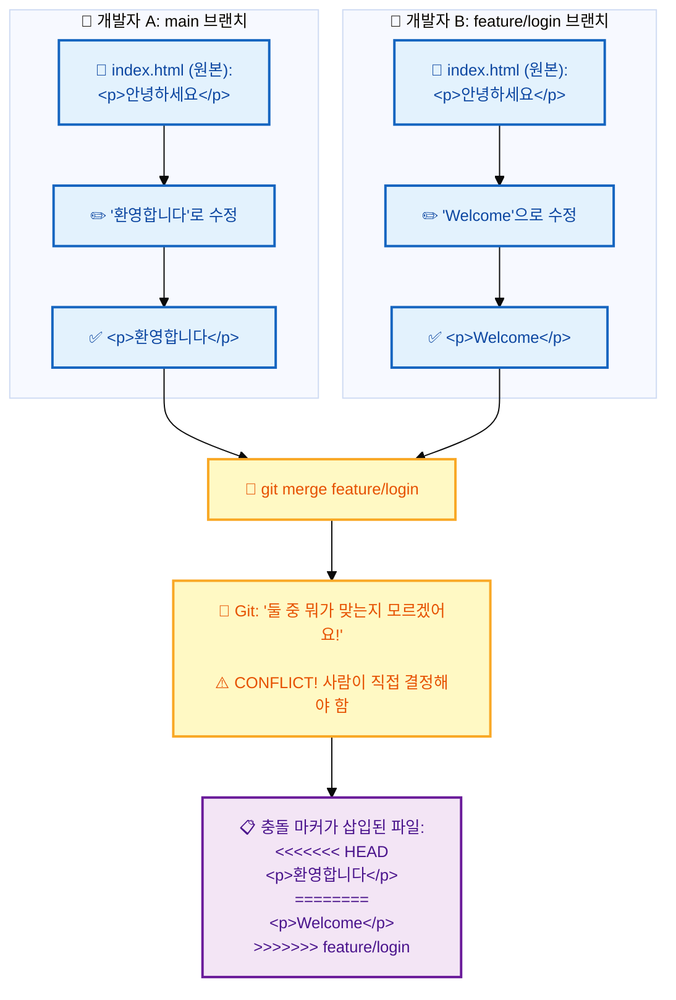

# 병합 충돌 해결

---

## 👨‍💻 실전 프로젝트: 충돌 해결 마스터하기

이번 실습에서는 의도적으로 충돌 상황을 만들어 직접 해결해보겠습니다. 충돌은 두려워할 대상이 아니라 극복해야 할 자연스러운 개발 과정입니다. 직접 충돌을 만들고 해결하는 경험을 통해, 실제 업무에서 충돌이 발생했을 때 당황하지 않고 침착하게 대처할 수 있는 능력을 키울 수 있습니다.

```bash
# 1. 실습 저장소 생성
$ mkdir conflict-practice && cd conflict-practice
$ git init
$ echo "첫 번째 줄" > conflict.txt
$ git add . && git commit -m "초기 커밋"

# 2. feature-one 브랜치 생성 및 작업
$ git switch -c feature-one
$ echo "feature-one에서 추가한 내용" >> conflict.txt
$ git add . && git commit -m "feature-one: 내용 추가"

# 3. main 브랜치로 전환 후 같은 파일 다른 부분 수정
$ git switch main
$ echo "main에서 추가한 내용" >> conflict.txt
$ git add . && git commit -m "main: 내용 추가"

# 4. feature-two 브랜치를 만들어 같은 줄 수정 (충돌 유발!)
$ git switch -c feature-two
$ echo "feature-two에서 수정한 첫 번째 줄" > conflict.txt
$ git add . && git commit -m "feature-two: 첫 번째 줄 수정"

# 5. main으로 돌아와서 feature-two 병합 시도 (충돌 발생!)
$ git switch main
$ git merge feature-two
Auto-merging conflict.txt
CONFLICT (content): Merge conflict in conflict.txt
Automatic merge failed; fix conflicts and then commit the result.

# 6. 충돌 파일 내용 확인
$ cat conflict.txt
<<<<<<< HEAD
첫 번째 줄
main에서 추가한 내용
=======
feature-two에서 수정한 첫 번째 줄
>>>>>>> feature-two

# 7. 충돌 해결: 적절한 내용으로 수정
# (파일을 열어서 아래와 같이 수정)
$ cat conflict.txt
feature-two에서 수정한 첫 번째 줄
main에서 추가한 내용

# 8. 해결 완료 및 커밋
$ git add conflict.txt
$ git commit

# 9. 브랜치 정리
$ git branch -d feature-two
```

이 실습에서 중요한 점은 충돌이 발생했을 때 Git이 보여주는 충돌 마커(`<<<<<<<`, `=======`, `>>>>>>>`)를 정확히 읽고, 어떤 내용을 최종 결과로 남길지 결정하는 것입니다. 위 예시에서는 `feature-two`의 첫 번째 줄 수정을 채택하고 `main`의 추가 내용은 유지하는 방식으로 해결했습니다. 이처럼 충돌 해결은 단순히 한쪽을 선택하는 것뿐만 아니라, 양측의 변경 사항을 모두 이해하고 최선의 결과를 만들어내는 창의적인 과정입니다.

---

## 학습 목표

- 병합 충돌이 발생하는 원인을 이해하고, 이를 두려워하지 않고 대처할 수 있습니다.
- 충돌이 발생한 파일을 확인하고, 충돌 내용을 정확히 분석할 수 있습니다.
- 충돌 마커를 활용하여 다양한 상황에 맞게 충돌을 해결할 수 있습니다.
- 충돌 해결 완료 후 병합 커밋을 생성하는 전체 과정을 수행할 수 있습니다.

---

브랜치를 병합할 때 두 브랜치에서 동일한 파일의 같은 부분을 각각 다르게 수정한 경우, Git은 어느 쪽을 선택해야 할지 결정할 수 없어 **충돌(Conflict)**이 발생합니다. 이는 자연스러운 현상이며, Git은 충돌을 해결할 수 있는 도구를 제공합니다. 병합 충돌은 처음에는 당황스러울 수 있지만, 협업 과정에서 반드시 마주하게 되는 중요한 개념이므로 우리는 이를 올바르게 이해하고 효과적으로 해결하는 방법을 알아보겠습니다. 충돌이 발생했다는 것은 여러 개발자가 동시에 같은 프로젝트에 기여하고 있다는 증거이므로, 오히려 긍정적으로 받아들이는 자세가 필요합니다.

---

## 충돌이 발생했을 때

`git merge` 명령어 실행 후 충돌이 발생하면 다음과 같은 메시지를 보게 됩니다. 자주 접하게 될 메시지이므로 미리 익숙해지는 것이 중요합니다. 충돌 메시지는 어떤 파일에서 문제가 발생했는지 정확히 알려주므로, 당황하지 말고 메시지를 주의 깊게 읽는 것이 첫 번째 단계입니다.

**충돌 상황 시각화:**



```
Auto-merging index.html
CONFLICT (content): Merge conflict in index.html
Automatic merge failed; fix conflicts and then commit the result.
```

위 다이어그램에서 볼 수 있듯이, 동일한 원본 파일을 두 개발자가 각각 다르게 수정하면 Git은 자동으로 병합을 시도하지만 충돌이 발생합니다. 이때 Git은 충돌 마커가 삽입된 파일을 작업 디렉토리에 남겨두고, 개발자에게 직접 결정을 내리라고 요청합니다. Git이 자동 병합할 수 없었다는 메시지가 나오더라도, 이는 시스템 오류가 아닌 예상된 동작이라는 점을 기억해야 합니다.

---

## 충돌이 발생한 파일 확인

충돌 메시지를 확인한 후에는 어떤 파일에서 충돌이 발생했는지부터 파악해야 합니다. 다음 명령어를 사용합니다. 여러 파일에서 동시에 충돌이 발생할 수도 있으므로, 모든 충돌 파일을 빠짐없이 확인하는 것이 중요합니다.

```bash
git status
```

**출력 예시:**
```
On branch main
You have unmerged paths.
  (fix conflicts and run "git commit")
  (use "git merge --abort" to abort the merge)

Unmerged paths:
  both modified:   index.html
```

`git status` 명령어는 충돌이 발생한 파일을 `both modified:` 상태로 표시합니다. 이는 양쪽 브랜치에서 모두 수정이 이루어졌음을 의미합니다. 실제 프로젝트에서는 여러 파일에서 충돌이 발생할 수 있으므로, `git status`로 모든 충돌 파일을 확인한 후 하나씩 해결해 나가야 합니다.

---

## 충돌 내용 확인하기

충돌이 발생한 파일을 열어보면 Git이 충돌 부분을 다음과 같이 표시해 줍니다. 이 표시를 **충돌 마커(Conflict Marker)**라고 합니다. 충돌 마커는 Git이 자동으로 삽입해주며, 어떤 부분이 충돌되었는지 시각적으로 명확히 보여줍니다.

```html
<<<<<<< HEAD
<p>현재 브랜치(main)의 내용입니다.</p>
=======
<p>병합하려는 브랜치(feature/login)의 내용입니다.</p>
>>>>>>> feature/login
```

*   `<<<<<<< HEAD`와 `=======` 사이: 현재 브랜치(main)의 내용
*   `=======`와 `>>>>>>> feature/login` 사이: 병합하려는 브랜치(feature/login)의 내용

충돌 마커의 구조를 이해하는 것이 충돌 해결의 첫걸음입니다. 위쪽은 HEAD(현재 체크아웃된 브랜치)의 내용이고, 아래쪽은 병합하려는 브랜치의 내용입니다. 우리가 해야 할 일은 이 두 내용 중 하나를 선택하거나, 두 내용을 합치거나, 혹은 완전히 새로운 내용으로 대체한 후, 모든 충돌 마커를 제거하는 것입니다.

이제 충돌 마커의 의미를 이해하였으므로, 구체적인 충돌 상황별 해결 방법을 살펴보겠습니다.

**다양한 충돌 상황 예시:**

**상황 1: 한 쪽만 선택하기**
```html
<!-- 충돌 발생 -->
<<<<<<< HEAD
<p>회원가입 페이지</p>
=======
<p>로그인 페이지</p>
>>>>>>> feature/login

<!-- 해결: 로그인 페이지로 결정 -->
<p>로그인 페이지</p>
```

**상황 2: 두 내용을 모두 합치기**
```javascript
// 충돌 발생
<<<<<<< HEAD
const color = 'blue';
=======
const color = 'red';
>>>>>>> feature/theme

// 해결: 변수명을 바꿔서 모두 유지
const primaryColor = 'blue';
const secondaryColor = 'red';
```

**상황 3: 완전히 새로운 내용으로 대체**
```python
# 충돌 발생
<<<<<<< HEAD
def calculate(x):
    return x * 2
=======
def calculate(value):
    return value * 3
>>>>>>> feature/new-math

# 해결: 완전히 새로운 구현
def calculate(price, tax_rate):
    return price * (1 + tax_rate)
```

각 상황별 해결 방법은 프로젝트의 요구사항과 개발자의 판단에 따라 달라집니다. 상황 1처럼 명확히 한쪽의 변경 사항이 올바른 경우도 있지만, 상황 2처럼 두 변경 사항을 모두 포용할 수 있는 방법을 고민해야 하는 경우도 많습니다. 때로는 상황 3처럼 기존의 두 접근 방식보다 더 나은 세 번째 해결책을 찾는 것이 최선일 수 있습니다. 충돌 해결은 단순한 기술 작업이 아니라 설계 결정을 내리는 과정임을 기억해야 합니다.

---

## 충돌 해결 과정

충돌을 해결하는 방법은 간단합니다. 다음 단계를 차례대로 따라가면 됩니다. 이 과정을 익혀두면 충돌이 발생해도 당황하지 않고 체계적으로 대처할 수 있습니다.

1.  **충돌이 발생한 파일을 엽니다.**
2.  `<<<<<<<`, `=======`, `>>>>>>>` 마커를 포함한 충돌 부분을 찾습니다.
3.  **어느 내용을 유지할지 결정합니다.**
    *   현재 브랜치의 내용만 유지하려면 병합 브랜치 부분을 삭제하고 마커도 제거합니다.
    *   병합 브랜치의 내용만 유지하려면 현재 브랜치 부분을 삭제하고 마커도 제거합니다.
    *   **두 내용을 모두 유지하거나, 새로운 내용으로 대체할 수도 있습니다.**
4.  **마커를 포함한 불필요한 줄을 모두 제거합니다.**
5.  **파일을 저장합니다.**

충돌 해결의 핵심은 충돌 마커를 포함한 모든 Git이 삽입한 줄을 반드시 제거해야 한다는 점입니다. 충돌 마커가 하나라도 남아 있으면 Git은 충돌이 해결되지 않은 것으로 간주하고 병합을 완료할 수 없습니다. 따라서 파일을 저장하기 전에 모든 충돌 마커가 제거되었는지 반드시 확인해야 합니다.

### 충돌 해결 예시

위 충돌 상황에서 두 내용을 모두 유지하기로 결정했다면, 파일을 다음과 같이 수정합니다.

```html
<p>현재 브랜치(main)의 내용입니다.</p>
<p>병합하려는 브랜치(feature/login)의 내용입니다.</p>
```

---

## 충돌 해결 완료하기

모든 충돌을 해결한 후에는 Git에 해결이 완료되었음을 알려야 합니다. 이 과정을 통해 Git은 충돌이 해결되었음을 인지하고 병합을 최종 완료합니다.

```bash
# 충돌 해결된 파일을 스테이징
git add index.html

# 병합 커밋 생성
git commit
```

`git commit`을 실행하면 자동으로 병합 커밋 메시지가 준비되어 있습니다. 저장하고 종료하면 병합이 완료됩니다. Git 2.12 버전부터는 `git merge --continue` 명령어도 사용할 수 있으며, 이 명령어는 `git commit`과 동일한 동작을 하지만 병합 과정의 일부임을 더 명확히 표현합니다.

**병합 커밋 메시지 예시:**
```
Merge branch 'feature/login'

# Conflicts:
#	index.html
#
# It looks like you may be a commit message.  The lines starting
# with '#' will be ignored, and an empty message aborts the commit.
```
기본 메시지를 그대로 사용해도 되고, 추가 설명을 덧붙여도 됩니다. 충돌 해결 방법에 대한 간략한 설명을 추가하면, 나중에 이력을 검토하는 팀원들에게 도움이 됩니다.

---

## 충돌 해결 전체 과정 종합 예시

지금까지 배운 내용을 바탕으로, 충돌 해결의 전체 과정을 하나의 예시로 종합하여 살펴보겠습니다. 이 예시는 실제 개발 현장에서 발생할 법한 구체적인 시나리오를 보여줍니다.

```bash
# 1. 병합 시도 (충돌 발생!)
$ git merge feature/payment
Auto-merging price.js
CONFLICT (content): Merge conflict in price.js
Automatic merge failed; fix conflicts and then commit the result.

# 2. 충돌 파일 확인
$ git status
both modified:   price.js

# 3. 충돌 내용 확인
$ cat price.js
<<<<<<< HEAD
const taxRate = 0.1;    // 현재 main 브랜치
=======
const taxRate = 0.15;   // feature/payment 브랜치
>>>>>>> feature/payment

# 4. price.js를 열어서 수동으로 해결
# const taxRate = 0.12; ← 12%로 타협

# 5. 해결 완료 표시
$ git add price.js

# 6. 병합 확정
$ git commit -m "세율 충돌 해결: 12%로 통일"
[main d4e5f6f] Merge branch 'feature/payment'

# 7. 병합 완료 확인
$ git log --oneline --graph -3
*   d4e5f6f Merge branch 'feature/payment'
|\
| * b2c3d4e 결제 API 연동
* | c3d4e5f 메인 페이지 수정
|/
* a1b2c3d 첫 번째 커밋
```

위 예시에서 특히 주목할 점은 4번 단계입니다. `main` 브랜치는 10%의 세율을 적용하고 있고 `feature/payment` 브랜치는 15%의 세율을 적용하고 있었습니다. 이 충돌을 해결하기 위해 두 값의 중간인 12%로 타협점을 찾은 것입니다. 이처럼 충돌 해결은 단순히 "어느 쪽이 옳은가"를 가리는 것이 아니라, 비즈니스 로직을 고려한 최선의 결정을 내리는 과정입니다.

---

## 충돌 해결 팁

실무에서 충돌을 더 효과적으로 해결하기 위한 몇 가지 팁을 소개합니다. 이 팁들을 익혀두면 충돌 해결 시간을 단축하고 품질을 높일 수 있습니다.

- **병합 도구 사용:** `git mergetool` 명령어를 사용하면 VSCode, Beyond Compare 등 외부 병합 도구를 활용할 수 있습니다. 이러한 도구들은 충돌 내용을 좌우로 나란히 비교하여 보여주고, 클릭 한 번으로 원하는 내용을 선택할 수 있는 직관적인 인터페이스를 제공합니다.
- **작은 단위로 커밋하고 자주 병합하기:** 충돌의 범위를 최소화하고 해결을 쉽게 만듭니다. 기능 브랜치를 오래 유지할수록 main 브랜치와의 차이가 커져 충돌의 규모도 함께 커집니다. 따라서 가능하면 기능을 작게 나누고 자주 병합하는 것이 충돌 관리에 유리합니다.
- **팀원과 소통하기:** 충돌이 발생한 부분에 대해 어떤 변경이 의도된 것인지 팀원과 논의하는 것이 가장 확실한 해결 방법입니다. 특히 비즈니스 로직과 관련된 충돌은 코드만 보고 판단하기 어려운 경우가 많으므로, 해당 부분을 수정한 팀원과 직접 대화하여 의도를 파악하는 것이 좋습니다.
- **두려워하지 않기:** 충돌은 자연스러운 현상입니다. `git merge --abort`로 언제든지 병합 전 상태로 돌아갈 수 있으니 부담 없이 연습해 보세요. 경험이 쌓일수록 충돌 해결에 대한 두려움은 사라지고, 오히려 코드 리뷰의 기회로 활용할 수 있게 될 것입니다.

---

## 한눈에 정리

| 개념 | 설명 |
|------|------|
| 충돌(Conflict) | 두 브랜치에서 동일한 파일의 같은 부분을 다르게 수정하여 Git이 자동 병합하지 못하는 상황 |
| 충돌 마커 | `<<<<<<<`, `=======`, `>>>>>>>` 기호로 충돌 범위와 각 브랜치의 내용을 표시 |
| HEAD 쪽 | `<<<<<<< HEAD`와 `=======` 사이 — 현재 체크아웃된 브랜치의 내용 |
| 병합 브랜치 쪽 | `=======`와 `>>>>>>> 브랜치명` 사이 — 병합하려는 브랜치의 내용 |
| 충돌 해결 방법 | 한쪽 선택, 두 내용 병합, 완전히 새로운 내용으로 대체 중에서 결정 |
| 해결 완료 명령어 | `git add <파일>` → `git commit` 또는 `git merge --continue` |
| 복구 명령어 | `git merge --abort` — 병합 전 상태로 되돌리기 |

---

## 연습 문제

1. 다음 중 병합 충돌이 발생하는 원인으로 올바른 것은 무엇입니까?
   ① 두 브랜치에서 서로 다른 파일을 수정한 경우
   ② 두 브랜치에서 동일한 파일의 같은 부분을 각각 다르게 수정한 경우
   ③ 한 브랜치에서만 파일을 수정하고 다른 브랜치에서는 수정하지 않은 경우
   ④ 두 브랜치의 커밋 기록이 완전히 동일한 경우

2. 충돌이 발생한 파일에서 `<<<<<<< HEAD`와 `=======` 사이에 위치한 내용은 어느 브랜치의 내용입니까?

3. 충돌 해결을 완료한 후 `git add`와 `git commit`을 수행해야 하는 이유를 설명해보세요.
