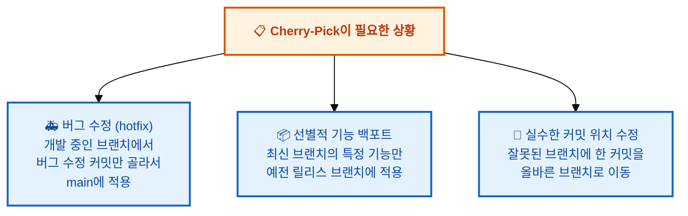
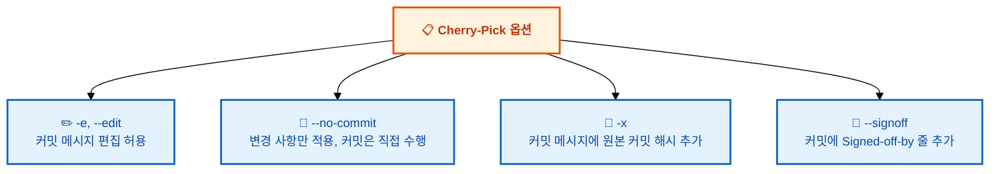

# Cherry-Pick: 특정 커밋만 골라서 가져오기

---

## 👨‍💻 실전 프로젝트: Cherry-Pick으로 원하는 커밋만 가져오기

이번 실습에서는 Cherry-Pick을 사용하여 특정 커밋만 선별적으로 가져오는 과정을 체험해보겠습니다. 특히 실수로 잘못된 브랜치에 커밋한 상황을 가정하여, Cherry-Pick과 `git reset`을 조합해 올바르게 수정하는 방법까지 연습합니다. 이 시나리오는 실제 개발에서 자주 발생하는 실수와 그 해결책을 보여줍니다.

```bash
# 1. 실습 저장소 생성
$ mkdir cherry-pick-practice && cd cherry-pick-practice
$ git init
$ echo "# Cherry-Pick Practice" > README.md
$ git add . && git commit -m "초기 커밋"

# 2. feature 브랜치 생성 후 여러 커밋 작성
$ git switch -c feature/dashboard
$ echo "그래프 라이브러리 추가" > graph.txt
$ git add . && git commit -m "대시보드: 그래프 라이브러리 추가"
$ echo "버그 수정: 데이터 로딩 오류" > bugfix.txt
$ git add . && git commit -m "버그 수정: 데이터 로딩 오류"
$ echo "차트 컴포넌트 추가" > chart.txt
$ git add . && git commit -m "대시보드: 차트 컴포넌트 추가"

# 3. 로그 확인 (가운데 커밋이 버그 수정)
$ git log --oneline
c3d4e5f (HEAD -> feature/dashboard) 대시보드: 차트 컴포넌트 추가
b2c3d4e 버그 수정: 데이터 로딩 오류    ← 이 커밋만 필요!
a1b2c3d 대시보드: 그래프 라이브러리 추가
d4e5f6g (main) 초기 커밋

# 4. main 브랜치로 전환하여 버그 수정 커밋만 Cherry-Pick
$ git switch main
$ git cherry-pick b2c3d4e
[main 9i8h7g6] 버그 수정: 데이터 로딩 오류
 Date: Mon Jul 10 14:30:00 2026 +0900
 1 file changed, 1 insertion(+), 1 deletion(-)

# 5. Cherry-Pick 결과 확인
$ git log --oneline
9i8h7g6 (HEAD -> main) 버그 수정: 데이터 로딩 오류
d4e5f6g 초기 커밋

# 6. (응용) 실수로 main에 커밋했을 때 수정하기
$ echo "핫픽스!" > hotfix.txt
$ git add . && git commit -m "긴급 핫픽스"
# 😱 알고 보니 feature 브랜치에서 작업해야 했음!
$ git switch -c feature/hotfix
$ git cherry-pick main       # main의 최신 커밋을 feature에 적용
$ git switch main
$ git reset --hard HEAD~1    # main에서 잘못된 커밋 제거
```

이 실습에서 가장 중요한 부분은 4번 단계의 `git cherry-pick b2c3d4e`입니다. `feature/dashboard` 브랜치에는 3개의 커밋이 있지만, 우리는 그중에서 버그 수정 커밋 하나만 `main` 브랜치에 적용했습니다. 이처럼 Cherry-Pick을 사용하면 전체 브랜치를 병합하지 않고도 필요한 커밋만 정확하게 골라서 적용할 수 있습니다. 6번 응용 단계는 Cherry-Pick의 또 다른 강력한 활용법으로, 잘못된 브랜치에 한 커밋을 안전하게 이동시키는 방법을 보여줍니다.

---

## 학습 목표

- Cherry-Pick의 개념과 병합 및 리베이스와의 차이점을 이해할 수 있습니다.
- Cherry-Pick이 필요한 다양한 상황을 파악하고 적절히 활용할 수 있습니다.
- `git cherry-pick` 명령어의 기본 사용법과 주요 옵션을 익힐 수 있습니다.
- Cherry-Pick 사용 시 발생할 수 있는 충돌과 주의사항을 이해하고 대처할 수 있습니다.

---

Cherry-Pick은 다른 브랜치의 **특정 커밋 하나만** 골라서 현재 브랜치에 적용하는 기능입니다. 병합(merge)이나 리베이스(rebase)처럼 브랜치 전체를 가져오는 것이 아니라, 원하는 커밋만 선별적으로 가져올 때 사용합니다. 우리는 이미 병합을 통해 브랜치 전체를 통합하는 방법을 배웠습니다. 하지만 실제 개발 현장에서는 때때로 특정 커밋만 골라서 적용해야 하는 상황이 발생합니다. 예를 들어, 기능 개발 브랜치에 포함된 버그 수정 커밋만 운영 브랜치에 긴급히 적용해야 하는 경우가 대표적입니다. 이러한 상황에서 Cherry-Pick은 매우 유용한 도구가 됩니다. 지금부터 Cherry-Pick의 개념과 활용법을 자세히 알아보겠습니다.

Cherry-Pick의 동작 방식을 이해하기 위해 아래 Mermaid 다이어그램을 살펴보겠습니다. `feature/login` 브랜치에는 C3, C4, C5라는 세 개의 커밋이 있고, 그중 C4 커밋(유효성 검사)만 `main` 브랜치로 Cherry-Pick되는 과정을 보여줍니다.

```mermaid
%%{init: {'theme': 'base', 'themeVariables': {'fontSize': '13px'}}}%%
gitGraph
   commit id: "C1"
   commit id: "C2"
   branch feature/login
   checkout feature/login
   commit id: "C3 - 로그인 폼"
   commit id: "C4 - 유효성 검사"
   commit id: "C5 - 스타일 적용"
   checkout main
   commit id: "C6"
   cherry-pick id: "C4"
```

---

## Cherry-Pick이 필요한 상황

Cherry-Pick이 유용하게 사용되는 구체적인 상황들을 살펴보겠습니다. 각 상황은 실제 개발 현장에서 자주 마주치는 시나리오로, Cherry-Pick을 적재적소에 활용할 수 있는 능력을 기르는 데 도움이 됩니다.



첫 번째 상황인 **버그 수정(Hotfix)**이 가장 일반적인 사용 사례입니다. 기능 개발 브랜치에서 작업 중 발견한 버그를 수정했는데, 이 수정 사항을 기능 개발이 완료될 때까지 기다리지 않고 운영 중인 main 브랜치에 먼저 적용해야 할 때 Cherry-Pick이 사용됩니다. 두 번째로 **선별적 기능 백포트**는 최신 버전에 추가된 특정 기능만 이전 릴리스 버전의 브랜치에 적용해야 할 때 유용합니다. 세 번째로 **실수한 커밋 위치 수정**은 잘못된 브랜치에 커밋한 경우 Cherry-Pick으로 올바른 브랜치로 옮긴 후 원래 브랜치에서 해당 커밋을 제거하는 방식으로 해결합니다.

---

## 기본 사용법

```bash
git cherry-pick <커밋해시>
```

이 명령어는 지정된 커밋의 변경 사항을 현재 브랜치에 적용합니다. 커밋 해시는 `git log` 명령어로 확인할 수 있으며, 일반적으로 7자리 이상의 짧은 해시를 사용합니다. Cherry-Pick이 성공하면 새로운 커밋이 현재 브랜치에 자동으로 생성됩니다.

### 예시: 버그 수정 커밋만 main에 적용하기

Cherry-Pick의 가장 대표적인 사용 사례인 버그 수정 커밋만 골라서 적용하는 방법을 살펴보겠습니다. 아래 예시는 `feature/payment` 브랜치에 있는 버그 수정 커밋만 `main` 브랜치로 가져오는 과정을 보여줍니다. 이렇게 하면 기능 개발이 완료되지 않은 상태에서도 긴급한 버그 수정만 먼저 배포할 수 있습니다.

```bash
# 현재 브랜치 확인 (main)
$ git branch
* main
  feature/payment

# feature/payment 브랜치에서 버그 수정 커밋 확인
$ git log --oneline feature/payment
d4e5f6f 결제 API 연동
a1b2c3d 버그 수정: 가격 계산 오류   ← 이 커밋만 필요!
g7h8i9j 결제 모듈 초안

# main에서 특정 커밋만 cherry-pick
$ git cherry-pick a1b2c3d
[main 9i8h7g6] 버그 수정: 가격 계산 오류
 Date: Mon Jul 10 14:30:00 2026 +0900
 1 file changed, 2 insertions(+), 1 deletion(-)

# 결과: main에 버그 수정만 적용됨 (결제 모듈 전체는 아직)
$ git log --oneline -3
9i8h7g6 (HEAD -> main) 버그 수정: 가격 계산 오류
f4e5d6c README 업데이트
k1l2m3n 첫 번째 커밋
```

### 여러 커밋 한 번에 Cherry-Pick

하나의 커밋뿐만 아니라 여러 개의 커밋을 한 번에 가져올 수도 있습니다. 연속된 커밋을 가져올 때는 범위 지정 문법(`..`)을 사용하고, 떨어진 여러 커밋을 가져올 때는 해시를 나열하는 방식을 사용합니다.

```bash
# 연속된 커밋 범위 지정
$ git cherry-pick a1b2c3d..d4e5f6f

# 또는 하나씩 나열
$ git cherry-pick a1b2c3d d4e5f6f g7h8i9j
```

범위 지정 시 `a1b2c3d..d4e5f6f`는 `a1b2c3d` 이후부터 `d4e5f6f`까지의 커밋을 의미합니다. 즉, `a1b2c3d` 커밋 자체는 포함되지 않습니다. 만약 `a1b2c3d`부터 포함하려면 `a1b2c3d^..d4e5f6f`와 같이 `^` 기호를 사용해야 합니다.

---

## Cherry-Pick 주의사항

Cherry-Pick은 매우 편리한 기능이지만, 사용할 때 몇 가지 주의해야 할 점이 있습니다. 이를 미리 알아두면 예상치 못한 문제를 방지할 수 있습니다. Cherry-Pick은 단순해 보이지만 내부적으로는 패치를 적용하는 과정이므로, 때로는 예상치 못한 동작을 할 수 있습니다.

### 1. 충돌이 발생할 수 있음

Cherry-Pick도 병합이므로 충돌이 발생할 수 있습니다. 해결 방법은 일반 병합 충돌과 동일합니다. Cherry-Pick은 원본 커밋의 변경 사항을 현재 브랜치에 적용하는 과정에서 현재 브랜치의 파일 상태와 충돌할 수 있습니다.

```bash
# 충돌 발생 시
$ git cherry-pick a1b2c3d
error: could not apply a1b2c3d... 버그 수정: 가격 계산 오류
hint: resolve the conflicts and run "git cherry-pick --continue"

# 충돌 해결 후 계속
$ git add .
$ git cherry-pick --continue

# 또는 cherry-pick 취소
$ git cherry-pick --abort
```

### 2. 커밋 해시가 달라짐

Cherry-Pick으로 가져온 커밋은 원본과 **다른 해시**를 갖습니다. 내용은 같지만 새로운 커밋으로 간주됩니다. 이는 Cherry-Pick이 원본 커밋을 그대로 복사하는 것이 아니라, 원본 커밋의 변경 사항(diff)을 현재 브랜치에 새로 적용하기 때문입니다. 따라서 원본 커밋과 Cherry-Pick된 커밋은 내용은 동일할 수 있지만, 부모 커밋과 적용 시점이 다르므로 완전히 다른 커밋 객체가 됩니다.

```bash
# 원본 커밋
a1b2c3d 버그 수정: 가격 계산 오류   (feature/payment)

# Cherry-Pick된 커밋 (내용은 같지만 해시가 다름)
9i8h7g6 버그 수정: 가격 계산 오류   (main)
```

### 3. 의존성이 있는 커밋은 함께 가져오기

커밋 A가 커밋 B에 의존한다면, A만 cherry-pick하면 문제가 생길 수 있습니다. 이런 경우 연관된 커밋들을 함께 가져오는 것이 좋습니다. 예를 들어, 어떤 함수를 새로 추가한 커밋과 그 함수를 사용하는 버그 수정 커밋이 있다면, 두 커밋을 함께 Cherry-Pick해야 합니다. 그렇지 않으면 버그 수정 커밋에서 참조하는 함수가 존재하지 않아 컴파일 에러가 발생할 수 있습니다.

---

## Cherry-Pick 활용: 잘못된 브랜치에 한 커밋 수정

실수로 잘못된 브랜치에 커밋을 했다면 어떻게 해야 할까요? Cherry-Pick을 활용하면 이 문제를 간단히 해결할 수 있습니다. 이 시나리오는 매우 흔하게 발생하는 실수이므로, 해결 방법을 숙지해두면 많은 도움이 됩니다.

```bash
# 실수: main에서 직접 수정해버림
$ git switch main
$ echo "hotfix" > urgent.txt
$ git add . && git commit -m "긴급 수정"

# 😱 알고 보니 feature 브랜치에서 작업해야 했음!

# 방법 1: Cherry-Pick + Reset (추천)
$ git switch feature/hotfix
$ git cherry-pick main       # main의 마지막 커밋을 feature에 적용
$ git switch main
$ git reset --hard HEAD~1    # main에서 잘못된 커밋 제거

# 방법 2: 단순 복사
$ git switch feature/hotfix
$ git cherry-pick main       # main의 최신 커밋을 가져옴
```

방법 1이 추천되는 이유는 Cherry-Pick으로 올바른 브랜치에 커밋을 적용한 후, 원래 브랜치(main)에서 `git reset --hard HEAD~1`로 잘못된 커밋을 완전히 제거하기 때문입니다. 이렇게 하면 마치 처음부터 올바른 브랜치에서 작업한 것처럼 깔끔한 이력을 유지할 수 있습니다. 방법 2는 단순히 커밋을 복사하기만 할 뿐 원래 브랜치의 잘못된 커밋은 그대로 남아 있습니다.

---

## Cherry-Pick 옵션

Cherry-Pick은 다양한 옵션을 제공하여 상황에 맞게 유연하게 사용할 수 있습니다. 각 옵션의 용도를 정확히 이해하면 더욱 효과적으로 Cherry-Pick을 활용할 수 있습니다.



```bash
# 원본 추적 정보 포함
$ git cherry-pick -x a1b2c3d

# 커밋 없이 변경 사항만 적용
$ git cherry-pick --no-commit a1b2c3d
$ git add .
$ git commit -m "직접 작성한 커밋 메시지"
```

`-x` 옵션은 Cherry-Pick된 커밋의 메시지 하단에 `(cherry picked from commit a1b2c3d...)`라는 줄을 자동으로 추가합니다. 이는 원본 커밋이 어디에서 왔는지 추적할 수 있게 해주므로, 특히 여러 브랜치를 운영하는 대규모 프로젝트에서 유용합니다. `--no-commit` 옵션은 변경 사항은 적용하되 자동 커밋은 하지 않으므로, Cherry-Pick된 내용을 직접 검토하거나 여러 Cherry-Pick을 하나의 커밋으로 합칠 때 사용합니다.

---

## 실습 시나리오

지금까지 배운 내용을 종합하여 실제 개발 상황과 유사한 시나리오로 실습해보겠습니다. 이 시나리오는 기능 개발 중 긴급 버그 수정이 필요한 상황에서 Cherry-Pick을 어떻게 활용하는지 보여줍니다.

```bash
# 1. feature 브랜치에서 작업 중
$ git switch -c feature/dashboard

# 2. 긴급 버그 수정 커밋 생성
$ echo "fix" > bugfix.js
$ git add . && git commit -m "대시보드 버그 수정"

# 3. 그 외 기능 개발 계속...
$ echo "feature" > chart.js
$ git add . && git commit -m "차트 기능 추가"

# 4. 갑자기! 운영 서버에 버그 수정이 필요함
$ git switch main

# 5. 버그 수정 커밋만 골라서 적용
$ git cherry-pick abc1234   # feature/dashboard의 버그 수정 커밋

# 6. 배포 준비 완료! feature 브랜치의 나머지 기능은 아직 개발 중
```

위 시나리오에서 5번 단계의 `git cherry-pick abc1234`가 핵심입니다. `feature/dashboard` 브랜치에는 버그 수정 커밋과 차트 기능 커밋이 모두 포함되어 있지만, 우리는 버그 수정 커밋만 `main` 브랜치에 적용했습니다. 이렇게 하면 아직 개발 중인 차트 기능과 관계없이 버그 수정만 별도로 배포할 수 있습니다. 만약 전체 브랜치를 병합했다면 개발 중인 차트 기능까지 함께 배포되었을 것입니다.

---

## 한눈에 정리

| 개념 | 설명 |
|------|------|
| Cherry-Pick | 다른 브랜치의 특정 커밋 하나만 골라서 현재 브랜치에 적용하는 기능 |
| 사용 상황 | 버그 수정(hotfix) 선별 적용, 기능 백포트, 잘못된 브랜치의 커밋 이동 |
| 기본 명령어 | `git cherry-pick <커밋해시>` |
| 충돌 처리 | `git cherry-pick --continue`(계속), `--abort`(취소), `--skip`(건너뛰기) |
| 해시 변경 | Cherry-Pick된 커밋은 원본과 다른 새로운 해시를 가짐 |
| 의존성 주의 | 의존 관계가 있는 커밋은 함께 Cherry-Pick해야 함 |
| 주요 옵션 | `-e`(메시지 편집), `--no-commit`(변경만), `-x`(원본 해시 추적) |

---

## 연습 문제

1. Cherry-Pick과 `git merge`의 가장 큰 차이점은 무엇입니까?
   ① Cherry-Pick은 충돌이 발생하지 않는다.
   ② Cherry-Pick은 특정 커밋만 선별적으로 가져올 수 있다.
   ③ Cherry-Pick은 원격 저장소가 필요하다.
   ④ Cherry-Pick은 커밋 해시가 변경되지 않는다.

2. Cherry-Pick으로 가져온 커밋이 원본 커밋과 다른 해시를 갖는 이유는 무엇인지 설명해보세요.

3. 실수로 main 브랜치에 커밋을 했는데, 이 커밋이 feature 브랜치에 있어야 하는 상황입니다. Cherry-Pick을 활용하여 이 문제를 어떻게 해결할 수 있을지 순서대로 서술해보세요.

---

📌 정답 및 해설

**문제 1 정답 및 해설:**

정답은 **② Cherry-Pick은 특정 커밋만 선별적으로 가져올 수 있다**입니다. `git merge`는 두 브랜치의 전체 커밋 히스토리를 병합하는 반면, Cherry-Pick(`git cherry-pick`)은 특정 커밋 하나만을 골라서 현재 브랜치에 적용합니다. Cherry-Pick은 "저 브랜치의 그 커밋만 필요해"라는 상황에서 사용됩니다. Cherry-Pick도 충돌이 발생할 수 있으므로 ①은 틀렸습니다. Cherry-Pick은 로컬에서도 가능하므로 원격 저장소가 필요하지 않아 ③도 틀렸습니다. Cherry-Pick으로 가져온 커밋은 새로운 커밋이므로 원본과 다른 해시를 가지므로 ④도 틀렸습니다. Cherry-Pick은 특정 버그 수정이나 기능만 골라서 적용해야 할 때 매우 유용한 명령어입니다.

**문제 2 정답 및 해설:**

Cherry-Pick으로 가져온 커밋이 원본 커밋과 다른 해시를 갖는 이유는 커밋 해시가 커밋의 모든 메타데이터를 기반으로 계산되기 때문입니다. 커밋 해시는 파일 스냅샷, 부모 커밋, 커밋 메시지, 작성자 정보, 커미터 정보, 타임스탬프 등을 입력으로 SHA-1 해시 함수를 통해 생성됩니다. Cherry-Pick으로 생성된 새 커밋은 원본 커밋과 동일한 파일 변경 내용과 커밋 메시지를 가지지만, 부모 커밋과 타임스탬프가 다릅니다. 원본 커밋의 부모는 원본 브랜치의 이전 커밋이지만, 새 커밋의 부모는 Cherry-Pick을 실행한 현재 브랜치의 최신 커밋입니다. 따라서 동일한 변경 사항이라도 메타데이터가 다르므로 완전히 다른 해시 값이 생성됩니다.

**문제 3 정답 및 해설:**

실수로 main 브랜치에 커밋한 것을 feature 브랜치로 옮기려면 Cherry-Pick과 reset을 조합하여 해결할 수 있습니다. 먼저 feature 브랜치로 전환한 후(`git switch feature`), main 브랜치에서 실수로 만든 커밋의 해시를 확인하여 `git cherry-pick <커밋해시>`로 해당 커밋을 feature 브랜치에 적용합니다. 그 다음 main 브랜치로 돌아가서(`git switch main`), `git reset --hard HEAD~1`로 실수한 커밋을 제거합니다. 이때 `git reset --hard`를 사용하므로 로컬에서만 작업 중이어야 하며, 이미 원격에 푸시된 경우에는 `git revert`를 사용해야 합니다. 최종적으로 feature 브랜치에서 `git push`를, main 브랜치에서 `git push -f`(또는 `git revert`)로 원격 저장소를 갱신합니다. 이 작업은 커밋 히스토리를 변경하므로 혼자 작업하는 브랜치에서만 안전하게 수행할 수 있습니다.
