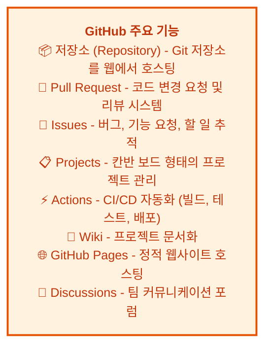
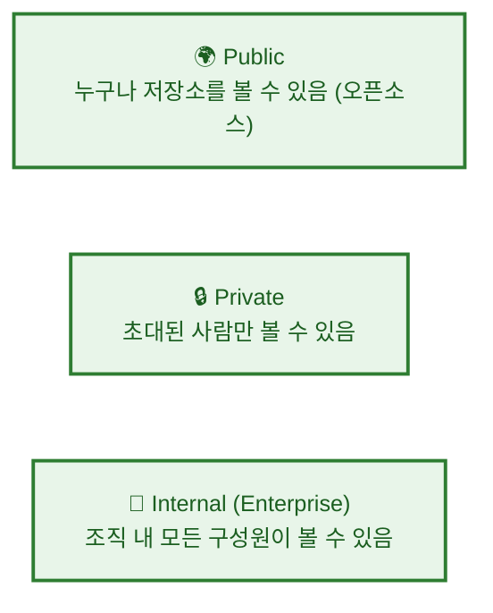

# GitHub 소개

---

## 👨‍💻 실전 프로젝트: GitHub 저장소 만들고 관리하기

이번 실전 프로젝트에서는 처음 GitHub 계정을 만들고, 실제로 저장소를 생성한 후, 저장소 설정을 관리하는 전 과정을 직접 경험해보겠습니다. 단순히 개념을 배우는 것을 넘어서, 실제 협업 환경에서 사용하는 저장소 관리 기술을 익히는 것이 목표입니다. 아래 단계를 따라 하면서 GitHub의 기본적인 사용법을 완전히 익힐 수 있습니다.

### 1단계: GitHub 계정 생성하기

GitHub를 사용하기 위한 첫걸음은 계정을 만드는 것입니다. [github.com](https://github.com)에 접속하여 오른쪽 상단의 **Sign up** 버튼을 클릭합니다. 이후 이메일 주소, 사용자명, 비밀번호를 입력하고, 전송된 인증 이메일을 확인하여 계정을 활성화합니다. 계정이 활성화되면 GitHub의 모든 기능을 자유롭게 사용할 수 있습니다.

### 2단계: 첫 번째 저장소(Repository) 생성하기

로그인한 후 화면 오른쪽 상단의 **+** 아이콘을 클릭하고 **New repository**를 선택합니다. 저장소 이름은 `my-first-repo`로 입력하고, 설명란에는 "GitHub 학습을 위한 첫 번째 저장소입니다"라고 작성합니다. **Public** 옵션을 선택한 후 **Add a README file**에 체크하고, **Create repository** 버튼을 클릭하여 저장소를 생성합니다.

### 3단계: 저장소 설정 탐색하기

생성된 저장소 페이지에서 상단의 **Settings** 탭으로 이동합니다. 왼쪽 메뉴에서 **General** 아래의 다양한 설정 항목을 살펴보면서 저장소 이름 변경, 기본 브랜치 이름 변경, 가시성 전환 등의 옵션을 확인합니다. 특히 **Danger Zone** 영역에서는 저장소 삭제, 가시성 변경 등 중요한 작업을 수행할 수 있음을 기억해둡니다.

### 4단계: Collaborator 초대하기

Settings > **Collaborators** 메뉴에서 **Add people** 버튼을 클릭하여 팀원을 저장소에 초대할 수 있습니다. 초대된 협업자는 저장소에 직접 코드를 푸시하고, 이슈를 생성하며, PR을 관리할 수 있는 권한을 가지게 됩니다. 이 기능은 팀 프로젝트에서 필수적으로 사용되므로 반드시 숙지해둡니다.

### 5단계: GitHub Pages로 웹사이트 배포하기

Settings > **Pages** 메뉴로 이동하여 **Source**를 **Deploy from a branch**로 선택하고, 브랜치를 `main`으로 지정한 후 `/ (root)` 폴더를 선택합니다. 저장소에 `index.html` 파일을 생성하고 간단한 HTML 코드를 작성하면, `https://username.github.io/my-first-repo` 주소로 웹사이트가 자동으로 배포됩니다. 이를 통해 GitHub가 단순한 코드 저장소를 넘어 정적 웹사이트 호스팅 기능까지 제공한다는 것을 직접 확인할 수 있습니다.

---

## 학습 목표

- GitHub의 개념과 역할을 이해하고 설명할 수 있습니다
- GitHub 계정을 생성하고 저장소를 만들 수 있습니다
- GitHub의 주요 기능과 저장소 설정을 이해합니다
- README와 .gitignore 파일의 중요성을 이해합니다

---

GitHub는 단순한 Git 저장소 호스팅 서비스를 넘어, 전 세계 개발자들이 협업하고 코드를 공유하는 플랫폼입니다. 2008년에 출시된 이후 GitHub는 오픈소스 생태계의 중심으로 자리 잡았으며, 현재는 전 세계 수억 명의 개발자가 사용하는 가장 큰 개발자 플랫폼으로 성장하였습니다. 우리는 GitHub를 통해 혼자 작업할 때는 경험할 수 없었던 체계적인 협업, 코드 리뷰, 자동화된 테스트와 배포까지 가능하게 됩니다. 예를 들어, 여러 명의 개발자가 동시에 같은 프로젝트에서 작업하더라도 Pull Request와 브랜치 전략을 통해 충돌 없이 안전하게 코드를 통합할 수 있습니다. 이번 장에서는 GitHub가 무엇인지, 왜 중요한지, 그리고 어떻게 활용하는지에 대해 자세히 알아보겠습니다.

---

## GitHub 계정 만들기

GitHub를 사용하기 위한 첫걸음은 계정을 생성하는 것입니다. 아래 단계에 따라 따라 해보겠습니다. 계정 생성은 무료이며, 공개 저장소를 무제한으로 만들 수 있는 Free 플랜이 제공됩니다.

1. [github.com](https://github.com)에 방문하여 **Sign up** 클릭
2. 이메일 주소, 비밀번호, 사용자명 입력
3. 이메일 인증 완료 후 계정 활성화

계정을 생성할 때는 실제로 사용할 이메일 주소를 입력하는 것이 중요합니다. GitHub는 이메일을 통해 알림, 비밀번호 재설정, 보안 관련 정보를 전송하기 때문입니다. 또한 사용자명은 향후 저장소 URL(`https://github.com/username/repo-name`)의 일부가 되므로 신중하게 선택하는 것이 좋습니다.

---

## GitHub 주요 기능

계정을 생성하였다면, 이제 GitHub가 제공하는 다양한 기능들을 살펴보겠습니다. GitHub는 단순한 코드 저장소를 넘어 개발 생명주기 전반을 관리할 수 있는 도구를 제공합니다. 이러한 도구들은 프로젝트의 기획부터 개발, 테스트, 배포, 유지보수에 이르기까지 모든 단계에서 활용됩니다. 각 기능은 독립적으로 사용할 수도 있지만, 서로 유기적으로 연결되어 더욱 강력한 효과를 발휘합니다.



위 다이어그램에서 볼 수 있듯이, GitHub는 저장소 호스팅을 중심으로 Pull Request, Issues, Projects, Actions 등 다양한 도구를 하나의 플랫폼에서 통합 제공합니다. 이러한 통합은 개발 도구 간의 전환 비용을 크게 줄여주며, 모든 작업 내역이 하나의 플랫폼에 기록되므로 투명한 협업이 가능합니다. 다음 절에서는 이 중 가장 기본이 되는 저장소 생성부터 차근차근 알아보겠습니다.

---

## GitHub 저장소 만들기

GitHub의 주요 기능에 대해 살펴보았습니다. 이제 직접 GitHub 저장소를 만들어 보겠습니다. 저장소를 생성하는 방법은 크게 두 가지가 있습니다. 첫 번째는 GitHub 웹사이트에서 새 저장소를 만든 후 로컬에 클론하여 사용하는 방식이고, 두 번째는 로컬에서 이미 작업 중인 프로젝트를 GitHub에 연결하는 방식입니다. 각 방식에는 장단점이 있으므로 상황에 맞게 선택하여 사용합니다.

```bash
# 방법 1: GitHub에서 새 저장소 생성 후 로컬에 clone
# 1) github.com에서 "New repository" 버튼 클릭
# 2) 저장소 이름 입력 (예: my-project)
# 3) "Create repository" 클릭
# 4) 로컬에서 clone

$ git clone https://github.com/username/my-project.git
$ cd my-project
$ echo "# My Project" > README.md
$ git add . && git commit -m "첫 커밋"
$ git push origin main
```

방법 1은 새로운 프로젝트를 시작할 때 적합합니다. GitHub에서 먼저 저장소를 만들면 README, .gitignore, 라이선스 파일을 초기화할 때 편리하게 설정할 수 있습니다.

```bash
# 방법 2: 로컬 저장소를 GitHub에 연결
$ mkdir my-project && cd my-project && git init
$ echo "# My Project" > README.md
$ git add . && git commit -m "첫 커밋"

# GitHub에서 빈 저장소 생성 후:
$ git remote add origin https://github.com/username/my-project.git
$ git push -u origin main
```

방법 2는 이미 로컬에서 작업 중인 프로젝트를 GitHub에 업로드할 때 사용합니다. `git remote add` 명령어로 로컬 저장소와 GitHub 저장소를 연결한 후, `git push -u origin main`으로 처음 푸시하면 이후부터는 단순히 `git push`만으로도 변경 사항을 업로드할 수 있습니다.

---

## 저장소 설정 화면 둘러보기

저장소를 생성하였다면, 이제 저장소 페이지의 각 탭이 무엇을 의미하는지 알아보겠습니다. GitHub 저장소 상단에는 프로젝트 관리에 필요한 다양한 탭이 배치되어 있으며, 각 탭은 특정 작업을 수행하는 데 최적화되어 있습니다. 이 탭들을 이해하면 GitHub를 훨씬 효율적으로 활용할 수 있습니다.

GitHub 저장소 페이지의 주요 탭:

```
Code        → 저장소 파일 브라우저
Issues      → 버그 및 기능 요청 관리
Pull requests → 코드 리뷰 관리
Actions     → CI/CD 워크플로우
Projects    → 칸반 보드
Wiki        → 문서
Security    → 보안 취약점 점검
Insights    → 저장소 통계 (컨트리뷰터, 트래픽 등)
Settings    → 저장소 설정 (브랜치 보호, 협업자 등)
```

**Code** 탭은 저장소의 기본 페이지로, 브랜치별 파일 구조를 탐색하고 커밋 히스토리를 확인할 수 있습니다. **Issues**와 **Pull requests** 탭은 각각 버그 추적과 코드 리뷰를 담당하며, 프로젝트 협업의 핵심 역할을 수행합니다. **Actions** 탭은 CI/CD 파이프라인의 실행 결과를 시각적으로 보여주며, **Projects** 탭은 칸반 보드 형태로 작업 진행 상황을 한눈에 파악할 수 있게 해줍니다. **Settings** 탭은 저장소 관리자만 접근할 수 있는 중요한 설정들이 모여 있으므로 주의 깊게 살펴볼 필요가 있습니다.

---

## 저장소 가시성 (Visibility)

저장소의 각 기능에 대해 알아보았습니다. 다음으로 저장소의 공개 범위, 즉 가시성에 대해 알아보겠습니다. GitHub 저장소는 목적에 따라 공개 범위를 설정할 수 있으며, 이는 프로젝트의 성격과 보안 요구사항에 따라 결정됩니다. 가시성 설정은 저장소 생성 시점뿐만 아니라 이후에도 언제든지 변경할 수 있습니다.



Public 저장소는 오픈소스 프로젝트에 적합하며, 검색 엔진에 노출되어 전 세계 개발자들이 발견하고 기여할 수 있습니다. Private 저장소는 회사 내부 프로젝트나 아직 공개되지 않은 개인 프로젝트에 사용하며, 초대된 협업자만 접근할 수 있어 보안에 유리합니다. Internal 저장소는 GitHub Enterprise 플랜에서 제공되는 기능으로, 조직 내 모든 구성원이 접근 가능하지만 외부에는 공개되지 않는 중간 단계의 가시성입니다. Free 플랜 사용자는 무제한의 Public 저장소와 제한된 수의 Private 저장소를 사용할 수 있습니다.

---

## README와 .gitignore

저장소의 가시성까지 설정하였다면, 이제 저장소를 더욱 체계적으로 관리하기 위한 README와 .gitignore 파일에 대해 알아보겠습니다. GitHub는 저장소 생성 시 README와 .gitignore 파일을 자동으로 생성할 수 있으며, 이 두 파일은 모든 프로젝트에서 가장 기본적이면서도 중요한 역할을 담당합니다.

**README.md:** 프로젝트 소개, 설치 방법, 사용법 등을 Markdown으로 작성합니다. GitHub는 README.md 파일을 저장소 메인 페이지에 자동으로 렌더링하여 보여주므로, 방문자에게 프로젝트에 대한 첫인상을 결정짓는 중요한 요소입니다.

** .gitignore:** Git이 추적하지 않을 파일 패턴을 정의합니다. 예를 들어, Node.js 프로젝트의 `node_modules/` 디렉토리나 컴파일된 바이너리 파일, 환경 변수가 담긴 `.env` 파일 등을 .gitignore에 등록하여 실수로 저장소에 커밋되는 것을 방지합니다.

```bash
# .gitignore 예시
node_modules/      # Node.js 의존성
.env               # 환경 변수 (비밀 키)
*.log              # 로그 파일
dist/              # 빌드 결과물
.DS_Store          # macOS 시스템 파일
```

.gitignore 파일을 올바르게 설정하면 저장소의 크기를 최소화하고, 불필요한 파일이 버전 관리에 포함되는 것을 방지할 수 있습니다. 또한 보안 측면에서도 중요한데, API 키나 데이터베이스 비밀번호와 같은 민감 정보가 포함된 파일을 .gitignore에 등록하면 실수로 공개 저장소에 업로드되는 사고를 예방할 수 있습니다. GitHub는 다양한 언어와 프레임워크에 맞는 .gitignore 템플릿을 저장소 생성 시 제공하므로, 이를 활용하면 더욱 편리하게 설정할 수 있습니다.

---

## 한눈에 정리

| 개념 | 설명 |
|------|------|
| GitHub | Git 저장소를 호스팅하는 웹 기반 플랫폼으로, 협업 도구와 CI/CD 기능을 통합 제공합니다 |
| 저장소 (Repository) | 프로젝트 파일과 버전 정보를 저장하는 공간으로, 모든 GitHub 활동의 기본 단위입니다 |
| Public 저장소 | 누구나 볼 수 있는 공개 저장소로, 오픈소스 프로젝트에 주로 사용됩니다 |
| Private 저장소 | 초대된 사람만 접근 가능한 비공개 저장소로, 내부 프로젝트에 사용됩니다 |
| README.md | 프로젝트 소개와 사용법을 Markdown으로 작성하는 파일로, 저장소의 첫인상을 결정합니다 |
| .gitignore | Git 추적에서 제외할 파일 패턴을 정의하는 파일로, 보안과 저장소 크기 최적화에 중요합니다 |

---

## 연습 문제

1. GitHub 저장소를 생성하는 두 가지 방법을 설명하고, 각각 어떤 상황에 적합한지 서술해보세요.
2. Public 저장소와 Private 저장소의 차이점을 각각의 사용 사례와 함께 설명해보세요.
3. .gitignore 파일이 필요한 이유를 보안과 저장소 관리 측면에서 자신의 언어로 서술해보세요.
4. GitHub Pages를 사용하여 개인 포트폴리오 웹사이트를 배포하는 과정을 단계별로 정리해보세요.

---

📌 정답 및 해설

**문제 1 정답 및 해설:**

GitHub 저장소를 생성하는 두 가지 방법은 웹 인터페이스와 GitHub CLI(`gh`)를 사용하는 것입니다. 웹 인터페이스 방식은 GitHub 웹사이트에 로그인하여 우측 상단의 "+" 버튼 혹은 저장소 탭의 "New" 버튼을 클릭하고, 저장소 이름, 설명, 공개 범위를 설정한 후 생성하는 방법입니다. 이 방식은 직관적이고 GUI로 조작할 수 있어 초보자에게 적합합니다. GitHub CLI 방식은 터미널에서 `gh repo create <이름> --public --clone` 명령어를 사용하는 방법으로, 명령어 한 줄로 저장소 생성과 동시에 로컬 클론까지 완료할 수 있습니다. 이 방식은 터미널 워크플로우에 익숙한 개발자나 자동화 스크립트에서 저장소를 생성할 때 적합합니다.

**문제 2 정답 및 해설:**

Public 저장소는 모든 사람이 코드를 볼 수 있고, fork하여 기여할 수 있으며, 검색 엔진에도 노출됩니다. 주로 오픈소스 프로젝트나 공개용 라이브러리, 개인 포트폴리오 프로젝트에 사용됩니다. 반면 Private 저장소는 지정된 협업자만 접근할 수 있고, 외부에서는 저장소의 존재 자체를 알 수 없습니다. 주로 기업의 내부 프로젝트, 비공개 소스코드, 클라이언트 작업, 또는 아직 공개할 준비가 되지 않은 개인 프로젝트에 사용됩니다. GitHub의 무료 플랜에서는 Public 저장소는 무제한으로, Private 저장소도 일정 수까지 무료로 사용할 수 있습니다. 저장소의 공개 여부는 프로젝트의 성격과 요구사항에 따라 신중하게 결정해야 합니다.

**문제 3 정답 및 해설:**

`.gitignore` 파일은 Git이 특정 파일이나 디렉토리를 추적하지 않도록 지정하는 설정 파일입니다. 보안 측면에서는 비밀번호, API 키, 환경 변수 파일(.env) 등 민감한 정보가 포함된 파일이 실수로 저장소에 커밋되어 외부에 노출되는 것을 방지합니다. 저장소 관리 측면에서는 컴파일된 바이너리, 의존성 패키지(node_modules/, vendor/), 로그 파일, 운영체제 생성 파일(.DS_Store, Thumbs.db), IDE 설정 파일(.vscode/, .idea/) 등 버전 관리가 필요 없는 파일을 제외하여 저장소를 깔끔하게 유지할 수 있습니다. `.gitignore`를 적절히 설정하면 저장소의 크기를 줄이고, `git status` 출력을 의미 있는 변경 사항만 표시되도록 하여 개발 효율성을 높일 수 있습니다.

**문제 4 정답 및 해설:**

GitHub Pages를 사용하여 개인 포트폴리오 웹사이트를 배포하는 과정은 다음과 같습니다. 첫째, GitHub에 `<username>.github.io` 형식으로 새 저장소를 생성합니다(예: `your-username.github.io`). 둘째, 로컬에서 웹사이트 파일(HTML, CSS, JS)을 작성하고 `git add`, `git commit`, `git push`로 원격 저장소에 푸시합니다. 셋째, 저장소의 Settings > Pages 메뉴에서 배포 소스를 main 브랜치 또는 /docs 폴더로 설정합니다. 넷째, 몇 분 후 `https://<username>.github.io` 주소로 웹사이트가 자동으로 배포되어 접속할 수 있게 됩니다. GitHub Pages는 정적 웹사이트 호스팅을 무료로 제공하며, Jekyll과 같은 정적 사이트 생성기와 연동하여 더욱 풍부한 사이트를 구축할 수도 있습니다.
