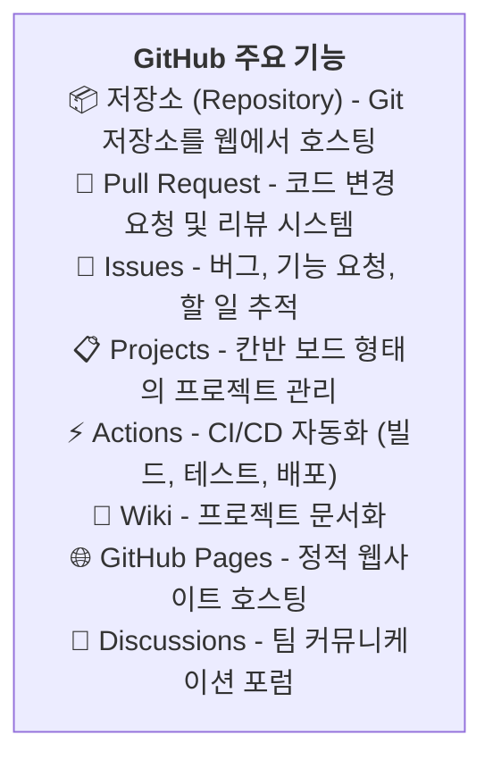
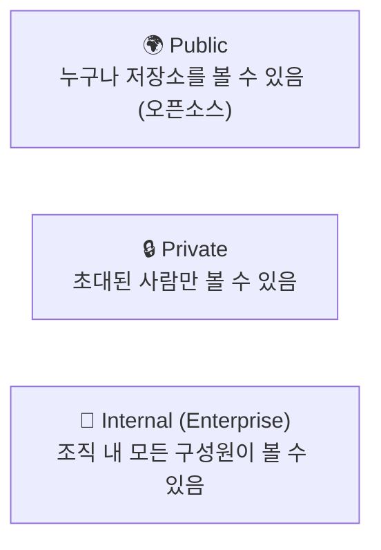

# GitHub 소개

> **⚠️ 경고:** AI가 생성한 문서입니다. 내용에 부정확한 정보가 포함될 수 있으므로, 학습 시 공식 문서를 함께 참고하세요.

## 학습 목표

- GitHub의 개념과 역할을 이해하고 설명할 수 있습니다
- GitHub 계정을 생성하고 저장소를 만들 수 있습니다
- GitHub의 주요 기능과 저장소 설정을 이해합니다
- README와 .gitignore 파일의 중요성을 이해합니다

GitHub는 단순한 Git 저장소 호스팅 서비스를 넘어, 전 세계 개발자들이 협업하고 코드를 공유하는 플랫폼입니다. 우리는 GitHub를 통해 혼자 작업할 때는 경험할 수 없었던 체계적인 협업, 코드 리뷰, 자동화된 테스트와 배포까지 가능하게 됩니다. 이번 장에서는 GitHub가 무엇인지, 왜 중요한지, 그리고 어떻게 활용하는지에 대해 자세히 알아보겠습니다.

## GitHub 계정 만들기

GitHub를 사용하기 위한 첫걸음은 계정을 생성하는 것입니다. 아래 단계에 따라 따라 해보겠습니다.

1. [github.com](https://github.com)에 방문하여 **Sign up** 클릭
2. 이메일 주소, 비밀번호, 사용자명 입력
3. 이메일 인증 완료 후 계정 활성화

## GitHub 주요 기능

계정을 생성하였다면, 이제 GitHub가 제공하는 다양한 기능들을 살펴보겠습니다. GitHub는 단순한 코드 저장소를 넘어 개발 생명주기 전반을 관리할 수 있는 도구를 제공합니다.



## GitHub 저장소 만들기

GitHub의 주요 기능에 대해 살펴보았습니다. 이제 직접 GitHub 저장소를 만들어 보겠습니다. 저장소를 생성하는 방법은 크게 두 가지가 있습니다.

```bash
# 방법 1: GitHub에서 새 저장소 생성 후 로컬에 clone
# 1) github.com에서 "New repository" 버튼 클릭
# 2) 저장소 이름 입력 (예: my-project)
# 3) "Create repository" 클릭
# 4) 로컬에서 clone

$ git clone https://github.com/username/my-project.git
$ cd my-project
$ echo "# My Project" > README.md
$ git add . && git commit -m "첫 커밋"
$ git push origin main
```

```bash
# 방법 2: 로컬 저장소를 GitHub에 연결
$ mkdir my-project && cd my-project && git init
$ echo "# My Project" > README.md
$ git add . && git commit -m "첫 커밋"

# GitHub에서 빈 저장소 생성 후:
$ git remote add origin https://github.com/username/my-project.git
$ git push -u origin main
```

## 저장소 설정 화면 둘러보기

저장소를 생성하였다면, 이제 저장소 페이지의 각 탭이 무엇을 의미하는지 알아보겠습니다.

GitHub 저장소 페이지의 주요 탭:

```
Code        → 저장소 파일 브라우저
Issues      → 버그 및 기능 요청 관리
Pull requests → 코드 리뷰 관리
Actions     → CI/CD 워크플로우
Projects    → 칸반 보드
Wiki        → 문서
Security    → 보안 취약점 점검
Insights    → 저장소 통계 (컨트리뷰터, 트래픽 등)
Settings    → 저장소 설정 (브랜치 보호, 협업자 등)
```

## 저장소 가시성 (Visibility)

저장소의 각 기능에 대해 알아보았습니다. 다음으로 저장소의 공개 범위, 즉 가시성에 대해 알아보겠습니다. GitHub 저장소는 목적에 따라 공개 범위를 설정할 수 있습니다.



## README와 .gitignore

저장소의 가시성까지 설정하였다면, 이제 저장소를 더욱 체계적으로 관리하기 위한 README와 .gitignore 파일에 대해 알아보겠습니다. GitHub는 저장소 생성 시 README와 .gitignore 파일을 자동으로 생성할 수 있습니다.

**README.md:** 프로젝트 소개, 설치 방법, 사용법 등을 Markdown으로 작성
** .gitignore:** Git이 추적하지 않을 파일 패턴을 정의

```bash
# .gitignore 예시
node_modules/      # Node.js 의존성
.env               # 환경 변수 (비밀 키)
*.log              # 로그 파일
dist/              # 빌드 결과물
.DS_Store          # macOS 시스템 파일
```

## 한눈에 정리

| 개념 | 설명 |
|------|------|
| GitHub | Git 저장소를 호스팅하는 웹 기반 플랫폼 |
| 저장소 (Repository) | 프로젝트 파일과 버전 정보를 저장하는 공간 |
| Public 저장소 | 누구나 볼 수 있는 공개 저장소 |
| Private 저장소 | 초대된 사람만 접근 가능한 비공개 저장소 |
| README.md | 프로젝트 소개와 사용법을 작성하는 파일 |
| .gitignore | Git 추적에서 제외할 파일 패턴을 정의하는 파일 |

## 연습 문제

1. GitHub 저장소를 생성하는 두 가지 방법을 설명해보세요.
2. Public 저장소와 Private 저장소의 차이점은 무엇인지 설명해보세요.
3. .gitignore 파일이 필요한 이유를 자신의 언어로 서술해보세요.
