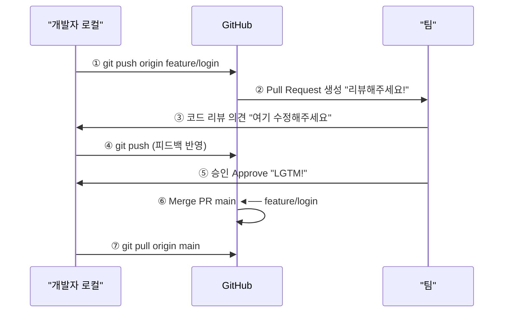
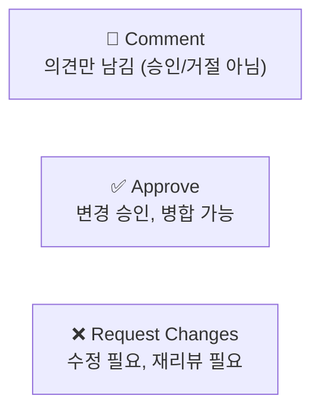
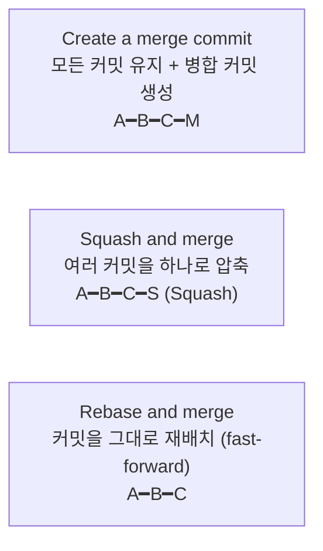

# Pull Request (PR) 이해하기

> **⚠️ 경고:** AI가 생성한 문서입니다. 내용에 부정확한 정보가 포함될 수 있으므로, 학습 시 공식 문서를 함께 참고하세요.

## 학습 목표

- Pull Request의 개념과 흐름을 이해합니다
- GitHub CLI와 웹을 사용하여 PR을 생성할 수 있습니다
- 좋은 PR 작성법과 코드 리뷰 과정을 이해합니다
- PR 병합 방식의 차이를 이해하고 상황에 맞게 활용할 수 있습니다

Pull Request(PR)는 GitHub 기반 협업의 핵심입니다. 우리는 PR을 통해 코드 변경 사항을 팀원들에게 알리고, 리뷰를 요청하며, 승인 후 안전하게 병합할 수 있습니다. PR은 단순한 코드 병합 도구가 아니라, 팀 전체의 코드 품질을 높이고 지식을 공유하는 협업의 장입니다. 이번 장에서는 PR의 전체 흐름부터 작성법, 리뷰 과정, 병합 전략까지 상세히 알아보겠습니다.

## Pull Request의 흐름

PR이 어떻게 진행되는지 먼저 전체 흐름을 살펴보겠습니다. 아래 다이어그램은 개발자가 로컬에서 작업한 내용을 GitHub에 푸시하고, 팀이 리뷰한 후 최종적으로 병합되기까지의 과정을 보여줍니다.



## PR 생성하기 (GitHub CLI)

PR의 전체 흐름을 이해하였습니다. 이제 실제로 PR을 생성하는 방법을 알아보겠습니다. 먼저 GitHub CLI를 사용한 방법부터 살펴보겠습니다.

```bash
# 1. feature 브랜치에서 작업
$ git switch -c feature/login-form
$ echo "<form>Login</form>" > login.html
$ git add . && git commit -m "로그인 폼 추가"
$ git push -u origin feature/login-form

# 2. GitHub CLI로 PR 생성
$ gh pr create --base main --head feature/login-form \
    --title "로그인 폼 추가" \
    --body "사용자 로그인을 위한 HTML 폼을 추가했습니다.

- 이메일/비밀번호 입력 필드
- 로그인 버튼
- 유효성 검사"

# 3. PR 확인
$ gh pr view --web
```

## PR 생성하기 (GitHub 웹)

GitHub CLI 외에도 GitHub 웹사이트에서 직접 PR을 생성할 수 있습니다.

1. 저장소 페이지에서 **Pull requests** 탭 클릭
2. **New pull request** 버튼 클릭
3. **base** (병합 대상)와 **compare** (병합할 브랜치) 선택
4. 변경 사항 확인 (diff)
5. 제목과 설명 작성
6. **Create pull request** 클릭

## 좋은 PR 작성법

PR을 생성하는 방법을 배웠습니다. 그런데 PR은 단순히 생성하는 것만으로 끝나지 않습니다. 팀원들이 이해하기 쉽고 리뷰하기 편한 PR을 작성하는 것이 매우 중요합니다. 이번에는 좋은 PR을 작성하는 방법에 대해 알아보겠습니다.

### PR 제목 예시

```markdown
# ❌ 좋지 않은 예
Update files
Fix bug
WIP

# ✅ 좋은 예
[#42] 로그인 페이지 유효성 검사 추가
README 설치 방법 섹션 업데이트
결제 모듈 API 타임아웃 오류 수정
```

### PR 본문 템플릿 예시

```markdown
## 변경 사항 요약
로그인 폼에 클라이언트 측 유효성 검사를 추가했습니다.

## 관련 이슈
Closes #42

## 변경 사항
- 이메일 형식 검사 (@ 필수)
- 비밀번호 최소 길이 8자 확인
- 에러 메시지 한글화

## 테스트 방법
1. `npm run dev` 실행
2. http://localhost:3000/login 접속
3. 잘못된 이메일 형식 입력 → 에러 메시지 확인
4. 8자 미만 비밀번호 입력 → 에러 메시지 확인

## 스크린샷


## 리뷰어 참고 사항
유효성 검사 로직은 `src/utils/validation.js`에 위치합니다.
```

## 코드 리뷰와 피드백 반영

PR을 작성한 후에는 팀원들의 리뷰를 기다려야 합니다. 리뷰 과정은 협업의 핵심이며, 우리는 이를 통해 더 나은 코드를 만들 수 있습니다.

PR이 생성되면 팀원들이 리뷰를 시작합니다.

```bash
# 리뷰어가 코멘트를 남기면 로컬에서 수정
$ git switch feature/login-form
$ echo "수정된 코드" >> login.html
$ git add . && git commit -m "리뷰 반영: 이메일 형식 검사 수정"
$ git push origin feature/login-form
# PR에 자동으로 새로운 커밋이 추가됨!
```

### 리뷰 상태



## PR 병합하기

코드 리뷰가 완료되고 승인을 받았다면, 이제 PR을 병합할 차례입니다.

리뷰가 완료되면 병합합니다.

```bash
# GitHub CLI로 병합
$ gh pr merge feature/login-form --merge

# GitHub 웹에서 병합
# Merge pull request 버튼 클릭
```

### 병합 옵션



**Squash 예시:**
```bash
# PR에 커밋이 5개 있을 때 "Squash and merge" 선택
# → main에는 1개의 커밋만 추가됨
# "로그인 기능 구현 (#42)" ← PR 제목이 커밋 메시지가 됨
```

## PR 브랜치 전략

PR 병합까지 완료하였습니다. 마지막으로 PR 작업 시 유용한 브랜치 전략에 대해 알아보겠습니다.

```bash
# 로컬에서 PR 브랜치 가져오기
$ gh pr checkout 42          # PR #42의 브랜치를 로컬에 가져옴
$ git switch feature/login-form

# PR에 추가 커밋 푸시
$ git add . && git commit -m "리뷰 반영"
$ git push origin feature/login-form
```

## 한눈에 정리

| 개념 | 설명 |
|------|------|
| Pull Request (PR) | 브랜치 변경 사항을 다른 브랜치에 병합 요청하는 기능 |
| Base 브랜치 | 병합 대상이 되는 브랜치 (일반적으로 main) |
| Compare 브랜치 | 병합할 변경 사항이 담긴 브랜치 |
| 코드 리뷰 | 팀원이 코드 변경을 검토하고 의견을 남기는 과정 |
| Approve | PR 승인, 병합 가능 상태 |
| Merge Commit | 모든 커밋을 유지하며 병합 커밋 생성 |
| Squash Merge | 여러 커밋을 하나로 압축하여 병합 |
| Rebase Merge | 커밋을 그대로 재배치하여 Fast-forward 병합 |

## 연습 문제

1. Pull Request의 전체 흐름을 7단계로 나누어 설명해보세요.
2. 좋은 PR 제목과 본문을 작성하는 방법에 대해 설명해보세요.
3. 세 가지 병합 옵션(Merge Commit, Squash, Rebase)의 차이점을 비교해보세요.
