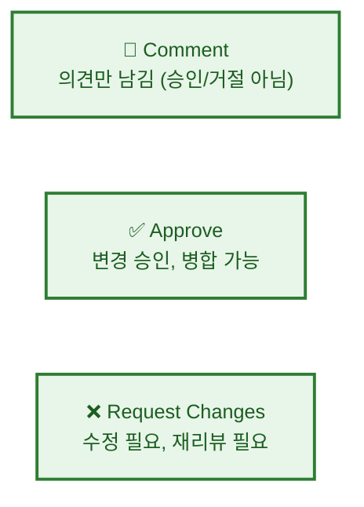
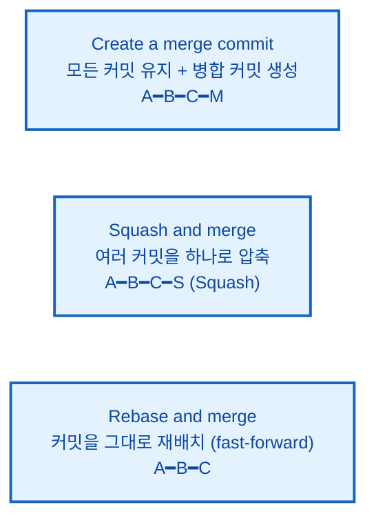

# Pull Request (PR) 이해하기

---

## 👨‍💻 실전 프로젝트: 첫 Pull Request 열어보기

이번 실전 프로젝트에서는 GitHub에서 Pull Request를 생성하고, 코드 리뷰를 받은 후 병합하는 전체 과정을 직접 경험해보겠습니다. Fork, 브랜치 생성, 커밋, PR 생성, 리뷰 반영, 병합까지의 전 과정을 단계별로 진행하면서 Pull Request의 실제 워크플로우를 완전히 익힐 수 있습니다.

### 1단계: 대상 저장소 Fork하기

실습을 위해 다른 팀원의 저장소를 Fork합니다. GitHub에서 연습용 저장소(예: `team/review-practice`)를 찾아 오른쪽 상단의 **Fork** 버튼을 클릭하여 자신의 계정으로 복사합니다. Fork는 원본 저장소에 직접 접근 권한이 없어도 자유롭게 코드를 수정하고 기여할 수 있게 해주는 GitHub의 핵심 기능입니다.

```bash
# Fork한 저장소를 로컬에 클론
$ git clone https://github.com/me/review-practice.git
$ cd review-practice
```

### 2단계: 기능 개발 브랜치 생성 및 작업

PR을 보내기 전에 항상 새로운 브랜치를 생성하여 작업합니다. main 브랜치에서 직접 작업하지 않고 별도의 브랜치를 만드는 이유는, 작업 중인 내용과 안정적인 main 브랜치를 분리하여 충돌을 방지하기 위함입니다.

```bash
$ git switch -c feature/add-login-form
$ echo "<h1>Login</h1><form><input type='email'></form>" > login.html
$ git add login.html
$ git commit -m "로그인 폼 HTML 구조 추가"
$ git push -u origin feature/add-login-form
```

### 3단계: Pull Request 생성하기

GitHub 웹사이트로 이동하면 푸시한 브랜치에 대해 **Compare & pull request** 버튼이 활성화되어 있습니다. 이 버튼을 클릭하고, PR 제목을 "로그인 폼 추가"로 입력한 후 본문에 변경 사항의 상세 내용과 관련 이슈 번호를 작성합니다. Pull Request를 생성할 때는 변경 사항을 설명하는 제목과 본문을 명확하게 작성하는 것이 중요합니다.

### 4단계: 코드 리뷰 요청 및 피드백 반영

PR을 생성한 후 오른쪽 패널에서 **Reviewers**를 설정하여 특정 팀원에게 리뷰를 요청합니다. 리뷰어가 코드에 코멘트를 남기면, 로컬에서 해당 내용을 수정하고 다시 푸시합니다.

```bash
$ echo "// 이메일 유효성 검사 추가" >> login.html
$ git add login.html
$ git commit -m "리뷰 반영: 이메일 유효성 검사 추가"
$ git push origin feature/add-login-form
```

추가 커밋을 푸시하면 PR 페이지에 자동으로 새로운 커밋이 반영되며, 리뷰어는 변경된 내용을 다시 확인할 수 있습니다.

### 5단계: PR 병합하기

리뷰어의 승인(Approve)을 받은 후, GitHub 웹사이트에서 **Merge pull request** 버튼을 클릭하여 PR을 병합합니다. 병합 옵션으로는 **Create a merge commit**, **Squash and merge**, **Rebase and merge** 세 가지가 있으며, **Squash and merge**를 선택하면 여러 커밋을 하나로 압축하여 main 브랜치에 통합할 수 있습니다. 병합이 완료되면 로컬에서 main 브랜치를 업데이트하고 사용한 feature 브랜치는 정리합니다.

```bash
$ git switch main
$ git pull origin main
$ git branch -d feature/add-login-form
$ git push origin --delete feature/add-login-form
```

---

## 학습 목표

- Pull Request의 개념과 흐름을 이해합니다
- GitHub CLI와 웹을 사용하여 PR을 생성할 수 있습니다
- 좋은 PR 작성법과 코드 리뷰 과정을 이해합니다
- PR 병합 방식의 차이를 이해하고 상황에 맞게 활용할 수 있습니다

---

Pull Request(PR)는 GitHub 기반 협업의 핵심입니다. 우리는 PR을 통해 코드 변경 사항을 팀원들에게 알리고, 리뷰를 요청하며, 승인 후 안전하게 병합할 수 있습니다. PR은 단순한 코드 병합 도구가 아니라, 팀 전체의 코드 품질을 높이고 지식을 공유하는 협업의 장입니다. 예를 들어, 주니어 개발자가 작성한 코드를 시니어 개발자가 리뷰하면서 더 나은 패턴을 제안하거나, 팀원 간에 서로 다른 구현 방식을 논의하면서 더 견고한 해결책을 찾을 수 있습니다. 이번 장에서는 PR의 전체 흐름부터 작성법, 리뷰 과정, 병합 전략까지 상세히 알아보겠습니다.

---

## Pull Request의 흐름

PR이 어떻게 진행되는지 먼저 전체 흐름을 살펴보겠습니다. 아래 다이어그램은 개발자가 로컬에서 작업한 내용을 GitHub에 푸시하고, 팀이 리뷰한 후 최종적으로 병합되기까지의 과정을 보여줍니다. 이 흐름은 GitHub Flow의 핵심을 이루며, 대부분의 GitHub 기반 프로젝트에서 동일한 패턴으로 사용됩니다.

```mermaid
%%{init: {'theme': 'base', 'themeVariables': {'fontSize': '13px'}}}%%
sequenceDiagram
    classDef main fill:#fff3e0,stroke:#e65100,stroke-width:2px,color:#bf360c
    classDef sub fill:#e8f5e9,stroke:#2e7d32,stroke-width:2px,color:#1b5e20
    classDef proc fill:#e3f2fd,stroke:#1565c0,stroke-width:2px,color:#0d47a1
    classDef decision fill:#fff9c4,stroke:#f9a825,stroke-width:2px,color:#e65100
    classDef highlight fill:#f3e5f5,stroke:#6a1b9a,stroke-width:2px,color:#4a148c
    participant Local as "개발자 로컬"
    participant GitHub as GitHub
    participant Team as "팀"

    class Local proc
    class GitHub proc
    class Team proc

    Local->>GitHub: ① git push origin feature/login
    GitHub->>Team: ② Pull Request 생성 "리뷰해주세요!"
    Team->>Local: ③ 코드 리뷰 의견 "여기 수정해주세요"
    Local->>GitHub: ④ git push (피드백 반영)
    Team->>Local: ⑤ 승인 Approve "LGTM!"
    GitHub->>GitHub: ⑥ Merge PR main ◄── feature/login
    Local->>GitHub: ⑦ git pull origin main
```

위 시퀀스 다이어그램에서 볼 수 있듯이, PR은 단순히 코드를 병합하는 과정을 넘어 개발자 로컬, GitHub 서버, 팀 구성원 세 주체 간의 상호작용을 포함합니다. ①번 단계에서 개발자가 feature 브랜치를 푸시하면, ②번 단계에서 GitHub가 PR을 생성하여 팀에 알립니다. 이후 ③번과 ④번 단계에서 리뷰와 피드백 반영이 반복적으로 이루어지며, ⑤번 단계에서 승인을 받은 후 ⑥번 단계에서 병합이 완료됩니다. 마지막으로 ⑦번 단계에서 개발자는 업데이트된 main 브랜치를 로컬로 가져와 동기화합니다.

---

## PR 생성하기 (GitHub CLI)

PR의 전체 흐름을 이해하였습니다. 이제 실제로 PR을 생성하는 방법을 알아보겠습니다. 먼저 GitHub CLI를 사용한 방법부터 살펴보겠습니다. GitHub CLI는 터미널에서 직접 PR을 생성하고 관리할 수 있어, 웹 브라우저를 오가지 않고도 효율적으로 작업할 수 있다는 장점이 있습니다.

```bash
# 1. feature 브랜치에서 작업
$ git switch -c feature/login-form
$ echo "<form>Login</form>" > login.html
$ git add . && git commit -m "로그인 폼 추가"
$ git push -u origin feature/login-form

# 2. GitHub CLI로 PR 생성
$ gh pr create --base main --head feature/login-form \
    --title "로그인 폼 추가" \
    --body "사용자 로그인을 위한 HTML 폼을 추가했습니다.

- 이메일/비밀번호 입력 필드
- 로그인 버튼
- 유효성 검사"

# 3. PR 확인
$ gh pr view --web
```

`gh pr create` 명령어에서 `--base`는 병합 대상 브랜치(main)를, `--head`는 병합할 브랜치(feature/login-form)를 지정합니다. `--body` 옵션에는 마크다운 형식으로 PR의 상세 설명을 작성할 수 있으며, 체크리스트나 관련 이슈 번호를 포함하면 더욱 효과적입니다.

---

## PR 생성하기 (GitHub 웹)

GitHub CLI 외에도 GitHub 웹사이트에서 직접 PR을 생성할 수 있습니다. 웹 인터페이스는 시각적으로 변경 사항을 확인할 수 있어, CLI보다 직관적으로 PR을 관리할 수 있다는 장점이 있습니다. 특히 diff 화면에서 변경된 코드 라인을 하이라이트로 보여주므로, 코드 검토에 더 적합합니다.

1. 저장소 페이지에서 **Pull requests** 탭 클릭
2. **New pull request** 버튼 클릭
3. **base** (병합 대상)와 **compare** (병합할 브랜치) 선택
4. 변경 사항 확인 (diff)
5. 제목과 설명 작성
6. **Create pull request** 클릭

웹에서 PR을 생성할 때는 base 브랜치와 compare 브랜치를 혼동하지 않도록 주의해야 합니다. 일반적으로 base는 `main`(또는 `develop`), compare는 작업 중인 feature 브랜치를 선택합니다. 또한 브랜치를 선택하면 자동으로 diff 화면이 표시되므로, 변경 사항을 최종 확인한 후 PR을 생성할 수 있습니다.

---

## 좋은 PR 작성법

PR을 생성하는 방법을 배웠습니다. 그런데 PR은 단순히 생성하는 것만으로 끝나지 않습니다. 팀원들이 이해하기 쉽고 리뷰하기 편한 PR을 작성하는 것이 매우 중요합니다. 좋은 PR은 리뷰 시간을 단축시키고, 코드 품질을 높이며, 팀 내 지식 공유를 촉진합니다. 이번에는 좋은 PR을 작성하는 방법에 대해 알아보겠습니다.

### PR 제목 예시

```markdown
# ❌ 좋지 않은 예
Update files
Fix bug
WIP

# ✅ 좋은 예
[#42] 로그인 페이지 유효성 검사 추가
README 설치 방법 섹션 업데이트
결제 모듈 API 타임아웃 오류 수정
```

좋은 PR 제목의 핵심은 **무엇을, 왜 변경했는지**를 한눈에 알 수 있도록 작성하는 것입니다. 이슈 번호를 포함하면 PR과 이슈가 자동으로 연결되어 추적이 용이해집니다. 또한 PR 본문에서는 변경 사항을 요약하고, 관련 이슈를 명시하며, 테스트 방법을 상세히 기술하는 것이 좋습니다.

### PR 본문 템플릿 예시

```markdown
## 변경 사항 요약
로그인 폼에 클라이언트 측 유효성 검사를 추가했습니다.

## 관련 이슈
Closes #42

## 변경 사항
- 이메일 형식 검사 (@ 필수)
- 비밀번호 최소 길이 8자 확인
- 에러 메시지 한글화

## 테스트 방법
1. `npm run dev` 실행
2. http://localhost:3000/login 접속
3. 잘못된 이메일 형식 입력 → 에러 메시지 확인
4. 8자 미만 비밀번호 입력 → 에러 메시지 확인

## 스크린샷


## 리뷰어 참고 사항
유효성 검사 로직은 `src/utils/validation.js`에 위치합니다.
```

위 템플릿과 같은 구조화된 PR 본문은 리뷰어가 변경 사항을 빠르게 파악할 수 있도록 도와줍니다. 특히 **변경 사항 요약**, **관련 이슈**, **테스트 방법**은 모든 PR에 포함하는 것을 권장합니다. `Closes #42`와 같은 키워드를 사용하면 PR이 병합될 때 관련 이슈가 자동으로 닫히므로, 작업 추적이 더욱 체계적으로 이루어집니다.

---

## 코드 리뷰와 피드백 반영

PR을 작성한 후에는 팀원들의 리뷰를 기다려야 합니다. 리뷰 과정은 협업의 핵심이며, 우리는 이를 통해 더 나은 코드를 만들 수 있습니다. 리뷰어는 코드의 정확성, 성능, 보안, 가독성 등 다양한 측면을 검토하고 의견을 제시합니다.

PR이 생성되면 팀원들이 리뷰를 시작합니다.

```bash
# 리뷰어가 코멘트를 남기면 로컬에서 수정
$ git switch feature/login-form
$ echo "수정된 코드" >> login.html
$ git add . && git commit -m "리뷰 반영: 이메일 형식 검사 수정"
$ git push origin feature/login-form
# PR에 자동으로 새로운 커밋이 추가됨!
```

리뷰 피드백을 반영할 때는 각 코멘트에 답글을 달아 어떤 부분을 수정했는지 명확히 알려주는 것이 좋습니다. 또한 한 번의 리뷰에서 여러 개의 수정 사항이 나왔다면, 모든 수정을 완료한 후 한꺼번에 푸시하는 것이 PR 히스토리를 깔끔하게 유지하는 방법입니다. 피드백에 동의하지 않는다면, 팀원과 토론을 통해 더 나은 해결책을 찾는 것도 중요한 협업 과정입니다.

### 리뷰 상태



리뷰어는 위 세 가지 상태 중 하나를 선택하여 리뷰를 제출할 수 있습니다. **Comment**는 단순 의견 제시로 승인이나 거절의 의미를 가지지 않으며, **Approve**는 변경 사항에 문제가 없어 병합 가능함을 의미합니다. **Request Changes**는 수정이 필요함을 나타내며, 이 상태에서는 PR 작성자가 추가 커밋을 푸시하여 수정 사항을 반영한 후 리뷰어의 재승인을 받아야 병합할 수 있습니다.

---

## PR 병합하기

코드 리뷰가 완료되고 승인을 받았다면, 이제 PR을 병합할 차례입니다. 병합은 feature 브랜치의 변경 사항을 main 브랜치에 통합하는 최종 단계입니다. 병합하기 전에 모든 CI 검사가 통과했는지, 최소한 한 명 이상의 승인(Approve)이 있는지 반드시 확인해야 합니다.

리뷰가 완료되면 병합합니다.

```bash
# GitHub CLI로 병합
$ gh pr merge feature/login-form --merge

# GitHub 웹에서 병합
# Merge pull request 버튼 클릭
```

### 병합 옵션



**Squash 예시:**
```bash
# PR에 커밋이 5개 있을 때 "Squash and merge" 선택
# → main에는 1개의 커밋만 추가됨
# "로그인 기능 구현 (#42)" ← PR 제목이 커밋 메시지가 됨
```

각 병합 옵션은 서로 다른 장단점을 가지고 있습니다. **Merge Commit**은 모든 개별 커밋을 보존하므로 히스토리가 상세하지만, 병합 커밋이 추가되어 그래프가 복잡해질 수 있습니다. **Squash Merge**는 여러 커밋을 하나로 압축하여 깔끔한 히스토리를 유지하지만, 개별 커밋의 세부 내용은 사라집니다. **Rebase Merge**는 커밋을 재배치하여 선형 히스토리를 만들지만, 충돌이 발생할 가능성이 있습니다. 팀의 히스토리 관리 방침에 따라 적절한 옵션을 선택합니다.

---

## PR 브랜치 전략

PR 병합까지 완료하였습니다. 마지막으로 PR 작업 시 유용한 브랜치 전략에 대해 알아보겠습니다. 효과적인 브랜치 전략은 여러 개발자가 동시에 작업할 때 충돌을 최소화하고 작업 효율을 극대화합니다.

```bash
# 로컬에서 PR 브랜치 가져오기
$ gh pr checkout 42          # PR #42의 브랜치를 로컬에 가져옴
$ git switch feature/login-form

# PR에 추가 커밋 푸시
$ git add . && git commit -m "리뷰 반영"
$ git push origin feature/login-form
```

`gh pr checkout 42` 명령어를 사용하면 PR 번호만으로 해당 PR의 브랜치를 로컬에 자동으로 가져올 수 있습니다. 이는 여러 PR을 동시에 리뷰해야 하는 상황에서 특히 유용합니다. 또한 feature 브랜치의 이름은 `feature/`, `fix/`, `hotfix/`와 같은 접두사를 사용하여 목적을 명확히 구분하는 것이 일반적입니다. 이렇게 일관된 브랜치 명명 규칙을 따르면 프로젝트의 브랜치 구조를 한눈에 파악할 수 있어 유지보수에 큰 도움이 됩니다.

---

## 한눈에 정리

| 개념 | 설명 |
|------|------|
| Pull Request (PR) | 브랜치 변경 사항을 다른 브랜치에 병합 요청하는 기능으로, 코드 리뷰와 협업의 핵심 도구입니다 |
| Base 브랜치 | 병합 대상이 되는 브랜치 (일반적으로 main) |
| Compare 브랜치 | 병합할 변경 사항이 담긴 브랜치 (feature 브랜치) |
| 코드 리뷰 | 팀원이 코드 변경을 검토하고 의견을 남기는 과정으로, 코드 품질 향상에 기여합니다 |
| Approve | PR 승인, 병합 가능 상태를 나타냅니다 |
| Merge Commit | 모든 커밋을 유지하며 병합 커밋을 생성하는 방식입니다 |
| Squash Merge | 여러 커밋을 하나로 압축하여 병합하는 방식입니다 |
| Rebase Merge | 커밋을 그대로 재배치하여 Fast-forward 병합하는 방식입니다 |

---

## 연습 문제

1. Pull Request의 전체 흐름을 7단계로 나누어 각 단계에서 수행되는 작업을 설명해보세요.
2. 좋은 PR 제목과 본문을 작성하는 방법에 대해 구체적인 예시와 함께 설명해보세요.
3. 세 가지 병합 옵션(Merge Commit, Squash, Rebase)의 차이점을 각각의 장단점과 함께 비교해보세요.
4. 코드 리뷰에서 Comment, Approve, Request Changes 세 가지 상태가 각각 어떤 의미를 가지는지 설명해보세요.

---

📌 정답 및 해설

**문제 1 정답 및 해설:**

Pull Request의 전체 흐름은 다음 7단계로 구성됩니다. 1단계: feature 브랜치에서 변경 사항을 커밋하고 원격 저장소에 푸시합니다. 2단계: GitHub 웹사이트에서 "Pull requests" 탭의 "New pull request" 버튼을 클릭합니다. 3단계: base 브랜치(병합 대상, 일반적으로 main)와 compare 브랜치(병합할 feature 브랜치)를 선택합니다. 4단계: 변경 사항의 diff를 검토하여 의도한 대로 수정되었는지 확인합니다. 5단계: PR 제목과 본문을 작성하고, 리뷰어를 지정한 후 "Create pull request" 버튼을 클릭합니다. 6단계: 리뷰어가 코드 리뷰를 수행하고, 피드백이 있으면 개발자가 수정하여 추가 커밋을 푸시합니다. 7단계: 모든 리뷰어의 승인을 받고 CI/CD 검사를 통과한 후, "Merge pull request" 버튼으로 병합을 완료합니다.

**문제 2 정답 및 해설:**

좋은 PR 제목은 50자 이내로 변경 사항을 요약하며, 명령형 현재형을 사용합니다. 예를 들어 "버그 수정"이 아닌 "로그인 페이지에서 세션 만료 시 리다이렉션 오류 수정"과 같이 구체적으로 작성합니다. 본문은 "무엇을, 왜 변경했는지"를 상세히 설명해야 합니다. 구체적인 예시: 제목: "사용자 프로필 페이지에 비밀번호 변경 기능 추가", 본문: "사용자 보안 강화를 위해 프로필 페이지에 비밀번호 변경 기능을 추가했습니다. 기존에는 비밀번호 변경을 위해 별도의 페이지로 이동해야 했으나, 이번 변경으로 프로필 페이지에서 직접 변경할 수 있어 사용자 경험이 개선됩니다. 변경 사항: 1) 프로필 페이지에 '비밀번호 변경' 버튼 추가, 2) 비밀번호 변경 폼 컴포넌트 생성, 3) 비밀번호 유효성 검사 로직 구현, 4) 관련 테스트 코드 추가." PR 본문에는 변경의 배경과 목적, 구체적인 변경 내용, 테스트 방법, 스크린샷 등을 포함하는 것이 좋습니다.

**문제 3 정답 및 해설:**

세 가지 병합 옵션은 각각 다른 장단점을 가집니다. Merge Commit은 기본 병합 방식으로, feature 브랜치의 모든 커밋을 유지한 채 병합 커밋을 생성합니다. 장점은 모든 커밋 히스토리가 보존되어 개발 과정을 추적할 수 있고, 병합을 언제든지 취소할 수 있습니다. 단점은 히스토리에 불필요한 병합 커밋이 많이 남을 수 있습니다. Squash Merge는 feature 브랜치의 모든 커밋을 하나의 커밋으로 압축하여 main 브랜치에 병합합니다. 장점은 히스토리가 깔끔하게 유지되지만, 단점은 개별 커밋 히스토리가 사라져 세부 변경 추적이 어렵습니다. Rebase Merge는 feature 브랜치의 커밋을 main 브랜치 위에 재배치한 후 Fast-Forward 병합합니다. 장점은 깔끔한 선형 히스토리를 유지하면서 개별 커밋을 보존하지만, 충돌 해결이 각 커밋마다 반복될 수 있고 rebase에 대한 이해가 필요합니다.

**문제 4 정답 및 해설:**

Comment, Approve, Request Changes는 코드 리뷰에서 리뷰어가 PR에 대해 표현할 수 있는 세 가지 상태입니다. Comment는 단순한 의견 제시로, 승인이나 반려의 의미 없이 질문이나 제안을 할 때 사용합니다. Approve(+1)는 변경 사항이 승인되었으며 병합을 진행해도 좋다는 의미입니다. Approve를 받으면 PR 작성자는 병합을 진행할 수 있습니다. Request Changes(-1)는 변경 사항에 문제가 있어 반드시 수정이 필요하다는 의미로, 이 상태에서는 병합이 차단됩니다. Request Changes를 받은 개발자는 피드백을 반영하여 수정 커밋을 추가로 푸시하고 다시 리뷰를 요청해야 합니다. 이 세 가지 상태를 통해 팀은 체계적이고 투명한 코드 리뷰 프로세스를 운영할 수 있습니다.
