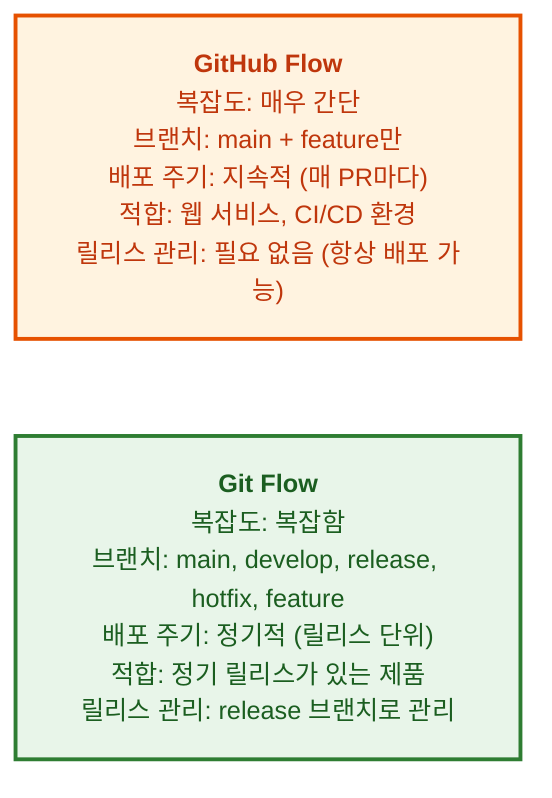

# GitHub Flow 워크플로우

---

## 👨‍💻 실전 프로젝트: GitHub Flow로 협업하기

이번 실전 프로젝트에서는 GitHub Flow의 전체 워크플로우를 직접 시뮬레이션해보겠습니다. 브랜치 생성부터 Pull Request, 코드 리뷰, 병합까지의 과정을 실제 명령어와 함께 단계별로 수행하면서 GitHub Flow의 동작 방식을 완전히 체득할 수 있습니다. 가상의 팀 프로젝트 상황을 가정하여 협업 과정을 경험해보겠습니다.

### 1단계: 저장소 준비 및 브랜치 생성

먼저 실습을 위한 저장소를 생성하거나 기존 저장소를 사용합니다. main 브랜치가 항상 배포 가능한 상태임을 확인한 후, 새로운 기능 개발을 위한 feature 브랜치를 생성합니다.

```bash
$ git switch main
$ git pull origin main
$ git switch -c feature/add-search
```

### 2단계: 기능 개발 및 커밋

feature 브랜치에서 검색 기능을 개발합니다. 커밋은 작게 자주 나누어 작성하는 것이 GitHub Flow의 핵심 원칙 중 하나입니다. 각 커밋이 하나의 논리적 변경 단위를 나타내도록 합니다.

```bash
$ echo "<input type='text' placeholder='검색...'>" > search.html
$ git add search.html
$ git commit -m "검색 입력 필드 HTML 추가"
$ echo "function search() { ... }" > search.js
$ git add search.js
$ git commit -m "검색 함수 기본 구현"
```

### 3단계: 원격 저장소에 푸시 및 PR 생성

로컬에서 작업이 완료되면 원격 저장소에 브랜치를 푸시하고 Pull Request를 생성합니다. PR을 생성할 때는 제목에 이슈 번호를 포함하고, 본문에 변경 사항과 테스트 방법을 상세히 기술합니다.

```bash
$ git push -u origin feature/add-search
$ gh pr create --base main --head feature/add-search \
    --title "[#15] 검색 기능 추가" \
    --body "검색 입력 필드와 검색 로직을 구현했습니다.
- 전체 텍스트 검색 지원
- 실시간 검색어 자동완성"
```

### 4단계: 코드 리뷰 시뮬레이션

팀원 역할을 가정하여 PR에 리뷰 코멘트를 남기고, 피드백을 반영하는 과정을 시뮬레이션합니다. 리뷰어가 "페이지네이션 처리가 필요합니다"라는 코멘트를 남겼다고 가정하고, 이를 수정하여 추가 커밋을 푸시합니다.

```bash
$ echo "// 페이지네이션 로직 추가" >> search.js
$ git add search.js
$ git commit -m "리뷰 반영: 검색 결과 페이지네이션 추가"
$ git push origin feature/add-search
```

### 5단계: PR 병합 및 브랜치 정리

리뷰 승인 후 PR을 병합하고, 사용한 feature 브랜치를 정리합니다. GitHub Flow에서는 PR 병합이 완료되면 feature 브랜치를 즉시 삭제하여 저장소를 깔끔하게 유지합니다.

```bash
$ gh pr merge feature/add-search --squash
$ git switch main
$ git pull origin main
$ git branch -d feature/add-search
$ git push origin --delete feature/add-search
```

### 6단계: 긴급 버그 수정 시나리오

서비스 운영 중 긴급 버그가 발생한 상황을 가정해보겠습니다. GitHub Flow에서는 hotfix도 일반 feature 브랜치와 동일한 프로세스로 처리하되, PR 생성 시 제목에 `[핫픽스]` 접두사를 붙여 긴급성을 표시합니다.

```bash
$ git switch main
$ git switch -c hotfix/login-crash
$ echo "fixed" > login.js
$ git add . && git commit -m "[핫픽스] 로그인 크래시 버그 수정"
$ git push -u origin hotfix/login-crash
$ gh pr create --base main --head hotfix/login-crash \
    --title "[핫픽스] 로그인 크래시 버그 수정" \
    --body "긴급! 로그인 시 널 포인터 예외가 발생하여 앱이 크래시되는 문제를 수정했습니다."
```

---

## 학습 목표

- GitHub Flow의 핵심 원칙을 이해합니다
- GitHub Flow 워크플로우를 실제 명령어와 함께 수행할 수 있습니다
- 긴급 버그 수정과 여러 기능 동시 개발 시나리오에 GitHub Flow를 적용할 수 있습니다
- GitHub Flow와 Git Flow의 차이점을 설명할 수 있습니다

---

효과적인 협업을 위해서는 팀원 모두가 동의하는 브랜치 전략이 필요합니다. 브랜치 전략이란 개발, 테스트, 배포 등의 단계에서 Git 브랜치를 어떻게 생성하고 관리할지에 대한 규칙과 약속을 의미합니다. GitHub Flow는 GitHub에서 공식적으로 권장하는 브랜치 전략으로, 복잡한 규칙 없이도 지속적인 배포와 협업을 가능하게 합니다. 우리는 이번 장에서 GitHub Flow의 핵심 원칙부터 실제 워크플로우, 다양한 시나리오까지 직접 실습해보겠습니다.

---

## GitHub Flow의 핵심 원칙

GitHub Flow는 다음과 같은 5가지 핵심 원칙을 기반으로 합니다. 이 원칙들은 각각 독립적이면서도 서로 유기적으로 연결되어 있어, 하나라도 지켜지지 않으면 워크플로우의 효과가 반감될 수 있습니다.

1. **main 브랜치는 항상 배포 가능한 상태 유지**
   - main 브랜치의 코드는 언제든지 프로덕션에 배포할 수 있을 정도로 안정적이어야 합니다. 따라서 main 브랜치에 직접 커밋하는 것은 금지되며, 모든 변경 사항은 PR을 통해서만 병합되어야 합니다.

2. **새 기능이나 버그 수정은 feature 브랜치에서 작업**
   - 모든 개발 작업은 main 브랜치가 아닌 별도의 feature 브랜치에서 이루어져야 합니다. 이렇게 하면 여러 기능이 동시에 개발되더라도 서로 영향을 주지 않고 독립적으로 작업할 수 있습니다.

3. **feature 브랜치를 원격에 자주 푸시하여 백업**
   - 작업 중인 코드를 정기적으로 원격 저장소에 푸시하면 로컬 장애 발생 시에도 코드를 안전하게 보호할 수 있습니다. 또한 팀원들이 진행 상황을 확인할 수 있어 투명한 협업이 가능합니다.

4. **Pull Request로 코드 리뷰 요청**
   - 모든 병합은 Pull Request를 통해 이루어져야 하며, 최소 한 명 이상의 팀원이 코드를 리뷰하고 승인해야 합니다. 이는 코드 품질을 보장하고 팀 내 지식 공유를 촉진합니다.

5. **병합 후 즉시 배포 가능**
   - PR이 main 브랜치에 병합되면, 해당 변경 사항은 즉시 프로덕션에 배포할 수 있는 상태여야 합니다. 이를 위해 CI/CD 파이프라인이 자동으로 실행되어 테스트와 빌드를 검증합니다.

---

## GitHub Flow 워크플로우

핵심 원칙에 대해 알아보았습니다. 이제 GitHub Flow의 전체 워크플로우를 시각화와 명령어를 통해 자세히 살펴보겠습니다. 아래 워크플로우는 하나의 feature 브랜치가 생성되고, 커밋이 추가되며, 최종적으로 main 브랜치에 병합되기까지의 과정을 보여줍니다.

**워크플로우 시각화:**


```bash
# 1. main 브랜치에서 시작 (최신 상태 유지)
$ git switch main
$ git pull origin main

# 2. 기능 개발을 위한 브랜치 생성
$ git switch -c feature/add-search
# (브랜치 이름은 간결하고 설명적으로!)

# 3. 코드 작성 및 커밋 (자주, 작게)
$ echo "search input" > search.html
$ git add . && git commit -m "검색 입력 필드 추가"
$ echo "search logic" > search.js
$ git add . && git commit -m "검색 로직 구현"

# 4. 원격에 푸시 (자주, 백업)
$ git push -u origin feature/add-search

# 5. GitHub에서 Pull Request 생성
$ gh pr create --base main --head feature/add-search \
    --title "검색 기능 추가" --body "..."

# 6. 팀원 리뷰 → 피드백 반영 → 추가 커밋
$ echo "검색 결과 페이지네이션 추가" >> search.js
$ git add . && git commit -m "리뷰 반영: 페이지네이션 추가"
$ git push origin feature/add-search
# PR에 자동 반영됨

# 7. PR 병합 (리뷰 완료 후)
$ gh pr merge feature/add-search --squash

# 8. 로컬 main 브랜치 업데이트
$ git switch main
$ git pull origin main

# 9. (선택) feature 브랜치 삭제
$ git branch -d feature/add-search
$ git push origin --delete feature/add-search
```

위 워크플로우에서 특히 주목할 점은 6번 단계입니다. 리뷰 피드백을 반영하기 위해 추가 커밋을 푸시하면, GitHub가 이를 자동으로 기존 PR에 반영합니다. 따라서 PR 작성자는 별도의 추가 작업 없이도 업데이트된 코드를 리뷰어에게 전달할 수 있습니다. 또한 9번 단계에서 feature 브랜치를 삭제하는 것은 선택 사항이지만, 병합이 완료된 브랜치를 정리하면 저장소의 브랜치 목록을 깔끔하게 유지할 수 있어 적극 권장됩니다.

---

## GitHub Flow 예시 시나리오

기본 워크플로우를 익혔습니다. 이제 실제 상황에서 GitHub Flow를 어떻게 적용하는지 두 가지 시나리오를 통해 알아보겠습니다. 첫 번째 시나리오는 긴급 버그 수정, 두 번째 시나리오는 여러 기능을 동시에 개발하는 상황입니다.

### 시나리오: 긴급 버그 수정

운영 중인 서비스에서 로그인 크래시 버그가 발견된 상황을 가정합니다. GitHub Flow에서는 일반 기능 개발과 동일한 프로세스를 따르되, PR 제목에 `[핫픽스]` 태그를 붙여 긴급성을 표시합니다. 또한 리뷰어에게 즉시 알림을 보내 빠른 승인을 요청합니다.

```bash
# 1. main 브랜치에서 hotfix 브랜치 생성
$ git switch main
$ git switch -c hotfix/login-crash

# 2. 버그 수정
$ echo "fixed" > login.js  # 버그 수정 코드
$ git add . && git commit -m "로그인 크래시 버그 수정"

# 3. 원격에 푸시
$ git push -u origin hotfix/login-crash

# 4. PR 생성 및 긴급 리뷰 요청
$ gh pr create --base main --head hotfix/login-crash \
    --title "[핫픽스] 로그인 크래시 버그 수정" \
    --body "긴급! 로그인 시 널 포인터 예외 발생"

# 5. 리뷰 완료 후 바로 병합
$ gh pr merge hotfix/login-crash --merge

# 6. main 업데이트
$ git switch main && git pull origin main
```

긴급 버그 수정 시 중요한 점은 hotfix 브랜치도 일반 feature 브랜치와 동일하게 PR을 통해 병합된다는 것입니다. 이는 아무리 긴급한 상황이라도 코드 리뷰를 생략하지 않는다는 GitHub Flow의 중요한 원칙을 보여줍니다. 다만, 실제로는 리뷰어에게 Slack이나 이메일로 즉시 알림을 보내 빠른 리뷰를 요청하는 것이 일반적입니다.

### 시나리오: 여러 기능 동시 개발

대규모 팀에서 여러 개발자가 동시에 다른 기능을 개발하는 상황을 가정합니다. GitHub Flow에서는 각 개발자가 자신의 feature 브랜치에서 독립적으로 작업하므로, 서로의 작업에 영향을 주지 않으면서 동시에 여러 기능을 개발할 수 있습니다.

```bash
# 개발자 A: 검색 기능
$ git switch -c feature/search
# ... 작업 ...

# 개발자 B: 결제 기능
$ git switch -c feature/payment
# ... 작업 ...

# 개발자 C: 프로필 페이지
$ git switch -c feature/profile
# ... 작업 ...

# 모두 각자 feature 브랜치에서 작업 후 PR → 리뷰 → 병합
# main 브랜치는 각 PR이 병합될 때마다 업데이트
```

여러 기능을 동시에 개발할 때 가장 중요한 것은 main 브랜치를 최신 상태로 유지하는 것입니다. 각 개발자는 자신의 feature 브랜치에서 작업을 시작하기 전에 항상 `git pull origin main`으로 최신 코드를 가져와야 합니다. 또한 feature 브랜치의 생명주기를 짧게 유지하는 것이 좋으며, 가능하면 하루에서 이틀 이내에 PR을 생성하고 병합하는 것을 권장합니다.

---

## GitHub Flow vs Git Flow

두 가지 시나리오를 통해 GitHub Flow의 실제 활용법을 살펴보았습니다. 그렇다면 GitHub Flow는 다른 브랜치 전략과 무엇이 다를까요? 가장 널리 알려진 Git Flow와 비교해보겠습니다. Git Flow는 2010년 Vincent Driessen이 제안한 브랜치 전략으로, 정기적인 릴리스 주기를 가진 프로젝트에 적합한 반면, GitHub Flow는 지속적인 배포(Continuous Deployment)를 지향하는 현대적인 웹 서비스에 더 적합합니다.



GitHub Flow는 단 두 개의 브랜치(main, feature)만으로 운영되므로 학습 곡선이 낮고, CI/CD와 자연스럽게 통합됩니다. 반면 Git Flow는 develop, release, hotfix, feature 등 여러 브랜치를 사용하므로 복잡하지만, 체계적인 릴리스 관리가 가능합니다. 예를 들어, 모바일 앱처럼 버전별로 QA를 거쳐 출시해야 하는 프로젝트에는 Git Flow가 더 적합할 수 있습니다. 팀의 상황과 프로젝트의 특성에 따라 적절한 전략을 선택하는 것이 중요합니다.

---

## GitHub Flow의 모범 사례

GitHub Flow와 Git Flow의 차이점을 이해하였습니다. 마지막으로 GitHub Flow를 더욱 효과적으로 사용하기 위한 모범 사례를 알아보겠습니다. 이러한 모범 사례들은 실제 프로덕션 환경에서 수많은 팀이 경험을 통해 발견한 효과적인 패턴들입니다.

```bash
# 1. Pull Request는 작게 유지 (코드 300줄 이하 권장)
# 2. PR 제목에 이슈 번호 포함: "[#42] 검색 기능 추가"
# 3. 커밋 메시지도 의미 있게
# 4. 리뷰어는 1~2명 지정
# 5. 병합 전에 CI 통과 확인 (Actions)

# GitHub Actions 상태 확인
$ gh pr checks 42
# 모두 초록색이어야 병합 가능!
```

PR을 작게 유지하면 리뷰어의 부담이 줄어들고, 리뷰 품질이 향상됩니다. 일반적으로 300줄 이하의 코드 변경을 권장하며, 이를 위해 하나의 큰 기능을 여러 개의 작은 PR로 나누는 것이 좋습니다. 또한 커밋 메시지는 변경 사항을 명확히 설명해야 하며, `git commit -m "WIP"`와 같은 모호한 메시지는 피해야 합니다. 마지막으로, CI 검사는 병합 전에 반드시 통과해야 하며, 실패한 검사가 있을 경우 원인을 파악하고 수정한 후에만 병합을 진행해야 합니다.

---

## 한눈에 정리

| 개념 | 설명 |
|------|------|
| GitHub Flow | GitHub 권장 브랜치 전략으로, main과 feature 브랜치만 사용하는 간단한 워크플로우입니다 |
| Feature 브랜치 | 새로운 기능이나 버그 수정을 위해 main에서 분기한 브랜치로, 작업 완료 후 PR을 통해 병합됩니다 |
| Hotfix 브랜치 | 긴급 버그 수정을 위한 브랜치로, 일반 feature 브랜치와 동일한 프로세스를 따릅니다 |
| Pull Request | 코드 리뷰와 병합 요청을 위한 메커니즘으로, GitHub Flow의 핵심 구성 요소입니다 |
| 지속적 배포 | 매 PR 병합 시 즉시 배포 가능한 상태를 유지하는 방식입니다 |
| Git Flow | main, develop, release, hotfix, feature 브랜치를 사용하는 복잡한 브랜치 전략입니다 |

---

## 연습 문제

1. GitHub Flow의 5가지 핵심 원칙을 순서대로 나열하고, 각 원칙이 왜 중요한지 설명해보세요.
2. GitHub Flow와 Git Flow의 주요 차이점을 브랜치 구성, 배포 주기, 복잡도 측면에서 비교해보세요.
3. 긴급 버그가 발생했을 때 GitHub Flow에서 어떻게 대응하는지 시나리오를 단계별로 작성해보세요.
4. 여러 개발자가 동시에 기능을 개발할 때 GitHub Flow에서 발생할 수 있는 충돌 상황과 해결 방법을 설명해보세요.
