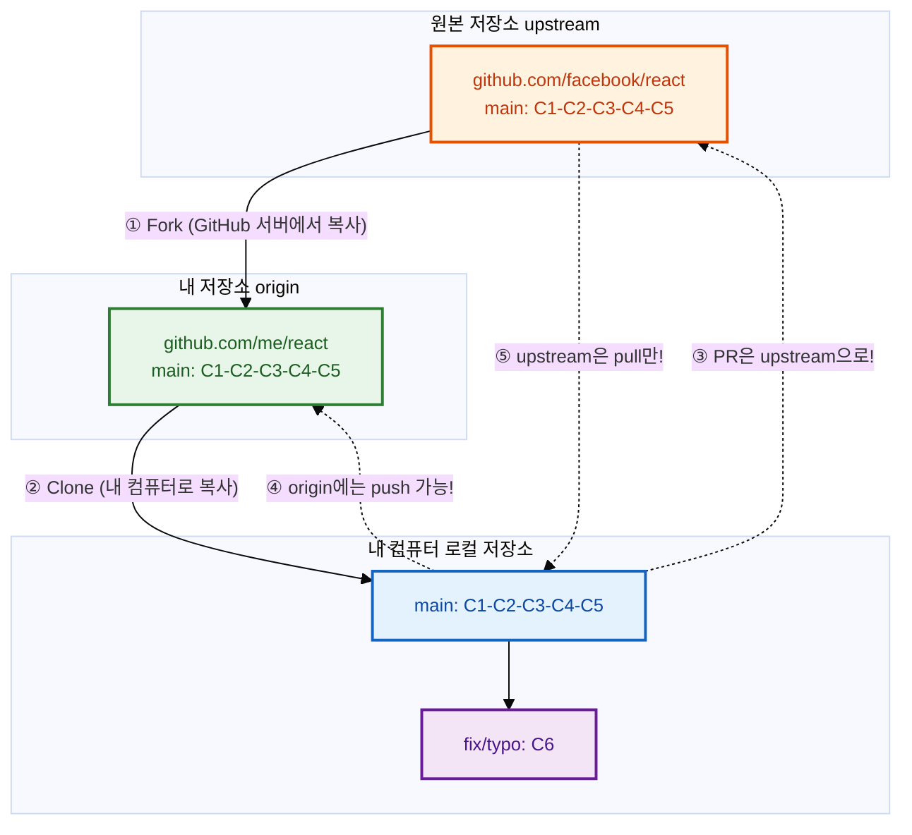
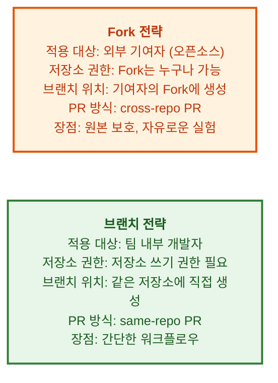

# Fork와 오픈소스 기여


## 학습 목표

- Fork의 개념과 동작 방식을 이해합니다
- Fork를 사용한 오픈소스 기여 워크플로우를 수행할 수 있습니다
- 원본 저장소와 Fork 저장소 간의 동기화 방법을 이해합니다
- Fork 전략과 브랜치 전략의 차이점을 설명할 수 있습니다

오픈소스는 현대 소프트웨어 개발의 근간입니다. 우리는 수많은 오픈소스 프로젝트를 사용하며 개발하지만, 직접 기여하는 것은 또 다른 경험입니다. GitHub의 Fork 기능을 사용하면 누구나 오픈소스 프로젝트에 기여할 수 있습니다. 이번 장에서는 Fork의 개념부터 실제 기여 워크플로우, 유지보수 방법까지 단계별로 알아보겠습니다.

## Fork의 개념

Fork는 다른 사람의 GitHub 저장소를 자신의 계정으로 복사하는 기능입니다. 오픈소스 프로젝트에 기여할 때 사용하는 표준 방식입니다.



## Fork 기여 워크플로우

Fork의 개념을 이해하였습니다. 이제 실제로 Fork를 사용하여 오픈소스 프로젝트에 기여하는 전체 워크플로우를 살펴보겠습니다.

```bash
# 1. GitHub에서 원하는 프로젝트로 이동
#    "Fork" 버튼 클릭 → 내 계정으로 복사됨

# 2. 내 Fork를 로컬에 클론
$ git clone https://github.com/me/react.git
$ cd react

# 3. 원본 저장소를 upstream으로 추가
$ git remote add upstream https://github.com/facebook/react.git
$ git remote -v
origin    https://github.com/me/react.git (fetch)
origin    https://github.com/me/react.git (push)
upstream  https://github.com/facebook/react.git (fetch)
upstream  https://github.com/facebook/react.git (push)  # ← 주의: push 권한 없음!

# 4. 최신 코드로 동기화
$ git switch main
$ git pull upstream main    # 원본에서 최신 코드 가져오기
$ git push origin main      # 내 Fork에도 업데이트

# 5. 기능 개발 브랜치 생성
$ git switch -c fix/typo-in-readme

# 6. 수정 및 커밋
$ echo "fixed typo" >> README.md
$ git add . && git commit -m "README.md 오타 수정"

# 7. 내 Fork에 푸시
$ git push origin fix/typo-in-readme

# 8. GitHub에서 Pull Request 생성
#    "Compare & pull request" 버튼 클릭
#    base: owner/react main ← head: me/react fix/typo-in-readme
```

## 원본 저장소와 동기화 유지하기

Fork 기여 워크플로우를 익혔습니다. 오픈소스 기여 시 원본 저장소의 최신 변경 사항을 정기적으로 가져와야 합니다.

```bash
# 매일 아침: 원본 최신 코드로 동기화
$ git switch main
$ git pull upstream main          # 원본 최신 코드
$ git push origin main            # 내 Fork 업데이트

# feature 브랜치도 최신 main으로 리베이스
$ git switch feature/my-feature
$ git rebase main                  # feature 브랜치를 최신 main 위로
$ git push origin feature/my-feature --force-with-lease
```

## 오픈소스 기여 시뮬레이션

원본 저장소와의 동기화 방법까지 배웠습니다. 이제 실제 상황을 가정하여 오픈소스 기여 과정을 기여자와 저장소 관리자 두 관점에서 시뮬레이션해보겠습니다.

### 기여자로서:

```bash
# 1. VSCode에 기여한다고 가정
$ git clone https://github.com/me/vscode.git
$ cd vscode
$ git remote add upstream https://github.com/microsoft/vscode.git

# 2. 이슈 확인: "버그: 설정 창에서 오타 발견 (#12345)"
$ git switch -c fix/typo-in-settings

# 3. 오타 수정
$ vi src/settings.ts  # "langauge" → "language"
$ git add . && git commit -m "설정 창 오타 수정 (Fixes #12345)"
$ git push origin fix/typo-in-settings

# 4. GitHub에서 PR 생성 (PR #12346)
#    5분 후: 리뷰어가 코멘트 "다른 파일에도 같은 오타가 있습니다"
#    추가 수정
$ vi src/other-file.ts
$ git add . && git commit -m "리뷰 반영: 다른 파일 오타도 수정"
$ git push origin fix/typo-in-settings

# 5. 승인 후 병합 완료! 🎉
#    내 이름이 CONTRIBUTORS에 추가됨!
```

### 저장소 관리자로서:

```bash
# 기여자의 PR을 리뷰하고 병합
$ git checkout -b review/pr-12346 upstream/main
$ gh pr checkout 12346          # PR 브랜치 가져오기
# 코드 리뷰 후...
$ gh pr merge 12346 --squash   # Squash 병합
```

## Fork 전략 vs 브랜치 전략

기여자와 관리자 두 관점에서 오픈소스 기여 과정을 살펴보았습니다. 그렇다면 Fork를 사용하는 방식과 팀 내에서 브랜치를 직접 사용하는 방식은 어떤 차이가 있을까요?



## 유명 오픈소스 프로젝트 Fork 해보기

Fork 전략과 브랜치 전략의 차이를 이해하였습니다. 마지막으로 실제 유명 오픈소스 프로젝트를 대상으로 Fork 실습을 해보겠습니다.

```bash
# 연습: React에 기여해보기
$ git clone https://github.com/me/react.git
$ cd react
$ git remote add upstream https://github.com/facebook/react.git

# 문서 오타 찾기
$ git log --oneline --since="1 week ago" | head -5
# 최근 변경 사항 확인

# "good first issue" 라벨 찾기
$ gh issue list --label "good first issue" --limit 5
# 초보자에게 적합한 이슈 목록 출력
```

## 한눈에 정리

| 개념 | 설명 |
|------|------|
| Fork | 다른 사람의 저장소를 내 계정으로 복사하는 기능 |
| Upstream | 원본 저장소 (기여 대상) |
| Origin | 내 계정으로 Fork한 저장소 |
| Cross-repo PR | 서로 다른 저장소 간의 Pull Request |
| Same-repo PR | 같은 저장소 내 브랜치 간 Pull Request |
| Good First Issue | 초보 기여자에게 적합한 이슈 라벨 |
| Force-with-lease | 안전한 강제 푸시 (다른 사람의 작업 보호) |

## 연습 문제

1. Fork의 개념을 upstream, origin, 로컬 저장소의 관계를 포함하여 설명해보세요.
2. Fork를 사용한 오픈소스 기여 워크플로우를 8단계로 나누어 작성해보세요.
3. Fork 전략과 브랜치 전략의 차이점을 각각의 장단점과 함께 비교해보세요.
