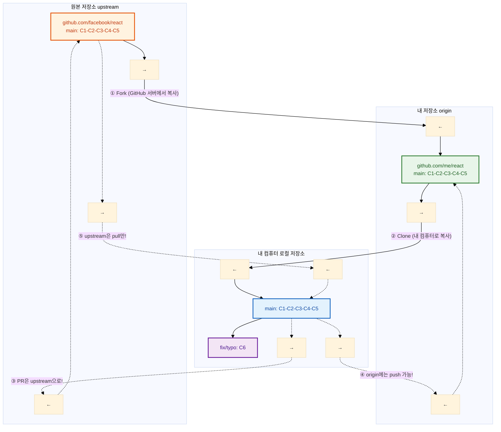
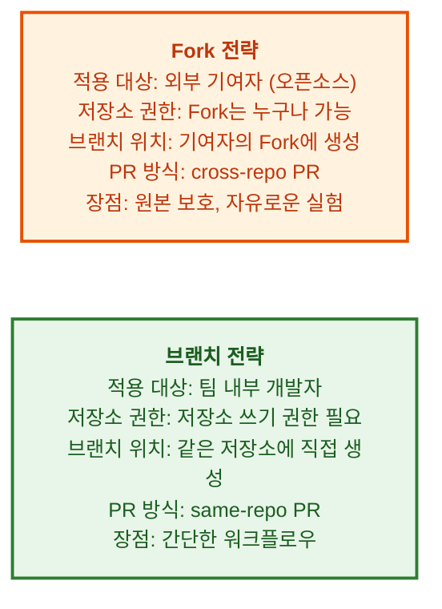

# Fork와 오픈소스 기여

---

## 👨‍💻 실전 프로젝트: 오픈소스에 기여해보기

이번 실전 프로젝트에서는 실제 오픈소스 프로젝트에 기여하는 전체 과정을 시뮬레이션해보겠습니다. 유명 오픈소스 프로젝트를 Fork하고, 코드를 수정한 후 Pull Request를 보내는 과정을 단계별로 진행합니다. 초보자도 부담 없이 시작할 수 있도록 문서 수정(오타 수정)부터 시작하여 점진적으로 코드 기여로 확장하는 방법을 배웁니다.

### 1단계: 기여할 프로젝트 찾기

오픈소스에 기여하기 위한 첫 단계는 자신이 관심 있고 자주 사용하는 프로젝트를 찾는 것입니다. 초보자에게는 `good first issue` 또는 `help wanted` 라벨이 붙은 이슈가 있는 프로젝트를 추천합니다. GitHub에서 `good first issue` 라벨로 검색하면 초보자에게 적합한 기여 기회를 쉽게 찾을 수 있습니다.

```bash
$ gh issue list --repo facebook/react --label "good first issue" --limit 5
$ gh issue list --repo microsoft/vscode --label "good first issue" --limit 5
```

### 2단계: 저장소 Fork하기

기여할 프로젝트를 찾았다면, 해당 프로젝트의 GitHub 페이지로 이동하여 오른쪽 상단의 **Fork** 버튼을 클릭합니다. Fork는 원본 저장소를 자신의 GitHub 계정으로 복사하는 작업으로, 이렇게 복사된 저장소에서 자유롭게 코드를 수정하고 실험할 수 있습니다.

```bash
# Fork한 저장소를 로컬에 클론
$ git clone https://github.com/me/react.git
$ cd react

# 원본 저장소를 upstream으로 추가 (동기화를 위해 필수)
$ git remote add upstream https://github.com/facebook/react.git
$ git remote -v
```

### 3단계: 브랜치 생성 및 수정 작업

Fork한 저장소에서 새로운 브랜치를 생성하여 작업을 시작합니다. main 브랜치에서 직접 작업하지 않고 별도의 브랜치를 만드는 이유는, 나중에 원본 저장소와 동기화할 때 충돌을 방지하기 위함입니다.

```bash
$ git switch -c fix/typo-in-readme
$ echo "fixed typo" >> README.md
$ git add README.md
$ git commit -m "README.md 오타 수정"
$ git push origin fix/typo-in-readme
```

### 4단계: Pull Request 생성하기

수정한 내용을 Fork 저장소에 푸시한 후, GitHub 웹사이트에서 **Compare & pull request** 버튼을 클릭하여 PR을 생성합니다. PR을 생성할 때는 원본 저장소의 main 브랜치를 base로, 자신의 Fork 저장소 브랜치를 compare로 설정해야 합니다. 제목과 본문에는 변경한 내용과 이유를 명확히 작성합니다.

### 5단계: 리뷰 피드백 반영 및 PR 업데이트

PR을 생성한 후에는 프로젝트 관리자나 다른 기여자들의 리뷰를 기다립니다. 리뷰어가 피드백을 남기면, 로컬에서 수정한 후 다시 푸시하여 PR을 업데이트합니다. 이 과정에서 PR에 추가 커밋이 자동으로 반영됩니다.

```bash
$ git switch fix/typo-in-readme
$ echo "additional fix" >> README.md
$ git add README.md
$ git commit -m "리뷰 반영: 추가 오타 수정"
$ git push origin fix/typo-in-readme
```

### 6단계: 원본 저장소 동기화 유지하기

PR이 병합되거나 대기 중인 동안 원본 저장소에 새로운 변경 사항이 생길 수 있습니다. 정기적으로 원본 저장소의 최신 코드를 Fork 저장소로 가져와 동기화하는 것이 중요합니다.

```bash
$ git switch main
$ git pull upstream main    # 원본 최신 코드 가져오기
$ git push origin main      # Fork도 업데이트
```

---

## 학습 목표

- Fork의 개념과 동작 방식을 이해합니다
- Fork를 사용한 오픈소스 기여 워크플로우를 수행할 수 있습니다
- 원본 저장소와 Fork 저장소 간의 동기화 방법을 이해합니다
- Fork 전략과 브랜치 전략의 차이점을 설명할 수 있습니다

---

오픈소스는 현대 소프트웨어 개발의 근간입니다. 우리는 수많은 오픈소스 프로젝트를 사용하며 개발하지만, 직접 기여하는 것은 또 다른 경험입니다. GitHub의 Fork 기능을 사용하면 누구나 오픈소스 프로젝트에 기여할 수 있으며, 이는 개인의 포트폴리오를 강화하고 개발자 커뮤니티와 연결되는 좋은 기회가 됩니다. 이번 장에서는 Fork의 개념부터 실제 기여 워크플로우, 유지보수 방법까지 단계별로 알아보겠습니다.

---

## Fork의 개념

Fork는 다른 사람의 GitHub 저장소를 자신의 계정으로 복사하는 기능입니다. 오픈소스 프로젝트에 기여할 때 사용하는 표준 방식으로, 원본 저장소에 직접 쓰기 권한이 없어도 코드를 자유롭게 수정하고 실험할 수 있다는 장점이 있습니다. Fork한 저장소는 원본 저장소와 완전히 독립적인 별도의 저장소이므로, 자신만의 방식으로 프로젝트를 변경하거나 확장할 수 있습니다.



위 다이어그램은 Fork의 전체적인 데이터 흐름을 보여줍니다. ① 원본 저장소(upstream)를 내 계정(origin)으로 Fork하고, ② origin을 로컬에 클론합니다. ③ 수정 사항이 있으면 PR을 통해 원본 저장소로 보내고, ④ origin에는 자유롭게 push할 수 있습니다. ⑤ 원본의 최신 변경 사항은 pull 명령어로 가져옵니다. 여기서 중요한 점은 upstream 저장소에는 push 권한이 없으므로, 모든 변경 요청은 PR을 통해서만 이루어져야 한다는 것입니다.

---

## Fork 기여 워크플로우

Fork의 개념을 이해하였습니다. 이제 실제로 Fork를 사용하여 오픈소스 프로젝트에 기여하는 전체 워크플로우를 살펴보겠습니다. 이 워크플로우는 오픈소스 기여의 표준 절차로, 대부분의 프로젝트에서 동일한 패턴을 따릅니다.

```bash
# 1. GitHub에서 원하는 프로젝트로 이동
#    "Fork" 버튼 클릭 → 내 계정으로 복사됨

# 2. 내 Fork를 로컬에 클론
$ git clone https://github.com/me/react.git
$ cd react

# 3. 원본 저장소를 upstream으로 추가
$ git remote add upstream https://github.com/facebook/react.git
$ git remote -v
origin    https://github.com/me/react.git (fetch)
origin    https://github.com/me/react.git (push)
upstream  https://github.com/facebook/react.git (fetch)
upstream  https://github.com/facebook/react.git (push)  # ← 주의: push 권한 없음!

# 4. 최신 코드로 동기화
$ git switch main
$ git pull upstream main    # 원본에서 최신 코드 가져오기
$ git push origin main      # 내 Fork에도 업데이트

# 5. 기능 개발 브랜치 생성
$ git switch -c fix/typo-in-readme

# 6. 수정 및 커밋
$ echo "fixed typo" >> README.md
$ git add . && git commit -m "README.md 오타 수정"

# 7. 내 Fork에 푸시
$ git push origin fix/typo-in-readme

# 8. GitHub에서 Pull Request 생성
#    "Compare & pull request" 버튼 클릭
#    base: owner/react main ← head: me/react fix/typo-in-readme
```

3단계에서 `git remote add upstream` 명령어로 원본 저장소를 추가하는 것이 매우 중요합니다. 이렇게 하면 `git pull upstream main` 명령어 하나로 원본 저장소의 최신 변경 사항을 가져올 수 있습니다. 8단계에서 PR을 생성할 때는 base(병합 대상)와 head(병합할 브랜치)를 올바르게 설정해야 합니다. 일반적으로 base는 원본 저장소의 main 브랜치, head는 자신의 Fork 저장소의 feature 브랜치를 선택합니다.

---

## 원본 저장소와 동기화 유지하기

Fork 기여 워크플로우를 익혔습니다. 오픈소스 기여 시 원본 저장소의 최신 변경 사항을 정기적으로 가져와야 합니다. 원본 저장소는 계속해서 발전하고 있으므로, 이를 따라가지 않으면 PR을 보낼 때 충돌이 발생할 수 있습니다. 특히 장기간 작업하는 feature 브랜치의 경우 더 자주 동기화하는 것이 좋습니다.

```bash
# 매일 아침: 원본 최신 코드로 동기화
$ git switch main
$ git pull upstream main          # 원본 최신 코드
$ git push origin main            # 내 Fork 업데이트

# feature 브랜치도 최신 main으로 리베이스
$ git switch feature/my-feature
$ git rebase main                  # feature 브랜치를 최신 main 위로
$ git push origin feature/my-feature --force-with-lease
```

`git rebase main` 명령어는 feature 브랜치의 base를 최신 main 브랜치로 재설정합니다. 이렇게 하면 feature 브랜치가 최신 코드 위에 올라가게 되어, PR 병합 시 충돌 가능성이 크게 줄어듭니다. `--force-with-lease` 옵션은 강제 푸시 시에도 다른 사람의 작업을 안전하게 보호하는 역할을 하므로, 일반 `--force`보다 훨씬 안전합니다.

---

## 오픈소스 기여 시뮬레이션

원본 저장소와의 동기화 방법까지 배웠습니다. 이제 실제 상황을 가정하여 오픈소스 기여 과정을 기여자와 저장소 관리자 두 관점에서 시뮬레이션해보겠습니다. 이를 통해 기여자와 관리자 모두의 입장을 이해하면 더 원활한 협업이 가능합니다.

### 기여자로서:

```bash
# 1. VSCode에 기여한다고 가정
$ git clone https://github.com/me/vscode.git
$ cd vscode
$ git remote add upstream https://github.com/microsoft/vscode.git

# 2. 이슈 확인: "버그: 설정 창에서 오타 발견 (#12345)"
$ git switch -c fix/typo-in-settings

# 3. 오타 수정
$ vi src/settings.ts  # "langauge" → "language"
$ git add . && git commit -m "설정 창 오타 수정 (Fixes #12345)"
$ git push origin fix/typo-in-settings

# 4. GitHub에서 PR 생성 (PR #12346)
#    5분 후: 리뷰어가 코멘트 "다른 파일에도 같은 오타가 있습니다"
#    추가 수정
$ vi src/other-file.ts
$ git add . && git commit -m "리뷰 반영: 다른 파일 오타도 수정"
$ git push origin fix/typo-in-settings

# 5. 승인 후 병합 완료! 🎉
#    내 이름이 CONTRIBUTORS에 추가됨!
```

기여자로서 가장 중요한 것은 프로젝트의 기여 가이드라인(CONTRIBUTING.md)을 미리 읽어보는 것입니다. 많은 프로젝트가 코드 스타일, 커밋 메시지 형식, PR 작성법 등에 대한 구체적인 규칙을 제공합니다. 또한 하나의 PR은 하나의 변경에 집중하는 것이 좋으며, 여러 수정 사항이 있다면 각각 별도의 PR로 나누어 제출해야 리뷰어가 부담 없이 검토할 수 있습니다.

### 저장소 관리자로서:

```bash
# 기여자의 PR을 리뷰하고 병합
$ git checkout -b review/pr-12346 upstream/main
$ gh pr checkout 12346          # PR 브랜치 가져오기
# 코드 리뷰 후...
$ gh pr merge 12346 --squash   # Squash 병합
```

저장소 관리자는 기여자의 PR을 검토할 때 단순히 코드의 정확성뿐만 아니라, 프로젝트의 코딩 컨벤션 준수 여부, 테스트 포함 여부, 문서화 여부 등도 함께 확인해야 합니다. 또한 새로운 기여자에게는 친절하고 건설적인 피드백을 제공하는 것이 중요하며, 이는 프로젝트 커뮤니티의 건강성을 유지하는 핵심 요소입니다.

---

## Fork 전략 vs 브랜치 전략

기여자와 관리자 두 관점에서 오픈소스 기여 과정을 살펴보았습니다. 그렇다면 Fork를 사용하는 방식과 팀 내에서 브랜치를 직접 사용하는 방식은 어떤 차이가 있을까요? 두 전략은 각각 다른 상황에 최적화되어 있으며, 프로젝트의 성격과 팀 구성에 따라 적절한 방식을 선택해야 합니다.



Fork 전략은 외부 기여자가 프로젝트에 기여할 때 사용하는 표준 방식입니다. 원본 저장소에 직접적인 영향을 주지 않으므로 안전하게 실험할 수 있고, 기여자는 자신의 Fork 저장소에서 자유롭게 브랜치를 관리할 수 있습니다. 반면 브랜치 전략은 팀 내부 개발자들이 같은 저장소에서 직접 협업할 때 사용하며, Fork 과정이 필요 없어 워크플로우가 더 간단합니다. 예를 들어, 사내 프로젝트에서는 브랜치 전략이, 공개 오픈소스 프로젝트에서는 Fork 전략이 일반적으로 사용됩니다.

---

## 유명 오픈소스 프로젝트 Fork 해보기

Fork 전략과 브랜치 전략의 차이를 이해하였습니다. 마지막으로 실제 유명 오픈소스 프로젝트를 대상으로 Fork 실습을 해보겠습니다. React, Vue, TensorFlow 등 유명 프로젝트는 모두 GitHub에서 호스팅되며, 누구나 Fork하여 기여할 수 있습니다.

```bash
# 연습: React에 기여해보기
$ git clone https://github.com/me/react.git
$ cd react
$ git remote add upstream https://github.com/facebook/react.git

# 문서 오타 찾기
$ git log --oneline --since="1 week ago" | head -5
# 최근 변경 사항 확인

# "good first issue" 라벨 찾기
$ gh issue list --label "good first issue" --limit 5
# 초보자에게 적합한 이슈 목록 출력
```

처음 오픈소스에 기여할 때는 코드 변경보다 문서 수정이나 오타 수정부터 시작하는 것을 추천합니다. 이러한 작은 기여도 프로젝트에 큰 도움이 되며, PR 프로세스에 익숙해지는 좋은 연습이 됩니다. 또한 `good first issue` 라벨이 붙은 이슈는 프로젝트 관리자가 초보자도 해결할 수 있도록特意로 선별한 작업이므로, 부담 없이 도전해볼 수 있습니다. 꾸준히 기여하다 보면 점차 더 복잡한 이슈로 도전할 수 있게 됩니다.

---

## 한눈에 정리

| 개념 | 설명 |
|------|------|
| Fork | 다른 사람의 저장소를 내 계정으로 복사하는 기능으로, 오픈소스 기여의 표준 방식입니다 |
| Upstream | 원본 저장소로, 기여 대상이 되는 프로젝트의 공식 저장소입니다 |
| Origin | 내 계정으로 Fork한 저장소로, 자유롭게 푸시할 수 있는 개인 복사본입니다 |
| Cross-repo PR | 서로 다른 저장소 간의 Pull Request로, Fork 기여 시 사용됩니다 |
| Same-repo PR | 같은 저장소 내 브랜치 간 Pull Request로, 팀 내 협업 시 사용됩니다 |
| Good First Issue | 초보 기여자에게 적합한 이슈 라벨로, 진입 장벽이 낮은 작업입니다 |
| Force-with-lease | 안전한 강제 푸시 옵션으로, 다른 사람의 작업을 보호합니다 |

---

## 연습 문제

1. Fork의 개념을 upstream, origin, 로컬 저장소의 관계를 포함하여 설명하고, 각각의 역할을 서술해보세요.
2. Fork를 사용한 오픈소스 기여 워크플로우를 8단계로 나누어 각 단계의 명령어와 함께 작성해보세요.
3. Fork 전략과 브랜치 전략의 차이점을 각각의 장단점과 함께 비교하고, 어떤 상황에서 어떤 전략을 선택해야 하는지 설명해보세요.
4. 원본 저장소와 Fork 저장소를 동기화할 때 rebase를 사용하는 이유와 `--force-with-lease` 옵션의 중요성을 설명해보세요.
