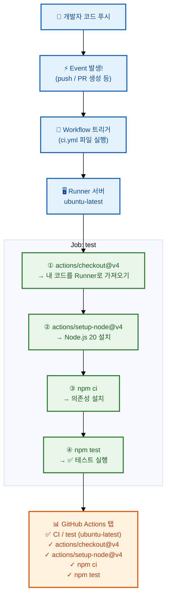
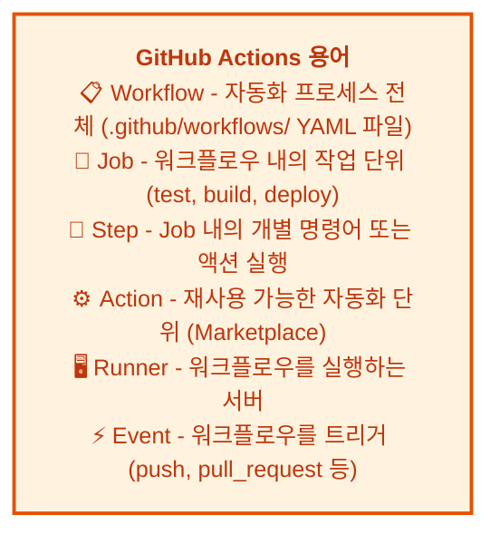

# GitHub Actions 기초

---

## 👨‍💻 실전 프로젝트: 첫 GitHub Actions 워크플로우 만들기

이번 실전 프로젝트에서는 GitHub Actions를 사용하여 CI/CD 워크플로우를 직접 만들어보겠습니다. `.github/workflows` 디렉토리에 YAML 파일을 생성하고, 코드 푸시 시 자동으로 테스트가 실행되는 환경을 구축합니다. 또한 PR이 생성될 때마다 테스트가 실행되어 병합 전에 코드 품질을 검증하는 파이프라인을 완성해보겠습니다.

### 1단계: 프로젝트 및 저장소 준비

먼저 간단한 Node.js 프로젝트를 생성하고 GitHub 저장소에 푸시합니다. 이 프로젝트는 간단한 단위 테스트를 포함하며, GitHub Actions를 통해 자동으로 테스트가 실행됩니다.

```bash
$ mkdir actions-practice && cd actions-practice
$ git init
$ npm init -y
$ npm install --save-dev jest
```

간단한 테스트 파일을 생성합니다.

```bash
$ mkdir test
$ echo 'test("adds 1 + 2 = 3", () => { expect(1 + 2).toBe(3); });' > test/example.test.js
```

`package.json`에 test 스크립트를 추가합니다.

```json
"scripts": { "test": "jest" }
```

### 2단계: 워크플로우 YAML 파일 생성

`.github/workflows` 디렉토리를 생성하고 `ci.yml` 파일을 작성합니다. 이 워크플로우는 main 브랜치에 push되거나 PR이 생성될 때 트리거되어 Node.js 20 환경에서 테스트를 실행합니다.

```bash
$ mkdir -p .github/workflows
```

```yaml
# .github/workflows/ci.yml
name: CI

on:
  push:
    branches: [ main ]
  pull_request:
    branches: [ main ]

jobs:
  test:
    runs-on: ubuntu-latest

    steps:
      - uses: actions/checkout@v4
      - uses: actions/setup-node@v4
        with:
          node-version: 20
      - run: npm ci
      - run: npm test
```

### 3단계: 저장소에 푸시하고 Actions 실행 확인

작성한 워크플로우 파일을 저장소에 푸시하고 GitHub Actions 탭에서 실행 결과를 확인합니다.

```bash
$ git add .
$ git commit -m "초기 설정: CI 워크플로우 추가"
$ git remote add origin https://github.com/me/actions-practice.git
$ git push -u origin main
```

푸시가 완료되면 GitHub 저장소의 **Actions** 탭으로 이동합니다. 방금 푸시한 커밋에 대해 CI 워크플로우가 자동으로 실행되고 있는 것을 확인할 수 있습니다. 각 Step의 실행 상태가 실시간으로 업데이트되며, 모든 Step이 초록색 체크 표시로 완료되면 성공입니다.

### 4단계: 의도적으로 실패하는 테스트 추가

이번에는 의도적으로 실패하는 테스트를 추가하여, GitHub Actions가 실패를 어떻게 보고하는지 확인해보겠습니다. 이 과정을 통해 CI/CD 파이프라인이 실패했을 때의 대응 방법을 배울 수 있습니다.

```bash
$ echo 'test("failing test", () => { expect(true).toBe(false); });' > test/fail.test.js
$ git add .
$ git commit -m "실패하는 테스트 추가"
$ git push origin main
```

Actions 탭에서 워크플로우가 실패하는 것을 확인한 후, 실패 원인을 파악하고 수정합니다. 실패한 테스트 파일을 제거하고 다시 푸시하여 모든 테스트가 통과하는 상태로 복원합니다.

### 5단계: 테스트 매트릭스 적용하기

여러 Node.js 버전에서 테스트를 실행하는 매트릭스 전략을 적용해보겠습니다. 이는 다양한 환경에서 코드가 정상 동작하는지 확인하는 데 유용합니다.

```yaml
# .github/workflows/ci.yml
name: CI

on: [push, pull_request]

jobs:
  test:
    runs-on: ubuntu-latest
    strategy:
      matrix:
        node-version: [18, 20, 22]

    steps:
      - uses: actions/checkout@v4
      - name: Node.js ${{ matrix.node-version }} 설정
        uses: actions/setup-node@v4
        with:
          node-version: ${{ matrix.node-version }}
          cache: 'npm'
      - run: npm ci
      - run: npm test
```

매트릭스 전략을 적용하면 `node-version`에 지정된 각 버전(18, 20, 22)에 대해 병렬로 테스트가 실행됩니다. 이를 통해 특정 Node.js 버전에서만 발생하는 호환성 문제를 조기에 발견할 수 있습니다. `cache: 'npm'` 옵션을 추가하면 `node_modules`가 캐시되어 이후 실행 속도가 크게 향상됩니다.

### 6단계: PR 상태 확인 및 병합

PR을 생성할 때 GitHub Actions의 실행 결과가 PR 페이지에 자동으로 표시됩니다. 모든 검사가 통과(초록색)해야 병합이 가능하며, 실패한 검사가 있을 경우 PR 작성자는 원인을 파악하고 수정해야 합니다.

```bash
$ gh pr checks 42    # PR #42의 CI 상태 확인
```

---

## 학습 목표

- GitHub Actions의 개념과 주요 용어를 이해합니다
- CI/CD 워크플로우 YAML 파일을 작성할 수 있습니다
- 다양한 워크플로우 예시(테스트, 라벨링, 배포)를 이해합니다
- Secrets와 환경 변수를 안전하게 관리하는 방법을 이해합니다

---

현대 소프트웨어 개발에서 자동화는 필수입니다. 코드를 푸시할 때마다 자동으로 테스트가 실행되고, PR이 병합될 때마다 자동으로 배포가 이루어진다면 얼마나 편리할까요? GitHub Actions는 이러한 CI/CD(지속적 통합/지속적 배포)를 GitHub 내에서 완벽하게 지원하는 도구입니다. Jenkins, Travis CI 등 외부 CI 도구와 달리 GitHub와 완전히 통합되어 있어 설정이 간편하고, 별도의 서버 관리가 필요 없습니다. 이번 장에서는 GitHub Actions의 개념부터 실제 워크플로우 작성, 배포 자동화까지 단계별로 알아보겠습니다.

---

## GitHub Actions 개념

GitHub Actions는 코드 푸시, PR 생성 등 특정 이벤트가 발생하면 자동으로 워크플로우를 실행합니다. 워크플로우는 YAML 형식으로 작성되며, `.github/workflows/` 디렉토리에 저장됩니다. 각 워크플로우는 하나 이상의 Job으로 구성되고, 각 Job은 다시 여러 Step으로 구성됩니다.

**워크플로우 실행 흐름:**





첫 번째 다이어그램은 개발자가 코드를 푸시했을 때 GitHub Actions가 어떻게 반응하는지 전체 흐름을 보여줍니다. 두 번째 다이어그램은 GitHub Actions의 주요 용어들을 정리한 것입니다. 이 용어들을 이해하면 GitHub Actions의 문서를 읽거나 직접 워크플로우를 작성할 때 훨씬 수월해집니다. 특히 **Action**은 GitHub Marketplace에서 다른 개발자들이 만들어 공유한 재사용 가능한 자동화 단위로, 이를 활용하면 복잡한 설정 없이도 강력한 자동화를 구축할 수 있습니다.

---

## 첫 번째 워크플로우 만들기

GitHub Actions의 개념과 용어를 이해하였습니다. 이제 실제로 첫 번째 워크플로우를 만들어 보겠습니다. 가장 기본적인 형태는 main 브랜치에 push되거나 PR이 생성될 때 자동으로 테스트를 실행하는 CI 워크플로우입니다.

```yaml
# .github/workflows/ci.yml
name: CI

on:
  push:
    branches: [ main ]
  pull_request:
    branches: [ main ]

jobs:
  test:
    runs-on: ubuntu-latest

    steps:
      - uses: actions/checkout@v4
      - uses: actions/setup-node@v4
        with:
          node-version: 20
      - run: npm ci
      - run: npm test
```

**실행 결과 화면:**
```
GitHub 저장소 → Actions 탭 → CI 워크플로우
  ✓ test (ubuntu-latest)
    ✓ actions/checkout@v4
    ✓ actions/setup-node@v4
    ✓ npm ci
    ✓ npm test    ← 모두 통과!
```

이 워크플로우는 `actions/checkout@v4`로 저장소 코드를 Runner 환경으로 가져오고, `actions/setup-node@v4`로 Node.js 20을 설치합니다. 그 다음 `npm ci`로 의존성을 설치하고, `npm test`로 테스트를 실행합니다. `npm ci`는 `npm install`과 달리 `package-lock.json` 파일을 기반으로 정확히 일치하는 의존성을 설치하므로, CI 환경에서 더 빠르고 안정적입니다. 모든 Step이 성공하면 워크플로우는 초록색 체크 표시로 완료됩니다.

---

## 다양한 워크플로우 예시

첫 번째 워크플로우를 만들었습니다. 이제 더 실용적인 다양한 워크플로우 예시를 살펴보겠습니다. 실제 프로젝트에서는 테스트뿐만 아니라, 코드 스타일 검사(lint), 여러 Node.js 버전에서의 호환성 검증, 테스트 결과 아티팩트 저장 등 다양한 작업을 자동화할 수 있습니다.

### Node.js 프로젝트 테스트

```yaml
# .github/workflows/node-test.yml
name: Node.js Test

on: [push, pull_request]

jobs:
  test:
    runs-on: ubuntu-latest
    strategy:
      matrix:
        node-version: [18, 20, 22]

    steps:
      - uses: actions/checkout@v4
      - name: Node.js ${{ matrix.node-version }} 설정
        uses: actions/setup-node@v4
        with:
          node-version: ${{ matrix.node-version }}
          cache: 'npm'
      - run: npm ci
      - run: npm run lint
      - run: npm test
      - name: 테스트 결과 업로드
        if: always()
        uses: actions/upload-artifact@v4
        with:
          name: test-results-${{ matrix.node-version }}
          path: test-results/
```

이 워크플로우는 매트릭스 전략을 사용하여 Node.js 18, 20, 22 세 가지 버전에서 각각 테스트를 실행합니다. `cache: 'npm'` 옵션으로 의존성을 캐시하여 실행 시간을 단축하고, `npm run lint`로 코드 스타일을 검사합니다. `if: always()` 조건을 사용하면 테스트가 실패하더라도 결과 아티팩트가 업로드되므로, 실패 원인을 분석하는 데 활용할 수 있습니다.

### PR에 자동 라벨 추가

```yaml
# .github/workflows/pr-label.yml
name: PR Labeler

on:
  pull_request:
    types: [opened]

jobs:
  label:
    runs-on: ubuntu-latest
    steps:
      - uses: actions/labeler@v5
        with:
          repo-token: ${{ secrets.GITHUB_TOKEN }}
```

이 워크플로우는 PR이 생성될 때 자동으로 라벨을 추가합니다. `actions/labeler@v5` 액션은 PR에서 변경된 파일 패턴을 분석하여 미리 정의된 규칙에 따라 라벨을 자동 할당합니다. 예를 들어, `src/` 디렉토리의 파일이 변경되면 `source` 라벨이, `docs/` 디렉토리의 파일이 변경되면 `documentation` 라벨이 자동으로 추가됩니다.

### 배포 자동화

```yaml
# .github/workflows/deploy.yml
name: Deploy to Production

on:
  push:
    branches: [ main ]

jobs:
  deploy:
    runs-on: ubuntu-latest
    steps:
      - uses: actions/checkout@v4
      - run: npm ci
      - run: npm run build
      - name: Deploy to S3
        uses: jakejarvis/s3-sync-action@v0.5.1
        with:
          args: --delete
        env:
          AWS_S3_BUCKET: ${{ secrets.AWS_BUCKET_NAME }}
          AWS_ACCESS_KEY_ID: ${{ secrets.AWS_ACCESS_KEY_ID }}
          AWS_SECRET_ACCESS_KEY: ${{ secrets.AWS_SECRET_ACCESS_KEY }}
          SOURCE_DIR: 'build'
```

이 배포 워크플로우는 main 브랜치에 새로운 코드가 푸시될 때마다 자동으로 AWS S3에 정적 웹사이트를 배포합니다. `npm run build`로 프로젝트를 빌드한 후, `jakejarvis/s3-sync-action` 액션을 사용하여 빌드 결과물을 S3 버킷에 동기화합니다. AWS 인증 정보는 `secrets`에 저장된 값을 사용하므로, YAML 파일에 직접 민감 정보를 노출하지 않아 안전합니다.

---

## GitHub Actions Marketplace

다양한 워크플로우 예시를 살펴보았습니다. GitHub Actions의 강력한 점 중 하나는 Marketplace에서 수천 개의 사전 제작 액션을 사용할 수 있다는 것입니다. 이러한 액션들은 커뮤니티와 공식 기관에서 제공하며, 누구나 자유롭게 사용할 수 있습니다.

Actions Marketplace에서 수천 개의 사전 제작 액션을 사용할 수 있습니다.

```yaml
# 인기 있는 액션 예시
- uses: actions/checkout@v4              # 저장소 체크아웃
- uses: actions/setup-node@v4            # Node.js 설정
- uses: actions/setup-python@v5          # Python 설정
- uses: docker/build-push-action@v5      # Docker 이미지 빌드/푸시
- uses: actions/cache@v4                  # 의존성 캐싱 (빌드 속도 향상)
- uses: github/codeql-action@v3           # 코드 보안 취약점 분석
```

Marketplace에서 액션을 찾을 때는 별점, 사용 횟수, 최종 업데이트 날짜를 확인하여 신뢰할 수 있는 액션을 선택하는 것이 중요합니다. 공식 GitHub Actions나 유명 기업이 제공하는 액션은 신뢰도가 높아 안심하고 사용할 수 있습니다. 또한 `@v4`와 같은 버전 태그를 명시하여 특정 버전의 액션을 고정하면, 예기치 않은 업데이트로 인한 워크플로우 중단을 방지할 수 있습니다.

---

## 워크플로우 실행 확인

워크플로우를 작성하고 나면 실행 상태를 확인하는 방법도 알아야 합니다. GitHub CLI를 사용하여 Actions의 상태를 확인할 수 있습니다. 터미널에서 직접 실행 상태를 모니터링하면 웹 브라우저를 열지 않고도 빠르게 확인할 수 있어 효율적입니다.

```bash
# GitHub CLI로 Actions 상태 확인
$ gh run list
STATUS  NAME        WORKFLOW  BRANCH  COMMIT  AGE
✓       CI          main      a1b2c3  2m ago
✗       Deploy      develop   d4e5f6  1h ago
✓       Node Test   feat/x    g7h8i9  3h ago

# 특정 실행 상세 보기
$ gh run view 123456789
✓ CI · main · a1b2c3d
Jobs:
  ✓ test (18)   12s
  ✓ test (20)   11s
  ✓ test (22)   14s

# 로그 확인
$ gh run view 123456789 --log
```

`gh run list` 명령어는 최근 워크플로우 실행 목록을 상태, 브랜치, 실행 시간과 함께 보여줍니다. 실패한 실행(✗)이 있다면 `gh run view <ID>` 명령어로 상세 로그를 확인하여 실패 원인을 분석할 수 있습니다. `--log` 옵션을 추가하면 모든 Step의 전체 로그를 출력하므로, 디버깅에 매우 유용합니다.

---

## Secrets와 환경 변수

워크플로우 실행 상태를 확인하는 방법까지 익혔습니다. 이번에는 보안에 중요한 Secrets와 환경 변수 관리 방법에 대해 알아보겠습니다. API 키, 데이터베이스 비밀번호, SSH 키와 같은 민감 정보를 워크플로우 파일에 직접 작성하면 저장소가 공개되었을 때 심각한 보안 문제가 발생할 수 있습니다.

비밀 키나 API 토큰은 저장소 설정의 **Secrets and variables**에 저장합니다.

```bash
# GitHub CLI로 Secrets 설정
$ gh secret set AWS_ACCESS_KEY_ID
✓ Set Actions secret AWS_ACCESS_KEY_ID for username/repo

$ gh secret set DEPLOY_KEY --body "ssh-rsa AAAA..."
✓ Set Actions secret DEPLOY_KEY for username/repo
```

```yaml
# 워크플로우에서 Secrets 사용
jobs:
  deploy:
    steps:
      - run: deploy.sh
        env:
          AWS_KEY: ${{ secrets.AWS_ACCESS_KEY_ID }}
          NODE_ENV: production   # 일반 환경 변수
```

Secrets는 저장소 수준이나 조직 수준에서 설정할 수 있으며, 설정된 값은 워크플로우 실행 시에만 복호화되어 사용됩니다.즉, Secrets 값은 워크플로우 로그에 출력되지 않으며, 권한이 없는 사용자는 값을 확인할 수 없습니다. 환경 변수(`NODE_ENV: production`처럼)는 Secrets와 달리 일반 텍스트로 저장되므로, 민감하지 않은 설정값을 저장하는 데 사용합니다. 민감 정보는 반드시 Secrets에 저장하고, 일반 설정은 환경 변수나 YAML 파일에 직접 작성하는 것이 안전한 방법입니다.

---

## CI/CD 파이프라인 전체 예시

Secrets와 환경 변수 관리까지 배웠습니다. 마지막으로 지금까지 배운 모든 내용을 종합하여 완전한 CI/CD 파이프라인 예시를 살펴보겠습니다. 이 예시는 lint, test, deploy 세 단계로 구성되어 있으며, 각 단계는 순차적으로 실행됩니다.

```yaml
# .github/workflows/main.yml
name: CI/CD Pipeline

on:
  push:
    branches: [ main, develop ]
  pull_request:
    branches: [ main ]

jobs:
  lint:
    runs-on: ubuntu-latest
    steps:
      - uses: actions/checkout@v4
      - run: npm ci && npm run lint

  test:
    needs: lint
    runs-on: ubuntu-latest
    strategy:
      matrix:
        node: [18, 20]
    steps:
      - uses: actions/checkout@v4
      - uses: actions/setup-node@v4
        with:
          node-version: ${{ matrix.node }}
      - run: npm ci
      - run: npm test -- --coverage
      - uses: actions/upload-artifact@v4
        with:
          name: coverage-${{ matrix.node }}
          path: coverage/

  deploy:
    needs: test
    if: github.ref == 'refs/heads/main'
    runs-on: ubuntu-latest
    steps:
      - uses: actions/checkout@v4
      - run: npm ci && npm run build
      - run: ./deploy.sh
        env:
          DEPLOY_KEY: ${{ secrets.DEPLOY_KEY }}
```

이 파이프라인의 특징은 `needs` 키워드를 사용한 Job 간 의존성 설정입니다. `test` Job은 `lint` Job이 성공해야 실행되고, `deploy` Job은 `test` Job이 성공해야 실행됩니다. 또한 `if: github.ref == 'refs/heads/main'` 조건을 통해 main 브랜치에서만 배포가 이루어지도록 제한합니다. 이렇게 단계별로 검증을 강화하면, 코드 품질을 보장하면서 안전하게 배포할 수 있는 CI/CD 파이프라인을 구축할 수 있습니다.

---

## 한눈에 정리

| 개념 | 설명 |
|------|------|
| CI/CD | 지속적 통합/지속적 배포, 코드 변경 시 자동 빌드, 테스트, 배포를 수행하는 개발 방법론입니다 |
| Workflow | 자동화 프로세스 전체를 정의한 YAML 파일로, `.github/workflows/` 디렉토리에 저장됩니다 |
| Job | 워크플로우 내의 작업 단위(test, build, deploy)로, 여러 Job은 병렬 또는 순차 실행 가능합니다 |
| Step | Job 내의 개별 명령어 또는 액션 실행 단위로, 각 Step은 순차적으로 실행됩니다 |
| Action | 재사용 가능한 자동화 단위로, Marketplace에서 제공되는 사전 제작 액션을 사용할 수 있습니다 |
| Runner | 워크플로우를 실행하는 서버 환경으로, Ubuntu, Windows, macOS 등이 지원됩니다 |
| Event | 워크플로우를 트리거하는 조건(push, pull_request, schedule 등)입니다 |
| Secrets | 암호화되어 저장되는 민감 정보로, 워크플로우 실행 시에만 복호화됩니다 |

---

## 연습 문제

1. GitHub Actions의 주요 구성 요소(Workflow, Job, Step, Action, Runner, Event)를 각각 설명하고, 실제 예시와 함께 연결지어 설명해보세요.
2. 다음 요구사항을 충족하는 워크플로우 YAML 파일을 작성해보세요: main 브랜치에 push 시 Node.js 20 환경에서 lint와 test를 실행하고, 테스트 결과를 아티팩트로 업로드합니다.
3. Secrets를 사용하는 이유와 GitHub CLI로 Secrets를 설정하는 방법을 설명하고, Secrets와 일반 환경 변수의 차이점을 비교해보세요.
4. 매트릭스 전략을 사용하는 이유와, `needs` 키워드를 통한 Job 간 의존성 설정의 이점을 설명해보세요.
