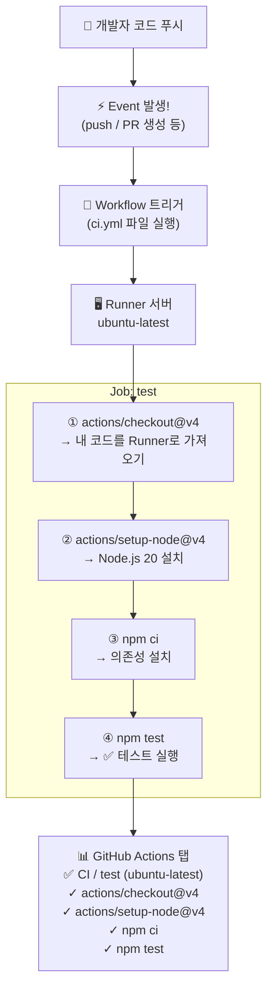
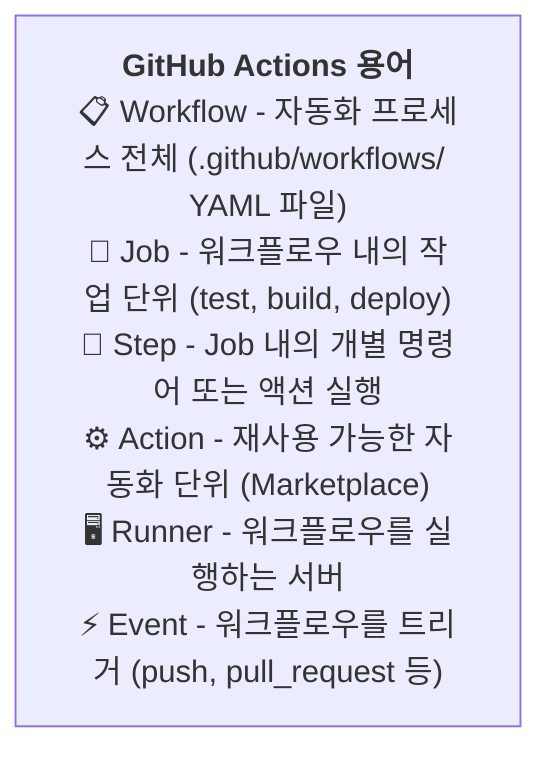

# GitHub Actions 기초

## 학습 목표

- GitHub Actions의 개념과 주요 용어를 이해합니다
- CI/CD 워크플로우 YAML 파일을 작성할 수 있습니다
- 다양한 워크플로우 예시(테스트, 라벨링, 배포)를 이해합니다
- Secrets와 환경 변수를 안전하게 관리하는 방법을 이해합니다

현대 소프트웨어 개발에서 자동화는 필수입니다. 코드를 푸시할 때마다 자동으로 테스트가 실행되고, PR이 병합될 때마다 자동으로 배포가 이루어진다면 얼마나 편리할까요? GitHub Actions는 이러한 CI/CD(지속적 통합/지속적 배포)를 GitHub 내에서 완벽하게 지원하는 도구입니다. 이번 장에서는 GitHub Actions의 개념부터 실제 워크플로우 작성, 배포 자동화까지 단계별로 알아보겠습니다.

## GitHub Actions 개념

GitHub Actions는 코드 푸시, PR 생성 등 특정 이벤트가 발생하면 자동으로 워크플로우를 실행합니다.

**워크플로우 실행 흐름:**




## 첫 번째 워크플로우 만들기

GitHub Actions의 개념과 용어를 이해하였습니다. 이제 실제로 첫 번째 워크플로우를 만들어 보겠습니다.

```yaml
# .github/workflows/ci.yml
name: CI

on:
  push:
    branches: [ main ]
  pull_request:
    branches: [ main ]

jobs:
  test:
    runs-on: ubuntu-latest

    steps:
      - uses: actions/checkout@v4
      - uses: actions/setup-node@v4
        with:
          node-version: 20
      - run: npm ci
      - run: npm test
```

**실행 결과 화면:**
```
GitHub 저장소 → Actions 탭 → CI 워크플로우
  ✓ test (ubuntu-latest)
    ✓ actions/checkout@v4
    ✓ actions/setup-node@v4
    ✓ npm ci
    ✓ npm test    ← 모두 통과!
```

## 다양한 워크플로우 예시

첫 번째 워크플로우를 만들었습니다. 이제 더 실용적인 다양한 워크플로우 예시를 살펴보겠습니다.

### Node.js 프로젝트 테스트

```yaml
# .github/workflows/node-test.yml
name: Node.js Test

on: [push, pull_request]

jobs:
  test:
    runs-on: ubuntu-latest
    strategy:
      matrix:
        node-version: [18, 20, 22]

    steps:
      - uses: actions/checkout@v4
      - name: Node.js ${{ matrix.node-version }} 설정
        uses: actions/setup-node@v4
        with:
          node-version: ${{ matrix.node-version }}
          cache: 'npm'
      - run: npm ci
      - run: npm run lint
      - run: npm test
      - name: 테스트 결과 업로드
        if: always()
        uses: actions/upload-artifact@v4
        with:
          name: test-results-${{ matrix.node-version }}
          path: test-results/
```

### PR에 자동 라벨 추가

```yaml
# .github/workflows/pr-label.yml
name: PR Labeler

on:
  pull_request:
    types: [opened]

jobs:
  label:
    runs-on: ubuntu-latest
    steps:
      - uses: actions/labeler@v5
        with:
          repo-token: ${{ secrets.GITHUB_TOKEN }}
```

### 배포 자동화

```yaml
# .github/workflows/deploy.yml
name: Deploy to Production

on:
  push:
    branches: [ main ]

jobs:
  deploy:
    runs-on: ubuntu-latest
    steps:
      - uses: actions/checkout@v4
      - run: npm ci
      - run: npm run build
      - name: Deploy to S3
        uses: jakejarvis/s3-sync-action@v0.5.1
        with:
          args: --delete
        env:
          AWS_S3_BUCKET: ${{ secrets.AWS_BUCKET_NAME }}
          AWS_ACCESS_KEY_ID: ${{ secrets.AWS_ACCESS_KEY_ID }}
          AWS_SECRET_ACCESS_KEY: ${{ secrets.AWS_SECRET_ACCESS_KEY }}
          SOURCE_DIR: 'build'
```

## GitHub Actions Marketplace

다양한 워크플로우 예시를 살펴보았습니다. GitHub Actions의 강력한 점 중 하나는 Marketplace에서 수천 개의 사전 제작 액션을 사용할 수 있다는 것입니다.

Actions Marketplace에서 수천 개의 사전 제작 액션을 사용할 수 있습니다.

```yaml
# 인기 있는 액션 예시
- uses: actions/checkout@v4              # 저장소 체크아웃
- uses: actions/setup-node@v4            # Node.js 설정
- uses: actions/setup-python@v5          # Python 설정
- uses: docker/build-push-action@v5      # Docker 이미지 빌드/푸시
- uses: actions/cache@v4                  # 의존성 캐싱 (빌드 속도 향상)
- uses: github/codeql-action@v3           # 코드 보안 취약점 분석
```

## 워크플로우 실행 확인

워크플로우를 작성하고 나면 실행 상태를 확인하는 방법도 알아야 합니다. GitHub CLI를 사용하여 Actions의 상태를 확인할 수 있습니다.

```bash
# GitHub CLI로 Actions 상태 확인
$ gh run list
STATUS  NAME        WORKFLOW  BRANCH  COMMIT  AGE
✓       CI          main      a1b2c3  2m ago
✗       Deploy      develop   d4e5f6  1h ago
✓       Node Test   feat/x    g7h8i9  3h ago

# 특정 실행 상세 보기
$ gh run view 123456789
✓ CI · main · a1b2c3d
Jobs:
  ✓ test (18)   12s
  ✓ test (20)   11s
  ✓ test (22)   14s

# 로그 확인
$ gh run view 123456789 --log
```

## Secrets와 환경 변수

워크플로우 실행 상태를 확인하는 방법까지 익혔습니다. 이번에는 보안에 중요한 Secrets와 환경 변수 관리 방법에 대해 알아보겠습니다.

비밀 키나 API 토큰은 저장소 설정의 **Secrets and variables**에 저장합니다.

```bash
# GitHub CLI로 Secrets 설정
$ gh secret set AWS_ACCESS_KEY_ID
✓ Set Actions secret AWS_ACCESS_KEY_ID for username/repo

$ gh secret set DEPLOY_KEY --body "ssh-rsa AAAA..."
✓ Set Actions secret DEPLOY_KEY for username/repo
```

```yaml
# 워크플로우에서 Secrets 사용
jobs:
  deploy:
    steps:
      - run: deploy.sh
        env:
          AWS_KEY: ${{ secrets.AWS_ACCESS_KEY_ID }}
          NODE_ENV: production   # 일반 환경 변수
```

## CI/CD 파이프라인 전체 예시

Secrets와 환경 변수 관리까지 배웠습니다. 마지막으로 지금까지 배운 모든 내용을 종합하여 완전한 CI/CD 파이프라인 예시를 살펴보겠습니다.

```yaml
# .github/workflows/main.yml
name: CI/CD Pipeline

on:
  push:
    branches: [ main, develop ]
  pull_request:
    branches: [ main ]

jobs:
  lint:
    runs-on: ubuntu-latest
    steps:
      - uses: actions/checkout@v4
      - run: npm ci && npm run lint

  test:
    needs: lint
    runs-on: ubuntu-latest
    strategy:
      matrix:
        node: [18, 20]
    steps:
      - uses: actions/checkout@v4
      - uses: actions/setup-node@v4
        with:
          node-version: ${{ matrix.node }}
      - run: npm ci
      - run: npm test -- --coverage
      - uses: actions/upload-artifact@v4
        with:
          name: coverage-${{ matrix.node }}
          path: coverage/

  deploy:
    needs: test
    if: github.ref == 'refs/heads/main'
    runs-on: ubuntu-latest
    steps:
      - uses: actions/checkout@v4
      - run: npm ci && npm run build
      - run: ./deploy.sh
        env:
          DEPLOY_KEY: ${{ secrets.DEPLOY_KEY }}
```

## 한눈에 정리

| 개념 | 설명 |
|------|------|
| CI/CD | 지속적 통합/지속적 배포, 코드 변경 시 자동 빌드, 테스트, 배포 |
| Workflow | 자동화 프로세스 전체를 정의한 YAML 파일 |
| Job | 워크플로우 내의 작업 단위 (test, build, deploy) |
| Step | Job 내의 개별 명령어 또는 액션 |
| Action | 재사용 가능한 자동화 단위 (Marketplace에서 제공) |
| Runner | 워크플로우를 실행하는 서버 환경 |
| Event | 워크플로우를 트리거하는 조건 (push, pull_request 등) |
| Secrets | 암호화되어 저장되는 민감 정보 (API 토큰, 비밀 키) |

## 연습 문제

1. GitHub Actions의 주요 구성 요소(Workflow, Job, Step, Action, Runner, Event)를 각각 설명해보세요.
2. 다음 요구사항을 충족하는 워크플로우 YAML 파일을 작성해보세요: main 브랜치에 push 시 Node.js 20 환경에서 lint와 test를 실행
3. Secrets를 사용하는 이유와 GitHub CLI로 Secrets를 설정하는 방법을 설명해보세요.
