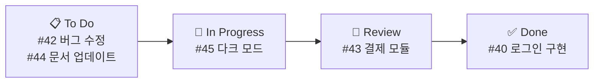

# Issues와 Projects 관리


## 학습 목표

- Issue의 개념과 좋은 Issue 작성법을 이해합니다
- Issue에 라벨, 담당자, 마일스톤을 지정하고 관리할 수 있습니다
- Issue를 PR과 연결하는 방법을 이해합니다
- Projects를 사용하여 작업을 시각적으로 관리할 수 있습니다

프로젝트 개발에서 "무엇을 해야 하는지"를 체계적으로 관리하는 것은 코드를 작성하는 것만큼 중요합니다. GitHub의 Issues와 Projects는 버그 추적, 기능 요청, 작업 관리를 위한 강력한 도구입니다. 우리는 이번 장에서 Issue와 Projects를 활용하여 프로젝트를 효과적으로 관리하는 방법을 알아보겠습니다.

## Issues (이슈)

Issues는 프로젝트에서 해결해야 할 작업 단위입니다. 버그 신고, 기능 제안, 질문 등 다양한 용도로 사용됩니다.

### 좋은 Issue 작성법

```markdown
# ❌ 좋지 않은 예
제목: 버그 있음
내용: 로그인이 안 돼요

# ✅ 좋은 예 (버그 리포트)
제목: [버그] 로그인 버튼 클릭 시 크래시 발생 (#42)

내용:
## 버그 설명
로그인 버튼을 클릭하면 앱이 크래시됩니다.

## 재현 방법
1. http://localhost:3000/login 접속
2. 이메일과 비밀번호 입력
3. 로그인 버튼 클릭
4. 앱 크래시!

## 예상 동작
로그인이 정상적으로 완료되어야 합니다.

## 실제 동작
로그인 버튼 클릭 시 "TypeError: Cannot read property 'token' of null" 오류

## 환경
- OS: macOS 14.5
- Browser: Chrome 126
- Node: v20.12.0

## 스크린샷


## 추가 정보
#38 PR에서 도입된 코드와 관련있을 수 있습니다.
```

```markdown
# ✅ 좋은 예 (기능 요청)
제목: [기능] 다크 모드 지원 (#45)

## 기능 설명
사용자가 다크 모드로 전환할 수 있는 기능이 필요합니다.

## 해결 방안
- 설정 페이지에 테마 전환 토글 추가
- CSS 변수를 사용한 테마 시스템
- 시스템 설정 자동 감지 (prefers-color-scheme)

## 대안
브라우저 확장 프로그램에 의존 (비추천)

## 추가 컨텍스트
관련 Issue: #12 (접근성)
```

### Issue에 라벨과 담당자 지정

```bash
# GitHub CLI로 Issue 관리
$ gh issue list
Showing 5 of 5 issues in username/repo
#1  [버그] 로그인 크래시    bug       high   2 days ago
#2  [기능] 다크 모드        feature   medium 5 days ago
#3  문서 업데이트           docs      low    1 week ago

# 새 Issue 생성
$ gh issue create \
    --title "[버그] 결제 페이지 오타" \
    --body "`price` 변수명이 `pric`으로 오타났습니다." \
    --label bug \
    --assignee @me

# Issue 보기
$ gh issue view 42
```

### Issue 템플릿 설정

`.github/ISSUE_TEMPLATE/` 디렉토리에 템플릿을 만들 수 있습니다.

```yaml
# .github/ISSUE_TEMPLATE/bug_report.yml
name: 버그 리포트
description: 버그를 신고합니다
labels: [bug]
body:
  - type: textarea
    id: description
    attributes:
      label: 버그 설명
      placeholder: 무슨 문제가 발생했나요?
    validations:
      required: true
  - type: textarea
    id: steps
    attributes:
      label: 재현 방법
      placeholder: 1. ... 2. ... 3. ...
    validations:
      required: true
  - type: dropdown
    id: browser
    attributes:
      label: 브라우저
      options:
        - Chrome
        - Firefox
        - Safari
```

### Issue를 PR과 연결하기

```bash
# 커밋 메시지에 이슈 번호 포함
$ git commit -m "로그인 크래시 버그 수정 (Fixes #42)"

# PR 설명에 이슈 연결
# `Closes #42` → PR 병합 시 자동으로 Issue도 닫힘
```

**자동 연결 키워드:**
```
close, closes, closed
fix, fixes, fixed
resolve, resolves, resolved

# 예시
git commit -m "Fixes #42"
git commit -m "Closes #45, #46"
git commit -m "Resolves #50"
```

## Projects (프로젝트)

Issue를 효과적으로 작성하고 관리하는 방법을 배웠습니다. 이제 여러 Issue와 PR을 한눈에 관리할 수 있는 Projects에 대해 알아보겠습니다.

Projects는 칸반 보드 스타일의 프로젝트 관리 도구입니다. Issue와 PR을 시각적으로 관리할 수 있습니다.

### Projects 보기

GitHub 저장소에서 **Projects** 탭 클릭 → **Create project** → **Board** 선택


### Projects 자동화

```yaml
# .github/workflows/project-automation.yml
name: Project Automation

on:
  issues:
    types: [opened]
  pull_request:
    types: [opened]

jobs:
  add-to-project:
    runs-on: ubuntu-latest
    steps:
      - uses: actions/add-to-project@v0.5.0
        with:
          project-url: https://github.com/orgs/my-org/projects/1
          github-token: ${{ secrets.PROJECT_TOKEN }}
```

### Milestone (마일스톤)

Milestone은 특정 버전이나 릴리스를 위한 Issue와 PR의 그룹입니다.

```bash
# GitHub CLI로 Milestone 목록 확인
$ gh api repos/owner/repo/milestones --jq '.[].title'
v1.0.0
v2.0.0

# Milestone에 Issue 할당
# Issue 페이지 → Milestone → v2.0.0 선택
```

## Labels (라벨) 커스터마이징

Projects와 Milestone까지 살펴보았습니다. 이제 Issue를 더욱 체계적으로 분류하기 위한 라벨 커스터마이징에 대해 알아보겠습니다.

```bash
# GitHub CLI로 라벨 생성
$ gh label create bug --color d73a4a --description "버그 리포트"
$ gh label create feature --color a2eeef --description "새로운 기능"
$ gh label create docs --color 0075ca --description "문서 변경"
$ gh label create high-priority --color b60205 --description "높은 우선순위"

# 기본 라벨
$ gh label list
bug           🐛  버그 리포트
documentation 📝  문서 변경
duplicate     🔁  중복 Issue
enhancement   ✨  기능 개선
good first issue 🎯 초보자용
help wanted   🙋  도움 요청
invalid       ❌  유효하지 않음
question      ❓  질문
wontfix       🚫  수정하지 않음
```

## Saved Replies (저장된 답변)

Labels를 활용한 Issue 분류 방법까지 배웠습니다. 마지막으로 반복적인 응답을 효율적으로 처리할 수 있는 Saved Replies 기능을 알아보겠습니다.

자주 사용하는 답변을 저장해 두었다가 재사용할 수 있습니다.

```
GitHub Settings → Saved replies → New saved reply

Title: "재현 방법 필요"
Body: 재현 방법을 자세히 알려주시겠어요? 로그나 스크린샷이 있으면 도움이 됩니다.
```

## 한눈에 정리

| 개념 | 설명 |
|------|------|
| Issue | 버그 신고, 기능 요청, 작업 단위를 추적하는 도구 |
| Label | Issue를 분류하는 태그 (bug, feature, docs 등) |
| Milestone | 특정 버전이나 릴리스를 위한 Issue 그룹 |
| Project | 칸반 보드 스타일의 시각적 작업 관리 도구 |
| Saved Replies | 자주 사용하는 응답을 저장하여 재사용하는 기능 |
| Issue Template | Issue 생성을 위한 표준 양식 |
| 자동 연결 키워드 | PR 병합 시 Issue를 자동으로 닫는 키워드 (Fixes, Closes, Resolves) |

## 연습 문제

1. 좋은 Issue를 작성하는 방법을 버그 리포트와 기능 요청 각각에 대해 설명해보세요.
2. Issue와 PR을 연결하는 키워드에는 무엇이 있으며, 각각 어떻게 동작하는지 설명해보세요.
3. Projects를 사용하면 어떤 이점이 있는지 칸반 보드의 관점에서 설명해보세요.
