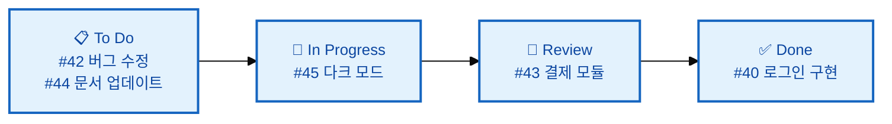

# Issues와 Projects 관리

---

## 👨‍💻 실전 프로젝트: 이슈와 프로젝트로 작업 관리하기

이번 실전 프로젝트에서는 GitHub Issues와 Projects를 사용하여 실제 프로젝트 작업을 체계적으로 관리하는 방법을 배워보겠습니다. 버그 리포트 작성, 기능 요청, 라벨 분류, 마일스톤 설정, 칸반 보드 기반의 프로젝트 관리까지 전 과정을 직접 경험할 수 있습니다.

### 1단계: 첫 번째 Issue 생성하기

실습용 저장소에서 **Issues** 탭으로 이동하여 **New issue** 버튼을 클릭합니다. 버그 리포트를 작성하는 상황을 가정하여 제목에는 관련 정보를 명확히 포함하고, 본문에는 재현 방법, 예상 동작, 실제 동작, 환경 정보를 체계적으로 기술합니다.

```
제목: [버그] 로그인 버튼 클릭 시 500 오류 발생

본문:
## 버그 설명
로그인 버튼을 클릭하면 서버에서 500 Internal Server Error가 발생합니다.

## 재현 방법
1. http://localhost:3000/login 접속
2. 올바른 이메일과 비밀번호 입력
3. 로그인 버튼 클릭
4. 500 오류 페이지 표시

## 예상 동작
로그인이 정상적으로 완료되어 대시보드로 이동해야 합니다.

## 환경
- OS: macOS 14.5
- Browser: Chrome 126
- Node: v20.12.0
```

### 2단계: Issue에 라벨과 담당자 지정

생성한 Issue에 적절한 라벨을 추가하고 담당자를 지정합니다. **Labels**에서 `bug` 라벨을 선택하고, **Assignees**에서 자신 또는 팀원을 지정합니다. 또한 **Projects**에서 해당 Issue를 연결할 프로젝트 보드를 선택합니다.

```bash
# GitHub CLI로 Issue 관리
$ gh issue create \
    --title "[버그] 로그인 버튼 클릭 시 500 오류" \
    --body "버그 설명: ..." \
    --label bug \
    --assignee @me
```

### 3단계: Projects 보드 생성 및 Issue 추가

저장소의 **Projects** 탭에서 **Create project**를 클릭하고 **Board** 템플릿을 선택합니다. 프로젝트 이름은 "스프린트 1"로 설정하고, **To Do**, **In Progress**, **Done** 세 개의 컬럼을 기본으로 사용합니다. 이전 단계에서 만든 Issue를 **To Do** 컬럼에 추가합니다.

```bash
$ gh project create user/me --title "스프린트 1" --owner @me
```

### 4단계: Issue 진행 상태 업데이트

작업을 시작할 때는 Issue를 **To Do**에서 **In Progress**로 드래그하여 이동합니다. Issue에 진행 상황을 코멘트로 남기고, 작업이 완료되면 **Done** 컬럼으로 이동합니다. 이렇게 시각적으로 진행 상황을 관리하면 팀 전체가 프로젝트의 현재 상태를 한눈에 파악할 수 있습니다.

### 5단계: Issue와 PR 연결하기

개발을 완료한 후 브랜치를 생성하고 커밋 메시지에 Issue 번호를 포함합니다. PR을 생성할 때 본문에 `Closes #1`과 같은 키워드를 포함하면, PR이 병합될 때 Issue가 자동으로 닫힙니다.

```bash
$ git switch -c fix/login-error
$ git add .
$ git commit -m "로그인 500 오류 수정 (Fixes #1)"
$ git push origin fix/login-error
# PR 생성 시 본문에 "Closes #1" 포함
```

### 6단계: Milestone 설정 및 진행 상황 추적

**Issues** 탭의 **Milestones** 메뉴에서 새로운 마일스톤을 생성합니다. 마일스톤 이름을 "v1.0.0"으로 설정하고, 목표 날짜를 지정합니다. 앞서 만든 Issue를 이 마일스톤에 할당하여 버전별 작업 진행 상황을 추적합니다.

```bash
$ gh api repos/owner/repo/milestones --jq '.[].title'
v1.0.0
v2.0.0
```

---

## 학습 목표

- Issue의 개념과 좋은 Issue 작성법을 이해합니다
- Issue에 라벨, 담당자, 마일스톤을 지정하고 관리할 수 있습니다
- Issue를 PR과 연결하는 방법을 이해합니다
- Projects를 사용하여 작업을 시각적으로 관리할 수 있습니다

---

프로젝트 개발에서 "무엇을 해야 하는지"를 체계적으로 관리하는 것은 코드를 작성하는 것만큼 중요합니다. 아무리 좋은 코드를 작성하더라도 해야 할 일과 진행 상황을 제대로 추적하지 못하면 프로젝트는 혼란에 빠질 수 있습니다. GitHub의 Issues와 Projects는 버그 추적, 기능 요청, 작업 관리를 위한 강력한 도구로, 이를 활용하면 프로젝트의 투명성과 생산성을 크게 향상시킬 수 있습니다. 우리는 이번 장에서 Issue와 Projects를 활용하여 프로젝트를 효과적으로 관리하는 방법을 알아보겠습니다.

---

## Issues (이슈)

Issues는 프로젝트에서 해결해야 할 작업 단위입니다. 버그 신고, 기능 제안, 질문 등 다양한 용도로 사용되며, 각 Issue는 고유한 번호를 가집니다(예: `#42`). Issue는 단순한 할 일 목록이 아니라, 팀원 간의 논의와 의사 결정이 이루어지는 협업 공간입니다. 각 Issue에는 댓글을 통해 논의를 진행할 수 있고, 파일을 첨부하거나 코드를 참조할 수도 있습니다.

### 좋은 Issue 작성법

좋은 Issue는 재현 가능하고, 구체적이며, 해결 가능해야 합니다. 아래 예시에서는 버그 리포트와 기능 요청 각각에 대해 좋은 Issue를 작성하는 방법을 보여줍니다.

```markdown
# ❌ 좋지 않은 예
제목: 버그 있음
내용: 로그인이 안 돼요

# ✅ 좋은 예 (버그 리포트)
제목: [버그] 로그인 버튼 클릭 시 크래시 발생 (#42)

내용:
## 버그 설명
로그인 버튼을 클릭하면 앱이 크래시됩니다.

## 재현 방법
1. http://localhost:3000/login 접속
2. 이메일과 비밀번호 입력
3. 로그인 버튼 클릭
4. 앱 크래시!

## 예상 동작
로그인이 정상적으로 완료되어야 합니다.

## 실제 동작
로그인 버튼 클릭 시 "TypeError: Cannot read property 'token' of null" 오류

## 환경
- OS: macOS 14.5
- Browser: Chrome 126
- Node: v20.12.0

## 스크린샷


## 추가 정보
#38 PR에서 도입된 코드와 관련있을 수 있습니다.
```

```markdown
# ✅ 좋은 예 (기능 요청)
제목: [기능] 다크 모드 지원 (#45)

## 기능 설명
사용자가 다크 모드로 전환할 수 있는 기능이 필요합니다.

## 해결 방안
- 설정 페이지에 테마 전환 토글 추가
- CSS 변수를 사용한 테마 시스템
- 시스템 설정 자동 감지 (prefers-color-scheme)

## 대안
브라우저 확장 프로그램에 의존 (비추천)

## 추가 컨텍스트
관련 Issue: #12 (접근성)
```

좋은 Issue의 공통점은 **누가 읽어도 이해할 수 있는 명확한 설명**을 포함한다는 것입니다. 버그 리포트의 경우 재현 방법이 가장 중요하며, "1, 2, 3 단계로 나누어 설명하라"는 원칙을 지키면 누구나 동일한 환경에서 버그를 재현할 수 있습니다. 기능 요청의 경우 해결 방안을 구체적으로 제시하면, 개발자가 구현 방식을 더 쉽게 결정할 수 있습니다.

### Issue에 라벨과 담당자 지정

Issue를 효율적으로 관리하기 위해서는 라벨과 담당자를 지정하는 것이 필수적입니다. 라벨은 Issue의 성격을 분류하고, 담당자는 누가 작업을 수행할지 명확히 합니다.

```bash
# GitHub CLI로 Issue 관리
$ gh issue list
Showing 5 of 5 issues in username/repo
#1  [버그] 로그인 크래시    bug       high   2 days ago
#2  [기능] 다크 모드        feature   medium 5 days ago
#3  문서 업데이트           docs      low    1 week ago

# 새 Issue 생성
$ gh issue create \
    --title "[버그] 결제 페이지 오타" \
    --body "`price` 변수명이 `pric`으로 오타났습니다." \
    --label bug \
    --assignee @me

# Issue 보기
$ gh issue view 42
```

라벨은 색상으로 구분되어 있어 시각적으로 Issue를 분류할 수 있습니다. `bug`(빨간색), `feature`(파란색), `docs`(초록색) 등과 같이 목적에 따라 라벨을 사용하면, Issue 목록에서 중요한 Issue를 빠르게 식별할 수 있습니다. 또한 우선순위 라벨(`high-priority`, `low-priority`)을 추가로 사용하면 작업의 긴급성을 표시할 수 있습니다.

### Issue 템플릿 설정

팀에서 일관된 형식의 Issue를 작성하기 위해 Issue 템플릿을 설정할 수 있습니다. 템플릿을 사용하면 버그 리포트나 기능 요청 시 빠뜨리기 쉬운 정보를 구조화된 양식으로 수집할 수 있습니다.

`.github/ISSUE_TEMPLATE/` 디렉토리에 템플릿을 만들 수 있습니다.

```yaml
# .github/ISSUE_TEMPLATE/bug_report.yml
name: 버그 리포트
description: 버그를 신고합니다
labels: [bug]
body:
  - type: textarea
    id: description
    attributes:
      label: 버그 설명
      placeholder: 무슨 문제가 발생했나요?
    validations:
      required: true
  - type: textarea
    id: steps
    attributes:
      label: 재현 방법
      placeholder: 1. ... 2. ... 3. ...
    validations:
      required: true
  - type: dropdown
    id: browser
    attributes:
      label: 브라우저
      options:
        - Chrome
        - Firefox
        - Safari
```

Issue 템플릿은 YAML이나 Markdown 형식으로 작성할 수 있으며, YAML 형식이 더 풍부한 입력 양식(텍스트 영역, 드롭다운, 체크박스 등)을 제공합니다. 템플릿을 설정하면 새로운 Issue를 생성할 때 템플릿 선택 화면이 나타나며, 사용자는 원하는 템플릿을 선택하여 표준화된 형식으로 Issue를 작성할 수 있습니다.

### Issue를 PR과 연결하기

Issue와 PR을 연결하면 작업 추적이 훨씬 쉬워집니다. PR이 병합될 때 관련 Issue가 자동으로 닫히므로, 별도의 관리 작업이 필요 없습니다.

```bash
# 커밋 메시지에 이슈 번호 포함
$ git commit -m "로그인 크래시 버그 수정 (Fixes #42)"

# PR 설명에 이슈 연결
# `Closes #42` → PR 병합 시 자동으로 Issue도 닫힘
```

**자동 연결 키워드:**
```
close, closes, closed
fix, fixes, fixed
resolve, resolves, resolved

# 예시
git commit -m "Fixes #42"
git commit -m "Closes #45, #46"
git commit -m "Resolves #50"
```

이 키워드들은 대소문자를 구분하지 않으므로 `Fixes`, `fixes`, `FIXES` 모두 동일하게 동작합니다. 또한 하나의 커밋에서 여러 Issue를 참조할 수 있으며(예: `Closes #45, #46`), PR 본문뿐만 아니라 커밋 메시지에서도 사용할 수 있습니다. 이 기능을 활용하면 PR 병합 시 수동으로 Issue를 닫을 필요가 없어 관리 부담이 크게 줄어듭니다.

---

## Projects (프로젝트)

Issue를 효과적으로 작성하고 관리하는 방법을 배웠습니다. 이제 여러 Issue와 PR을 한눈에 관리할 수 있는 Projects에 대해 알아보겠습니다. Projects는 칸반 보드 방식의 프로젝트 관리 도구로, 작업의 진행 상태를 시각적으로 표현합니다. 특히 여러 Issue와 PR의 관계를 한눈에 파악할 수 있어, 스프린트 계획이나 릴리스 관리에 매우 유용합니다.

Projects는 칸반 보드 스타일의 프로젝트 관리 도구입니다. Issue와 PR을 시각적으로 관리할 수 있습니다.

### Projects 보기

GitHub 저장소에서 **Projects** 탭 클릭 → **Create project** → **Board** 선택



위 다이어그램과 같이 Projects 보드는 일반적으로 **To Do**, **In Progress**, **Done**의 세 가지 컬럼으로 구성됩니다. 각 컬럼에 Issue나 PR 카드를 배치하여 작업의 진행 상태를 시각적으로 표현합니다. 카드를 드래그 앤 드롭으로 다른 컬럼으로 이동할 수 있어, 상태 업데이트가 매우 직관적입니다. 또한 각 카드에는 담당자, 라벨, 마일스톤 등의 정보가 표시되어 상세 정보를 바로 확인할 수 있습니다.

### Projects 자동화

Projects를 더욱 효율적으로 사용하기 위해 GitHub Actions를 사용한 자동화를 설정할 수 있습니다. 예를 들어, 새로운 Issue가 생성되면 자동으로 Projects 보드에 추가되도록 설정할 수 있습니다.

```yaml
# .github/workflows/project-automation.yml
name: Project Automation

on:
  issues:
    types: [opened]
  pull_request:
    types: [opened]

jobs:
  add-to-project:
    runs-on: ubuntu-latest
    steps:
      - uses: actions/add-to-project@v0.5.0
        with:
          project-url: https://github.com/orgs/my-org/projects/1
          github-token: ${{ secrets.PROJECT_TOKEN }}
```

이 워크플로우는 새로운 Issue나 PR이 생성될 때마다 자동으로 지정된 프로젝트 보드에 추가합니다. Project Automation을 사용하면 개발자가 별도로 Issue를 프로젝트에 추가할 필요가 없어 업무 효율이 크게 향상됩니다. 또한 GitHub Projects에는 **Workflows** 기능이 내장되어 있어, 특정 컬럼으로 이동할 때 자동으로 라벨을 추가하거나 담당자를 할당하는 규칙을 설정할 수도 있습니다.

### Milestone (마일스톤)

Milestone은 특정 버전이나 릴리스를 위한 Issue와 PR의 그룹입니다. 예를 들어, "v1.0.0" 마일스톤을 생성하고 해당 버전에 포함되어야 할 모든 Issue를 할당하면, 버전별 진행 상황을 한눈에 추적할 수 있습니다.

```bash
# GitHub CLI로 Milestone 목록 확인
$ gh api repos/owner/repo/milestones --jq '.[].title'
v1.0.0
v2.0.0

# Milestone에 Issue 할당
# Issue 페이지 → Milestone → v2.0.0 선택
```

Milestone은 Issue의 progress bar를 통해 전체 완료율을 시각적으로 표시해주므로, 릴리스 일정 관리에 매우 유용합니다. 예를 들어, v1.0.0 마일스톤에 10개의 Issue가 할당되고 그중 7개가 닫혔다면, 진행률이 70%로 표시됩니다. 또한 마일스톤에 마감일을 설정하면, 기한이 임박했을 때 알림을 받을 수 있어 일정 관리가 더욱 체계적으로 이루어집니다.

---

## Labels (라벨) 커스터마이징

Projects와 Milestone까지 살펴보았습니다. 이제 Issue를 더욱 체계적으로 분류하기 위한 라벨 커스터마이징에 대해 알아보겠습니다. GitHub는 기본적으로 몇 가지 라벨을 제공하지만, 프로젝트의 특성에 맞게 커스텀 라벨을 추가하여 더 세분화된 분류 체계를 구축할 수 있습니다.

```bash
# GitHub CLI로 라벨 생성
$ gh label create bug --color d73a4a --description "버그 리포트"
$ gh label create feature --color a2eeef --description "새로운 기능"
$ gh label create docs --color 0075ca --description "문서 변경"
$ gh label create high-priority --color b60205 --description "높은 우선순위"

# 기본 라벨
$ gh label list
bug           🐛  버그 리포트
documentation 📝  문서 변경
duplicate     🔁  중복 Issue
enhancement   ✨  기능 개선
good first issue 🎯 초보자용
help wanted   🙋  도움 요청
invalid       ❌  유효하지 않음
question      ❓  질문
wontfix       🚫  수정하지 않음
```

라벨을 설계할 때는 일관된 색상 체계를 사용하는 것이 중요합니다. 예를 들어, 버그 관련 라벨은 빨간 계열, 기능 관련 라벨은 파란 계열, 문서 관련 라벨은 초록 계열로 통일하면 시각적으로 더 직관적인 분류가 가능합니다. 또한 라벨의 개수는 너무 많지 않게 유지하는 것이 좋으며, 일반적으로 10~15개 정도면 대부분의 프로젝트를 효과적으로 분류할 수 있습니다.

---

## Saved Replies (저장된 답변)

Labels를 활용한 Issue 분류 방법까지 배웠습니다. 마지막으로 반복적인 응답을 효율적으로 처리할 수 있는 Saved Replies 기능을 알아보겠습니다. Issue나 PR에 대한 리뷰에서 자주 사용하는 답변을 미리 저장해 두면, 매번 같은 내용을 입력할 필요 없이 클릭 한 번으로 재사용할 수 있습니다.

자주 사용하는 답변을 저장해 두었다가 재사용할 수 있습니다.

```
GitHub Settings → Saved replies → New saved reply

Title: "재현 방법 필요"
Body: 재현 방법을 자세히 알려주시겠어요? 로그나 스크린샷이 있으면 도움이 됩니다.
```

Saved Replies는 개인 GitHub 설정에서 관리되므로, 자신이 참여하는 모든 저장소에서 사용할 수 있습니다. 주요 사용 사례로는 재현 방법 요청, 기여 가이드라인 안내, 중복 Issue 안내, 라이선스 확인 요청 등이 있습니다. 이 기능을 활용하면 반복적인 타이핑 작업을 줄여 업무 효율을 크게 향상시킬 수 있으며, 답변의 일관성도 유지할 수 있습니다.

---

## 한눈에 정리

| 개념 | 설명 |
|------|------|
| Issue | 버그 신고, 기능 요청, 작업 단위를 추적하는 도구로, 팀원 간 논의와 의사 결정이 이루어지는 협업 공간입니다 |
| Label | Issue를 분류하는 태그(bug, feature, docs 등)로, 색상과 설명을 지정할 수 있습니다 |
| Milestone | 특정 버전이나 릴리스를 위한 Issue 그룹으로, 진행률을 시각적으로 표시합니다 |
| Project | 칸반 보드 스타일의 시각적 작업 관리 도구로, Issue와 PR의 진행 상태를 한눈에 파악할 수 있습니다 |
| Saved Replies | 자주 사용하는 응답을 저장하여 재사용하는 기능으로, 업무 효율을 높여줍니다 |
| Issue Template | Issue 생성을 위한 표준 양식으로, 일관된 형식의 Issue 작성을 도와줍니다 |
| 자동 연결 키워드 | PR 병합 시 Issue를 자동으로 닫는 키워드(Fixes, Closes, Resolves)입니다 |

---

## 연습 문제

1. 좋은 Issue를 작성하는 방법을 버그 리포트와 기능 요청 각각에 대해 구체적인 예시와 함께 설명해보세요.
2. Issue와 PR을 연결하는 키워드에는 무엇이 있으며, 각각 어떻게 동작하는지 설명하고, 커밋 메시지와 PR 본문에서의 사용 예를 각각 작성해보세요.
3. Projects를 사용하면 어떤 이점이 있는지 칸반 보드의 관점에서 설명하고, Project Automation을 통해 어떤 작업을 자동화할 수 있는지 예시를 들어 설명해보세요.
4. Milestone을 사용하는 이유와 효과적인 라벨 설계 방법에 대해 설명해보세요.

---

📌 정답 및 해설

**문제 1 정답 및 해설:**

좋은 Issue를 작성하는 방법은 버그 리포트와 기능 요청에 따라 다릅니다. 버그 리포트의 경우 "버그가 발생했습니다" 대신 구체적인 정보를 포함해야 합니다. 예: 제목: "로그인 페이지에서 잘못된 이메일 형식 입력 시 500 오류 발생", 본문: "환경: Chrome 120, Windows 11, 재현 단계: 1) http://localhost:3000/login 접속, 2) 이메일 필드에 'abc' 입력, 3) 로그인 버튼 클릭, 4) 500 Internal Server Error 발생, 기대 동작: '올바른 이메일 형식이 아닙니다'라는 메시지 표시, 실제 동작: 500 오류 페이지 표시, 스크린샷: [첨부]". 기능 요청의 경우 제목: "사용자 프로필에 비밀번호 변경 기능 추가", 본문: "배경: 현재 비밀번호 변경을 위해 관리자에게 요청해야 함, 제안: 프로필 페이지에 비밀번호 변경 폼 추가, 기대 효과: 사용자 자가 서비스 가능으로 지원 부담 감소, 대체 방안: 이메일 인증 후 비밀번호 재설정 링크 발송". 좋은 Issue는 재현 가능성, 명확한 기대치, 그리고 충분한 맥락을 제공해야 합니다.

**문제 2 정답 및 해설:**

Issue와 PR을 연결하는 키워드로는 `close`, `closes`, `closed`, `fix`, `fixes`, `fixed`, `resolve`, `resolves`, `resolved`가 있습니다. 이 키워드들을 PR 본문이나 커밋 메시지에 사용하면, PR이 병합될 때 연결된 Issue가 자동으로 닫힙니다. 예를 들어 PR 본문에 "This PR fixes #123"이라고 작성하면 PR 병합 시 Issue #123이 자동으로 Closed 상태가 됩니다. 커밋 메시지에서의 사용 예: `git commit -m "사용자 프로필 페이지에 비밀번호 변경 기능 추가 (fixes #123)"`. PR 본문에서의 사용 예: "## 변경 사항
- 비밀번호 변경 폼 컴포넌트 추가
- 비밀번호 유효성 검사 로직 구현

Closes #123". 이러한 자동 연결 기능을 활용하면 Issue와 PR의 추적이 자동화되어 프로젝트 관리 효율성이 크게 향상됩니다.

**문제 3 정답 및 해설:**

Projects(GitHub Projects)는 칸반 보드 형태로 작업을 시각화하여 관리할 수 있는 도구입니다. Projects를 사용하면 모든 Issue와 PR을 하나의 보드에서 "To Do", "In Progress", "In Review", "Done"과 같은 컬럼으로 나누어 진행 상황을 한눈에 파악할 수 있습니다. 각 카드는 드래그 앤 드롭으로 상태를 변경할 수 있으며, 담당자, 라벨, 마일스톤으로 필터링할 수 있습니다. Project Automation을 통해 다음 작업들을 자동화할 수 있습니다: Issue가 생성되면 자동으로 "To Do" 컬럼에 추가, PR이 생성되면 "In Review" 컬럼으로 이동, PR이 병합되면 "Done" 컬럼으로 이동, 특정 라벨이 추가되면 자동으로 담당자 할당 등. 이러한 자동화는 팀의 반복적인 수동 작업을 줄여 생산성을 높이고, 작업 상태가 항상 최신으로 유지되도록 보장합니다.

**문제 4 정답 및 해설:**

Milestone(마일스톤)은 특정 목표를 가진 Issue와 PR의 그룹으로, "v1.0 릴리스", "2026년 2분기 스프린트"와 같이 일정과 목표를 관리하는 데 사용됩니다. Milestone을 사용하는 이유는 작업에 기한을 설정하고 진행 상황을 퍼센트로 시각화할 수 있어, 팀이 릴리스 일정을 체계적으로 관리할 수 있기 때문입니다. 각 Milestone에는 마감일과 설명을 설정할 수 있으며, 연결된 Issue의 완료 상태에 따라 자동으로 진행률이 계산됩니다. 효과적인 라벨 설계 방법은 우선 "버그", "기능", "개선", "문서"와 같은 작업 유형 라벨, "높음", "중간", "낮음"과 같은 우선순위 라벨, "프론트엔드", "백엔드", "디자인"과 같은 영역 라벨을 계층적으로 구성하는 것입니다. 라벨은 너무 많으면 혼란스럽고 너무 적으면 분류가 어려우므로, 팀의 규모와 프로젝트 특성에 맞게 8~15개 정도로 유지하는 것이 적절합니다.
