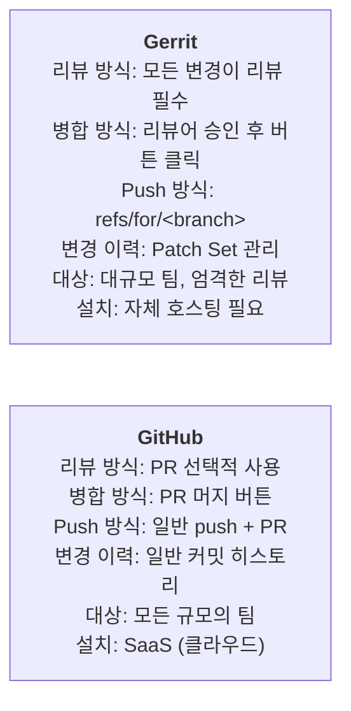
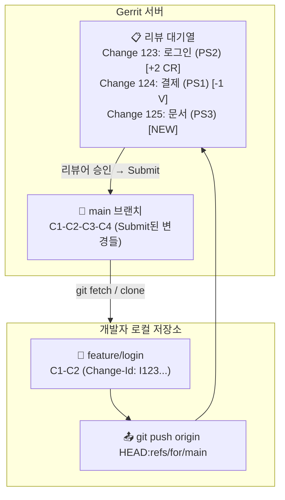
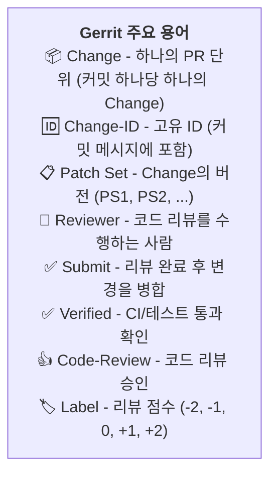
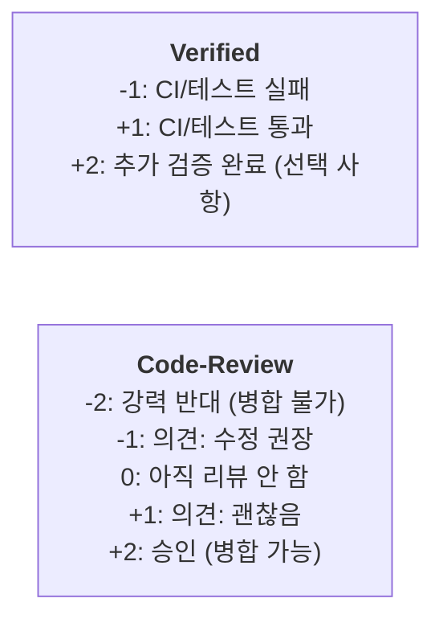

# Gerrit 소개

소프트웨어 개발에서 코드의 품질을 보장하는 것은 팀의 생산성과 유지보수성에 직결되는 중요한 과제입니다. 우리는 이 장에서 Git 기반의 대표적인 코드 리뷰 시스템인 **Gerrit**에 대해 알아보겠습니다. Gerrit는 모든 변경이 리뷰를 거쳐야만 저장소에 반영되는 엄격한 워크플로우를 제공하며, 안드로이드(Android)나 크롬(Chrome)과 같은 대규모 프로젝트에서 널리 사용되고 있습니다. 이 장을 통해 Gerrit의 핵심 개념과 워크플로우를 이해하고, 실제 협업 환경에서 효과적으로 활용하는 방법을 익힐 수 있습니다.


## 학습 목표

- Gerrit와 GitHub의 차이점을 이해하고 설명할 수 있다
- Gerrit의 전체 워크플로우와 주요 용어를 설명할 수 있다
- Gerrit을 사용하여 코드 리뷰를 요청하고 피드백을 반영할 수 있다
- Gerrit의 라벨 시스템과 Patch Set 관리 방식을 이해한다

## Gerrit vs GitHub

Gerrit는 GitHub와 유사하게 코드 리뷰 기능을 제공하지만, 몇 가지 중요한 차이점이 있습니다. 아래 다이어그램에서 두 시스템의 특징을 비교해보겠습니다.



## Gerrit 워크플로우 개념

이제 Gerrit의 전체 아키텍처와 데이터 흐름을 살펴보겠습니다. 아래 다이어그램은 개발자 로컬 저장소와 Gerrit 서버 간의 관계를 보여줍니다.

**Gerrit 전체 아키텍처와 데이터 흐름:**



## Gerrit 주요 용어

Gerrit를 처음 접하면 생소한 용어들이 많습니다. 아래 다이어그램에서 Gerrit의 주요 용어를 한눈에 정리하였습니다.



## Gerrit 기본 사용 흐름

지금까지 Gerrit의 개념과 용어에 대해 배웠습니다. 이제 실제로 Gerrit를 사용하는 기본 흐름을 단계별로 알아보겠습니다.

### 1. Clone 및 설정

가장 먼저 원격 저장소를 클론하고 Commit-msg hook을 설치해야 합니다. 이 hook은 커밋 메시지에 Change-ID를 자동으로 생성해주는 중요한 도구입니다.

```bash
# 저장소 클론
$ git clone ssh://username@gerrit.example.com:29418/my-project
$ cd my-project

# Commit-msg hook 설치 (Change-ID 자동 생성)
$ scp -p -P 29418 username@gerrit.example.com:hooks/commit-msg .git/hooks/
# 또는 curl로 다운로드
$ curl -Lo .git/hooks/commit-msg \
    http://gerrit.example.com/tools/hooks/commit-msg
$ chmod +x .git/hooks/commit-msg
```

### 2. 변경 사항 Push

다음으로 기능 브랜치에서 작업한 후 커밋을 생성합니다. Commit-msg hook이 자동으로 Change-ID를 추가해줍니다.

```bash
# feature 브랜치에서 작업
$ git switch -c feature/add-login

# 코드 수정 후 커밋
$ echo "login page" > login.html
$ git add login.html

# Commit-msg hook이 Change-ID를 자동 추가
$ git commit -m "로그인 페이지 추가

로그인 폼 HTML과 기본 스타일을 추가했습니다.

Change-Id: I1234567890abcdef1234567890abcdef12345678"
```

### 3. 리뷰를 위해 Push

일반적인 push와 달리 Gerrit는 `refs/for/main`으로 push해야 합니다. 이렇게 하면 변경 사항이 main 브랜치에 직접 반영되지 않고 리뷰 대기열에 등록됩니다.

```bash
# 일반 push가 아니라 refs/for/main 으로 push
$ git push origin HEAD:refs/for/main

# 출력:
# remote: Uploading patch set 1 for change 123
# remote: https://gerrit.example.com/c/my-project/+/123
```

### 4. 리뷰 및 피드백 반영

리뷰어가 코멘트를 남기면 수정 후 `--amend` 옵션으로 커밋을 수정하고 다시 push합니다. 같은 Change-ID를 유지하면 동일한 Change에 새로운 Patch Set이 생성됩니다.

```bash
# 리뷰어가 코멘트를 남김 ("login.html에 스타일이 없습니다")

# 수정 후 같은 Change에 새로운 Patch Set으로 push
$ echo "<style>body { font-family: sans-serif; }</style>" >> login.html
$ git add login.html

# 커밋 메시지 수정 (--amend로 같은 Change-ID 유지)
$ git commit --amend --no-edit

# 같은 refs/for/main으로 push → Patch Set 2 자동 생성
$ git push origin HEAD:refs/for/main

# 출력:
# remote: Uploading patch set 2 for change 123
# remote: https://gerrit.example.com/c/my-project/+/123
```

### 5. 리뷰 승인 및 Submit

리뷰어가 승인하고 Verified 상태가 통과되면 Submit 버튼이 활성화됩니다. Submit을 클릭하면 변경 사항이 main 브랜치에 병합됩니다.

```
Gerrit 웹 UI:
  Change 123: 로그인 페이지 추가
  ┌─────────────────────────────────────┐
  │ Patch Set 2                         │
  │                                     │
  │ -1 Verified   (CI 실패)             │
  │ +2 Code-Review (리뷰어 승인)        │
  │                                     │
  │ [Submit] 버튼 활성화!              │
  └─────────────────────────────────────┘

Submit 버튼 클릭 → main 브랜치에 병합!
```

## Gerrit 코드 리뷰 라벨

Gerrit의 라벨 시스템은 엄격한 리뷰 프로세스를 가능하게 합니다. 각 라벨의 의미를 정확히 이해하는 것이 중요합니다.



## Gerrit 명령어 모음

지금까지 기본 흐름을 살펴보았습니다. 이제 자주 사용하는 Gerrit 명령어들을 모아서 알아보겠습니다.

```bash
# 리뷰 요청을 위해 push
$ git push origin HEAD:refs/for/main

# WIP (Work In Progress)로 push
$ git push origin HEAD:refs/for/main%wip

# 특정 리뷰어 지정
$ git push origin HEAD:refs/for/main%r=reviewer@example.com

# CC 추가
$ git push origin HEAD:refs/for/main%cc=dev@example.com

# 리뷰어 + 주제(topic) 지정
$ git push origin HEAD:refs/for/main%r=alice@example.com,topic=login

# 특정 Change의 Patch Set 다운로드
$ git fetch ssh://user@host:29418/project refs/changes/23/123/2
$ git checkout FETCH_HEAD
```

## Gerrit 웹 UI 둘러보기

Gerrit의 웹 인터페이스는 대시보드 형태로 구성되어 있습니다. 내가 리뷰해야 할 변경과 내가 요청한 변경을 한눈에 확인할 수 있습니다.

```
Gerrit 대시보드:
┌─────────────────────────────────────────────────┐
│  내 대기 중인 리뷰 (My Reviews)                 │
├─────────────────────────────────────────────────┤
│  ◆ Change 123: 로그인 페이지 추가          PS2  │
│  ◆ Change 124: 결제 API 연동               PS1  │
│  ◆ Change 125: 문서 업데이트               PS3  │
├─────────────────────────────────────────────────┤
│  내가 리뷰해야 할 변경 (Incoming Reviews)        │
├─────────────────────────────────────────────────┤
│  ◇ Change 126: 설정 파일 수정             PS1  │
│  ◇ Change 127: 버그 수정                   PS2  │
└─────────────────────────────────────────────────┘
```

## Gerrit의 Patch Set 관리

Patch Set은 Gerrit의 핵심 기능입니다. 각 버전의 변경 사항을 추적할 수 있습니다. 리뷰어는 이전 Patch Set과의 차이(diff)를 확인하며 피드백을 줄 수 있습니다.

```
Patch Set 1: "로그인 페이지 추가" (첫 번째 시도)
  ─ login.html (30줄)

Patch Set 2: "로그인 페이지 추가" (스타일 추가)
  ─ login.html (35줄) ← 5줄 추가

Patch Set 3: "로그인 페이지 추가" (리뷰 반영)
  ─ login.html (38줄) ← 3줄 더 추가
  ─ style.css (20줄)  ← 새 파일

# Gerrit UI에서 PS1 → PS2 → PS3 간의 차이(diff)를 볼 수 있음
```

## Gerrit과 GitHub 비교 예시

실제 명령어를 통해 Gerrit 방식과 GitHub PR 방식을 비교해보겠습니다. 이 차이를 이해하면 각 환경에 맞는 워크플로우를 선택할 수 있습니다.

### GitHub PR 방식:
```bash
$ git switch -c feature/login
$ echo "login" > login.html
$ git add . && git commit -m "로그인 추가"
$ git push origin feature/login
# → GitHub에서 "Compare & pull request" 클릭
# → PR 생성 → 리뷰 → Merge 버튼
```

### Gerrit 방식:
```bash
$ git switch -c feature/login
$ echo "login" > login.html
$ git add . && git commit -m "로그인 추가

Change-Id: I123..."
$ git push origin HEAD:refs/for/main
# → Gerrit이 Change 자동 생성
# → 웹 UI에서 리뷰 → Submit 버튼
# → main에 병합
```

## Gerrit 사용 팁

끝으로 Gerrit를 효과적으로 사용하기 위한 몇 가지 필수 팁을 정리하였습니다.

1. **Commit-msg hook 필수 설치** — Change-ID가 없으면 push가 거부됨
2. **`--amend`로 커밋 수정** — 같은 Change-ID 유지, 새로운 Patch Set 생성
3. **리뷰어는 미리 지정** — `%r=email` 옵션으로 push 시 리뷰어 자동 지정
4. **CI 결과 확인** — +1 Verified 필수, 실패 시 Submit 불가
5. **여러 커밋을 하나의 Change로** — squash 후 push

## 한눈에 정리

| 개념 | 설명 |
|------|------|
| Gerrit | Git 기반 코드 리뷰 시스템, 모든 변경이 리뷰 필수 |
| Change | 하나의 PR 단위 (커밋 하나당 하나의 Change) |
| Change-ID | Change를 식별하는 고유 값, 커밋 메시지에 포함 |
| Patch Set | Change의 버전 (PS1, PS2, ...) |
| refs/for/main | 리뷰를 위한 특수 push 대상 |
| Submit | 리뷰 완료 후 변경을 병합하는 동작 |
| Verified | CI/테스트 통과 여부 (-1/+1) |
| Code-Review | 코드 리뷰 승인 점수 (-2 ~ +2) |

## 연습 문제

1. Gerrit에서 GitHub와 달리 일반 `git push origin main` 대신 `git push origin HEAD:refs/for/main`을 사용하는 이유는 무엇인지 설명하시오.

2. Commit-msg hook이 설치되지 않은 상태에서 push를 시도하면 어떤 문제가 발생하는지 설명하고, 이를 해결하는 방법을 서술하시오.

3. 리뷰어가 "이 부분은 수정이 필요합니다"라는 코멘트를 남겼습니다. 개발자는 어떤 순서로 대응해야 하는지 git 명령어를 포함하여 설명하시오.
