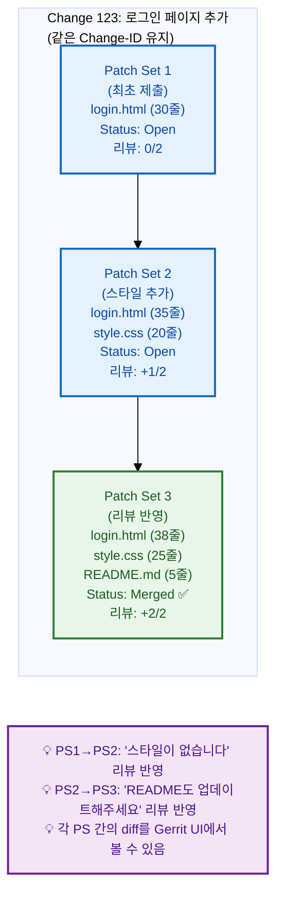
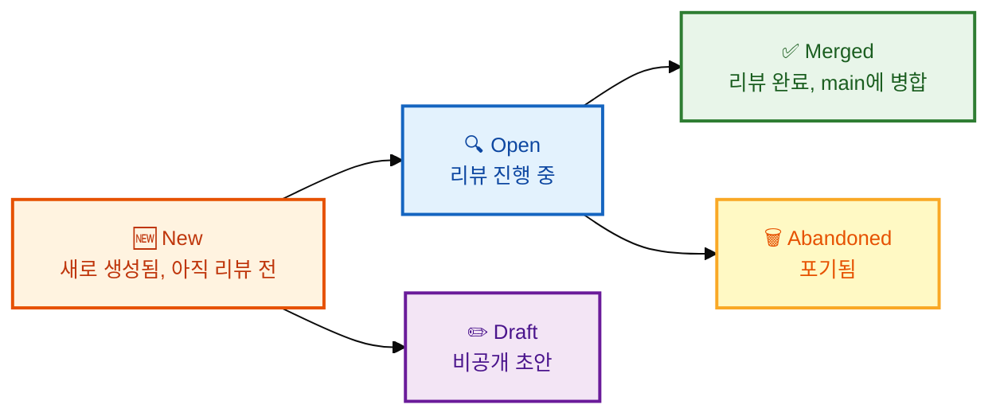

# Change와 Patch Set 이해하기

Gerrit에서 가장 중요한 개념 중 하나는 Change와 Patch Set입니다. 이 두 개념을 올바르게 이해해야 Gerrit 워크플로우를 효과적으로 활용할 수 있습니다. 우리는 이 장에서 Change와 Patch Set의 관계와 생명주기, 그리고 여러 커밋을 다루는 방법까지 상세히 알아보겠습니다. 이 개념을 숙지하면 리뷰 과정에서 발생하는 다양한 상황에 유연하게 대처할 수 있습니다.


## 학습 목표

- Change와 Patch Set의 관계를 이해하고 설명할 수 있다
- Change-ID의 역할과 중요성을 설명할 수 있다
- Patch Set의 생명주기와 관리 방법을 익힌다
- 여러 커밋을 Gerrit에서 다루는 방법을 이해한다

**Change와 Patch Set의 관계:**



## Change (변경)

Change는 하나의 논리적인 작업 단위입니다. GitHub의 Pull Request와 유사하지만, Gerrit에서는 하나의 **커밋**이 하나의 Change가 된다는 차이점이 있습니다.

### Change의 구성 요소

Change는 다양한 메타데이터로 구성됩니다. 아래 예시를 통해 각 구성 요소를 살펴보겠습니다.

```
Change 12345
├── Subject: "로그인 페이지 추가"
├── Owner: 홍길동 <hong@example.com>
├── Project: my-project
├── Branch: main
├── Status: Open / Merged / Abandoned
├── Created: 2026-07-10 14:30
├── Patch Sets:
│   ├── Patch Set 1 (최초 업로드)
│   ├── Patch Set 2 (스타일 추가)
│   └── Patch Set 3 (리뷰 반영) ← 현재
├── Reviewers:
│   ├── alice@example.com (+2 Code-Review)
│   └── bob@example.com (+1 Verified)
└── Comments: 12
```

### Change-ID

Change-ID는 Change를 식별하는 고유 값입니다. 커밋 메시지에 포함되며, `git commit --amend`로 수정해도 같은 Change-ID를 유지하면 동일한 Change의 새 Patch Set이 됩니다. Change-ID가 없다면 Gerrit는 매번 새로운 Change로 인식합니다.

```bash
# Change-ID의 형식
Change-Id: I47c7d8e9f0a1b2c3d4e5f6a7b8c9d0e1f2a3b4c5

# commit-msg hook이 자동 생성
$ git commit -m "내용"
# → 자동으로 Change-Id 추가됨
```

### Change 상태

Change는 생성부터 병합 또는 포기까지 여러 상태를 거치게 됩니다. 아래 다이어그램에서 상태 전이를 확인해보겠습니다.



## Patch Set (패치 세트)

지금까지 Change의 개념과 구성 요소에 대해 배웠습니다. 이제 Change의 버전을 나타내는 Patch Set에 대해 알아보겠습니다.

Patch Set은 Change의 버전입니다. 첫 push는 PS1, 수정 후 다시 push하면 PS2가 됩니다.

### Patch Set 생명주기

```bash
# PS1: 첫 번째 시도 (스타일 없음)
login.html (30줄)
$ git push origin HEAD:refs/for/main
→ Change 123, Patch Set 1 생성

# PS2: 스타일 추가 (리뷰어 피드백 반영)
login.html (35줄) + style.css (20줄)
$ git add .
$ git commit --amend --no-edit
$ git push origin HEAD:refs/for/main
→ Change 123, Patch Set 2 자동 생성

# PS3: 추가 수정 (두 번째 리뷰 반영)
login.html (38줄) + style.css (25줄) + README.md (5줄)
$ git add .
$ git commit --amend -m "로그인 페이지 추가

스타일 및 문서 업데이트 포함

Change-Id: I47c7d8e9..."
$ git push origin HEAD:refs/for/main
→ Change 123, Patch Set 3 자동 생성
```

### Patch Set 간 차이 보기

Gerrit 웹 UI에서 각 Patch Set 간의 차이를 확인할 수 있습니다. 이를 통해 리뷰어는 변경된 부분만 집중적으로 검토할 수 있습니다.

```
Gerrit UI:
  Change 123: 로그인 페이지 추가

  ▼ Patch Sets (3)
    ◉ Patch Set 1 (기본)
    ○ Patch Set 2 (+스타일)
    ○ Patch Set 3 (+문서)

  Diff against: [Patch Set 1 ▼]
  ┌─────────────────────────────────┐
  │ @@ -1,5 +1,8 @@                 │
  │  <h1>Login</h1>                 │
  │ +<link rel="stylesheet" ...>    │ ← PS2에서 추가
  │ +<style>...</style>             │
  │  <form>...</form>               │
  │ +<p>문서 링크: ...</p>          │ ← PS3에서 추가
  └─────────────────────────────────┘
```

## 여러 커밋 다루기

지금까지 단일 Change의 Patch Set 관리에 대해 배웠습니다. 다음으로 여러 커밋을 Gerrit에서 어떻게 다루는지 알아보겠습니다.

Gerrit은 기본적으로 **커밋 하나 = Change 하나**입니다. 여러 커밋을 푸시하면 각각 별도의 Change가 생성됩니다.

```bash
# 여러 커밋 푸시
$ git log --oneline -3
a1b2c3d 문서 업데이트
d4e5f6f 로그인 페이지 추가
g7h8i9j 설정 파일 수정

$ git push origin HEAD:refs/for/main
→ Change 124: 문서 업데이트 (a1b2c3d)
→ Change 125: 로그인 페이지 추가 (d4e5f6f)
→ Change 126: 설정 파일 수정 (g7h8i9j)
# 각각 독립적인 Change로 생성됨!
```

### 의존 관계 (Dependency)

순서대로 적용되어야 하는 변경은 의존 관계가 생깁니다. 의존 관계가 있는 Change는 선행 Change가 먼저 승인되어야 합니다.

```
Change 124: 문서 업데이트 (의존성 없음)
Change 125: 로그인 페이지 추가 (Change 124에 의존)
Change 126: 설정 파일 수정 (Change 125에 의존)
```

Gerrit UI에서:
```
Change 125
  Depends On: Change 124 (문서 업데이트)
  Needed By: Change 126 (설정 파일 수정)

→ Change 124가 먼저 승인되어야 Change 125 승인 가능
```

## Patch Set 관리 팁

효과적인 Patch Set 관리를 위한 몇 가지 실용적인 팁을 소개합니다.

### 1. 작은 단위로 유지

```bash
# ❌ 변경 하나에 모든 것을 넣기
$ git commit -m "로그인, 결제, 프로필 기능 구현"

# ✅ 각각 별도 Change로 분리
$ git commit -m "로그인 페이지 추가"
$ git commit -m "결제 모듈 구현"
$ git commit -m "프로필 페이지 추가"
```

### 2. 불필요한 Patch Set 방지

```bash
# 로컬에서 충분히 테스트한 후 push
$ git add .
$ git commit -m "완성된 기능"

# push 전에 최종 확인
$ git diff --cached
$ npm test

# 문제 없으면 push
$ git push origin HEAD:refs/for/main
```

### 3. Patch Set 히스토리 관리

```bash
# 이전 Patch Set의 코멘트를 확인
# PS1의 코멘트: "이 변수명이 이해하기 어렵습니다"
# PS2에서 반영했는지 확인

# 원한다면 PS1과 PS3의 차이만 볼 수도 있음
# Gerrit UI: "Diff against Patch Set 1" 선택
```

### 4. WIP (Work In Progress) 활용

```bash
# 아직 작업 중인 변경은 WIP으로 표시
$ git push origin HEAD:refs/for/main%wip

# Gerrit에서 "WIP" 표시, 리뷰어에게 알림 안 감
# 작업 완료 후 WIP 해제
# Gerrit UI → "Start Review" 버튼

# 또는 CLI로
$ git push origin HEAD:refs/for/main%ready
```

## 한눈에 정리

| 개념 | 설명 |
|------|------|
| Change | 하나의 논리적 작업 단위, GitHub의 PR과 유사 |
| Patch Set | Change의 버전 (PS1, PS2, ...) |
| Change-ID | Change를 식별하는 고유 40자리 hash |
| Change 상태 | New → Open → Merged / Abandoned |
| 의존 관계 | 선행 Change가 승인되어야 후속 Change 승인 가능 |
| WIP | 작업 중인 변경, 리뷰어에게 알림 미전송 |
| 커밋 = Change | Gerrit에서 각 커밋은 독립적인 Change로 생성됨 |

## 연습 문제

1. Gerrit에서 Change와 Patch Set의 차이점을 설명하고, Change-ID가 동일할 때와 다를 때 각각 어떤 동작이 발생하는지 서술하시오.

2. 세 개의 커밋(a, b, c)을 순서대로 push했습니다. 세 커밋이 서로 의존 관계에 있을 때 Gerrit에서 어떤 순서로 승인되어야 하는지 설명하시오.

3. 리뷰어가 "PS1의 스타일이 마음에 들지 않습니다. 수정해주세요."라고 코멘트를 남겼습니다. 개발자가 취해야 할 git 명령어 단계를 순서대로 작성하시오.
