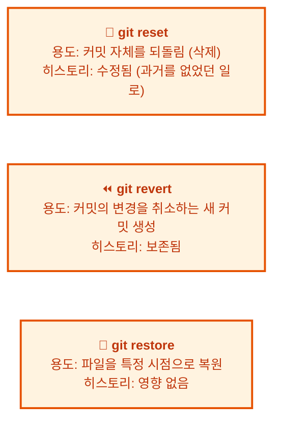
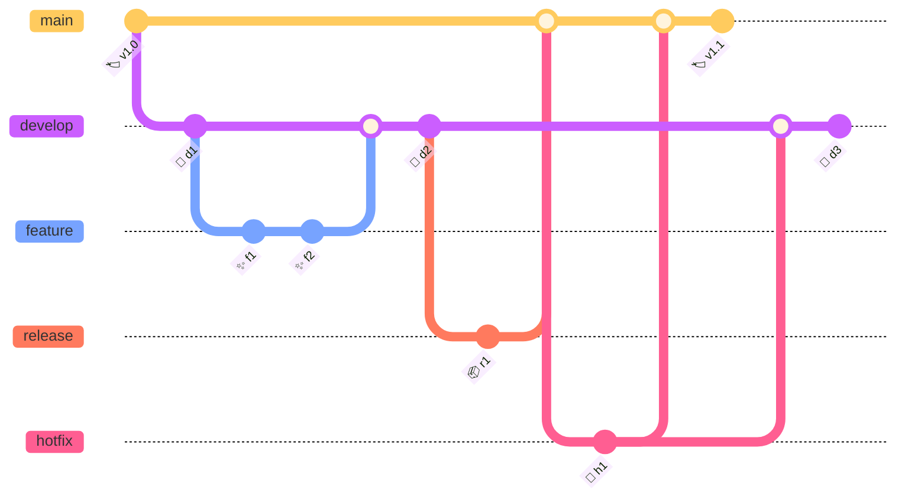

# Git 자주 묻는 질문 (FAQ)

Git을 사용하다 보면 예상치 못한 오류나 궁금증에 부딪히는 경우가 많습니다. 이 장은 Git을 실무에서 사용하면서 자주 마주치는 질문들과 그 해결 방법을 주제별로 정리한 참고 자료입니다. 각 질문은 실제 개발 현장에서 발생하는 상황을 바탕으로 구성되었으므로, 필요할 때마다 원하는 항목을 찾아 빠르게 해결 방법을 확인할 수 있습니다.

## 학습 목표

- Git 사용 중 자주 발생하는 오류의 원인과 해결 방법을 이해한다
- 커밋, 브랜치, 병합 등 주요 작업별 문제 해결 능력을 기른다
- 원격 저장소 관련 문제와 협업 시 발생하는 상황에 대처할 수 있다
- 고급 Git 명령어(reflog, bisect, cherry-pick 등)의 활용법을 익힌다

---

## 👨‍💻 실전 프로젝트: 실전에서 만나는 Git 문제 해결하기

이론적으로 Git을 이해하는 것과 실제 문제를 마주했을 때 침착하게 대처하는 것은 별개의 영역입니다. 아래 시나리오는 현업 개발자들이 빈번하게 겪는 대표적인 상황들을 엄선하여 구성하였습니다. 각 문제를 따라 해 보면서 Git의 내부 동작 원리와 실전 대처법을 함께 익혀 보시기 바랍니다.

### 시나리오 1: main 브랜치에 실수로 커밋했어요

**문제 상황:** 긴급 버그 수정 작업을 수행하던 중, 실수로 `feature/login` 브랜치가 아닌 `main` 브랜치에서 직접 커밋을 생성하고 말았습니다.

```bash
$ git branch
* main          # ← 여기서 작업하면 안 되는데!
  feature/login

$ git add fix.js && git commit -m "로그인 버그 수정"
[main a1b2c3d] 로그인 버그 수정
```

**해결 과정:**

1) `main`에서 방금 만든 커밋을 변경 사항만 유지한 채로 취소합니다. `--soft` 옵션을 사용하면 작업 디렉토리의 변경 내용은 그대로 보존됩니다.

```bash
$ git reset --soft HEAD~1
# main의 커밋은 사라졌지만 fix.js의 변경 사항은 staged 상태로 남아 있음
```

2) 올바른 브랜치로 이동한 후 변경 사항을 커밋합니다.

```bash
$ git switch feature/login
$ git commit -m "로그인 버그 수정"
[feature/login b2c3d4e] 로그인 버그 수정
```

**결과:** `main` 브랜치는 실수 이전의 깨끗한 상태를 유지하며, 변경 사항은 의도한 `feature/login` 브랜치에 정상적으로 커밋되었습니다.

**Best Practice:** 커밋을 생성하기 전에 `git status`와 `git branch`로 현재 작업 중인 브랜치를 반드시 확인하는 습관을 들이십시오. 또한 `git switch` 대신 `git checkout`을 사용할 때는 브랜치명을 정확히 입력해야 합니다.

### 시나리오 2: 병합 충돌(merge conflict)이 발생했어요

**문제 상황:** 팀원 A와 B가 동시에 `index.html`의 같은 줄을 각자의 브랜치에서 수정하였습니다. 팀원 A가 먼저 `main`에 병합한 뒤, 팀원 B가 `git pull`을 실행하자 충돌이 발생했습니다.

```bash
$ git pull origin main
Auto-merging index.html
CONFLICT (content): Merge conflict in index.html
Automatic merge failed; fix conflicts and then commit the result.
```

**해결 과정:**

1) 충돌이 발생한 파일을 확인합니다.

```bash
$ git status
On branch feature/team-B
You have unmerged paths.
  both modified:   index.html
```

2) 충돌 파일을 열어 Git이 표시한 마커를 확인합니다.

```html
<<<<<<< HEAD
<h1>팀 A의 제목</h1>
=======
<h1>팀 B의 제목</h1>
>>>>>>> main
```

3) 팀원과 논의하여 최종 코드를 결정한 후, 마커(`<<<<<<<`, `=======`, `>>>>>>>`)를 제거하고 원하는 코드만 남깁니다.

```html
<h1>팀 A와 B가 합의한 최종 제목</h1>
```

4) 충돌을 해결한 파일을 스테이징하고 커밋합니다.

```bash
$ git add index.html
$ git commit -m "index.html 충돌 해결"
```

**결과:** 충돌이 해결되었으며, 병합 커밋이 정상적으로 생성되었습니다.

**Best Practice:** 충돌을 최소화하려면 작업을 시작하기 전에 항상 `git pull --rebase`로 최신 상태를 유지하고, 하나의 브랜치에서 장기간 작업하지 않도록 합니다. `git merge --abort`를 사용하면 충돌 상황에서 안전하게 병합 전 상태로 되돌아갈 수 있습니다.

### 시나리오 3: 실수로 push한 커밋을 되돌려야 해요

**문제 상황:** 배포 직전에 `git push`를 실행했는데, 알고 보니 민감한 설정 파일(`config.yml`)에 잘못된 비밀번호가 포함된 채로 원격 저장소에 푸시되었습니다. 이미 동료들이 해당 커밋을 pull 받은 상태라 `reset --hard`는 사용할 수 없습니다.

```bash
$ git push origin main
Enumerating objects: 5, done.
... (푸시 성공)
```

**해결 과정:**

1) `git revert`를 사용하여 잘못된 커밋의 변경 내용을 취소하는 새로운 커밋을 생성합니다. 이 방식은 기존 히스토리를 수정하지 않으므로 팀원들에게 안전합니다.

```bash
$ git revert HEAD --no-edit
[main c3d4e5f] Revert "config.yml 업데이트"
 1 file changed, 1 insertion(+), 1 deletion(-)
```

2) 되돌리기 커밋을 원격 저장소에 푸시합니다.

```bash
$ git push origin main
```

**결과:** 잘못된 커밋은 히스토리에 남아 있지만, 그 내용을 취소하는 새 커밋이 추가되어 코드는 올바른 상태가 되었습니다.

**Best Practice:** 이미 푸시된 커밋은 팀의 공유 자산입니다. `git revert`는 히스토리를 보존하므로 협업 환경에서 가장 안전한 되돌리기 방법입니다. `git reset --hard` 후 `git push --force`를 사용하면 동료들의 로컬 히스토리가 꼬일 수 있으므로 반드시 지양해야 합니다.

### 시나리오 4: 커밋을 잘못된 순서로 남겨 히스토리가 지저분해요

**문제 상황:** "WIP"(Work In Progress) 커밋, "버그 수정" 커밋, "리팩토링" 커밋 등 의미가 분산된 5개의 커밋을 쪼개서 푸시하려고 합니다. PR 리뷰를 요청하기 전에 커밋을 논리적으로 정리하고 싶습니다.

```bash
$ git log --oneline
a1b2c3d WIP
b2c3d4e 버그 수정
c3d4e5f 주석 추가
d4e5f6g 리팩토링
e5f6g7h 스타일 수정
```

**해결 과정:**

1) 최근 5개의 커밋을 대화형 rebase로 정리합니다.

```bash
$ git rebase -i HEAD~5
```

2) 편집기가 열리면 커밋을 재정렬하고 squash할 항목을 지정합니다.

```
pick e5f6g7h 스타일 수정
pick d4e5f6g 리팩토링
squash c3d4e5f 주석 추가       # ← 리팩토링 커밋에 합침
pick b2c3d4e 버그 수정
squash a1b2c3d WIP             # ← 버그 수정 커밋에 합침
```

3) 저장 후 편집기를 닫으면 squash할 커밋들의 메시지를 통합하는 화면이 나타납니다. 최종 커밋 메시지를 작성합니다.

```
# 최종 커밋 1: UI 스타일 및 리팩토링
# 최종 커밋 2: 로그인 버그 수정
```

**결과:** 5개의 지저분한 커밋이 2개의 의미 있는 커밋으로 정리되었습니다.

**Best Practice:** 커밋은 "기능 단위"로 나누는 것이 좋습니다. rebase로 히스토리를 정리한 후에는 `git push --force-with-lease`를 사용하여 푸시해야 합니다. `--force`보다 `--force-with-lease`가 안전한 이유는, 다른 사람이 해당 브랜치에 새 커밋을 추가한 경우 푸시를 중단해 주기 때문입니다.

---

## 목차

1. [개념/일반](#1-개념일반)
2. [설치/설정](#2-설치설정)
3. [커밋/히스토리](#3-커밋히스토리)
4. [브랜치/병합](#4-브랜치병합)
5. [원격 저장소](#5-원격-저장소)
6. [되돌리기/복구](#6-되돌리기복구)
7. [파일/스테이징](#7-파일스테이징)
8. [협업/워크플로우](#8-협업워크플로우)
9. [고급/문제 해결](#9-고급문제-해결)

---

Git을 처음 접할 때 가장 혼란스러운 부분은 용어와 개념의 차이를 이해하는 것입니다. 아래 개념/일반 항목에서는 Git을 사용하면서 반드시 알아야 할 핵심 개념들을 질문 형태로 풀어냅니다.

## 1. 개념/일반

### Q: Git과 GitHub의 차이는 무엇인가요?

**Git**은 로컬에서 동작하는 분산 버전 관리 시스템(DVCS)으로, 파일의 변경 이력을 추적하고 여러 개발자 간의 작업을 조율하는 도구입니다. 반면 **GitHub**는 Git 저장소를 호스팅하는 웹 기반 플랫폼으로, 저장소 관리뿐 아니라 이슈 트래킹, 코드 리뷰, CI/CD 등 협업에 필요한 부가 기능을 함께 제공합니다. 비유하자면 Git은 사진을 찍는 카메라이고, GitHub는 그 사진을 공유하고 관리하는 인스타그램과 같습니다.

- Git = 카메라 (사진을 찍는 도구)
- GitHub = 인스타그램 (사진을 공유하는 플랫폼)

Git 없이 GitHub를 사용할 수 없고, GitHub 없이도 Git을 로컬에서 충분히 사용할 수 있습니다. Git 자체는 CLI(Command Line Interface) 도구이므로 GitHub 계정이 없어도 로컬 저장소에서 모든 버전 관리 기능을 사용할 수 있습니다.

**Best Practice:** Git의 기본 개념과 명령어를 로컬에서 먼저 충분히 연습한 후, GitHub를 통한 협업 워크플로우를 익히는 것이 효과적인 학습 순서입니다.

### Q: `merge`와 `rebase`의 차이는 무엇인가요?

두 명령어 모두 브랜치를 통합하는 데 사용되지만, 통합 방식과 결과 히스토리 구조에서 근본적인 차이가 있습니다. `merge`는 두 브랜치의 변경 사항을 합치면서 병합 커밋(merge commit)이라는 별도의 커밋을 생성합니다. 이로 인해 브랜치의 분기와 병합 구조가 그래프에 그대로 남아 실제 협업 히스토리를 추적하기 쉽습니다. `rebase`는 현재 브랜치의 커밋들을 대상 브랜치 위로 재배치하여 히스토리를 선형으로 만듭니다. 결과적으로 커밋 그래프가 깔끔해지지만, 기존 커밋의 해시가 변경되므로 이미 공유된 브랜치에서는 주의해야 합니다.

```bash
$ git merge feature/login
# 병합 커밋이 생성됨

$ git switch feature/login
$ git rebase main
# feature/login의 커밋이 main 위로 재정렬됨
```

```
Merge 결과:       Rebase 결과:
  A---B---C          A---B---C
 /         \        /
D---E---F---G    D---E---F---G (main, feature/login)
```

**Best Practice:** PR 리뷰 전에는 `rebase`로 커밋 히스토리를 깔끔하게 정리하고, 여러 사람이 함께 사용하는 공유 브랜치(예: `main`, `develop`)에서는 `merge`를 사용하는 것이 일반적인 규칙입니다. `git merge --no-ff`를 사용하면 fast-forward가 가능한 상황에서도 병합 커밋을 강제로 생성할 수 있어, 기능 단위의 병합을 명확하게 기록할 수 있습니다.

### Q: `git pull`과 `git fetch`의 차이는 무엇인가요?

```bash
git pull origin main    # = git fetch + git merge (자동 병합)
git fetch origin        # = 변경 사항만 가져오기 (수동 병합)
```

`git pull`은 원격 저장소의 변경 사항을 가져온 후(fetch) 현재 브랜치에 자동으로 병합(merge)까지 수행하는 단축 명령어입니다. 한 번의 명령으로 모든 작업이 완료되므로 편리하지만, 예상치 못한 충돌이 발생할 수 있고 자동 생성되는 "Merge branch 'main' of ..." 커밋이 히스토리를 지저분하게 만들기도 합니다. `git fetch`는 원격의 변경 사항을 로컬에 내려받기만 할 뿐 자동 병합은 수행하지 않습니다. 따라서 `git log origin/main`으로 변경 내용을 먼저 확인한 후, `git merge origin/main`을 직접 실행하여 병합할지 결정할 수 있어 더 안전하고 통제된 워크플로우를 제공합니다.

**Best Practice:** CI/CD나 자동화 스크립트에서는 `git fetch`를 사용하고, 수동 작업 시에도 `git pull`보다 `git fetch && git log --oneline..origin/main`으로 변경 사항을 먼저 확인한 후 병합하는 습관을 권장합니다.

### Q: HEAD는 무엇인가요?

HEAD는 현재 작업 중인 위치를 가리키는 특수한 포인터로, Git이 지금 어떤 커밋이나 브랜치를 기준으로 작업하고 있는지를 나타냅니다. 보통은 현재 체크아웃된 브랜치의 최신 커밋을 가리킵니다. 예를 들어 `main` 브랜치에 있을 때 HEAD는 `refs/heads/main`을 가리키고, 새로운 커밋이 생성될 때마다 HEAD가 따라 이동합니다.

```bash
$ cat .git/HEAD
ref: refs/heads/main    # 현재 main 브랜치에 있음
```

**Best Practice:** `git log --oneline`의 출력에서 `HEAD` 표시를 통해 현재 위치를 항상 확인하는 습관을 들이면, 잘못된 브랜치에서 작업하는 실수를 방지할 수 있습니다.

### Q: Detached HEAD 상태는 무엇인가요?

HEAD가 브랜치가 아닌 특정 커밋 해시를 직접 가리키는 상태를 Detached HEAD라고 부릅니다. 이 상태는 주로 `git checkout a1b2c3d`처럼 특정 커밋을 직접 체크아웃할 때 발생합니다.

```bash
$ git checkout a1b2c3d
You are in 'detached HEAD' state...
```

이 상태에서 새로운 커밋을 만들면, 해당 커밋은 어떤 브랜치에도 속하지 않은 채로 존재하게 됩니다. 이후 다른 브랜치로 전환하면 이 커밋에 접근할 수 있는 참조가 사라져 마치 커밋이 소멸한 것처럼 보입니다. 실제로는 `git reflog`를 통해 복구할 수 있지만, 작업 내용을 안전하게 보존하려면 새 브랜치를 생성하는 것이 올바른 방법입니다.

```bash
$ git switch -c new-branch
```

**Best Practice:** 특정 커밋의 코드를 실험적으로 확인할 때 Detached HEAD 상태가 유용합니다. 하지만 그 상태에서 코드를 수정했다면 반드시 브랜치를 생성하여 변경 사항을 보존하십시오.

### Q: `reset`, `revert`, `restore`의 차이는 무엇인가요?



세 명령어는 모두 "되돌린다"는 공통점이 있지만, 적용 대상과 결과가 완전히 다릅니다. `git reset`은 브랜치의 포인터를 과거 커밋으로 이동시켜 커밋 자체를 없었던 것으로 만듭니다. `--soft`, `--mixed`(기본), `--hard` 옵션에 따라 작업 디렉토리와 스테이징 영역에 미치는 영향이 달라집니다. `git revert`는 기존 커밋을 제거하지 않고, 해당 커밋의 변경을 취소하는 **새로운 커밋**을 생성합니다. 히스토리가 보존되므로 이미 푸시된 커밋을 안전하게 취소할 때 사용합니다. `git restore`는 파일 단위로 동작하며, 작업 디렉토리나 스테이징 영역의 파일을 특정 커밋 시점의 내용으로 복원합니다. 히스토리 자체에는 전혀 영향을 주지 않습니다.

**Best Practice:** 되돌리기가 필요할 때는 먼저 "이 커밋을 이미 푸시했는가?"를 자문하십시오. 푸시하지 않았다면 `reset`을, 푸시했다면 `revert`를 사용하는 것이 안전한 선택입니다.

### Q: `git stash`는 언제 사용하나요?

브랜치를 전환해야 하는데 현재 작업 중인 변경 사항을 커밋하기에는 너무 이르거나 불완전할 때, 변경 사항을 임시로 보관하는 용도로 사용합니다. `git stash`는 작업 디렉토리의 수정된 tracked 파일들을 스택(stack)에 저장하고, 작업 디렉토리를 마지막 커밋 상태로 깨끗하게 되돌립니다.

```bash
$ git stash                    # 현재 변경 사항 저장
$ git switch other-branch      # 다른 브랜치로 이동
$ git stash pop                # 돌아와서 변경 사항 복원
```

`git stash list`로 저장된 stash 목록을 확인할 수 있고, `git stash apply stash@{2}`처럼 특정 stash를 선택적으로 적용할 수도 있습니다. `git stash push -m "메시지"`로 설명을 추가하면 여러 stash를 구분하기 쉽습니다.

**Best Practice:** `git stash`는 편리하지만 stash를 오래 방치하면 관리가 어려워집니다. stash는 가능한 같은 날 안에 `pop`하여 해결하고, 장기 보관이 필요하다면 임시 브랜치를 만들어 커밋하는 것이 더 체계적인 방법입니다.

### Q: working tree clean은 무슨 뜻인가요?

모든 tracked 파일이 마지막 커밋 상태와 완전히 동일하다는 의미입니다. 즉, 수정된 파일도 없고 새로 추가된 untracked 파일도 없으며, 스테이징 영역에도 변경 사항이 없는 상태입니다.

```bash
$ git status
On branch main
nothing to commit, working tree clean    # 깨끗한 상태!
```

이 메시지가 뜨면 브랜치 전환, 병합, stash 등 Git의 민감한 작업을 안전하게 수행할 수 있습니다. 반대로 "Changes not staged for commit" 메시지가 함께 출력된다면 아직 커밋되지 않은 변경 사항이 존재한다는 뜻이므로, 작업을 계속하기 전에 상황을 파악해야 합니다.

**Best Practice:** 브랜치를 전환하거나 병합을 수행하기 전에 반드시 `git status`로 working tree가 clean한지 확인하십시오. 변경 사항이 있다면 `git stash`로 임시 저장하거나 커밋한 후 작업을 진행하는 것이 안전합니다.

---

설치와 초기 설정은 Git을 사용하는 모든 환경의 기초가 됩니다. 아래 항목은 처음 Git을 설치한 후나 새로운 기기에서 개발 환경을 구성할 때 반드시 거쳐야 하는 설정들을 다룹니다.

## 2. 설치/설정

### Q: "Please tell me who you are" 오류가 나요

Git은 모든 커밋에 작성자(author) 정보를 기록합니다. 따라서 `user.name`과 `user.email`이 설정되어 있지 않은 상태에서 `git commit`을 실행하면 이 오류 메시지가 나타나며 커밋이 거부됩니다.

```bash
$ git commit -m "첫 커밋"

*** Please tell me who you are.

Run

  git config --global user.email "you@example.com"
  git config --global user.name "Your Name"

to set your account's default identity.
Omit --global to set the identity only in this repository.
```

```bash
# 해결 방법
$ git config --global user.name "홍길동"
$ git config --global user.email "hong@example.com"

# 프로젝트별로 다르게 설정하려면 --global 생략
```

`--global` 옵션을 사용하면 시스템 전체(현재 사용자)에 적용되며, `--global` 없이 설정하면 현재 저장소에만 적용됩니다. 회사 프로젝트와 개인 프로젝트에서 다른 이메일을 사용해야 한다면 저장소별로 별도 설정하는 것이 좋습니다.

**Best Practice:** Git 설치 후 가장 먼저 실행해야 할 명령어가 바로 사용자 정보 설정입니다. 새 기기에서 개발을 시작할 때 이 설정을 빼먹지 않도록, 설정 스크립트를 작성해 두거나 팀의 온보딩 문서에 포함시키는 것을 권장합니다.

### Q: Git의 출력에 색깔을 넣고 싶어요

Git의 기본 출력은 흑백이어서 `git status`나 `git diff`의 결과를 한눈에 파악하기 어렵습니다. `color.ui`를 `auto`로 설정하면 Git이 자동으로 출력에 색상을 적용하여 가독성을 크게 향상시킵니다.

```bash
$ git config --global color.ui auto
```

이 설정 후에는 `git status`에서 빨간색(수정됨), 초록색(스테이징됨) 등으로 상태를 구분할 수 있고, `git diff`에서는 추가된 줄이 초록색, 삭제된 줄이 빨간색으로 표시됩니다. `git branch`의 출력에도 현재 브랜치가 강조 표시됩니다.

**Best Practice:** 이 설정은 Git 사용 경험을 즉시 개선해 주는 가장 간단하면서도 효과적인 설정입니다. Git을 설치한 후 두 번째로 설정할 것을 권장합니다.

### Q: 커밋 메시지 편집기를 VSCode로 바꾸고 싶어요

Git은 커밋 메시지를 작성할 때 기본 시스템 편집기(보통 vim이나 nano)를 엽니다. VSCode에 익숙한 사용자라면 `core.editor` 설정을 변경하여 더 편리하게 커밋 메시지를 작성할 수 있습니다.

```bash
$ git config --global core.editor "code --wait"
```

`--wait` 플래그는 VSCode에서 파일을 닫을 때까지 Git이 대기하도록 합니다. 이 설정을 적용하면 `git commit` 실행 시 VSCode가 열리고, 편집을 마치고 탭을 닫으면 Git이 자동으로 커밋을 완료합니다.

**Best Practice:** 협업 환경에서는 팀원들이 모두 같은 편집기를 사용하지 않을 수 있으므로, `.gitconfig` 설정은 개인 환경에 한정하고 팀 전체의 설정은 `.editorconfig`나 프로젝트 문서로 관리하는 것이 바람직합니다.

### Q: Git 명령어를 줄여서 쓰고 싶어요 (alias)

자주 사용하는 Git 명령어를 짧은 별칭(alias)으로 등록하면 타이핑 시간을 절약하고 오타 가능성을 줄일 수 있습니다. `git config --global alias.<별칭> <명령어>` 형식으로 등록합니다.

```bash
$ git config --global alias.st status
$ git config --global alias.ci commit
$ git config --global alias.co checkout
$ git config --global alias.br branch
$ git config --global alias.lg "log --oneline --graph --all"
$ git config --global alias.unstage "restore --staged"

# 사용 예
$ git st       # = git status
$ git unstage index.html  # = git restore --staged index.html
```

특히 `alias.lg`는 브랜치 그래프를 시각적으로 보여 주는 강력한 alias로, 저장소의 전체 구조를 한눈에 파악할 수 있습니다. 복잡한 명령어일수록 alias로 등록해 두는 것이 생산성 향상에 큰 도움이 됩니다.

**Best Practice:** alias는 `~/.gitconfig` 파일에 직접 작성하여 관리할 수도 있습니다. 팀에서 공통으로 사용하면 좋을 alias가 있다면 팀 문서에 공유하는 것도 좋은 방법입니다.

### Q: 기본 브랜치 이름을 main으로 설정하고 싶어요

과거 Git의 기본 브랜치명은 `master`였으나, 최근에는 `main`이 표준으로 자리 잡았습니다. `git init`으로 새 저장소를 만들 때마다 자동으로 `main` 브랜치가 생성되도록 설정할 수 있습니다.

```bash
$ git config --global init.defaultBranch main
```

GitHub에서 새 저장소를 생성할 때도 기본 브랜치가 `main`이므로, 로컬과 원격의 기본 브랜치명을 일치시키는 것이 여러모로 편리합니다. 이 설정은 `git init`으로 생성하는 새로운 저장소에만 적용되며, 기존 저장소에는 영향을 주지 않습니다.

**Best Practice:** 2020년 이후 대부분의 Git 호스팅 서비스와 커뮤니티는 `main`을 기본 브랜치명으로 사용하고 있습니다. 새 프로젝트를 시작할 때는 반드시 이 설정을 적용하는 것을 권장합니다.

### Q: Windows와 macOS/Linux에서 줄바꿈 문자 차이를 어떻게 처리하나요?

Windows는 CRLF(`\r\n`), macOS와 Linux는 LF(`\n`)를 줄바꿈 문자로 사용합니다. 이 차이로 인해 운영체제가 다른 팀원 간에 파일이 변경되었다고 잘못 인식되는 문제가 발생할 수 있습니다. `core.autocrlf` 설정은 Git이 이러한 차이를 자동으로 변환하게 합니다.

```bash
# Windows
$ git config --global core.autocrlf true

# macOS / Linux
$ git config --global core.autocrlf input
```

Windows에서 `true`로 설정하면 Git이 체크아웃 시 CRLF로 변환하고, 커밋 시 LF로 변환하여 저장합니다. macOS/Linux에서 `input`으로 설정하면 체크아웃 시에는 변환하지 않고, 커밋 시에만 LF로 변환합니다. `.gitattributes` 파일을 프로젝트 루트에 두면 팀 전체에 일관된 줄바꿈 정책을 적용할 수 있습니다.

**Best Practice:** 팀 프로젝트에서는 각자의 운영체제 설정에 의존하기보다 프로젝트 루트에 `.gitattributes` 파일을 생성하여 `* text=auto`와 같은 규칙을 명시하는 것이 가장 확실한 방법입니다.

### Q: Git을 업데이트하고 싶어요

Git은 지속적으로 버그 수정과 기능 개선이 이루어지므로, 최신 버전을 유지하는 것이 좋습니다. 운영체제별 업데이트 방법은 다음과 같습니다.

```bash
# Windows
$ git update-git-for-windows

# macOS (Homebrew)
$ brew upgrade git

# Linux (Ubuntu/Debian)
$ sudo apt update && sudo apt upgrade git
```

Linux의 경우 패키지 매니저에 따라 명령어가 다를 수 있습니다. Fedora/RHEL 계열은 `sudo dnf upgrade git`, Arch Linux는 `sudo pacman -Syu git`을 사용합니다. Windows에서는 Git 공식 사이트에서 설치 프로그램을 다운로드하거나 `git update-git-for-windows` 명령어로 업데이트할 수 있습니다.

**Best Practice:** 보안 패치와 새로운 기능을 받으려면 정기적으로 Git 버전을 확인하십시오. `git --version`으로 현재 버전을 확인할 수 있으며, 보안 취약점이 보고된 경우 즉시 업데이트하는 것이 중요합니다.

---

커밋과 히스토리 관리는 Git 사용의 핵심입니다. 아래 질문들은 작성한 커밋을 수정하거나 히스토리를 분석하는 방법을 다룹니다. 이 영역을 잘 이해하면 프로젝트의 변경 이력을 효과적으로 관리할 수 있습니다.

## 3. 커밋/히스토리

### Q: 마지막 커밋 메시지를 변경하고 싶어요

커밋을 생성한 직후 메시지에 오타가 있거나 내용이 부적절하다고 판단되면, `git commit --amend`로 가장 최근 커밋의 메시지를 수정할 수 있습니다. 이 명령어는 마지막 커밋을 새 커밋으로 대체하며, 기존 커밋의 변경 사항은 그대로 유지됩니다.

```bash
$ git commit --amend -m "수정된 커밋 메시지"
```

`-m` 옵션 없이 실행하면 편집기가 열려 기존 메시지를 직접 수정할 수 있습니다. 만약 커밋에 파일을 추가로 포함시키려면 `git add`로 파일을 스테이징한 후 `git commit --amend`를 실행하면 됩니다.

**주의:** `git commit --amend`는 기존 커밋을 새로운 커밋으로 교체하므로 커밋 해시가 변경됩니다. 따라서 이미 원격 저장소에 푸시한 커밋은 `--amend`로 수정하지 않는 것이 원칙입니다. 푸시된 커밋을 수정해야 한다면, `git commit --amend` 후 `git push --force-with-lease`가 필요하지만 팀원과의 협의가 선행되어야 합니다.

### Q: 예전 커밋 메시지를 변경하고 싶어요

과거의 여러 커밋 중 특정 커밋의 메시지만 수정하려면 대화형 rebase(`git rebase -i`)를 사용합니다. 이 방법은 히스토리를 다시 쓰는 작업이므로, 아직 푸시되지 않은 로컬 커밋에만 적용하는 것이 안전합니다.

```bash
# 최근 3개의 커밋을 수정
$ git rebase -i HEAD~3

# 편집기에서 'pick'을 'reword'로 변경하고 저장
pick a1b2c3d 첫 번째 커밋
reword d4e5f6f 두 번째 커밋    # ← 이 커밋의 메시지를 수정
pick g7h8i9j 세 번째 커밋

# 저장 후 각 커밋의 새 메시지를 입력
```

`rebase -i` 편집기 화면에서 `reword`(또는 `r`)로 지정된 각 커밋에 대해, 저장을 닫을 때마다 새 메시지를 입력할 수 있는 편집기가 순서대로 열립니다. `edit`(또는 `e`)를 사용하면 메시지뿐 아니라 커밋의 내용 자체도 수정할 수 있습니다.

**Best Practice:** 대화형 rebase는 매우 강력하지만, 이미 푸시된 커밋을 수정할 때는 신중해야 합니다. 팀원이 해당 커밋을 기반으로 작업하고 있을 수 있기 때문입니다. 반드시 팀과 협의 후에만 진행하십시오.

### Q: 여러 커밋을 하나로 합치고 싶어요 (squash)

"WIP", "임시 저장", "버그 수정" 등 의미가 분산된 여러 개의 작은 커밋을 하나로 합쳐 히스토리를 깔끔하게 정리하려면 squash 기능을 사용합니다. 대화형 rebase에서 합칠 커밋을 `squash`(또는 `s`)로 지정하면, 해당 커밋이 바로 위의 커밋에 병합됩니다.

```bash
$ git rebase -i HEAD~3

# 합칠 커밋을 'squash' 또는 's'로 변경
pick a1b2c3d 첫 번째 커밋
squash d4e5f6f 두 번째 커밋    # ← 첫 번째 커밋에 합쳐짐
squash g7h8i9j 세 번째 커밋    # ← 첫 번째 커밋에 합쳐짐

# 저장 후 새 커밋 메시지 작성
```

squash 후에는 병합된 커밋들의 모든 메시지를 통합한 새 메시지를 작성해야 합니다. `fixup`(또는 `f`)을 사용하면 `squash`와 동일하게 커밋을 합치지만, 합쳐지는 커밋의 메시지는 버리고 상위 커밋의 메시지만 유지합니다.

**Best Practice:** PR을 열기 전에 `git rebase -i`로 관련 커밋을 squash하여 "기능 당 하나의 커밋" 원칙을 지키는 것이 코드 리뷰어의 부담을 줄이는 좋은 습관입니다.

### Q: 특정 파일의 변경 이력을 보고 싶어요

파일 단위로 언제, 누가, 어떤 내용을 변경했는지 추적해야 할 때가 있습니다. `git log -- <파일명>`은 해당 파일에 영향을 준 커밋만 필터링하여 보여 줍니다. 더 상세하게 각 줄의 변경 주인을 추적하려면 `git blame`을 사용합니다.

```bash
# 파일의 모든 변경 커밋 찾기
$ git log --oneline -- index.html

# 파일의 각 줄별 최종 변경자 확인
$ git blame index.html
a1b2c3d (홍길동 2026-07-10) <h1>Hello</h1>
d4e5f6f (김철수 2026-07-11) <p>World</p>
```

`git blame`의 출력은 각 줄의 왼쪽에 커밋 해시, 작성자명, 날짜를 보여 주므로, "이 줄을 마지막으로 수정한 사람이 누구인지"를 즉시 파악할 수 있습니다. 특정 범위의 줄만 보고 싶다면 `-L 10,20` 옵션을 추가하십시오.

**Best Practice:** `git blame`은 코드의 책임 소재를 추적하는 용도로 유용하지만, 팀 문화를 해치지 않도록 "이 코드를 누가 작성했는가"보다 "어떤 맥락에서 이 변경이 이루어졌는가"를 이해하는 도구로 사용하는 것이 바람직합니다.

### Q: 특정 문자열이 추가되거나 삭제된 커밋을 찾고 싶어요

`git log -S`는 코드에서 특정 문자열이 추가되거나 삭제된 커밋을 검색하는 강력한 도구입니다. 일반 텍스트 검색과 달리 문자열의 **출현 횟수 변화**를 감지하므로, 변수명 변경이나 리팩토링 커밋도 정확히 찾아냅니다.

```bash
# "console.log"가 추가/제거된 커밋 찾기
$ git log -S "console.log" --oneline

# 특정 파일에서만 검색
$ git log -S "console.log" --oneline -- app.js
```

`-S` 대신 `-G`를 사용하면 정규 표현식 기반 검색이 가능합니다. 예를 들어 `git log -G "TODO|FIXME"`는 TODO나 FIXME 주석이 변경된 모든 커밋을 찾습니다.

**Best Practice:** `git log -S`는 디버깅할 때 특정 코드 조각이 언제 추가되었는지를 역추적하는 데 매우 유용합니다. 리팩토링이나 버그 도입 시점을 찾을 때 첫 번째로 사용할 도구로 권장합니다.

### Q: 특정 기간의 커밋만 보고 싶어요

`--after`와 `--before`(또는 `--since`와 `--until`) 옵션을 사용하면 특정 시간 범위 내의 커밋만 필터링할 수 있습니다. 날짜 형식은 ISO 8601(`YYYY-MM-DD`)뿐 아니라 "2 weeks ago", "yesterday" 같은 상대 표현도 지원합니다.

```bash
$ git log --after="2026-01-01" --before="2026-06-30"
$ git log --since="2 weeks ago"
$ git log --until="yesterday"
```

날짜 옵션은 다른 `git log` 옵션과 조합하여 사용할 수 있습니다. 예를 들어 `git log --since="1 month ago" --author="홍길동" --oneline`은 최근 한 달간 특정 작성자의 커밋을 한 줄로 출력합니다.

**Best Practice:** 릴리스 노트를 작성하거나 특정 스프린트 기간의 작업 내역을 보고할 때 이 옵션을 활용하면 수동으로 커밋을 확인하는 수고를 덜 수 있습니다.

### Q: 커밋을 작성자별로 필터링하고 싶어요

`--author` 옵션으로 특정 작성자의 커밋만 조회할 수 있습니다. 이름이나 이메일의 일부만 입력해도 일치하는 모든 커밋을 찾아줍니다. 여러 작성자를 조회할 때는 정규 표현식의 OR 연산자(`\|`)를 사용합니다.

```bash
$ git log --author="홍길동"
$ git log --author="홍길동\|김철수"    # 여러 명
```

작성자 이름의 일부만으로도 검색되므로, "git log --author="hong""처럼 이메일 아이디만으로도 필터링이 가능합니다. `--committer` 옵션을 사용하면 커밋 작성자(author)가 아니라 실제로 커밋을 수행한 사람(committer) 기준으로도 필터링할 수 있습니다.

**Best Practice:** 코드 리뷰나 성과 측정을 위한 목적으로 작성자별 통계가 필요하다면 `git shortlog -sn`이 더 적합한 명령어입니다. 이 명령어는 작성자별 커밋 수를 정렬하여 보여 줍니다.

### Q: 브랜치 그래프를 예쁘게 보고 싶어요

`--graph` 옵션은 커밋 간의 부모-자식 관계를 ASCII 그래프로 시각화합니다. `--all`로 모든 브랜치를 포함하고, `--decorate`로 브랜치와 태그 정보를 함께 표시하면 저장소의 전체 구조를 한눈에 파악할 수 있습니다.

```bash
$ git log --oneline --graph --all --decorate
```

출력 예시:
```
* d4e5f6f (HEAD -> feature/login) 로그인 기능 구현
* c3d4e5d 세션 관리 추가
| * b2c3d4e (main) 메인 페이지 수정
|/
* a1b2c3d 초기 설정
```

**Best Practice:** 이 명령어는 매일 수십 번씩 사용하게 될 기본 명령어이므로, `git lg` 같은 alias로 등록해 두는 것이 좋습니다. 예: `git config --global alias.lg "log --oneline --graph --all --decorate"`

### Q: 변경된 파일 목록만 보고 싶어요

`git log --name-only`는 각 커밋에서 변경된 파일의 목록을 보여 주며, `--name-status`는 각 파일의 변경 유형(Added, Modified, Deleted)까지 함께 표시합니다. 커밋의 범위를 지정하지 않고 모든 커밋을 대상으로 실행할 수도 있습니다.

```bash
$ git log --name-only
$ git log --name-status    # 변경 유형(A/M/D)까지
```

`--name-status`의 출력은 파일별로 변경 상태를 한 글자로 표시합니다. `A`는 추가(Added), `M`은 수정(Modified), `D`는 삭제(Deleted), `R`은 이름 변경(Renamed)을 의미합니다.

**Best Practice:** 특정 커밋에서 변경된 파일만 빠르게 확인하고 싶다면 `git diff-tree --no-commit-id -r <커밋해시>`도 유용한 명령어입니다.

### Q: 커밋 간의 차이를 단어 단위로 보고 싶어요

기본 `git diff`는 줄 단위로 변경 사항을 표시하지만, `--word-diff`를 사용하면 단어(토큰) 단위로 차이를 보여 줍니다. 특히 긴 줄에서 일부 단어만 변경되었을 때 어떤 부분이 바뀌었는지 직관적으로 파악할 수 있습니다.

```bash
$ git diff --word-diff
```

출력에서 추가된 단어는 `{+...+}`로, 삭제된 단어는 `[-...-]`로 표시됩니다. 예를 들어 `Hello World`가 `Hello Git`으로 변경되었다면, `Hello [-World-]{+Git+}`처럼 출력됩니다. `--word-diff-regex` 옵션으로 단어의 기준을 커스터마이즈할 수도 있습니다.

**Best Practice:** 코드 리뷰에서 작은 변수명 변경이나 주석 수정을 확인할 때 `--word-diff`가 특히 유용합니다. GitHub의 PR diff 화면도 기본적으로 단어 단위 diff를 지원하므로, 로컬에서도 동일한 수준의 가독성을 확보할 수 있습니다.

### Q: 특정 커밋에서 추가된 총 라인 수를 알고 싶어요

`git diff --stat`는 두 커밋 사이의 변경 통계를 간결하게 보여 줍니다. 각 파일별로 추가된 줄(`+`)과 삭제된 줄(`-`)의 개수를 막대 그래프 형태로 표시하며, 하단에 총 변경 파일 수와 라인 수를 요약해 줍니다.

```bash
$ git diff --stat a1b2c3d..d4e5f6f
 README.md | 5 +++++
 app.js    | 10 ++++++++++
 2 files changed, 15 insertions(+)
```

`--stat` 옵션은 `git log`와도 조합할 수 있습니다. `git log --stat`는 각 커밋마다 변경 통계를 함께 출력합니다. 특정 작성자의 총 기여도를 확인하려면 `git log --author="홍길동" --stat`처럼 사용할 수 있습니다.

**Best Practice:** PR의 크기를 평가할 때 `--stat`이 유용합니다. 변경된 라인이 너무 많다면 PR을 더 작은 단위로 나누는 것을 고려하십시오. 일반적으로 한 PR당 200~400줄 미만의 변경이 리뷰하기 좋은 크기로 알려져 있습니다.

---

브랜치와 병합은 Git의 가장 강력한 기능이면서도 많은 혼란을 야기하는 영역입니다. 아래 항목들은 브랜치 생성, 삭제, 복구, 병합 충돌 해결 등 실무에서 빈번히 발생하는 상황을 다룹니다.

## 4. 브랜치/병합

### Q: 브랜치 이름을 변경하고 싶어요

브랜치명에 오타가 있거나, 기능의 범위가 변경되어 이름을 바꿔야 할 때가 있습니다. `git branch -m` 명령어로 간단히 이름을 변경할 수 있습니다. 변경된 브랜치의 커밋 히스토리와 내용은 그대로 유지됩니다.

```bash
# 현재 브랜치 이름 변경
$ git branch -m 새이름

# 다른 브랜치 이름 변경
$ git branch -m old-name new-name
```

이미 원격 저장소에 푸시된 브랜치라면 로컬에서 이름을 변경한 후, 기존 이름의 원격 브랜치는 삭제하고 새 이름으로 다시 푸시해야 합니다: `git push origin --delete old-name && git push origin new-name`.

**Best Practice:** 브랜치명은 팀에서 합의한 네이밍 컨벤션을 따르는 것이 중요합니다. 일반적으로 `feature/`, `bugfix/`, `hotfix/` 같은 접두사를 사용하고, 이름만 보고도 기능을 파악할 수 있도록 구체적으로 작성합니다.

### Q: 브랜치를 삭제했는데 복구하고 싶어요

`git branch -d`로 브랜치를 삭제해도, 브랜치가 가리키고 있던 커밋 자체는 바로 사라지지 않습니다. `git reflog`에서 삭제된 브랜치의 마지막 커밋 해시를 찾아내면 동일한 위치에서 브랜치를 다시 생성할 수 있습니다.

```bash
# 삭제된 브랜치의 마지막 커밋 해시 찾기
$ git reflog
a1b2c3d HEAD@{0}: Branch: deleted refs/heads/feature/login

# 해당 커밋에서 브랜치 복원
$ git branch feature/login a1b2c3d
```

`git reflog`의 출력에서 "Branch: deleted" 메시지가 삭제된 브랜치의 마지막 커밋을 알려 줍니다. 만약 `reflog`의 기록도 만료되었다면(기본 90일), `git fsck --lost-found`로 dangling 커밋을 찾아 복구를 시도할 수 있습니다.

**Best Practice:** 브랜치를 삭제하기 전에 `git branch -d`(안전한 삭제)를 사용하십시오. 병합되지 않은 커밋이 있는 브랜치는 `-d`로 삭제되지 않으며, `-D`(강제 삭제)를 사용해야만 삭제됩니다. 실수로 삭제했다면 즉시 `git reflog`로 복구하십시오.

### Q: 병합을 취소하고 싶어요

병합을 실행했지만 상황에 따라 이를 취소해야 하는 경우가 있습니다. 취소 시점에 따라 사용하는 명령어가 달라집니다. 충돌이 발생하여 병합이 진행 중인 상태라면 `git merge --abort`로 안전하게 병합 전 상태로 되돌릴 수 있습니다.

```bash
# 충돌 중일 때
$ git merge --abort

# 이미 병합했지만 아직 푸시하지 않음
$ git reset --hard ORIG_HEAD

# 이미 푸시했을 때 (안전)
$ git revert -m 1 HEAD
```

병합이 완료되었으나 아직 푸시하지 않았다면, `ORIG_HEAD`라는 특수한 참조로 병합 직전 상태로 되돌릴 수 있습니다. `git reset --hard ORIG_HEAD`를 실행하면 병합 커밋이 완전히 제거됩니다. 이미 푸시했다면 `git revert -m 1 HEAD`로 병합 커밋을 취소하는 새 커밋을 생성합니다. `-m 1`은 병합 커밋의 첫 번째 부모(main 브랜치 쪽)를 유지하겠다는 의미입니다.

**Best Practice:** 병합 전에 `git merge --no-commit --no-ff feature/login`으로 병합을 미리 시험해 보고, 문제가 없을 때 실제 병합을 진행하는 방법도 있습니다.

### Q: Fast-forward 병합을 강제로 막고 싶어요

Fast-forward 병합은 브랜치가 선형으로 이어져 있을 때 병합 커밋 없이 단순히 포인터만 이동시키는 방식입니다. 하지만 기능 단위의 병합을 히스토리에 명확히 남기고 싶다면 `--no-ff` 옵션으로 fast-forward를 강제로 비활성화할 수 있습니다.

```bash
$ git merge --no-ff feature/login
# Fast-forward가 가능해도 항상 병합 커밋을 생성
```

`--no-ff`는 항상 병합 커밋을 생성하므로, "feature/login 브랜치가 이 시점에 main에 병합되었다"는 기록이 영구적으로 남습니다. 이는 특히 팀 프로젝트에서 기능 단위의 작업 내역을 추적할 때 유용합니다.

**Best Practice:** Git Flow 전략을 사용하는 팀에서는 `develop` 브랜치에 기능 브랜치를 병합할 때 항상 `--no-ff`를 사용합니다. GitHub Flow처럼 단순한 워크플로우에서는 fast-forward가 더 선호됩니다. 팀의 워크플로우 정책에 따라 선택하십시오.

### Q: 변경 사항을 임시 저장하지 않고 브랜치를 전환하고 싶어요

커밋하지 않은 변경 사항이 있으면 Git은 기본적으로 브랜치 전환을 거부합니다. 이는 변경 사항이 유실되는 것을 방지하기 위한 보호 장치입니다. 하지만 상황에 따라 강제로 전환해야 할 필요가 있다면 여러 방법을 사용할 수 있습니다.

```bash
# 방법 1: stash (임시 저장)
$ git stash
$ git switch other-branch
$ git stash pop    # 복원

# 방법 2: 강제 전환 (변경 사항 유실 주의!)
$ git switch --force other-branch

# 방법 3: 작업 중인 변경 사항 커밋
$ git add .
$ git commit -m "임시 저장"
$ git switch other-branch
# 나중에 git commit --amend로 수정
```

`stash`가 가장 일반적인 방법이며, `git stash push -m "임시 저장"`으로 설명을 추가할 수 있습니다. `--force`(또는 `-f`)는 변경 사항을 모두 버리고 강제로 전환하므로 신중하게 사용해야 합니다. 임시 커밋은 나중에 `git reset HEAD~1`로 취소하거나 `git commit --amend`로 내용을 보강할 수 있습니다.

**Best Practice:** 작업이 완전히 끝나지 않았더라도 커밋 단위로 나눌 수 있다면 커밋을 하고 브랜치를 전환하는 것이 가장 안전합니다. `git commit -m "WIP"` 후 `git commit --amend`로 정리하는 패턴을 추천합니다.

### Q: 모든 브랜치를 한눈에 보고 싶어요

프로젝트의 규모가 커지면 브랜치가 많아져 현재 상태를 한눈에 파악하기 어려워집니다. 다양한 `git branch` 옵션과 `git log`를 조합하여 저장소의 브랜치 구조를 명확히 이해할 수 있습니다.

```bash
$ git branch -a                    # 로컬 + 원격 모든 브랜치
$ git branch -v                    # 브랜치 + 마지막 커밋
$ git branch -vv                   # 추적 브랜치 정보까지
$ git log --oneline --graph --all  # 브랜치 그래프
```

`git branch -a`는 원격 브랜치(remotes/origin/*)를 포함한 모든 브랜치를 보여 줍니다. `-vv`는 각 로컬 브랜치가 어떤 원격 브랜치를 추적하고 있는지, 그리고 앞서거나 뒤처져 있는 커밋 수까지 표시합니다.

**Best Practice:** `git log --oneline --graph --all --decorate`를 alias로 등록해 두면, 저장소의 전체 브랜치 구조와 각 브랜치의 최신 커밋을 그래픽으로 즉시 확인할 수 있습니다.

### Q: 다른 브랜치의 특정 파일만 가져오고 싶어요

전체 브랜치를 병합하지 않고, 다른 브랜치에 있는 특정 파일만 현재 작업 중인 브랜치로 가져올 수 있습니다. 이는 실수로 잘못된 브랜치에서 파일을 수정했거나, 다른 브랜치의 구현을 참고해야 할 때 유용합니다.

```bash
$ git restore --source=feature/login -- index.html
# 또는
$ git checkout feature/login -- index.html
```

`git restore --source` 방식이 최신 명령어이며, `git checkout --` 방식은 전통적인 방법입니다. 두 명령어 모두 현재 브랜치의 작업 디렉토리에 지정된 파일을 대상 브랜치의 내용으로 덮어씁니다. 변경된 내용은 staged 상태가 아닌 unstaged 상태로 적용되므로, 필요에 따라 `git add`로 스테이징할 수 있습니다.

**Best Practice:** 이 명령어는 긴급 버그 수정 시 유용합니다. 예를 들어 `hotfix` 브랜치에서 수정된 파일만 `main`으로 가져오고 싶을 때 전체 병합 대신 파일 단위로 선택적으로 적용할 수 있습니다.

### Q: merge conflict가 발생했는데 도저히 모르겠어요

병합 충돌은 Git이 자동으로 병합할 수 없을 때 발생합니다. 특히 두 브랜치에서同一한 파일의 같은 줄을 다르게 수정한 경우가 가장 흔한 원인입니다. 충돌이 발생하면 당황하지 말고 단계적으로 해결하십시오.

```bash
# 1. 상황을 원래대로 되돌리기
$ git merge --abort

# 2. 병합 도구 사용
$ git mergetool

# 3. 한쪽 브랜치의 내용을 완전히 선택
$ git checkout --ours index.html      # 현재 브랜치 내용 유지
$ git checkout --theirs index.html    # 병합 대상 브랜치 내용 유지

# 4. 충돌 파일 모두 보기
$ git diff --name-only --diff-filter=U
```

1) 충돌이 너무 복잡하다면 `git merge --abort`로 병합 전 상태로 되돌릴 수 있습니다. 2) `git mergetool`은 VSCode, Beyond Compare 등 외부 병합 도구를 실행하여 시각적으로 충돌을 해결할 수 있습니다. 3) 간단한 충돌은 `--ours`나 `--theirs`로 한쪽 브랜치의 내용을 완전히 선택하는 것이 빠릅니다. 4) `git diff --diff-filter=U`는 아직 해결되지 않은 충돌 파일만 보여 줍니다.

**Best Practice:** 충돌을 예방하는 가장 좋은 방법은 작업을 시작하기 전에 `git pull --rebase`로 최신 상태를 유지하고, 기능 단위를 작게 나누어 자주 병합하는 것입니다. 충돌이 발생했다면 `git log --merge`로 양쪽 브랜치의 변경 이력을 비교하며 원인을 파악하십시오.

---

원격 저장소 관련 문제는 협업 환경에서 가장 자주 마주치는 난관 중 하나입니다. 아래 항목들은 push 실패, 원격 주소 변경, fork 저장소 동기화 등 원격 저장소를 다룰 때 발생하는 문제들을 해결하는 방법을 설명합니다.

## 5. 원격 저장소

### Q: "failed to push some refs" 오류가 나요

이 오류는 다른 팀원이 먼저 원격 저장소에 변경 사항을 푸시하여, 로컬의 커밋이 원격의 최신 상태를 기준으로 하지 않을 때 발생합니다. Git은 안전성을 위해 이 상황에서 push를 거부합니다.

```bash
$ git push origin main
To https://github.com/me/project.git
! [rejected]        main -> main (non-fast-forward)
error: failed to push some refs to 'https://github.com/me/project.git'
hint: Updates were rejected because the remote contains work that you do not
hint: have locally.
```

```bash
# 해결 방법
$ git pull origin main          # 원격 변경 사항 가져오기
$ git push origin main          # 다시 push
```

`git pull`은 원격의 변경 사항을 로컬에 병합한 후, `git push`를 다시 시도할 수 있게 합니다. 만약 병합 커밋을 만들지 않으려면 `git pull --rebase origin main`을 사용하여 로컬 커밋을 원격 커밋 위로 재배치할 수 있습니다.

**Best Practice:** push가 거부되었을 때 `git push --force`는 절대 사용하지 마십시오. 원격의 다른 팀원 커밋이 사라질 위험이 있습니다. 대신 `git pull --rebase`로 로컬 히스토리를 정리한 후 push하는 것이 표준 절차입니다.

### Q: 원격 저장소의 주소를 변경하고 싶어요

저장소를 다른 호스팅 서비스로 이전하거나, GitHub에서 저장소명이나 소유자가 변경되었을 때 원격 주소를 업데이트해야 합니다. `git remote set-url`로 간단히 변경할 수 있습니다.

```bash
$ git remote set-url origin https://github.com/new-username/new-repo.git
```

변경 후 `git remote -v`로 주소가 올바르게 반영되었는지 확인합니다. 만약 프로토콜을 HTTPS에서 SSH로 변경하고 싶다면 `git remote set-url origin git@github.com:new-username/new-repo.git`처럼 주소 형식만 바꾸면 됩니다.

**Best Practice:** 원격 주소를 변경할 때는 `git remote -v`로 기존 주소를 먼저 확인하십시오. HTTPS와 SSH 중 SSH를 사용하면 매번 비밀번호를 입력할 필요가 없어 편리합니다.

### Q: 원격 저장소의 브랜치를 삭제하고 싶어요

더 이상 사용하지 않는 기능 브랜치나 병합이 완료된 브랜치는 원격 저장소에서 정리하는 것이 좋습니다. 원격 브랜치를 삭제해도 로컬 브랜치에는 영향을 주지 않습니다.

```bash
$ git push origin --delete feature/login
# 또는
$ git push origin :feature/login
```

두 명령어는 동일한 동작을 수행합니다. 두 번째 형식(`:feature/login`)은 "아무 것도 없는 상태에서 feature/login 브랜치로 push한다"는 의미로, 결과적으로 브랜치가 삭제됩니다.

**Best Practice:** 병합이 완료된 브랜치는 정기적으로 정리하십시오. GitHub에서는 PR이 병합될 때 "Delete branch" 버튼을 제공합니다. 로컬에서도 병합된 브랜치를 `git branch -d`로 정리하는 습관을 들이면 좋습니다.

### Q: 원격 브랜치의 최신 내용을 로컬에 반영하고 싶어요

원격 저장소의 변경 사항을 로컬로 가져오는 방법은 `git fetch`와 `git pull` 두 가지가 있습니다. `git fetch`는 변경 사항을 가져오기만 하고, `git pull`은 가져온 후 자동으로 병합까지 수행합니다.

```bash
$ git fetch origin              # 원격 변경 사항 가져오기
$ git merge origin/main         # 로컬 main에 병합
# 또는 한 번에
$ git pull origin main          # fetch + merge
```

`git fetch` 후에는 `git log origin/main`으로 원격의 최신 커밋을 확인할 수 있고, `git diff main origin/main`으로 로컬과 원격의 차이를 비교할 수 있습니다. 문제가 없다면 `git merge origin/main`으로 병합합니다.

**Best Practice:** 자동화된 환경에서는 `git fetch`를 먼저 수행하여 변경 사항을 확인한 후 병합하는 것이 안전합니다. `git pull --rebase`를 기본으로 설정하면(`git config --global pull.rebase true`) 불필요한 병합 커밋을 방지할 수 있습니다.

### Q: 로컬 브랜치를 삭제했는데 원격 브랜치는 남아있어요

로컬 브랜치를 삭제(`git branch -d`)하는 것만으로는 원격 저장소의 브랜치가 자동으로 삭제되지 않습니다. 원격 브랜치까지 완전히 정리하려면 별도로 삭제 명령을 내려야 합니다.

```bash
# 로컬 브랜치만 삭제한 경우
$ git push origin --delete feature/login    # 원격 브랜치 삭제
```

로컬에서 이미 삭제된 브랜치의 원격 정보만 정리하고 싶다면 `git remote prune origin`을 사용하십시오. 이 명령어는 원격에는 더 이상 존재하지 않는 브랜치의 로컬 추적 정보를 일괄 정리합니다.

**Best Practice:** 워크플로우의 일관성을 위해, 브랜치가 병합되면 로컬과 원격 모두에서 정리하는 것을 팀 규칙으로 정하는 것이 좋습니다. GitHub 설정에서 "Automatically delete head branches"를 활성화하면 PR 병합 시 자동으로 원격 브랜치가 삭제됩니다.

### Q: fork한 저장소를 원본과 동기화하고 싶어요

오픈 소스 프로젝트에 기여할 때는 원본 저장소(upstream)의 변경 사항을 주기적으로 자신의 fork 저장소에 반영해야 합니다. 이를 위해서는 먼저 원본 저장소를 `upstream`이라는 이름의 원격으로 등록해야 합니다.

```bash
$ git remote add upstream https://github.com/원본/저장소.git
$ git fetch upstream
$ git switch main
$ git merge upstream/main
$ git push origin main
```

`upstream`은 관례적인 이름일 뿐, `git remote add original`처럼 다른 이름을 사용해도 무방합니다. 동기화는 정기적으로 수행하는 것이 좋으며, 특히 PR을 보내기 전에는 반드시 최신 상태로 동기화해야 충돌을 최소화할 수 있습니다.

**Best Practice:** 오픈 소스 기여 시 `main` 브랜치는 절대 직접 수정하지 말고 항상 `upstream/main`과 동기화된 상태로 유지하십시오. 모든 작업은 기능 브랜치에서 수행한 후 PR을 보내는 것이 표준 워크플로우입니다.

### Q: 여러 개의 원격 저장소를 사용하고 싶어요

Git은 하나의 로컬 저장소에 여러 원격 저장소를 등록할 수 있습니다. 예를 들어 GitHub를 주 원격으로, GitLab을 백업 원격으로 동시에 사용할 수 있습니다.

```bash
$ git remote add backup https://gitlab.com/me/project.git
$ git push origin main      # GitHub에 push
$ git push backup main      # GitLab에도 push
```

여러 원격 저장소에 한 번에 푸시하려면 `git remote set-url --add origin <두 번째 URL>`로 origin에 여러 URL을 등록할 수 있습니다. 이렇게 하면 `git push origin main` 한 번으로 등록된 모든 URL에 동시에 푸시됩니다.

**Best Practice:** 백업 전략으로 여러 원격 저장소를 사용하는 것은 좋은 방법입니다. 메인 원격(GitHub)과 백업 원격(GitLab 또는 자체 호스팅)을 설정해 두면, 한 서비스에 장애가 발생해도 작업을 계속할 수 있습니다.

### Q: 원격 저장소의 정보를 자세히 보고 싶어요

`git remote show origin`은 단순한 URL 확인 이상의 상세 정보를 제공합니다. 원격 저장소의 브랜치 목록, 각 브랜치의 추적 관계, 로컬과 원격 간의 커밋 차이 등을 종합적으로 보여 줍니다.

```bash
$ git remote show origin
```

출력 예시:
```
* remote origin
  Fetch URL: https://github.com/me/project.git
  Push  URL: https://github.com/me/project.git
  HEAD branch: main
  Remote branches:
    main                          tracked
    feature/login                 tracked
  Local branches configured for 'git pull':
    main       merges with remote main
    feature/login merges with remote feature/login
  Local refs configured for 'git push':
    main       pushes to main       (up to date)
    feature/login pushes to feature/login (local out of date)
```

**Best Practice:** 원격 저장소와 로컬의 관계를 진단해야 할 때 가장 유용한 명령어입니다. 특히 "local out of date" 메시지는 로컬이 원격보다 뒤처져 있음을 의미하므로, `git pull`이 필요함을 알 수 있습니다.

### Q: clone 받은 저장소의 원격을 바꾸고 싶어요

다른 사람의 저장소를 클론한 후, 자신의 저장소로 원격 주소를 변경해야 할 때가 있습니다. 예를 들어 fork한 저장소를 클론한 후 원본 대신 자신의 fork 저장소를 가리키도록 변경할 수 있습니다.

```bash
$ git remote -v                    # 현재 원격 확인
$ git remote remove origin         # 기존 원격 제거
$ git remote add origin https://github.com/me/new-repo.git  # 새 원격 추가
```

`git remote -v`로 현재 등록된 원격을 확인한 후, `git remote remove origin`으로 기존 원격을 제거하고 새 원격을 추가합니다. 또는 `git remote set-url origin <새 주소>`를 사용하면 제거와 추가를 한 번에 수행할 수 있습니다.

**Best Practice:** fork한 저장소를 클론한 후에는 `origin`을 자신의 fork로 설정하고, 원본 저장소는 `upstream`으로 추가하는 것이 일반적인 패턴입니다. 이렇게 하면 자신의 fork에 push하고, 원본의 변경 사항은 `upstream`을 통해 받을 수 있습니다.

---

되돌리기와 복구는 Git 사용자에게 가장 큰 스트레스를 주는 상황이지만, Git은 거의 모든 실수를 되돌릴 수 있는 강력한 도구를 제공합니다. 아래 항목들은 다양한 되돌리기 시나리오별로 적절한 명령어와 사용법을 설명합니다.

## 6. 되돌리기/복구

### Q: 방금 한 커밋을 취소하고 싶어요

커밋을 생성한 직후 "이 커밋은 잘못되었다"고 판단되면 `git reset`으로 취소할 수 있습니다. `--soft`, `--mixed`(기본), `--hard`의 세 가지 모드는 취소 후 변경 사항을 어떻게 처리할지 결정합니다.

```bash
# 커밋만 취소 (변경 사항은 staged 상태로 유지)
$ git reset --soft HEAD~1

# 커밋 취소 + unstaged 상태로 유지
$ git reset HEAD~1

# 커밋 + 변경 사항 모두 삭제 (주의!)
$ git reset --hard HEAD~1
```

`--soft`는 커밋만 취소하고 변경 사항을 staged 상태로 보존합니다. 기본(`--mixed`)은 staged도 취소하되 작업 디렉토리의 변경 내용은 유지합니다. `--hard`는 커밋과 모든 변경 사항을 완전히 삭제하므로 가장 신중하게 사용해야 합니다. 예를 들어 `git reset --soft HEAD~1`은 "방금 커밋했는데 파일 하나를 빼먹었다"는 상황에서 유용합니다.

**Best Practice:** `--hard`를 사용하기 전에 반드시 `git stash`나 커밋으로 현재 변경 사항을 백업하십시오. "되돌릴 수 없는" 상황을 만들지 않는 것이 가장 중요합니다. 망설여진다면 `--mixed`를 기본으로 선택하십시오.

### Q: 이미 push한 커밋을 되돌리고 싶어요

이미 원격 저장소에 푸시된 커밋을 되돌릴 때는 `git revert`가 유일하게 안전한 방법입니다. `git revert`는 기존 커밋을 제거하지 않고, 해당 커밋의 변경 내용을 취소하는 **새로운 커밋**을 생성합니다. 이 방식은 히스토리를 다시 쓰지 않으므로 팀원 모두에게 안전합니다.

```bash
# revert 사용 (안전)
$ git revert HEAD --no-edit
$ git push origin main

# reset + force push는 팀원에게 혼란을 줌 (비추천)
$ git reset --hard HEAD~1
$ git push --force origin main    # ← 주의!
```

`--no-edit`은 revert 커밋 메시지를 자동으로 생성합니다. 직접 메시지를 작성하려면 이 옵션을 생략하면 됩니다. `git revert HEAD~2..HEAD`처럼 범위를 지정하면 여러 커밋을 한 번에 되돌릴 수 있습니다.

**Best Practice:** `git push --force`는 팀 협업 환경에서 매우 위험합니다. 다른 팀원이 이미 그 커밋을 기반으로 작업하고 있었다면, force push 후 히스토리가 꼬여 심각한 혼란을 초래할 수 있습니다. 대신 `--force-with-lease`를 사용하면 원격에 예상치 못한 변경이 있을 때 푸시가 중단되어 보호받을 수 있습니다.

### Q: `git reset --hard`로 삭제한 커밋을 살리고 싶어요

`git reset --hard`로 커밋을 삭제했더라도 Git은 `ORIG_HEAD`와 `reflog`라는 두 가지 복구 메커니즘을 제공합니다. `ORIG_HEAD`는 위험한 작업 직전의 HEAD 위치를 Git이 자동으로 저장해 둔 참조입니다.

```bash
# ORIG_HEAD에 reset 직전 위치가 저장되어 있음
$ git reset --hard ORIG_HEAD

# 또는 reflog로 찾기
$ git reflog
a1b2c3d HEAD@{0}: reset: moving to HEAD~1
d4e5f6f HEAD@{1}: commit: 중요한 커밋    # ← 이걸로 복구
$ git reset --hard d4e5f6f
```

`ORIG_HEAD`는 `git merge`, `git reset`, `git revert` 등 위험한 명령어를 실행할 때 자동으로 갱신됩니다. 하지만 연속으로 reset을 실행하면 `ORIG_HEAD`도 덮어써지므로, 더 안전한 방법은 `git reflog`를 사용하는 것입니다. `reflog`는 HEAD의 이동 내역을 모두 기록하므로, 몇 시간 전의 상태까지도 찾을 수 있습니다.

**Best Practice:** `git reset --hard`를 실행하기 전에 `git reflog`의 현재 HEAD 위치를 기록해 두거나, `git tag BACKUP`으로 태그를 만들어 두면 만일의 사태에 대비할 수 있습니다.

### Q: 삭제한 파일을 복구하고 싶어요

실수로 파일을 삭제했지만 아직 커밋하지 않았다면 `git restore`로 마지막 커밋 상태로 복원할 수 있습니다. 만약 파일을 삭제한 지 오래되어 여러 커밋이 지나갔다면, 특정 커밋 시점의 파일을 지정하여 복원합니다.

```bash
# 마지막 커밋 상태로 복원
$ git restore 삭제된파일

# 특정 커밋 시점의 파일로 복원
$ git restore --source=HEAD~2 삭제된파일
```

`git restore`는 작업 디렉토리의 파일만 복원하며, 스테이징 영역이나 히스토리에는 영향을 주지 않습니다. `--source` 옵션으로 특정 커밋의 파일 내용을 지정할 수 있습니다. `HEAD~2`는 두 커밋 전의 상태를 의미합니다.

**Best Practice:** 파일 삭제가 커밋까지 이루어진 상태라면 `git revert <해당 커밋>`으로 복구하는 것이 더 적절합니다. 실수로 삭제한 파일을 인지했다면 즉시 복구 명령을 내리십시오.

### Q: 작업 중인 변경 사항을 모두 취소하고 싶어요

현재 브랜치에서 실험적인 변경을 여러 파일에 적용했지만 결과가 마음에 들지 않아 모두 원래 상태로 되돌리고 싶다면 `git restore`를 사용합니다. 이 명령어는 마지막 커밋의 내용으로 작업 디렉토리를 재설정합니다.

```bash
# 모든 파일을 마지막 커밋 상태로 복원
$ git restore .

# 특정 파일만 복원
$ git restore index.html
```

`git restore .`는 현재 디렉토리 아래의 모든 tracked 파일을 마지막 커밋 상태로 복원합니다. untracked 파일은 영향을 받지 않으므로, 새로 생성한 파일은 그대로 남습니다. untracked 파일까지 모두 제거하려면 `git clean -fd`를 추가로 실행해야 합니다.

**Best Practice:** `git restore .`는 되돌릴 수 없으므로(변경 사항이 완전히 사라짐), 실행 전에 `git stash`로 변경 사항을 백업하거나 `git diff`로 어떤 내용이 사라질지 먼저 확인하는 것이 좋습니다.

### Q: 스테이징을 취소하고 싶어요 (Unstage)

`git add`로 스테이징 영역에 올린 파일을 다시 스테이징 전 상태로 되돌리려면 unstage 작업이 필요합니다. 스테이징을 취소해도 파일의 실제 변경 내용은 작업 디렉토리에 그대로 유지되므로 안전합니다.

```bash
$ git restore --staged index.html
# 또는
$ git reset HEAD index.html
```

`git restore --staged`가 최신 명령어이며, `git reset HEAD`는 전통적인 방식입니다. 두 명령어 모두 스테이징 영역에서만 파일을 제거하고, 작업 디렉토리의 변경 내용은 보존합니다.

**Best Practice:** `git add .`로 모든 파일을 한 번에 스테이징하기보다, `git add -p`로 변경 사항을 검토하며 선택적으로 스테이징하는 습관을 들이면 불필요한 unstage 작업을 줄일 수 있습니다.

### Q: 실수로 잘못된 브랜치에 커밋했어요

작업을 시작할 때 브랜치 전환을 잊어서 `main`이나 다른 브랜치에 커밋해 버리는 실수는 매우 흔합니다. 이 문제는 `git reset`과 `git switch` 조합으로 간단히 해결할 수 있습니다.

```bash
# 1. 현재 브랜치에서 마지막 커밋 취소 (변경 사항 유지)
$ git reset HEAD~1

# 2. 올바른 브랜치로 전환
$ git switch correct-branch

# 3. 변경 사항을 올바른 브랜치에 커밋
$ git add .
$ git commit -m "올바른 브랜치에 커밋"
```

`git reset HEAD~1`(기본 `--mixed`)은 커밋을 취소하면서 변경 사항을 unstaged 상태로 유지합니다. 이후 올바른 브랜치로 이동하여 `git add`와 `git commit`을 다시 수행하면 됩니다. 만약 이미 push한 상태라면 `git revert`를 고려해야 합니다.

**Best Practice:** 작업을 시작하기 전에 `git status`와 `git branch`로 현재 브랜치를 확인하는 습관을 들이면 이런 실수를 근본적으로 예방할 수 있습니다. 터미널 프롬프트에 현재 브랜치를 표시하는 설정도 큰 도움이 됩니다.

### Q: `git add .`를 했는데 추가하면 안 될 파일까지 올라갔어요

`.gitignore`에 등록하지 않은 민감한 파일(예: `.env`, `config.json`)이나 불필요한 빌드 산출물이 스테이징에 포함될 수 있습니다. 이 경우 파일이 아직 커밋되기 전이라면 unstage로 안전하게 해결할 수 있습니다.

```bash
# 모든 파일 Unstage
$ git reset

# 특정 파일만 Unstage
$ git restore --staged 비밀파일.env
```

`git reset`(인자 없음)은 스테이징 영역의 모든 파일을 unstage합니다. 특정 파일만 대상으로 하려면 `git restore --staged <파일명>`을 사용합니다. 이후 해당 파일을 `.gitignore`에 추가하고 `.gitignore`만 커밋하여 재발을 방지합니다.

**Best Practice:** `git add .`보다 `git add <파일명>`으로 필요한 파일만 선별하여 스테이징하는 것이 더 안전합니다. 또한 커밋 전에 `git diff --staged`로 스테이징된 내용을 항상 검토하는 습관을 권장합니다.

---

파일 관리와 스테이징 작업은 Git 사용의 기본기입니다. 아래 항목들은 `.gitignore` 설정, 부분 스테이징, 빈 디렉토리 처리 등 파일과 관련된 실용적인 질문들을 다룹니다.

## 7. 파일/스테이징

### Q: 특정 파일을 Git이 추적하지 않게 하고 싶어요

모든 파일을 Git으로 관리할 필요는 없습니다. `node_modules/` 같은 의존성 디렉토리, `.env` 같은 환경 변수 파일, `dist/` 같은 빌드 결과물은 저장소에 포함하지 않는 것이 바람직합니다. `.gitignore` 파일에 추적에서 제외할 패턴을 명시하면 됩니다.

```bash
# .gitignore 파일 생성
$ echo "node_modules/" >> .gitignore
$ echo ".env" >> .gitignore
$ git add .gitignore && git commit -m ".gitignore 추가"
```

`.gitignore`는 프로젝트 루트에 위치하며, 각 줄에 무시할 파일이나 디렉토리 패턴을 작성합니다. `#`으로 시작하는 줄은 주석입니다. `.gitignore`는 커밋되어 팀 전체에 공유되므로, 모든 팀원이 동일한 제외 규칙을 적용받습니다.

**자주 사용하는 .gitignore 패턴:**
```bash
# 의존성
node_modules/
vendor/
.pnp/
__pycache__/

# 환경 변수
.env
.env.local

# 빌드 결과물
dist/
build/
*.zip

# 로그
*.log

# IDE 설정
.vscode/
.idea/
*.swp

# OS 파일
.DS_Store
Thumbs.db
```

**Best Practice:** 프로젝트를 시작할 때 [gitignore.io](https://www.toptal.com/developers/gitignore)에서 사용 중인 언어와 IDE에 맞는 `.gitignore` 템플릿을 생성하는 것을 권장합니다. 최초 커밋 전에 `.gitignore`를 설정해야 나중에 추적을 제거하는 번거로움을 피할 수 있습니다.

### Q: 이미 추적 중인 파일을 .gitignore에 추가해도 적용되지 않아요

`.gitignore`는 **아직 추적되지 않은(untracked) 파일**에만 적용됩니다. 이미 Git이 추적 중인 파일을 `.gitignore`에 추가해도, Git은 계속해서 해당 파일의 변경 사항을 감시합니다. 이럴 때는 Git의 캐시(cache)에서 해당 파일을 제거해야 합니다.

```bash
# 캐시에서 제거 (파일은 유지)
$ git rm --cached config.json
$ echo "config.json" >> .gitignore
$ git add .gitignore && git commit -m "config.json 추적 제거"
```

`git rm --cached`는 Git의 추적만 중단할 뿐, 실제 파일 시스템의 파일은 삭제하지 않습니다. 워킹 디렉토리에 파일은 그대로 남아 있으므로 안전합니다. 이 작업을 수행한 후에는 해당 파일의 변경 사항이 더 이상 Git에 감지되지 않습니다.

**Best Practice:** 실수로 비밀 정보가 포함된 파일을 이미 커밋한 경우, 단순히 `.gitignore`에 추가하는 것만으로는 안전하지 않습니다. 해당 파일의 모든 이력을 히스토리에서 제거하려면 `git filter-branch`나 BFG Repo-Cleaner 같은 도구를 사용해야 합니다.

### Q: 파일의 일부 변경 사항만 커밋하고 싶어요

하나의 파일에 여러 논리적 변경이 섞여 있을 때, 일부 변경 사항만 커밋하고 나머지는 다음 커밋으로 미루고 싶다면 대화형 스테이징(`git add -p`)을 사용합니다. Git은 변경 사항을 hunk(덩어리) 단위로 나누어 보여 주며, 각 hunk를 스테이징할지 말지 선택할 수 있습니다.

```bash
# 대화형 스테이징
$ git add -p

# Git이 변경 사항을 덩어리(hunk) 단위로 보여줌
Stage this hunk [y,n,q,a,d,s,e,?]?
# y: 스테이징, n: 건너뛰기, s: 분할, e: 수동 편집
```

각 프롬프트에서 `y`(yes, 스테이징), `n`(no, 건너뛰기), `s`(split, 더 작은 단위로 분할), `e`(edit, 수동으로 편집) 등을 선택할 수 있습니다. `?`를 입력하면 모든 옵션에 대한 도움말이 출력됩니다.

**Best Practice:** `git add -p`는 커밋을 논리적 단위로 나누는 가장 강력한 도구입니다. "한 커밋에는 하나의 논리적 변경만"이라는 원칙을 지키는 데 필수적입니다. VSCode, IntelliJ 등 현대 IDE에서도 유사한 기능을 GUI로 제공합니다.

### Q: 빈 디렉토리를 커밋하고 싶은데 안 돼요

Git은 파일의 내용을 추적하는 시스템이므로, 파일이 하나도 없는 빈 디렉토리는 추적 대상이 아닙니다. 이는 Git의 설계적 결정입니다. 따라서 빈 디렉토리를 저장소에 포함시키려면 더미 파일을 넣어 디렉토리가 "비어 있지 않게" 만들어야 합니다.

```bash
$ mkdir empty-folder
$ touch empty-folder/.gitkeep
$ git add empty-folder/.gitkeep
```

`.gitkeep`은 관례적인 파일명일 뿐, Git의 공식 기능은 아닙니다. `.gitkeep` 대신 `empty.txt`나 `.gitignore`를 넣어도 동일한 효과를 얻을 수 있습니다. 단, `.gitkeep`은 빈 디렉토리를 유지하려는 의도를 명확히 전달하므로 가장 널리 사용됩니다.

**Best Practice:** 빈 디렉토리가 정말 필요한지 먼저 고민해 보십시오. 대부분의 경우 빈 디렉토리 없이도 프로젝트 구조를 설계할 수 있습니다. 꼭 필요하다면 `.gitkeep`을 사용하고, 코드 리뷰 시 그 의도를 주석으로 남기는 것이 좋습니다.

### Q: 파일 이름을 변경했는데 Git이 인식할까요?

Git은 파일 이름 변경을 명시적으로 추적하지 않고, 파일 내용의 유사성을 기반으로 자동 감지합니다. `git mv` 명령어를 사용하거나 단순히 OS 수준에서 이름을 변경한 후 `git add -A`로 변경 사항을 스테이징하면 Git이 rename을 인식합니다.

```bash
$ git mv old-name.js new-name.js
# 또는 그냥 mv 후 git add
$ mv old-name.js new-name.js
$ git add -A      # Git이 자동으로 rename 감지
```

`git mv`는 `mv` 명령어와 `git add`를 순차적으로 실행하는 것과 동일합니다. Git이 rename을 감지하는 기준은 파일 이름은 바뀌었지만 내용이 50% 이상 유사할 때입니다.

**Best Practice:** Git이 rename을 감지하지 못한다면, `git diff --find-renames` 옵션을 사용하여 강제로 감지할 수 있습니다. rename 감지 유사도 임계값은 `git diff --find-renames=70%`처럼 조정 가능합니다.

### Q: `.gitkeep` 파일은 무엇인가요?

Git이 빈 디렉토리를 추적하지 않는 특성 때문에, 디렉토리 구조를 유지하고자 할 때 관례적으로 사용하는 빈 파일입니다. `.gitkeep`은 Git의 공식 기능이나 명령어가 아니며, 단순히 개발자들 사이에서 통용되는 네이밍 컨벤션입니다. 실제로는 `.gitkeep` 외에 `.gitignore`, `empty` 등 어떤 파일명을 사용해도 무방합니다.

`.gitkeep`의 장점은 이름 자체가 목적을 명확히 설명한다는 점입니다. "이 파일은 Git을 위해 디렉토리를 유지하는 용도"라는 의도를 즉시 전달할 수 있습니다. 반면 `.gitignore`를 사용하면 의도와 다른 기능(파일 무시)으로 오해될 수 있습니다.

**Best Practice:** `.gitkeep` 관례는 널리 사용되지만, 팀 내에서 일관된 규칙을 정하는 것이 중요합니다. 프로젝트의 컨벤션 문서에 `.gitkeep` 사용 여부를 명시하고 모든 팀원이 동일한 규칙을 따르도록 합니다.

### Q: Untracked 파일만 따로 보고 싶어요

`git status`의 기본 출력은 변경된 파일과 untracked 파일을 모두 보여 주지만, untracked 파일만 별도로 보고 싶다면 `git status --short`(또는 `-s`)의 출력을 필터링할 수 있습니다.

```bash
$ git status -s | grep '^\?\?'
?? new-file.css
```

`git status -s`는 각 파일의 상태를 두 글자 코드로 간결히 표시합니다. `??`는 untracked 파일을 의미합니다. `grep '^\?\?'`로 이 패턴과 일치하는 줄만 필터링하면 untracked 파일만 추출할 수 있습니다.

**Best Practice:** untracked 파일의 정확한 목록이 필요하다면 `git ls-files --others --exclude-standard` 명령어도 유용합니다. 이 명령어는 `.gitignore` 규칙을 적용한 후의 untracked 파일만 보여 줍니다.

---

협업은 Git의 존재 이유이자 가장 복잡한 측면입니다. 아래 항목들은 Pull Request 작성 전 확인 사항, 코드 리뷰 워크플로우, 충돌 회피 전략 등 팀 단위로 Git을 사용할 때 필요한 지식을 제공합니다.

## 8. 협업/워크플로우

### Q: Pull Request(PR)를 만들기 전에 확인할 것은?

PR을 열기 전에 일정한 점검 목록을 통과하면 리뷰어의 시간을 절약하고 병합 과정을 원활하게 진행할 수 있습니다. 아래 항목들을 순서대로 확인하십시오.

- [ ] 로컬에서 테스트 완료
- [ ] `main` 브랜치 최신 상태로 rebase 또는 merge
- [ ] 불필요한 커밋 squash
- [ ] 커밋 메시지 명확하게 작성
- [ ] 충돌 없음 확인
- [ ] .gitignore에 불필요한 파일 추가 안 했는지 확인

```bash
$ git switch main && git pull origin main
$ git switch feature/my-feature
$ git rebase main
$ git log --oneline    # 히스토리 확인
$ git push origin feature/my-feature --force-with-lease
```

rebase 후 push할 때는 `--force-with-lease`를 사용하여 원격에 예상치 못한 변경이 있는 경우 푸시가 중단되도록 합니다. `git push`만으로는 rebase로 변경된 히스토리가 거부되기 때문입니다.

**Best Practice:** PR의 범위는 가능한 한 작게 유지하십시오. 한 PR에 여러 기능을 담으면 리뷰 품질이 떨어지고 병합이 지연됩니다. 하나의 PR은 하나의 논리적 변경에 집중하는 것이 좋습니다.

### Q: PR 리뷰를 요청할 때 리뷰어를 지정하고 싶어요

GitHub, GitLab 등의 플랫폼은 PR 생성 시 특정 팀원을 리뷰어로 지정할 수 있습니다. GitHub CLI(`gh`)를 사용하면 터미널에서 바로 리뷰어를 지정하여 PR을 생성할 수 있습니다.

```bash
# GitHub CLI
$ gh pr create --reviewer alice,bob --base main

# git push 방식 (Gerrit)
$ git push origin HEAD:refs/for/main%r=alice@example.com
```

GitHub CLI를 사용하려면 `gh auth login`으로 인증이 선행되어야 합니다. Gerrit 워크플로우에서는 push할 때 특별한 refspec과 함께 리뷰어를 지정할 수 있습니다. 팀의 규모와 워크플로우에 따라 적절한 방식을 선택하십시오.

**Best Practice:** 리뷰어는 해당 코드 영역의 도메인 지식이 있는 팀원으로 지정하는 것이 효과적입니다. PR 설명에는 "무엇을(What)" 변경했는지와 "왜(Why)" 변경했는지를 명확히 작성하십시오.

### Q: 같은 브랜치에서 여러 사람이 작업할 때 충돌을 피하려면?

여러 개발자가 동일한 브랜치에서 작업할 때 충돌은 불가피하지만, 몇 가지 규칙을 지키면 충돌의 빈도와 복잡성을 크게 줄일 수 있습니다.

1. 작은 단위로 자주 커밋하고 push
2. 작업 시작 전에 항상 `git pull`로 최신 상태 유지
3. 장기 브랜치보다 단기 브랜치 선호
4. 같은 파일을 동시에 수정하지 않도록 팀원과 소통

가장 중요한 원칙은 **자주 동기화**하는 것입니다. 하루에 한 번 이상 `git pull --rebase`로 최신 변경 사항을 통합하면, 충돌이 발생하더라도 작은 단위로 해결할 수 있어 부담이 적습니다.

**Best Practice:** 장기 실행 브랜치(long-lived branch)는 충돌의 주요 원인입니다. 기능을 더 작은 단위로 나누고, 각 기능이 완료될 때마다 `main`(또는 `develop`)에 병합하는 전략이 충돌을 최소화합니다.

### Q: "Merge branch 'main' of ..." 커밋이 자동으로 생겨요

`git pull origin main`을 실행하면 Git이 `git fetch`와 `git merge`를 순차적으로 수행하면서, 로컬과 원격의 히스토리가 분기되어 있을 때 자동으로 병합 커밋을 생성합니다. 이 커밋은 정보 가치가 낮으면서 히스토리를 지저분하게 만듭니다.

```bash
$ git pull --rebase origin main
# 또는 기본 설정
$ git config --global pull.rebase true
```

`git pull --rebase`는 병합 커밋을 생성하지 않고 로컬 커밋을 원격 커밋 위로 재배치합니다. 이 설정을 기본값으로 적용하려면 `git config --global pull.rebase true`를 실행하고, 필요시 `git pull --no-rebase`로 merge 방식으로 전환할 수 있습니다.

**Best Practice:** `pull.rebase true`를 전역 기본값으로 설정하는 것을 강력히 권장합니다. 이렇게 하면 불필요한 병합 커밋이 사라져 히스토리가 깔끔해지고, 충돌 해결도 더 쉬워집니다.

### Q: Git Flow가 뭔가요?

Git Flow는 Vincent Driessen이 2010년에 제안한 브랜칭 전략으로, `main`, `develop`, `release`, `hotfix`, `feature`의 5가지 브랜치를 체계적으로 사용하여 소프트웨어 릴리스 주기를 관리합니다.



- **main**: 제품 릴리스 브랜치. 모든 태그는 여기에 생성됩니다.
- **develop**: 다음 릴리스를 위한 통합 브랜치. 기능 브랜치가 병합됩니다.
- **feature**: 개별 기능 개발 브랜치. `develop`에서 분기하여 `develop`으로 병합됩니다.
- **release**: 릴리스 준비 브랜치. QA와 버그 수정이 이루어집니다.
- **hotfix**: 긴급 버그 수정 브랜치. `main`에서 분기하여 `main`과 `develop`에 병합됩니다.

정기적인 릴리스 주기가 있는 제품 개발에 적합하지만, 단순한 프로젝트나 지속적 배포(CD) 환경에서는 GitHub Flow(단일 `main` 브랜치 + 기능 브랜치)가 더 간결하고 효율적입니다.

**Best Practice:** Git Flow는 엄격한 릴리스 관리가 필요한 환경(모바일 앱, 패키지 소프트웨어)에 적합합니다. 웹 서비스처럼 지속적으로 배포하는 환경이라면 GitHub Flow나 Trunk-Based Development가 더 나은 선택입니다.

### Q: 좋은 커밋 메시지를 작성하는 팁

좋은 커밋 메시지는 협업의 기본입니다. `git log --oneline`으로 히스토리를 읽을 때, 각 커밋의 의도를 한눈에 파악할 수 있어야 합니다. 권장하는 형식은 제목(50자 이내)과 본문(72자마다 줄바꿈)으로 구성됩니다.

```
# 제목 (50자 이내, 명령형)
로그인 버튼 클릭 시 크래시 버그 수정

# 본문 (선택, 72자마다 줄바꿈)
- 널 포인터 예외 처리 추가
- 잘못된 토큰 참조 제거
- 관련 이슈: #42
```

**좋은 예:**
```
✅ "로그인 버튼 크래시 버그 수정"
✅ "README에 설치 방법 추가"
✅ "결제 모듈 API 응답 시간 최적화"
```

**나쁜 예:**
```
❌ "수정"
❌ "버그 수정함"
❌ "asdf"
❌ "WIP"
```

좋은 커밋 메시지의 핵심은 **"왜(Why)"** 이 변경이 필요한지 설명하는 것입니다. "무엇을(What)" 변경했는지는 `git diff`로 알 수 있지만, "왜" 변경했는지는 메시지로만 전달할 수 있습니다. 본문에는 기존의 문제점, 해결 방법, 참고 이슈 번호 등을 포함하십시오.

**Best Practice:** `git commit -m`으로 간단한 커밋은 한 줄 메시지로 충분하지만, 복잡한 변경 사항은 `git commit`(편집기 모드)으로 본문까지 작성하는 것을 원칙으로 삼으십시오. 팀에서 Conventional Commits(예: `feat:`, `fix:`, `refactor:`) 같은 접두사 규칙을 도입하면 자동 changelog 생성과 버전 관리에 도움이 됩니다.

---

고급 주제와 문제 해결 영역입니다. 이 항목들은 Git에 대한 깊은 이해가 필요하거나, 드물지만 치명적인 상황에 대처하는 방법을 다룹니다. reflog, bisect, cherry-pick 등 강력한 도구를 숙지하면 난처한 상황에서도 침착하게 대응할 수 있습니다.

## 9. 고급/문제 해결

### Q: `git reflog`는 무엇인가요?

`git reflog`(reference log)는 Git의 가장 강력한 복구 도구로, HEAD가 가리켰던 모든 위치의 이동 기록을 시간순으로 보여 줍니다. 브랜치의 개념과 관계없이 로컬 저장소에서 HEAD가 움직인 모든 내역이 기록되므로, 실수로 커밋을 삭제했거나 브랜치를 잘못 조작했을 때도 과거 상태로 되돌아갈 수 있습니다.

```bash
$ git reflog
a1b2c3d HEAD@{0}: reset: moving to HEAD~1
d4e5f6f HEAD@{1}: commit: 중요한 작업
g7h8i9j HEAD@{2}: pull origin main: Fast-forward
k1l2m3n HEAD@{3}: commit: 첫 커밋

# 예전 상태로 복구
$ git reset --hard HEAD@{1}
```

`reflog`의 기록은 기본 90일 동안 보관되며, `git gc`에 의해 정리되지 않습니다. 단, 순수한(clone) 저장소가 아닌 로컬 저장소에서만 기록됩니다.

**Best Practice:** "삭제된 커밋은 reflog로 복구할 수 있다"는 사실을 기억하십시오. 실수로 `git reset --hard`를 실행했다면, 다른 명령어를 실행하기 전에 즉시 `git reflog`를 확인하십시오. 다른 Git 명령어가 `reflog`의 복구 대상을 덮어쓸 수 있습니다.

### Q: `git bisect`로 버그를 찾고 싶어요

`git bisect`는 이진 탐색(binary search) 알고리즘을 사용하여 버그가 처음 도입된 커밋을 효율적으로 찾아냅니다. 100개의 커밋 중에서 단 7번의 테스트만으로 버그 발생 지점을 특정할 수 있습니다.

```bash
$ git bisect start
$ git bisect bad                 # 현재 버전은 버그 있음
$ git bisect good a1b2c3d        # 이전 버전은 정상

# Git이 알아서 중간 커밋으로 이동
Bisecting: 12 revisions left to test
$ npm test                       # 테스트 실행

# 결과에 따라
$ git bisect good                # 이 커밋은 정상
$ git bisect bad                 # 이 커밋은 버그 있음

# 반복하면 버그를 처음引入한 커밋 발견!
a1b2c3d is the first bad commit

# 종료
$ git bisect reset
```

테스트 과정을 자동화할 수도 있습니다. `git bisect run <스크립트>`를 사용하면 스크립트가 0(성공) 또는 1(실패)을 반환하는 방식으로 전체 bisect 과정을 무인 실행할 수 있습니다. 예: `git bisect run npm test`

**Best Practice:** `git bisect`는 회귀 버그(regression bug) 추적에 가장 강력한 도구입니다. 좋은(good) 커밋과 나쁜(bad) 커밋을 정확히 지정하는 것이 성공의 열쇠입니다. 가능하다면 자동화된 테스트를 `bisect run`과 함께 사용하십시오.

### Q: 특정 커밋의 변경 사항만 다른 브랜치에 적용하고 싶어요 (cherry-pick)

`git cherry-pick`은 한 브랜치의 특정 커밋이 변경한 내용만 골라서 현재 브랜치에 적용합니다. 전체 브랜치를 병합할 필요 없이 필요한 커밋만 선별적으로 가져올 수 있어 유용합니다.

```bash
$ git switch main
$ git cherry-pick a1b2c3d        # 특정 커밋만 가져오기
$ git cherry-pick a1b2c3d..d4e5f6f  # 범위 지정
$ git cherry-pick --no-commit a1b2c3d  # 커밋 없이 변경만 적용
```

`cherry-pick`은 적용하는 커밋의 변경 사항이 현재 브랜치의 내용과 충돌할 수 있습니다. 충돌이 발생하면 일반 병합과 동일한 방식으로 해결한 후 `git cherry-pick --continue`로 진행합니다. `--no-commit` 옵션은 변경 사항을 staged 상태로만 적용하고 커밋은 생성하지 않으므로, 여러 커밋을 모아 하나의 커밋으로 만들 때 유용합니다.

**Best Practice:** `cherry-pick`은 긴급 버그 수정을 `hotfix` 브랜치에서 `main`이나 `develop`으로 전파할 때 주로 사용됩니다. 단, 같은 변경이 여러 브랜치에 반영되면 나중에 병합 시 중복 커밋이 발생할 수 있으므로, 가능하면 정규 병합을 우선 고려하십시오.

### Q: 커밋을 한 줄로 예쁘게 포맷하고 싶어요

`git log`는 `--pretty=format` 옵션으로 출력 형식을 완전히 커스터마이즈할 수 있습니다. 각 플레이스홀더(`%h`, `%an`, `%s` 등)를 조합하여 팀이나 개인의 취향에 맞는 로그 형식을 만들 수 있습니다.

```bash
$ git log --pretty=format:"%C(yellow)%h%Creset %C(blue)%an%Creset %ar %Cgreen%s%Creset"
# 색깔 있는 로그!
```

**자주 사용하는 포맷:**
```bash
$ git log --oneline                          # 기본 한 줄
$ git log --graph --oneline --all            # 그래프
$ git log --pretty=format:"%h - %an, %ar : %s"
$ git log --pretty=format:"%C(auto)%h %s"   # 자동 색상
```

alias로 저장:
```bash
$ git config --global alias.prettylog "log --graph --oneline --all --decorate --pretty=format:'%C(auto)%h %C(blue)%an%C(auto)%d %C(green)%s%Creset'"
```

주요 플레이스홀더: `%h`(축약 해시), `%H`(전체 해시), `%an`(작성자명), `%ae`(작성자 이메일), `%ar`(상대적 시간), `%s`(제목), `%d`(ref 이름), `%C(color)`(색상 지정).

**Best Practice:** `git log --oneline --graph --all --decorate`를 가장 많이 사용하므로, `git lg` 같은 짧은 alias로 등록해 두는 것이 효율적입니다. 팀에서 표준 로그 형식을 공유하면 코드 리뷰와 디버깅 생산성이 향상됩니다.

### Q: Git LFS는 무엇인가요?

Git LFS(Large File Storage)는 큰 바이너리 파일을 Git으로 효율적으로 관리하기 위한 확장 기능입니다. Git은 텍스트 파일의 변경 이력 관리에 최적화되어 있어, 수 MB 이상의 바이너리 파일(이미지, 동영상, 압축 파일 등)이 많아지면 저장소 크기가 급격히 커지고 clone/pull 성능이 저하됩니다.

```bash
# 설치
$ git lfs install

# 특정 파일 형식 추적
$ git lfs track "*.psd"
$ git lfs track "*.zip"
$ git add .gitattributes
$ git commit -m "LFS 추적 추가"

# 일반적인 Git 사용과 동일하게 사용
$ git add file.psd
$ git commit -m "디자인 파일 추가"
$ git push origin main
```

LFS는 큰 파일 자체를 저장소에 직접 저장하는 대신, 포인터 파일을 Git에 저장하고 실제 파일 내용은 별도의 LFS 스토리지에 보관합니다. clone 시에는 포인터 파일만 내려받고, 실제로 파일이 필요할 때만 LFS에서 다운로드하므로 저장소의 크기를 작게 유지할 수 있습니다.

**Best Practice:** 1MB 이상의 바이너리 파일은 LFS 사용을 고려하십시오. 단, LFS는 유료 대역폭이 발생할 수 있으므로(GitHub는 무료 티어에서 LFS 용량 제한 있음), 팀의 예산과 정책을 확인한 후 도입하는 것이 좋습니다.

### Q: 서브모듈(submodule)은 무엇인가요?

서브모듈은 한 Git 저장소 안에 다른 Git 저장소를 독립적인 하위 디렉토리로 포함시키는 기능입니다. 서브모듈은 각각 독립적인 커밋 히스토리와 원격 저장소를 가지며, 부모 프로젝트는 서브모듈이 "특정 커밋"을 가리키도록 고정합니다.

```bash
# 서브모듈 추가
$ git submodule add https://github.com/example/lib.git lib/

# 서브모듈을 포함한 저장소 클론
$ git clone --recurse-submodules https://github.com/me/project.git

# 서브모듈 업데이트
$ git submodule update --init --recursive
```

서브모듈을 포함한 저장소를 클론할 때는 `--recurse-submodules` 옵션을 사용해야 서브모듈의 내용까지 함께 내려받습니다. 이미 클론한 후라면 `git submodule update --init --recursive`로 서브모듈을 초기화하고 최신 상태로 업데이트할 수 있습니다.

**Best Practice:** 서브모듈은 의존성 관리를 위한 강력한 도구이지만, 관리 복잡성이 크므로 꼭 필요한 경우에만 사용하십시오. 단순한 라이브러리 의존성은 패키지 매니저(npm, pip, Maven 등)를 사용하고, 서브모듈은 공통 컴포넌트를 여러 프로젝트에서 정확히 같은 버전으로 사용해야 하는 경우에 고려하십시오.

### Q: `git clean`은 무엇인가요?

`git clean`은 작업 디렉토리에서 추적되지 않는(untracked) 파일과 디렉토리를 한 번에 삭제하는 명령어입니다. 주로 빌드 중 생성된 임시 파일이나 실험용 파일을 정리할 때 사용합니다.

```bash
# Untracked 파일 삭제 미리보기
$ git clean -n

# Untracked 파일 삭제
$ git clean -f

# 디렉토리까지 삭제
$ git clean -fd

# .gitignore에 있는 파일도 삭제
$ git clean -fx
```

`-n`(dry-run) 옵션으로 어떤 파일이 삭제될지 미리 확인하는 것이 안전합니다. `-f`(force)는 실제 삭제를 수행하며, `-d`를 추가하면 untracked 디렉토리까지 재귀적으로 삭제합니다. `-x`는 `.gitignore`에 등록된 파일도 삭제 대상에 포함시킵니다.

**주의:** `git clean`은 삭제한 파일을 복구할 수 없습니다!

**Best Practice:** `git clean -n`으로 항상 미리보기를 먼저 실행하십시오. 삭제 대상이 예상과 다르다면 명령어를 조정할 수 있습니다. 정리 전에 중요한 untracked 파일이 있다면 `git stash --include-untracked`로 백업하는 것도 방법입니다.

### Q: 환경 변수나 비밀 키가 실수로 커밋됐어요

비밀 키, API 토큰, 데이터베이스 비밀번호 등 민감한 정보가 실수로 커밋되면 보안 위험이 발생합니다. 이 경우 단순히 파일을 삭제하고 새 커밋을 만드는 것만으로는 안전하지 않습니다. 이전 커밋에 그 정보가 그대로 남아 있기 때문입니다.

```bash
# .gitignore에 추가
$ echo ".env" >> .gitignore

# Git 캐시에서 제거 (원격에도 있음)
$ git rm --cached .env

# ⚠️ 이미 푸시한 경우: 히스토리에서도 제거 필요
$ git filter-branch --force --index-filter \
  "git rm --cached --ignore-unmatch .env" \
  --prune-empty --tag-name-filter cat -- --all

# 또는 GitHub의 공식 도구 사용
$ gh secret set --repo owner/repo MY_SECRET_KEY
```

`git filter-branch`는 저장소의 모든 커밋을 순회하며 지정된 파일을 히스토리에서 완전히 제거합니다. 이 작업은 히스토리를 다시 쓰므로, 모든 팀원이 로컬 저장소를 다시 클론해야 합니다. 더 빠르고 사용하기 쉬운 대안으로 BFG Repo-Cleaner(`java -jar bfg.jar --delete-files .env`)도 있습니다.

**중요:** 비밀 키가 이미 푸시되었다면 **즉시 키를 교체**하세요. Git 히스토리에서 완전히 제거해도 기존 키는 유출된 상태입니다.

**Best Practice:** 비밀 정보가 실수로 커밋되는 것을 원천 차단하려면, 커밋 전에 비밀 키 패턴을 검사하는 pre-commit 훅을 설정하는 것이 가장 효과적입니다. `git-secrets`나 `talisman` 같은 도구를 팀 전체에 도입하는 것을 권장합니다.

### Q: 브랜치를 복사하고 싶어요

기존 브랜치의 모든 커밋 히스토리를 그대로 유지하면서 새로운 이름의 브랜치를 만들고 싶다면 `git branch` 명령어로 간단히 복사할 수 있습니다. 이는 실험적인 변경을 안전하게 시도해 볼 때 유용합니다.

```bash
# 다른 이름으로 브랜치 복사
$ git branch new-branch existing-branch

# 다른 브랜치의 특정 커밋에서 새 브랜치 생성
$ git branch new-branch a1b2c3d
```

첫 번째 명령어는 `existing-branch`가 가리키는 커밋에서 `new-branch`를 생성합니다. 두 번째 명령어는 특정 커밋 해시에서 직접 새 브랜치를 만듭니다. 복사된 브랜치는 원본과 독립적으로 움직입니다.

**Best Practice:** 브랜치를 복사하기보다는 Git Flow나 GitHub Flow의 표준 브랜칭 전략을 따르는 것이 좋습니다. 복사한 브랜치의 변경 사항은 결국 원본 브랜치나 `main`으로 병합되어야 합니다.

### Q: 특정 파일을 다른 브랜치와 비교하고 싶어요

두 브랜치 간의 전체 차이가 아니라 특정 파일의 차이만 보고 싶다면, `git diff` 명령어에 브랜치명과 파일 경로를 함께 지정합니다.

```bash
$ git diff main feature/login -- index.html
$ git diff main..feature/login -- index.html
```

두 명령어는 동일한 결과를 출력합니다. `--` 뒤에 파일 경로를 지정하면 해당 파일로 비교 범위가 제한됩니다. 브랜치뿐 아니라 커밋 간, 태그 간 비교도 가능합니다: `git diff v1.0 v2.0 -- index.html`.

**Best Practice:** 파일 단위 비교는 코드 리뷰 시 "이 파일이 두 브랜치에서 어떻게 다른가"를 확인할 때 유용합니다. `git diff --stat` 옵션을 함께 사용하면 변경된 파일의 통계를 먼저 확인할 수 있습니다.

### Q: 병합했는데 잘못된 브랜치를 병합했어요 (아직 push 전)

`git merge` 실행 후 "아, 이 브랜치가 아니었어!"라는 생각이 들면, 아직 푸시하지 않았다면 `ORIG_HEAD`를 사용하여 안전하게 되돌릴 수 있습니다.

```bash
# ORIG_HEAD로 복구 (merge 직전 상태)
$ git reset --hard ORIG_HEAD
```

`ORIG_HEAD`는 Git이 위험한 작업(merge, reset, rebase 등) 직전의 HEAD 위치를 저장해 두는 특수 참조입니다. `git merge` 직후라면 `ORIG_HEAD`는 병합 전 브랜치의 마지막 커밋을 가리킵니다. 단, 연속으로 여러 번 병합했다면 `ORIG_HEAD`는 가장 최근 작업의 이전 상태만 기억하므로 주의하십시오.

**Best Practice:** 잘못된 병합을 인지했다면 즉시 `git reset --hard ORIG_HEAD`를 실행하십시오. 시간이 지나거나 다른 Git 명령어를 실행하면 `ORIG_HEAD`가 덮어써질 수 있습니다.

### Q: `git status`가 느려요

저장소의 크기가 커지거나 특정 조건에서 `git status`의 실행 속도가 현저히 느려질 수 있습니다. 이는 주로 대규모 바이너리 파일이나 불필요하게 많은 untracked 파일이 원인입니다.

```bash
# 느린 원인 찾기
$ git fsck

# 대규모 파일 찾기
$ git rev-list --objects --all | git cat-file --batch-check='%(objecttype) %(objectname) %(objectsize) %(rest)' | awk '/^blob/ {print $3, $4}' | sort -rn | head -10
```

`git fsck`는 저장소의 무결성을 검사하고 잠재적 문제를 보고합니다. 대규모 파일을 찾는 명령어는 저장소에 있는 모든 blob 객체를 크기 순으로 정렬하여 상위 10개를 보여 줍니다. 느린 원인이 untracked 파일이라면 `.gitignore`를 업데이트하거나, 특정 디렉토리를 `.git/info/exclude`에 추가하여 Git이 검사하지 않도록 할 수 있습니다.

**Best Practice:** 성능이 중요한 대규모 모노레포(monorepo) 환경에서는 `git sparse-checkout`을 사용하여 작업 디렉토리의 범위를 제한하는 것도 효과적인 방법입니다.

### Q: 방금 전에 스테이징한 내용을 확인하고 싶어요

`git add`로 스테이징 영역에 올린 내용을 커밋하기 전에 검토하는 것은 좋은 습관입니다. `git diff --staged`(또는 `git diff --cached`)는 스테이징 영역과 마지막 커밋의 차이를 보여 줍니다.

```bash
$ git diff --staged
$ git diff --cached      # 동일한 명령어
```

`git diff --staged`는 이미 `git add`된 변경 사항만 보여 줍니다. `git diff`(옵션 없음)는 스테이징되지 않은 변경 사항(작업 디렉토리와 스테이징 영역의 차이)을 보여 주므로, 두 명령어를 함께 사용하면 전체 변경 사항을 완전히 파악할 수 있습니다.

**Best Practice:** `git commit`을 실행하기 전에 반드시 `git diff --staged`로 스테이징된 내용을 검토하십시오. 특히 `git add .`를 사용했다면, 의도하지 않은 파일이 포함되지는 않았는지 확인하는 것이 중요합니다.

### Q: 작업 내용을 커밋하지 않고 다른 브랜치의 파일을 보고 싶어요

현재 브랜치의 작업 내용을 유지한 채로 다른 브랜치에 있는 파일의 내용만 참조하고 싶다면, 브랜치 전환 없이 `git show` 명령어로 직접 확인할 수 있습니다.

```bash
$ git show feature/login:index.html
$ git show a1b2c3d:src/app.js
```

`git show <브랜치명 또는 커밋해시>:<파일경로>` 형식을 사용하면, 해당 브랜치나 커밋 시점의 파일 내용을 표준 출력(stdout)으로 보여 줍니다. 현재 작업 중인 변경 사항에는 전혀 영향을 주지 않으므로 안전하게 참조할 수 있습니다. `git show feature/login:index.html | less`처럼 파이프로 페이저와 연결하면 긴 파일도 편하게 읽을 수 있습니다.

**Best Practice:** `git show`는 "다른 브랜치의 설정 파일을 참고해야 하는데 브랜치를 전환할 수 없는" 상황에서 특히 유용합니다. 파일 내용을 복사하여 현재 브랜치에 적용할 수도 있습니다.

### Q: 모든 커밋의 변경된 파일 목록을 보고 싶어요

`git log --stat`은 각 커밋의 메시지와 함께 해당 커밋에서 변경된 파일의 통계를 출력합니다. 파일별 추가/삭제 라인 수가 막대 그래프로 표시되어, 각 커밋의 변경 규모를 직관적으로 파악할 수 있습니다.

```bash
$ git log --stat
```

`--stat`은 `--name-only`보다 상세하고 `--patch`(전체 diff)보다 간결하여, 히스토리 탐색에 가장 널리 사용되는 옵션 중 하나입니다. `--stat`과 `--oneline`을 함께 사용할 수는 없지만, `--shortstat`를 사용하면 더 간결한 통계를 얻을 수 있습니다.

**Best Practice:** `git log --stat --oneline -5`로 최근 5개의 커밋만 확인하는 패턴이 실무에서 자주 사용됩니다. 변경된 파일의 목록을 빠르게 훑어볼 수 있어 효율적입니다.

### Q: 원격 브랜치의 커밋을 로컬에서 확인하고 싶어요

원격 저장소에 push된 커밋을 로컬에서 병합 없이 먼저 확인하고 싶다면, `git fetch`로 원격의 메타데이터만 가져온 후 원격 브랜치를 직접 조회하면 됩니다.

```bash
$ git fetch origin
$ git log origin/main
$ git diff main origin/main
```

`git fetch`는 원격의 변경 사항을 로컬의 `origin/main` 같은 원격 추적 브랜치에 저장합니다. 이후 `git log origin/main`으로 원격의 최신 커밋을 확인하거나, `git diff main origin/main`으로 로컬과의 차이를 비교할 수 있습니다.

**Best Practice:** `git pull`(fetch + merge)을 바로 실행하기보다, `git fetch` 후 `git log origin/main ^main`으로 "원격에만 있고 로컬에는 없는 커밋"을 확인하는 습관을 들이십시오. 이렇게 하면 예상치 못한 변경이 병합되는 것을 방지할 수 있습니다.

### Q: Git 명령어의 도움말을 보고 싶어요

Git은 각 명령어에 대한 상세한 도움말을 내장하고 있습니다. `git help`나 `--help` 옵션으로 공식 매뉴얼 페이지를 열 수 있으며, `-h`로 간략한 옵션 목록을 빠르게 확인할 수 있습니다.

```bash
$ git help <명령어>
$ git <명령어> --help
$ git <명령어> -h          # 간략한 도움말

# 예시
$ git help log
$ git merge --help
$ git status -h
```

`git help log`나 `git merge --help`는 기본 브라우저나 시스템 매뉴얼(man page)으로 상세 문서를 엽니다. `git status -h`는 터미널에 모든 옵션을 간략히 출력하므로, 명령어 사용 중 빠르게 옵션을 확인할 때 유용합니다.

**Best Practice:** `git <명령어> -h`는 인터넷이 필요 없고 즉시 결과를 보여 주므로, 막히는 명령어가 있다면 가장 먼저 시도해 볼 것을 권장합니다. 더 자세한 정보가 필요하다면 `git help`를 사용하십시오.

### Q: 특정 파일이 Git에서 무시되는 이유를 알고 싶어요

파일이 예상치 않게 Git에서 무시되고 있거나, 반대로 무시되어야 할 파일이 추적되고 있다면 `git check-ignore`로 그 원인을 진단할 수 있습니다. 이 명령어는 해당 파일이 어떤 `.gitignore` 규칙에 의해 무시되는지를 구체적으로 알려 줍니다.

```bash
$ git check-ignore -v config.json
.gitignore:3:*.json    config.json    # 3번째 줄의 패턴과 일치
```

출력은 "어떤 파일(.gitignore)의 몇 번째 줄(:3)의 어떤 패턴(*.json)이 config.json과 일치하는지"를 보여 줍니다. 만약 아무 출력도 없다면, 해당 파일은 어떤 `.gitignore` 규칙에도 매칭되지 않는다는 뜻입니다.

**Best Practice:** `.gitignore`가 복잡해질수록 "이 파일이 왜 무시되는가"를 추적하기 어려워집니다. `git check-ignore -v`로 원인을 빠르게 파악하고, 필요하다면 `.gitignore` 패턴을 더 구체적으로 수정하십시오.

### Q: Git의 설정 파일 위치는?

Git의 설정은 시스템, 사용자(전역), 저장소(로컬)의 세 가지 레벨로 나뉘며, 각각 다른 위치에 저장됩니다. 낮은 레벨의 설정이 높은 레벨의 설정을 덮어씁니다(로컬 > 전역 > 시스템).

```bash
# 시스템 전체 설정
/etc/gitconfig

# 현재 사용자 설정
~/.gitconfig           # 또는 ~/.config/git/config

# 현재 저장소 설정
.git/config

# 설정 확인
$ git config --list --system
$ git config --list --global
$ git config --list --local
```

`git config --list`는 모든 레벨의 설정을 한 번에 보여 주며, 같은 키가 여러 레벨에 설정된 경우 마지막에 출력된 값(가장 구체적인 레벨)이 실제로 적용됩니다. `git config --show-origin --list`로 각 설정이 어느 파일에서 왔는지도 확인할 수 있습니다.

**Best Practice:** 문제 해결을 위해 `git config --list --show-origin`을 실행하면 어떤 설정이 어느 파일에서 적용되고 있는지 한눈에 파악할 수 있습니다. 특히 "설정을 변경했는데 적용되지 않는다"는 문제를 진단할 때 유용합니다.

### Q: 저장소의 크기를 줄이고 싶어요

저장소가長時間 사용되면서 불필요한 파일과 객체가 누적되어 크기가 커질 수 있습니다. Git의 가비지 컬렉션(gc)과 최적화 명령어를 사용하여 저장소를 정리할 수 있습니다.

```bash
# 가비지 컬렉션 실행
$ git gc

# 더 강력한 최적화
$ git gc --aggressive

# 불필요한 파일 제거
$ git prune

# 가장 큰 파일 찾기
$ git rev-list --objects --all | git cat-file --batch-check='%(objectsize:disk) %(rest)' | sort -rn | head -20
```

`git gc`는 느슨한 객체(loose object)를 팩 파일(pack file)으로 압축하고, 불필요한 객체를 정리합니다. `--aggressive`는 더 철저한 압축을 수행하지만 시간이 오래 걸립니다. `git prune`은 도달할 수 없는(dangling) 객체를 제거합니다.

**Best Practice:** `git gc`는 자동으로 실행되므로 수동으로 실행할 필요는 거의 없습니다. 저장소 크기가 문제가 된다면, 근본 원인은 대개 실수로 커밋된 대용량 바이너리 파일입니다. `git rev-list` 명령어로 큰 파일을 찾아내어 LFS로 이전하거나 히스토리에서 제거하는 것이 더 효과적인 해결책입니다.

---

## 한눈에 정리

| 구분 | 주요 명령어 / 개념 | 설명 |
|------|-------------------|------|
| 개념 | Git vs GitHub | Git = 버전 관리 도구, GitHub = 호스팅 플랫폼 |
| 개념 | Merge vs Rebase | Merge = 병합 커밋 생성, Rebase = 커밋 재배치 |
| 설정 | `git config --global` | 사용자 정보, alias, 편집기 등 전역 설정 |
| 커밋 | `git commit --amend` | 마지막 커밋 메시지 수정 |
| 커밋 | `git rebase -i` | 여러 커밋을 squash하거나 수정 |
| 브랜치 | `git branch -m` | 브랜치 이름 변경 |
| 브랜치 | `git merge --abort` | 충돌 중 병합 취소 |
| 원격 | `git remote set-url` | 원격 저장소 주소 변경 |
| 되돌리기 | `git reset --soft/hard` | 커밋 취소 (안전/위험) |
| 되돌리기 | `git revert` | push된 커밋 안전하게 취소 |
| 파일 | `.gitignore` | 추적 제외 파일 패턴 정의 |
| 협업 | Git Flow | 5가지 브랜치 전략 (main/develop/release/hotfix/feature) |
| 고급 | `git reflog` | HEAD 이동 기록, 삭제된 커밋 복구 |
| 고급 | `git bisect` | 이진 탐색으로 버그 발생 커밋 찾기 |
| 고급 | `git cherry-pick` | 특정 커밋만 다른 브랜치에 적용 |
