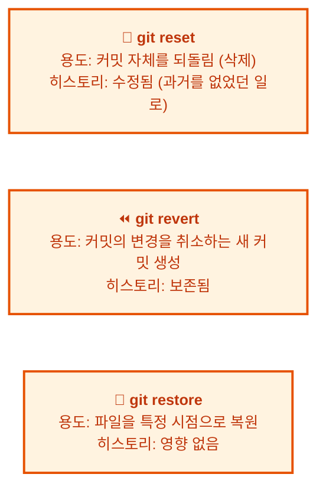
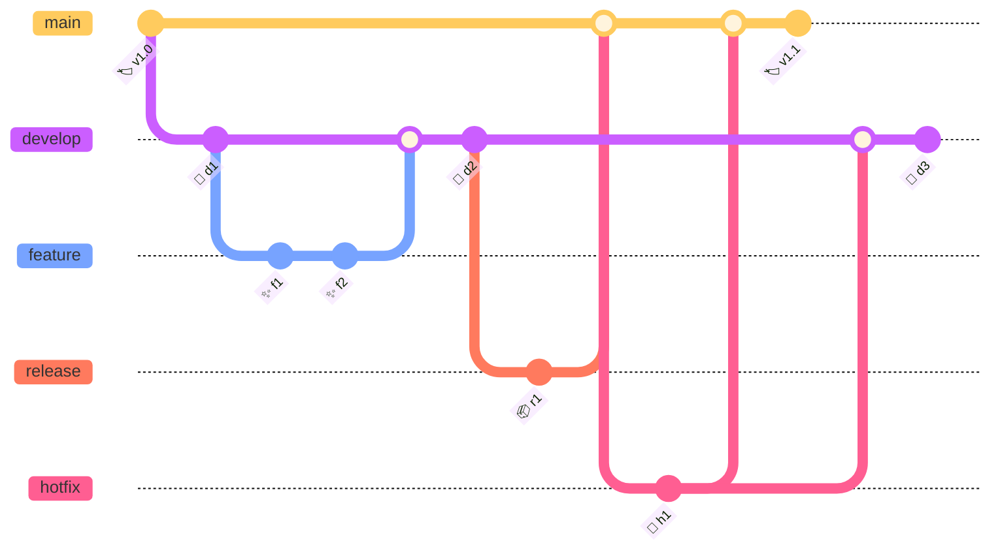

# Git 자주 묻는 질문 (FAQ)

Git을 사용하다 보면 예상치 못한 오류나 궁금증에 부딪히는 경우가 많습니다. 이 장은 Git을 실무에서 사용하면서 자주 마주치는 질문들과 그 해결 방법을 주제별로 정리한 참고 자료입니다. 각 질문은 실제 개발 현장에서 발생하는 상황을 바탕으로 구성되었으므로, 필요할 때마다 원하는 항목을 찾아 빠르게 해결 방법을 확인할 수 있습니다.


## 학습 목표

- Git 사용 중 자주 발생하는 오류의 원인과 해결 방법을 이해한다
- 커밋, 브랜치, 병합 등 주요 작업별 문제 해결 능력을 기른다
- 원격 저장소 관련 문제와 협업 시 발생하는 상황에 대처할 수 있다
- 고급 Git 명령어(reflog, bisect, cherry-pick 등)의 활용법을 익힌다

---

## 목차

1. [개념/일반](#1-개념일반)
2. [설치/설정](#2-설치설정)
3. [커밋/히스토리](#3-커밋히스토리)
4. [브랜치/병합](#4-브랜치병합)
5. [원격 저장소](#5-원격-저장소)
6. [되돌리기/복구](#6-되돌리기복구)
7. [파일/스테이징](#7-파일스테이징)
8. [협업/워크플로우](#8-협업워크플로우)
9. [고급/문제 해결](#9-고급문제-해결)

---

## 1. 개념/일반

### Q: Git과 GitHub의 차이는 무엇인가요?

**Git**은 버전 관리 시스템(도구)이고, **GitHub**는 Git 저장소를 호스팅하는 웹 서비스입니다. 비유하자면:
- Git = 카메라 (사진을 찍는 도구)
- GitHub = 인스타그램 (사진을 공유하는 플랫폼)

Git 없이 GitHub를 사용할 수 없고, GitHub 없이도 Git을 로컬에서 사용할 수 있습니다.

### Q: `merge`와 `rebase`의 차이는 무엇인가요?

두 명령어 모두 브랜치를 통합하는 데 사용하지만 방식이 다릅니다.

**Merge:** 브랜치의 변경 사항을 합치며, 브랜치 구조가 그래프에 그대로 남습니다.
```bash
$ git merge feature/login
# 병합 커밋이 생성됨
```

**Rebase:** 브랜치의 커밋을 main 브랜치 위로 재배치합니다. 히스토리가 깔끔해집니다.
```bash
$ git switch feature/login
$ git rebase main
# feature/login의 커밋이 main 위로 재정렬됨
```

```
Merge 결과:       Rebase 결과:
  A---B---C          A---B---C
 /         \        /
D---E---F---G    D---E---F---G (main, feature/login)
```

> **팁:** 리뷰 전에는 rebase로 히스토리를 깔끔하게, 공유된 브랜치에서는 merge를 사용하세요.

### Q: `git pull`과 `git fetch`의 차이는 무엇인가요?

```bash
git pull origin main    # = git fetch + git merge (자동 병합)
git fetch origin        # = 변경 사항만 가져오기 (수동 병합)
```

`pull`은 편리하지만 예상치 못한 충돌이 발생할 수 있습니다. `fetch`는 변경 사항을 먼저 확인한 후 병합할지 결정할 수 있어 더 안전합니다.

### Q: HEAD는 무엇인가요?

HEAD는 현재 작업 중인 위치를 가리키는 포인터입니다. 보통은 브랜치의 최신 커밋을 가리킵니다.

```bash
$ cat .git/HEAD
ref: refs/heads/main    # 현재 main 브랜치에 있음
```

### Q: Detached HEAD 상태는 무엇인가요?

HEAD가 브랜치가 아닌 특정 커밋을 직접 가리키는 상태입니다.

```bash
$ git checkout a1b2c3d
You are in 'detached HEAD' state...
```

이 상태에서 커밋을 만들면 브랜치 전환 시 사라질 수 있습니다. 새 브랜치를 만들어 보존하세요:
```bash
$ git switch -c new-branch
```

### Q: `reset`, `revert`, `restore`의 차이는 무엇인가요?



### Q: `git stash`는 언제 사용하나요?

브랜치를 전환해야 하는데 커밋하지 않은 변경 사항이 있을 때 임시로 저장합니다.

```bash
$ git stash                    # 현재 변경 사항 저장
$ git switch other-branch      # 다른 브랜치로 이동
$ git stash pop                # 돌아와서 변경 사항 복원
```

### Q: working tree clean은 무슨 뜻인가요?

모든 파일이 마지막 커밋 상태와 동일하다는 뜻입니다. 수정된 파일이나 새로 추가된 파일이 없습니다.

```bash
$ git status
On branch main
nothing to commit, working tree clean    # 깨끗한 상태!
```

---

## 2. 설치/설정

### Q: "Please tell me who you are" 오류가 나요

Git은 커밋할 때 사용자 정보가 필요합니다. 설정하지 않으면 이 오류가 발생합니다.

```bash
# 해결 방법
$ git config --global user.name "홍길동"
$ git config --global user.email "hong@example.com"

# 프로젝트별로 다르게 설정하려면 --global 생략
```

### Q: Git의 출력에 색깔을 넣고 싶어요

```bash
$ git config --global color.ui auto
```

### Q: 커밋 메시지 편집기를 VSCode로 바꾸고 싶어요

```bash
$ git config --global core.editor "code --wait"
```

### Q: Git 명령어를 줄여서 쓰고 싶어요 (alias)

```bash
$ git config --global alias.st status
$ git config --global alias.ci commit
$ git config --global alias.co checkout
$ git config --global alias.br branch
$ git config --global alias.lg "log --oneline --graph --all"
$ git config --global alias.unstage "restore --staged"

# 사용 예
$ git st       # = git status
$ git unstage index.html  # = git restore --staged index.html
```

### Q: 기본 브랜치 이름을 main으로 설정하고 싶어요

```bash
$ git config --global init.defaultBranch main
```

### Q: Windows와 macOS/Linux에서 줄바꿈 문자 차이를 어떻게 처리하나요?

```bash
# Windows
$ git config --global core.autocrlf true

# macOS / Linux
$ git config --global core.autocrlf input
```

### Q: Git을 업데이트하고 싶어요

```bash
# Windows
$ git update-git-for-windows

# macOS (Homebrew)
$ brew upgrade git

# Linux (Ubuntu/Debian)
$ sudo apt update && sudo apt upgrade git
```

---

## 3. 커밋/히스토리

### Q: 마지막 커밋 메시지를 변경하고 싶어요

```bash
$ git commit --amend -m "수정된 커밋 메시지"
```

> **주의:** 이미 푸시한 커밋은 --amend 하지 않는 것이 좋습니다.

### Q: 예전 커밋 메시지를 변경하고 싶어요

```bash
# 최근 3개의 커밋을 수정
$ git rebase -i HEAD~3

# 편집기에서 'pick'을 'reword'로 변경하고 저장
pick a1b2c3d 첫 번째 커밋
reword d4e5f6f 두 번째 커밋    # ← 이 커밋의 메시지를 수정
pick g7h8i9j 세 번째 커밋

# 저장 후 각 커밋의 새 메시지를 입력
```

### Q: 여러 커밋을 하나로 합치고 싶어요 (squash)

```bash
$ git rebase -i HEAD~3

# 합칠 커밋을 'squash' 또는 's'로 변경
pick a1b2c3d 첫 번째 커밋
squash d4e5f6f 두 번째 커밋    # ← 첫 번째 커밋에 합쳐짐
squash g7h8i9j 세 번째 커밋    # ← 첫 번째 커밋에 합쳐짐

# 저장 후 새 커밋 메시지 작성
```

### Q: 특정 파일의 변경 이력을 보고 싶어요

```bash
# 파일의 모든 변경 커밋 찾기
$ git log --oneline -- index.html

# 파일의 각 줄별 최종 변경자 확인
$ git blame index.html
a1b2c3d (홍길동 2026-07-10) <h1>Hello</h1>
d4e5f6f (김철수 2026-07-11) <p>World</p>
```

### Q: 특정 문자열이 추가되거나 삭제된 커밋을 찾고 싶어요

```bash
# "console.log"가 추가/제거된 커밋 찾기
$ git log -S "console.log" --oneline

# 특정 파일에서만 검색
$ git log -S "console.log" --oneline -- app.js
```

### Q: 특정 기간의 커밋만 보고 싶어요

```bash
$ git log --after="2026-01-01" --before="2026-06-30"
$ git log --since="2 weeks ago"
$ git log --until="yesterday"
```

### Q: 커밋을 작성자별로 필터링하고 싶어요

```bash
$ git log --author="홍길동"
$ git log --author="홍길동\|김철수"    # 여러 명
```

### Q: 브랜치 그래프를 예쁘게 보고 싶어요

```bash
$ git log --oneline --graph --all --decorate
```

### Q: 변경된 파일 목록만 보고 싶어요

```bash
$ git log --name-only
$ git log --name-status    # 변경 유형(A/M/D)까지
```

### Q: 커밋 간의 차이를 단어 단위로 보고 싶어요

```bash
$ git diff --word-diff
```

### Q: 특정 커밋에서 추가된 총 라인 수를 알고 싶어요

```bash
$ git diff --stat a1b2c3d..d4e5f6f
 README.md | 5 +++++
 app.js    | 10 ++++++++++
 2 files changed, 15 insertions(+)
```

---

## 4. 브랜치/병합

### Q: 브랜치 이름을 변경하고 싶어요

```bash
# 현재 브랜치 이름 변경
$ git branch -m 새이름

# 다른 브랜치 이름 변경
$ git branch -m old-name new-name
```

### Q: 브랜치를 삭제했는데 복구하고 싶어요

```bash
# 삭제된 브랜치의 마지막 커밋 해시 찾기
$ git reflog
a1b2c3d HEAD@{0}: Branch: deleted refs/heads/feature/login

# 해당 커밋에서 브랜치 복원
$ git branch feature/login a1b2c3d
```

### Q: 병합을 취소하고 싶어요

```bash
# 충돌 중일 때
$ git merge --abort

# 이미 병합했지만 아직 푸시하지 않음
$ git reset --hard ORIG_HEAD

# 이미 푸시했을 때 (안전)
$ git revert -m 1 HEAD
```

### Q: Fast-forward 병합을 강제로 막고 싶어요

```bash
$ git merge --no-ff feature/login
# Fast-forward가 가능해도 항상 병합 커밋을 생성
```

### Q: 변경 사항을 임시 저장하지 않고 브랜치를 전환하고 싶어요

커밋하지 않은 변경 사항이 있으면 브랜치 전환이 거부될 수 있습니다.

```bash
# 방법 1: stash (임시 저장)
$ git stash
$ git switch other-branch
$ git stash pop    # 복원

# 방법 2: 강제 전환 (변경 사항 유실 주의!)
$ git switch --force other-branch

# 방법 3: 작업 중인 변경 사항 커밋
$ git add .
$ git commit -m "임시 저장"
$ git switch other-branch
# 나중에 git commit --amend로 수정
```

### Q: 모든 브랜치를 한눈에 보고 싶어요

```bash
$ git branch -a                    # 로컬 + 원격 모든 브랜치
$ git branch -v                    # 브랜치 + 마지막 커밋
$ git branch -vv                   # 추적 브랜치 정보까지
$ git log --oneline --graph --all  # 브랜치 그래프
```

### Q: 다른 브랜치의 특정 파일만 가져오고 싶어요

```bash
$ git restore --source=feature/login -- index.html
# 또는
$ git checkout feature/login -- index.html
```

### Q: merge conflict가 발생했는데 도저히 모르겠어요

```bash
# 1. 상황을 원래대로 되돌리기
$ git merge --abort

# 2. 병합 도구 사용
$ git mergetool

# 3. 한쪽 브랜치의 내용을 완전히 선택
$ git checkout --ours index.html      # 현재 브랜치 내용 유지
$ git checkout --theirs index.html    # 병합 대상 브랜치 내용 유지

# 4. 충돌 파일 모두 보기
$ git diff --name-only --diff-filter=U
```

---

## 5. 원격 저장소

### Q: "failed to push some refs" 오류가 나요

다른 사람이 먼저 push해서 원격 저장소에 내가 모르는 변경 사항이 있을 때 발생합니다.

```bash
# 해결 방법
$ git pull origin main          # 원격 변경 사항 가져오기
$ git push origin main          # 다시 push
```

### Q: 원격 저장소의 주소를 변경하고 싶어요

```bash
$ git remote set-url origin https://github.com/new-username/new-repo.git
```

### Q: 원격 저장소의 브랜치를 삭제하고 싶어요

```bash
$ git push origin --delete feature/login
# 또는
$ git push origin :feature/login
```

### Q: 원격 브랜치의 최신 내용을 로컬에 반영하고 싶어요

```bash
$ git fetch origin              # 원격 변경 사항 가져오기
$ git merge origin/main         # 로컬 main에 병합
# 또는 한 번에
$ git pull origin main          # fetch + merge
```

### Q: 로컬 브랜치를 삭제했는데 원격 브랜치는 남아있어요

```bash
# 로컬 브랜치만 삭제한 경우
$ git push origin --delete feature/login    # 원격 브랜치 삭제
```

### Q: fork한 저장소를 원본과 동기화하고 싶어요

```bash
$ git remote add upstream https://github.com/원본/저장소.git
$ git fetch upstream
$ git switch main
$ git merge upstream/main
$ git push origin main
```

### Q: 여러 개의 원격 저장소를 사용하고 싶어요

```bash
$ git remote add backup https://gitlab.com/me/project.git
$ git push origin main      # GitHub에 push
$ git push backup main      # GitLab에도 push
```

### Q: 원격 저장소의 정보를 자세히 보고 싶어요

```bash
$ git remote show origin
```

### Q: clone 받은 저장소의 원격을 바꾸고 싶어요

```bash
$ git remote -v                    # 현재 원격 확인
$ git remote remove origin         # 기존 원격 제거
$ git remote add origin https://github.com/me/new-repo.git  # 새 원격 추가
```

---

## 6. 되돌리기/복구

### Q: 방금 한 커밋을 취소하고 싶어요

```bash
# 커밋만 취소 (변경 사항은 staged 상태로 유지)
$ git reset --soft HEAD~1

# 커밋 취소 + unstaged 상태로 유지
$ git reset HEAD~1

# 커밋 + 변경 사항 모두 삭제 (주의!)
$ git reset --hard HEAD~1
```

### Q: 이미 push한 커밋을 되돌리고 싶어요

```bash
# revert 사용 (안전)
$ git revert HEAD --no-edit
$ git push origin main

# reset + force push는 팀원에게 혼란을 줌 (비추천)
$ git reset --hard HEAD~1
$ git push --force origin main    # ← 주의!
```

### Q: `git reset --hard`로 삭제한 커밋을 살리고 싶어요

```bash
# ORIG_HEAD에 reset 직전 위치가 저장되어 있음
$ git reset --hard ORIG_HEAD

# 또는 reflog로 찾기
$ git reflog
a1b2c3d HEAD@{0}: reset: moving to HEAD~1
d4e5f6f HEAD@{1}: commit: 중요한 커밋    # ← 이걸로 복구
$ git reset --hard d4e5f6f
```

### Q: 삭제한 파일을 복구하고 싶어요

```bash
# 마지막 커밋 상태로 복원
$ git restore 삭제된파일

# 특정 커밋 시점의 파일로 복원
$ git restore --source=HEAD~2 삭제된파일
```

### Q: 작업 중인 변경 사항을 모두 취소하고 싶어요

```bash
# 모든 파일을 마지막 커밋 상태로 복원
$ git restore .

# 특정 파일만 복원
$ git restore index.html
```

### Q: 스테이징을 취소하고 싶어요 (Unstage)

```bash
$ git restore --staged index.html
# 또는
$ git reset HEAD index.html
```

### Q: 실수로 잘못된 브랜치에 커밋했어요

```bash
# 1. 현재 브랜치에서 마지막 커밋 취소 (변경 사항 유지)
$ git reset HEAD~1

# 2. 올바른 브랜치로 전환
$ git switch correct-branch

# 3. 변경 사항을 올바른 브랜치에 커밋
$ git add .
$ git commit -m "올바른 브랜치에 커밋"
```

### Q: `git add .`를 했는데 추가하면 안 될 파일까지 올라갔어요

```bash
# 모든 파일 Unstage
$ git reset

# 특정 파일만 Unstage
$ git restore --staged 비밀파일.env
```

---

## 7. 파일/스테이징

### Q: 특정 파일을 Git이 추적하지 않게 하고 싶어요

```bash
# .gitignore 파일 생성
$ echo "node_modules/" >> .gitignore
$ echo ".env" >> .gitignore
$ git add .gitignore && git commit -m ".gitignore 추가"
```

**자주 사용하는 .gitignore 패턴:**
```bash
# 의존성
node_modules/
vendor/
.pnp/
__pycache__/

# 환경 변수
.env
.env.local

# 빌드 결과물
dist/
build/
*.zip

# 로그
*.log

# IDE 설정
.vscode/
.idea/
*.swp

# OS 파일
.DS_Store
Thumbs.db
```

### Q: 이미 추적 중인 파일을 .gitignore에 추가해도 적용되지 않아요

한 번 추적된 파일은 캐시를 지워야 .gitignore가 적용됩니다.

```bash
# 캐시에서 제거 (파일은 유지)
$ git rm --cached config.json
$ echo "config.json" >> .gitignore
$ git add .gitignore && git commit -m "config.json 추적 제거"
```

### Q: 파일의 일부 변경 사항만 커밋하고 싶어요

```bash
# 대화형 스테이징
$ git add -p

# Git이 변경 사항을 덩어리(hunk) 단위로 보여줌
Stage this hunk [y,n,q,a,d,s,e,?]?
# y: 스테이징, n: 건너뛰기, s: 분할, e: 수동 편집
```

### Q: 빈 디렉토리를 커밋하고 싶은데 안 돼요

Git은 빈 디렉토리를 추적하지 않습니다. 더미 파일을 넣어야 합니다.

```bash
$ mkdir empty-folder
$ touch empty-folder/.gitkeep
$ git add empty-folder/.gitkeep
```

### Q: 파일 이름을 변경했는데 Git이 인식할까요?

```bash
$ git mv old-name.js new-name.js
# 또는 그냥 mv 후 git add
$ mv old-name.js new-name.js
$ git add -A      # Git이 자동으로 rename 감지
```

### Q: `.gitkeep` 파일은 무엇인가요?

Git이 빈 디렉토리를 추적하지 않기 때문에, 디렉토리를 유지하려고 넣는 빈 파일입니다. `.gitkeep`은 Git의 공식 기능이 아니라 관례적인 파일명입니다 (실제로는 아무 이름이나 상관없음).

### Q: Untracked 파일만 따로 보고 싶어요

```bash
$ git status -s | grep '^\?\?'
?? new-file.css
```

---

## 8. 협업/워크플로우

### Q: Pull Request(PR)를 만들기 전에 확인할 것은?

- [ ] 로컬에서 테스트 완료
- [ ] `main` 브랜치 최신 상태로 rebase 또는 merge
- [ ] 불필요한 커밋 squash
- [ ] 커밋 메시지 명확하게 작성
- [ ] 충돌 없음 확인
- [ ] .gitignore에 불필요한 파일 추가 안 했는지 확인

```bash
$ git switch main && git pull origin main
$ git switch feature/my-feature
$ git rebase main
$ git log --oneline    # 히스토리 확인
$ git push origin feature/my-feature --force-with-lease
```

### Q: PR 리뷰를 요청할 때 리뷰어를 지정하고 싶어요

```bash
# GitHub CLI
$ gh pr create --reviewer alice,bob --base main

# git push 방식 (Gerrit)
$ git push origin HEAD:refs/for/main%r=alice@example.com
```

### Q: 같은 브랜치에서 여러 사람이 작업할 때 충돌을 피하려면?

1. 작은 단위로 자주 커밋하고 push
2. 작업 시작 전에 항상 `git pull`로 최신 상태 유지
3. 장기 브랜치보다 단기 브랜치 선호
4. 같은 파일을 동시에 수정하지 않도록 팀원과 소통

### Q: "Merge branch 'main' of ..." 커밋이 자동으로 생겨요

`git pull`이 자동 merge 커밋을 생성하기 때문입니다. rebase로 해결:

```bash
$ git pull --rebase origin main
# 또는 기본 설정
$ git config --global pull.rebase true
```

### Q: Git Flow가 뭔가요?

Git Flow는 main, develop, release, hotfix, feature의 5가지 브랜치를 사용하는 워크플로우입니다.



주로 정기 릴리스가 있는 제품 개발에 적합합니다. 단순한 프로젝트에는 GitHub Flow가 더 적합합니다.

### Q: 좋은 커밋 메시지를 작성하는 팁

```
# 제목 (50자 이내, 명령형)
로그인 버튼 클릭 시 크래시 버그 수정

# 본문 (선택, 72자마다 줄바꿈)
- 널 포인터 예외 처리 추가
- 잘못된 토큰 참조 제거
- 관련 이슈: #42
```

**좋은 예:**
```
✅ "로그인 버튼 크래시 버그 수정"
✅ "README에 설치 방법 추가"
✅ "결제 모듈 API 응답 시간 최적화"
```

**나쁜 예:**
```
❌ "수정"
❌ "버그 수정함"
❌ "asdf"
❌ "WIP"
```

---

## 9. 고급/문제 해결

### Q: `git reflog`는 무엇인가요?

Git의 타임머신입니다. HEAD가 가리켰던 모든 위치의 기록을 보여줍니다. `git reset --hard`로 삭제한 커밋도 여기서 찾을 수 있습니다.

```bash
$ git reflog
a1b2c3d HEAD@{0}: reset: moving to HEAD~1
d4e5f6f HEAD@{1}: commit: 중요한 작업
g7h8i9j HEAD@{2}: pull origin main: Fast-forward
k1l2m3n HEAD@{3}: commit: 첫 커밋

# 예전 상태로 복구
$ git reset --hard HEAD@{1}
```

### Q: `git bisect`로 버그를 찾고 싶어요

이진 탐색으로 버그가 처음 발생한 커밋을 찾습니다.

```bash
$ git bisect start
$ git bisect bad                 # 현재 버전은 버그 있음
$ git bisect good a1b2c3d        # 이전 버전은 정상

# Git이 알아서 중간 커밋으로 이동
Bisecting: 12 revisions left to test
$ npm test                       # 테스트 실행

# 결과에 따라
$ git bisect good                # 이 커밋은 정상
$ git bisect bad                 # 이 커밋은 버그 있음

# 반복하면 버그를 처음引入한 커밋 발견!
a1b2c3d is the first bad commit

# 종료
$ git bisect reset
```

### Q: 특정 커밋의 변경 사항만 다른 브랜치에 적용하고 싶어요 (cherry-pick)

```bash
$ git switch main
$ git cherry-pick a1b2c3d        # 특정 커밋만 가져오기
$ git cherry-pick a1b2c3d..d4e5f6f  # 범위 지정
$ git cherry-pick --no-commit a1b2c3d  # 커밋 없이 변경만 적용
```

### Q: 커밋을 한 줄로 예쁘게 포맷하고 싶어요

```bash
$ git log --pretty=format:"%C(yellow)%h%Creset %C(blue)%an%Creset %ar %Cgreen%s%Creset"
# 색깔 있는 로그!
```

**자주 사용하는 포맷:**
```bash
$ git log --oneline                          # 기본 한 줄
$ git log --graph --oneline --all            # 그래프
$ git log --pretty=format:"%h - %an, %ar : %s"
$ git log --pretty=format:"%C(auto)%h %s"   # 자동 색상
```

alias로 저장:
```bash
$ git config --global alias.prettylog "log --graph --oneline --all --decorate --pretty=format:'%C(auto)%h %C(blue)%an%C(auto)%d %C(green)%s%Creset'"
```

### Q: Git LFS는 무엇인가요?

Git LFS(Large File Storage)는 큰 바이너리 파일(이미지, 동영상 등)을 Git으로 관리하기 위한 확장 기능입니다. Git 자체는 큰 파일에 최적화되어 있지 않아 저장소가 비대해지고 clone/pull이 느려집니다.

```bash
# 설치
$ git lfs install

# 특정 파일 형식 추적
$ git lfs track "*.psd"
$ git lfs track "*.zip"
$ git add .gitattributes
$ git commit -m "LFS 추적 추가"

# 일반적인 Git 사용과 동일하게 사용
$ git add file.psd
$ git commit -m "디자인 파일 추가"
$ git push origin main
```

### Q: 서브모듈(submodule)은 무엇인가요?

한 Git 저장소 안에 다른 Git 저장소를 포함하는 기능입니다.

```bash
# 서브모듈 추가
$ git submodule add https://github.com/example/lib.git lib/

# 서브모듈을 포함한 저장소 클론
$ git clone --recurse-submodules https://github.com/me/project.git

# 서브모듈 업데이트
$ git submodule update --init --recursive
```

### Q: `git clean`은 무엇인가요?

Untracked 파일들을 한 번에 삭제합니다.

```bash
# Untracked 파일 삭제 미리보기
$ git clean -n

# Untracked 파일 삭제
$ git clean -f

# 디렉토리까지 삭제
$ git clean -fd

# .gitignore에 있는 파일도 삭제
$ git clean -fx
```

> **주의:** `git clean`은 삭제한 파일을 복구할 수 없습니다!

### Q: 환경 변수나 비밀 키가 실수로 커밋됐어요

```bash
# .gitignore에 추가
$ echo ".env" >> .gitignore

# Git 캐시에서 제거 (원격에도 있음)
$ git rm --cached .env

# ⚠️ 이미 푸시한 경우: 히스토리에서도 제거 필요
$ git filter-branch --force --index-filter \
  "git rm --cached --ignore-unmatch .env" \
  --prune-empty --tag-name-filter cat -- --all

# 또는 GitHub의 공식 도구 사용
$ gh secret set --repo owner/repo MY_SECRET_KEY
```

> **중요:** 비밀 키가 이미 푸시되었다면 **즉시 키를 교체**하세요. Git 히스토리에서 완전히 제거해도 기존 키는 유출된 상태입니다.

### Q: 브랜치를 복사하고 싶어요

```bash
# 다른 이름으로 브랜치 복사
$ git branch new-branch existing-branch

# 다른 브랜치의 특정 커밋에서 새 브랜치 생성
$ git branch new-branch a1b2c3d
```

### Q: 특정 파일을 다른 브랜치와 비교하고 싶어요

```bash
$ git diff main feature/login -- index.html
$ git diff main..feature/login -- index.html
```

### Q: 병합했는데 잘못된 브랜치를 병합했어요 (아직 push 전)

```bash
# ORIG_HEAD로 복구 (merge 직전 상태)
$ git reset --hard ORIG_HEAD
```

### Q: `git status`가 느려요

원인이 되는 대규모 디렉토리나 파일이 있을 수 있습니다.

```bash
# 느린 원인 찾기
$ git fsck

# 대규모 파일 찾기
$ git rev-list --objects --all | git cat-file --batch-check='%(objecttype) %(objectname) %(objectsize) %(rest)' | awk '/^blob/ {print $3, $4}' | sort -rn | head -10
```

### Q: 방금 전에 스테이징한 내용을 확인하고 싶어요

```bash
$ git diff --staged
$ git diff --cached      # 동일한 명령어
```

### Q: 작업 내용을 커밋하지 않고 다른 브랜치의 파일을 보고 싶어요

```bash
$ git show feature/login:index.html
$ git show a1b2c3d:src/app.js
```

### Q: 모든 커밋의 변경된 파일 목록을 보고 싶어요

```bash
$ git log --stat
```

### Q: 원격 브랜치의 커밋을 로컬에서 확인하고 싶어요

```bash
$ git fetch origin
$ git log origin/main
$ git diff main origin/main
```

### Q: Git 명령어의 도움말을 보고 싶어요

```bash
$ git help <명령어>
$ git <명령어> --help
$ git <명령어> -h          # 간략한 도움말

# 예시
$ git help log
$ git merge --help
$ git status -h
```

### Q: 특정 파일이 Git에서 무시되는 이유를 알고 싶어요

```bash
$ git check-ignore -v config.json
.gitignore:3:*.json    config.json    # 3번째 줄의 패턴과 일치
```

### Q: Git의 설정 파일 위치는?

```bash
# 시스템 전체 설정
/etc/gitconfig

# 현재 사용자 설정
~/.gitconfig           # 또는 ~/.config/git/config

# 현재 저장소 설정
.git/config

# 설정 확인
$ git config --list --system
$ git config --list --global
$ git config --list --local
```

### Q: 저장소의 크기를 줄이고 싶어요

```bash
# 가비지 컬렉션 실행
$ git gc

# 더 강력한 최적화
$ git gc --aggressive

# 불필요한 파일 제거
$ git prune

# 가장 큰 파일 찾기
$ git rev-list --objects --all | git cat-file --batch-check='%(objectsize:disk) %(rest)' | sort -rn | head -20
```

## 한눈에 정리

| 구분 | 주요 명령어 / 개념 | 설명 |
|------|-------------------|------|
| 개념 | Git vs GitHub | Git = 버전 관리 도구, GitHub = 호스팅 플랫폼 |
| 개념 | Merge vs Rebase | Merge = 병합 커밋 생성, Rebase = 커밋 재배치 |
| 설정 | `git config --global` | 사용자 정보, alias, 편집기 등 전역 설정 |
| 커밋 | `git commit --amend` | 마지막 커밋 메시지 수정 |
| 커밋 | `git rebase -i` | 여러 커밋을 squash하거나 수정 |
| 브랜치 | `git branch -m` | 브랜치 이름 변경 |
| 브랜치 | `git merge --abort` | 충돌 중 병합 취소 |
| 원격 | `git remote set-url` | 원격 저장소 주소 변경 |
| 되돌리기 | `git reset --soft/hard` | 커밋 취소 (안전/위험) |
| 되돌리기 | `git revert` | push된 커밋 안전하게 취소 |
| 파일 | `.gitignore` | 추적 제외 파일 패턴 정의 |
| 협업 | Git Flow | 5가지 브랜치 전략 (main/develop/release/hotfix/feature) |
| 고급 | `git reflog` | HEAD 이동 기록, 삭제된 커밋 복구 |
| 고급 | `git bisect` | 이진 탐색으로 버그 발생 커밋 찾기 |
| 고급 | `git cherry-pick` | 특정 커밋만 다른 브랜치에 적용 |
