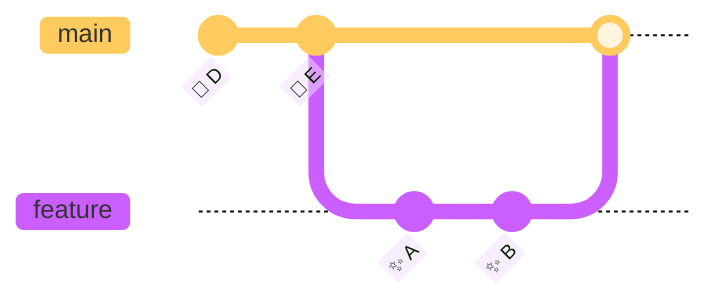
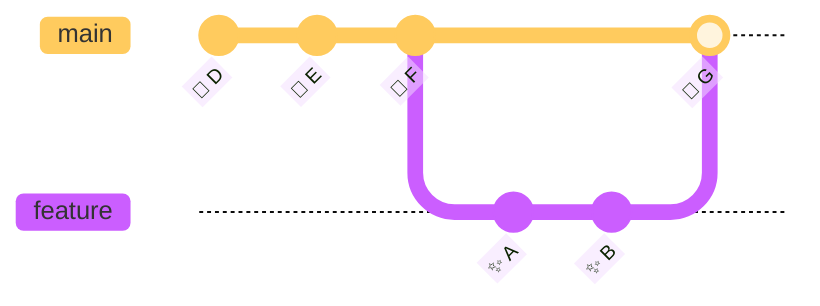

# 용어 설명

Git을 처음 배울 때 가장 큰 장벽 중 하나는 생소한 용어들입니다. 이 장에서는 Git을 사용하면서 자주 접하게 되는 주요 용어들을 한글 자모순으로 정리하여, 필요할 때마다 빠르게 의미를 확인할 수 있도록 구성하였습니다. 각 용어는 실제 사용 예시와 함께 설명되어 있으므로, 단순 암기보다는 문맥 속에서 이해하는 데 도움이 될 것입니다.


## 학습 목표

- Git의 핵심 용어와 개념을 이해하고 설명할 수 있다
- 각 용어에 대응하는 실제 Git 명령어를 익힌다
- 용어 간의 관계(예: 스테이징 → 커밋 → 푸시)를 이해한다


## 👨‍💻 실전 프로젝트: Git 용어 사전 활용하기

이 실전 프로젝트에서는 앞으로 배울 Git 용어 사전을 직접 활용하면서 명령어를 실습해 봅니다. Git을 전혀 모르는 상태에서도 따라 할 수 있도록 구성하였으니, 아래 단계를 순서대로 진행해 보십시오.

1. **저장소 초기화 및 파일 생성**: 터미널에서 `mkdir git-practice && cd git-practice`를 입력한 후 `git init`을 실행하십시오. 이때 `.git` 디렉토리가 생성되는데, 이는 **Git 저장소**의 핵심입니다. 이후 `echo "Hello" > README.md`로 파일 하나를 만드십시오.
2. **스테이징과 커밋 경험하기**: `git status`를 입력하여 **워킹 디렉토리**의 상태를 확인하십시오. README.md가 빨간색(Untracked)으로 표시될 것입니다. `git add README.md`로 파일을 **스테이징 영역**에 올린 후 `git status`를 다시 실행하면 초록색(Changes to be committed)으로 바뀐 것을 볼 수 있습니다. `git commit -m "첫 커밋: README 추가"`로 변경 사항을 기록하십시오.
3. **용어 사전과 명령어 연결하기**: 지금까지 사용한 `git init`, `git add`, `git commit` 명령어가 이 문서의 어느 용어 항목에 설명되어 있는지 찾아보십시오. 각 용어의 정의와 예제를 읽으며 실제로 실행한 명령어와 대조해 보면 개념이 더욱 명확해집니다.
4. **브랜치 생성 및 병합 도전**: `git switch -c feature/hello`를 입력하여 새 **브랜치**를 만들고, README.md에 문장을 추가한 후 다시 커밋하십시오. `git switch main`으로 되돌아간 뒤 `git merge feature/hello`로 병합해 보십시오. 이때 **Fast-Forward 병합**이 발생하는지, 아니면 **3-Way 병합**이 필요한 상황인지 관찰하십시오.

이 실습을 마친 후에도 궁금한 Git 명령어가 있다면 언제든지 이 용어 사전을 찾아보십시오. 용어의 의미를 이해한 상태에서 명령어를 실행하면 학습 효율이 훨씬 높아집니다.


## ㄱ

- **Git (깃):** 분산형 버전 관리 시스템. 파일의 변경 이력을 추적하고 여러 개발자 간의 협업을 돕는 도구입니다. Git은 중앙 서버 없이도 로컬에서 모든 이력을 저장하기 때문에 오프라인 환경에서도 자유롭게 작업할 수 있습니다. Subversion이나 CVS와 달리 Git은 파일의 차분(delta)이 아닌 스냅샷(snapshot) 방식으로 데이터를 저장하므로 브랜치 전환이나 병합이 매우 빠릅니다. 리누스 토르발스(Linus Torvalds)가 리눅스 커널 개발을 위해 2005년에 직접 만들었으며, 현재 전 세계 소프트웨어 개발의 사실상 표준으로 자리 잡았습니다.
  ```bash
  $ git --version
  git version 2.40.0
  ```
- **GitHub (깃허브):** Git 저장소를 호스팅하는 웹 서비스. 협업, 코드 리뷰, 이슈 트래킹 등의 기능을 제공합니다. GitHub는 단순한 저장소 호스팅을 넘어 Pull Request 기반의 코드 리뷰 워크플로우, GitHub Actions를 통한 CI/CD 자동화, 프로젝트 관리 도구까지 하나의 플랫폼에서 제공합니다. Git 자체는 명령줄 도구이며 GitHub는 그 위에서 동작하는 서비스임을 반드시 구분해야 합니다. Bitbucket, GitLab과 같은 경쟁 서비스도 존재하지만, GitHub는 가장 큰 개발자 커뮤니티를 보유한 생태계로 자리매김하였습니다.
  ```
  https://github.com/username/project
  ```

이제 첫 자음 그룹을 살펴보았으니, 계속해서 다른 개념들을 알아보겠습니다. 다음은 브랜치에 속하지 않고 특정 커밋을 직접 가리키는 **Detached HEAD** 상태입니다.


## ㄸ

- **Detached HEAD:** HEAD가 특정 브랜치가 아닌, 과거의 특정 커밋을 직접 가리키고 있는 상태. 일반적으로 HEAD는 브랜치(예: `main`)를 간접적으로 가리키지만, `git checkout a1b2c3d`처럼 과거 커밋 해시를 직접 체크아웃하면 HEAD가 브랜치 없이 커밋을 직접 가리키게 됩니다. 이 상태에서 새 커밋을 만들면 어느 브랜치에도 속하지 않는 고립된 커밋이 생성되며, 다른 브랜치로 이동한 후에는 해당 커밋을 다시 참조하기 어려워집니다. 따라서 Detached HEAD 상태에서 실수로 작업했다면 즉시 `git switch -c new-branch`로 새 브랜치를 만들어 커밋을 보호하는 것이 안전합니다.
  ```bash
  $ git checkout a1b2c3d  # Detached HEAD 상태 진입
  $ git log --oneline -1
  a1b2c3d (HEAD) 과거 커밋  # (main)이 없음!
  ```

Detached HEAD의 위험성을 이해하였다면, 이제 본격적으로 브랜치와 병합이라는 Git의 핵심 개념들을 살펴보겠습니다.


## ㅂ

- **브랜치 (Branch):** 코드의 독립적인 작업 흐름을 나타내는 포인터. Git의 브랜치는 단순히 특정 커밋을 가리키는 41바이트 크기의 작은 파일에 불과하므로 생성과 삭제가 매우 가볍고 빠릅니다. 기본 브랜치 이름은 `main`(또는 `master`)이며, 기능 개발 시 `feature/login`이나 `bugfix/issue-42`처럼 `/`로 계층 구조를 만들어 브랜치를 관리하는 것이 일반적입니다. `git switch` 명령어로 브랜치를 전환하면 워킹 디렉토리의 파일들이 해당 브랜치의 스냅샷으로 변경됩니다. 여러 개발자가 동시에 각자의 브랜치에서 작업한 후 나중에 병합하는 방식이 Git의 대표적인 협업 워크플로우입니다.
  ```bash
  $ git branch feature/login   # 새 브랜치 생성
  $ git switch feature/login   # 브랜치 전환
  ```
- **병합 (Merge):** 두 브랜치의 변경 사항을 하나로 합치는 작업. `git merge`는 현재 브랜치에 대상 브랜치의 변경 사항을 통합하며, 두 브랜치가 갈라진 이후의 이력을 합치는 방식으로 동작합니다. 병합에는 두 가지 유형이 있는데, 한쪽 브랜치에만 새 커밋이 있는 **Fast-Forward 병합**과 양쪽 브랜치에 각각 새 커밋이 있는 **3-Way 병합**입니다. 충돌이 발생하면 Git은 병합을 중단하고 사용자에게 해결을 요청하므로, 충돌 해결 후 `git add`와 `git commit`으로 병합을 완료해야 합니다. `--no-ff` 옵션을 사용하면 Fast-Forward가 가능한 상황에서도 강제로 병합 커밋을 생성할 수 있습니다.
  ```bash
  $ git switch main && git merge feature/login
  ```

병합의 개념을 이해했다면, 커밋을 준비하는 중간 단계인 스테이징 영역에 대해 알아보겠습니다.


## ㅅ

- **스테이징 영역 (Staging Area / Index):** 커밋을 준비하는 중간 영역. Git의 세 가지 상태(워킹 디렉토리 → 스테이징 영역 → 저장소) 중 두 번째 단계로, 사용자가 커밋할 파일들을 선별하여 모아두는 곳입니다. `git add` 명령어로 워킹 디렉토리의 변경 사항을 스테이징 영역에 올리면 `git status`에서 초록색 "Changes to be committed" 항목으로 표시됩니다. 스테이징 영역이 없다면 파일 전체 또는 모든 변경 사항이 한 번에 커밋되어야 하지만, Git은 이 중간 영역 덕분에 파일의 일부만 선택적으로 커밋(`git add -p`)할 수 있습니다. 이를 통해 하나의 커밋을 논리적으로 깔끔하게 나누어 프로젝트 이력을 더욱 읽기 쉽게 관리할 수 있습니다.
  ```bash
  $ git add index.html   # 스테이징 영역에 추가
  $ git status           # 'Changes to be committed' 확인
  ```

스테이징 영역을 이해하였다면, 이제 로컬을 넘어 원격에서 협업하는 데 필요한 개념들을 살펴보겠습니다.


## ㅇ

- **원격 저장소 (Remote Repository):** 인터넷이나 네트워크 상에 있는 Git 저장소. 원격 저장소는 로컬 저장소의 백업 역할과 동시에 여러 개발자가 코드를 공유하는 중앙 허브 역할을 합니다. 기본 원격 저장소 이름은 `origin`으로, `git remote add origin <URL>` 명령어로 등록하며, 하나의 로컬 저장소에 여러 개의 원격 저장소(`origin`, `upstream`, `backup` 등)를 동시에 등록할 수도 있습니다. 오픈 소스 프로젝트에서는 보통 자신의 포크를 `origin`, 원본 저장소를 `upstream`으로 지정하여 관리합니다. `git remote -v`로 등록된 모든 원격 저장소의 URL을 확인할 수 있습니다.
  ```bash
  $ git remote -v
  origin  https://github.com/me/repo.git (fetch)
  ```
- **워킹 디렉토리 (Working Directory):** 현재 작업 중인 실제 파일들이 있는 디렉토리. 워킹 디렉토리는 Git 저장소가 추적(track)하는 파일들과 아직 추적되지 않은 파일(Untracked)이 함께 존재하는 공간입니다. 여기서 파일을 수정하면 Git은 수정된 파일을 Modified 상태로 인식하지만, 아직 스테이징 영역이나 저장소에는 반영되지 않습니다. `git restore` 명령어를 사용하면 워킹 디렉토리의 수정 사항을 마지막 커밋 상태로 되돌릴 수 있습니다. 워킹 디렉토리 → 스테이징 영역 → 저장소로 이어지는 흐름은 Git의 가장 기본적인 작업 사이클입니다.
  ```bash
  $ ls -la   # 현재 작업 중인 파일들
  ```

원격과 로컬의 관계를 이해하였으니, 이제 변경 사항을 기록하고 공유하는 핵심 개념들을 살펴보겠습니다.


## ㅋ

- **커밋 (Commit):** Git 저장소에 변경 사항을 기록하는 행위. 커밋은 스테이징 영역에 모아둔 파일들의 스냅샷을 Git 저장소에 영구적으로 저장하는 작업이며, 각 커밋은 SHA-1 해시 값으로 고유하게 식별됩니다. 하나의 커밋은 이전 커밋(부모 커밋)을 가리키는 포인터를 포함하므로, 전체 커밋 이력은 방향성 비순환 그래프(DAG) 구조를 이룹니다. 커밋은 가능한 한 작고 논리적인 단위로 나누는 것이 좋은 습관이며, "하나의 커밋에는 하나의 논리적 변경"이라는 원칙을 지키면 이후 버그 추적과 코드 리뷰가 훨씬 수월해집니다.
  ```bash
  $ git commit -m "로그인 버그 수정"
  ```
- **커밋 메시지 (Commit Message):** 커밋할 때 변경 사항에 대한 설명. 커밋 메시지는 보통 50자 이내의 제목(Subject)과 한 줄 띄운 후 본문(Body)으로 구성하는 50/72 규칙을 따릅니다. `git log --oneline`으로 간략한 이력을 볼 때 제목만 표시되므로, 제목만으로도 변경 사항을 유추할 수 있도록 작성하는 것이 중요합니다. Conventional Commits 규약(`feat:`, `fix:`, `chore:` 등)을 따르면 자동으로 버전 관리나 CHANGELOG 생성을 할 수 있어 더욱 체계적으로 프로젝트를 관리할 수 있습니다. 좋은 커밋 메시지는 "무엇을" 변경했는지뿐 아니라 "왜" 변경했는지까지 담고 있어야 팀 협업에 진정한 도움이 됩니다.
  ```bash
  $ git log --oneline
  a1b2c3d 로그인 버그 수정   # ← 이 부분이 커밋 메시지
  ```
- **클론 (Clone):** 원격 저장소를 로컬 컴퓨터로 복사. `git clone`은 단순히 파일을 다운로드하는 것이 아니라 전체 Git 저장소의 이력, 모든 브랜치, 태그 등을 함께 가져옵니다. 실행하면 원격 저장소의 이름으로 디렉토리가 자동 생성되고, 원격 저장소가 `origin`이라는 이름으로 등록되며 `main` 브랜치가 자동으로 체크아웃됩니다. 대규모 저장소의 경우 `--depth=1` 옵션으로 최신 커밋 하나만 가져오는 얕은 클론(Shallow Clone)을 사용할 수 있으며, `--bare` 옵션으로 작업 디렉토리 없이 저장소 데이터만 복제할 수도 있습니다.
  ```bash
  $ git clone https://github.com/facebook/react.git
  # react/ 디렉토리가 생성됨
  ```

커밋과 클론을 이해하였다면, 이제 버전 관리에 이름을 붙이는 태그와 원격 동기화 명령어들을 알아보겠습니다.


## ㅌ

- **태그 (Tag):** 특정 커밋에 이름표를 붙이는 기능. 주로 버전 릴리스에 사용. 태그에는 두 가지 유형이 있는데, 단순히 커밋을 가리키기만 하는 **Lightweight 태그**와 태그 작성자, 날짜, 메시지를 함께 저장하는 **Annotated 태그**가 있습니다. 일반적으로 릴리스 버전에는 `-a`(annotated) 옵션을 사용하는 것이 권장되며, `git tag -a v2.0.0 -m "릴리스 v2.0.0"`처럼 의미 있는 메시지를 함께 남깁니다. 태그는 `git push`만으로는 전송되지 않으므로 `git push origin --tags` 명령어로 별도로 푸시해야 원격 저장소에 반영됩니다. 시맨틱 버저닝(SemVer, `v1.2.3`) 규칙을 따라 태그를 붙이면 사용자와 협업자가 릴리스의 성격을 한눈에 파악할 수 있습니다.
  ```bash
  $ git tag v1.0.0          # 현재 커밋에 v1.0.0 태그
  $ git tag -a v2.0.0 -m "릴리스 v2.0.0"  # 주석 태그
  $ git push origin --tags  # 태그를 원격에 푸시
  ```


## ㅍ

- **푸시 (Push):** 로컬 저장소 → 원격 저장소로 업로드. `git push origin main`은 로컬 `main` 브랜치의 커밋들을 원격 저장소 `origin`의 `main` 브랜치로 전송합니다. 처음 푸시할 때 `-u`(--set-upstream) 옵션을 사용하면 이후 `git push`만으로 현재 브랜치를 자동으로 추적 브랜치에 푸시할 수 있습니다. 원격 저장소에 로컬에 없는 커밋이 있는 경우 푸시가 거절되므로, 먼저 `git pull`로 원격 변경 사항을 통합한 후 다시 푸시해야 합니다. `--force` 옵션으로 강제 푸시가 가능하지만, 팀원의 작업을 덮어쓸 위험이 있으므로 반드시 필요한 경우에만 신중하게 사용해야 합니다.
  ```bash
  $ git push origin main
  ```
- **풀 (Pull):** 원격 저장소 → 로컬 저장소로 가져오기 + 병합. `git pull`은 내부적으로 `git fetch`로 원격의 변경 사항을 가져온 후 `git merge`로 현재 브랜치에 자동 병합까지 수행하는 단축 명령어입니다. `git pull --rebase` 옵션을 사용하면 병합 커밋 없이 로컬 커밋을 원격 커밋 위로 재배치하여 더 깔끔한 선형 이력을 유지할 수 있습니다. 병합 방식의 기본 설정은 `git config pull.rebase`로 변경할 수 있어 팀의 워크플로우에 맞출 수 있습니다. 원격과 로컬이 각각 다른 파일을 수정한 경우 자동 병합이 실패할 수도 있으므로, 충돌 해결 방법을 함께 숙지해 두는 것이 좋습니다.
  ```bash
  $ git pull origin main   # = git fetch + git merge
  ```
- **페치 (Fetch):** 원격 저장소 → 로컬 저장소로 가져오기만. `git fetch`는 원격 저장소의 최신 커밋들을 로컬의 원격 추적 브랜치(예: `origin/main`)에 다운로드하지만, 워킹 디렉토리의 파일은 전혀 변경하지 않습니다. 따라서 `git fetch`는 안전한 명령어로 분류되며, 원격의 변경 사항을 확인만 하고 당장 병합하고 싶지 않을 때 유용합니다. 페치 후 `git diff main origin/main`으로 차이를 확인한 뒤, `git merge origin/main`으로 수동 병합하거나 `git log origin/main..main`으로 로컬에만 있는 커밋을 조회할 수 있습니다. 이렇게 가져오기와 병합을 분리하면 원격 변경 사항을 검토할 시간을 벌 수 있어 더 신중한 병합이 가능합니다.
  ```bash
  $ git fetch origin
  $ git diff main origin/main   # 변경 사항 확인 후
  $ git merge origin/main       # 수동 병합
  ```

원격 동기화의 주요 명령어를 모두 살펴보았습니다. 이제 Git의 내부 동작을 이해하는 데 필수적인 HEAD와 해시 개념을 알아보겠습니다.


## ㅎ

- **HEAD:** 현재 작업 중인 브랜치의 가장 최신 커밋을 가리키는 포인터. HEAD는 Git이 지금 어떤 커밋을 기준으로 작업하고 있는지 나타내는 특별한 참조(reference)입니다. `.git/HEAD` 파일의 내용을 확인하면 `ref: refs/heads/main`처럼 현재 브랜치를 가리키고 있거나, Detached HEAD 상태에서는 직접 커밋 해시를 가리키고 있음을 알 수 있습니다. HEAD는 커밋의 부모 관계를 따라 자동으로 이동하며, `git log`에서 `(HEAD -> main)` 형태로 표시되어 현재 위치를 시각적으로 알려줍니다. 브랜치 전환(`git switch`), 커밋 생성, 복원 등 거의 모든 Git 명령어가 HEAD의 위치를 기준으로 동작하므로, HEAD의 개념을 이해하는 것은 Git 사용의 첫걸음입니다.
  ```bash
  $ cat .git/HEAD
  ref: refs/heads/main     # 현재 main 브랜치에 있음
  ```
- **해시 (Hash):** Git에서 각 커밋을 식별하는 고유 40자리 16진수. Git은 SHA-1 해시 알고리즘을 사용하여 커밋, 트리, 블롭(파일 내용) 등 모든 객체에 고유한 40자리 16진수 식별자를 부여합니다. 이 해시는 단순한 식별자를 넘어, 내용 기반 주소 지정(Content-Addressable) 방식으로 동작하여 Git의 데이터 무결성을 보장합니다. 즉, 파일 내용이 조금이라도 달라지면 완전히 다른 해시 값이 생성되므로, 실수로 데이터가 손상되는 것을 방지할 수 있습니다. 긴 해시 전체를 사용할 필요는 없으며, 저장소 내에서 고유한 최소 길이(보통 앞 7자리)만으로도 커밋을 식별할 수 있습니다.
  ```bash
  $ git log --oneline
  a1b2c3d4e5f6a7b8c9d0e1f2a3b4c5d6e7f8a9b0 로그인 버그 수정
  # 앞 7자리(a1b2c3d)만 사용해도 충분히 고유함
  ```


## ㅊ

- **체크아웃 (Checkout):** 브랜치 전환 또는 파일 복원. `git checkout`은 Git 초기부터 존재해 온 다기능 명령어로, 브랜치를 전환하거나 특정 커밋의 파일 상태로 워킹 디렉토리의 파일을 복원하는 두 가지 역할을 수행합니다. 기능이 너무 많아 사용자에게 혼란을 준다는 지적에 따라, Git 2.23부터는 브랜치 전환(`git switch`)과 파일 복원(`git restore`)으로 명령어가 분리되었습니다. `git checkout a1b2c3d`처럼 커밋 해시를 직접 지정하면 앞서 설명한 Detached HEAD 상태가 됩니다. 새 프로젝트에서는 `git checkout` 대신 `git switch`와 `git restore`를 사용하는 것이 더 명확하고 안전합니다.
  ```bash
  $ git checkout main          # 브랜치 전환
  $ git checkout -- app.js     # 파일 복원
  ```
  (Git 2.23+에서는 `git switch`와 `git restore`로 분리됨)

지금까지 기본 용어들을 살펴보았습니다. 이제 실무에서 가장 빈번하게 마주치는 **충돌(Conflict)** 상황과 관련된 개념들을 자세히 알아보겠습니다.


## 충돌 관련 용어

- **충돌 (Conflict):** 병합 시 같은 파일의 같은 부분이 다르게 수정된 상태. 두 브랜치에서 동일한 파일의 동일한 라인이 서로 다르게 수정된 경우, Git은 어느 쪽을 선택해야 할지 판단할 수 없어 병합을 중단하고 충돌을 알립니다. 충돌이 발생한 파일에는 `<<<<<<<`, `=======`, `>>>>>>>` 마커가 삽입되어 각 브랜치의 내용을 보여주므로, 개발자가 직접 코드를 검토하여 적절히 수정해야 합니다. 충돌 해결 후에는 `git add`로 해당 파일을 스테이징하고 `git commit`으로 병합을 완료합니다. 충돌은 협업 과정에서 자연스럽게 발생하는 현상이므로, 두려워하기보다 마주쳤을 때 침착하게 해결하는 연습이 필요합니다.
  ```bash
  $ git merge feature/login
  CONFLICT in index.html   # 충돌 발생!
  # 수동으로 해결 후 git add + git commit
  ```
- **Fast-Forward 병합:** 브랜치 포인터만 앞으로 이동. 한쪽 브랜치(main)에 변경 사항이 없고 다른 쪽 브랜치(feature)에만 새 커밋이 있는 경우, Git은 병합 커밋을 생성하지 않고 브랜치 포인터를 앞으로만 이동시킵니다. 이는 이력이 선형(linear)으로 유지되므로 가장 깔끔한 병합 방식입니다. Fast-Forward 병합이 가능하려면 두 브랜치가 갈라진 이후 대상 브랜치에만 새 커밋이 있어야 합니다. `--no-ff` 옵션으로 Fast-Forward를 강제로 비활성화할 수 있으며, 팀에 따라서는 기능 브랜치의 이력을 명시적으로 남기기 위해 항상 병합 커밋을 생성하는 정책을 사용하기도 합니다.

- **3-Way 병합:** 공통 조상을 기준으로 새 병합 커밋 생성. 양쪽 브랜치에 각각 새로운 커밋이 존재할 때, Git은 두 브랜치의 공통 조상(Common Ancestor) 커밋을 찾아 세 지점(공통 조상, 현재 브랜치, 대상 브랜치)을 비교하여 병합합니다. 이 방식은 항상 새로운 병합 커밋을 생성하며, 이 병합 커밋은 두 개의 부모 커밋을 가지므로 이력 그래프에서 분기점을 명확히 확인할 수 있습니다. 대부분의 실무 협업 시나리오에서 자주 발생하는 병합 방식이며, 충돌도 주로 이 상황에서 발생합니다. 병합 커밋이 생성되면 이력이 다소 복잡해질 수 있지만, "언제, 어떤 브랜치가 합쳐졌는지"를 추적할 수 있다는 장점이 있습니다.


병합과 충돌의 개념을 이해하였으니, 마지막으로 작업 중인 변경 사항을 임시로 보관하는 스태시에 대해 알아보겠습니다.


## ㅅ (추가)

- **스태시 (Stash):** 작업 중인 변경 사항을 임시로 저장. 브랜치를 전환해야 하는데 현재 작업 중인 내용을 커밋하기 애매할 때, `git stash`로 워킹 디렉토리와 스테이징 영역의 변경 사항을 임시 보관함에 저장하고 깨끗한 상태로 돌아갈 수 있습니다. `git stash list`로 저장된 모든 스태시를 확인할 수 있으며, `git stash pop`으로 가장 최근 스태시를 복원하면서 저장 목록에서 삭제합니다. 복원만 하고 목록에서 유지하려면 `git stash apply`를 사용하고, 특정 스태시를 복원할 때는 `git stash pop stash@{2}`처럼 인덱스를 지정할 수 있습니다. 작업이 완전히 끝나지 않은 상태에서 긴급히 다른 브랜치를 처리해야 할 때 매우 유용한 기능입니다.
  ```bash
  $ git stash                # 현재 변경 사항 저장
  $ git switch other-branch  # 다른 브랜치로 이동
  $ git switch main
  $ git stash pop            # 저장한 변경 사항 복원
  ```


## 한눈에 정리

| 용어 | 영어 | 설명 | 주요 명령어 |
|------|------|------|------------|
| 깃 | Git | 분산형 버전 관리 시스템 | `git --version` |
| 깃허브 | GitHub | Git 저장소 호스팅 웹 서비스 | - |
| 브랜치 | Branch | 독립적인 작업 흐름 | `git branch`, `git switch` |
| 병합 | Merge | 두 브랜치 변경 사항 통합 | `git merge` |
| 스테이징 영역 | Staging Area | 커밋 준비 중간 영역 | `git add` |
| 원격 저장소 | Remote | 네트워크 상의 Git 저장소 | `git remote` |
| 커밋 | Commit | 변경 사항 기록 | `git commit` |
| 클론 | Clone | 원격 저장소 로컬 복사 | `git clone` |
| 태그 | Tag | 커밋에 이름표 부착 | `git tag` |
| 푸시 | Push | 로컬 → 원격 업로드 | `git push` |
| 풀 | Pull | 원격 → 로컬 가져오기 + 병합 | `git pull` |
| 페치 | Fetch | 원격 → 로컬 가져오기만 | `git fetch` |
| HEAD | - | 현재 작업 중인 브랜치 최신 커밋 | `cat .git/HEAD` |
| 해시 | Hash | 커밋 식별 40자리 16진수 | `git log` |
| 체크아웃 | Checkout | 브랜치 전환 / 파일 복원 | `git checkout` |
| 충돌 | Conflict | 병합 시 같은 부분 다르게 수정 | - |
| 스태시 | Stash | 변경 사항 임시 저장 | `git stash` |
